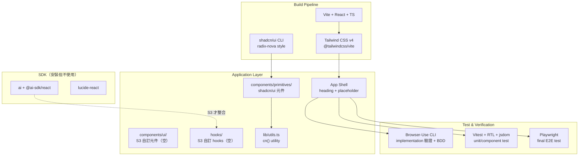
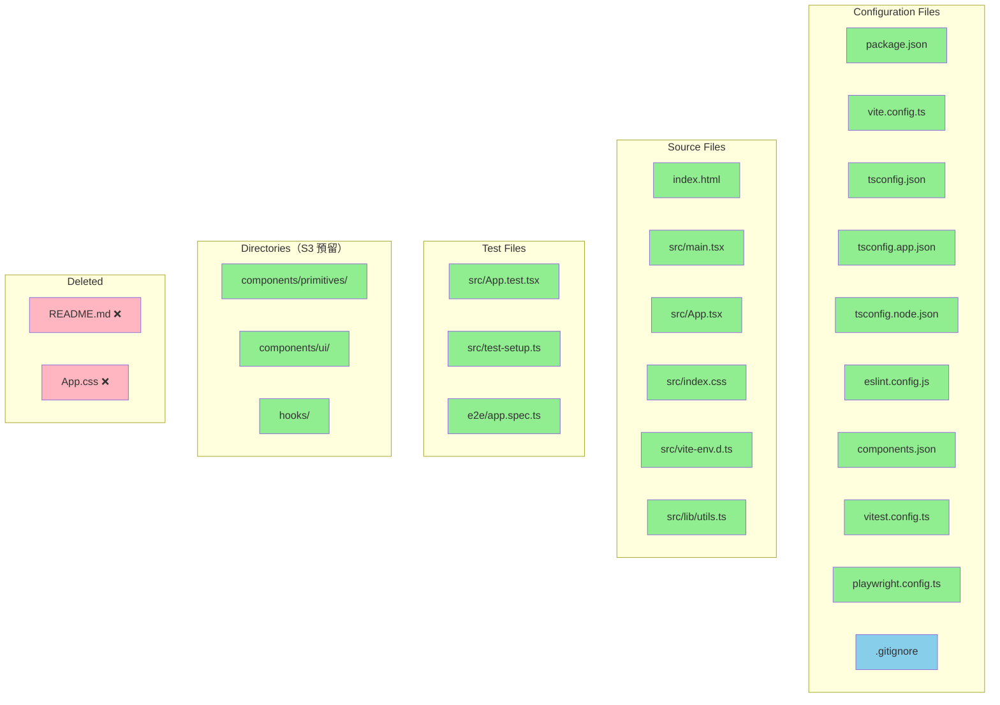

# S2 Frontend Scaffold Briefing

> Companion document to [`implementation_S2_frontend_scaffold.md`](./implementation_S2_frontend_scaffold.md) (implementation plan).
> Purpose: Architecture overview for human review and discussion.
> Updated: 2026-03-24 — Address directives: npm → pnpm, add Browser-Use CLI for BDD browser verification

---

## 1. Design Overview

S2 的目標是建立前端專案基礎建設，讓 S3 Streaming Chat UI 能在一個完整的 scaffold 上直接開發。這不是 UI feature，而是 tooling + infrastructure：build system、styling pipeline、component primitive 管線、以及雙層測試基礎設施（unit + E2E）。

### Architecture



### Design Decisions

| #   | 決策                      | 選擇                                  | 理由                                                            |
| --- | ------------------------- | ------------------------------------- | --------------------------------------------------------------- |
| D1  | Build tool                | Vite SPA                              | 不需 SSR/API routes，backend 全在 Python。排除 Next.js          |
| D2  | Styling                   | Tailwind CSS v4 + `@tailwindcss/vite` | CSS-first config，不需 `tailwind.config.js`                     |
| D3  | Component primitives 路徑 | `src/components/primitives/`          | 自訂 shadcn/ui `ui` alias，區隔 raw primitives 與 S3 自訂元件   |
| D4  | E2E framework             | Playwright                            | Cypress proxy 架構會 buffer SSE stream，無法測逐字出現          |
| D5  | Vitest config             | 獨立 `vitest.config.ts`               | 與 `vite.config.ts` 分離，test 用 jsdom 環境不影響 build config |

---

## 2. File Impact Map



> 🟢 綠色 = 新建 | 🔵 藍色 = 修改 | 🔴 粉紅 = 刪除

所有變更集中在 `frontend/` 目錄，唯一跨目錄影響是 root `.gitignore` 新增 `node_modules/`、`dist/`、`test-results/`、`playwright-report/`。Backend 完全不受影響。

---

## 3. Task Breakdown

### Task 1: Initialize Vite + React + TypeScript Project

移除 placeholder 檔案，用 `pnpm create vite@latest . --template react-ts` 在 `frontend/` 就地 scaffold。建立 build toolchain 和 dev server，所有後續 task 都依賴這一步。

### Task 2: Tailwind CSS v4 + shadcn/ui Setup

執行 `npx shadcn@latest init` 安裝 Tailwind CSS v4 + shadcn/ui。關鍵客製化：將 `components.json` 的 `ui` alias 從預設 `@/components/ui` 改為 `@/components/primitives`，確保 `npx shadcn@latest add button` 產出的檔案落在正確路徑。

**Critical contract — `components.json`：**

```json
{
  "aliases": {
    "ui": "@/components/primitives"
  }
}
```

- **Tests (TDD):** 無自動化測試。驗證方式為 `npx shadcn@latest add button` 確認檔案路徑 + `npx tsc --noEmit` 確認型別解析。

### Task 3: App Shell + Directory Structure + AI SDK

用 Tailwind utility classes 寫一個最小 App shell（`h1` heading + paragraph），建立 S3 預留的目錄結構（`components/ui/`、`hooks/`），安裝 `ai` + `@ai-sdk/react` + `lucide-react`。

- **Tests (TDD):** 無自動化測試。視覺確認 Tailwind styling + `pnpm ls` 確認 AI SDK 安裝。

### Task 4: Vitest + React Testing Library + Unit Test Baseline

建立 unit/component test 基礎設施。`vitest.config.ts` 使用 jsdom 環境，`test-setup.ts` 載入 jest-dom matchers。`App.test.tsx` 用 `screen.getByRole('heading')` 驗證 App shell rendering。Execution 過程中的 BDD browser 驗證使用 Browser-Use CLI，Playwright 僅用於最終 E2E test。

- **Tests (TDD):** 測試 App component 正確 render heading，驗證 Vitest + RTL + jsdom pipeline 端對端運作。使用 accessible query（`getByRole`）和 jest-dom matcher（`toHaveTextContent`）確認 test runner 和 DOM assertion library 正確接線。

### Task 5: Playwright E2E Setup + Baseline Test

建立 E2E test 基礎設施。`playwright.config.ts` 用 `webServer` 自動啟動 Vite dev server。`e2e/app.spec.ts` 導航到首頁驗證 heading 可見。

- **Tests (TDD):** 測試 Vite dev server → browser → Playwright assertion 完整 pipeline。使用 `toHaveText` auto-wait assertion，為 S3 的 streaming 驗證鋪路。

### Task 6: ESLint Verification + .gitignore + Final Acceptance

確認 ESLint 無 error，補齊 `.gitignore` entries（`dist/`、`test-results/`、`playwright-report/`），執行所有 10 項 acceptance criteria 作為最終 gate。

- **Tests (TDD):** 無新增測試。全面執行既有 unit + E2E test 作為 regression check。

### Integration Validation (BDD)

**Behavior:** 前端 scaffold 提供一個完整可運行的 Vite + React + TypeScript 開發環境，所有 tooling pipeline（styling、testing、linting、type checking）端對端運作。

**Agent validates:** 依序執行 `pnpm run dev`（dev server 啟動）→ `pnpm run test`（Vitest pass）→ `npx playwright test`（E2E pass）→ `npx tsc --noEmit`（零型別錯誤）→ `npx eslint .`（零 error）→ `pnpm run build`（production build 成功）。全部通過代表 scaffold 就緒。

**Behavior:** shadcn/ui CLI 可正常新增元件到自訂的 `primitives/` 路徑。

**Agent validates:** 執行 `npx shadcn@latest add button`，確認 `src/components/primitives/button.tsx` 存在且 `npx tsc --noEmit` 通過。

### Observable Verification (E2E)

| #   | Method  | Step                                 | Expected Result                                                              | Tag   |
| --- | ------- | ------------------------------------ | ---------------------------------------------------------------------------- | ----- |
| 1   | Browser-Use CLI | 開啟 `http://localhost:5173`         | 頁面載入，顯示 "FinLab-X" heading，Tailwind styling 生效（背景色、字型大小） | [E2E] |
| 2   | Browser-Use CLI | 檢查 `h1` computed styles            | `font-weight: 700`，`font-size` 符合 `text-3xl`                              | [E2E] |
| 3   | CLI     | `cd frontend && pnpm run test`        | Vitest: 1 test passes                                                        | [E2E] |
| 4   | CLI     | `cd frontend && npx playwright test` | Playwright: 1 test passes                                                    | [E2E] |
| 5   | CLI     | `cd frontend && npx tsc --noEmit`    | Exit code 0                                                                  | [E2E] |
| 6   | CLI     | `cd frontend && npx eslint .`        | Exit code 0，no errors                                                       | [E2E] |
| 7   | CLI     | `cd frontend && pnpm run build`       | Vite build 成功，`dist/` 產出                                                | [E2E] |

---

## 4. Test Impact Matrix

這是全新的前端專案 scaffold，不存在既有測試。

| Test File      | Description | Category | Reason                                 |
| -------------- | ----------- | -------- | -------------------------------------- |
| （無既有測試） | —           | —        | `frontend/` 目錄先前無任何原始碼或測試 |

所有測試（`App.test.tsx`、`e2e/app.spec.ts`）均為新建，已在 Task Breakdown 的 TDD 段落描述。

---

## 5. Environment / Config Changes

| Item                    | Before              | After                                                                |
| ----------------------- | ------------------- | -------------------------------------------------------------------- |
| Node.js                 | 已安裝（v21.7.3）   | 不變                                                                 |
| pnpm                    | 需確認是否已安裝     | 用於所有前端 package 管理（取代 npm）                                |
| `frontend/package.json` | Placeholder（一行） | Vite + React + TS + 所有依賴（pnpm-lock.yaml 取代 package-lock.json）|
| Root `.gitignore`       | Python-only entries | 新增 `node_modules/`、`dist/`、`test-results/`、`playwright-report/` |
| Playwright browsers     | 未安裝              | `npx playwright install --with-deps chromium`                        |

**新增 production dependencies：** `react`, `react-dom`, `ai`, `@ai-sdk/react`, `tailwindcss`, `@tailwindcss/vite`, `lucide-react`, `clsx`, `tailwind-merge`, `class-variance-authority`, `tw-animate-css`

**新增 dev dependencies：** `typescript`, `vite`, `@vitejs/plugin-react`, `vitest`, `jsdom`, `@testing-library/react`, `@testing-library/jest-dom`, `@testing-library/user-event`, `@playwright/test`, `eslint` + React/TS plugins

---

## 6. Risk Assessment

| Risk                                                                             | Affected Area                                            | Mitigation                                                                                                         |
| -------------------------------------------------------------------------------- | -------------------------------------------------------- | ------------------------------------------------------------------------------------------------------------------ |
| `npx shadcn@latest init` 的互動式 prompt 可能因環境差異產生不同結果              | `components.json`、`vite.config.ts`、`tsconfig.app.json` | Plan 明確列出每個 prompt 的預期答案。init 完成後逐一驗證 config 檔案是否符合 critical contract                     |
| shadcn/ui 自訂 `ui` alias 為 `@/components/primitives` 可能與 CLI 預設行為不一致 | `components.json`、未來 `npx shadcn@latest add` 指令     | Task 2 包含 `npx shadcn@latest add button` 驗證步驟，確認檔案落在正確路徑後才 commit                               |
| Tailwind CSS v4 是相對新的 major version，與某些 shadcn/ui 元件可能有相容性問題  | `src/index.css`、shadcn/ui primitives                    | `npx shadcn@latest init -t vite` 官方支援 v4。若遇問題，S2 scope 只需確認基礎 utility classes 運作，不涉及複雜元件 |
| AI SDK v5 的 `useChat` API 與 v4 不同（`sendMessage` + `message.parts[]`）       | S3 scope，但 S2 安裝版本決定 S3 可用的 API               | S2 僅安裝不使用。Dependencies Verification 已透過 Context7 確認 v5 API pattern                                     |

---

## 7. Decisions & Verification

### Decisions

1. **Vite SPA over Next.js** — backend 全在 Python FastAPI，前端不需 SSR、API routes、server components
2. **Tailwind CSS v4 + `@tailwindcss/vite` plugin** — CSS-first config，不需 `tailwind.config.js`，shadcn/ui 官方支援
3. **shadcn/ui `ui` alias → `@/components/primitives/`** — 區隔 CLI 產出的 raw primitives 和 S3 自行組合的 `components/ui/`
4. **Playwright over Cypress** — Cypress proxy 架構會 buffer SSE stream，無法驗證逐字出現效果（為 S3 鋪路）
5. **獨立 `vitest.config.ts`** — test 環境用 jsdom，與 build config 分離避免干擾
6. **AI SDK v5（`ai` + `@ai-sdk/react`）** — S2 僅安裝確認型別相容，S3 才整合 `useChat`

### Human Verification Plan

**Happy Path：**

1. 在 `frontend/` 目錄執行 `pnpm run dev`
2. 開啟 `http://localhost:5173`
3. 確認看到 "FinLab-X" heading，文字有 Tailwind styling（粗體、正確字型大小、背景色）
4. 執行 `pnpm run test` → 1 test passes（`App > renders the heading`）
5. 執行 `npx playwright test` → 1 test passes（`app shell loads and displays heading`）
6. 執行 `pnpm run build` → `dist/` 目錄產出成功

**Edge Cases：**

1. 執行 `npx shadcn@latest add button` → 確認檔案出現在 `src/components/primitives/button.tsx`（不是 `src/components/ui/`）
2. 在任意 `.tsx` 檔案中使用 `import { cn } from '@/lib/utils'` → `npx tsc --noEmit` 無錯誤（驗證 `@/` path alias）

**Regression：**

1. Backend 完全不受影響 — 執行 `cd backend && pytest tests/` 確認既有測試仍通過（如有）
