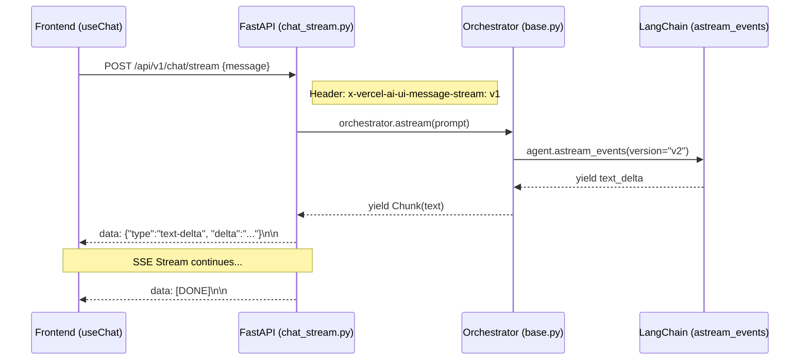
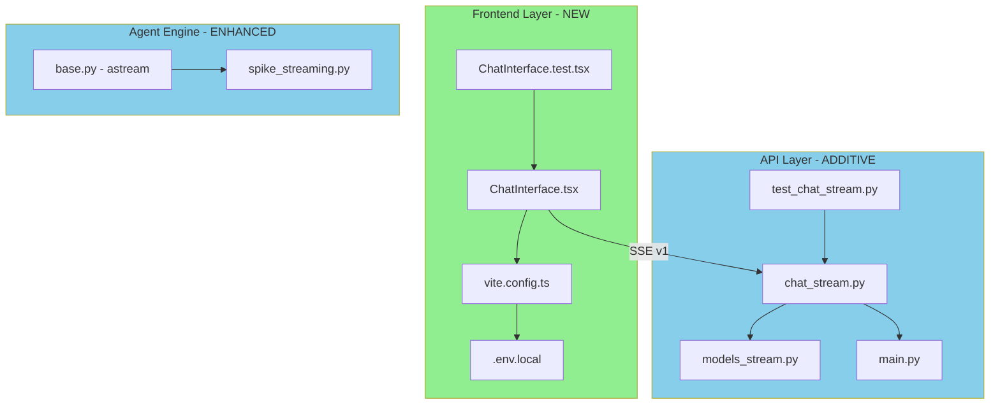

# V1 Streaming Chat Briefing

> Companion document to [`implementation.md`](./implementation.md) (implementation plan).
> Purpose: Architecture overview for human review and discussion.

## 1. Design Overview

**架構決策與設計思路**：
本設計採用 **FastAPI (Backend) + Vite + React (Frontend)** 的架構，透過 **SSE (Server-Sent Events) v1** 協議實現流式對話。

### 核心互動流程 (Sequence Diagram)

### 設計決策 (Design Decisions)

| 維度              | 選擇方案                 | 理由                                                                                |
| :---------------- | :----------------------- | :---------------------------------------------------------------------------------- |
| **Transport**     | SSE (Server-Sent Events) | Vercel AI SDK 原生支援，且 FastAPI 實作成本最低 (D1)。                              |
| **Backend 邏輯**  | `Orchestrator.astream()` | 遵循 Clean Architecture，將 Streaming 邏輯封裝在 Agent Engine (D6)。                |
| **Frontend 框架** | Vite + React + TS        | 輕量且開發體驗佳，避開 Next.js 的過度封裝 (D3)。                                    |
| **Protocol**      | AI SDK UI Stream v1      | 確保與 `useChat` hook 無縫整合，需嚴格遵守 `x-vercel-ai-ui-message-stream` header。 |

---

## 2. File Impact Map

展示本次變動影響的文件範圍與依賴關係。

---

## 3. Task Breakdown

### Wave 1: 基礎設施與協議 (W1)

- **T1: Streaming Feasibility Spike** (T1): 驗證 LangChain `astream_events` 輸出。
- **T2: Frontend Scaffold** (T2): 初始化 Vite 專案。
- **T4: SSE Protocol Contracts** (T4): 定義符合 AI SDK 規範的 Pydantic models。
  - **Critical Code**: 定義 `StreamEvent` 序列化格式，確保符合 `data: {json}\n\n`。
- **T3: UI Foundation** (T3): 導入 Tailwind + shadcn/ui。
- **T5: Orchestrator Adapter** (T5): 在 `Orchestrator` 中實現 `astream` 異步產生器。

### Wave 2: 接口與客戶端實作 (W2)

- **T6: FastAPI Stream Router** (T6): 建立 `/api/v1/chat/stream`。
  - **Tests (TDD)**: 測試 `StreamingResponse` 是否帶有正確的 Content-Type 與 AI SDK 特有 Header。
- **T7: Backend TDD Suite** (T7): 完整的 SSE 協議邊界測試。
- **T8: Frontend useChat UI** (T8): 整合 `useChat` 與對話介面。
- **T9: Frontend TDD** (T9): 測試 Streaming 狀態 (Loading, Error)。
- **T10: Vite Proxy Setup** (T10): 解決開發環境 CORS 問題。

### Wave 3: 穩定化 (W3)

- **T11: Contract Checks** (T11): 確保 Tool-call 事件不會導致前端解析失敗。
- **T12: E2E Verification** (T12): 錄製完整的對話串流過程。
- **T13: Documentation Sync** (T13): 更新 README 與架構圖。

---

## 4. Integration Validation (BDD)

- **Behavior**: 使用者在前端輸入後，能看到 AI 逐字回傳，且中途斷線時 UI 能正確顯示錯誤。
- **Agent Validates**:
  - 啟動 Backend & Frontend。
  - 使用 `curl` 模擬慢速串流，觀察 chunk 抵達順序。
  - 執行 `vitest` 模擬串流中斷，確認 `error` 狀態被觸發。

### Observable Verification (E2E)

| #   | Method  | Step                                      | Expected Result                               | Tag   |
| --- | ------- | ----------------------------------------- | --------------------------------------------- | ----- |
| 1   | curl    | `curl -N -X POST /api/v1/chat/stream ...` | 輸出包含 `text-delta` chunk，以 `[DONE]` 結尾 | [E2E] |
| 2   | browser | 開啟 http://localhost:5173，發送 "Hi"     | 看到內容即時顯示，而非整塊出現                | [E2E] |
| 3   | logs    | 檢查 FastAPI console                      | 無 `broken pipe` 或異步未關閉報錯             | [E2E] |

---

## 5. Test Impact Matrix

| Test File      | Description       | Category  | Reason                                            |
| :------------- | :---------------- | :-------- | :------------------------------------------------ |
| `test_chat.py` | 既有同步對話測試  | Guardrail | 確保新增 Streaming 路徑不破壞既有 `/chat` (D2)。  |
| `conftest.py`  | API 測試 Fixtures | Adjust    | 可能需要新增支援 Streaming 的 Mock Orchestrator。 |

---

## 6. Environment / Config Changes

| Env Var        | Value (Example)             | Description              |
| :------------- | :-------------------------- | :----------------------- |
| `VITE_API_URL` | `http://localhost:5173/api` | 前端呼叫 API 的 base URL |

- **Dependencies**: 新增 `ai`, `@ai-sdk/react`, `vitest`, `shadcn/ui` 相關組件。

---

## 7. Risk Assessment

| Risk                  | Affected Area          | Mitigation                                                        |
| :-------------------- | :--------------------- | :---------------------------------------------------------------- |
| **Protocol Mismatch** | `chat_stream.py`       | 嚴格執行 T11 的 Byte-level 檢查，確保 `\n\n` 分隔符正確。         |
| **Async Blocking**    | `Orchestrator.astream` | 使用 `astream_events` 確保全程非同步，不阻塞 FastAPI event loop。 |
| **CORS Issues**       | `vite.config.ts`       | 透過 Vite Dev Proxy 統一轉發，避免開發期複雜的 CORS 設定。        |

---

## 8. Decisions & Verification

### Decisions

1. **D1**: 僅使用 `StreamingResponse` (零新增依賴)。
2. **D2**: 獨立路徑 `/chat/stream` (零回歸風險)。
3. **D3**: Vite + React (前端標準化)。

### Verification (Human Reviewer)

1. **Happy Path**:
   - 開啟前端畫面，輸入 "Analyze NVDA stock"。
   - 確認文字是「逐字出現」而非等待數秒後整塊出現。
2. **Edge Cases**:
   - 在對話串流中點擊瀏覽器「重新整理」，確認後端不會報錯或殘留 thread。
   - 輸入空字串，確認前端有基本驗證或錯誤處理。
3. **Negative Cases**:
   - 呼叫舊有的 `/api/v1/chat`，確認行為與以前完全一致。
