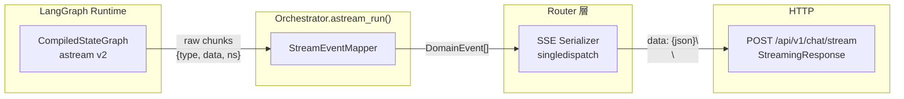
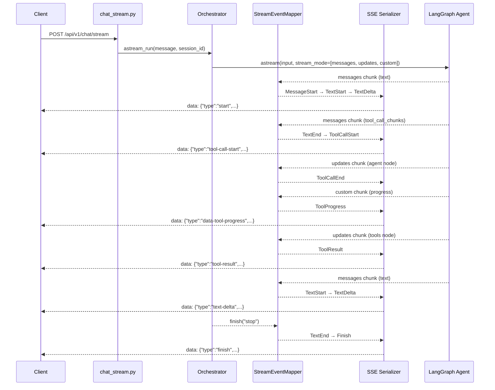
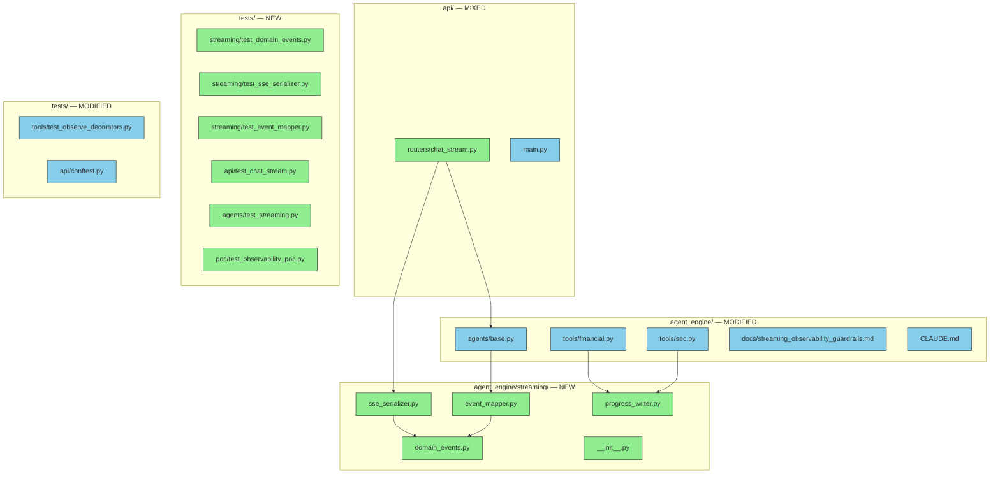

# S1 Backend Streaming Briefing

> Companion document to [`implementation_S1_backend_streaming.md`](./implementation_S1_backend_streaming.md)（implementation plan）。
> 架構概覽，供人類 review 與討論。

---

## 1. Design Overview

### 核心架構

S1 在現有 `Orchestrator` 上新增 streaming 路徑。LangGraph `astream()` 產出的 raw chunks 經由三層轉換後變成 AI SDK 前端可直接消費的 SSE stream：

### 資料流時序

完整的一次對話（帶 tool call）從 LangGraph 到 SSE 的事件時序：

### 設計決策摘要

| # | 決策 | 選擇 | 理由 |
|---|------|------|------|
| D1 | Streaming 基礎 | `astream(stream_mode=["messages", "updates", "custom"], version="v2")` | 三種 mode 各提供不同維度的資訊，v2 統一 chunk format |
| D2 | Tool error wire format | `data-tool-error`（custom event） | AI SDK v5 無標準 `tool-error` event type |
| D3 | Conversation store | `InMemorySaver` checkpointer | 取代自建 interface，checkpointer 自動管理 state persistence |
| D5 | Tool observability | 移除 `@observe()`，依賴 `CallbackHandler` | `CallbackHandler` 已自動 trace，兩者並存是重複 tracing |
| D6 | Serializer pattern | `functools.singledispatch` | 每個 event type 獨立 register，忘了 register 會 TypeError |
| D8 | Request body | Plain string（非 UIMessage） | Backend 不需理解 UIMessage 結構 |

---

## 2. File Impact Map

**變更規模：** 新增 12 個檔案、修改 7 個檔案、不刪除任何檔案。

---

## 3. Task Breakdown

### Task 1：Observability POC — Checkpointer + 5 Gate 驗證

> 📍 Plan reference: Task 1

在建構 streaming pipeline 前，先加入 `InMemorySaver` checkpointer 並執行 5 個 observability gates，驗證 `CallbackHandler` + `astream()` 的 tracing 正確性。任何 gate 失敗代表整體方向可能需要修正。

**TDD 測試：**
- POC 為手動驗證腳本（不納入 CI），5 個 gates 各自 assert tracing 行為
- 既有 Orchestrator 測試確認 checkpointer 加入不破壞 `run()` / `arun()`

---

### Task 2：Domain Events + SSE Serializer

> 📍 Plan reference: Task 2

定義 11 個 frozen `DomainEvent` dataclass 作為 mapper → serializer 的介面契約，並實作 `singledispatch` serializer 將 domain events 轉為 AI SDK wire format。

**架構關鍵 — `DomainEvent` 型別：** `MessageStart` | `TextStart` | `TextDelta` | `TextEnd` | `ToolCallStart` | `ToolCallEnd` | `ToolResult` | `ToolError` | `ToolProgress` | `StreamError` | `Finish`

**架構關鍵 — 欄位映射：** `message_id` → `"messageId"`、`text_id` → `"id"`、`tool_call_id` → `"toolCallId"`。`ToolProgress` 帶 `"transient": true`。`ToolError` 的 wire type 為 `"data-tool-error"`。

**TDD 測試：**
- 11 個 event types 可正確實例化且為 frozen
- 11 個 event types 各自序列化為正確 JSON（欄位映射、CJK 支援、`data: {...}\n\n` 格式）
- `Finish` 帶 token counts 時含 `usage` object，不帶時省略
- 未註冊 type raise `TypeError`

---

### Task 3：StreamEventMapper

> 📍 Plan reference: Task 3

實作核心翻譯層：LangGraph v2 chunks → `DomainEvent` 序列。追蹤 text block 狀態、pending tool calls、`MessageStart` 發送狀態。公開 `close_text_block()` 供 error handling 使用。

**TDD 測試：**
- 純文字串流產出正確的 `MessageStart` → `TextStart` → `TextDelta` → `TextEnd` → `Finish` 序列
- Tool call 完整生命週期：`ToolCallStart` → `ToolCallEnd` → `ToolResult`
- 文字 → tool → 文字 的 text block 開關轉換
- `ToolMessage(status="error")` 映射為 `ToolError`
- Custom chunk 的 `toolName` 反查產出正確 `ToolProgress`；未知 tool 靜默跳過
- `MessageStart` 只發一次

---

### Task 4：Progress Writer + Tool 變更

> 📍 Plan reference: Task 4

建立 `get_progress_writer()` helper，並修改 4 個 tools：移除 `@observe()` decorator、加入 progress writer 呼叫。這是 design decision D5 的實作。

**TDD 測試：**
- `get_progress_writer()` 在 streaming context 外回傳 no-op callable（不拋 exception）
- 移除 `@observe()` 後，4 個 tools 的 `name`、`description`、`args_schema` 仍完整

---

### Task 5：Orchestrator.astream_run()

> 📍 Plan reference: Task 5

核心 streaming method，串接 checkpointer、`StreamEventMapper`、Langfuse tracing。接受 `message: str | None` — `None` 代表 regenerate（`astream()` 收到 `None` input，從 checkpoint 的既有 messages 繼續）。

**TDD 測試：**
- Happy path：mock astream yields text chunks → 正確 event 序列含 `Finish("stop")`
- Tool call：mock astream yields messages + updates → 正確 tool lifecycle events
- 串流中錯誤：yields `StreamError` + `Finish("error")`
- 文字開啟中遇錯：先 yield `TextEnd`（via `close_text_block()`）再 `StreamError`
- Session ID 傳播至 `configurable.thread_id`
- Langfuse `CallbackHandler` 包含在 config callbacks
- Regenerate 模式：`message=None` 時 astream 收到 `None` input

---

### Task 6：FastAPI SSE Endpoint

> 📍 Plan reference: Task 6

實作 `POST /api/v1/chat/stream`，處理新訊息和 regenerate 兩種流程、per-session 並行鎖、AI SDK 必要 headers。Regenerate 流程從 checkpointer 載入 state、移除最後 assistant turn、呼叫 `astream_run(None, session_id)` 從更新後的 checkpoint 繼續。

**TDD 測試：**
- 新訊息回傳 `text/event-stream`，含 `start` 和 `finish` events
- 自動產生 session ID（有效 UUID）
- 4 個必要 headers 皆存在
- 空訊息 / 缺少 message → 422
- 有效 regenerate → SSE stream
- 不存在的 session regenerate → 404
- Orchestrator 錯誤 → stream 含 `error` + `finish` events

---

### Task 7：Observability 文件更新

> 📍 Plan reference: Task 7

更新 `streaming_observability_guardrails.md` 和 `CLAUDE.md` 的 Rule 3 用語，反映 `@observe()` 移除後的新策略。

---

### Integration Validation（BDD）

| Behavior | Agent 驗證方式 |
|----------|---------------|
| 一個 streaming request 產生恰好一個 Langfuse trace，含正確 `session_id` 和巢狀 tool observations | POC Gate 1+2 通過 + curl 後檢查 Langfuse dashboard |
| 前端收到的 SSE stream 符合 AI SDK UIMessage Stream Protocol v1 | 所有 SSE serializer 測試通過 + curl 輸出比對 design 的「完整 SSE Stream 範例」 |
| 同一 `session_id` 的多次 request 自動累積對話歷史（via checkpointer） | curl 送兩次訊息（同 session ID），第二次 response 反映第一次對話 context |
| Stream 中途錯誤不會讓前端收到截斷的 stream | error handling 測試通過：stream 永遠以 `finish` event 結束 |
| 移除 `@observe()` 後 tool tracing 品質不退化 | POC Gate 2：tool observation 存在、name/args/result/duration 有紀錄 |
| Regenerate 重新生成最後一條 assistant message 而非重複 user message | Regenerate 測試通過 + curl 手動驗證 regenerated response 不含重複 |

### Observable Verification（E2E）

| # | 方法 | 步驟 | 預期結果 | Tag |
|---|------|------|----------|-----|
| 1 | curl | `curl -N -X POST http://localhost:8000/api/v1/chat/stream -H "Content-Type: application/json" -d '{"message": "TSMC 最近表現如何？"}'` | SSE stream 包含 `start`、`text-delta`（多個）、`tool-call-start`、`tool-result`、`finish` events | [E2E] |
| 2 | curl（headers） | 同上加 `-v` | `content-type: text/event-stream`、`x-vercel-ai-ui-message-stream: v1`、`cache-control: no-cache` | [E2E] |
| 3 | Trace 檢視 | 在 Langfuse dashboard 找到上述 request 的 trace | 一個 trace、正確 session_id、tool observation 為 child | [E2E] |
| 4 | curl（regenerate） | 用步驟 1 的 session ID 送 `{"id": "...", "trigger": "regenerate", "messageId": "..."}` | 新 SSE stream 包含 regenerated response | [E2E] |
| 5 | 測試套件 | `cd backend && python -m pytest tests/ -v --ignore=tests/poc --ignore=tests/integration` | 全部通過 | [E2E] |
| 6 | Lint | `cd backend && ruff check .` | 無錯誤 | [E2E] |

---

## 4. Test Impact Matrix

> 新增測試已在上方 Task Breakdown 的 TDD 區塊說明。以下僅列出受影響的**既有**測試。

| 測試檔案 | 測試名稱 / 描述 | 分類 | 原因 |
|----------|----------------|------|------|
| `tests/agents/test_base.py` | Orchestrator 初始化、`run()`、`arun()` 測試 | Guardrail | checkpointer 加入不應影響既有同步/非同步呼叫路徑 |
| `tests/api/test_chat.py` | `POST /api/v1/chat` endpoint 測試 | Guardrail | 現有 endpoint 完全不動 |
| `tests/tools/test_financial.py` | yfinance + Tavily tool 測試 | Guardrail | 移除 `@observe()` 不影響 tool 核心邏輯 |
| `tests/tools/test_sec.py` | SEC tool 測試 | Guardrail | 同上 |
| `tests/tools/test_registry.py` | Tool registry 操作測試 | Guardrail | Registry 不受影響 |
| `tests/tools/test_observe_decorators.py` | `@observe()` decorator 驗證 | Adjust | 移除 `test_tools_use_observe_decorator`（不再適用）；保留 `test_tool_schema_intact` |
| `tests/api/conftest.py` | API 測試共用 fixtures | Adjust | 需為 mock agent 加入 `astream` async generator mock |

---

## 5. Environment / Config 變更

| 項目 | Before | After | 備註 |
|------|--------|-------|------|
| Python 依賴 | 無新增 | 無新增 | `InMemorySaver`、`get_stream_writer` 皆為 `langchain>=1.2.10` / LangGraph 既有 API |
| 環境變數 | 無變更 | 無變更 | Langfuse 相關環境變數沿用現有設定 |
| API Endpoints | `POST /api/v1/chat` | + `POST /api/v1/chat/stream` | 新增 endpoint，現有 endpoint 不動 |

無新增依賴、無新增環境變數、無 CI/CD 變更。

---

## 6. Risk Assessment

| 風險 | 影響範圍 | 緩解措施 |
|------|---------|---------|
| `CallbackHandler` 在 `astream()` 中的行為與 `ainvoke()` 不同（trace 碎片、context 丟失） | `agents/base.py` — 所有 streaming requests 的 observability | Task 1 POC 的 5 個 gates 專門驗證此風險。Gate 失敗即停止，不會進入正式實作 |
| `InMemorySaver` 在 server 重啟後遺失所有對話歷史 | `chat_stream.py` — regenerate 找不到 session | Endpoint 對空 state 回傳 404。V1 已知限制，V2 換 `PostgresSaver` |
| 移除 `@observe()` 後工具 tracing 退化 | `tools/financial.py`、`tools/sec.py` — 4 個 tools 的 Langfuse trace 品質 | POC Gate 2 驗證 `CallbackHandler` 自動 trace。design 中已論證 `@observe()` 在 LangGraph 下產生 disconnected traces，移除反而改善品質 |
| `get_stream_writer()` 在非 streaming context 中 raise `RuntimeError` | `tools/financial.py`、`tools/sec.py` — 所有 tool 呼叫 | `get_progress_writer()` 以 try/except 包裝，fallback 為 no-op。既有 `run()` / `arun()` 路徑不受影響 |
| Per-session lock dict `_session_locks` 無 cleanup 機制 | `chat_stream.py` — 長時間運行的 server | V1 僅 in-memory，server 重啟即清空。V2 需加入 TTL 或 WeakValueDictionary |
| `toolName` 反查在同名 tool 平行呼叫時有歧義 | `event_mapper.py` — `ToolProgress` 的 `tool_call_id` 配對 | V1 限制。Design 已記錄改進方向（`ToolRuntime`）。POC 選擇性驗證 |

---

## 7. Decisions & Verification

### 決策紀錄

1. **Observability POC 先行** — 5 gates 全通過才開始正式實作，避免在錯誤假設上建構整個 pipeline
2. **Domain event 解耦** — LangGraph chunk format 與 SSE wire format 各自獨立演進，mapper 和 serializer 可單獨測試
3. **`singledispatch` serializer** — 每個 event type 獨立 register，忘記 register 在 runtime 即爆炸（fail fast）
4. **`astream_run(message: str | None)`** — `None` 代表 regenerate，避免 endpoint 直接操作 astream 的複雜度
5. **移除 `@observe()` + 依賴 `CallbackHandler`** — 消除 disconnected traces，單一 tracing 來源
6. **`TestClient` 測試 SSE** — buffer 完整 response 後驗證 content 和 headers，V1 足夠

### 人工驗證計畫

以下驗證在 agent 完成所有 tasks、所有測試通過後執行。

**Happy Path：**
1. 啟動 server：`cd backend && uvicorn backend.api.main:app --port 8000`
2. 送一則帶 tool call 的查詢：`curl -N -X POST http://localhost:8000/api/v1/chat/stream -H "Content-Type: application/json" -d '{"message": "TSMC 最近表現如何？"}'`
3. 確認 SSE 輸出包含完整的 `start` → `text-delta` → `tool-call-start` → `tool-result` → `text-delta` → `finish` 序列
4. 確認 response headers 包含 `x-vercel-ai-ui-message-stream: v1`
5. 在 Langfuse dashboard 確認該 request 有一個 trace、tool observations 正確巢狀

**Regenerate：**
1. 記下步驟 2 回傳的 session ID
2. 送 regenerate request：`curl -N -X POST http://localhost:8000/api/v1/chat/stream -H "Content-Type: application/json" -d '{"id": "<session-id>", "trigger": "regenerate", "messageId": "<msg-id>"}'`
3. 確認收到新的 SSE stream，包含不同的 response 內容

**Edge Cases：**
1. 空訊息：`curl -X POST http://localhost:8000/api/v1/chat/stream -H "Content-Type: application/json" -d '{"message": ""}'` → HTTP 422
2. 不存在的 session regenerate：`curl -X POST http://localhost:8000/api/v1/chat/stream -H "Content-Type: application/json" -d '{"id": "nonexistent", "trigger": "regenerate", "messageId": "msg_001"}'` → HTTP 404

**Regression：**
1. 現有 endpoint 不受影響：`curl -X POST http://localhost:8000/api/v1/chat -H "Content-Type: application/json" -d '{"message": "Hello"}'` → 正常 JSON response
2. 完整測試套件通過：`cd backend && python -m pytest tests/ -v --ignore=tests/poc --ignore=tests/integration`
