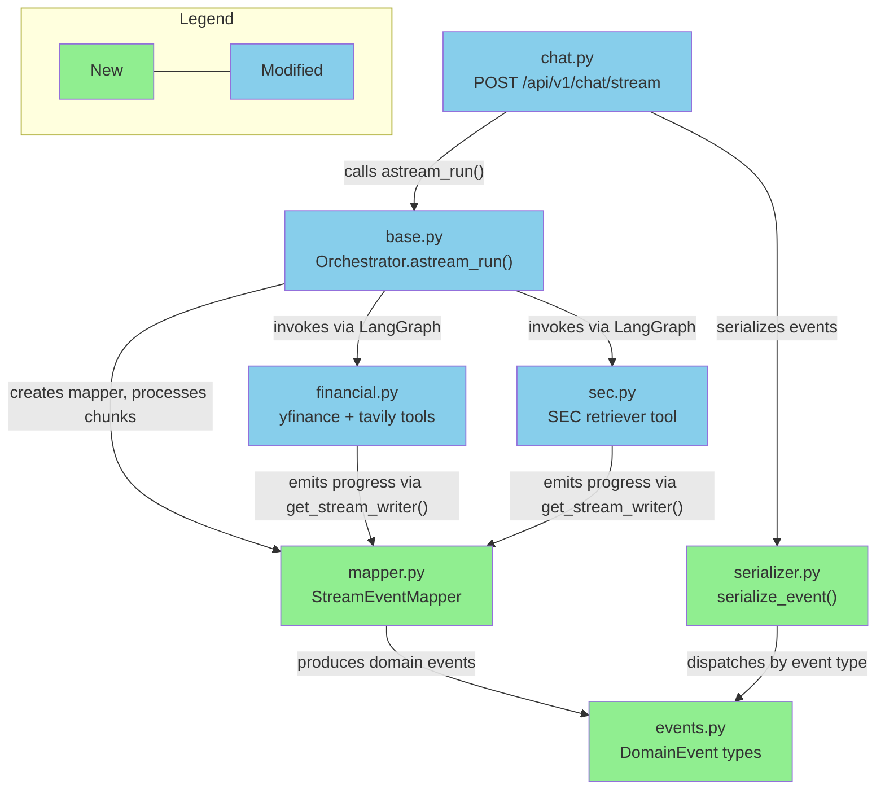

# Briefing: S1 Backend Streaming

> Source Artifacts:
> - Implementation: `implementation_S1_backend_streaming.md`
> - BDD Scenarios: `bdd_scenarios_s1_backend_streaming.md`
> - Verification Plan: `verification_plan_s1_backend_streaming.md`
> - Design: `design_S1_backend_streaming_v2.md`

---

## 1. Design Delta

> ⚠️ 以下有 1 項發現需要回到 design 階段補充，建議先處理再繼續檢閱。

### 需補充 design

#### `Finish` event 的 `usage` 欄位未列入 design event 表格

- **Design 原文**: Domain events 表格定義 `Finish(finish_reason)`，只有一個欄位
- **實際情況**: Implementation 定義 `Finish(finish_reason: str, usage: dict[str, int])`，新增 `usage` 欄位。Design 有提到 `finish` event 需輸出 `usage`，但 event 表格漏列
- **影響**: 合理的擴充，但 design event 表格與 implementation 不一致
- **Resolution**: 需補充 design

### 需確認

#### `MessageStart` 缺少 `session_id` 欄位（DD-02）

- **Design 原文**: Domain events 表格定義 `MessageStart(message_id, session_id)`；DD-02 要求 `start` event 含 `sessionId` 作為 confirmation echo
- **實際情況**: Implementation Task 2 的 `MessageStart` 只有 `message_id: str`；Task 3 serializer 只輸出 `{"type": "start", "messageId": event.message_id}`，無 `sessionId`
- **影響**: 前端無法收到 session ID confirmation echo，破壞 DD-02 契約
- **Resolution**: 需確認

#### `id` 欄位必填 vs optional（DD-01）

- **Design 原文**: DD-01 明確將 `id` 改為必填，空字串拒絕（422）
- **實際情況**: Task 7 的 `StreamChatRequest` 定義 `id: str | None = None`（optional），endpoint 邏輯 `session_id = body.id or str(uuid.uuid4())` 在缺失時自動生成 UUID
- **影響**: 直接違反 DD-01。Auto-generation 路徑引入 DD-01 試圖避免的 data leakage 和 session management 模糊問題
- **Resolution**: 需確認

#### 同 session 並發 409 Conflict 機制缺失（DD-03）

- **Design 原文**: DD-03 要求 per-session non-blocking lock，同一 session 並發 request 立即回 HTTP 409
- **實際情況**: Task 7 endpoint 無任何 per-session lock 或 409 邏輯，test strategy 也未提及
- **影響**: 同一 session 並發 streaming request 可能同時操作 checkpointer，導致 state corruption
- **Resolution**: 需確認

#### Regenerate `messageId` 嚴格驗證缺失（DD-04）

- **Design 原文**: DD-04 要求 `messageId` 必須匹配最後 assistant message，不匹配回 422
- **實際情況**: Task 6 `astream_run()` 的 signature 無 `message_id` 參數，regenerate 路徑只做 `_trim_last_assistant_turn()` 而未驗證 `messageId`
- **影響**: 無法確認前端要求 regenerate 的 message 是否為最後一條 assistant message，可能靜默移除錯誤的 turn
- **Resolution**: 需確認

#### Tool error sanitization boundary 缺失

- **Design 原文**: Design 要求 `data-tool-error` 的 `error` 欄位需過濾 API keys、internal paths、stack traces
- **實際情況**: 無任何 task 包含 sanitization 邏輯。Task 4 mapper 直接透傳 `ToolMessage` 的 error content；Task 6 用 `str(exc)` 作為 `StreamError.error_text`
- **影響**: 敏感資訊可能洩漏到 SSE output
- **Resolution**: 需確認

#### `ToolResult.result` 型別限定為 `str`

- **Design 原文**: Design 未限定 `result` 型別；LangGraph `ToolMessage` 的 content 可為 string 或 structured dict
- **實際情況**: Task 2 定義 `ToolResult.result: str`
- **影響**: 若 tool 回傳結構化 dict，mapper 需先 serialize 為 string。不一定是 bug，但需確認 mapper 轉換邏輯
- **Resolution**: 需確認

#### DD-05 Fatal error 時 mapper `finalize()` 行為未明確

- **Design 原文**: DD-05 要求 fatal error 不為 pending tool calls 補 synthetic events
- **實際情況**: Task 6 exception handler 直接 yield `StreamError` + `Finish("error")` 不走 `finalize()`，符合 DD-05。但 `finalize()` 在非 exception 路徑下若仍有 pending tool calls，行為未定義
- **影響**: 低風險（exception 路徑不走 finalize），但 edge case 需確認
- **Resolution**: 需確認

#### DD-06 Post-restart amnesia 未記載或測試

- **Design 原文**: DD-06 明確定義 `InMemorySaver` 重啟後消失為 accepted V1 behavior
- **實際情況**: 無任何 task 的 notes 或 test strategy 提及此行為
- **影響**: 低風險（`InMemorySaver` 本身就是此行為），但缺少文件可能讓未來維護者誤認為 bug
- **Resolution**: 需確認

#### 衝突 Request 的 dispatch 規則隱式處理

- **Design 原文**: 同時含 `message` 和 `trigger: "regenerate"` 的 request 需有 deterministic dispatch 規則
- **實際情況**: `is_regenerate = body.trigger == "regenerate"` 隱式走 regenerate 路徑並忽略 `message`，未在 validation 層或 test strategy 中明確記載
- **影響**: 使用者可能困惑為何 `message` 被忽略。Design 建議的「直接 422 拒絕」可能更安全
- **Resolution**: 需確認

---

## 2. Overview

本次實作 backend streaming 能力——從 LangGraph agent 取得即時 chunks，經 `StreamEventMapper` 翻譯為 domain events，再由 SSE Serializer 轉換為 AI SDK UIMessage Stream Protocol v1 的 wire format，透過 FastAPI `POST /api/v1/chat/stream` endpoint 送出。共拆為 8 個 tasks（1 個 POC 驗證 + 6 個 implementation + 1 個文件更新）。最大風險是三層翻譯 pipeline（LangGraph chunks → domain events → SSE wire format）必須精確對齊 AI SDK protocol 規範，任何 event lifecycle 配對錯誤（如 `text-start`/`text-end` 未閉合、`tool-call-start` 缺少對應 `tool-result`）都會導致前端 parser 狀態異常。

---

## 3. File Impact

### (a) Folder Tree

```
backend/
  agent_engine/
    streaming/                          (new — streaming pipeline package)
      __init__.py                       (new — re-export public API)
      events.py                         (new — 11 domain event frozen dataclasses)
      mapper.py                         (new — LangGraph chunks → domain events)
      serializer.py                     (new — domain events → SSE wire format)
    agents/
      base.py                           (modified)
    tools/
      financial.py                      (modified)
      sec.py                            (modified)
    docs/
      streaming_observability_guardrails.md  (modified)
  api/
    routers/
      chat.py                           (modified)
  tests/
    poc/
      __init__.py                       (new — POC test package)
      test_observability_gates.py       (new — Langfuse/Braintrust POC gates)
    streaming/
      __init__.py                       (new — streaming test package)
      test_events.py                    (new — domain event unit tests)
      test_serializer.py                (new — SSE serializer unit tests)
      test_mapper.py                    (new — StreamEventMapper unit tests)
    agents/
      test_astream_run.py               (new — orchestrator streaming tests)
    api/
      test_chat_stream.py               (new — streaming endpoint tests)
```

### (b) Dependency Flow



---

## 4. Task 清單

| Task | 做什麼 | 為什麼 |
|------|--------|--------|
| 1 | POC 驗證 `astream()` + `CallbackHandler` 的 observability gates 1-6 | Design 明確要求 POC 全部通過才能寫 production code |
| 2 | 建立 11 個 frozen domain event dataclasses | 作為 streaming pipeline 的中間表示層，解耦 LangGraph 和 SSE format |
| 3 | 實作 SSE serializer（`singledispatch` pattern） | 將 domain events 轉換為 AI SDK UIMessage Stream Protocol v1 wire format |
| 4 | 實作 `StreamEventMapper`（有狀態翻譯器） | 追蹤 text block 和 tool call 生命週期，補充 LangGraph 不產生的 lifecycle events |
| 5 | 移除 tools 上的 `@observe()`，加入 `get_stream_writer()` progress | `@observe()` 與 `CallbackHandler` 重複且產生 disconnected traces（D5 決策） |
| 6 | 為 `Orchestrator` 新增 `astream_run()` + `InMemorySaver` checkpointer | 提供 streaming 入口和 conversation state 管理 |
| 7 | 新增 `POST /api/v1/chat/stream` SSE endpoint | 前端需要 streaming response 介面，支援新訊息和 regenerate |
| 8 | 更新 `streaming_observability_guardrails.md` Rule 3 | 反映 D5 決策：graph-managed tools 不適用 `@observe()` |

---

## 5. Behavior Verification

> 共 28 個 illustrative scenarios（S-*）+ 5 個 journey scenarios（J-*），涵蓋 8 個 features。

### Feature: SSE Streaming Pipeline

<details>
<summary><strong>S-stream-01</strong> — 純文字回應產出完整 SSE lifecycle：start → text-start/text-delta/text-end → finish(stop)</summary>

- Session "sess-001" 發送一般問候
- Expected: 單一 text block pair，無 tool events，terminal finish(stop)
- → Automated (script)

</details>

<details>
<summary><strong>S-stream-02</strong> — Tool call 前關閉 text block，tool lifecycle 完整，tool 後 text block 使用新 ID</summary>

- Session "sess-002" 發送觸發 tool call 的問題
- Expected: text-end 出現在 tool-call-start 之前；每個 tool 有 start → end → result；post-tool text 有不同 text block ID
- → Automated (script)

</details>

<details>
<summary><strong>S-stream-03</strong> — 平行 tool calls 各自有獨立完整的 lifecycle events</summary>

- Session "sess-003" 觸發兩個平行 tool calls
- Expected: 至少 2 個 unique toolCallId，每個都有完整 start → end → result
- → Automated (script)

</details>

<details>
<summary><strong>S-stream-04</strong> — Session ID 為必填欄位，有效 ID 在 start event 中回傳確認（table-driven）</summary>

- 有效 ID → 200 + sessionId echo；缺少 ID → 422；空字串 ID → 422
- → Automated (script)

</details>

<details>
<summary><strong>S-stream-05</strong> — 空白或純空格 message 在 streaming 前被拒絕，回傳 422（table-driven）</summary>

- 空字串、whitespace-only message → 422，不啟動 SSE stream
- → Automated (script)

</details>

<details>
<summary><strong>S-stream-06</strong> — 同時含 message 和 trigger 欄位的衝突 request 有確定性處理結果</summary>

- Session "sess-012" 發送含 message + trigger + messageId 的 request
- Expected: 不會 500 或 crash，行為確定
- → Automated (script)

</details>

<details>
<summary><strong>J-stream-01</strong> — 完整金融分析對話：send → tool call → context continuity → regenerate</summary>

- Turn 1: 金融問題觸發 tool call，完整 tool lifecycle + progress events + finish(stop)
- Turn 2: 同 session follow-up，回應展現 context awareness
- Turn 3: regenerate turn 2，產出新 messageId 並完成
- → Automated (script)

</details>

### Feature: Conversation Continuity

<details>
<summary><strong>S-conv-01</strong> — 同 session ID 累積對話 context，不同 session ID 則完全隔離（table-driven）</summary>

- 同 session: 第二次問「跟上個月比呢？」→ 引用 TSMC
- 不同 session: 同樣問題 → 不知道在問什麼，要求釐清
- → Automated (script)

</details>

<details>
<summary><strong>S-conv-02</strong> — Server 重啟後同 session ID 視為全新對話，不出錯但無記憶</summary>

- 重啟前記住代碼 42 → 重啟後問代碼 → 200 但不含 42
- → Automated (script)

</details>

### Feature: Regenerate (Retry Last Response)

<details>
<summary><strong>S-regen-01</strong> — Regenerate 產出新 messageId，移除完整 assistant turn（含 tool calls），重新生成</summary>

- Session "sess-400" 的 regenerate request → 新 messageId ≠ 舊的，agent 可能重新執行 tools
- → Automated (script)

</details>

<details>
<summary><strong>S-regen-02</strong> — Regenerate 前置條件驗證：不存在 session 404、無 assistant 回覆 404/422、messageId 不匹配 422（table-driven）</summary>

- 三組 precondition failure cases，各回傳正確 HTTP error code
- → Automated (script)

</details>

<details>
<summary><strong>J-regen-01</strong> — Tool 失敗後 regenerate 重新執行 tools，此次成功</summary>

- Turn 1 有 data-tool-error → regenerate → tool 重新執行並成功
- → Automated (script)

</details>

### Feature: Tool Error Resilience

<details>
<summary><strong>S-tool-01</strong> — 一個 tool 失敗不影響其他 tool 的結果，stream 正常完成 finish(stop)</summary>

- 兩個平行 tool calls，一個 timeout 產出 data-tool-error，一個成功產出 tool-result
- Agent 使用可用資料回應，finishReason 為 stop（非 error）
- → Automated (script)

</details>

<details>
<summary><strong>S-tool-02</strong> — 所有 tools 都失敗時 stream 仍正常完成，agent 解釋失敗原因</summary>

- 多個 data-tool-error、無 tool-result、agent 產出文字說明、finishReason 為 stop
- → Automated (script)

</details>

<details>
<summary><strong>S-tool-03</strong> — Tool error message 不洩漏 API keys、internal paths、stack traces</summary>

- 工具丟出含敏感資訊的 exception → data-tool-error 的 error 欄位已消毒
- → Automated (script)

</details>

<details>
<summary><strong>J-tool-01</strong> — Turn 1 tool error 不阻礙 turn 2 tool 成功，跨 turn context 保持</summary>

- Turn 1: yfinance timeout + SEC 成功 → turn 2: 「再試一次查股價」→ agent 知道要查哪支股票且 tool 成功
- → Automated (script)

</details>

### Feature: Stream-Level Error Handling

<details>
<summary><strong>S-err-01</strong> — LLM 不可用時產出 start → error → finish(error)，無 text-delta</summary>

- LLM provider 503 或 invalid API key → clean error termination
- → Automated (script)

</details>

<details>
<summary><strong>S-err-02</strong> — Error 發生在 text 產出中間時，先關閉 text block 再發 error event</summary>

- text-start 已存在 → LLM crash → text-end 在 error 之前 → finish(error)
- → Automated (script)

</details>

<details>
<summary><strong>S-err-03</strong> — Fatal error 不為 pending tool calls 產出 synthetic tool events（DD-05）</summary>

- tool-call-start 已發出但 tool 未完成 → fatal error → 只有 error + finish(error)，無 synthetic data-tool-error
- Client 需根據 finish(error) 自行清理 pending tool calls
- → Automated (script)

</details>

<details>
<summary><strong>S-err-04</strong> — 前一次 stream error 留下 partial checkpoint 後，下一次 request 不 crash 或 hang</summary>

- Session "sess-703" 有 corrupted state（AIMessage with tool_calls but no ToolMessages）
- 新 request → 正常 stream 或 clear error，不是 500 crash
- → Automated (script)

</details>

<details>
<summary><strong>S-err-05</strong> — Server hard crash 不產出 finish event，client 需靠 connection close 偵測 🖐️</summary>

- Server OOM kill → SSE connection drop，無 error 或 finish event
- Client 不能只靠 finish event 判斷 stream 結束
- → Manual Behavior Test

</details>

<details>
<summary><strong>J-err-01</strong> — Session 在 stream error 後的下一個 turn 可正常恢復</summary>

- Turn 1 成功 → turn 2 stream error → turn 3 成功 + 保留 turn 1 context
- → Automated (script)

</details>

### Feature: Tool Progress

<details>
<summary><strong>S-prog-01</strong> — Progress event 出現在 tool-call-end 和 tool-result 之間，含 transient: true 和正確格式</summary>

- data-tool-progress 有 status、message、toolName；位置在 tool-call-end 之後、tool-result 之前
- → Automated (script)

</details>

<details>
<summary><strong>S-prog-02</strong> — toolName 不匹配任何 pending tool call 的 progress event 被靜默丟棄，stream 不受影響</summary>

- Stale progress event → 不產出 data-tool-progress → stream 正常完成
- → Automated (script)

</details>

<details>
<summary><strong>S-prog-03</strong> — 平行同名 tools 的 progress 可能歸因錯誤，為 V1 已知限制</summary>

- 同一 tool name 兩次平行呼叫 → progress 可能被分配到錯誤的 tool_call_id
- → Automated (script)

</details>

### Feature: Concurrent Session Safety

<details>
<summary><strong>S-conc-01</strong> — 同 session 並發第二個 request 立即收到 HTTP 409，第一個 stream 不受影響（DD-03）</summary>

- Session "sess-900" 有 active stream → 第二個 request → 409 Conflict，第一個正常完成
- → Automated (script)

</details>

<details>
<summary><strong>S-conc-02</strong> — 不同 session 的並發 requests 互不干擾，各自獨立完成</summary>

- "sess-901" 和 "sess-902" 同時 streaming → 各自 finish(stop)，無 cross-contamination
- → Automated (script)

</details>

<details>
<summary><strong>S-conc-03</strong> — 前一個 request error 後 session lock 被釋放，session 不會永久 deadlock</summary>

- Session "sess-903" 先 error → 再次 request → 200（非 409），正常 stream
- → Automated (script)

</details>

### Feature: Client Disconnect Handling

<details>
<summary><strong>S-disc-01</strong> — Client disconnect 後 server 取消 agent task，Langfuse trace 正確 flush 🖐️</summary>

- Client abort → server cancels agent → 無 orphan LLM processing → Langfuse trace closed
- → Automated (script) + Manual (Langfuse dashboard 驗證)

</details>

<details>
<summary><strong>S-disc-02</strong> — Server checkpoint 完整 response 但 client 只收到 partial — V1 已知 divergence</summary>

- Client disconnect after 200 tokens → checkpoint 含 500 tokens → 下次 request agent 看到完整歷史
- → Automated (script)

</details>

<details>
<summary><strong>S-disc-03</strong> — Disconnect 後重新連線發送相同 message，歷史可能出現重複訊息</summary>

- 中斷 → 重連 → 同 message 第二次出現在 conversation history
- → Automated (script)

</details>

<details>
<summary><strong>S-disc-04</strong> — 每個 turn 的 messageId 全域唯一，包含 server event 後的 turn</summary>

- 3 個 turn 的 messageId 全部不同
- → Automated (script)

</details>

<details>
<summary><strong>J-disc-01</strong> — Disconnect 後 regenerate 會丟棄 server 已完成但 client 未看完的 response</summary>

- Client 中斷 → server 有完整 checkpoint → regenerate 丟棄有效 response → 產出新回應
- V1 accepted behavior
- → Automated (script)

</details>

### 🔍 User Acceptance Test（PR Review 時執行）

**J-stream-01**<br>
完整金融分析 streaming workflow（send → tool call → context follow-up → regenerate）的 SSE events 是否格式正確、順序正確、tool progress 有資訊量。<br>
→ Reviewer 使用 curl 或 test client 執行 J-stream-01 script 並人工檢閱

**S-tool-03**<br>
各種 tool failure 場景的 data-tool-error 內容是否安全（無 API key、internal URL、stack trace 洩漏）且對使用者仍有參考價值。<br>
→ Reviewer 觸發不同 tool failure 並檢閱 error message 品質

---

## 6. Test Safety Net

### Guardrail（不需改的既有測試）

- **Tool 功能測試**（`backend/tests/tools/test_financial.py`, `test_sec.py`）— yfinance 查詢、tavily 搜尋、SEC retriever 的核心功能皆有測試覆蓋，移除 `@observe()` 和加入 progress writer 不影響 tool 業務邏輯。
- **Orchestrator 既有測試**（`backend/tests/agents/test_base.py`, `test_orchestrator_langfuse.py`）— `run()` / `arun()` 的同步呼叫路徑和 Langfuse 整合行為不受 checkpointer 新增影響（新增 ephemeral `thread_id` 確保每次都是新 thread）。
- **API 既有測試**（`backend/tests/api/test_chat.py`）— `POST /api/v1/chat` 的 request/response 行為，新增 streaming endpoint 不修改此 route。

### 需調整的既有測試

| 影響區域 | 目前覆蓋 | 調整原因 |
|----------|---------|----------|
| `@observe()` decorator 檢查 | `test_observe_decorators.py` 可能斷言 tools 上有 `@observe()` | D5 決策移除了 graph-managed tools 的 `@observe()`，需更新斷言為「不存在」 |

### 新增測試

- **POC Observability Gates**（`test_observability_gates.py`）：6 個 gate 驗證 `astream()` + `CallbackHandler` 在 streaming context 的 trace 行為，含 concurrent isolation 和 dual handler
- **Domain Events**（`test_events.py`）：event instantiation、frozen immutability、DomainEvent union coverage
- **SSE Serializer**（`test_serializer.py`）：每個 event type 的 wire format 正確性（camelCase mapping、`data: {json}\n\n` 格式、custom type 如 `data-tool-error`）
- **StreamEventMapper**（`test_mapper.py`）：text streaming lifecycle、tool call lifecycle、tool error path、tool progress reverse-lookup、text-tool-text transition、finalize 補齊
- **Orchestrator Streaming**（`test_astream_run.py`）：happy path text/tool call、exception → StreamError + Finish(error)、`_trim_last_assistant_turn()` 邏輯、checkpointer 相容性
- **Streaming Endpoint**（`test_chat_stream.py`）：endpoint existence、response headers、SSE format validation、input validation 422、既有 endpoint 不受影響
