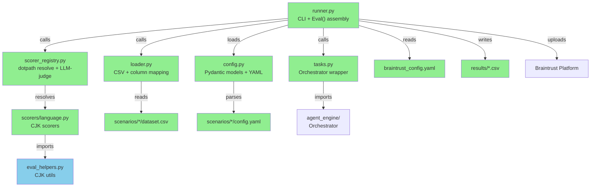

# Briefing: CSV 驅動的 Evaluation 管理系統 + Braintrust 整合

> Design: [`design.md`](./design.md) | Plan: [`implementation.md`](./implementation.md) | BDD: [`bdd-scenarios.md`](./bdd-scenarios.md)

---

## 1. 摘要

本次將 evaluation 系統從 Python dataclass 轉為 CSV 驅動的工作流程，整合 Braintrust 進行實驗追蹤與比較，共拆為 8 個 tasks（6 個 implementation + 1 個 platform 整合 + 1 個 manual 驗證）。最大風險是 Braintrust `Eval()` API 的 `task` / `scores` 參數與自訂 scorer 的整合——scorer 必須同時滿足 Braintrust `(input, output, expected) → score` 簽名和系統內部對 `OrchestratorResult` 結構化 output 的需求，兩端契約不一致會導致 scoring 全面失效。

---

## 2. File Impact

### (a) Folder Tree

```
backend/evals/
├── braintrust_config.yaml        (new)
├── config.py                     (new)
├── loader.py                     (new)
├── scorer_registry.py            (new)
├── runner.py                     (new)
├── tasks.py                      (new)
├── eval_helpers.py               (existing, preserved)
├── conftest.py                   (existing, preserved)
├── test_language_policy.py       (existing, preserved)
├── datasets/
│   └── language_policy.py        (existing, preserved)
├── scenarios/
│   └── language_policy/
│       ├── dataset.csv           (new)
│       └── config.yaml           (new)
├── scorers/
│   ├── __init__.py               (new)
│   └── language.py               (new)
└── results/                      (new, gitignored)

backend/tests/evals/
├── __init__.py                   (new)
├── test_config.py                (new)
├── test_loader.py                (new)
├── test_scorer_registry.py       (new)
└── test_runner.py                (new)

pyproject.toml                    (modified)
.gitignore                        (modified)
```

### (b) Dependency Flow



---

## 3. Task 清單

| Task | 做什麼                                                                 | 為什麼                                                         |
| ---- | ---------------------------------------------------------------------- | -------------------------------------------------------------- |
| 1    | 新增 `braintrust` + `autoevals` dependencies 和基礎設定                | 後續所有 task 的前置條件                                       |
| 2    | 建立 scenario config 的 Pydantic models 和 YAML parser                 | 定義整個系統的 schema，所有元件都依賴它                        |
| 3    | 實作 CSV loader 和 column mapping 轉換                                 | CSV → Braintrust `{input, expected, metadata}` 的核心轉換      |
| 4    | 建立 scorer registry（dotpath resolve + LLM-judge）和 language scorers | 統一 scorer 解析機制，並從現有 `eval_helpers.py` 重用 CJK 邏輯 |
| 5    | 建立 task function 和 language policy CSV scenario                     | 連接 eval 系統和 agent engine，遷移現有 test cases 為 CSV      |
| 6    | 實作 Eval Runner（scenario discovery + `Eval()` 組裝 + result CSV）    | 將所有 component 串接為可執行的 CLI                            |
| 7    | 接通 Braintrust platform 上傳                                          | 從 local-only 升級到完整 experiment tracking                   |
| 8    | Manual Braintrust 全流程驗證（experiment diff + trace drill-down）     | 確認 prompt 迭代工作流程可用                                   |

---

## 4. BDD Verification Scenarios

### Feature: Scenario Discovery

**S-disc-01** — 完整的 scenario 目錄結構（含 `dataset.csv` + `config.yaml`）被正確發現並執行。

> Automated：執行 `python -m evals.runner language_policy --local-only`，驗證 exit code = 0 且 result CSV 存在

**S-disc-02** — 缺少 `dataset.csv` 的目錄被跳過並顯示警告，不影響其他 scenario。

> Automated：建立 `broken/` 只放 `config.yaml`，`--all` 執行後確認 warning 和合法 scenario 的 result CSV

**S-disc-03** — 不存在的 scenario 名稱顯示錯誤並列出可用清單。

> Automated：執行 `runner nonexistent`，驗證 exit code ≠ 0 且輸出含可用 scenario 名稱

**S-disc-04** — `--all` 在空的 `scenarios/` 目錄下顯示 "no scenarios found"。

> Automated：清空 `scenarios/` 後執行 `--all`，驗證不會靜默成功

**S-disc-05** — 混合合法與不合法的 scenario 目錄時，合法的全部執行，不合法的跳過並顯示 summary。

> Automated：建立 alpha（合法）+ beta（合法）+ broken（缺 CSV），驗證 "2 succeeded, 1 skipped"

**J-disc-01** — 新手從零開始的 progressive error recovery 流程（空目錄 → 缺 config → 打錯 dotpath → 修正後成功）。

> Automated：腳本模擬 4 個階段，每步驗證錯誤訊息，最終確認成功

### Feature: CSV Dataset 與 Column Mapping

**S-csv-01** — 單一欄位 `prompt: input` 正確轉為 input string。

> Automated：mock task echo back input，驗證 input 為 string 非 object

**S-csv-02** — 多欄位 dotpath notation（`input.question`, `expected.answer`）正確組裝巢狀結構。

> Automated：mock task 回傳 `json.dumps(input)`，驗證 output 含正確 nested object

**S-csv-03** — 未映射的額外 CSV 欄位被忽略，不影響執行。

> Automated：CSV 含 `notes` 但 mapping 不含，驗證正常完成

**S-csv-04** — mapping 引用不存在的 CSV 欄位，在 task 執行前 fail fast。

> Automated：mapping 引用 `question` 但 CSV 只有 `prompt`，驗證 upfront error

**S-csv-05** — CJK 內容端到端保持正確，無 mojibake。

> Automated：CSV 含中文 prompt，mock task echo back，驗證 result CSV 中 CJK 完整

**S-csv-06** — CSV cell 含逗號、換行、引號時正確 parse 和 write（RFC 4180）。

> Automated：含特殊字元的 cell 經 pipeline 後用 `csv.reader` 驗證完整性

**S-csv-07** — 只有 header 沒有 data rows 的 CSV 顯示 "no data rows" 錯誤。

> Automated：空 CSV 觸發 exit code ≠ 0 和明確錯誤訊息

**J-csv-01** — 從 CSV 編輯到 eval 執行的完整流程（含 CJK 內容），result CSV 可在 Google Sheets 開啟。

> Automated：準備含中文的 CSV，執行 eval，驗證 result CSV 結構和 CJK 完整性

### Feature: Scorer System

**S-scr-01** — programmatic scorer 透過 dotpath 解析並正確評分（CJK ratio 在範圍內 → score 1.0）。

> Automated：mock task 回傳含 CJK 文字，驗證 result CSV 中 score 為 1.0

**S-scr-02** — 無法解析的 scorer dotpath 在任何 row 執行前報錯。

> Automated：dotpath 指向不存在 module，驗證 fail fast 且錯誤訊息含 module 名稱

**S-scr-03** — LLM-judge rubric template 的 `{expected.field}` 正確插值。

> Automated：mock LLM call，捕捉實際送出的 rubric 驗證插值結果

**S-scr-04** — rubric 引用不存在的 expected 欄位時顯示插值錯誤。

> Automated：rubric 含 `{expected.nonexistent_field}`，驗證錯誤訊息

**S-scr-05** — scorer 回傳超出 [0, 1] 的 score 時顯示 validation error。

> Automated：test scorer 回傳 1.5，驗證 error 訊息含 "[0, 1]"

**S-scr-06** — 一個 scorer 拋例外時，其他 scorer 仍然執行，失敗的標記 error。

> Automated：3 個 scorers 中 #2 拋 RuntimeError，驗證 #1 和 #3 有分數、#2 標記 error

**J-scr-01** — 混合 programmatic + LLM-judge scorers 在同一 scenario 中共存，result CSV 含兩種 score。

> Automated：config 設定 2 種 scorer，2 筆 test cases，驗證 result CSV 結構

### Feature: Eval Runner CLI

**S-run-01** — task function 只接收 `input` 參數並回傳 output。

> Automated：mock task 驗證只收到 input，未收到 expected 或 metadata

**S-run-02** — config 缺少 `task.function` 時在執行前顯示 validation error。

> Automated：移除 task.function，驗證 schema validation error

**S-run-03** — config YAML 語法錯誤時顯示清楚報錯（含 scenario 名稱和檔案路徑）。

> Automated：放入無效 YAML，驗證錯誤訊息含 scenario 名稱

**J-run-01** — 單一 scenario 端到端執行（discovery → config → CSV → task → scorer → result CSV）。

> Automated：完整 scenario 配置，驗證 result CSV 存在且結構正確

### Feature: Result CSV Output

**S-res-01** — 兩次執行產出不同的 timestamped result CSV，互不覆蓋。

> Automated：連續執行兩次，驗證 `results/` 下有 2 個不同檔案

**S-res-02** — result CSV 包含原始欄位 + output + per-scorer `score_*` 欄位，score 值在 [0, 1]。

> Automated：驗證 header 結構和 score 值範圍

**S-res-03** — output 含逗號和換行時 result CSV 正確 escape。

> Automated：mock task 回傳含特殊字元的文字，用 `csv.reader` 驗證完整性

**S-res-04** — `results/` 目錄不存在時自動建立。

> Automated：移除 `results/` 後執行 eval，驗證自動建立

**J-res-01** — config 新增 scorer 後，舊 result CSV 不變，新 result CSV 含新 score 欄位。

> Automated：執行 → 新增 scorer → 再執行，驗證兩份 CSV 各自正確

### Feature: Braintrust Integration

**S-bt-02** — `--local-only` 不需要 API key 也能成功執行。

> Automated：`unset BRAINTRUST_API_KEY` 後執行 `--local-only`，驗證 exit code = 0

**S-bt-03** — 未設定 API key 且未指定 `--local-only` 時 fail fast，不執行任何 task。

> Automated：`unset BRAINTRUST_API_KEY`，驗證 error 訊息含 "BRAINTRUST_API_KEY" 和 "--local-only"

**S-bt-04** — Braintrust 上傳失敗時，local result CSV 仍然保留。

> Automated：設定無效 API key 觸發上傳失敗，驗證 result CSV 仍存在

### 🔍 User Acceptance Test（PR Review 時執行）

**S-bt-01** — 預設模式同時產出 local result CSV 和 Braintrust experiment。

> Reviewer 設定 `BRAINTRUST_API_KEY`，執行 `python -m evals.runner language_policy`，確認 terminal 輸出 experiment URL 且 `results/` 有 CSV，開啟 URL 確認 experiment 出現

**J-bt-01** — Prompt 迭代工作流程：執行 eval → 修改 prompt → 再執行 → Braintrust UI 做 experiment diff → 確認 per-case regression/improvement 和 trace drill-down。

> Reviewer 在 Braintrust UI 確認 experiment diff 是否提供足夠的 prompt 迭代決策資訊

**J-bt-02** — 新增 eval scenario 只需建立 CSV + YAML，不需修改任何 Python 程式碼。

> Reviewer 建立 `scenarios/response_quality/` 含 CSV 和 config，執行 `--all`，確認自動發現並執行

---

## 5. Test Safety Net

### Guardrail（不需改的既有測試）

- **既有 pytest eval** — `backend/evals/test_language_policy.py` 保持不動，現有的 language policy pytest eval（使用 dataclass dataset）繼續運行，確保遷移期間舊路徑不被破壞。
- **Agent engine** — `backend/agent_engine/` 不在修改範圍內，其既有測試不受影響。

### 新增測試

- **Config parsing** — YAML → `ScenarioConfig` 的 happy path、缺必要欄位 → `ValidationError`、混合 scorer type 區分（`test_config.py`）
- **CSV loader** — column mapping 組裝 `{input, expected, metadata}`、數值自動轉換、空 CSV、未 mapped column 忽略（`test_loader.py`）
- **Scorer registry** — dotpath resolve 成功/失敗、LLM-judge rubric 插值、`tool_arg_no_cjk` 和 `response_language` 的 pass/fail cases（`test_scorer_registry.py`）
- **Eval runner** — scenario discovery（有效/空/缺 config）、`run_scenario` integration test（mock task + 小 CSV + `local_only=True`）、result CSV 檔名和結構（`test_runner.py`）

---

## 6. Design 未覆蓋的新發現

- **What**: Implementation plan 未涵蓋 Braintrust trace 整合。Design 提到需要 `BraintrustCallbackHandler` 讓 LangGraph 的執行過程被 Braintrust 捕捉，但 Task 5 的 `tasks.py` 沒有包含這段設定。
  **Impact**: 缺少 trace 整合，Braintrust experiment 只會有 input/output/scores，無法在 UI 中 drill-down 查看 LLM call → tool calls → LLM call 的完整執行流程。
  **Resolution**: 需在 Task 5 的 `tasks.py` 中加入 trace callback 設定。具體做法（已透過 Context7 確認）：
  1. 新增 `braintrust-langchain` 依賴
  2. 在 task function 中呼叫 `set_global_handler(BraintrustCallbackHandler())` 設定 global callback
  3. 之後 `Orchestrator.run()` 內部的 `agent.invoke()` 會自動被 Braintrust trace 捕捉

---

## 7. Environment / Config 變更

| 項目             | 變更                                                                                |
| ---------------- | ----------------------------------------------------------------------------------- |
| `pyproject.toml` | 新增 `braintrust`、`braintrust-langchain` 和 `autoevals` 到 `[project.optional-dependencies] dev` |
| `.gitignore`     | 新增 `backend/evals/results/`                                                       |
| 環境變數         | 需要 `BRAINTRUST_API_KEY`（Braintrust 模式時必要，`--local-only` 不需要）           |
| 新設定檔         | `backend/evals/braintrust_config.yaml`（project name, API key env var, local_mode） |
