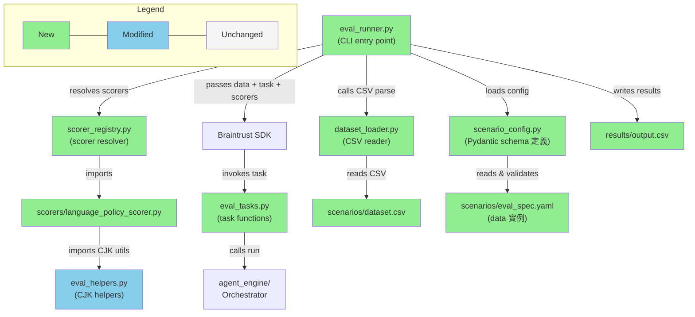

# Briefing: CSV 驅動的 Evaluation 管理系統 + Braintrust 整合

---

## 1. Design 未覆蓋的新發現

### 已解決

- **LlamaIndex trace 整合**:
  **Design 原文**: Section 4 列出 LlamaIndex 使用 `OpenTelemetry exporter 指向 Braintrust endpoint`。
  **實際情況**: 目前 agent engine 只使用 LangGraph/LangChain，不使用 LlamaIndex。Implementation plan 正確地只實作了 `braintrust-langchain` 整合。
  **Resolution**: 已解決——LlamaIndex 整合為 future scope。在 `backend/evals/` 的 README 中加入 Future Implementation 段落，說明未來加入 LlamaIndex 時需透過 `braintrust[otel]` + OpenTelemetry exporter 在 task function 中啟用 trace 捕捉。

- **Design 原文**: Scorer function 簽名 `(input, output, expected) → {"name", "score"}`，未討論 output 的資料型別。
  **實際情況**: Language policy scorer 需要從 output 取得 `tool_outputs`（檢查 tool argument 是否含 CJK），因此 task function 必須回傳結構化的 `OrchestratorResult` dict 而非 string。
  **影響**: 所有 scorer 的 `output` 參數不是 response string，而是包含 `tool_outputs` 等欄位的 dict。
  **Resolution**: 已解決——Plan Task 4 明確選擇 Option A（保留結構化資訊），Task 5 的 `run_v1` 回傳 `OrchestratorResult`。

- **Design 原文**: CLI 介面為 `python -m evals.runner <scenario_name>`。
  **實際情況**: Plan 修正為 `python -m backend.evals.runner language_policy`，因為模組位於 `backend/evals/` 下。
  **Resolution**: 已解決——Design 簡化省略了 `backend.` prefix，Plan 使用正確路徑。

- **Design 原文**: Config schema 中 scorer 只定義 `function` 和 `type: llm_judge` 兩種，未定義互斥關係。
  **實際情況**: Plan 的 `ScorerConfig` 將兩者設為 `Optional`，需處理互斥驗證。
  **Resolution**: 已解決——Plan Task 2 test strategy 涵蓋此 edge case。

---

## 2. 摘要

本次將 evaluation 系統從 Python dataclass 轉為 CSV 驅動的工作流程，整合 Braintrust 進行實驗追蹤與比較，共拆為 8 個 tasks（含 6 個實作 task + 1 個 platform 整合 + 1 個手動驗證）。最大風險是 task function 回傳結構化 `OrchestratorResult` 後，scorer 必須正確解析其中的 `tool_outputs` 等欄位——若 scorer 與 task function 的契約不一致，評分結果將全部錯誤。

---

## 3. File Impact

### (a) Folder Tree

```
backend/evals/
├── braintrust_config.yaml                (new — Braintrust 專案設定)
├── scenario_config.py                    (new — Pydantic models for scenario config)
├── dataset_loader.py                     (new — CSV 讀取 + column mapping 轉換)
├── scorer_registry.py                    (new — scorer dotpath 解析 + LLM-judge builder)
├── eval_runner.py                        (new — CLI entry point + Eval() 組裝)
├── eval_tasks.py                         (new — task functions wrapping Orchestrator)
├── scenarios/
│   └── language_policy/
│       ├── dataset.csv                   (new — 8 筆 language policy test cases)
│       └── eval_spec.yaml                (new — column mapping + scorer 定義)
├── scorers/
│   ├── __init__.py                       (new — package init)
│   └── language_policy_scorer.py         (new — tool_arg_no_cjk + response_language scorers)
└── results/                              (new — gitignored eval result CSVs)

backend/tests/evals/
├── __init__.py                           (new — package init)
├── test_scenario_config.py               (new — config parsing tests)
├── test_dataset_loader.py                (new — CSV loader tests)
├── test_scorer_registry.py               (new — scorer registry tests)
└── test_eval_runner.py                   (new — runner integration tests)

pyproject.toml                            (modified)
.gitignore                                (modified)
```

### (b) Dependency Flow



---

## 4. Task 清單

| Task | 做什麼                                                                      | 為什麼                                                    |
| ---- | --------------------------------------------------------------------------- | --------------------------------------------------------- |
| 1    | 新增 `braintrust`、`autoevals` dependencies + gitignore + braintrust config | 所有後續 task 的前置條件                                  |
| 2    | 建立 Scenario Config Pydantic models + YAML parser                          | 定義系統 schema，所有元件依賴                             |
| 3    | 實作 CSV Loader + column mapping 轉換                                       | CSV → Braintrust `{input, expected, metadata}` 的核心轉換 |
| 4    | 實作 Scorer Registry（dotpath 解析 + LLM-judge builder + language scorers） | 統一 scorer 載入機制，建立第一組 programmatic scorers     |
| 5    | 建立 Task Function + language policy CSV scenario                           | 連接 eval 系統與 agent engine，遷移現有 test cases 到 CSV |
| 6    | 實作 Eval Runner（scenario discovery + `Eval()` 組裝 + result CSV 輸出）    | 串接所有元件的核心 orchestrator                           |
| 7    | 接通 Braintrust Platform（experiment tracking 上傳）                        | 從 local-only 升級到完整實驗追蹤                          |
| 8    | 手動驗證 Braintrust 全流程（experiment diff、trace drill-down）             | 確認 prompt 迭代工作流程可用                              |

---

## 5. Behavior Verification

### Feature: Scenario Discovery

**S-disc-01** — 包含 dataset.csv 和 eval_spec.yaml 的 scenario 目錄被自動發現，執行後產出 result CSV

- Setup: `scenarios/language_policy/` 含 `dataset.csv`（8 筆 test cases）和 `eval_spec.yaml`
- Command: `python -m backend.evals.runner language_policy --local-only`
- Expected: exit code = 0，`results/language_policy_*.csv` 存在
- → Automated

**S-disc-02** — 缺少 dataset.csv 的 scenario 目錄被跳過並顯示 warning，不中斷其他 scenario 執行

- Setup: `scenarios/` 下有兩個子目錄：`language_policy/`（合法，含 `dataset.csv` + `eval_spec.yaml`）和 `broken/`（只有 `eval_spec.yaml`，缺 `dataset.csv`）
- Command: `python -m backend.evals.eval_runner --all --local-only`
- Expected: `broken` 被跳過並顯示 warning，`language_policy` 的 result CSV 正常產出
- → Automated

**S-disc-03** — 指定不存在的 scenario 名稱時顯示錯誤訊息並列出可用的 scenario 清單

- Trigger: 執行 `python -m backend.evals.runner nonexistent`
- Expected: exit code ≠ 0，輸出含 "Scenario 'nonexistent' not found" 和可用 scenario 清單
- → Automated

**S-disc-04** — 空的 scenarios 目錄執行 --all 時顯示 "no scenarios found" 提示而非靜默成功

- Trigger: `scenarios/` 目錄存在但為空
- Command: `python -m backend.evals.runner --all --local-only`
- Expected: 輸出含 "no scenarios found"
- → Automated

**S-disc-05** — 合法與不合法 scenario 混合時，合法的全部執行完畢，不合法的被跳過並顯示 summary

- Setup: `scenarios/` 有 `alpha/`（合法）、`beta/`（合法）、`broken/`（缺 CSV）
- Command: `python -m backend.evals.runner --all --local-only`
- Expected: `alpha` 和 `beta` 產出 result CSV，`broken` 被跳過，summary：2 succeeded, 1 skipped
- → Automated

**J-disc-01** — 新手從空目錄開始，經歷 4 階段錯誤提示後成功完成首次 eval 執行

- Flow:
  1. 執行 `--all` → 看到 "no scenarios found"
  2. 建立 `scenarios/test1/` 只放 `dataset.csv` → 看到 "missing eval_spec.yaml"
  3. 加入 `eval_spec.yaml` 但 `task.function` 打錯 → 看到 "cannot resolve task function"
  4. 修正 dotpath → eval 成功，result CSV 產出
- → Automated

### Feature: CSV Dataset 與 Column Mapping

**S-csv-01** — CSV 的單一欄位透過 column mapping 正確轉換為 Braintrust input string

- CSV row: `prompt: "What is AAPL's P/E ratio?"`
- Mapping: `prompt: input`
- Expected: `{"input": "What is AAPL's P/E ratio?", "expected": {}, "metadata": {}}`
- → Automated

**S-csv-02** — 多個 CSV 欄位透過 dotpath notation 正確組裝為巢狀的 input/expected/metadata 結構

- CSV row: `prompt="Revenue trend?", category="financials", ideal_answer="Growing 15% YoY", difficulty="medium"`
- Mapping: `prompt: input.question, category: input.category, ideal_answer: expected.answer, difficulty: metadata.difficulty`
- Expected: `{"input": {"question": "Revenue trend?", "category": "financials"}, "expected": {"answer": "Growing 15% YoY"}, "metadata": {"difficulty": "medium"}}`
- → Automated

**S-csv-03** — CSV 中未在 column mapping 定義的額外欄位被安靜忽略，不影響 eval 執行

- CSV 欄位: `prompt, ideal_answer, notes`
- Mapping 只定義: `prompt` 和 `ideal_answer`
- Expected: `notes` 不出現在 input/expected/metadata 中，eval 正常完成
- → Automated

**S-csv-04** — column mapping 引用 CSV 中不存在的欄位時，在 task 執行前報錯並指出欄位名

- Trigger: mapping 寫 `question: input`，但 CSV 只有 `prompt, ideal_answer`（無 `question`）
- Expected: 在任何 task 執行前報錯，訊息指出 `question` 欄位不存在
- → Automated

**S-csv-05** — CSV 中的 CJK 字元（中日韓文字）經過整個 pipeline 後在 result CSV 中完整保留，無 mojibake

- CSV row: `prompt: "請問台灣的首都在哪裡？"`
- Expected: CJK 內容正確傳入 task function、正確寫入 result CSV，無 mojibake
- → Automated

**S-csv-06** — CSV 內含逗號、換行、引號的欄位值按 RFC 4180 正確解析並在 result CSV 中 round-trip 保留

- Setup: CSV cell 含特殊字元 `"He said, ""hello""\nand left"`（逗號、escaped 引號、換行）
- Pipeline: CSV 匯入 → dataset_loader 解析 → task function 處理 → result CSV 匯出
- Expected: 使用 Python `csv.reader` 讀回 result CSV 後，欄位值完整等於原始文字（含逗號和換行），證明 round-trip 正確
- Why: 使用者在 Google Sheets 編輯 CSV 時，cell 內輸入逗號或換行很常見。Google Sheets 匯出時自動加 RFC 4180 quoting，我們的 loader 必須正確 parse
- → Automated

**S-csv-07** — 只有 header 沒有 data rows 的 CSV 載入時顯示 "no data rows found" 錯誤

- Trigger: `dataset.csv` 只有 header row，沒有 data rows
- Expected: 顯示 "no data rows found" 錯誤
- → Automated

**J-csv-01** — 8 筆 language policy test cases 從 Python dataclass 遷移到 CSV 後，端到端執行並產出正確的 result CSV

- Input: 8 筆 language policy test cases（含中英文混合），從 Python dataclass 遷移到 CSV
- Setup: `eval_spec.yaml` 定義 column mapping + 2 個 scorers
- Command: `python -m backend.evals.runner language_policy --local-only`
- Expected: 8 筆全部執行，result CSV 產出於 `results/`，CJK 內容正確
- → Automated

### Feature: Scorer System

**S-scr-01** — Programmatic scorer 透過 dotpath 載入後，根據 CJK ratio 與 threshold 比較正確回傳 pass/fail score

- Setup: scorer `function: scorers.language.cjk_ratio`，expected CJK min 0.20
- Output: agent 回覆 "微軟（MSFT）最新消息如下：..."（CJK ratio 0.45）
- Expected: `{"name": "cjk_ratio", "score": 1.0}`（0.45 >= 0.20 → pass）
- → Automated

**S-scr-02** — 不存在的 scorer dotpath 在任何 task function 呼叫前報錯，避免浪費計算資源

- Trigger: config 設定 `function: scorers.nonexistent.my_scorer`，該 module 不存在
- Expected: 在任何 task function 呼叫前報錯，訊息指出 module 找不到
- → Automated

**S-scr-03** — LLM-judge rubric template 中的 `{expected.field}` 和 `{input}` 變數被正確替換為 per-case 的實際值

- Rubric template: `"Does the output mention {expected.must_mention}? Input was: {input}"`
- Test case: `expected.must_mention = "revenue growth"`, `input = "Tell me about AAPL"`
- Expected: 送給 LLM 的 rubric 為 `"Does the output mention revenue growth? Input was: Tell me about AAPL"`
- → Automated

**S-scr-04** — rubric template 引用 test case 中不存在的 expected 欄位時顯示插值錯誤

- Trigger: rubric 含 `{expected.nonexistent_field}`，但 test case 的 expected 無此欄位
- Expected: 顯示錯誤指出插值變數無法解析
- → Automated

**S-scr-05** — scorer 回傳超出 [0, 1] 範圍的 score 時顯示 validation error 指出具體值

- Trigger: scorer 回傳 `{"name": "test", "score": 1.5}`
- Expected: validation error，訊息含 score 1.5 和 [0, 1]
- → Automated

**S-scr-06** — 一個 scorer 拋出例外時，其他 scorer 仍正常執行，失敗的在 result CSV 標記 error

- Setup: 3 個 scorers，其中 scorer #2 拋出 `RuntimeError`
- Expected: #1 和 #3 正常產出分數，#2 在 result CSV 標記 error，terminal 指出哪個 scorer 在哪一 row 失敗
- → Automated

**J-scr-01** — 同一 scenario 中混合 programmatic 和 LLM-judge scorers，每 row 都被兩種 scorer 評分並寫入 result CSV

- Setup: programmatic `cjk_ratio` + LLM-judge `completeness`（rubric: "Does the output mention {expected.must_mention}?"）
- Input: 2 筆 test cases，含 `prompt, must_mention, category`
- Expected: result CSV 有 `score_cjk_ratio` 和 `score_completeness` 兩個 score 欄位，每 row 都有值
- → Automated

### Feature: Eval Runner CLI

**S-run-01** — Task function 被呼叫時只接收 input 參數，不接收 expected 或 metadata

- Setup: `task.function: tasks.run_agent`，CSV mapping 產出 `input: "What is AAPL's revenue?"`
- Expected: task function 被呼叫只接收 `input`，不接收 `expected` 或 `metadata`
- → Automated

**S-run-02** — eval_spec.yaml 缺少必填的 task.function 欄位時，在執行前顯示 schema validation error

- Trigger: `eval_spec.yaml` 有 `name` 和 `column_mapping` 但缺少 `task.function`
- Expected: 在執行前顯示 validation error 指出 `task.function` 是必填
- → Automated

**S-run-03** — eval_spec.yaml 語法錯誤時顯示含 scenario 名稱和路徑的 parse error，而非 raw traceback

- Trigger: `eval_spec.yaml` 包含無效 YAML（如未關閉的引號）
- Expected: 顯示 parse error 含 scenario 名稱和檔案路徑，不是 raw traceback
- → Automated

**J-run-01** — 單一 scenario 從 discovery 到 result CSV 的完整 data flow 端到端正確執行

- Setup: `scenarios/language_policy/` 含 config（task function + column mapping + 1 scorer）和 CSV（1 筆 test case）
- Command: `python -m backend.evals.runner language_policy --local-only`
- Expected: discovery → config → CSV → mapping → task → scorer → result CSV，含 `prompt, ideal_answer, output, score_cjk_ratio` 欄位
- → Automated

### Feature: Result CSV Output

**S-res-01** — 兩次 eval 執行產出不同 timestamp 的 result CSV，永不覆蓋既有檔案

- First run: 產出 `results/language_policy_20260327_1400.csv`
- Second run: 14:30 再次執行
- Expected: 產出 `results/language_policy_20260327_1430.csv`，原本的 `_1400.csv` 不變
- → Automated

**S-res-02** — Result CSV 包含原始 input 欄位、model output、和 per-scorer score 欄位，score 值介於 0.0–1.0

- Setup: CSV 有 `prompt, ideal_answer`，scorers 為 `factuality, completeness`
- Expected: result CSV 欄位為 `prompt, ideal_answer, output, score_factuality, score_completeness`，score 值介於 0.0–1.0
- → Automated

**S-res-03** — model output 含逗號和換行時，result CSV 正確 escape 使標準 csv.reader 可讀回

- Output: task function 回傳 `"First, we note\nthat this is multi-line"`
- Expected: 該欄位被正確 CSV escape（加引號），`csv.reader` 可正確讀回
- → Automated

**S-res-04** — results 目錄不存在時由 runner 自動建立並寫入 result CSV

- Trigger: `results/` 目錄尚未存在
- Expected: runner 執行完自動建立 `results/` 並寫入 result CSV
- → Automated

**J-res-01** — 修改 config 新增 scorer 後再次執行，舊 result CSV 不變、新 result CSV 含新 score 欄位

- First run: 2 個 scorers → result CSV A（2 個 score 欄位）
- Config change: 新增第 3 個 scorer
- Second run: result CSV B（3 個 score 欄位）
- Expected: CSV A 保持不變，兩個檔案都可在 Google Sheets 開啟
- → Automated

### Feature: Braintrust Integration

**S-bt-02** — `--local-only` 模式不需要 BRAINTRUST_API_KEY 即可成功執行並產出 result CSV

- Setup: `BRAINTRUST_API_KEY` 未設定
- Command: `python -m backend.evals.runner language_policy --local-only`
- Expected: eval 成功完成，result CSV 產出
- → Automated

**S-bt-03** — 未設定 API key 且未指定 --local-only 時，在任何 task 執行前 fail fast 並提示解決方式

- Trigger: `BRAINTRUST_API_KEY` 未設定，且未指定 `--local-only`
- Expected: 在任何 task 執行前報錯，訊息含 "BRAINTRUST_API_KEY" 和 "--local-only" 提示
- → Automated

**S-bt-04** — Braintrust API 連線失敗時，local result CSV 仍正常寫入並顯示上傳失敗訊息

- Trigger: Braintrust API 無法連線（網路錯誤）
- Expected: result CSV 仍然正常寫入 `results/`，錯誤訊息指出 Braintrust 上傳失敗
- → Automated

### 🔍 User Acceptance Test（PR Review 時執行）

**S-bt-01**<br>
預設模式同時產出 local CSV 和 Braintrust experiment：terminal 輸出 experiment URL，`results/` 有 CSV，Braintrust UI 可見。<br>
→ Reviewer 設定 `BRAINTRUST_API_KEY` 後執行 `python -m backend.evals.runner language_policy`，開啟 URL 確認 experiment

**J-bt-01**<br>
Prompt 迭代工作流程：執行 eval → 修改 system prompt → 再次執行 → 在 Braintrust UI Compare 兩個 experiments，觀察 per-case regression/improvement 和 trace drill-down。<br>
→ Reviewer 判斷 experiment diff 是否提供足夠資訊來決定 prompt 修改的好壞

**J-bt-02**<br>
新增 eval scenario 是否真的零 Python、零 registry：建立 `scenarios/response_quality/` 含 `dataset.csv` + `eval_spec.yaml`，`--all` 自動發現並執行。<br>
→ Reviewer 判斷新增 scenario 流程是否比原本的 Python dataclass 方式更快、更直覺

---

## 6. Test Safety Net

### Guardrail（不需改的既有測試）

- **Language policy pytest eval**（`backend/evals/test_language_policy.py`）— 現有的 pytest eval cases 保持不變且繼續執行，確保在新系統完全驗證前舊路徑不被破壞。
- **Agent engine**（`backend/agent_engine/`）— 不在本次修改範圍，既有測試完整保護 `Orchestrator` 的行為。

### 新增測試

- **Config parsing**（`test_scenario_config.py`）：合法 YAML → `ScenarioConfig`、缺少必要欄位 → `ValidationError`、scorer type 互斥 edge case、`BraintrustConfig` default 值
- **CSV loader**（`test_dataset_loader.py`）：column mapping 組裝 `{input, expected, metadata}`、dotpath 巢狀結構、數值自動轉換（`"0.8"` → `0.8`）、空 CSV、未 mapped column 忽略
- **Scorer registry**（`test_scorer_registry.py`）：dotpath resolve happy/failure path、LLM-judge rubric 插值（mock LLM）、`tool_arg_no_cjk` 和 `response_language` scorers 的 pass/fail cases
- **Runner integration**（`test_eval_runner.py`）：scenario discovery、`run_scenario` 端到端（mock task + 小 CSV + `local_only=True`）、result CSV 檔名和結構

---

## 7. Environment / Config 變更

| 項目                              | 變更                                                                                     |
| --------------------------------- | ---------------------------------------------------------------------------------------- |
| `pyproject.toml` dev dependencies | 新增 `braintrust`、`braintrust-langchain`、`autoevals`                                   |
| `.gitignore`                      | 新增 `backend/evals/results/`                                                            |
| 環境變數                          | `BRAINTRUST_API_KEY`（Braintrust platform 模式必要，`--local-only` 不需要）              |
| 新增 config 檔                    | `backend/evals/braintrust_config.yaml`（project name、API key env var name、local_mode） |
