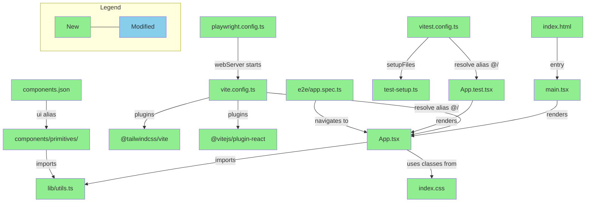

# Briefing — S2 Frontend Scaffold

> Source: [`implementation_S2_frontend_scaffold.md`](./implementation_S2_frontend_scaffold.md) + [`bdd_scenarios_S2_frontend_scaffold.md`](./bdd_scenarios_S2_frontend_scaffold.md) + [`verification_plan_S2_frontend_scaffold.md`](./verification_plan_S2_frontend_scaffold.md)
> Design: [`design_S2_frontend_scaffold.md`](./design_S2_frontend_scaffold.md)
> Generated: 2026-03-31

---

## 1. Design Delta

### 已解決

#### shadcn/ui init 安裝的額外依賴未在 design 依賴表中列出

- **Design 原文**: Production dependencies 只列了 `react`, `react-dom`, `ai`, `@ai-sdk/react`, `tailwindcss`, `@tailwindcss/vite`, `lucide-react`
- **實際情況**: `pnpm dlx shadcn@latest init` 會自動安裝 `tw-animate-css`, `class-variance-authority`, `clsx`, `tailwind-merge`，design 依賴表完全未提及
- **影響**: 若只看 design 依賴表評估 bundle size 或安全審計，會遺漏這四個 package
- **Resolution**: 已解決 — 確認安裝 shadcn/ui，在 design 依賴表補註「shadcn/ui init 會額外安裝 `tw-animate-css`, `class-variance-authority`, `clsx`, `tailwind-merge`」

#### Implementation Plan 新增 `tsconfig.node.json`

- **Design 原文**: 專案結構列出 `tsconfig.json` 和 `tsconfig.app.json`，未列出 `tsconfig.node.json`
- **實際情況**: `pnpm create vite@latest --template react-ts` 模板自動產生此檔案（用於 `vite.config.ts` 的 Node 環境 TypeScript config）
- **影響**: 無實質影響，是 Vite react-ts 模板的標準輸出
- **Resolution**: 已解決 — 採用 `create-vite` scaffolding 策略的自然結果

#### Implementation Plan 引入 Browser-Use CLI 作為中間驗證手段

- **Design 原文**: Design 驗證方式為「手動 / CI」和「手動」，未提及自動化 browser 驗證工具
- **實際情況**: Plan 引入 Browser-Use CLI 作為執行過程中的 BDD browser 驗證，與 Playwright（最終 E2E）區分
- **影響**: 不影響交付物——Browser-Use CLI 是 implementation 過程工具，非專案 dependency
- **Resolution**: 已解決 — 屬於執行工具選擇，design 不需涵蓋

#### Implementation Plan 採 CLI scaffolding 策略而非手動建檔

- **Design 原文**: Design 提供完整 config 檔案內容（如 `vite.config.ts`、`tsconfig.json`），讀法上隱含「手動逐一建立這些檔案」
- **實際情況**: Plan 的策略是分三步走：(1) 先用 CLI 工具生成 → 例如 `pnpm create vite@latest . --template react-ts` 產出整個 Vite 專案骨架、`pnpm dlx shadcn@latest init` 產出 shadcn/ui config；(2) 再依據 design 需求修改生成的檔案 → 例如改 `vite.config.ts` 加 `strictPort: true`、改 `components.json` 的 ui alias；(3) 清理 CLI 產出但 design 不需要的中間產物 → 如 `App.css`、`assets/react.svg`
- **影響**: 執行路徑不同但最終產物一致。CLI scaffolding 的好處是版本相容的 boilerplate（如 `tsconfig` 設定）由官方工具保證，比手動建檔更不容易出錯
- **Resolution**: 已解決 — CLI scaffolding 更可靠，plan 已規劃清理步驟

#### `pnpm run build` 驗證出現在 plan 但不在 design AC 中

- **Design 原文**: AC1–AC10 不包含 build 驗證
- **實際情況**: Plan 的 Pre-delivery Checklist 新增 `pnpm run build` 作為品質門檻
- **影響**: 低影響，合理的品質門檻
- **Resolution**: 已解決 — 不與 design intent 衝突

---

## 2. Overview

本次建立 `frontend/` 的完整專案基礎建設（Vite + React + TypeScript + Tailwind CSS v4 + shadcn/ui + 雙層測試 pipeline），共拆為 7 個 task（Task 0–6）。最大風險是 `shadcn@latest init` 的互動式 prompt 可能因環境差異產生不同 config 輸出，導致 `components.json`、`vite.config.ts` 等檔案不符合 critical contract，需逐一驗證後才能繼續。

---

## 3. File Impact

### (a) Folder Tree

```
frontend/
├── public/
├── src/
│   ├── components/
│   │   ├── primitives/          (new — shadcn/ui CLI 產出)
│   │   └── ui/                  (new — S3 自訂元件，目前空)
│   ├── hooks/                   (new — S3 自訂 hooks，目前空)
│   ├── lib/
│   │   └── utils.ts             (new — cn() utility)
│   ├── App.tsx                  (new — App shell)
│   ├── App.test.tsx             (new — Vitest baseline test)
│   ├── main.tsx                 (new — React entry point)
│   ├── index.css                (new — Tailwind v4 entry + theme)
│   ├── test-setup.ts            (new — jest-dom matchers setup)
│   └── vite-env.d.ts            (new — Vite type declarations)
├── e2e/
│   └── app.spec.ts              (new — Playwright E2E baseline)
├── components.json              (new — shadcn/ui config)
├── vite.config.ts               (new — Vite + Tailwind plugin + path alias)
├── vitest.config.ts             (new — Vitest jsdom config)
├── playwright.config.ts         (new — Playwright webServer config)
├── tsconfig.json                (new — root TS config)
├── tsconfig.app.json            (new — app TS config + path alias)
├── tsconfig.node.json           (new — node TS config)
├── eslint.config.js             (new — ESLint React/TS)
├── package.json                 (overwrite — replace placeholder)
└── index.html                   (new — Vite entry HTML)

.gitignore                       (modified — add node_modules/ etc.)
frontend/README.md               (deleted — outdated Next.js content)
frontend/src/App.css             (deleted — styling via Tailwind)
```

### (b) Dependency Flow



---

## 4. Task 清單

| Task | 做什麼                                        | 為什麼                                                                   |
| ---- | --------------------------------------------- | ------------------------------------------------------------------------ |
| 0    | 安裝 Browser-Use CLI + 驗證可視畫面           | 後續 task 需要 browser 驗證 styling，先確認工具鏈可用                     |
| 1    | Scaffold Vite + React + TypeScript 專案       | 建立 build toolchain 和 dev server，所有後續 task 的基礎                 |
| 2    | 設定 Tailwind CSS v4 + shadcn/ui              | 建立 styling foundation 和 component primitive pipeline                  |
| 3    | App Shell + 目錄結構 + AI SDK 安裝            | 提供最小 UI shell、S3 預留目錄、和 AI SDK 型別相容性                     |
| 4    | Vitest + RTL + Unit Test Baseline             | 建立 unit/component test 基礎設施，為 S3 的 hook 測試鋪路                |
| 5    | Playwright E2E Setup + Baseline Test          | 建立 E2E test pipeline，auto-wait assertion 適合 S3 streaming 驗證       |
| 6    | ESLint 驗證 + .gitignore + 最終驗收           | 確保所有 tooling pipeline 正常，通過全部 10 項 AC                        |

---

## 5. Behavior Verification

> 共 19 個 illustrative scenarios（S-\*）+ 2 個 journey scenarios（J-\*），涵蓋 4 個 features。

### Feature: Dev Environment & Styling Pipeline

<details>
<summary><strong>S-env-01</strong> — Dev server 在 port 5173 啟動並 serve 包含 "FinLab-X" heading 和副標題的 App shell</summary>

- Setup: S2 scaffold 已安裝（`pnpm install` 完成）
- Flow: `pnpm run dev` → server 啟動 → `curl localhost:5173` 確認 HTML 內容
- Expected: response 包含 "FinLab-X" 和 "AI-powered financial analysis assistant"
- → Automated (script)

</details>

<details>
<summary><strong>S-env-02</strong> — Port 5173 被佔用時 dev server 以 port 衝突錯誤退出，不靜默 fallback</summary>

- Setup: 另一個 process 佔用 port 5173
- Flow: `pnpm run dev` → 嘗試啟動
- Expected: exit code ≠ 0，stderr 包含 port 衝突訊息（`strictPort: true` 行為）
- → Automated (script)

</details>

<details>
<summary><strong>S-env-03</strong> — Tailwind utility classes 在 App shell 產生可見 styling（粗體 heading、背景色）</summary>

- Setup: dev server 運行中
- Flow: 開啟 `localhost:5173` → 截圖確認 styling
- Expected: heading 有 `text-3xl font-bold`，頁面有 `bg-background`（非無樣式 HTML）
- → Automated (Browser-Use CLI)

</details>

<details>
<summary><strong>S-env-04</strong> — shadcn/ui Button 以 `bg-primary text-primary-foreground` theme 色彩可見渲染</summary>

- Setup: dev server 運行中，暫時加入 `<Button>` 到 App.tsx
- Flow: 開啟頁面 → 截圖確認 Button 色彩
- Expected: Button 背景色非 transparent，文字與背景形成對比
- → Automated (Browser-Use CLI)

</details>

<details>
<summary><strong>S-env-05</strong> — 在 `<html>` 加入 `dark` class 後 dark mode variants 生效，不受 OS preference 影響</summary>

- Setup: dev server 運行中
- Flow: 截圖 light mode → `document.documentElement.classList.add('dark')` → 截圖 dark mode
- Expected: 兩張截圖在背景色和文字顏色上有明顯差異
- → Automated (Browser-Use CLI)

</details>

<details>
<summary><strong>S-env-06</strong> — <code>index.css</code> 使用 Tailwind v4 <code>@import "tailwindcss"</code> 語法，非 v3 <code>@tailwind</code> directives（⚠️ Static Check）</summary>

> **Note:** 此項為 static code check（grep 檔案內容），非 behavior test。保留於此處是因為它是 Tailwind v4 styling pipeline 正確運作的前提條件，但驗證方式是 code-level 而非 runtime behavior。

- Check: `index.css` 包含 `@import "tailwindcss"`，不包含 `@tailwind base/components/utilities`
- → Automated (script / static check)

</details>

### Feature: Component Primitive Pipeline

<details>
<summary><strong>S-comp-01</strong> — <code>shadcn@latest add button</code> 將 button.tsx 建立在 <code>primitives/</code>，不在預設 <code>ui/</code></summary>

- Flow: `pnpm dlx shadcn@latest add button --yes`
- Expected: `src/components/primitives/button.tsx` 存在，`src/components/ui/button.tsx` 不存在
- → Automated (script)

</details>

<details>
<summary><strong>S-comp-02</strong> — CLI 生成的元件可透過 <code>@/components/primitives/button</code> import 且 type-check 通過</summary>

- Flow: 建立暫時檔 import Button → `pnpm exec tsc --noEmit`
- Expected: exit code 0，import 解析成功
- → Automated (script)

</details>

### Feature: Test Infrastructure

<details>
<summary><strong>S-test-01</strong> — <code>pnpm run test</code> 發現並通過 App.test.tsx baseline test</summary>

- Flow: `pnpm run test`
- Expected: exit code 0，output 包含 pass indicator 和 test name
- → Automated (script)

</details>

<details>
<summary><strong>S-test-02</strong> — jest-dom matchers（如 <code>toBeInTheDocument</code>）在 test runtime 直接可用，無需額外設定</summary>

- Check: `test-setup.ts` 包含 `jest-dom` import，runtime 不報 "toBeInTheDocument is not a function"
- → Automated (script)

</details>

<details>
<summary><strong>S-test-03</strong> — Vitest globals（<code>describe</code>、<code>it</code>、<code>expect</code>）在 runtime 和 type-check 都通過，無需顯式 import</summary>

- Flow: 確認 test 檔不 import globals → `pnpm run test` + `pnpm exec tsc --noEmit`
- Expected: 兩者都 exit code 0，無 "Cannot find name" 錯誤
- → Automated (script)

</details>

<details>
<summary><strong>S-test-04</strong> — Playwright baseline test 透過 <code>webServer</code> config 自動啟動 Vite dev server 並通過</summary>

- Setup: 無 dev server 運行中
- Flow: `pnpm run test:e2e`
- Expected: exit code 0，Playwright 自動啟動 Vite 並通過 baseline test
- → Automated (script)

</details>

<details>
<summary><strong>S-test-05</strong> — Fresh install 後 Playwright 可執行或提供清楚的 one-step 修復指示</summary>

- Flow: `pnpm install` → `pnpm run test:e2e`
- Expected: test 通過，或錯誤訊息包含明確修復步驟（如 "npx playwright install"）
- → Automated (script)

</details>

### Feature: SDK & Scaffold Contract

<details>
<summary><strong>S-sdk-01</strong> — <code>@/</code> path alias 在 TypeScript compiler、Vite dev server、和 Vitest test runner 三處都正確解析</summary>

- Flow: dev server serve + test pass + tsc pass（三個 toolchain 都使用 `@/` import）
- → Automated (script)

</details>

<details>
<summary><strong>S-sdk-02</strong> — AI SDK v5 的 <code>useChat</code> 和 <code>DefaultChatTransport</code> imports type-check 通過，版本為 5.x</summary>

- Flow: 建立暫時檔 import AI SDK types → `pnpm exec tsc --noEmit` + `pnpm ls` 確認版本
- Expected: type-check 通過，版本為 `ai@5.x` 和 `@ai-sdk/react@5.x`
- → Automated (script)

</details>

<details>
<summary><strong>S-sdk-03</strong> — <code>pnpm run lint</code> 在 scaffold codebase 上報告零錯誤</summary>

- Flow: `pnpm run lint`
- Expected: exit code 0，無 error 輸出
- → Automated (script)

</details>

<details>
<summary><strong>S-sdk-04</strong> — ESLint 捕捉 conditional hook call 違規（React hooks rules 已啟用）</summary>

- Flow: 建立包含 `if (condition) { useState() }` 的暫時檔 → `pnpm run lint`
- Expected: ESLint 報告 react-hooks 違規
- → Automated (script)

</details>

<details>
<summary><strong>S-sdk-05</strong> — S3 預留目錄（<code>primitives/</code>、<code>ui/</code>、<code>hooks/</code>、<code>lib/</code>）和所有 config 檔案都存在</summary>

- Check: 目錄存在，`ui/` 和 `hooks/` 為空或只含 `.gitkeep`，`lib/utils.ts` 含 `cn()`，6 個 config 檔案都存在
- → Automated (script)

</details>

<details>
<summary><strong>S-sdk-06</strong> — Codebase 中無 <code>useChat()</code> 呼叫、無 API fetch、無 markdown 依賴、無 Next.js imports</summary>

- Check: grep 確認零 `useChat()`、零 `fetch(`、零 `axios`、無 `react-markdown` 等 package、無 `'use server'`、無 `next/` import
- → Automated (script)

</details>

### Journey Scenarios

<details>
<summary><strong>J-scaffold-01</strong> — S3 開發者從 fresh clone 到 S3-ready 的完整 onboarding：install → dev → style → component → test → AI SDK，每步零錯誤</summary>

- Flow: `pnpm install` → `pnpm run dev`（App shell 有 styling）→ `pnpm run test`（pass）→ `pnpm run test:e2e`（pass）→ `shadcn add button`（落在 `primitives/`）→ S3 component import（tsc pass）→ AI SDK import（tsc pass）
- Expected: 從 fresh clone 到 S3 就緒的每一步都零錯誤通過
- → Automated (script chain + Browser-Use CLI)

</details>

<details>
<summary><strong>J-scaffold-02</strong> — Styling pipeline end-to-end：Tailwind utilities → shadcn CSS variables → dark mode toggle 三層全部正確互動</summary>

- Flow: 開啟頁面確認 Tailwind styling → 加入 shadcn Button 確認 theme color → toggle `dark` class 確認色彩切換
- Expected: 三層 styling 正確互動，dark mode 色彩明顯不同
- → Automated (Browser-Use CLI)

</details>

### 🔍 User Acceptance Test（PR Review 時執行）

**J-scaffold-01**<br>
S2 scaffold 是否提供零摩擦的 S3 開發體驗？執行 `pnpm install` → `pnpm run dev` → `pnpm run test` → `pnpm run test:e2e` → `shadcn add button` → `pnpm exec tsc --noEmit` → `pnpm run build`，每步皆無摩擦成功。<br>
→ Reviewer 在 PR Review 時依序執行確認

**J-scaffold-02**<br>
整個 styling pipeline 是否視覺正確且一致？確認 App shell styling、shadcn Button theme color、dark mode class toggle。<br>
→ Reviewer 在 PR Review 時開啟 dev server 手動確認

---

## 6. Test Safety Net

### 新增測試

- **App shell rendering**（`App.test.tsx`，Vitest + RTL）— 驗證 `<h1>` heading 正確渲染，證明 Vitest + jsdom + RTL + jest-dom 四層 test pipeline 端對端運作。使用 accessible query（`getByRole`）和 jest-dom matcher（`toHaveTextContent`）
- **Page load E2E**（`e2e/app.spec.ts`，Playwright）— 驗證 Vite dev server 透過 `webServer` config 自動啟動並 serve 頁面，heading 可見。使用 `toHaveText` auto-wait assertion，為 S3 streaming 驗證建立 pattern

> 本次為全新 frontend 專案，無既有測試需要保護或調整。

---

## 7. Environment / Config 變更

| 項目                    | Before              | After                                                                |
| ----------------------- | ------------------- | -------------------------------------------------------------------- |
| `frontend/package.json` | Placeholder（一行） | Vite + React + TS + 完整依賴                                         |
| Root `.gitignore`       | Python-only entries | 新增 `node_modules/`、`dist/`、`test-results/`、`playwright-report/` |
| Playwright browsers     | 未安裝              | `npx playwright install --with-deps chromium`                        |

**新增 production dependencies：** `react`, `react-dom`, `ai@^5.0.0`, `@ai-sdk/react@^5.0.0`, `tailwindcss`, `@tailwindcss/vite`, `lucide-react`, `clsx`, `tailwind-merge`, `class-variance-authority`, `tw-animate-css`

**新增 dev dependencies：** `typescript`, `vite`, `@vitejs/plugin-react`, `vitest`, `jsdom`, `@testing-library/react`, `@testing-library/jest-dom`, `@testing-library/user-event`, `@playwright/test`, `eslint` + React/TS plugins
