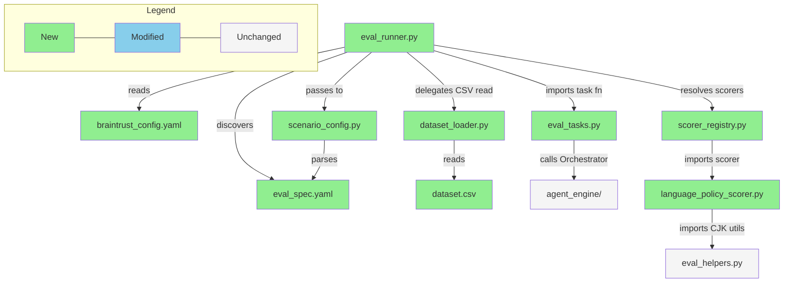

# Briefing: CSV 驅動的 Evaluation 管理系統 + Braintrust 整合

> Generated: 2026-03-31
> Source: `implementation.md`, `bdd-scenarios.md`, `verification-plan.md`, `design.md`

---

## 1. Design Delta

> 實作規劃發現 4 項與 design 不一致之處，皆已在 plan 階段解決，無需回到 design 補充。

### 已解決

#### Scenario config 檔名從 `config.yaml` 改為 `eval_spec.yaml`

- **Design 原文**: 「每個包含 `dataset.csv` + `config.yaml` 的子目錄 = 一個 scenario」
- **實際情況**: Implementation plan 統一使用 `eval_spec.yaml`
- **影響**: 所有 discovery 邏輯和文件參照都以 `eval_spec.yaml` 為準
- **Resolution**: 已解決 — `eval_spec.yaml` 比 `config.yaml` 更具描述性，避免與其他 config 檔案混淆

#### Task function 回傳型別從隱含的 string 改為 `OrchestratorResult` dict

- **Design 原文**: Scorer 簽名 `(output, expected, *, input)` 中 output 未明確定義結構，Result CSV 顯示 `output` 為單一欄位（暗示 string）
- **實際情況**: Task function 回傳完整 `OrchestratorResult` dict（含 `response`, `tool_outputs`, `model`, `version`），scorer 從中取所需欄位
- **影響**: `tool_arg_no_cjk` scorer 依賴 `output["tool_outputs"]` 檢查 tool argument 品質，string output 無法滿足此需求
- **Resolution**: 已解決 — Design 未禁止 structured output，Plan 的 Approach Decision table 記錄此決策及理由

#### CLI module 路徑從 `evals.runner` 改為 `backend.evals.eval_runner`

- **Design 原文**: 「`python -m evals.runner <scenario_name>`」
- **實際情況**: `python -m backend.evals.eval_runner language_policy`
- **影響**: 使用者執行 eval 的指令不同
- **Resolution**: 已解決 — 基於專案 Python package 結構，`backend.evals.eval_runner` 是正確的 module path

#### Braintrust tracing 需先呼叫 `init_logger()` 再 `set_global_handler()`

- **Design 原文**: 只提到 `set_global_handler()` 全域註冊
- **實際情況**: 查閱 SDK 文件後確認需先 `init_logger(project=..., api_key=...)` 再 `set_global_handler(BraintrustCallbackHandler())`
- **影響**: Design 描述不完整但方向正確，plan 補上了必要的前置步驟
- **Resolution**: 已解決 — Implementation planning 透過 Context7 查證後補齊

---

## 2. Overview

本次將 evaluation 系統從 Python dataclass 遷移至 CSV 驅動工作流程，整合 Braintrust 進行實驗追蹤與比較，並產出 result CSV 供本地標注，共拆為 7 個 tasks（6 個實作 + 1 個手動驗證）。最大風險是 Braintrust `Eval()` API 的 `data`/`task`/`scores` 參數組裝需精確對齊 SDK 實際行為——`result.results` 的結構假設一旦不符，result CSV 產出邏輯將全面失敗。

---

## 3. File Impact

### (a) Folder Tree

```
backend/evals/
├── braintrust_config.yaml              (new — Braintrust 專案設定)
├── scenario_config.py                  (new — Pydantic models + YAML parser)
├── dataset_loader.py                   (new — CSV 讀取 + column mapping)
├── scorer_registry.py                  (new — Scorer dotpath 解析 + LLM-judge builder)
├── eval_runner.py                      (new — CLI entry point + Eval() 組裝 + result CSV)
├── eval_tasks.py                       (new — Task functions wrapping Orchestrator)
├── eval_helpers.py                     (preserved — CJK helpers, reused by new scorers)
├── test_language_policy.py             (preserved — 現有 pytest eval)
├── datasets/
│   └── language_policy.py              (preserved — frozen dataclass)
├── scenarios/
│   └── language_policy/
│       ├── dataset.csv                 (new — 8 test cases from dataclass migration)
│       └── eval_spec.yaml              (new — column mapping + scorer 定義)
├── scorers/
│   ├── __init__.py                     (new — package init)
│   └── language_policy_scorer.py       (new — tool_arg_no_cjk + response_language)
└── results/                            (new — gitignored, eval result CSVs)
backend/tests/evals/
├── __init__.py                         (new — package init)
├── test_scenario_config.py             (new — config parsing tests)
├── test_dataset_loader.py              (new — CSV loader tests)
├── test_scorer_registry.py             (new — scorer registry tests)
├── test_eval_tasks.py                  (new — task function tests)
└── test_eval_runner.py                 (new — runner integration tests)
pyproject.toml                          (modified — add dev dependencies)
.gitignore                              (modified — add results/ path)
backend/evals/README.md                 (modified — add Future Implementation section)
```

### (b) Dependency Flow



---

## 4. Task 清單

| Task | 做什麼                                                      | 為什麼                                                   |
| ---- | ----------------------------------------------------------- | -------------------------------------------------------- |
| 1    | 安裝 Braintrust SDK 相關 packages + gitignore + base config | 後續所有 task 的 dependency 前置條件                     |
| 2    | 建立 Scenario Config Pydantic models + YAML parser          | 系統 schema 定義，所有元件依賴此層                       |
| 3    | 實作 CSV Loader + Column Mapping 轉換                       | CSV → Braintrust data format 的核心轉換邏輯              |
| 4    | 建立 Scorer Registry + Language Policy Scorers              | dotpath 解析 + `autoevals.LLMClassifier` 整合 + 第一組 programmatic scorers |
| 5    | 建立 Task Function + Language Policy Scenario 資料          | 連接 eval 系統與 agent engine，遷移 dataclass 為 CSV，含 LLM-judge `response_relevance` scorer |
| 6    | 實作 Eval Runner CLI + Result CSV 輸出                      | 核心 orchestrator：scenario discovery + Eval() 組裝      |
| 7    | 手動驗證 Braintrust Platform 全流程                         | 確認 experiment diff 和 trace drill-down 工作流程        |

---

## 5. Behavior Verification

> 共 50 個 illustrative scenarios（S-_）+ 7 個 journey scenarios（J-_），涵蓋 7 個 features。

### Feature: Scenario Discovery

<details>
<summary><strong>S-disc-01</strong> — 包含 `dataset.csv` 和 `eval_spec.yaml` 的 scenario 目錄被自動發現並成功執行，產出 result CSV</summary>

- Input: `scenarios/language_policy/` 含 `dataset.csv`（8 筆 test cases）和 `eval_spec.yaml`
- Command: `python -m evals.runner language_policy --local-only`
- Expected: exit code = 0，`results/` 下有 `language_policy_*.csv`
- → Automated

</details>
<details>
<summary><strong>S-disc-02</strong> — 缺少 `dataset.csv` 的不完整目錄在 `--all` 時被跳過並顯示警告，其他合法 scenario 正常執行</summary>

- Setup: `scenarios/broken/` 只含 `eval_spec.yaml`；`scenarios/language_policy/` 合法
- Command: `python -m evals.runner --all --local-only`
- Expected: stdout/stderr 含 "broken" 和 "dataset.csv" 的 warning；`language_policy` result CSV 存在
- → Automated

</details>
<details>
<summary><strong>S-disc-03</strong> — 指定不存在的 scenario 名稱時顯示 "not found" 錯誤和可用 scenario 清單</summary>

- Command: `python -m evals.runner nonexistent --local-only`
- Expected: exit code ≠ 0，輸出含 "not found" 和至少一個可用 scenario 名
- → Automated

</details>
<details>
<summary><strong>S-disc-04</strong> — 空的 `scenarios/` 目錄執行 `--all` 時顯示 "no scenarios found" 並以非零 exit code 結束</summary>

- Setup: `scenarios/` 為空或只含 `__pycache__/`
- Command: `python -m evals.runner --all --local-only`
- Expected: 輸出含 "no scenarios found"，exit code ≠ 0
- → Automated

</details>
<details>
<summary><strong>S-disc-05</strong> — 「目錄不存在」與「缺少檔案」產生措辭明顯不同的錯誤訊息，讓使用者能區分原因</summary>

- Setup: 無 `phantom/` 目錄，有 `broken/`（只含 `eval_spec.yaml`）
- Trigger: 分別執行 `phantom` 和 `broken`
- Expected: `phantom` → "not found"；`broken` → "missing dataset.csv"，兩者措辭明顯不同
- → Automated

</details>
<details>
<summary><strong>S-disc-06</strong> — `__pycache__/` 等 Python 系統目錄在 `--all` 掃描時被靜默過濾，不產生警告</summary>

- Setup: `scenarios/__pycache__/` 存在，至少一個合法 scenario 存在
- Expected: 無 `__pycache__` 相關錯誤或警告，合法 scenario 正常執行
- → Automated

</details>
<details>
<summary><strong>S-disc-07</strong> — 目錄名含空格時顯示驗證錯誤，指出無效字元並建議底線命名</summary>

- Trigger: `scenarios/response quality/` 存在（目錄名含空格）
- Expected: 輸出含 "response quality" 和 "invalid"，建議使用 `response_quality`
- → Automated

</details>
<details>
<summary><strong>S-disc-08</strong> — 兩個 scenario 的 config 宣告相同 `name` 時在 `--all` 執行前顯示重複警告</summary>

- Setup: `v1_quality/eval_spec.yaml` 和 `v2_quality/eval_spec.yaml` 都設定 `name: response_quality`
- Expected: 輸出含 "duplicate" 或重複相關警告
- → Automated

</details>
<details>
<summary><strong>J-disc-01</strong> — 新手從空目錄到成功執行的完整 progressive error recovery 流程</summary>

- Flow: 空 scenarios → "no scenarios found" → 加 CSV → "missing eval_spec.yaml" → 加 config（task.function 打錯）→ "cannot resolve task function" → 修正 → 成功
- Expected: 每一步有清楚的錯誤提示引導修正，最終 exit code = 0 且 result CSV 產出
- → Automated

## </details>

### Feature: CSV Dataset & Column Mapping

<details>
<summary><strong>S-csv-09</strong> — CSV 中未包含在 column_mapping 的欄位不會報錯，且在 result CSV 中原封不動保留</summary>

- CSV: `prompt, ideal_answer, notes, reviewer`（`notes` 和 `reviewer` 未出現在 `column_mapping` 中）
- Mapping: `prompt: input, ideal_answer: expected.answer`
- Expected: mapping 階段不報錯；result CSV 包含 `prompt, ideal_answer, notes, reviewer, output.*, score_*`，`notes` 和 `reviewer` 的值與原始 CSV 完全相同
- → Automated

</details>
<details>
<summary><strong>S-csv-01</strong> — CSV 的單一欄位透過 `column_mapping` 正確轉換為 Braintrust `input` string</summary>

- CSV row: `prompt: "What is AAPL's P/E ratio?"`
- Mapping: `prompt: input`
- Expected: `{"input": "What is AAPL's P/E ratio?"}`
- → Automated

</details>
<details>
<summary><strong>S-csv-02</strong> — 多欄位透過 dotpath notation 正確組裝為 `expected` 和 `metadata` nested objects</summary>

- CSV row: `prompt="Revenue trend?", ideal_answer="Growing 15% YoY", difficulty="medium"`
- Mapping: `prompt: input, ideal_answer: expected.answer, difficulty: metadata.difficulty`
- Expected: `{"input": "Revenue trend?", "expected": {"answer": "Growing 15% YoY"}, "metadata": {"difficulty": "medium"}}`
- → Automated

</details>
<details>
<summary><strong>S-csv-03</strong> — `column_mapping` 引用 CSV 中不存在的欄位時，在 task 執行前報錯並指出欄位名和可用 headers</summary>

- Trigger: Mapping 寫 `question: input`，但 CSV 只有 `prompt, ideal_answer`
- Expected: exit code ≠ 0，錯誤含 "question" 和 CSV headers 列表，無 result CSV 產出
- → Automated

</details>
<details>
<summary><strong>S-csv-04</strong> — 只有 header 沒有 data rows 的 CSV 產生 "no data rows" 錯誤而非靜默成功</summary>

- Trigger: `dataset.csv` 只有 header row
- Expected: exit code ≠ 0，錯誤含 "no data rows"
- → Automated

</details>
<details>
<summary><strong>S-csv-05</strong> — 含 UTF-8 BOM 的 Excel/Google Sheets 匯出 CSV 正確解析，第一個欄位名不帶 BOM 前綴</summary>

- Input: CSV 開頭含 `\xEF\xBB\xBF`，mapping 引用 `prompt: input`
- Expected: header 正確讀為 `prompt`（非 `\ufeffprompt`），mapping 成功
- → Automated

</details>
<details>
<summary><strong>S-csv-06</strong> — CJK 內容（中日韓文字）端到端通過 pipeline 不損壞，result CSV 無 mojibake</summary>

- CSV row: `prompt: "請問台灣的首都在哪裡？"`
- Expected: mock task echo back input，result CSV 的 output 欄位包含完整 CJK 文字
- → Automated

</details>
<details>
<summary><strong>S-csv-07</strong> — 空白 CSV cell 轉為 `None`，有值 cell 保持原始 string 型別</summary>

- CSV: Row 1 `expect_tool="tavily_search"`, Row 2 `expect_tool=`（空白）
- Expected: Row 1 `expected.tool = "tavily_search"`（string）；Row 2 `expected.tool = None`
- → Automated

</details>
<details>
<summary><strong>S-csv-08</strong> — 數值字串 auto-conversion：閾值 `"0.8"` → float，版本號 `"3.10"` 和前導零 `"001"` → 保持 string</summary>

- CSV: `expect_cjk_min="0.8"`, `version="3.10"`, `case_id="001"`
- Expected: `expect_cjk_min=0.8`（float），`version="3.10"`（string），`case_id="001"`（string）
- → Automated

</details>
<details>
<summary><strong>J-csv-01</strong> — 從 Google Sheets 匯出含 CJK 內容的 CSV 到執行 eval 的完整流程，所有欄位（含未 mapped 的 memo 欄位）正確保留</summary>

- Input: 8 筆 language policy test cases（中英混合），CSV 含 `id, description`（未 mapped，供人工備註用）和 mapped 欄位，配對 config
- Flow: 執行 eval → 讀取 result CSV
- Expected: CJK 正確、所有原始欄位保留（含未 mapped 的 `id`, `description`）、`output.*` 和 `score_*` 欄位存在
- → Automated

## </details>

### Feature: Scorer System

<details>
<summary><strong>S-scr-01</strong> — Programmatic scorer 透過 dotpath 正確解析並計算 CJK ratio，結果高於閾值時回傳 score 1.0</summary>

- Setup: `cjk_ratio` scorer，CSV `expect_cjk_min: 0.20`，agent 回覆 CJK ratio > 0.20
- Expected: `score_cjk_ratio = 1.0`（pass）
- → Automated

</details>
<details>
<summary><strong>S-scr-02</strong> — 不存在的 scorer dotpath 在任何 task function 呼叫前即報錯，不浪費計算資源</summary>

- Trigger: `function: scorers.nonexistent.my_scorer`
- Expected: exit code ≠ 0，錯誤含 "scorers.nonexistent"，無 result CSV 產出
- → Automated

</details>
<details>
<summary><strong>S-scr-03</strong> — LLM-judge rubric template 的 Mustache 變數 `{{expected.field}}` 和 `{{input}}` 被正確替換為 per-case 實際值</summary>

- Rubric: `"Does the output mention {{expected.must_mention}}?"`（Mustache 語法）
- CSV: `must_mention="revenue growth"`
- Expected: `autoevals.LLMClassifier` 送給 LLM 的 rubric 為 `"Does the output mention revenue growth?"`
- → Automated

</details>
<details>
<summary><strong>S-scr-04</strong> — Rubric 引用不存在的 expected 欄位時產生明確錯誤，指出無法解析的變數名</summary>

- Trigger: rubric 含 `{{expected.nonexistent_field}}`，test case 無此欄位
- Expected: 錯誤指出 `nonexistent_field` 無法解析
- → Automated

</details>
<details>
<summary><strong>S-scr-05</strong> — 空白的 expected 欄位在 rubric 插值時顯示警告或錯誤，而非靜默產出 `"...mention None"` 的無意義 rubric</summary>

- Trigger: rubric 含 `{{expected.must_mention}}`，CSV row 的 `must_mention` 為空
- Expected: 警告或錯誤指出 `expected.must_mention` 為空
- → Automated

</details>
<details>
<summary><strong>S-scr-06</strong> — 一個 scorer 拋出例外時，其他 scorer 仍正常執行，失敗的在 result CSV 標記為 ERROR</summary>

- Setup: 3 scorers，#2 拋出 `RuntimeError`
- Expected: #1 和 #3 有分數值，#2 標記 `ERROR`，terminal 指出哪個 scorer 在哪 row 失敗
- → Automated

</details>
<details>
<summary><strong>S-scr-07</strong> — Scorer 回傳 `0.0`（output 完全不符）與 scorer 拋例外（crash）在 result CSV 中明確可區分</summary>

- Setup: Row A scorer 正常回傳 0.0，Row B scorer 拋 exception
- Expected: Row A `score_factuality: 0.0`（float），Row B `score_factuality: ERROR`（string）
- → Automated

</details>
<details>
<summary><strong>S-scr-08</strong> — 重複的 scorer name 在 config 載入階段即報驗證錯誤</summary>

- Trigger: 兩個 scorers 都命名為 `"accuracy"`
- Expected: exit code ≠ 0，錯誤含 "duplicate" 和 "accuracy"
- → Automated

</details>
<details>
<summary><strong>J-scr-01</strong> — language_policy 中 programmatic 和 LLM-judge scorer 共存，3 個 scorer 各自正確評分</summary>

- Setup: `language_policy` scenario，2 programmatic（`tool_arg_no_cjk`, `response_language`）+ 1 LLM-judge（`response_relevance`，rubric 檢查回覆是否只討論 `{{expected.ticker}}`），8 筆 test cases
- Expected: 每 row 有 3 個 score 欄位（`score_tool_arg_no_cjk`, `score_response_language`, `score_response_relevance`），均非 ERROR；`response_relevance` 為真實 LLM 呼叫
- → Automated

## </details>

### Feature: Eval Runner CLI

<details>
<summary><strong>S-run-01</strong> — Task function 接收 `input` string 並回傳 output，result CSV 正確記錄</summary>

- Setup: mock task `def run(input): return {"response": f"received: {input}"}`
- Expected: result CSV 的 `output.response` 以 "received:" 開頭且包含 input 值
- → Automated

</details>
<details>
<summary><strong>S-run-02</strong> — Config 缺少 required 的 `task.function` 欄位時，在執行前顯示 validation error</summary>

- Trigger: config 有 `name` 和 `column_mapping` 但缺 `task.function`
- Expected: exit code ≠ 0，錯誤含 "task.function" 和 "required"
- → Automated

</details>
<details>
<summary><strong>S-run-03</strong> — YAML 語法錯誤產生含 scenario 名稱的人類可讀 parse error，而非 raw Python traceback</summary>

- Trigger: eval_spec.yaml 含無效 YAML（tab/space 混用）
- Expected: 錯誤含 scenario 名稱和 "YAML" 或 "parse"
- → Automated

</details>
<details>
<summary><strong>S-run-04</strong> — `--all` 模式下合法 scenario 全部執行，失敗的 scenario 不阻擋後續，最後顯示 summary</summary>

- Setup: `alpha/`（合法）、`beta/`（scorer dotpath 錯誤）、`gamma/`（合法）
- Expected: alpha 和 gamma 有 result CSV，summary "2 succeeded, 1 failed"
- → Automated

</details>
<details>
<summary><strong>S-run-05</strong> — `--local-only` 不需要 `BRAINTRUST_API_KEY` 也能成功執行</summary>

- Setup: `unset BRAINTRUST_API_KEY`
- Expected: exit code = 0，result CSV 存在
- → Automated

</details>
<details>
<summary><strong>S-run-06</strong> — 指定不存在的 output 目錄時自動建立並寫入 result CSV</summary>

- Setup: `./test_output_dir/` 不存在
- Expected: 目錄被自動建立且含 result CSV
- → Automated

</details>
<details>
<summary><strong>S-run-07</strong> — Task function 遺漏 `return`（回傳 `None`）時顯示明確錯誤，不將 None 傳給 scorer 產出假分數</summary>

- Trigger: task function 無 return statement
- Expected: 錯誤指出回傳 None，該 row 標記 error，scorer 不被呼叫
- → Automated

</details>
<details>
<summary><strong>S-run-08</strong> — 部分 row 的 task function 失敗時，result CSV 仍包含全部 rows，失敗行標記 ERROR</summary>

- Setup: 8 rows，row 6 拋出 `TimeoutError`
- Expected: CSV 有 8 rows，row 6 output/score 為 `ERROR`，terminal "7/8 cases succeeded, 1 failed"
- → Automated

</details>
<details>
<summary><strong>S-run-09</strong> — 可設定的 per-case timeout 生效：超時的 case 標記 TIMEOUT，不阻擋後續 row 處理</summary>

- Setup: `task.timeout: 5`（秒），mock function `time.sleep(30)`
- Expected: 超時 row 約 5 秒後標記 `TIMEOUT`，總執行時間 < 15 秒
- → Automated

</details>
<details>
<summary><strong>J-run-01</strong> — 單一 scenario 從 discovery 到 result CSV 的完整 data flow 端到端正確</summary>

- Flow: discover → load config → validate scorers → parse CSV → validate mapping → call task → score → write CSV
- Expected: result CSV 含所有原始欄位 + `output.*` + `score_*`
- → Automated

## </details>

### Feature: Result CSV Output

<details>
<summary><strong>S-res-01</strong> — Result CSV 包含所有原始 CSV 欄位（含未 mapped 的）+ `output.*` + `score_*` 欄位</summary>

- Setup: CSV 3 欄位 `prompt, ideal_answer, notes`（notes 未 mapped），2 scorers，task 回傳 `{"response": "...", "model": "gpt-4"}`
- Expected: 欄位含 `prompt, ideal_answer, notes, output.response, output.model, score_factuality, score_completeness`
- → Automated

</details>
<details>
<summary><strong>S-res-02</strong> — 兩次執行產出不同 timestamp 的 result 檔案，前次不被覆蓋（never-overwrite）</summary>

- Flow: 執行 eval → 記錄檔名 → 再執行一次
- Expected: `results/` 下有 2 個不同的 `language_policy_*.csv`，第一個未被修改
- → Automated

</details>
<details>
<summary><strong>S-res-03</strong> — Result CSV 使用原始 CSV header 名稱（如 `prompt`），非 mapping dotpath（如 `input`）</summary>

- Setup: CSV `prompt, ideal_answer`，mapping `prompt: input, ideal_answer: expected.answer`
- Expected: result CSV 欄位名為 `prompt, ideal_answer`
- → Automated

</details>
<details>
<summary><strong>S-res-04</strong> — Task function 回傳含逗號和換行的文字時 result CSV 正確 RFC 4180 escape</summary>

- Input: task 回傳 `"First, we note\nthat revenue is $25.5B"`
- Expected: `csv.reader` 可正確讀回完整原始文字
- → Automated

</details>
<details>
<summary><strong>S-res-05</strong> — Input CSV 有欄位名 `output` 時，與生成的 `output.*` 欄位不衝突，無資料遺失</summary>

- Setup: CSV 有 `prompt, output, ideal_answer`（`output` 是使用者自定義欄位）
- Expected: 原始 `output` 和生成的 `output.*` 都存在且不覆蓋
- → Automated

</details>
<details>
<summary><strong>S-res-06</strong> — 從不同 working directory 執行時，result CSV 一致寫入相同的 `backend/evals/results/` 目錄</summary>

- Flow: 從 repo root 和 `backend/` 各執行一次
- Expected: 兩次 result CSV 在相同目錄下
- → Automated

</details>
<details>
<summary><strong>J-res-01</strong> — Config 新增 scorer 前後的 result CSV 共存，歷史結果不受 config 變更影響</summary>

- Flow: 2 scorers 執行 → 修改 config 新增第 3 scorer → 再執行
- Expected: CSV A 仍有 2 score 欄位且未被修改，CSV B 有 3 score 欄位
- → Automated

## </details>

### Feature: Braintrust Integration

<details>
<summary><strong>S-bt-01</strong> — 預設模式（非 local-only）同時產出 local result CSV 和 Braintrust experiment 🖐️</summary>

- Setup: `BRAINTRUST_API_KEY` 已設定
- Flow: 執行 eval → terminal 輸出 Braintrust experiment URL → 確認 `results/` 有 CSV → 開啟 URL 確認 experiment
- → Manual Behavior Test

</details>
<details>
<summary><strong>S-bt-02</strong> — 未設定 `BRAINTRUST_API_KEY` 且非 local-only 時，在 task 執行前 fail fast 並提示解決方案</summary>

- Trigger: `unset BRAINTRUST_API_KEY`，不加 `--local-only`
- Expected: exit code ≠ 0，錯誤含 "BRAINTRUST_API_KEY" 和 "--local-only"，無 result CSV
- → Automated

</details>
<details>
<summary><strong>S-bt-03</strong> — `--local-only` 模式完全不 import braintrust 模組，實現零 Braintrust 依賴</summary>

- Setup: `unset BRAINTRUST_API_KEY`
- Expected: exit code = 0，braintrust module 未被 import
- → Automated

</details>
<details>
<summary><strong>S-bt-04</strong> — Langfuse 不可用時 eval 仍然正常完成，顯示 warning 而非阻擋執行</summary>

- Trigger: 無效的 `LANGFUSE_SECRET_KEY`
- Expected: exit code = 0，result CSV 存在，輸出含 Langfuse warning
- → Automated

</details>
<details>
<summary><strong>S-bt-05</strong> — Braintrust upload 失敗時 local result CSV 仍然正常寫入，不遺失本地結果</summary>

- Trigger: Braintrust API 無法連線（network failure）
- Expected: result CSV 存在於 `results/`，錯誤訊息指出上傳失敗
- → Automated

</details>
<details>
<summary><strong>S-bt-06</strong> — `--all` 模式下每個 scenario 產生獨立的 Braintrust experiment，trace 不互相汙染</summary>

- Setup: 2 個合法 scenario
- Expected: 兩個 experiment 的 test cases 不重疊
- → Automated

</details>
<details>
<summary><strong>S-bt-07</strong> — LLM-judge scorer 的 LLM 呼叫不出現在 Braintrust task trace 中，trace 只顯示 agent 行為 🖐️</summary>

- Setup: 含 LLM-judge scorer 的 scenario
- Flow: 在 Braintrust UI drill-down test case trace
- Expected: trace 只有 agent 的 LLM/tool calls，無 scorer LLM call
- → Manual Behavior Test

</details>
<details>
<summary><strong>S-bt-08</strong> — Config 中的 experiment metadata 正確附加到 Braintrust experiment 並可在 UI 搜尋篩選 🖐️</summary>

- Setup: config 含 `experiment: { model: "gpt-4o", prompt_version: "v3-cot" }`
- Flow: 在 Braintrust UI 確認 metadata 可見並可搜尋
- → Manual Behavior Test

</details>
<details>
<summary><strong>J-bt-02</strong> — 多 scenario 的 `--all` batch evaluation 各自產出 result CSV 並顯示 summary</summary>

- Setup: 2 個合法 scenario，不同 CSV 和 scorers
- Expected: 兩個 result CSV 存在，summary "2 scenarios succeeded"
- → Automated

## </details>

### Feature: Cross-Feature Behavior

<details>
<summary><strong>S-xf-01</strong> — Ctrl+C 中途中斷時不留下損壞的半寫 CSV 檔案，graceful shutdown</summary>

- Trigger: 10 rows，row 6 `time.sleep(60)`，5 秒後 SIGINT
- Expected: 無損壞的半寫 CSV 檔案
- → Automated

</details>
<details>
<summary><strong>S-xf-02</strong> — 含特殊字元（逗號、換行、引號、dollar sign）的值端到端通過 pipeline 不變</summary>

- Input: `"Tesla's revenue was $25.5B, up 15%\nKey highlights:\n- EPS: $1.85"`
- Expected: result CSV 的原始欄位值完整保留
- → Automated

## </details>

### 🔍 User Acceptance Test（PR Review 時執行）

**J-bt-01**<br>
Braintrust 的 experiment diff 是否能有效支援 prompt 迭代決策？（含 programmatic + LLM-judge 混合 scores）<br>

- 執行兩次 eval（修改 system prompt 前後），3 個 scorer 含 LLM-judge `response_relevance` → 在 Braintrust UI 開啟 Compare view → 確認 per-case regression/improvement（含 LLM-judge score 變化）→ Drill-down 退步的 test case 查看完整 trace（input → tool calls → output）→ 確認 scorer LLM call 不在 task trace 中<br>
  → Reviewer 在 PR Review 時確認 experiment diff 提供足夠的 debugging context 以判斷 prompt 修改好壞

---

## 6. Test Safety Net

### Guardrail（不需改的既有測試）

- **Language Policy pytest eval** — `backend/evals/test_language_policy.py` 的 8 筆 test cases 涵蓋 CJK ratio 範圍檢查和 tool argument 語言驗證（Rule A: tool args 英文化、Rule B: response 語言比例），保持不動確保 migration 過程不破壞現有行為。

### 新增測試

- **scenario_config** — YAML parsing happy path + syntax error、schema validation（missing `task.function`）、scorer type 區分（programmatic `function` vs `llm_judge` type + rubric + model + use_cot + choice_scores）、optional fields default 值、`BraintrustConfig` default 值驗證
- **dataset_loader** — column mapping 轉換（single field → string、dotpath → nested object）、auto-conversion（空值 → `None`、`"0.8"` → float、`"true"` → bool、前導零/版本號 → 保持 string）、CJK 端到端保留、RFC 4180 特殊字元 escape、error handling（missing column → `ValueError`、empty CSV → `ValueError`）
- **scorer_registry** — dotpath resolution（happy + module not found + function not found）、`llm_judge` type → `LLMClassifier` instance 建立（happy + missing rubric）、optional fields（model / use_cot / choice_scores）正確傳遞、`tool_arg_no_cjk` 和 `response_language` scorer 執行正確性（簽名 `(output, expected, *, input)`）
- **eval_tasks** — task function input dispatch（string + dict fallback）、`OrchestratorResult` 結構驗證
- **eval_runner** — scenario discovery（有效/空/缺 `eval_spec.yaml` 目錄）、`run_scenario` integration（mock task + 2-row CSV + `local_only=True` → result CSV 正確產出）、result CSV 寫入（欄位結構、timestamp 唯一性、CSV escape）、CLI error handling（不存在的 scenario、空目錄）

---

## 7. Environment / Config 變更

| 項目             | 變更                                                                                                                |
| ---------------- | ------------------------------------------------------------------------------------------------------------------- |
| Dev dependencies | 新增 `braintrust`, `braintrust-langchain`, `autoevals` 到 `pyproject.toml` 的 `[project.optional-dependencies] dev` |
| 環境變數         | `BRAINTRUST_API_KEY`：platform 模式（預設）必需；`--local-only` 不需要                                              |
| Config 檔案      | 新增 `backend/evals/braintrust_config.yaml`（project name: `finlab-x`、API key env var）                            |
| `.gitignore`     | 新增 `backend/evals/results/`                                                                                       |
