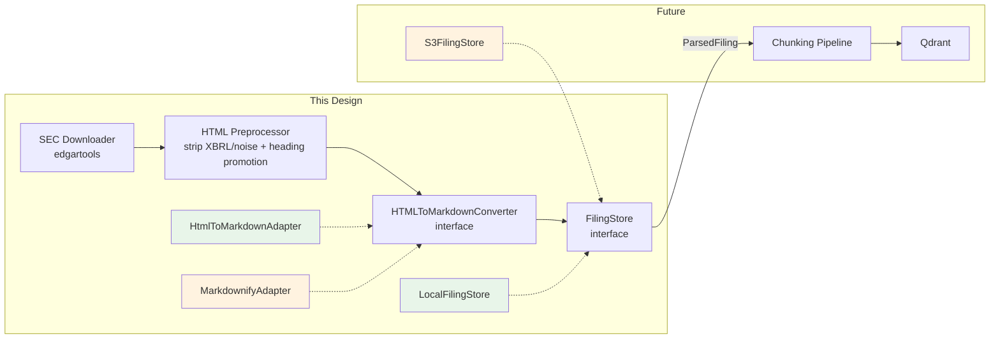
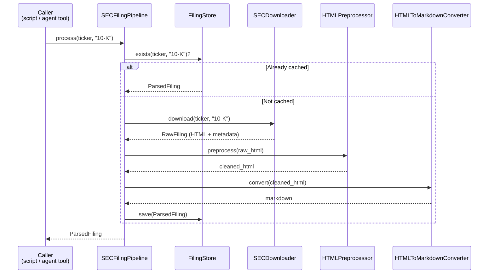
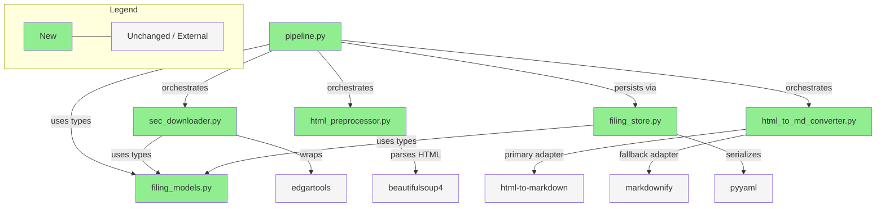

# Briefing: SEC 10-K Download & Parsing Pipeline

> Source Artifacts:
>
> - [implementation.md](./implementation.md)
> - [bdd-scenarios.md](./bdd-scenarios.md)
> - [verification-plan.md](./verification-plan.md)
> - [design.md](./design.md)

---

## 1. Design Delta

### 已解決

#### `FilingMetadata.filing_type` 改用 `FilingType` enum

- **Design 原文**: Section 5 Type Safety 說明「Store 的 method signature 用 `FilingType` enum，防止 typo」。
- **實際情況**: Plan 原本在 `FilingMetadata` 中將 `filing_type` 定義為 `str`，理由是「YAML 不支援 enum」。但 Pydantic 的 `StrEnum` field 會自動處理 str ↔ enum 轉換，deserialization 時也會驗證值是否為合法 enum member。
- **影響**: `FilingMetadata.filing_type` 應直接用 `FilingType` enum，end-to-end 皆有型別保護。
- **Resolution**: 已解決 — 將 `FilingMetadata.filing_type` 從 `str` 改為 `FilingType` enum，Pydantic 自動處理序列化。

#### SEC HTML 沒有語義化 `<h>` 標籤 — preprocessor 新增 heading promotion

- **Design 原文**: Section 3.2 HTMLPreprocessor 職責是「清理 SEC-specific HTML noise」；Section 3.3 converter「保留 heading hierarchy」隱含假設 cleaned HTML 已有 `<h>` 標籤。
- **實際情況**: 實際下載分析發現 modern 和 older filings 都沒有 `<h>` 標籤。Modern 用 styled `<div><span font-weight:700>`，older 用 `<font><b>`。
- **影響**: Preprocessor 職責從「清理 noise」擴充為「清理 noise + heading promotion」，新增 pattern-based SEC Item/PART 辨識並插入 `<h>` 標籤。
- **Resolution**: 已解決 — Plan Task 3 新增 `promote_headings` 作為第 5 條 rule，不違背 design 的 rule-based 架構。

#### EDGAR Boilerplate Removal Rule 不需要

- **Design 原文**: Section 3.2 明確列出「移除 SEC EDGAR boilerplate (header/footer)」。
- **實際情況**: edgartools 回傳 raw filing HTML，不含 EDGAR viewer chrome。SEC cover page 是 filing 自身內容。
- **影響**: Design 列出的一條 cleaning rule 不需實作，誤實作可能刪除 filing 內容。
- **Resolution**: 已解決 — Plan 以移除 hidden XBRL metadata div 取代。

#### edgartools 沒有 `fiscal_year` 屬性

- **Design 原文**: Section 3.1 輸出包含 `fiscal_year`，但未說明從 edgartools 如何取得。
- **實際情況**: edgartools 只有 `period_of_report` string，需以 `int(period_of_report[:4])` 推導。
- **影響**: 非曆年制公司（NVDA, MSFT）的 fiscal_year 推導正確性需驗證。
- **Resolution**: 已解決 — Plan Task 5 定義推導邏輯，Task 7 integration tests 用非曆年制公司驗證。

---

## 2. Overview

本次建立 SEC 10-K filing 的 download + parsing pipeline（全新 `backend/sec_filing_pipeline/` package），產出 RAG-friendly 的 Markdown 中間格式（帶 YAML frontmatter），供未來 v2 ingestion consume。共拆為 **7 個 tasks**（6 個 implementation + 1 個 integration testing）。最大風險是 SEC filing HTML **完全沒有語義化的 `<h>` 標籤**（modern filings 用 styled `<div><span font-weight:700>`，older filings 用 `<font><b>`），preprocessor 的 heading promotion 是整個 pipeline 輸出品質的核心 — 若 heading detection 失敗，downstream RAG chunking 無法正確分段。

---

## 3. Architecture & Data Flow

> 取自 design.md，提供系統架構與資料流全貌。

### System Architecture

Pipeline 由四個 component 串接，使用 adapter pattern 與 protocol 確保可替換性：



| Component               | 職責                                                                                                           | 技術選型                                       |
| ----------------------- | -------------------------------------------------------------------------------------------------------------- | ---------------------------------------------- |
| SECDownloader           | 用 edgartools 搜尋並下載 10-K raw HTML + metadata                                                              | edgartools (>=5.17.1)                          |
| HTMLPreprocessor        | Rule-based cleaning：XBRL stripping, style removal, hidden element removal, font unwrap, **heading promotion** | BeautifulSoup4                                 |
| HTMLToMarkdownConverter | Cleaned HTML → ATX Markdown；primary + fallback adapter                                                        | html-to-markdown (Rust) / markdownify (Python) |
| LocalFilingStore        | Filesystem persistence：`.md` files with YAML frontmatter                                                      | PyYAML, Pydantic                               |

### Data Flow



兩種使用模式共用同一個 pipeline：

- **Batch pre-load** — script 執行 `process_batch()`，一次下載多家公司的 10-K
- **Just-in-time (JIT)** — agent tool 在 runtime 呼叫 `process()`，偵測到 store 裡沒有該 ticker 時觸發 download

### Output Format

每份 filing 儲存為單一 `.md` 檔，使用 YAML frontmatter：

```
data/sec_filings/{ticker}/{filing_type}/{fiscal_year}.md
```

Frontmatter 包含：ticker, cik, company_name, filing_type, filing_date, fiscal_year, accession_number, source_url, parsed_at, converter。

---

## 4. File Impact

### Folder Tree

```
backend/
├── ingestion/
│   ├── __init__.py                        (new — ingestion package init)
│   └── sec_filing_pipeline/
│       ├── __init__.py                    (new — package init, re-export public API)
│       ├── filing_models.py               (new — FilingType, FilingMetadata, ParsedFiling, exceptions)
│       ├── sec_downloader.py              (new — SECDownloader, edgartools wrapper)
│       ├── html_preprocessor.py           (new — HTMLPreprocessor, rule-based cleaning + heading promotion)
│       ├── html_to_md_converter.py        (new — converter protocol, dual adapter, fallback logic)
│       ├── filing_store.py                (new — FilingStore protocol, LocalFilingStore)
│       └── pipeline.py                    (new — SECFilingPipeline orchestrator)
├── tests/
│   └── ingestion/
│       ├── __init__.py                    (new)
│       └── sec_filing_pipeline/
│           ├── __init__.py                (new)
│           ├── conftest.py                (new — shared fixtures)
│           ├── test_filing_models.py      (new — model validation)
│           ├── test_html_preprocessor.py  (new — S-prep scenarios)
│           ├── test_html_to_md_converter.py (new — S-conv scenarios)
│           ├── test_filing_store.py       (new — S-store scenarios)
│           ├── test_sec_downloader.py     (new — error mapping)
│           └── test_pipeline.py           (new — S-dl scenarios + integration)
pyproject.toml                             (modified — new dependencies + sec_integration marker)
.gitignore                                 (modified — add data/sec_filings/)
data/
└── sec_filings/                           (new — runtime output, gitignored)
    └── {TICKER}/10-K/{fiscal_year}.md
```

### Dependency Flow



---

## 5. Task 清單

| Task | 做什麼                                                                                                           | 為什麼                                                                                |
| ---- | ---------------------------------------------------------------------------------------------------------------- | ------------------------------------------------------------------------------------- |
| 1    | 建立 project setup — dependencies 與 shared models（`FilingType`, `FilingMetadata`, `ParsedFiling`, exceptions） | 所有 shared types 被後續 tasks 依賴，必須先定義                                       |
| 2    | 實作 `LocalFilingStore` filesystem persistence（atomic write, YAML frontmatter）                                 | Pipeline 的 persistence layer；atomic write 防止 concurrent corruption                |
| 3    | 實作 `HTMLPreprocessor` rule-based cleaning + heading promotion                                                  | Pipeline 的核心 quality gate — SEC HTML 無 `<h>` 標籤，需 pattern-based promotion     |
| 4    | 實作 `HTMLToMarkdownConverter` dual adapter with fallback                                                        | html-to-markdown (Rust) 極快但缺 linux-aarch64 wheel；markdownify fallback 確保跨平台 |
| 5    | 實作 `SECDownloader` edgartools wrapper with error mapping                                                       | 將 edgartools 的各種 exception/return 統一轉為 pipeline custom exceptions             |
| 6    | 實作 `SECFilingPipeline` orchestrator（`process()` / `process_batch()`）                                         | 串接所有 component，處理 cache logic, batch retry, force re-process                   |
| 7    | Integration tests — 用真實 SEC data 驗證 end-to-end pipeline                                                     | 確保 pipeline 對真實 SEC HTML 格式正確運作，覆蓋 journey scenarios                    |

---

## 6. Behavior Verification

> 共 20 個 illustrative scenarios（S-\*）+ 6 個 journey scenarios（J-\*），涵蓋 4 個 features。

### Feature: SEC Filing Download & Caching

<details>
<summary><strong>S-dl-01</strong> — Cache hit 時跳過 SEC 下載；cache miss 時觸發完整 pipeline；省略 fiscal_year 時先查 SEC 再查 cache</summary>

- Cache hit (NVDA 2024, explicit year): 直接回傳 `ParsedFiling`，`SECDownloader` 未被呼叫
- Cache miss (AAPL 2023, explicit year): 下載 → preprocess → convert → save → 回傳
- Omitted year (NVDA): 先聯繫 edgartools resolve latest year，再查 cache
- → Automated (script, mock/spy on SECDownloader)

</details>

<details>
<summary><strong>S-dl-02</strong> — Batch 處理多 tickers 時，每個 ticker 有獨立的 success/error status，不因一個失敗影響其他</summary>

- Input: `process_batch(["NVDA", "AAPL", "FAKECORP"], "10-K")`
- NVDA: success (from cache), AAPL: success (freshly downloaded), FAKECORP: error ("no 10-K filings found")
- Result 是 `Dict[str, Result]`，每個 entry 有 status + filing/error
- → Automated (script)

</details>

<details>
<summary><strong>S-dl-03</strong> — 非曆年制公司（NVDA FY ends Jan, MSFT FY ends Jun）的 fiscal_year 正確儲存於路徑和 metadata</summary>

- NVDA: period_of_report=2025-01-26 → FY2025, 存在 `NVDA/10-K/2025.md`
- MSFT: period_of_report=2024-06-30 → FY2024
- fiscal_year 跟隨 edgartools `period_of_report[:4]` 慣例
- → Automated (script)

</details>

<details>
<summary><strong>S-dl-04</strong> — 省略 fiscal_year 時回傳最近已申報的 10-K，而非未來未申報的</summary>

- NVDA 最近已申報 FY2024（filed Feb 2024），FY2025 尚未申報
- `process("NVDA", "10-K")` 回傳 FY2024，不是 FY2025 的 error
- → Automated (script)

</details>

<details>
<summary><strong>S-dl-05</strong> — 不同的 invalid input 產生可區分的 error types，讓 caller（agent tool）能做出不同回應</summary>

- Typo ticker (NVDAA) → `TickerNotFoundError`
- Foreign filer (TSM, 無 10-K) → `FilingNotFoundError`（不同於 ticker not found）
- Non-existent FY (NVDA, 1985) → `FilingNotFoundError` with "1985"
- Unsupported filing type (10-Q) → `UnsupportedFilingTypeError` with supported types
- → Automated (script) + Manual (real SEC calls for TSM, typo ticker)

</details>

<details>
<summary><strong>S-dl-06</strong> — 大小寫不同的 ticker（"NVDA" vs "nvda"）回傳相同結果，不產生重複目錄</summary>

- `process("NVDA", ...)` 和 `process("nvda", ...)` 回傳同一 `ParsedFiling`
- 只有 `data/sec_filings/NVDA/` 存在，無 `nvda/` 重複目錄
- Normalization 發生在 pipeline 和 store 兩層
- → Automated (script)

</details>

<details>
<summary><strong>S-dl-07</strong> — Batch 和 JIT 同時寫入同一 filing 時，產出的檔案完整且可解析，無 corruption 🖐️</summary>

- 兩個 concurrent `process("AAPL", "10-K", 2024)` 同時執行
- 結果檔案有 valid YAML frontmatter + non-empty Markdown body
- 依賴 `LocalFilingStore` 的 atomic write（`.tmp` → `os.replace`）
- → Automated (asyncio.gather) + Manual (兩個 terminal 同時執行, real SEC latency)

</details>

<details>
<summary><strong>S-dl-08</strong> — `force=True` 繞過 cache，重新下載並覆寫已存在的 filing</summary>

- 已 cache 的 NVDA FY2024 有 `parsed_at: T1`
- `process("NVDA", "10-K", fiscal_year=2024, force=True)` 後 `parsed_at` 更新為 T2 > T1
- SECDownloader 被呼叫（非從 cache 讀取）
- → Automated (script)

</details>

<details>
<summary><strong>J-dl-01</strong> — Batch pre-load 3 tickers 後再次執行，第二次全部從 cache 回傳，零 SEC 下載</summary>

- 第一次 `process_batch(["NVDA", "AAPL", "TSLA"], "10-K")`: 3 successes, 3 downloads
- 第二次同一 batch: 3 successes, 0 downloads, `parsed_at` 不變
- → Automated (script)

</details>

<details>
<summary><strong>J-dl-02</strong> — Agent JIT cache miss 觸發下載，後續 request（含/不含 fiscal_year）從 cache 回傳</summary>

- 首次 `process("MSFT", "10-K")` (no FY): 下載 → 回傳 ParsedFiling
- 二次 `process("MSFT", "10-K")`: cache hit, 同一 `parsed_at`
- 三次 `process("MSFT", "10-K", fiscal_year=<resolved>)`: 也 cache hit
- → Automated (script)

</details>

<details>
<summary><strong>J-dl-03</strong> — 已 cache 的壞檔案透過 `force=True` 重新處理後被修正</summary>

- 先正常 process → 手動 corrupt `.md` body 為空
- `process(force=False)`: 回傳 corrupted content (cache hit)
- `process(force=True)`: 重新下載處理，回傳 valid ParsedFiling with heading structure
- → Automated (script)

</details>

### Feature: HTML Preprocessing

<details>
<summary><strong>S-prep-01</strong> — XBRL inline tags（simple/nested/section-wrapping）被 unwrap，所有 text content 完整保留</summary>

- Simple: `<ix:nonFraction>47525000000</ix:nonFraction>` → `47525000000`
- Nested: `<ix:nonNumeric><p>Revenue was <ix:nonFraction>47525</ix:nonFraction> million</p></ix:nonNumeric>` → `<p>Revenue was 47525 million</p>`
- Section-wrapping: XBRL tag wrapping `<h2>` and `<p>` → children preserved intact
- → Automated (script, constructed HTML input)

</details>

<details>
<summary><strong>S-prep-02</strong> — Decorative styles（font-family, color）被移除；semantic styles（text-align）被保留；hidden elements 整個移除</summary>

- `<p style="font-family:Times New Roman; color:#000">text</p>` → `<p>text</p>`
- `<td style="text-align:right; padding-left:4px">$47,525</td>` → `<td style="text-align:right">$47,525</td>`
- `<div style="display:none">hidden</div>` → 完全移除（含 children）
- → Automated (script)

</details>

<details>
<summary><strong>S-prep-03</strong> — Pre-2010 filing 的 `<font>` tag content 被 unwrap 保留，不被清空</summary>

- Input: `<font style="..." size="4"><b>Item 1</b></font><font>...50,000 words...</font>`
- Output: `<b>Item 1</b>...50,000 words...` — `<font>` tags unwrapped, content intact
- Output 不得為空
- → Automated (script)

</details>

<details>
<summary><strong>J-prep-01</strong> — Real NVDA FY2024 filing HTML 經完整 preprocess 後，可見文字量 ≥ 80% 原始量，無殘留 XBRL tags</summary>

- 下載真實 NVDA FY2024 10-K HTML (~2MB)
- 比較 preprocess 前後的 visible text length
- Assert preprocessed text ≥ 80% of original, no `<ix:` tags remain
- → Automated (script, real SEC data)

</details>

### Feature: Markdown Conversion & Output Quality

<details>
<summary><strong>S-conv-01</strong> — 語義化 HTML headings（h2, h3）轉換為 ATX Markdown headings，層級順序正確</summary>

- `<h2>Item 1: Business</h2>` → `## Item 1: Business`
- `<h3>Market Competition</h3>` → `### Market Competition`
- 使用 ATX format（`#` prefix），不是 Setext（underline）
- → Automated (script)

</details>

<details>
<summary><strong>S-conv-02</strong> — 無 h-tag 的 filing（styled-p headings）經 preprocessor heading promotion 後，converter 仍產出 ATX headings</summary>

- Input: `<p><b><font size="4">ITEM 1. BUSINESS</font></b></p>` (no h-tags)
- 經 preprocessor heading promotion → converter
- Output: "ITEM 1. BUSINESS" 成為 ATX heading（`##`）
- → Automated (script, end-to-end preprocessor + converter)

</details>

<details>
<summary><strong>S-conv-03</strong> — Converter 在三種 failure mode 下正確 fallback 到 markdownify</summary>

- Import-time: html-to-markdown 無法 import → startup 即用 markdownify
- Invocation error: html-to-markdown raise exception → 該 filing 改用 markdownify
- Silent failure: html-to-markdown 回傳空字串 → 偵測到，fallback to markdownify
- Frontmatter 記錄 `converter: markdownify`
- → Automated (script, mock failure modes)

</details>

<details>
<summary><strong>S-conv-04</strong> — 兩個 adapter（html-to-markdown, markdownify）對同一 input 都產出 ATX headings，無 Setext</summary>

- Input: `<h2>Item 7: Management's Discussion</h2>`
- HtmlToMarkdownAdapter → `## Item 7: Management's Discussion`
- MarkdownifyAdapter → `## Item 7: Management's Discussion`
- 兩者都不含 Setext-style underlines
- → Automated (script)

</details>

<details>
<summary><strong>J-conv-01</strong> — Full pipeline 對真實 10-K 產出的 Markdown 有 YAML frontmatter、ATX headings、Markdown tables，無殘留 HTML/XBRL tags，body > 10KB</summary>

- 真實 NVDA FY2024 經完整 pipeline: download → preprocess → convert → save
- YAML frontmatter valid, 所有 required fields 存在
- ≥ 3 個 ATX headings, ≥ 1 個 Markdown table
- 無 `<div>`, `<span>`, `<ix:>` 殘留
- body length > 10KB
- → Automated (script, real SEC data)

</details>

### Feature: Filing Store & Output Contract

<details>
<summary><strong>S-store-01</strong> — save/exists/get/list_filings 四個操作相互一致：save 後 exists=True, get 回傳 filing; 未 save 的 exists=False, get=None</summary>

- Post-save: `exists()` → True, `get()` → valid ParsedFiling
- Non-existent: `exists()` → False, `get()` → None
- Multi-year: `list_filings()` 回傳所有已存 fiscal years
- Empty: `list_filings()` 回傳 `[]`
- → Automated (script, tmp_path)

</details>

<details>
<summary><strong>S-store-02</strong> — 首次 save 時自動建立不存在的目錄結構</summary>

- `data/sec_filings/TSLA/` 不存在
- `save()` 後 `TSLA/10-K/2024.md` 被建立
- → Automated (script, tmp_path)

</details>

<details>
<summary><strong>S-store-03</strong> — list_filings 過濾 `.DS_Store`、`.tmp` 等非 filing 檔案，只回傳 valid `{year}.md`</summary>

- 目錄含 `2024.md`, `2023.md`, `.DS_Store`, `2024.md.tmp`
- `list_filings()` → `[2024, 2023]`
- → Automated (script, tmp_path)

</details>

<details>
<summary><strong>S-store-04</strong> — Company name 含 YAML 特殊字元（apostrophe, ampersand, comma）的 filing 經 save/get roundtrip 後 metadata 完全一致</summary>

- Moody's Corporation (apostrophe), AT&T Inc. (ampersand), T. Rowe Price Group, Inc. (comma)
- Save → get → assert `company_name` exact match
- → Automated (script, tmp_path)

</details>

<details>
<summary><strong>S-store-05</strong> — Saved filing 的 frontmatter 包含所有 required fields 且型別正確</summary>

- Fields: ticker (str, uppercase), cik (str), company_name (str), filing_type (str), filing_date (ISO date), fiscal_year (int), accession_number (str, dashed), source_url (URL), parsed_at (ISO 8601 UTC), converter (str)
- `parsed_at` 含 timezone ("Z" or "+00:00"), `cik` 是 string 非 int
- → Automated (script)

</details>

<details>
<summary><strong>J-store-01</strong> — 多 ticker、多 fiscal year 的 filing lifecycle 正確隔離</summary>

- Save NVDA FY2024, NVDA FY2023, AAPL FY2024
- `list_filings("NVDA")` → [2024, 2023]; `list_filings("AAPL")` → [2024]
- 不同 ticker 的 get() 回傳不同 cik, company_name
- → Automated (script, tmp_path)

</details>

### 🔍 User Acceptance Test（PR Review 時執行）

**J-conv-01 UAT**<br>
Parsed Markdown 的文字排版是否忠實反映 10-K 內容，適合 RAG 消費？<br>
→ 處理 3-5 家 tickers（NVDA, AAPL, MSFT），在 Markdown viewer 中檢查：heading hierarchy 符合 10-K sections、financial tables 可讀、無殘留 HTML/XBRL、frontmatter 正確。比較 html-to-markdown vs markdownify 的 heading 一致性。

**S-prep-03 / S-conv-02 UAT**<br>
Pipeline 對較舊 SEC filing（pre-2015）是否能保留 content 不破壞？<br>
→ 處理 2-3 份 older filings（AAPL FY2010, GE FY2008），檢查：content 不為空、有某種 heading structure（older filings 的 heading detection 是 best-effort）。記錄 heading detection 失敗的 filing 作為 known limitation。

---

## 7. Test Safety Net

### Guardrail（不需改的既有測試）

本次變動是全新的 `backend/sec_filing_pipeline/` package，不修改任何既有模組。以下既有測試不受影響：

- **Agent tools** — `test_sec.py`, `test_financial.py`, `test_registry.py` 等 agent tool 測試不受影響（implementation plan 明確排除 `backend/agent_engine/tools/sec.py`）
- **API routing** — `test_chat.py`, `test_e2e.py` 等 API 測試不受影響
- **Eval framework** — `test_eval_runner.py`, `test_dataset_loader.py` 等 eval 測試不受影響

### 新增測試

- **Models** (`test_filing_models.py`): `FilingType` enum 值驗證、`FilingMetadata` Pydantic validation（required fields, type constraints）、exception inheritance hierarchy
- **Store** (`test_filing_store.py`): save/exists/get/list_filings 一致性、directory auto-creation、non-filing file filtering、YAML special character roundtrip（Moody's, AT&T）、metadata field 型別驗證
- **Preprocessor** (`test_html_preprocessor.py`): XBRL tag stripping（simple/nested/section-wrapping）、decorative vs semantic style 區分、hidden element 移除、`<font>` tag unwrap、heading promotion（SEC Item/PART patterns, non-heading bold 不誤判）
- **Converter** (`test_html_to_md_converter.py`): 兩個 adapter 的 ATX heading output、3 種 fallback condition（import error, runtime error, silent failure）、preprocessor + converter chain 的 end-to-end heading preservation
- **Downloader** (`test_sec_downloader.py`): error mapping（`CompanyNotFoundError` → `TickerNotFoundError` 等 4 種）、fiscal_year derivation from `period_of_report`
- **Pipeline** (`test_pipeline.py`): cache hit/miss logic、batch mixed outcomes、ticker normalization、batch transient retry vs JIT fail-fast、permanent error 不 retry、`force=True` bypass cache、concurrent write safety
- **Integration** (`test_pipeline.py`, `@pytest.mark.sec_integration`): 真實 SEC data 的 journey scenarios（J-dl-01~03, J-prep-01, J-conv-01, J-store-01）、non-calendar FY 正確性、concurrent write with real SEC latency

---

## 8. Environment / Config 變更

### 新增 Dependencies

| Dependency       | Version          | 用途                                                     |
| ---------------- | ---------------- | -------------------------------------------------------- |
| html-to-markdown | `>=3.0.2,<4.0.0` | Rust-based HTML→Markdown converter（primary，~208 MB/s） |
| markdownify      | `>=1.2.0`        | Pure Python HTML→Markdown converter（fallback，跨平台）  |
| beautifulsoup4   | `>=4.12.0`       | HTML parsing for preprocessor                            |

### Config 變更

| 檔案             | 變更                                                                                                 |
| ---------------- | ---------------------------------------------------------------------------------------------------- |
| `pyproject.toml` | 新增以上 3 個 dependencies；新增 `sec_integration` pytest marker；`addopts` 加 `not sec_integration` |
| `.gitignore`     | 新增 `data/sec_filings/`                                                                             |

### 環境需求

- `EDGAR_IDENTITY` 環境變數：SEC API 需要 User-Agent identity（格式："Name email@example.com"），integration tests 和 runtime 使用
- Docker 部署需加 `--platform linux/amd64`（html-to-markdown 缺 linux-aarch64 wheel）
