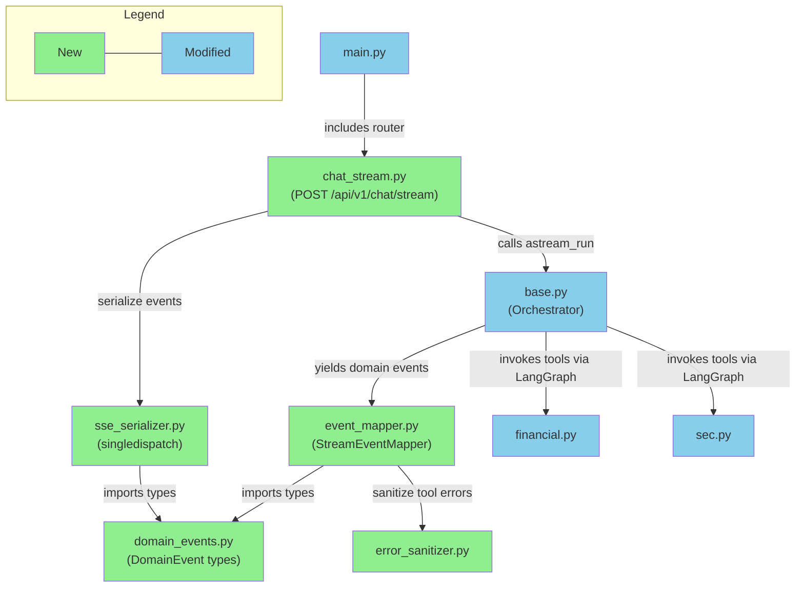

# Briefing: S1 Backend Streaming

## 1. Design Delta

### 需確認

#### `create_agent()` 與 checkpointer 整合方式不確定

- **Design 原文**: Design 明確寫 `InMemorySaver` checkpointer 整合到 agent，架構圖假設 `astream()` 可直接搭配 checkpointer 使用。
- **實際情況**: Implementation plan 在 Task 1 和 Task 7 標記了 `create_agent()` 是否接受 `checkpointer` 參數為「待驗證」，準備了三條 fallback 路徑（路徑 A: `create_agent(..., checkpointer=)`、路徑 B: 重新 compile、路徑 C: 改用 `create_react_agent`）。`handle_tool_errors` 參數同樣待驗證。
- **影響**: 若路徑 A 不可用，可能需改用 `langgraph.prebuilt.create_react_agent` 替代 `langchain.agents.create_agent`，影響 `Orchestrator` 的 agent 建構方式。
- **Resolution**: 需確認 — Task 1 驗證結果將決定路徑，若走路徑 C 則 agent 建構方式偏離 design 假設，需確認是否影響其他 design 決策。

### 已解決

#### Tool error 偵測新增 error result dict pattern

- **Design 原文**: Domain Events 和 StreamEventMapper 章節只定義 `ToolMessage(status="error")` → `ToolError` 一條路徑。
- **實際情況**: Plan 新增第二條偵測路徑：現有 tools 內部 catch exception 後回傳 `{"error": True, "message": "..."}` dict，mapper 需解析 JSON 並檢查 `error` key。
- **影響**: `StreamEventMapper` 多一個 `is_error_result()` 分支。
- **Resolution**: 已解決 — 這是現有 codebase 的既有 convention，design 未涵蓋，plan 的偵測策略合理。

#### `@wrap_tool_call` middleware 放棄，改用 mapper-side 偵測

- **Design 原文**: Design 未提及 tool-level middleware，隱含 mapper 端偵測。
- **實際情況**: Plan 曾考慮 `@wrap_tool_call` middleware，因 Context7 查到該 API 可能非標準 export 而放棄。
- **影響**: 無實質影響，最終與 design 一致。
- **Resolution**: 已解決 — 僅多了一個排除記錄。

#### `Usage` dataclass 與 `Finish` 結構擴展

- **Design 原文**: `Finish(finish_reason)` 只列一個欄位，但 wire format 中 `finish` event 已描述含 `usage` 欄位。
- **實際情況**: Plan 新增獨立 `Usage` dataclass，擴展 `Finish` 為 `Finish(finish_reason, usage)`，mapper 累計 token 用量。
- **影響**: Domain event 型別定義比 design 更具體，方向一致。
- **Resolution**: 已解決 — Design 已表達 S1 要提供分項 token 數，plan 將其落實為具體結構。

---

## 2. Overview

本次在 FinLab-X 後端加入 SSE streaming 能力——從 LangGraph agent 透過 `astream(version="v2")` 取得即時 chunks，經 `StreamEventMapper` 翻譯為 domain events，再經 `singledispatch` SSE serializer 輸出為 AI SDK UIMessage Stream Protocol v1 wire format，共拆為 9 個 task（含 1 個 dependency 驗證、1 個 observability POC、5 個核心實作、1 個 tool 改造、1 個文件更新）。最大風險是 LangGraph v2 chunk 格式在 `messages`/`updates`/`custom` 三種 stream mode 下的組合行為需仰賴 Context7 驗證結果——若 mapper 的翻譯邏輯與實際格式不符，text block 配對和 tool call 生命週期將錯亂。

---

## 3. File Impact

### (a) Folder Tree

```
backend/
  agent_engine/
    streaming/                                (new — streaming pipeline package)
      __init__.py                             (new — package init)
      domain_events.py                        (new — 11 frozen dataclasses, mapper/serializer 共用契約)
      event_mapper.py                         (new — LangGraph chunks → domain events)
      sse_serializer.py                       (new — singledispatch, domain events → wire format)
      error_sanitizer.py                      (new — tool error sanitization utility)
    agents/
      base.py                                 (modified — astream_run, checkpointer, regenerate)
    tools/
      financial.py                            (modified — 移除 @observe, 加 stream progress)
      sec.py                                  (modified — 移除 @observe, 加 stream progress)
    docs/
      streaming_observability_guardrails.md   (modified — Rule 3 更新)
  api/
    routers/
      chat_stream.py                          (new — POST /api/v1/chat/stream endpoint)
    main.py                                   (modified — include chat_stream router)
  tests/
    streaming/                                (new — streaming test package)
      __init__.py                             (new)
      test_domain_events.py                   (new — domain event unit tests)
      test_event_mapper.py                    (new — mapper unit tests)
      test_sse_serializer.py                  (new — serializer unit tests)
      test_error_sanitizer.py                 (new — sanitizer unit tests)
      test_poc_observability.py               (new — POC gate verification, @pytest.mark.poc)
    api/
      test_chat_stream.py                     (new — endpoint tests)
    tools/
      test_observe_decorators.py              (modified — 反轉：驗證 tools 不再有 @observe)
    agents/
      test_orchestrator_langfuse.py           (modified — 新增 astream_run tracing tests)
pyproject.toml                                (modified — 新增 langgraph dependency)
```

### (b) Dependency Flow



---

## 4. Task 清單

| Task | 做什麼 | 為什麼 |
|------|--------|--------|
| 1 | 新增 `langgraph` dependency 並驗證整合方式 | `astream()`、`InMemorySaver`、`get_stream_writer()` 的來源，需確認 `create_agent()` + checkpointer 的整合路徑 |
| 2 | Observability POC（Gates 1-6） | Design 要求 POC 全數通過後才進入正式實作，驗證 Langfuse 在 streaming 路徑下的 tracing 基礎設施 |
| 3 | Domain Events + Error Sanitizer | Mapper 與 Serializer 的共用契約層，error sanitizer 是 tool error → SSE 路徑上的 security boundary |
| 4 | SSE Serializer | 將 domain events 轉為 AI SDK UIMessage Stream Protocol v1 wire format（`data: {json}\n\n`） |
| 5 | StreamEventMapper | 有狀態翻譯器，處理 LangGraph 不做的事：text block 配對、message framing、tool call 生命週期拼湊 |
| 6 | Tool 改造——移除 `@observe()`、加 progress writer | `CallbackHandler` 已自動 trace，`@observe()` 反而產生 disconnected traces；加 `get_stream_writer()` 送 progress |
| 7 | `Orchestrator.astream_run()` + Checkpointer | 核心 streaming method，`InMemorySaver` 管對話狀態，含 regenerate 支援 |
| 8 | `POST /api/v1/chat/stream` endpoint | Request 驗證、per-session lock（409）、SSE streaming response、client disconnect handling |
| 9 | Documentation & Final Verification | 更新 observability guardrails Rule 3，完整 regression 確認 |

---

## 5. Behavior Verification

> 共 28 個 illustrative scenarios（S-*）+ 5 個 journey scenarios（J-*），涵蓋 8 個 features。

### Feature: SSE Streaming Pipeline

<details>
<summary><strong>S-stream-01</strong> — 純文字回覆產出正確的 start → text-start/text-delta/text-end → finish(stop) 生命週期</summary>

- Session "sess-001" 存在
- 送出 `{ "message": "你好，請自我介紹", "id": "sess-001" }`
- 預期：唯一的 `text-start`/`text-end` 配對、一或多個 `text-delta`、terminal `finish(stop)`
- → Automated

</details>

<details>
<summary><strong>S-stream-02</strong> — Tool call 回覆在 tool 事件前正確關閉 text block，且 tool 生命週期完整</summary>

- 送出觸發 tool call 的 prompt
- 預期：text block `text-end` 先於 `tool-call-start`；每個 tool call 有 start → end → result；後續文字有新 `text-start`
- → Automated

</details>

<details>
<summary><strong>S-stream-03</strong> — 平行 tool calls 各自產出獨立且完整的生命週期事件</summary>

- 送出觸發兩個 tool calls 的 prompt
- 預期：至少 2 個唯一 `toolCallId`，各有完整 start → end → result，單一 `finish`
- → Automated

</details>

<details>
<summary><strong>S-stream-04</strong> — Session ID 為必填、空字串被拒、有效 ID 在 start event 中回傳確認</summary>

- `id: "sess-abc"` → 200 + start event 含 `sessionId`
- 缺少 `id` → 422
- `id: ""` → 422
- → Automated

</details>

<details>
<summary><strong>S-stream-05</strong> — 空字串或純空白 message 被拒絕，不啟動 SSE stream</summary>

- `message: ""` / `message: "   \n\t  "` → 422
- → Automated

</details>

<details>
<summary><strong>S-stream-06</strong> — 同時帶有 message 和 trigger 的矛盾 request 產生確定性行為</summary>

- 同時送 `message` + `trigger: "regenerate"` + `messageId`
- 預期：endpoint 產出確定性回應（非 crash 或 undefined behavior）
- → Automated

</details>

### Feature: Conversation Continuity

<details>
<summary><strong>S-conv-01</strong> — 同 session ID 保留對話上下文，不同 session ID 彼此隔離</summary>

- Same session (sess-100): 第二輪回覆引用 TSMC 而無需重述
- Different session (sess-200 → sess-201): 第二輪不知道 TSMC，要求澄清
- → Automated

</details>

<details>
<summary><strong>S-conv-02</strong> — Server 重啟後同 session ID 視為全新對話，不報錯</summary>

- 建立多輪對話 → 重啟 server → 同 session 送新訊息
- 預期：HTTP 200、正常 SSE stream、agent 無先前記憶（InMemorySaver 揮發性）
- → Automated

</details>

### Feature: Regenerate (Retry Last Response)

<details>
<summary><strong>S-regen-01</strong> — Regenerate 移除最後 assistant turn 並產出新 messageId 的 stream</summary>

- 先完成一輪對話取得 `messageId`，再送 `trigger: "regenerate"`
- 預期：新 `messageId` ≠ 舊的；可能重新執行 tools；`finish(stop)`
- → Automated

</details>

<details>
<summary><strong>S-regen-02</strong> — Regenerate 前置條件驗證：不存在的 session → 404、無 assistant message → 404/422、messageId 不匹配 → 422</summary>

- 三個 table-driven cases 覆蓋所有前置條件失敗場景
- → Automated

</details>

### Feature: Tool Error Resilience

<details>
<summary><strong>S-tool-01</strong> — 單一 tool 失敗不終止 stream，成功的 tool 照常回傳，agent 用可用資料回覆</summary>

- 兩個平行 tool calls：一個 timeout、一個成功
- 預期：`data-tool-error`（失敗）+ `tool-result`（成功）+ text response + `finish(stop)`
- → Automated

</details>

<details>
<summary><strong>S-tool-02</strong> — 所有 tools 都失敗時 stream 仍正常完成，agent 解釋失敗原因</summary>

- 兩個 tool calls 都失敗
- 預期：多個 `data-tool-error`、agent 產出解釋文字、`finish(stop)`
- → Automated

</details>

<details>
<summary><strong>S-tool-03</strong> — Tool error 不洩漏 API keys、internal paths、connection strings 或 stack traces</summary>

- Tool 拋出含敏感資訊的 exception
- 預期：`data-tool-error` 的 `error` 欄位已 sanitized、保留人類可讀描述
- → Automated

</details>

### Feature: Stream-Level Error Handling

<details>
<summary><strong>S-err-01</strong> — LLM provider 不可用時產出 start → error → finish(error) 的乾淨終止序列</summary>

- LLM 不可用（invalid API key / 503）
- 預期：`start` + `error`（含 errorText）+ `finish(error)`、無 `text-delta`
- → Automated

</details>

<details>
<summary><strong>S-err-02</strong> — 文字生成途中 crash 先關閉開啟的 text block 再 emit error</summary>

- LLM 產出部分文字後 crash
- 預期：`text-end` 在 `error` 之前、`finish(error)`
- → Automated

</details>

<details>
<summary><strong>S-err-03</strong> — Fatal error 不為 pending tool calls emit 合成的 ToolError（DD-05）</summary>

- Agent 已 emit tool-call-start(B, C) 但 fatal error 在 tool 完成前發生
- 預期：只有 `error` + `finish(error)`，B 和 C 無任何 resolution event
- → Automated

</details>

<details>
<summary><strong>S-err-04</strong> — Mid-stream error 留下 partial checkpoint 後的後續 request 不 crash</summary>

- Session 在 error 後有 corrupted state（AIMessage with tool_calls 但無 ToolMessages）
- 預期：後續 request 回傳有效 SSE stream 或明確 HTTP error（非 500 crash 或 hang）
- → Automated

</details>

<details>
<summary><strong>S-err-05</strong> — Server hard crash（OOM kill / pod eviction）不產出 finish event，client 需偵測 connection close 🖐️</summary>

- 進行中的 stream 被 server process kill 中斷
- 預期：無 `error` 或 `finish` event，SSE connection 直接斷開
- → Manual Behavior Test

</details>

### Feature: Tool Progress

<details>
<summary><strong>S-prog-01</strong> — Progress event 在 tool-call-end 和 tool-result 之間出現，帶 transient: true 且含 status/message/toolName</summary>

- 送出觸發帶 progress reporting 的 tool call 的 prompt
- 預期：`data-tool-progress` event 正確定位於生命週期中
- → Automated

</details>

<details>
<summary><strong>S-prog-02</strong> — 無法匹配 pending tool call 的 progress event 被靜默丟棄，stream 不受影響</summary>

- 注入 toolName 不匹配任何 pending tool call 的 custom chunk
- 預期：stream 正常完成、無 unexpected error
- → Automated

</details>

<details>
<summary><strong>S-prog-03</strong> — 同名平行 tools 的 progress 歸屬到第一個匹配的 pending call（V1 已知限制）</summary>

- Agent 呼叫 `yfinance_stock_quote` 兩次（TSMC + AAPL）
- 預期：progress 可能歸屬錯誤——V1 accepted limitation
- → Automated

</details>

### Feature: Concurrent Session Safety

<details>
<summary><strong>S-conc-01</strong> — 同 session 的第二個並發 request 立即被 HTTP 409 拒絕，第一個 stream 不受影響</summary>

- Session "sess-900" 正在 streaming，第二個 request 到達
- 預期：第二個得 409、第一個正常 `finish(stop)`
- → Automated

</details>

<details>
<summary><strong>S-conc-02</strong> — 不同 session 的並發 request 各自獨立完成，無 blocking 或資料交叉</summary>

- sess-901 和 sess-902 同時 streaming
- 預期：各自完成、response 各引用正確的股票
- → Automated

</details>

<details>
<summary><strong>S-conc-03</strong> — Session 在前一 request error 後仍可正常使用（lock 已釋放）</summary>

- Session error 後送新 request
- 預期：HTTP 200（非 409）、正常 `finish(stop)`
- → Automated

</details>

### Feature: Client Disconnect Handling

<details>
<summary><strong>S-disc-01</strong> — Client disconnect 時 server 取消 agent task、Langfuse trace 正確 flush 並關閉</summary>

- Client 在 streaming 中斷開連線
- 預期：server 停止處理、無 orphaned LLM processing
- → Automated（Langfuse dashboard 驗證部分需 Manual 🖐️）

</details>

<details>
<summary><strong>S-disc-02</strong> — Server checkpoint 含完整回覆但 client 只收到部分——V1 已知 divergence</summary>

- Client 在收到 200 tokens 後 disconnect，server 已 checkpoint 完整 500 tokens
- 預期：後續 request 的 agent history 含 client 未完整接收的回覆
- → Automated

</details>

<details>
<summary><strong>S-disc-03</strong> — Client reconnect 後重送同一訊息，conversation history 可能出現重複</summary>

- Disconnect → reconnect → 同一 message → 問歷史
- 預期：HTTP 200、history 可能含重複（V1 accepted）
- → Automated

</details>

<details>
<summary><strong>S-disc-04</strong> — 每個 turn 產出唯一的 messageId，包括 server 事件後的新 turn</summary>

- 三個 turn 各取 messageId
- 預期：M1 ≠ M2 ≠ M3
- → Automated

</details>

### Journey Scenarios

<details>
<summary><strong>J-stream-01</strong> — 完整金融分析對話：send → tool call with progress → context-aware follow-up → regenerate</summary>

- Turn 1: 金融問題觸發 tool call + progress events + `finish(stop)`
- Turn 2: follow-up 展現 context awareness（引用 turn 1 data）
- Turn 3: regenerate 產出新 `messageId`、stream 正常完成
- → Automated

</details>

<details>
<summary><strong>J-regen-01</strong> — Tool 失敗後 regenerate 重新執行 tool 並成功</summary>

- Turn 1 有 `data-tool-error` → regenerate → tool 這次成功
- → Automated

</details>

<details>
<summary><strong>J-tool-01</strong> — Tool 跨 turn 從失敗恢復，context 保留</summary>

- Turn 1: yfinance timeout + SEC 成功 → agent 用 SEC 資料回覆
- Turn 2: 「再試一次查股價」→ yfinance 成功 → agent 知道是 AAPL
- → Automated

</details>

<details>
<summary><strong>J-err-01</strong> — Fatal error mid-conversation 後 session 恢復正常</summary>

- Turn 1 成功 → Turn 2 LLM crash → Turn 3 正常 streaming
- → Automated

</details>

<details>
<summary><strong>J-disc-01</strong> — Disconnect 後 regenerate 丟棄 server 已完成但 client 未完整接收的回覆</summary>

- Client disconnect mid-stream → checkpoint 含完整回覆 → regenerate 丟棄該回覆
- V1 accepted behavior
- → Automated

</details>

### 🔍 User Acceptance Test（PR Review 時執行）

**J-stream-01**<br>
完整金融分析 streaming workflow（multi-turn + tool lifecycle + context + regenerate）。<br>
→ Reviewer 使用 curl 或 test client 執行 J-stream-01 script，確認 SSE events 順序正確、context 延續、regenerate 正常

**S-tool-03**<br>
Tool error 的 sanitization 是否安全且足夠 informative。<br>
→ Reviewer 觸發各種 tool failure，檢查 `data-tool-error` events 是否洩漏 credentials 或 internal paths

---

## 6. Test Safety Net

### Guardrail（不需改的既有測試）

- **`POST /api/v1/chat` endpoint** — request dispatch、response format 測試不受影響，新 endpoint 完全獨立於 `/api/v1/chat/stream`
- **`Orchestrator.run()` / `arun()` 方法** — 同步/非同步執行路徑有既有 tests 保護，`astream_run()` 為新增方法不影響既有呼叫介面

### 需調整的既有測試

| 影響區域 | 目前覆蓋 | 調整原因 |
|----------|---------|----------|
| `test_observe_decorators.py` | 驗證 tools 有 `@observe()` wrapper（`__wrapped__` attribute） | 反轉 assertion：改為驗證 tools **不再有** `@observe()`，因 `CallbackHandler` 自動 trace 取代 |

### 新增測試

- **Domain events + Error sanitizer**：frozen 不可變性、建構 equality、API key / internal path / stack trace / connection string 過濾、正常 message 保留
- **SSE Serializer**：11 event types wire format 正確性、snake_case → camelCase 映射、ToolProgress `transient: true`、unknown type → `TypeError`、JSON special character escape
- **StreamEventMapper**：text-only / text+tool / parallel tools / tool error / tool progress / multi text block / usage accumulation、mock LangGraph chunks 驅動
- **`Orchestrator.astream_run()`**：happy path domain event 序列、checkpointer config thread_id、Langfuse `CallbackHandler` injection、regenerate state truncation、messageId mismatch → `ValueError`、exception → `StreamError` + `Finish(error)`
- **Streaming endpoint**：HTTP 422（id 缺失/空字串/message+trigger 衝突/regenerate 缺 messageId）、HTTP 409（session lock）、SSE response format 與 headers、client disconnect
- **POC Observability**：Gates 1-6（single trace、tool observation attach、disconnect clean close、exception visible、concurrent no contamination、Braintrust coexistence）

---

## 7. Environment / Config 變更

| 項目 | Before | After | 影響 |
|------|--------|-------|------|
| `langgraph` dependency | 未宣告（可能被 langchain transitively 引入） | `langgraph>=0.5.0` 顯式宣告於 `pyproject.toml` | 需執行 `uv sync`；CI 需能安裝此 dependency |
