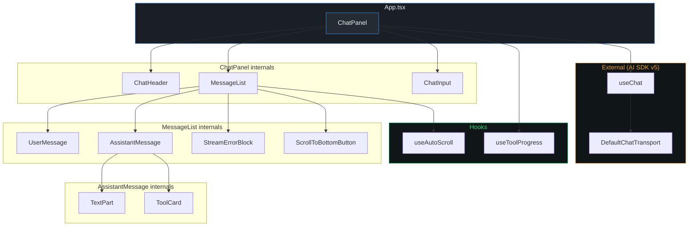
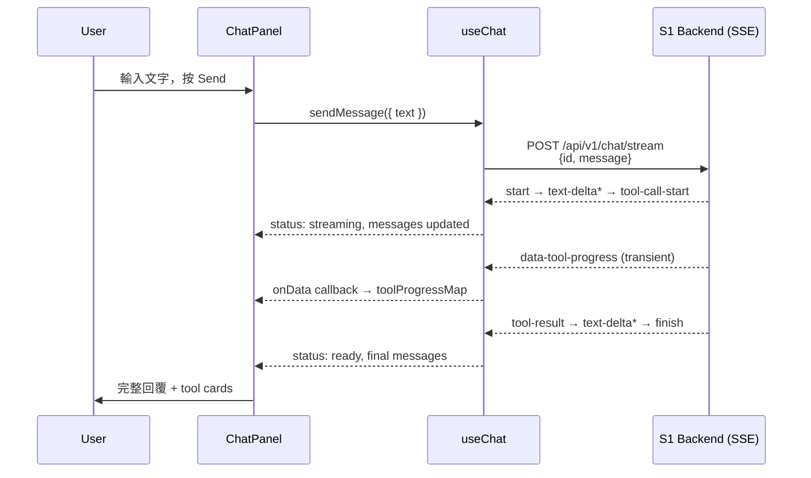
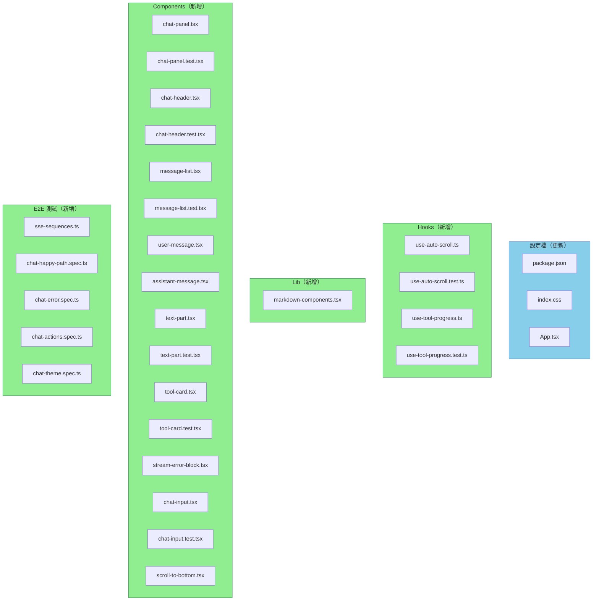

# S3 Streaming Chat UI Briefing

> Companion document to [`implementation_S3_streaming_chat_ui.md`](./implementation_S3_streaming_chat_ui.md)（implementation plan）。
> Purpose：供 human review 的架構概覽。視覺規格參考 [`S3_layout_wireframe.html`](./S3_layout_wireframe.html)、[`S3_state_storyboard.html`](./S3_state_storyboard.html)。

---

## 1. Design Overview

S3 是純前端子系統，透過 AI SDK v5 `useChat` 消費 S1 的 SSE endpoint，以 parts-based rendering 呈現 streaming 文字與 tool cards。

### Component 架構



### 資料流（SSE → UI）



### 設計決策

| # | 決策 | 選擇 | 理由 |
| --- | --- | --- | --- |
| D1 | State 管理 | `useChat` + 2 個 `useState` | 不需 Redux/Zustand，AI SDK 原生管理 messages/status |
| D2 | Request body | 只送最新 `UIMessage` + `id` | DR-06：後端管 conversation history，避免 payload 膨脹 |
| D3 | Tool progress | Transient `onData` callback | `data-tool-progress` 不存入 message history，需獨立管理 |
| D4 | Markdown | `react-markdown` + `remark-gfm` | React 生態標準，安全（無 `dangerouslySetInnerHTML`） |
| D5 | Dark/Light | 跟隨系統 `prefers-color-scheme` | shadcn/ui 原生支援，V1 不做手動切換 |
| D6 | Tool card dimmed | `dimmed` prop + `opacity: 0.5` | ERROR 2b：stream 中斷時灰化仍在執行中的 tool card |

---

## 2. File Impact Map



**變更統計：** 3 個更新 + 27 個新增 = 30 個檔案。純前端變更，不影響後端。

---

## 3. Task Breakdown

### Task 1：依賴安裝 + 主題 + 字型（Plan Task 1）

安裝 `react-markdown`、`remark-gfm`，建立 Cool Slate CSS 變數系統。所有後續 component 依賴這些 design tokens。

**TDD：**
- 驗證 `pnpm run build` 不因新的 CSS 變數而失敗
- 驗證 `tsc --noEmit` 通過（依賴型別正確）

### Task 2：自訂 Hooks — useAutoScroll + useToolProgress（Plan Task 2）

封裝可捲動容器的 smart auto-scroll 邏輯和 transient tool progress state 管理。

**TDD：**
- `useAutoScroll`：在底部 → `isAtBottom` true；往上捲 → false；`scrollToBottom()` 正確呼叫 `scrollTo`
- `useToolProgress`：`onData` 收到 `data-tool-progress` → map entry 建立；非 tool-progress 不影響 map；`clearProgress()` 清空 map

### Task 3：葉節點渲染 — TextPart + ToolCard（Plan Task 3）

TextPart 封裝 `react-markdown` + streaming cursor。ToolCard 處理 5 種視覺狀態（含 `dimmed`），對應 storyboard States 3–5 和 ERROR 1–2b。

關鍵：ToolCard 的 `dimmed` prop 處理 ERROR 2b 場景 — stream 中斷時仍在 `input-available` 的 tool card 灰化顯示。

**TDD：**
- `TextPart`：bold、list、table、GFM link（`target="_blank"`）正確渲染；streaming cursor 在 `isStreaming=true` 可見
- `ToolCard`：`input-available` → amber dot；+ progress → 顯示 progress message；`output-available` → green dot；`output-error` → red dot + errorText；`dimmed=true` → grey dot + `opacity: 0.5`；click toggle 展開/收合 detail

### Task 4：訊息組件 — UserMessage + AssistantMessage + StreamErrorBlock + MessageList（Plan Task 4）

組合葉節點 renderer 成訊息流。遵循 TDD：先撰寫 `MessageList` tests（此時 sub-components 尚未存在，全部 RED），再實作所有 sub-components 和 `MessageList` 使測試通過（GREEN），最後 refactor 並 re-test。

關鍵：`AssistantMessage` 接收 `isError` prop，當 `status === 'error'` 時對仍在 `input-available` 的 ToolCard 傳 `dimmed=true`。

**TDD：**
- 正確順序渲染 user / assistant messages
- `status=submitted` → loading dots 可見
- `status=error` → StreamErrorBlock 可見；Retry 呼叫 `onRetry`
- 不在底部時 scroll-to-bottom 按鈕出現

### Task 5：輸入 + Header — ChatInput + ChatHeader（Plan Task 5）

ChatInput：auto-resize textarea、Send/Stop 按鈕切換、Enter 送出（Shift+Enter 換行）。
ChatHeader：品牌「FinLab-X v1」+ 紅色調「清除對話」按鈕。

**TDD：**
- `status=ready` → Send 可見；`status=streaming` → Stop 可見；`status=error` → Send disabled
- 輸入 + Send → `onSend` 呼叫正確；Enter 送出、Shift+Enter 不送
- 「清除對話」click → `onClearSession` 呼叫

### Task 6：ChatPanel 整合 + App.tsx（Plan Task 6）

頂層容器：接線 `useChat` + `DefaultChatTransport`，管理 `chatId` 和 `toolProgressMap`。

關鍵介面（DR-06）：`prepareSendMessagesRequest` 只送最新 `UIMessage` + session `id`。

```tsx
// ChatPanel useChat 接線
const { messages, status, error, sendMessage, stop, regenerate } = useChat({
  id: chatId,
  transport: new DefaultChatTransport({
    api: `${import.meta.env.VITE_API_BASE_URL ?? ''}/api/v1/chat/stream`,
    prepareSendMessagesRequest: ({ id, messages, trigger, messageId }) => {
      if (trigger === 'submit-user-message') {
        return { body: { id, message: messages.at(-1) } };
      }
      if (trigger === 'regenerate-assistant-message') {
        return { body: { id, trigger: 'regenerate', messageId } };
      }
      throw new Error(`Unsupported trigger: ${trigger}`);
    },
  }),
  onError: () => {},
  onData,
});
```

**TDD：**
- Mock `useChat`：送出訊息 → `sendMessage` 呼叫正確
- 清除對話 → mocked `useChat` 收到的 `id` 改變
- Error → error block 可見、retry 呼叫 `regenerate`

### Task 7：E2E 測試 — Playwright Mock Backend（Plan Task 7）

Playwright `page.route()` 攔截 `/api/v1/chat/stream`，回傳預錄 SSE sequences。每個測試場景對應 storyboard HTML 的特定 state。

**TDD：**
- `chat-happy-path.spec.ts`：States 1–7 完整 lifecycle
- `chat-error.spec.ts`：ERROR 1/1b/2/2b + Retry
- `chat-actions.spec.ts`：清除對話、Stop、auto-scroll
- `chat-theme.spec.ts`：dark/light mode + Cool Slate 配色

### Integration Validation（BDD）

以下行為在所有 tasks 完成後才能驗證，涵蓋跨 component 的整合行為：

**行為 1**：使用者送出訊息後，完整經歷 submitted → streaming → tool cards → final text → ready 的 lifecycle，對應 storyboard States 1–7。
**Agent 驗證**：執行 `pnpm exec playwright test chat-happy-path.spec.ts`，確認所有 state 轉換正確。

**行為 2**：Tool-level error 不中斷 stream — 失敗的 tool card 顯示 red dot，成功的顯示 green dot，agent 繼續用可用資料回覆。
**Agent 驗證**：執行 `pnpm exec playwright test chat-error.spec.ts`，確認 tool error 場景 stream 繼續。

**行為 3**：Stream-level error 時，部分文字保留、仍在執行的 tool card 灰化、error block 出現，Retry 重新生成成功。
**Agent 驗證**：同上 E2E，確認 ERROR 2/2b 場景和 Retry 流程。

**行為 4**：清除對話後，session 完全重置（新 `chatId`、空 messages、toolProgress 清空），新訊息正常運作。
**Agent 驗證**：執行 `pnpm exec playwright test chat-actions.spec.ts`，確認 Clear Session 後的完整 lifecycle。

### Observable Verification（E2E）

| # | 方法 | 步驟 | 預期結果 | Tag |
| --- | --- | --- | --- | --- |
| 1 | Browser | 開啟 `localhost:5173`，輸入「台積電最近股價如何」並送出 | Loading dots → tool cards → streaming 文字 → 完成，input 恢復 | [E2E] |
| 2 | Browser | 在 streaming 中點擊 Stop | Streaming 停止，部分文字保留，input 恢復 | [E2E] |
| 3 | Browser | 點擊已完成的 tool card | Detail 展開顯示 INPUT / OUTPUT JSON | [E2E] |
| 4 | Browser | 點擊「清除對話」→ 輸入新問題並送出 | 畫面清空 → 新訊息正常 streaming | [E2E] |
| 5 | Browser | 切換系統 dark/light mode | 配色自動切換，dark mode 背景 `#101518` | [E2E] |
| 6 | Playwright | `pnpm exec playwright test` | 所有 E2E 測試通過 | [E2E] |

---

## 4. Test Impact Matrix

S3 是全新子系統，沒有既有測試需要調整。

| 測試檔案 | 說明 | 分類 | 理由 |
| --- | --- | --- | --- |
| `frontend/src/App.test.tsx` | S2 建立的 App shell baseline test | Guardrail → 需調整 | App.tsx 從 placeholder 改為 `<ChatPanel />`，測試需更新 |

---

## 5. Environment / Config Changes

| 項目 | 變更前 | 變更後 |
| --- | --- | --- |
| `react-markdown` | 未安裝 | `pnpm add react-markdown` |
| `remark-gfm` | 未安裝 | `pnpm add remark-gfm` |
| `VITE_API_BASE_URL` | 無（S2 未使用） | 開發環境預設空字串（Vite proxy），production 設定實際 URL |
| `index.css` | S2 基礎 Tailwind 設定 | 新增 Cool Slate CSS 變數（12 個 design tokens） |

---

## 6. Risk Assessment

| 風險 | 影響範圍 | 緩解措施 |
| --- | --- | --- |
| AI SDK v5 `useChat` API 變動 | `chat-panel.tsx`、所有仰賴 `messages` / `status` 的 component | 已透過 Context7 驗證目前 API；`useChat` mock 在單元測試中隔離；若 API 變動，影響集中在 `ChatPanel` |
| `tool-{toolName}` 動態 type matching | `assistant-message.tsx` 的 `part.type.startsWith('tool-')` | AI SDK 官方文件確認此為正確匹配方式；若未來改為固定 type，只需修改一處判斷 |
| `data-tool-progress` transient event 無法在 render 時取得 | `useToolProgress` hook | 已設計 `onData` callback 獨立管理；E2E 測試驗證完整 lifecycle |
| Playwright SSE mock 時序依賴 | `e2e/fixtures/sse-sequences.ts` | `createSSEResponse` 支援 `delayMs` 參數模擬真實延遲；預錄 sequences 嚴格遵循 Event Taxonomy |
| S2 scaffold 尚未完成 | 所有 S3 檔案 | S3 plan 明確標示 S2 為前置依賴；S2 完成前不啟動 S3 實作 |

---

## 7. Decisions & Verification

### 設計決策

1. **State 管理用 `useChat` + `useState`，不引入 Redux/Zustand** — AI SDK 已提供完整的 chat state management，額外狀態只有 `chatId` 和 `toolProgressMap`。
2. **Request body 只送最新 message + session id（DR-06）** — 後端管 conversation history，避免 payload 膨脹和安全風險。
3. **Tool progress 用 `onData` callback 獨立管理** — `data-tool-progress` 是 transient event，AI SDK 不存入 `message.parts`。
4. **ToolCard 用 `dimmed` prop 處理 ERROR 2b** — stream 中斷時仍在 `input-available` 的 tool card 視覺灰化，而非直接移除或變更狀態。
5. **Dark/Light mode 跟隨系統，不做手動 toggle** — V1 簡化 scope，shadcn/ui 原生支援 `prefers-color-scheme`。
6. **E2E 用 Playwright `page.route()` mock SSE** — 不需真實後端，預錄 event sequences 確保測試穩定且可重現。

### 人工驗證計畫

完成所有 tasks 後，TDD 和 BDD 已由 agent 驗證。以下是 reviewer 的手動驗證步驟。

**Happy Path：**
1. 啟動 Vite dev server：`cd frontend && pnpm run dev`
2. 開啟 `http://localhost:5173`
3. 確認 header 顯示「FinLab-X」+「v1」tag + 紅色調「清除對話」按鈕
4. 在輸入框輸入「台積電最近股價和新聞如何？」並按 Enter
5. 確認 loading dots 出現 → 文字逐字 streaming → tool cards 出現（amber → green）→ 最終回覆完成 → cursor 消失 → input 恢復可用
6. 點擊已完成的 tool card，確認 detail 展開顯示 INPUT / OUTPUT

**Edge Case：**
7. 在 streaming 中點擊 Stop → streaming 停止，已生成文字保留
8. 送多個訊息讓畫面超過 viewport → 確認自動 scroll 到底部
9. 往上捲 → scroll-to-bottom 按鈕出現 → 點擊回到底部

**Error Case：**
10. （需搭配 mock 或 S1 error 場景）確認 tool error 時 red dot 顯示，stream 繼續
11. 確認 stream error 時 error block 出現，顯示「回覆中斷」和 Retry 按鈕
12. 點擊 Retry → 重新生成成功

**Regression：**
13. 點擊「清除對話」→ 訊息全部消失 → 送新訊息 → 正常運作
14. 切換系統 dark/light mode → 確認配色自動切換
15. 執行 `pnpm exec vitest run` → 所有單元測試通過
16. 執行 `pnpm exec playwright test` → 所有 E2E 測試通過
