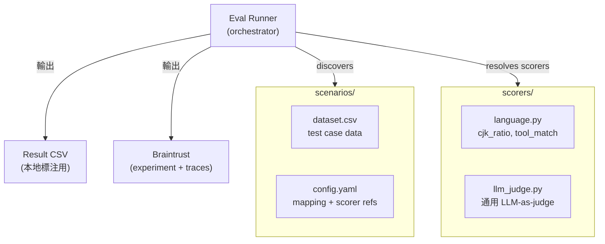
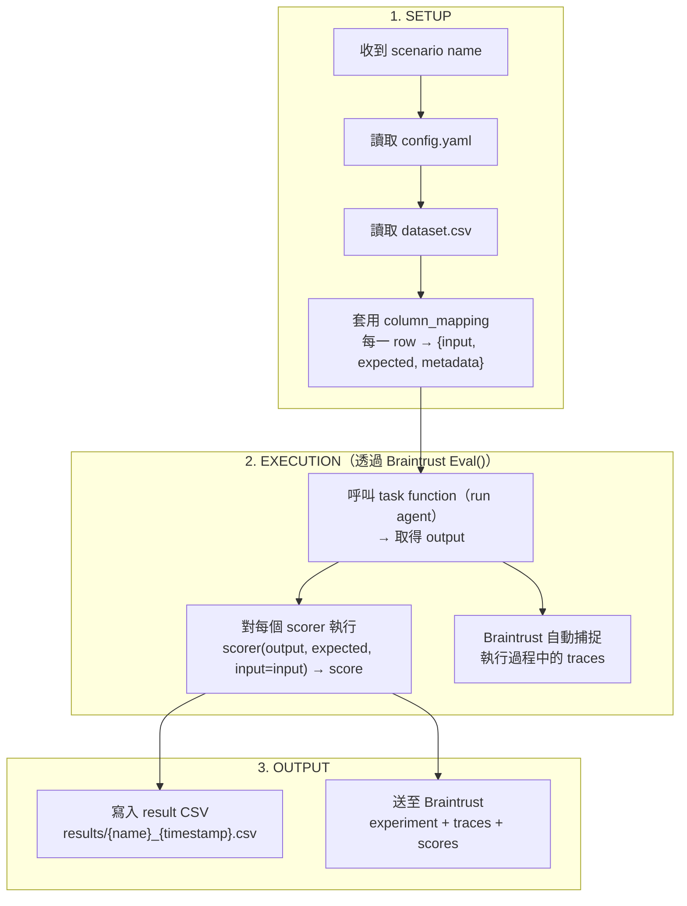
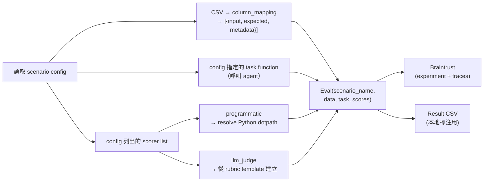
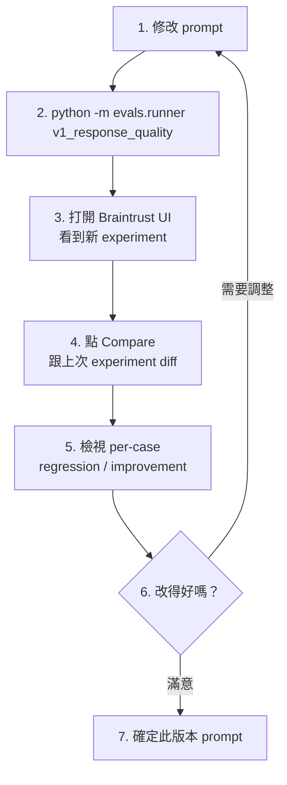

# Design: CSV 驅動的 Evaluation 管理系統 + Braintrust 整合

## 概述

將 evaluation 系統從寫死的 Python dataclass 轉換為 CSV 驅動、人類可編輯的工作流程，並整合 Braintrust 進行實驗追蹤與比較。

### 目標

1. CSV 檔案作為 evaluation dataset 的 source of truth
2. 可在 Google Sheets 或任何 CSV 編輯器中編輯
3. 編輯後的 CSV 可直接用於執行 evaluation
4. 整合 Braintrust 進行實驗追蹤、版本比較、trace 檢視
5. 產出 result CSV 供本地標注使用

### 平台分工

| 平台           | 角色                                                             | 何時啟用 |
| -------------- | ---------------------------------------------------------------- | -------- |
| **Langfuse**   | Tracing 與 observability                                        | 永遠（local + production） |
| **Braintrust** | Evaluation 實驗：執行、評分、實驗 diff、trace drill-down         | 僅 eval runner process |

---

## 1. 元件職責

| 元件                 | 職責                                                                            | 格式           |
| -------------------- | ------------------------------------------------------------------------------- | -------------- |
| **Scenario Dataset** | 儲存 test cases（input / expected / metadata）                                  | CSV            |
| **Scenario Config**  | 定義 column mapping、scorer 清單、rubric templates、task function               | YAML           |
| **Scorer Registry**  | 可重用的 scoring functions（programmatic + LLM-as-judge）                       | Python modules |
| **Eval Runner**      | 掃描 scenarios → 讀取 CSV + config → 組裝 Braintrust `Eval()` → 輸出 result CSV | Python         |



### 發現機制（Convention-Based）

Runner 掃描 `scenarios/` 目錄，每個包含 `dataset.csv` + `config.yaml` 的子目錄 = 一個 scenario。不需要額外的 registry 檔案。

---

## 2. 介面定義

### Scenario Config (YAML) schema

```yaml
name: string                    # scenario 名稱，同時作為 Braintrust experiment name
csv: string                     # dataset 檔名（預設 dataset.csv）

task:
  function: string              # task function 的 Python dotpath，如 "tasks.run_agent"

column_mapping:
  <csv_column>: input           # 單一欄位 → input（string 型）
  <csv_column>: input.<field>   # 多欄位 → input object
  <csv_column>: expected.<field>
  <csv_column>: metadata.<field>

scorers:
  - name: string
    function: string            # Python dotpath，如 "scorers.language.cjk_ratio"

  - name: string
    type: llm_judge
    rubric: string              # Mustache prompt template，可用 {{input}}, {{expected.field}} 插值
    model: string               # (optional) LLM model，如 "gpt-4o"，預設走 Braintrust proxy
    use_cot: bool               # (optional) chain-of-thought，LLM 先推理再給分，預設 false
    choice_scores:              # (optional) LLM 選項 → 分數 mapping，預設 {"Y": 1.0, "N": 0.0}
      Y: 1.0
      N: 0.0
```

### Scorer function 簽名

所有 scorer 統一簽名，對齊 autoevals / Braintrust convention：

```
(output, expected, *, input) → Score(name: str, score: float)
```

- 參數順序為 `(output, expected, *, input)`——`input` 為 keyword-only，與 `autoevals.LLMClassifier` 一致
- `name`：scorer 的顯示名稱，用於 Braintrust UI 和 result CSV 的欄位名（如 `score_factuality`）
- `score`：0~1 之間的浮點數，1 = 完全通過，0 = 完全失敗
- Programmatic scorer 直接實作此簽名；`llm_judge` 類型由 `autoevals.LLMClassifier` 實例提供

### Eval Runner CLI 介面

```bash
python -m evals.runner <scenario_name>      # 跑單一 scenario
python -m evals.runner --all                # 跑全部 scenario
python -m evals.runner <name> --local-only  # 不送 Braintrust，只輸出 local result CSV
python -m evals.runner <name> --output-dir ./results
```

### Result CSV 結構

包含原始 input 欄位 + model output + 每個 scorer 的分數：

```
prompt, ideal_answer, output, score_factuality, score_completeness, score_overall
```

---

## 3. 資料流



### 關鍵決策

| 決策                  | 選擇                                                        | 理由                                         |
| --------------------- | ----------------------------------------------------------- | -------------------------------------------- |
| Task function 來源    | config.yaml 指定 Python dotpath                             | 不同 scenario 可能測試不同的 agent 或 prompt |
| LLM-judge 的 LLM 呼叫 | 使用 `autoevals.LLMClassifier`，Mustache rubric + tool calling 取結構化輸出 | 原生整合 Braintrust `Eval()`，scorer 介面統一 |
| Result CSV 命名       | `{scenario}_{timestamp}.csv`                                | 每次執行都保留，不覆蓋，方便回溯標注         |
| Braintrust 開關       | `--local-only` flag                                         | 開發時可純 local，正式比較時送 Braintrust    |
| Trace 目的地          | Eval runner 同時送 Braintrust + Langfuse；production 只送 Langfuse | Eval 時兩個 dashboard 都可以看；production 只看 Langfuse |
| Result CSV 預設路徑   | `results/`（相對於 evals 目錄），可用 `--output-dir` 覆寫    | 不指定時有合理預設，減少必填參數             |

---

## 4. Braintrust 整合

### Dual Platform 共存模型

Eval runner process 中，Langfuse 和 Braintrust **同時作為 LangChain callback handler** 存在。兩者走不同的 callback 註冊路徑，互不衝突：

| Platform | 註冊方式 | 生命週期 | 職責 |
|----------|---------|---------|------|
| **Braintrust** | `set_global_handler()` — 全域，eval runner 啟動時設定一次 | Process-wide | Eval experiment tracking + scoring |
| **Langfuse** | `config={"callbacks": [handler]}` — per-request，agent 呼叫時傳入 | Per-invocation | Trace observability |

- Braintrust 的 `set_global_handler()` **只在 eval runner entry point 呼叫**，不在 shared agent code 或 API server 中。API server process 不會 import braintrust 相關模組。
- Production 環境只有 Langfuse，Braintrust 完全不存在。
- 不使用 OpenTelemetry 做雙平台共存——走 LangChain callback 路徑，避免 OTel global TracerProvider 衝突。

### Trace 捕捉設定

| Framework | 整合方式 | 設定量 |
|-----------|---------|--------|
| **LangGraph** | `BraintrustCallbackHandler` 透過 `set_global_handler()` 全域註冊 | 約 2-3 行（eval runner entry point） |
| **LlamaIndex** | OpenTelemetry exporter 指向 Braintrust endpoint | 約 3-4 行（未來 scope） |

### Eval Task Function 與 Streaming

Eval task function **必須回傳完整結果**（scorer 需要完整 output 才能計分）。但 task function 內部可以用 `astream()` 執行 agent——callback handler 會捕捉所有 streaming 過程中的 spans（LLM call、tool call、node transition），不受 streaming 影響。

```
task_fn(input)
  → agent.astream(input)     # 內部 streaming，callback handlers 捕捉所有 spans
  → 蒐集所有 chunks          # 組成完整結果
  → return complete_result   # 回傳給 scorer 計分
```

不要在 task function 裡直接 yield 或回傳 generator。

### 整合範圍

| 項目           | 做法                                                        |
| -------------- | ----------------------------------------------------------- |
| **Eval 執行**  | 透過 Braintrust `Eval()` 執行，自動獲得 experiment tracking |
| **Trace 捕捉** | `Eval()` 執行 task 時自動記錄，可在 UI drill-down 檢視      |
| **實驗比較**   | 每次 eval run 產生一個 experiment，在 Braintrust UI 做 diff |
| **Scorers**    | 自訂 scorer + `autoevals` 內建 scorer 混合使用              |

### Runner 組裝 `Eval()` 的流程

所有計算都在本機完成。`python -m evals.runner` 會在本機執行 dataset 遍歷、task function 呼叫、scorer 計算，然後將結果**上傳**至 Braintrust platform 做儲存與視覺化。Braintrust 不會重新執行任何東西，它只是結果的呈現平台。



### Braintrust 專案設定

```yaml
# 專案層級的 Braintrust 設定（一個檔案）
braintrust:
  project: "finlab-x"
  api_key_env: "BRAINTRUST_API_KEY"
  local_mode: false
```

### Prompt 迭代工作流程



---

## 5. 約束、取捨與範圍外

### 約束

| 約束                                                     | 影響                                              |
| -------------------------------------------------------- | ------------------------------------------------- |
| CSV 必須可在 Google Sheets 中編輯                        | 欄位值為 flat string / number，不能有 nested JSON |
| Braintrust `Eval()` 預期 `{input, expected, metadata}`   | column_mapping 必須能將 CSV 組裝成這三個 bucket   |
| Scorer 簽名固定為 `(output, expected, *, input) → Score`  | 對齊 autoevals convention，所有 scoring 邏輯（含 LLM-judge）符合此介面 |
| Eval runner 同時掛 Braintrust + Langfuse；production 只有 Langfuse | Eval 時兩者共存（走 LangChain callback，不走 OTel）；production 不 import braintrust |

### 取捨

| 取捨                            | 選擇                                      | 放棄                                                      |
| ------------------------------- | ----------------------------------------- | --------------------------------------------------------- |
| Convention over configuration   | 檔案結構即 registry，零註冊               | 明確的 registry 檔案                                      |
| YAML config 而非 Python wrapper | 新增 scenario 不需寫 Python               | 每個 scenario 的完全 Python 彈性（未來可加 escape hatch） |
| 使用 Braintrust 做 eval         | 強大的 experiment diff + trace drill-down | 需維護第二個平台帳號                                      |
| Result CSV 不覆蓋               | 每次執行都保留，方便標注回溯              | 磁碟空間（可定期清理）                                    |

### 範圍外（這次不做）

- Dataset 自動生成 pipeline
- CI 自動觸發 eval（先手動執行）
- Langfuse ↔ Braintrust 雙向同步
- Production online evaluation（先做 offline evaluation）

---

## 6. 測試策略

| 驗證目標                       | 方法                                                        | 類型             |
| ------------------------------ | ----------------------------------------------------------- | ---------------- |
| CSV 讀取 + column mapping 正確 | 給定 CSV + config → 驗證 `{input, expected, metadata}` 結構 | Unit test        |
| Scorer registry 解析           | config 裡的 dotpath 正確 resolve 到 Python function         | Unit test        |
| LLM-judge rubric 插值          | `{{expected.must_mention}}` 正確帶入 per-case 值（Mustache 語法） | Unit test        |
| Scenario discovery             | 正確結構的資料夾被找到，缺檔的會報錯                        | Unit test        |
| 端對端 eval 執行               | Mock task + 小 CSV，跑完整流程驗證 result CSV 輸出格式      | Integration test |
| Braintrust local 整合          | `local_mode=true` 跑 `Eval()`，驗證 scores 結構正確         | Integration test |
| **Braintrust platform 全流程** | **見下方 manual test checklist**                            | **Manual test**  |

### Manual Test: Braintrust Platform 全流程

**初始設定（一次性）：**

1. 前往 [braintrust.dev](https://www.braintrust.dev) 註冊帳號
2. 建立 project "finlab-x"
3. Settings → API Keys → 建立 API key
4. 設定環境變數 `export BRAINTRUST_API_KEY="sk-..."`（加到 `.env`）
5. `pip install braintrust autoevals`（加到 `pyproject.toml`）

**驗證流程：**

1. 執行 `python -m evals.runner language_policy` → terminal 輸出 Braintrust experiment URL
2. 打開 URL → 確認 experiment 出現在 Braintrust UI
3. 點進任一 test case → 確認能看到完整 trace（input / output / tool calls）
4. 確認每個 scorer 的分數獨立顯示
5. 修改 prompt 或參數，再跑一次 eval
6. 在 Braintrust UI 做 experiment diff → 看到 per-case regression / improvement
7. 確認 `results/` 目錄有產出 result CSV，內容正確
