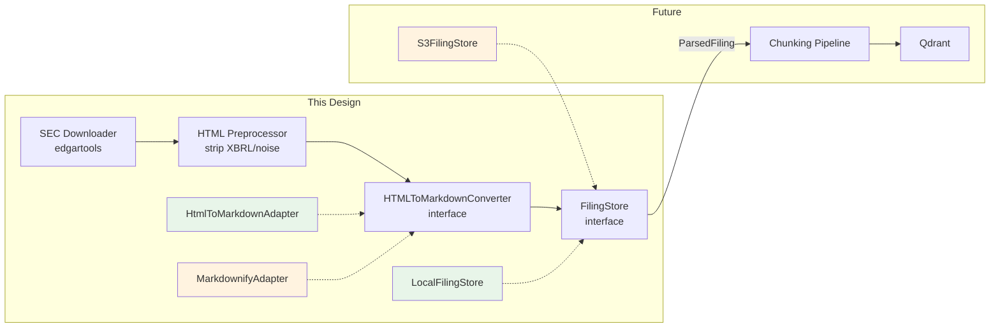
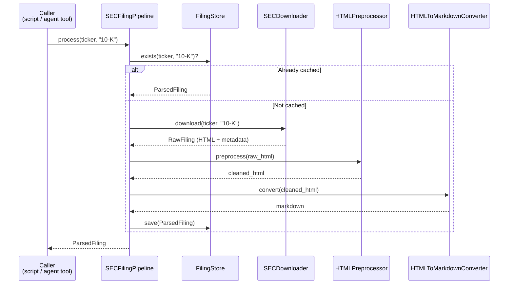

# SEC 10-K Download & Parsing Pipeline Design

## 1. Overview

建立 SEC 10-K filing 的 download + parsing pipeline，產出 RAG-friendly 的 Markdown 中間格式，並定義 output interface 供未來 v2 ingestion（Qdrant）consume。

### Scope

| 包含 | 不包含 |
|------|--------|
| 10-K filing download（batch + JIT） | XBRL parsing（v3 DuckDB） |
| SEC HTML preprocessing（strip XBRL tags 等） | Vector DB ingestion 實作 |
| HTML → Markdown converter（adapter pattern） | Chunking 策略實作 |
| Parsing output schema / interface 定義 | Embedding pipeline |
| Filing Store interface + local 實作 | Cloud storage 實作（未來加） |
| Batch script + Agent tool entry point | 10-Q / 8-K / 其他 filing types |

### 使用模式

- **Batch pre-load** — script 執行，一次下載多家公司的 10-K，parse 後存到 local
- **Just-in-time (JIT)** — agent 在 runtime 偵測到 store 裡沒有某 ticker 的資料，觸發 download + parse

兩者共用同一個核心 pipeline，差異只在呼叫方式。

---

## 2. System Architecture



### 資料格式策略

| 格式 | 用途 | 時程 |
|------|------|------|
| HTML → Markdown | 文字 parsing → RAG (v2) | 本次 design |
| XBRL → structured data | 數值 → DuckDB (v3) | v3 另案 |

---

## 3. Components

### 3.1 SECDownloader

- **職責**：用 edgartools 搜尋並下載 10-K raw HTML
- **輸入**：ticker, filing_type, year (optional)
- **輸出**：raw HTML string + filing metadata (ticker, cik, company_name, filing_date, fiscal_year, accession_number, source_url)
- **依賴**：`edgartools` (已是專案依賴)
- **備註**：edgartools 內建 SEC rate limiting (10 req/sec) 和 smart caching

### 3.2 HTMLPreprocessor

- **職責**：清理 SEC-specific HTML noise
- **輸入**：raw HTML string
- **輸出**：cleaned HTML string
- **處理項目**：
  - Strip XBRL inline tags (`<ix:nonFraction>`, `<ix:nonNumeric>` 等)
  - 移除 inline styles
  - 移除 hidden elements (`display:none`)
  - 移除 SEC EDGAR boilerplate (header/footer)
- **設計**：rule-based，可擴充新規則

### 3.3 HTMLToMarkdownConverter (interface)

- **職責**：將 cleaned HTML 轉成 Markdown，保留 heading hierarchy
- **輸入**：cleaned HTML string
- **輸出**：Markdown string

兩個實作：

| 實作 | Library | 角色 |
|------|---------|------|
| `HtmlToMarkdownAdapter` | `html-to-markdown` (Rust-based, `>=3.0.2,<4.0.0`) | 預設，極快 (~208 MB/s) |
| `MarkdownifyAdapter` | `markdownify` | Fallback，慢但全平台 |

Adapter pattern 讓呼叫端不依賴具體 library，未來可替換。

### 3.4 FilingStore (interface)

- **職責**：持久化和查詢 parsed filing
- **Operations**：

| Method | 說明 |
|--------|------|
| `save(filing)` | 寫入 filing |
| `get(ticker, filing_type, fiscal_year)` | 讀取 filing，不存在回傳 None |
| `exists(ticker, filing_type, fiscal_year)` | 檢查是否已存在 |
| `list_filings(ticker, filing_type)` | 列出某 ticker 已有的 fiscal year 列表 |

- **初始實作**：`LocalFilingStore`（filesystem）
- **未來擴充**：`S3FilingStore` 等，只需實作以上 4 個 method

### 3.5 SECFilingPipeline

- **職責**：串接以上四者，提供統一的 entry point
- **Entry points**：
  - `process(ticker, filing_type, fiscal_year?)` — 處理單一 filing（JIT 用）
  - `process_batch(tickers, filing_type)` — 處理多家公司（batch script 用）
- **邏輯**：先 `exists()` check，已存在則直接回傳；否則 download → preprocess → convert → save

---

## 4. Data Flow



---

## 5. Output Interface (ParsedFiling Contract)

這是 parsing pipeline 和未來 v2 ingestion 之間的 contract。

### Storage Format

每份 filing 儲存為單一 `.md` 檔，使用 YAML frontmatter 存放 metadata：

```markdown
---
ticker: NVDA
cik: "1045810"
company_name: NVIDIA Corporation
filing_type: 10-K
filing_date: "2024-02-21"
fiscal_year: 2024
accession_number: "0001045810-24-000029"
source_url: https://www.sec.gov/Archives/edgar/data/...
parsed_at: "2026-04-03T10:30:00Z"
converter: html-to-markdown
---

# Item 1: Business

NVIDIA designs and sells ...

# Item 1A: Risk Factors

...

# Item 7: Management's Discussion and Analysis

| Segment | Revenue |
|---|---|
| Data Center | $47.5B |
| Gaming | $10.4B |

...
```

### Directory Structure

```
data/sec_filings/
├── NVDA/
│   └── 10-K/
│       ├── 2024.md
│       ├── 2023.md
│       └── 2022.md
├── AAPL/
│   └── 10-K/
│       ├── 2024.md
│       └── 2023.md
└── ...
```

Lookup key：`{ticker}/{filing_type}/{fiscal_year}.md`

### Type Safety

- `FilingType` 使用 `str Enum`（目前只有 `TEN_K = "10-K"`，未來可擴充）
- `FilingMetadata` 使用 Pydantic `BaseModel` 做 validation
- Store 的 method signature 用 `FilingType` enum，防止 typo

### 未來 v2 Ingestion 銜接

```python
# v2 ingestion 虛擬碼（不在本次 scope）
store = LocalFilingStore("data/sec_filings")
filing = store.get("NVDA", FilingType.TEN_K, 2024)

metadata, markdown = parse_frontmatter(filing.raw_content)
doc = Document(text=markdown, metadata=metadata)
nodes = MarkdownNodeParser().get_nodes_from_documents([doc])
# 每個 node 自動繼承 ticker, filing_date 等 metadata
```

Parsing 保留完整的 heading hierarchy，使未來 chunking 不受限：
- `MarkdownNodeParser` — section-level retrieval
- `HierarchicalNodeParser` — parent-child index
- `SentenceSplitter` — fixed-size baseline
- `MarkdownElementNodeParser` — table 特殊處理（如 eval 顯示需要）

---

## 6. Key Design Decisions

| 決策 | 選擇 | 理由 |
|------|------|------|
| Download tool | edgartools（已有依賴） | 免費、AI-ready、內建 rate limiting 和 caching、XBRL 解析能力（v3 可用） |
| edgartools 角色 | 只負責 download + metadata | 不依賴其 parsing，保留通用 HTML parsing 技能的可轉移性 |
| 中間格式 | Markdown（帶 heading hierarchy） | LlamaIndex 生態支援最多、人可讀好 debug、保留所有 chunking 可能性 |
| HTML→MD converter | html-to-markdown (Rust) + markdownify fallback | 極速（~208 MB/s）壓縮 JIT 延遲；adapter pattern 保證平台相容性 |
| html-to-markdown 版本 | `>=3.0.2,<4.0.0` | v3 API 更好（structured result）、v3.0.2 含 panic fix、v2 已停止維護 |
| LlamaParse | 不用 | Portfolio 專案要練習 chunking、減少外部依賴和成本 |
| Metadata 格式 | YAML frontmatter in .md | 單一檔案、不會 orphan、Obsidian 等工具原生支援 |
| Storage key | `{ticker}/{filing_type}/{fiscal_year}.md` | 自然 unique key、flat lookup、不需額外 index |
| Table 處理 | 不特別處理，轉成 Markdown table 保留在 content 裡 | 數值 table 留給 v3 DuckDB (XBRL)；文字/混合 table 走 RAG；eval-driven 決定是否需要特殊處理 |
| Dedup 機制 | 路徑 check（exists）；accession_number 存 metadata 備用 | Filing 數量小（幾十到幾百），路徑 check 已足夠 |
| Docker 平台 | Dockerfile 加 `--platform linux/amd64` | html-to-markdown 缺 linux-aarch64 wheel；Rosetta 2 模擬效能影響小 |

---

## 7. Known Constraints & Limitations

| 限制 | 影響 | 緩解方式 |
|------|------|---------|
| html-to-markdown 缺 linux-aarch64 wheel | Docker on Apple Silicon 需 platform flag | `--platform linux/amd64`；markdownify fallback |
| SEC rate limit 10 req/sec | Batch 下載速度受限 | edgartools 內建 rate limiting；batch 量小不是問題 |
| SEC HTML 格式不統一 | 不同公司/年份的 HTML 結構有差異 | Preprocessor 設計為可擴充的 rule-based；人工抽查 parsed output |
| 複雜 nested table 轉換品質 | colspan/rowspan 可能不完美 | 目前不特別處理；eval-driven 決定是否需要 |
| html-to-markdown 單人維護 | 長期維護風險 | Adapter pattern 可隨時切換到 markdownify |
| html-to-markdown major version 迭代快 | v3 生命週期可能只有幾個月 | Pin `<4.0.0`；adapter 隔離 library 細節 |

---

## 8. Out of Scope

| 項目 | 何時做 |
|------|--------|
| XBRL parsing → DuckDB | v3 design |
| Chunking 策略實作 | v2 RAG design |
| Embedding + Qdrant ingestion | v2 RAG design |
| Cloud storage 實作（S3/GCS） | Deploy 時，實作 `S3FilingStore` |
| 10-Q / 8-K / 其他 filing types | 需求出現時，擴充 `FilingType` enum |
| 10-K/A 修正案處理 | 需求出現時 |
| Accession number dedup method | 需求出現時 |

---

## 9. Testing Strategy

| 層級 | 驗證什麼 |
|------|---------|
| **Unit** | Preprocessor 正確 strip XBRL tags；Converter adapter 回傳合法 Markdown；FilingStore 的 save/get/exists/list_filings |
| **Integration** | 完整 pipeline：download → preprocess → convert → store，用 1-2 家真實 ticker 跑 |
| **人工抽查** | 打開 parsed `.md` 確認 heading hierarchy 保留、table 轉換品質、無殘留 HTML tags |
