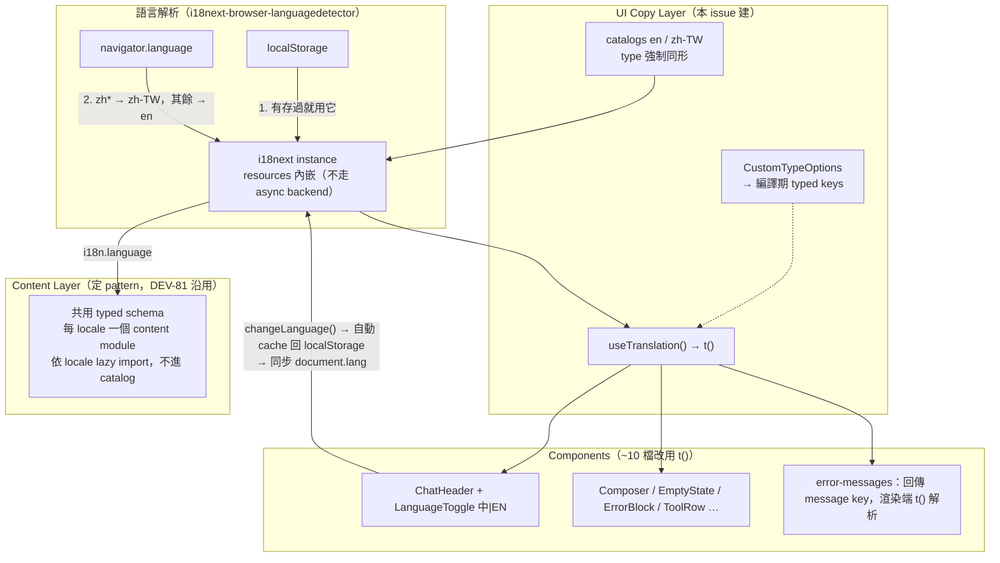

# Design — i18n：fin-lab-X 中英雙語支援（zh-TW / en）

- **Issue**: DEV-85
- **Branch**: `feat/i18n-bilingual`
- **日期**: 2026-07-10
- **狀態**: 已與 human 定案（方案、default language、切換器 UX 均已決策）

## 1. 目標與範圍

讓 FinLab-X frontend 支援繁體中文（zh-TW）與 English（en）雙語：使用者可在 UI 即時切換，語言選擇跨 reload / session 保存，所有 user-facing 文案改由 i18n 機制管理，不再 hardcode。

**現況**：~44 個 distinct user-facing strings 全部是 hardcoded English，集中在 error title 映射模組（~15）、EmptyState（6）、Composer（5），其餘散在約 10 個 components。無 pluralization、無 date/number formatting、僅 3 處 `${toolName}` interpolation。中文字型（Noto Sans TC variable font）已在 dependencies 中，無需新增。

### Out of scope

- Backend API 回應內容的多語化（raw error detail 維持後端原樣顯示）
- LLM 生成內容（agent 回答）的語言控制
- zh-TW / en 以外的語言
- DEV-81 失敗博物館展品的實際翻譯與頁面實作（本設計只定義 content layer pattern 供其沿用）

## 2. 架構總覽

採**雙層架構**，區分「UI 文案」與「長文內容」兩種本質不同的多語資產：



## 3. 元件職責

| 元件 | 職責 |
|---|---|
| i18next instance（init module） | 註冊 detector 與 react binding；resources 內嵌 bundle（兩份 catalog 極小，不走 async backend、不需 Suspense）；`fallbackLng` map 實現 `zh*` → zh-TW、其餘 → en |
| Message catalogs（en / zh-TW） | 巢狀 object 各 ~44 keys；zh-TW 的型別強制與 en 同形——**漏翻即編譯失敗**，runtime 不存在裸 key |
| Typed keys 宣告 | `CustomTypeOptions` declaration merging，key typo 編譯失敗；由 CI 既有的 `tsc -b` 把守 |
| `LanguageToggle` | ChatHeader 右側 segmented「中｜EN」，單擊切換、現行語言高亮；切換觸發 `changeLanguage()`（detector 自動 cache 回 localStorage）並同步 `document.documentElement.lang` |
| error-messages 模組 | lookup tables（HTTP status map、regex pattern tables）保持純邏輯，**回傳 message key 而非英文字串**；`ErrorBlock` 渲染時以 `t()` 解析 |
| Content layer pattern | `content/<feature>/<name>.<locale>.ts` 共用 typed schema，依 `i18n.language` 動態 import（lazy，不進主 bundle）；本 issue 交付 pattern 定義與型別，無實際內容 |

## 4. Data flow

- **啟動**：detector 依序查 localStorage → `navigator.language`；`zh*` 映射到 zh-TW，其餘 fallback en → components 經 `useTranslation()` 取得對應語言文案
- **切換**：Toggle 點擊 → `changeLanguage()` → React re-render 即時生效 + detector cache 回 localStorage + 同步 `document.lang`（a11y 與字型選字正確性）
- **邊界**：backend raw error detail、LLM 生成內容、tool 名稱（來自 backend data）維持原樣不翻

## 5. Contract-defining interfaces

```ts
// catalog 同形 contract：zh-TW 漏 key / 多 key 都編譯失敗
export const zhTW = { ... } satisfies typeof en;

// error-messages 邊界：回傳 key，不回傳文案
resolveErrorTitle(...): ErrorTitleKey  // ErrorTitleKey ⊂ typed catalog keys

// content layer pattern（DEV-81 沿用）
// content/<feature>/<name>.<locale>.ts，共用 schema，依 locale lazy import
const load = (locale: Locale) => import(`@/content/museum/exhibits.${locale}.ts`);
```

## 6. Key design decisions

| 決策 | 選擇 | 捨棄方案 | 理由 |
|---|---|---|---|
| i18n 機制 | react-i18next 全套（i18next + react binding + browser-languagedetector） | 自建 typed mini-i18n；react-intl | 多分頁成長軌跡（44 keys 非穩態）、agent-driven development 的標準 API 熟悉度、業界標準可辯護性；react-intl 的 ICU 能力用不到 |
| Typed keys | CustomTypeOptions + `satisfies` 同形檢查 | i18next-cli codegen | resources 內嵌、規模小，不需 extraction 工具鏈 |
| Default language | localStorage → browser 偵測（`zh*` → zh-TW）→ en | 固定 en / 固定 zh-TW | 台灣使用者首見中文、國際訪客英文；手動選擇後以選擇為準 |
| 切換器 | Header segmented「中｜EN」toggle | 地球 icon dropdown | 僅兩語言，toggle 少一次點擊、免新增 menu primitive |
| 長文內容 | content-as-data、每 locale 一 module、lazy import | 塞進 i18n catalog | 長文進 catalog 是反模式（key 無語意、diff 難讀、翻譯流程不順）；lazy load 由 bundler code splitting 提供，不需 i18next namespace |
| Error titles | tables 回傳 key，渲染端解析 | tables 內直接存雙語字串 | tables 保持純邏輯，文案集中 catalog 統一管理 |
| Prompt chips | 照翻（中文 chip 送出中文 prompt） | chips 固定英文 | 使用者選了中文介面，LLM 以中文回答是預期行為 |

## 7. Constraints 與 trade-offs

- i18next + react-i18next + detector 約 +20KB gzipped——對本 app 無感，換得生態系與擴充性
- 現有測試斷言英文字串：test 環境（jsdom、無 localStorage 預設值）解析為 en，既有斷言原則上不需改寫，但 render helpers 需包 i18n provider
- zh-TW 初稿翻譯由 agent 產出，**語感與台灣用語由 human review**（DEV-85 Human todo）

## 8. Testing strategy

- **編譯期**：catalog 同形 + typed keys 由 `tsc -b`（CI 既有步驟）直接把守，這層本身就是防護網
- **Unit**：error-messages 回傳 key 的映射邏輯；語言偵測映射（`zh*` → zh-TW、其餘 → en）
- **Component（RTL）**：toggle 切換後文案即時更新；render helper 包 provider 後既有測試全數通過
- **E2E（Playwright）**：切換 → reload → 語言保持；兩語言下主要 flow 無裸 key、無破版

## 9. 規模估算

init module + typed-keys 宣告 + 兩份 catalog（~70 行 × 2）+ ~10 個 component 改 `t()` + `LanguageToggle` + 測試調整 ≈ **600–800 行 net diff** → 單一 slice、一個 PR，不需 Slice Roadmap。

## Learning Notes

### 探索的領域概念

- **UI copy vs content-as-data 的分層**：i18n catalog 適合短字串（按鈕、label、error title）；長文內容（如 DEV-81 展品的情境/root cause 敘述）塞進 catalog 是反模式——key 失去語意（`exhibit.12.rootCause.para2`）、diff 難讀、翻譯流程不順。正解是每 locale 一個共用 schema 的 typed content module，依當前語言 lazy import。這個判斷與「用不用 i18n framework」無關，兩邊都適用。
- **react-i18next 的編譯期 type safety**：透過 TypeScript declaration merging 擴充 `CustomTypeOptions`（`resources: typeof en`），`t()` 的 key 成為 union type，typo 直接編譯失敗；搭配 `satisfies typeof en` 強制兩份 catalog 同形，「漏翻」從 runtime fallback 問題變成編譯錯誤。
- **i18next-browser-languagedetector 的 detection order**：偵測來源是有序清單（`localStorage → navigator`），使用者手動切換後 detector 自動 cache 選擇，天然實現「手動選擇優先於瀏覽器偏好」的語意，不需自寫持久化邏輯。

### 評估過的方案與取捨

- **自建 typed mini-i18n（最初推薦，最終否決）**：~100 行 context + typed dictionary + t() hook，零依賴、typed keys 免設定。技術上完全可行且對「今天的 44 keys」是更小的解。否決的三個因素：(1) FinLab-X 正從單頁長成多分頁 app，規模非穩態；(2) agent-driven development 下，標準 API 在模型 training data 裡，自建 API 要求每個未來 session 先讀懂 infra；(3) 設計決策要能在面試中被自在辯護。核心教訓：**build-vs-buy 的「YAGNI + 自建更小」論點，需同時通過「規模凍結、協作者免學習、可辯護」三個檢驗才成立**。
- **react-intl（FormatJS）**：強在 ICU MessageFormat（複雜 plural / 性別 / 日期格式）；本專案無 plural、無日期格式需求，明顯 overkill。

### 關鍵收穫與資源

- 長文多語化的 lazy loading 不需要 i18n framework 的 namespace 機制——bundler 的 dynamic import / code splitting 就是正解，工具邊界要看「誰本來就該做這件事」。
- 「使用者對同一建議重複質疑」本身是設計訊號：不重複推銷，改為重新權衡（本次因此翻盤）。
- 參考：react-i18next TypeScript 設定（CustomTypeOptions module augmentation，官方 example `react-typescript/simple`）；i18next `fallbackLng` 可用 map 形式處理 `zh*` → zh-TW 的區域變體映射。
