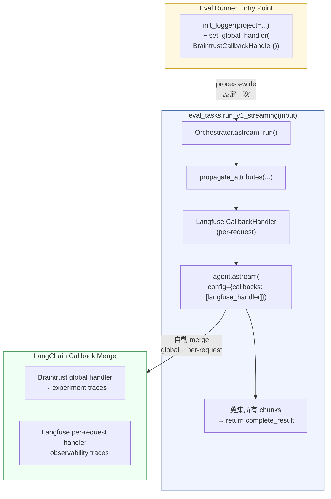

# S1 Backend Streaming — Design Document

> S1 subsystem design。定義 backend streaming 的架構、設計決策與介面契約。
> 供 `implementation-planning` skill 作為輸入。

---

## 背景

FinLab-X V1 streaming chat 採 subsystem-first 分解。S1 負責後端 streaming 能力——從 LangGraph agent 取得即時 chunks，翻譯為 AI SDK UIMessage Stream Protocol v1 的 SSE events，透過 FastAPI endpoint 送出。

現有架構：`Orchestrator` 使用 `create_agent()`（LangChain 1.2.10+），回傳 `CompiledStateGraph`。目前只有 `ainvoke()`（非 streaming），endpoint 為 `POST /api/v1/chat`。Langfuse 整合已到位（`CallbackHandler` + `propagate_attributes`）。

---

## Scope

### S1 包含

1. Streaming async generator（`Orchestrator.astream_run()`）
2. Domain event layer（LangGraph chunks → 語意明確的中間表示）
3. SSE serializer（domain events → AI SDK wire format）
4. FastAPI SSE endpoint（含 regenerate/retry 支援）
5. Conversation store（LangGraph checkpointer）
6. Tool 層面變更（移除 `@observe()`、加入 progress writer）
7. Observability guardrails 更新
8. Observability POC（5 個 gate）

### S1 不包含

- ❌ 前端任何變更（S3 scope）
- ❌ 現有 `POST /api/v1/chat` 的修改
- ❌ Persistent conversation store（V2+ 換 `PostgresSaver`）
- ❌ Tool input streaming（V1 不支援 `tool-call-delta`）
- ❌ 任意歷史 message regenerate（V1 只支援最後一條）

---

## 設計決策

| # | 決策 | 選擇 | 理由 |
|---|---|---|---|
| D1 | Streaming 基礎 | `astream(stream_mode=["messages", "updates", "custom"], version="v2")` | 三個 mode 分別提供 token-level streaming、node 完成事件、tool progress。`version="v2"` 統一 chunk format 為 `{"type": ..., "data": ...}` |
| D2 | Tool error wire format | `data-tool-error` custom event | AI SDK v5 標準 event types 中不存在 `tool-error`（查閱 `ai-sdk.dev/docs/ai-sdk-ui/stream-protocol` 及 `vercel/ai` source 確認）。`data-*` 是官方為自訂事件設計的 namespace。**偏離 master design DR-07** |
| D3 | Conversation store | LangGraph `InMemorySaver` checkpointer | 取代 DR-06 規劃的自建 store interface。Checkpointer 用 `thread_id` 自動管理 state persistence，state 中的 `messages` list 完整包含 tool call args + results。未來可換 `PostgresSaver` |
| D4 | Tool progress 機制 | `get_stream_writer()` + try/except graceful fallback | LangGraph 官方推薦方式（Python >= 3.11，本專案用 3.13）。POC 優先驗證 `ToolRuntime` 方案以取得精確 `tool_call_id` |
| D5 | Tool observability | 移除 tools 上的 `@observe()`，依賴 `CallbackHandler` | 見下方「D5 研究 Evidence」 |
| D6 | Serializer pattern | `functools.singledispatch` | 每個 event type 獨立 register，擴展時不改既有 code |
| D7 | Regenerate 策略 | V1 手動移除 messages 最後一個 assistant turn | V1 只需處理最後一條。未來任意歷史 regenerate 需引入 `messageId → checkpoint thread_ts` mapping |
| D8 | Request body message 型別 | Plain string | S1 接收 `{ message: string }`，不需理解 UIMessage 結構。S3 的 `prepareSendMessagesRequest` 負責從 UIMessage 提取文字 |

### D5 研究 Evidence

移除 `@observe()` 的決策基於以下驗證：

**`@observe()` 只做 tracing，沒有其他功能。** 它捕捉的資料（tool name、input args、output、duration、errors）與 `CallbackHandler` 完全重複。

**`CallbackHandler` 自動 trace tool calls，不需 `@observe()`。** Langfuse `CallbackHandler` 原始碼實作了 `on_tool_start` / `on_tool_end` callback methods，自動建立 type 為 `"tool"` 的 observation。Langfuse 官方 LangGraph cookbook 範例也未在 tool 上使用 `@observe()`。

**`@observe()` 在 LangGraph 環境下產生 disconnected traces。** 兩者各自使用 `contextvars` 但互不認識對方的 context，導致 `@observe()` 建立的 span 與 `CallbackHandler` 的 trace hierarchy 斷開（refs: langfuse discussions #5991, #3267, issue #8780）。

**更新後的 `@observe()` 適用規則：** 僅用於不透過 LangGraph/LangChain 框架執行的函數，或 tool 內部有獨立子操作需追蹤時（例如 tool 內部又呼叫另一個 LLM）。

---

## 術語對照

| 概念 | S1 內部 | Request body | LangGraph config |
|---|---|---|---|
| Chat session ID | `session_id` | `id` | `configurable.thread_id` |
| Assistant 回覆 ID | `message_id` | `messageId`（regenerate 用） | — |
| Text block ID | `text_id` | — | — |
| Tool call ID | `tool_call_id` | — | 來自 `AIMessage.tool_calls[].id` |

---

## Architecture

### 資料流

```
LangGraph Agent (CompiledStateGraph)
    │  astream() 產生 raw chunks
    ▼
Orchestrator.astream_run()
    │  設定 Langfuse CallbackHandler + propagate_attributes
    │  設定 checkpointer thread_id
    │  將 raw chunks 交給 StreamEventMapper
    │  yields DomainEvent
    ▼
StreamEventMapper
    │  1. 格式翻譯：LangGraph chunk shape → DomainEvent
    │  2. 補上缺失事件：text-start/end, start, finish
    │  3. 跨 stream mode 拼湊 tool call 完整生命週期
    ▼
SSE Serializer (Router 層)
    │  DomainEvent → "data: {json}\n\n"（singledispatch）
    ▼
FastAPI Endpoint
    │  StreamingResponse + headers + disconnect handling
    ▼
HTTP SSE Response（S1 邊界）
```

### 元件職責邊界

| 元件 | 知道 | 不知道 |
|---|---|---|
| **Endpoint** | HTTP, headers, disconnect | Domain events 內容 |
| **SSE Serializer** | AI SDK wire format | LangGraph, Langfuse |
| **Orchestrator.astream_run()** | Langfuse config, checkpointer | SSE format |
| **StreamEventMapper** | LangGraph chunk 結構, domain event 定義 | Langfuse, HTTP |
| **LangGraph Agent** | Tools, LLM, state | Domain events, SSE |

---

## Domain Events

Domain Events 是 StreamEventMapper 的產出、SSE Serializer 的輸入。與 LangGraph 和 SSE wire format 都解耦。

### 事件清單

| Domain Event | SSE `type` | 來源 | 說明 |
|---|---|---|---|
| `MessageStart(message_id, session_id)` | `start` | mapper 在第一筆 chunk 補上 | stream 開頭，含 `sessionId` confirmation echo |
| `TextStart(text_id)` | `text-start` | mapper 偵測新 text block | LangGraph 不給，mapper 補 |
| `TextDelta(text_id, delta)` | `text-delta` | `messages` mode | 每個 LLM token |
| `TextEnd(text_id)` | `text-end` | mapper 偵測 text block 結束 | LangGraph 不給，mapper 補 |
| `ToolCallStart(tool_call_id, tool_name)` | `tool-call-start` | `messages` mode（tool_call_chunks） | LLM 決定呼叫 tool |
| `ToolCallEnd(tool_call_id)` | `tool-call-end` | `updates` mode（agent node 完成） | tool call 定義完成 |
| `ToolResult(tool_call_id, result)` | `tool-result` | `updates` mode（tool node 完成） | tool 執行成功 |
| `ToolError(tool_call_id, error)` | `data-tool-error` | `updates` mode（ToolMessage status=error） | tool 執行失敗 |
| `ToolProgress(tool_call_id, data)` | `data-tool-progress` | `custom` mode | tool 執行中進度 |
| `StreamError(error_text)` | `error` | exception 捕捉 | 不可恢復錯誤 |
| `Finish(finish_reason)` | `finish` | stream 結束 | stream 結尾 |

### Custom Event Payload Shapes

以下為 S1 自訂的 `data-*` event，不由 AI SDK 定義，需在此明確規格：

**`data-tool-error`**（master DR-07 已同步更新）：
```json
{"type": "data-tool-error", "toolCallId": "<id>", "error": "<sanitized_message>"}
```
`error` 欄位經過 sanitization，不含 API keys、internal paths 或 stack traces。

**`data-tool-progress`**（與 master design 一致）：
```json
{"type": "data-tool-progress", "toolCallId": "<id>", "data": {"status": "<string>", "message": "<string>", "toolName": "<string>"}, "transient": true}
```

### `finishReason` 映射

| LangGraph 結束原因 | AI SDK `finishReason` |
|---|---|
| 正常完成（agent 不再呼叫 tool） | `"stop"` |
| `ToolCallLimitMiddleware` 達到上限 | `"stop"` |
| Exception / LLM 不可用 | `"error"` |

### `finish` event `usage` 欄位

採用 AI SDK 標準格式 `{"inputTokens": N, "outputTokens": N}`。Master design 的 `{"totalTokens": N}` 為簡寫，S1 提供分項 token 數以利後續成本分析。若 LangGraph 無法提供分項數據，fallback 為 `{"inputTokens": 0, "outputTokens": 0}`。

### `error` event 欄位名

Stream-level error 使用 `"errorText"`（與 master design Event Taxonomy 一致）：
```json
{"type": "error", "errorText": "<message>"}
```

### 設計原則

- 全部為 `frozen` dataclass（不可變值物件）
- 欄位使用語意明確的命名：`message_id` / `text_id` / `tool_call_id`（serializer 負責映射為 wire format 的 `"messageId"` / `"id"` / `"toolCallId"`）
- 不包含 `transient` 欄位（只有 `ToolProgress` 在 SSE payload 中帶 `"transient": true`，這是 serializer 的事）

---

## StreamEventMapper

### 角色

有狀態的翻譯器。追蹤 text block 和 tool call 的生命週期，在 LangGraph chunks 和 AI SDK 需求之間做橋樑。

### 為什麼需要它

LangGraph 只是一筆一筆吐 chunks，不區分 text block 邊界、不產生 `text-start/end`、tool call 的完整資訊分散在三個 stream mode 中。AI SDK protocol 需要明確的 framing events 和配對的生命週期事件。Mapper 負責這個翻譯。

### 三個核心職責

**格式翻譯** — LangGraph chunk shape 與 AI SDK event shape 不同：

```
LangGraph: {"type": "messages", "data": (AIMessageChunk(content="讓"), metadata)}
Mapper 產出: TextDelta(text_id="txt_001", delta="讓")
```

**補上缺失事件** — 用 boolean 追蹤 text block 是否開啟：第一個文字 token 來時補 `TextStart`，碰到 tool call 或 stream 結束時補 `TextEnd`。

**跨 mode 拼湊生命週期** — 一個 tool call 的資訊分散在三個 stream mode：

| 資訊 | Stream mode | 產出 |
|---|---|---|
| LLM 決定呼叫 | `messages`（tool_call_chunks） | `ToolCallStart` |
| LLM 生成完畢 | `updates`（agent node 完成） | `ToolCallEnd` |
| Tool 回報進度 | `custom`（get_stream_writer） | `ToolProgress` |
| Tool 執行完成 | `updates`（tool node 完成） | `ToolResult` / `ToolError` |

### Tool Progress 的 tool_call_id 配對

`get_stream_writer()` 發出的 custom chunk 不帶 `tool_call_id`（tool 不知道自己的 call ID）。V1 用 `toolName` 反查 `pending_tool_calls` map。

**V1 限制**：同名 tool 被平行呼叫時有歧義。

**改進方向**：`ToolRuntime` 提供 `tool_call_id` + `stream_writer`，讓 progress data 帶精確 ID。已知 Pydantic validation bug（langgraph#6431），POC 階段驗證。

---

## Conversation Store

### 選擇 LangGraph Checkpointer 的原因

LangGraph checkpointer 是框架內建的 state persistence 機制。每個 node 執行完畢自動存 checkpoint，用 `thread_id` 識別不同對話。下次同 `thread_id` 的 request 自動還原完整 state。

State 中的 `messages` list 已包含完整對話歷史：`HumanMessage`、`AIMessage`（含 `tool_calls` 完整 args）、`ToolMessage`（含完整 result）。不需額外儲存。

V1 用 `InMemorySaver`（process 重啟即消失），未來可換 `PostgresSaver`（一行 code）。

### 對 DR-06 的滿足

| DR-06 要求 | Checkpointer 滿足方式 |
|---|---|
| 後端管理 conversation history | 自動管理 |
| 前端只送最新 message + id | `id` 映射為 `thread_id` |
| 用 id 載入歷史 | 自動載入 |
| Stream 完成後 persist | 每個 node 結束自動 persist |

---

## Endpoint

### 規格

```
POST /api/v1/chat/stream

Response Headers:
  Content-Type: text/event-stream
  x-vercel-ai-ui-message-stream: v1
  Cache-Control: no-cache
  X-Accel-Buffering: no
```

### 兩種 Request Body

**新訊息**：`{ "message": "TSMC 最近表現如何？", "id": "session-abc" }`

- `id` 為**必填**（空字串不接受，回 HTTP 422）
- `message` 為純文字 string

**Regenerate**：`{ "id": "session-abc", "trigger": "regenerate", "messageId": "msg_001" }`

- `messageId` 必須匹配最後一筆 assistant message 的 ID，不匹配回 HTTP 422

**衝突 Request**：同時含 `message` 和 `trigger: "regenerate"` 的 request 需有 deterministic dispatch 規則（endpoint 以 `trigger` 欄位是否存在為準，或直接 422 拒絕）。

### Regenerate 流程

V1 只支援重新生成最後一條 assistant message（Retry on error 場景）：載入 state → 驗證 `messageId` 匹配最後 assistant message → 移除最後一個完整 assistant turn（AIMessage + 關聯的 ToolMessages） → 重新呼叫 agent → stream 新回覆。

### 未來：任意歷史 regenerate

LangGraph checkpointer 的每個存檔點有唯一的 `thread_ts`。要支援重新生成歷史中任意一條 message，需要：

1. 每次 `astream_run()` 開始時記錄 `messageId → thread_ts` mapping
2. Regenerate 時用 `thread_ts` 回退到該 message 被生成之前的 checkpoint
3. 從該 checkpoint 重新執行 agent

V1 不需要此機制，但 design 中記錄以便 V2 接手。

---

## Observability

### Streaming 路徑的 tracing 架構

**API Server context（Production / 開發）**：只有 Langfuse。

```
Orchestrator.astream_run()
  → propagate_attributes(session_id=...)
  → CallbackHandler()（自動繼承 context）
  → agent.astream(config={"callbacks": [handler]})
       → CallbackHandler 內部自動 trace LLM calls + tool calls
  → SSE serializer 純 passthrough（不涉及 Langfuse）
```

**Eval Runner context**：Braintrust global handler + Langfuse per-request handler 共存。`astream_run()` 本身不需要知道 Braintrust 的存在——LangChain callback merge 機制自動處理。`set_global_handler()` 只在 eval runner entry point 呼叫，不在 shared agent code 中。



不在 streaming 路徑上使用 `@observe()`。`CallbackHandler` 處理所有 trace lifecycle。

### Guardrails 更新

更新 `streaming_observability_guardrails.md` Rule 3，將透過 graph 執行的 tools 排除在 `@observe()` 適用範圍外，並記載何時仍需使用 `@observe()`。

---

## POC Gates

S1 implementation 的第一步。全部通過後才開始正式 implementation。

| Gate | 驗證內容 | 通過標準 |
|---|---|---|
| 1 | 單一 streaming request 的 trace 完整性 | 一個 request → 一個 trace，session_id 正確 |
| 2 | Tool observation 正確 attach（移除 `@observe()` 後） | Tool name/args/result/duration 有紀錄，是 trace 的 child |
| 3 | Client disconnect 後 trace 乾淨關閉 | 不留 orphan trace |
| 4 | Exception 可見且不被吞掉 | Trace 和 SSE output 都有 error 紀錄 |
| 5 | 並發 request 不交叉汙染 context | 3 個 request → 3 個獨立 trace |
| 6 | Braintrust global handler + Langfuse per-request handler 在 `astream()` 下共存 | 兩平台各自收到完整 trace（LLM call + tool call），互不干擾、不重複、不遺漏 |

**Gate 6 驗證方式**：`set_global_handler(BraintrustCallbackHandler())` → 用 `astream_run()` 跑一個含 tool call 的 prompt → 分別檢查 Braintrust experiment 和 Langfuse trace 的完整性（LLM call spans、tool call spans、duration、error 狀態）。

Gate 失敗 → 分析 root cause（CallbackHandler / contextvars / `@observe()` 殘留 / global handler callback flush 時機），解決後重新驗證。Gate 6 失敗的 fallback：eval task function 退回使用 `run()`（非 streaming），不影響 API server streaming 路徑。

---

## BDD Discovery Decisions

S1 BDD scenario discovery（Three Amigos）過程中確認的 design decisions，補充原設計未涵蓋的行為：

| # | Decision | 內容 |
|---|----------|------|
| DD-01 | `id` 必填 | 原為 optional + auto-generate。改為必填，空字串拒絕（422）。消除 auto-generation 路徑和空字串 data leakage 風險 |
| DD-02 | `start` event 含 `sessionId` | `MessageStart` 加入 `session_id`，SSE 輸出 `sessionId` 作為 confirmation echo |
| DD-03 | 同 session 並發 → 立即 409 | Per-session non-blocking lock。`lock.acquire()` 失敗立即回 HTTP 409 Conflict，不等待 |
| DD-04 | Regenerate messageId 嚴格驗證 | 必須匹配最後 assistant message ID，不匹配回 422 |
| DD-05 | Fatal error 不 emit synthetic ToolError | Stream error 時不為 pending tool calls 補 `data-tool-error`。直接 emit `StreamError` + `Finish("error")`。S3 負責清理 pending tool cards（灰化 terminated） |
| DD-06 | Post-restart amnesia 是 accepted V1 behavior | InMemorySaver 重啟後消失，同 session ID 的新 request 靜默開始新對話 |

### Tool Error Sanitization

Tool exception → DomainEvent 路徑上需加 sanitization boundary：
- 過濾 API keys、internal paths/hostnames、connection strings、stack traces
- 保留足夠的錯誤描述讓使用者理解（如「yfinance API timeout」，而非「ConnectionError: https://internal:8080?key=sk-xxx」）

---

## 跨文件修正事項

| 文件 | 修正 | 原因 |
|---|---|---|
| master design DR-07 | `tool-error` → `data-tool-error` + error sanitization + DD-05 行為 | AI SDK v5 沒有標準 `tool-error` event type；需 sanitize error message；fatal error 不補 synthetic events |
| master design DR-06 | 自建 store interface → LangGraph checkpointer；`id` 必填 | Checkpointer 完全滿足需求；消除 auto-gen 複雜度 |
| master design 介面契約 | `start` event 加 `sessionId`；request body 加 regenerate spec；加 Lifecycle Rules 8-9 | DD-02、DD-03、DD-04 |
| S3 design 介面契約 | `tool-error` → `data-tool-error`；`message: UIMessage` → `message: string`；`id` 必填 | S3 需用 `onData`；S1 接收 plain string |
| S3 design error paths | 加 DD-05 note + HTTP 409 處理 + pending tool terminated 狀態 | S3 需主動清理 pending tools |

---

## 風險與限制

| 項目 | 影響 | 緩解 |
|---|---|---|
| `ToolRuntime` Pydantic validation bug | Tool progress 無法精確配對 `tool_call_id` | V1 用 `toolName` 反查；POC 驗證是否已修復 |
| `InMemorySaver` 重啟後遺失 | Regenerate 找不到 session（404）；新 message 靜默失憶（DD-06 accepted） | V1 可接受；V2 換 `PostgresSaver` |
| 同名 tool 平行呼叫 | Progress 配對歧義 | V1 不太會遇到；`ToolRuntime` 解決 |
| Langfuse v4 streaming 延遲 | Trace 影響 response latency | POC 驗證；回退至 v3.14.5（DR-03） |
| Braintrust global handler 在 async generator 生命週期中的 callback flush 行為未驗證 | Eval 使用 `astream_run()` 時 trace 可能不完整 | POC Gate 6 驗證；若失敗，eval task function 退回使用 `run()` |

---

## 驗收標準

- [ ] POC Gate 1-6 全部通過
- [ ] `POST /api/v1/chat/stream` 產出符合本文件 Domain Events / Custom Event Payloads 規格的 SSE
- [ ] 現有 `POST /api/v1/chat`（非 streaming）不受影響（既有測試全數通過）
- [ ] Langfuse trace 在 streaming 模式下完整（一個 request 一個 trace，tool observations 正確 attach）
- [ ] `useChat` 可原生消費 SSE 並正確組裝 `UIMessage`（此項由 S3 integration testing 最終驗證，S1 負責確保 wire format 正確）

---

## Must NOT Have

- ❌ 前端任何變更
- ❌ 修改現有 `POST /api/v1/chat`
- ❌ Persistent conversation store
- ❌ Tool input streaming（`tool-call-delta`）
- ❌ 任意歷史 message regenerate
- ❌ Multi-agent routing
- ❌ WebSocket
