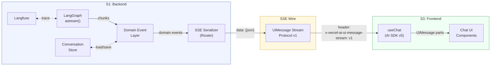
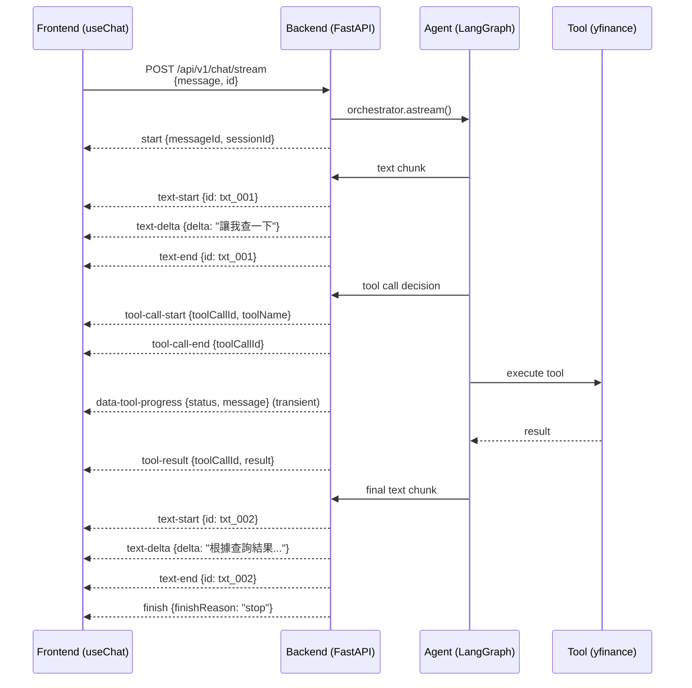
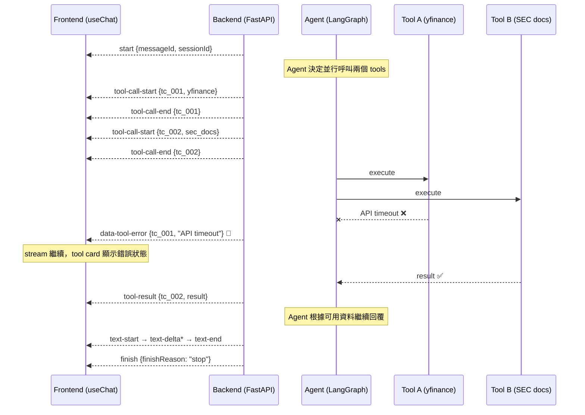
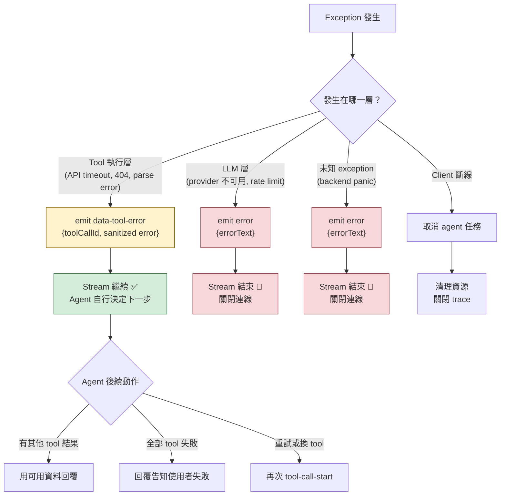
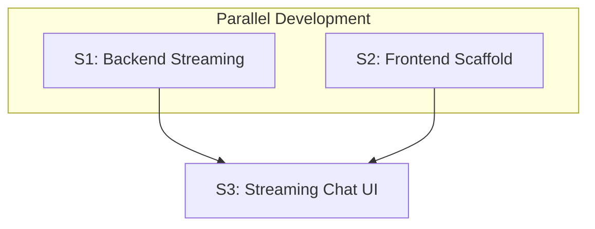

# Master Design — V1 Streaming Chat

> 本文件定義 FinLab-X V1 streaming chat 專案的子系統邊界、技術決策與介面契約。
> 作為各 subsystem (S1/S2/S3) 進行 `implementation-planning` 的最高指導準則。
> 各 subsystem 的內部實作細節（domain event types、serializer 邏輯、component 架構等）由各自的 design doc 定義。

---

## 背景與目的

FinLab-X V1 streaming chat 採取 **subsystem-first** 分解策略。這確保了後端串流（S1）與前端基建（S2）能並行開發與驗證，最後由 S3 完成 UI 整合與終端用戶體驗。這種做法旨在降低 monolithic plan 帶來的複雜度風險，並為後續 Generative UI 的擴充打下基礎。

---

## Decisions Finalized (最終決策紀錄)

### DR-01: Backend Core Architecture Path

- **決策內容**: S1 實作維持使用目前的 `create_agent()` 與 LangGraph 基礎架構，不在此階段遷移至 `DeepAgents`。
- **選擇理由**: 優先確保 V1 streaming 功能的穩定性與及時交付。
- **影響**: 未來若需統一框架仍需進行二次重構，但目前可利用成熟的 `create_agent()` 與 LangGraph `astream` 快速實現串流輸出。

### DR-02: Streaming Strategy — Domain Events to Router Serialization

- **決策內容**: 由 Orchestrator 發送語意明確的 domain events，在 FastAPI router 層級序列化為 AI SDK SSE 格式。
- **選擇理由**: 後端對發送的事件有完全掌控權，前端接收格式統一、語意清晰的進度通知。Domain event layer 與 SSE protocol 解耦，兩端可各自演進。
- **排除方案**: (1) 直接將 Langfuse trace 串流至前端（耦合觀測工具）；(2) Middleware 自動攔截 tool call（過於隱晦）。

### DR-03: Observability Infrastructure — Langfuse v4

- **決策內容**: 預設採用 Langfuse v4。
- **回退條件**: 若在 S1 POC 階段發現 v4 導致不可接受的串流延遲或品質問題，回退至 v3.14.5。
- **操作規則**: 見 `backend/agent_engine/docs/streaming_observability_guardrails.md`。

### DR-04: SSE Wire Protocol — AI SDK UIMessage Stream Protocol v1

- **決策內容**: SSE wire format 採用 AI SDK UIMessage Stream Protocol v1，取代先前的自定義 event format。
- **選擇理由**: S2 已定案使用 AI SDK v5 + `useChat`。此 protocol 是讓 `useChat` 原生消費 SSE 的唯一官方 wire format。Python backend 直接 emit 可省去 BFF 或 JS adapter。
- **排除方案**: (1) 自定義 SSE format（需自建 parser）；(2) LangGraph Platform protocol + `useStream`（需部署 LangGraph server）；(3) AG-UI Protocol（需買入 CopilotKit 生態）。
- **Protocol spec**: https://ai-sdk.dev/docs/ai-sdk-ui/stream-protocol

### DR-05: Observability Integration — Confirmed

- **決策內容**: Observability 平台取捨完成，結論寫入 `backend/agent_engine/docs/` 下兩份文件。
- **關鍵結論**: 維持 Langfuse 為 primary backend；`@observe()` 只用於 deterministic single-return functions；async generator / SSE serializer / body iterator 禁止加 `@observe()`。
- **文件**: `unified_observability_strategy_streaming.md`、`streaming_observability_guardrails.md`。
- **Dual-handler 共存（Eval context）**: Eval runner process 中，Braintrust（`set_global_handler()`，process-wide）與 Langfuse（`config={"callbacks": [handler]}`，per-request）同時作為 LangChain callback handler 存在，走不同的 callback 註冊路徑，互不衝突。`set_global_handler()` 只在 eval runner entry point 呼叫，API server process 不涉及 Braintrust。詳見 CSV Eval Management branch 的 design §4「Dual Platform 共存模型」。

### DR-06: Conversation History — Backend-managed (Session-based)

- **決策內容**: Conversation history 由後端管理。前端透過 `DefaultChatTransport` 的 `prepareSendMessagesRequest` 只送最新 message text (string) + `id`（chat/session ID，必填）。後端用 `id` 作為 LangGraph checkpointer 的 `thread_id`，自動載入/儲存對話歷史。
- **選擇理由**:
  1. Agent 有多個 tool calls 和中間步驟，後端需要控制哪些 context 送回 LLM（context engineering）。
  2. Langfuse 的 `session_id` 天然需要 backend-side session 概念，兩者可統一。
  3. 避免前端送完整歷史帶來的 payload 膨脹和安全風險（客戶端可竄改歷史）。
  4. 為未來的 history compression、summarization、sliding window 打下基礎。
- **排除方案**: Frontend 管 history（`useChat` 預設行為）— stateless 後端雖然簡單，但無法做 context engineering，且 payload 隨對話增長。
- **實作分工**:
  - **S1**: 使用 LangGraph `InMemorySaver` checkpointer 管理對話狀態（取代原先規劃的自建 store interface）；endpoint 接收 `{ message: string, id: string }` 格式。
  - **S3**: 使用 `DefaultChatTransport` + `prepareSendMessagesRequest` 自訂 request body，從 UIMessage 提取純文字後送出。

### DR-07: Tool-level Error — `data-tool-error` Custom Event

- **決策內容**: 單一 tool 執行失敗時，後端發送 `data-tool-error` custom event，stream 繼續（不中斷）。Stream-level `error` event 保留給不可恢復的錯誤（LLM 不可用、未知 exception）。
- **選擇理由**: S1 驗證確認 AI SDK v5 UIMessage Stream Protocol v1 的標準 event types 中**不存在** `tool-error`（查閱 `ai-sdk.dev/docs/ai-sdk-ui/stream-protocol` 及 `vercel/ai` source `ai_5_0_0` tag）。`data-*` 是 AI SDK 官方為自訂事件設計的 namespace，`useChat` 透過 `onData` callback 原生支援。
- **排除方案**: (1) 帶 error 的 `tool-result`（語意不明確）；(2) ~~原生 `tool-error`~~（AI SDK v5 不存在此 event type）。
- **Wire format**（已確認）: `{"type":"data-tool-error","toolCallId":"<id>","error":"<sanitized_message>"}`
- **Error sanitization**: Tool exception message 必須經過 sanitization boundary 才能進入 SSE output，過濾 API keys、internal paths、connection strings、stack traces。
- **Error 邊界**:

| 情境                                  | 事件                  | Stream 行為                                      |
| :------------------------------------ | :-------------------- | :----------------------------------------------- |
| 單一 tool 失敗（API timeout、404 等） | `data-tool-error`     | 繼續 — agent 自行決定後續動作                    |
| 所有 tool 都失敗                      | `data-tool-error` × N | 繼續 — 讓 agent 回覆「全部失敗」比 stream 斷掉好 |
| LLM 不可用 / 未知 exception           | `error`               | 結束                                             |
| Stream error 時有 pending tool calls  | 不 emit synthetic `data-tool-error` | S3 在 `finish(error)` 時清理 pending tool cards（灰化，非紅色 error） |

- **實作分工**:
  - **S1**: 實作 domain event → SSE serialization；tool exception → sanitized error string → `ToolError` domain event；LangGraph `handle_tool_errors` 攔截 tool exception。
  - **S3**: 用 `onData` callback 處理 `data-tool-error`；區分 tool-level error（紅色 card）vs stream-level error（inline error block + Retry）vs pending tool terminated（灰化 card）。

---

## 子系統分解 (Subsystem Decomposition)

### S1: Backend Streaming

- **職責**: 實作 streaming async generator、domain event layer、SSE serializer、FastAPI SSE endpoint、conversation store。
- **產出**: `POST /api/v1/chat/stream` endpoint，輸出符合介面契約的 SSE。
- **約束**: 必須遵循 `streaming_observability_guardrails.md`，並在實作前通過 POC gate。
- **Conversation Store（DR-06）**: 使用 LangGraph `InMemorySaver` checkpointer。以 `id` 映射為 `thread_id`，框架自動管理 state persistence。V1 為 in-memory（process 重啟即消失），未來可換 `PostgresSaver`。
- **S1 額外職責**（來自 DR-06、DR-07、BDD Discovery Decisions）:
  - LangGraph checkpointer 整合（DR-06）。
  - Endpoint 接收 `{ message: string, id: string }`（`id` 必填），用 `id` 作為 checkpointer `thread_id`（DR-06）。
  - `data-tool-error` custom event 實作 + error sanitization（DR-07）。
  - LangGraph finish reason → AI SDK `finishReason` 的 mapping。
  - Regenerate `messageId` 嚴格驗證（必須匹配最後 assistant message，否則 422）。
  - 同 session 並發 request → 立即 HTTP 409 Conflict（per-session non-blocking lock）。
  - 衝突 request body（同時含 `message` 和 `trigger`）的 deterministic dispatch。

### S2: Frontend Scaffold

- **職責**: 前端專案基礎建設、Tooling 設置、基礎測試環境。
- **產出**: Vite + React + TS 專案、Tailwind v4 + shadcn/ui、Vitest + Playwright pipeline。
- **詳細設計**: `.artifacts/current/design_S2_frontend_scaffold.md`。

### S3: Streaming Chat UI (Integration)

- **職責**: 將 S1 的 SSE 與 S2 的前端環境結合，實作終端用戶界面。
- **產出**: `useChat` 整合、ChatInterface 元件、tool progress 可視化、error/disconnect 處理。
- **V1 UI 原則**: V1 不針對不同 tool 做差異化 UI，所有 tool result 統一用文字呈現。但有附帶 resource 的結果（新聞連結、股價資訊來源等）需顯示為可點擊的連結。S3 design 需支援展開 tool 執行過程的互動。
- **S3 額外職責**（來自 DR-06、DR-07、BDD Discovery Decisions）:
  - 使用 `DefaultChatTransport` + `prepareSendMessagesRequest` 自訂 request body，從 UIMessage 提取純文字 + 必填 `id`（DR-06）。
  - 用 `onData` callback 處理 `data-tool-error` custom event（DR-07）。
  - 區分三種 tool card 狀態：error（紅色，tool 本身失敗）、terminated（灰色，stream error 連帶取消）、success（綠色）。
  - Stream error 時主動清理 pending tool cards（S1 不 emit synthetic `data-tool-error`）。
  - 處理 HTTP 409 Conflict（同 session 並發時）。

### End-to-end Streaming Data Flow

> 圖中的 **SSE Wire** 代表 S1 和 S3 之間的**網路傳輸層**——即實際透過 HTTP 傳送的 SSE 位元流。S1 內部產生 domain events 並序列化成 `data: {json}\n\n` 格式後，透過這條 wire 送到 S3 的 `useChat`。Wire 兩側是各自的 application logic，wire 本身只是符合 UIMessage Stream Protocol v1 的 SSE bytes。



---

## 介面契約 (Interface Contracts)

### S1 → S3: AI SDK UIMessage Stream Protocol v1

#### 1. Endpoint

> **`id` vs `messageId` 的關係**：`id`（chat session ID）代表整段對話，同一段對話中的所有 request 共用同一個 `id`。每次 `POST` 是獨立的 HTTP request，回傳獨立的 SSE stream。stream 裡的 `start` event 含 `messageId`，代表**這一次回覆**的唯一識別。因此同一個 `id` 下可以有多個 `messageId`（多輪問答）。`finish` event 標記的是**單次 stream 結束**，不是 session 結束。

- **Path**: `POST /api/v1/chat/stream`
- **Response Header**: `x-vercel-ai-ui-message-stream: v1` — AI SDK v5 規範的必要 header。`useChat` 的 client-side transport 用此 header 識別 response 為 UIMessage stream protocol 並啟動對應的 SSE parser。不送此 header 的話 `useChat` 無法正確解析事件。v4 時代的 header 是 `X-Vercel-AI-Data-Stream: v1`，v5 改為現在這個名稱。參見 https://ai-sdk.dev/docs/ai-sdk-ui/stream-protocol
- **Content-Type**: `text/event-stream`
- **Request Body**（DR-06）:

**新訊息**：
```json
{
  "message": "<plain_text_string>",
  "id": "<chat_session_id>"
}
```

**Regenerate**：
```json
{
  "id": "<chat_session_id>",
  "trigger": "regenerate",
  "messageId": "<last_assistant_message_id>"
}
```

`message` 為純文字 string（S3 的 `prepareSendMessagesRequest` 從 UIMessage 提取文字後送出）。`id` 為必填的 chat session 識別符（空字串不接受，回 422），後端用此作為 checkpointer `thread_id`。`messageId` 在 regenerate 時必須匹配最後一筆 assistant message，不匹配回 422。同時含 `message` 和 `trigger` 的 request 需有 deterministic dispatch 規則。

#### 2. Protocol Framing

每個 SSE message 只使用 `data:` line（AI SDK 不使用 `event:` field）：

```text
data: {payload_json}\n\n
```

> **關於 sub-agent / skill 等 agent-level 活動的 SSE type**：AI SDK v5 的 `data-*` custom namespace 完全支援這類擴展。任何 `data-{name}` 格式的 type 都是合法的（例如 `data-subagent-status`、`data-skill-call`、`data-agent-step`）。這些自訂事件支援 ID-based reconciliation（同 ID 的後續事件會更新前一個）和 `transient: true`（不存入 message history）。V1 scope 目前只用 `data-tool-progress`，但未來擴展 sub-agent / skill 時不需要修改 protocol，只需新增 `data-{name}` type。

#### 3. Event Taxonomy

| SSE `type`           | 時機                         | Payload Shape                                                                          |
| :------------------- | :--------------------------- | :------------------------------------------------------------------------------------- |
| `start`              | Message 開始                 | `{"type":"start","messageId":"<id>","sessionId":"<chat_session_id>"}`                  |
| `text-start`         | 文字區塊開始                 | `{"type":"text-start","id":"<id>"}`                                                    |
| `text-delta`         | 每個 token                   | `{"type":"text-delta","id":"<id>","delta":"<text>"}`                                   |
| `text-end`           | 文字區塊結束                 | `{"type":"text-end","id":"<id>"}`                                                      |
| `tool-call-start`    | Agent 決定呼叫 tool          | `{"type":"tool-call-start","toolCallId":"<id>","toolName":"<name>"}`                   |
| `tool-call-end`      | Tool 參數確定，開始執行      | `{"type":"tool-call-end","toolCallId":"<id>"}`                                         |
| `tool-result`        | Tool 執行完成（成功）        | `{"type":"tool-result","toolCallId":"<id>","result":"<json_string>"}`                  |
| `data-tool-error`    | 單一 tool 執行失敗（DR-07）  | `{"type":"data-tool-error","toolCallId":"<id>","error":"<sanitized_message>"}`          |
| `data-tool-progress` | Tool 執行中進度（transient） | `{"type":"data-tool-progress","toolCallId":"<id>","data":{...},"transient":true}`      |
| `error`              | 不可恢復錯誤（stream 結束）  | `{"type":"error","errorText":"<message>"}`                                             |
| `finish`             | 串流結束                     | `{"type":"finish","finishReason":"<reason>","usage":{"totalTokens":<n>}}`              |

#### 4. Tool Progress Payload Schema

> **注意**：以下 payload schema 不是 AI SDK 的定義，而是本專案自行設計的。AI SDK 只提供 `data-*` namespace 作為通用擴展機制，`data` 欄位的內容由我們自己定義。S1 負責在 backend 發出這些欄位（透過 LangGraph `get_stream_writer()`），S3 透過 `onData` callback 接收。

`data-tool-progress` 事件的 `data` 欄位：

```json
{
  "status": "string",
  "message": "string",
  "toolName": "string"
}
```

| Tool                          | `status`         | `message` 範例                    |
| :---------------------------- | :--------------- | :-------------------------------- |
| `tavily_financial_search`     | `searching_web`  | `"搜尋：TSMC recent earnings..."` |
| `yfinance_stock_quote`        | `querying_stock` | `"查詢 2330.TW 股價..."`          |
| `sec_official_docs_retriever` | `retrieving_10k` | `"檢索 AAPL 10-K 報告..."`        |

`transient: true` 表示此事件只觸發前端 `onData` callback，不存入 message history。

#### 5. SSE 範例

```text
data: {"type":"start","messageId":"msg_001","sessionId":"sess_abc"}

data: {"type":"text-start","id":"txt_001"}
data: {"type":"text-delta","id":"txt_001","delta":"讓我"}
data: {"type":"text-delta","id":"txt_001","delta":"查一下"}
data: {"type":"text-end","id":"txt_001"}

data: {"type":"tool-call-start","toolCallId":"tc_001","toolName":"yfinance_stock_quote"}
data: {"type":"tool-call-end","toolCallId":"tc_001"}
data: {"type":"data-tool-progress","toolCallId":"tc_001","data":{"status":"querying_stock","message":"查詢 2330.TW 股價...","toolName":"yfinance_stock_quote"},"transient":true}
data: {"type":"tool-result","toolCallId":"tc_001","result":"{\"price\":1045,\"change\":\"+2.3%\"}"}

data: {"type":"text-start","id":"txt_002"}
data: {"type":"text-delta","id":"txt_002","delta":"根據查詢結果，"}
data: {"type":"text-delta","id":"txt_002","delta":"台積電目前股價為 NT$1,045。"}
data: {"type":"text-end","id":"txt_002"}

data: {"type":"finish","finishReason":"stop","usage":{"totalTokens":450}}
```

#### 6. Event Sequence Diagrams

**Happy Path（含 tool call 成功）**



**Tool Error Path（tool 失敗但 stream 繼續）**



#### 7. Lifecycle Rules

1. **事件順序**: 後端保證事件按生成順序發送。
2. **Text block 配對**: 每個 `text-start` 必有對應的 `text-end`（同 `id`）。
3. **Tool call 配對**: 每個 `tool-call-start` 必有對應的 `tool-call-end`，以及 `tool-result`（成功）或 `data-tool-error`（失敗）其中之一（同 `toolCallId`），除非被 stream-level `error` 或 disconnect 中斷。V1 不支援 tool input streaming，因此 `tool-call-start` 和 `tool-call-end` 之間不會有 `tool-call-delta`。
4. **Tool error 不中斷 stream**: `data-tool-error` 只表示單一 tool 失敗，stream 繼續。Agent 可能改用其他 tool 或直接回覆。Tool error message 經過 sanitization，不含 API keys 或 internal paths。
5. **Transient events**: `data-tool-progress` 不進入前端 message history。
6. **中途錯誤**: 發送 stream-level `error` event 後關閉連線。S1 不為 pending tool calls emit synthetic `data-tool-error`——S3 在收到 `finish(error)` 時主動清理 pending tool cards（灰化 terminated，非紅色 error）。
7. **Client 斷線**: 後端取消進行中的 agent 任務。
8. **同 session 並發**: 同一個 `id` 的第二個 request 立即收到 HTTP 409 Conflict，不等待。
9. **Session ID 必填**: `id` 為必填欄位，空字串不接受（HTTP 422）。`start` event 回傳 `sessionId` 作為 confirmation echo。

#### 8. Error Classification Flow



### S2 → S3: Frontend Infrastructure Contract

- **Infrastructure Baseline**: S2 確保 `src/components/primitives/` 已包含基礎 shadcn/ui 元件。
- **SDK Compatibility**: `@ai-sdk/react` 與 `ai` 核心庫版本相容，TypeScript 型別定義正確。
- **Test Environment**: Vitest 能正確模擬/攔截 SSE 串流。

---

## 開發順序與依賴 (Sequencing & Dependencies)



- **S1** 與 **S2** 可完全並行。
- **S3** 必須等待 S1 的 SSE 介面規格確定且 S2 基建完成後方可啟動。

---

## S1 Observability POC Gate

S1 implementation 的第一步必須是 observability POC。在寫 serializer 或 endpoint 之前，先用最簡單的 `astream()` + `CallbackHandler` 組合驗證以下 gate。若任一 gate 失敗，需重新評估方案。

| Gate       | 驗證內容                                             | 失敗條件                                                        |
| :--------- | :--------------------------------------------------- | :-------------------------------------------------------------- |
| **Gate 1** | 一個 streamed request 產生一個穩定的 top-level trace | 產生多個 top-level trace 或 streaming wrapper 脫離 parent scope |
| **Gate 2** | Tool observation 正確 attach 到 parent trace         | Tool observation 變成獨立 trace 或遺失 correlation              |
| **Gate 3** | Client disconnect 後 trace 乾淨關閉                  | 出現 half-open 或 orphan trace                                  |
| **Gate 4** | Exception 在 application 和 trace 中都可見           | Stream 靜默結束或 trace 把失敗標記為成功                        |
| **Gate 5** | 兩個並行 request 不互相污染 context                  | Request A 繼承 request B 的 `session_id`                        |
| **Gate 6** | Braintrust global handler + Langfuse per-request handler 在 `astream()` 下共存 | 任一平台 trace 遺漏、重複、或兩者互相干擾 |

關鍵風險點（由 S1 design 自行定義驗證方式與緩解策略）：

- `propagate_attributes()` 跨 async generator yield 邊界時 context 是否保留
- `CallbackHandler` 在 streaming lifecycle 中的 flush 時機
- Exception 在 `astream()` 中是否被 LangGraph 吞掉
- Disconnect 後 `@observe()` 裝飾的 tool trace 是否正確關閉
- Braintrust `set_global_handler()` 與 Langfuse per-request handler 在 async generator 生命週期中的 callback 順序與 flush 行為

---

## 風險矩陣 (Risk Matrix)

| 風險項目                                  | 嚴重度 | 緩解措施                                                              |
| :---------------------------------------- | :----- | :-------------------------------------------------------------------- |
| **Observability 在 streaming 下行為異常** | 高     | S1 POC Gate 1-6，失敗則重新評估方案                                   |
| **Langfuse v4 導致 streaming 延遲**       | 中     | 啟動 v3.14.5 回退（DR-03）                                            |
| **AI SDK protocol 版本變化**              | 低     | Serializer 與 domain event layer 解耦，protocol 變化只影響 serializer |
| **Frontend buffering 導致逐字效果失效**   | 低     | FastAPI response header 停用 proxy buffering                          |

### S1 驗收標準參考

- [ ] POC Gate 1-6 全部通過。
- [ ] `POST /api/v1/chat/stream` 產出符合介面契約的 SSE。
- [ ] `useChat` 可原生消費並正確組裝 `UIMessage`。
- [ ] 現有 `POST /api/v1/chat`（非 streaming）不受影響。
- [ ] Langfuse trace 在 streaming 模式下完整。

### S3 驗收標準參考

- [ ] `useChat` 正確消費 SSE，文字逐字顯示。
- [ ] Tool card 根據狀態機正確 render。
- [ ] `data-tool-progress` 驅動即時進度 UI。
- [ ] Client 端取消觸發 server 端 cleanup。
- [ ] Error 狀態有對應 UI 呈現。
