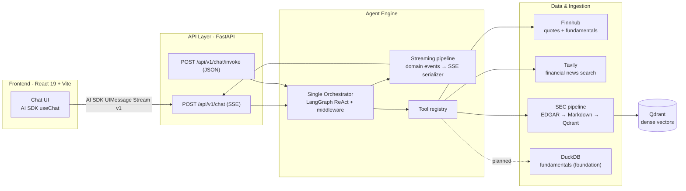
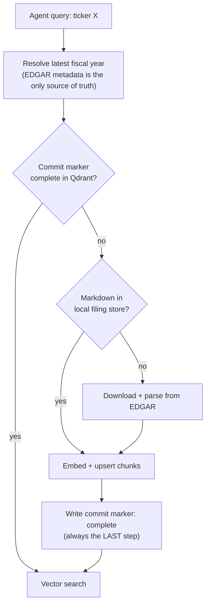
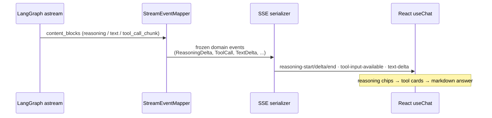

# FinLab-X — Financial Research AI Agent

A financial research agent for US growth stocks, built as a deep-dive portfolio project in
**agent orchestration, streaming UX, observability, and evaluation**. It answers open-ended
research questions ("What supply-chain risks does AMD disclose in its 10-K?") by orchestrating
live market data, financial news search, and RAG over SEC filings — with every step traced,
measured, and evaluated.

**Stack**: Python · FastAPI · LangChain/LangGraph · Qdrant · DuckDB · Braintrust/Langfuse · React 19 · Vite · Vercel AI SDK

## Highlights

| What | Result | Where |
|---|---|---|
| End-to-end streaming (reasoning + tool calls + answer over SSE) | Median time-to-first-visible-token **~36 s → ~4 s** | [Streaming](#end-to-end-streaming) |
| Cross-entity RAG failure diagnosis + metadata pre-filtering | ticker-precision@10 **0.62 → 1.00** (18-query benchmark) | [Retrieval case study](#case-study-cross-entity-retrieval-contamination) |
| Scenario-first evaluation framework on Braintrust | Deterministic scorers + binary-rubric LLM judges + hand-curated golden datasets | [Evaluation](#evaluation) |
| Full-pipeline observability | ADR-ratified, POC-verified platform migrations (LangSmith → Langfuse → Braintrust) | [Observability](#observability) |
| Calibrated engineering discipline | A written [Design Envelope](docs/design-envelope.md) that defines both over- and under-engineering as review findings | [Engineering practice](#engineering-practice) |

## System architecture



The repo is split into decoupled environments with enforced dependency rules
(API never contains AI logic; tools are stateless and never depend on the orchestrator;
ingestion pipelines are independent siblings):

| Layer | Path | Responsibility |
|---|---|---|
| API | `backend/api/` | HTTP/SSE routing only; builds one Orchestrator singleton via FastAPI lifespan |
| Agent Engine | `backend/agent_engine/` | Orchestrator, tools, streaming pipeline, config-driven profiles |
| Ingestion | `backend/ingestion/` | SEC filing pipeline, dense (RAG) pipeline, fundamentals pipeline |
| Evaluation | `backend/evals/` | Scenario-first eval framework (Braintrust `Eval()` executor) |
| Frontend | `frontend/` | Generative chat UI on the Vercel AI SDK UIMessage Stream protocol |

## Agent design: Single Orchestrator, config-driven profiles

FinLab-X deliberately rejects multi-agent routing in favor of a **Single Orchestrator +
Capabilities** pattern: one reasoning engine (built on LangChain's `create_agent` ReAct loop)
with tools as its only implemented capability kind. This keeps behavior deterministic and
debuggable — every decision lives in one trace tree.

Behavior is configured, not hardcoded. A **Workflow Profile** is a directory
(`backend/agent_engine/agents/profiles/<name>/`) holding an `orchestrator_config.yaml`
(model, tools, tool-call budget) plus a `system_prompt.md`. Switching profiles swaps the
agent's entire capability surface without code changes:

| Profile | Adds | Status |
|---|---|---|
| `baseline` | Finnhub quote/fundamentals, Tavily news search, two-step SEC filing tools | **Live default** |
| `reader` | Long-context document synthesis | Placeholder tier |
| `quant` | DuckDB query + text-to-SQL | Placeholder tier |
| `graph` | Knowledge-graph tools | Placeholder tier |
| `analyst` | Everything combined | Placeholder tier |

Orchestrator details worth a look in [`backend/agent_engine/agents/base.py`](backend/agent_engine/agents/base.py):

- **Middleware over patching** — a `RunBudgetMiddleware` subclasses LangChain's tool-call-limit
  middleware to rewrite its injected message, because the model was paraphrasing an internal
  budget stop as "I hit a rate limit" to users.
- **Fail-fast startup validation** — unknown prompt placeholders, missing `EDGAR_IDENTITY`,
  or invalid provider reasoning configs raise at boot, not mid-request.
- **Safe regenerate** — walks the checkpointed message history backward to remove exactly the
  last assistant/tool block, guarded by message-id validation (HTTP 404/422 split at the API).

## Three data layers

The agent's tools span three progressively more structured data layers:

| Layer | Source → Store | Agent entry point |
|---|---|---|
| News search | Tavily (trusted-domain allowlist) | `tavily_financial_search` |
| Unstructured RAG | SEC EDGAR 10-K HTML → Markdown → Qdrant dense vectors | `search_sec_filings` (JIT) |
| Structured quant | SEC XBRL / market data → DuckDB (8-table schema, foundation layer) | `duckdb_query` + text-to-SQL (planned, `quant` profile) |

### Two-path SEC architecture

SEC filings serve two different access patterns, so there are two deliberate paths sharing a
common core (`backend/common/sec_core.py` — shared filing types and error taxonomy):

- **Structured reads** — `sec_filing_list_sections` / `sec_filing_get_section` give the agent
  low-latency access to specific 10-K items via edgartools.
- **RAG path** — a four-stage pipeline (`backend/ingestion/sec_filing_pipeline/`):
  download → HTML preprocessing with **heading promotion** (a 4-stage heuristic promoting
  `Item 1A`-style headings, calibrated against 23 tickers bucketed clean/messy/hard) →
  Markdown conversion (Rust converter with Python fallback) → cleanup, validated across
  24 tickers / 8 industries. Guiding rule: *prefer leaving noise over risking deletion of
  real content.*

### Just-in-time ingestion with a "committed or absent" invariant

Any ticker outside the pre-ingested universe is ingested on demand at question time:



A per-(ticker, year) **commit marker** is written `pending` first and flipped to `complete`
only after every chunk is upserted — a partially ingested filing can never be mistaken for a
complete one. Ingestion is idempotent (UUID5 point IDs) and all-or-nothing per ticker.

## End-to-end streaming

The agent streams **reasoning, tool calls, and answer text** progressively to the UI over SSE,
speaking the Vercel AI SDK's UIMessage Stream Protocol v1 natively.



The backend pipeline is three strictly separated layers
([`backend/agent_engine/streaming/`](backend/agent_engine/streaming/)): a frozen
**domain-event schema** (provider-agnostic value objects), a stateful **event mapper**
(LangChain chunks → domain events, including part-boundary rules for multi-round tool loops),
and a stateless **SSE serializer** — plus a tool-error sanitizer so stack traces and paths
never reach the client.

### Measured impact (time-to-first-visible-token)

Benchmarked against the blocking JSON endpoint on the same queries
(local uvicorn, `gpt-5-mini` with reasoning on, warmups discarded):

| Pipeline | Pooled median TTFT | n |
|---|---|---|
| Blocking `POST /chat/invoke` | **36.3 s** | 9 |
| SSE without reasoning forwarding | 6.1 s | 24 (derived) |
| SSE with reasoning streaming | **3.9 s** | 24 |

*First visible token* = first of `reasoning-delta` / `tool-input-available` / `text-delta` —
the first moment the user sees the agent doing anything. On the heaviest SEC query the gap is
~29× (98 s → 3.4 s). Trace coverage for the benchmark was verified: 41/41 requests produced
complete span trees in the tracing backend.

### Multi-provider reasoning streaming *(in-flight branch)*

`feat/multi-provider-streaming-reasoning` extends this to a provider-agnostic reasoning layer:

- One config knob (`reasoning: on | off | unsupported`) maps to each provider's thinking
  kwargs (OpenAI Responses, Gemini `include_thoughts`, Anthropic `thinking` budgets) — a
  **three-state enum, not a boolean**, because "don't send the kwarg at all" is a distinct
  provider requirement.
- Reasoning renders as collapsible **"Thought for Xs" transcript chips** (ADR-0006 of that
  branch), with wall-clock timers that survive background-tab throttling and abort detection
  derived from the wire shape (a missing `reasoning-end`) rather than extra client state.
- The same domain events feed a **trace-level reasoning transcript** written once per
  conversation turn to a self-owned root span (ADR-0007) — chosen over per-LLM-call metadata
  after the per-call design required coupling to a tracing library's private API.

## Case study: cross-entity retrieval contamination

*(experiment branch `experiment/rag-filter-eval`; written up in the article
"RAG Is Not Just Vector Search: Entity Mismatch in 10-K Retrieval")*

**Diagnosis.** On Chinese-language questions about a single company, pure dense retrieval over
a six-ticker 10-K corpus (1,844 chunks) leaked chunks from semantically adjacent competitors.
Worst case: a question about AMD's supply-chain risk returned **0/10 correct chunks**
(7 Intel + 3 NVIDIA) — AMD holds only 4.5% of the corpus and was drowned out by its larger
neighbors. Contamination followed industry-competition structure, not randomness.

**Experiment.** A controlled A/B on two Qdrant collections sharing byte-identical embedding
vectors — the only variables were payload indexing and the query-time filter:

| Condition | Setup | ticker-precision@10 (mean, 18 queries) |
|---|---|---|
| Naive dense | No payload index, no filter | **0.62** (floor 0.00, σ ≈ 0.31) |
| Metadata pre-filter | Tenant-aware keyword index on `ticker` + `must` filter | **1.00** |

**Honest framing** (from the experiment report itself): the 1.00 is a mathematical consequence
of the filter — the real finding is the *shape of the baseline failure*: a 0.62 mean hiding a
0.00 floor, with small-corpus entities collapsing hardest. The filtered condition assumes an
oracle ticker label; routing accuracy is deliberately out of scope. Results are reproducible —
three runs per condition produced byte-identical scores.

## Evaluation

Evaluation is treated as a **production-grade zone** of this project (see
[Design Envelope §4](docs/design-envelope.md)) — the measurement rigor is the portfolio,
not an afterthought. Everything lives in [`backend/evals/`](backend/evals/), organized
**scenario-first**: each scenario directory is self-contained (spec + dataset + scorers).

| Track | Question it answers | Entry point |
|---|---|---|
| Regression suite | "Did we break critical behavior?" | `pytest -m eval` (being rebuilt) |
| Quality track | "Did quality improve?" | `python -m backend.evals.eval_runner <scenario>` |

Design decisions that shape the framework:

- **Braintrust `Eval()` is the sole executor**, but runs are **local-first by default**
  (`no_send_logs=True` — no network, no API key needed); `--upload` is explicit opt-in and
  fails at preflight rather than silently downgrading (ADR-0006).
- **Deterministic before LLM** — anything decidable programmatically (tool-call sets,
  dangling `[N]` citations, CJK-ratio language checks) never spends a judge call; LLM judges
  handle only the residual semantic question.
- **Binary rubrics, one judge call per criterion** — 0/1 verdicts avoid the halo and
  anchoring bias of 1–5 scales; per-criterion calls avoid cross-contamination.
- **Eval tasks reuse the production code path** — the baseline task drives the same
  `astream_run()` domain-event stream the API serves, so evals measure what users get.
- **Provenance built in** — result CSVs carry the git SHA (with `-dirty` suffix) and a
  preflight validates the vector collection before scoring retrieval.

Live scenarios on `main`: `language_policy` (tool-argument language + response-language +
LLM-judged relevance) and `sec_retrieval` (recall@k / MRR / MAP over header-path targets).

### Golden dataset & cross-version comparison *(in-flight branch)*

`feat/golden-dataset-eval-pipeline-v1-v3` designs the flagship eval: a hand-curated
**30-question golden dataset** (bilingual, 28 categories, each row recording *why the baseline
architecture should fail it* and which data sources it needs) scored across 8 dimensions with
~10 Braintrust score streams. Notable rules:

- **Architecture-only comparison as a hard gate** — profile tiers may only be compared when
  they run the identical orchestrator model; the runner refuses on mismatch, so score deltas
  are attributable to architecture, never model upgrades.
- **Human calibration gate** — LLM judges are accepted only after reaching Cohen's κ ≥ 0.7
  against SME annotations, with a rewrite-rubric loop below threshold.

### Baseline behavior diagnostic *(in-flight branch)*

`feat/v1-eval-experiment-pipeline` adds a third track: a human-diagnostic run where the
dataset is a **testable hypothesis about the agent** — every row pre-registers a capability
band, an expected outcome, a predicted failure mechanism, and the tuning lever that would fix
it. Automation scores only what is structurally decidable (execution health, tool-call
success); everything qualitative goes to a human annotation queue, joined back by a
deterministic `dataset::run::row` session key. The eval measures the accuracy of the
developer's mental model, not just the agent.

## Observability

Principle: **"If it isn't logged, it didn't happen."** Every LLM call, tool execution, and
retrieval step emits spans; the JIT ingestion path produces a full trace tree per request.

The platform history is itself a showcase of decision discipline — two migrations
(LangSmith → Langfuse → Braintrust), each **ratified by ADR and verified by a POC branch
before commitment**:

| ADR | Decision |
|---|---|
| [0005](docs/adr/0005-runtime-tracing-unified-on-braintrust.md) | Runtime tracing unifies on Braintrust — with an honest account of sunk cost (~561 lines of unmerged Langfuse code) and a retention trade-off |
| [0006](docs/adr/0006-eval-default-local-no-upload.md) | Eval runs default local-only; upload is explicit opt-in |

Operational details: traced spans follow a `snake_case` naming contract with a `sec_` prefix
for SEC operations; a process-start timestamp in trace metadata disambiguates pre/post-restart
traces sharing a session; on the in-flight streaming branch, abort cleanup writes the
reasoning tail synchronously so cancellation can't lose observability data.

## Engineering practice

### The Design Envelope

[`docs/design-envelope.md`](docs/design-envelope.md) is the project's calibration contract —
a written single source of truth for scale assumptions (≤3 concurrent users, <1 QPS,
<50k chunks) and depth allocation. Its two symmetric rules make review findings objective:

- Robustness **beyond** the envelope is *over-engineering* — flagged for removal, not improvement.
- Shortcuts **inside** a Production-Grade Zone (evals, observability, ADRs, failure legibility) are *under-engineering*.

It's enforced, not aspirational: a July 2026 audit removed **~8–10k lines** built for scale
pressures that don't exist (the envelope's "case law" section names ten precedents), and one
in-flight branch carries its own over-engineering trim that deleted roughly half of a
governance layer before review.

### Decision records, glossary, CI

- **Six ADRs** in [`docs/adr/`](docs/adr/), each with a *Rejected alternatives* section and an
  explicit *reopen-when* threshold (e.g. "no field-discovery tool until ~40–50 fields").
- **[`CONTEXT.md`](CONTEXT.md)** — a ratified domain glossary (~40 terms) with explicit
  *Avoid* lists that retire superseded vocabulary, keeping humans and AI agents on one language.
- **CI** (GitHub Actions, 5 jobs): ruff lint/format, pytest with a real Qdrant service
  container, frontend typecheck/build/unit tests, Playwright E2E (chromium + firefox), and a
  Docker build. ~755 backend test functions across 56 files; frontend failure-matrix testing
  via 18 named MSW fixtures (mid-stream errors, parallel tool failure, XSS probes).

## Repository layout

```
backend/
  api/                  FastAPI routers (SSE chat, JSON invoke) — no AI logic
  agent_engine/
    agents/             Orchestrator + config-driven profiles (baseline, reader, quant, ...)
    streaming/          Domain events → event mapper → SSE serializer
    tools/              Finnhub, Tavily, SEC filing tools (registry pattern)
  common/               Shared SEC domain types & error taxonomy
  evals/                Scenario-first eval framework (Braintrust executor)
  ingestion/
    sec_filing_pipeline/   EDGAR → Markdown (heading promotion, cleanup)
    sec_dense_pipeline/    Markdown → Qdrant (JIT, commit markers)
    fundamentals_pipeline/ DuckDB 8-table foundation
  tests/                ~755 tests mirroring source layout
frontend/               React 19 + Vite + AI SDK chat UI (atomic component tree)
docs/                   design-envelope.md · adr/ · agent_architecture.md · observability.md
```

## Quick start

```bash
# Backend (Python 3.13, uv)
uv sync
uv run uvicorn backend.api.main:app --reload

# Frontend (pnpm)
cd frontend
pnpm install
pnpm dev

# Or: backend + Qdrant via Docker
docker compose up
```

Run the test suites:

```bash
pytest backend/tests/            # backend unit tests
cd frontend && pnpm test         # frontend unit tests
```

Run an evaluation scenario (local-only by default, no upload without explicit opt-in):

```bash
python -m backend.evals.eval_runner language_policy
```

## Status

`main` carries the live baseline agent (streaming chat, SEC RAG with JIT ingestion, eval
framework, CI). Active branches extend it — multi-provider reasoning streaming, the golden
dataset cross-version eval, and the baseline behavior diagnostic — each developed behind its
own design doc, BDD verification plan, and review loop before merge.
