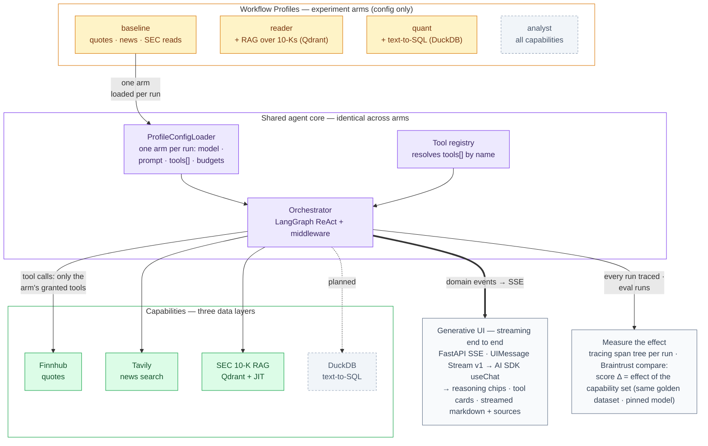
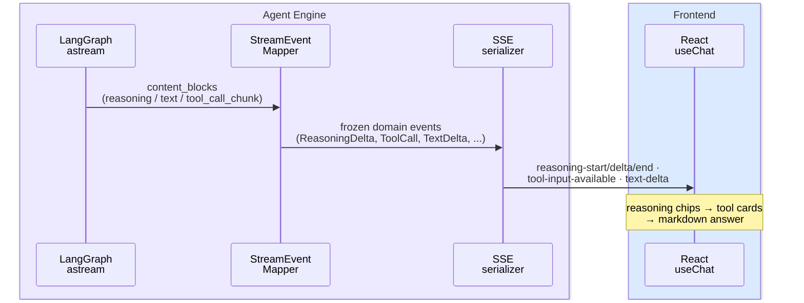
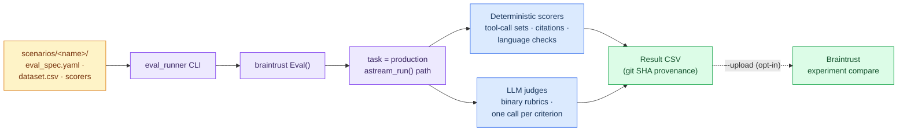
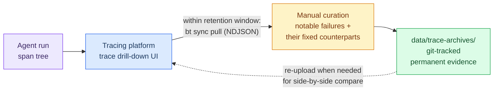
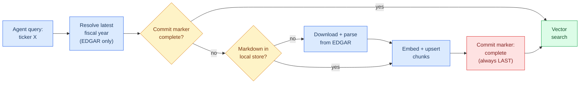

# FinLab-X — Financial Research AI Agent

A financial research agent for US growth stocks. It answers open-ended research questions
("What supply-chain risks does AMD disclose in its 10-K?") by orchestrating live market data,
financial news search, and RAG over SEC filings — with every step streamed to the UI, traced,
and evaluated.

**Stack**: Python · FastAPI · LangChain/LangGraph · Qdrant · DuckDB · Braintrust/Langfuse · React 19 · Vite · Vercel AI SDK

## System architecture

FinLab-X is structured as an **experiment in agent capability composition**. The agent core
(Orchestrator, streaming, tracing) stays fixed; each **Workflow Profile** is an experiment
arm that grants a different capability set — which tools, model, prompt, and budgets the
agent runs with. The profile's `tools[]` names are resolved by the **tool registry** at
startup, and the capabilities reach into three progressively more structured data layers.
Arms are compared on the same golden dataset under a pinned model, so a score delta is
attributable to the capability set, never the model.



**The experiment arms** — a profile is a config directory
(`profiles/<name>/orchestrator_config.yaml` + `system_prompt.md`); swapping it swaps the
capability surface without code changes:

| Profile | Approach | Status |
|---|---|---|
| `baseline` | Tool-calling ReAct over Finnhub quotes, Tavily news, SEC filing section reads | **Live default** |
| `reader` | Long-context synthesis + RAG over SEC 10-Ks (Qdrant dense retrieval) | In development |
| `quant` | Text-to-SQL over structured fundamentals (DuckDB) | In development |
| `graph` | Knowledge-graph analysis | Planned |
| `analyst` | Combined research assistant (all capabilities) | Planned |

**The three data layers** the capabilities draw from:

| Layer | Source → Store | Agent entry point |
|---|---|---|
| News search | Tavily (trusted-domain allowlist) | `tavily_financial_search` |
| Unstructured RAG | SEC EDGAR 10-K → Markdown → Qdrant dense vectors | `search_sec_filings` (JIT) |
| Structured quant | SEC XBRL / market data → DuckDB (8-table schema) | text-to-SQL (`quant` profile, in development) |

The Single Orchestrator + capabilities pattern keeps every decision in one trace tree; the
architecture leaves room for additional agents later (e.g. a reviewer agent in front of the
orchestrator) without changing the profile or tool contracts.

## End-to-end streaming

Reasoning, tool calls, and answer text all render progressively in the UI over SSE, speaking
the Vercel AI SDK's UIMessage Stream Protocol v1 natively. The backend pipeline is three
strictly separated layers: a frozen provider-agnostic **domain-event schema**, a stateful
**event mapper** (LangChain chunks → domain events), and a stateless **SSE serializer**.



**Measured impact** — benchmarked against the blocking JSON endpoint on the same queries
(`gpt-5-mini` with reasoning on, warmups discarded):

| Pipeline | Median time-to-first-visible-token |
|---|---|
| Blocking `POST /chat/invoke` | **36.3 s** |
| SSE without reasoning forwarding | 6.1 s |
| SSE with reasoning streaming | **3.9 s** |

*First visible token* = first of `reasoning-delta` / `tool-input-available` / `text-delta`.
Reasoning streaming is
provider-agnostic: one config knob (`reasoning: on | off | unsupported`) maps to each
provider's thinking parameters (OpenAI Responses, Gemini, Anthropic), rendered as collapsible
"Thought for Xs" transcript chips.

## Evaluation & Observability

Evaluation is scenario-first: each scenario directory is a self-contained contract
(spec + dataset + scorers), executed by Braintrust `Eval()` — local-first by default,
platform upload as explicit opt-in.



Principles: anything decidable programmatically never spends a judge call; LLM judges use
0/1 rubrics (no 1–5 scales) with one call per criterion; eval tasks drive the same streaming
code path the API serves. In development on feature branches: a hand-curated **30-question
golden dataset** for cross-profile comparison under a pinned model, with LLM judges accepted
only after reaching Cohen's κ ≥ 0.7 against human annotations.

**Observability** follows *if it isn't logged, it didn't happen*: every LLM call, tool
execution, and retrieval step emits spans, so each run uploads a full trace tree to the
tracing platform (Braintrust, POC-verified and ADR-ratified). Because platform retention is
finite, notable traces don't stay only on the platform — they are pulled down, manually
curated, and committed to git as permanent evidence:



The archive holds runtime traces only — experiments are retained long-term on the platform
and need no retention-driven archival. Platform choices are ratified by ADRs with POC
verification before each migration (see [`docs/adr/`](docs/adr/)).

## Just-in-time SEC ingestion

Any ticker outside the pre-ingested universe is ingested on demand at question time —
EDGAR download → Markdown conversion → chunking + embedding → Qdrant:



A per-(ticker, year) **commit marker** is written `pending` first and flipped to `complete`
only after every chunk is upserted — a partially ingested filing can never be mistaken for a
complete one ("committed or absent"). Ingestion is idempotent (UUID5 point IDs), and the
filing pipeline's heading-promotion heuristics were calibrated against 23 tickers across
clean/messy/hard document classes.

## Repository layout

```
backend/
  api/                  FastAPI routers (SSE chat, JSON invoke) — no AI logic
  agent_engine/
    agents/             Orchestrator + config-driven profiles (baseline, reader, quant, ...)
    streaming/          Domain events → event mapper → SSE serializer
    tools/              Finnhub, Tavily, SEC filing tools (registry pattern)
  common/               Shared SEC domain types & error taxonomy
  evals/                Scenario-first eval framework (Braintrust executor)
  ingestion/
    sec_filing_pipeline_html/   EDGAR → Markdown (heading promotion, cleanup)
    sec_dense_pipeline_html/    Markdown → Qdrant (JIT, commit markers)
    fundamentals_pipeline/ DuckDB 8-table foundation
  tests/                ~755 tests mirroring source layout
data/trace-archives/    Curated trace bundles (permanent evidence)
frontend/               React 19 + Vite + AI SDK chat UI (atomic component tree)
docs/                   design-envelope.md · adr/ · agent_architecture.md · observability.md
```

## Quick start

```bash
# Backend (Python 3.13, uv)
uv sync
uv run uvicorn backend.api.main:app --reload

# Frontend (pnpm)
cd frontend
pnpm install
pnpm dev

# Or: backend + Qdrant via Docker
docker compose up
```

Run the test suites:

```bash
pytest backend/tests/            # backend unit tests
cd frontend && pnpm test         # frontend unit tests
```

Run an evaluation scenario (local-only by default):

```bash
python -m backend.evals.eval_runner language_policy
```

## Status

`main` carries the live baseline agent (streaming chat, SEC RAG with JIT ingestion, eval
framework, CI). Active branches extend it — multi-provider reasoning streaming, the golden
dataset cross-profile eval, and a human-in-the-loop behavior diagnostic — each developed
behind its own design doc and verification plan before merge.

## Related writing & talks

- **Article — [RAG Is Not Just Vector Search: Entity Mismatch in 10-K Retrieval](https://medium.com/@wytdong/rag-%E4%B8%8D%E5%8F%AA%E6%98%AF-vector-search-%E5%BE%9E-10-k-%E6%AA%A2%E7%B4%A2%E7%9A%84%E5%AF%A6%E9%AB%94%E9%8C%AF%E8%AA%A4-%E8%AB%87-metadata-filtering-%E7%9A%84%E4%B8%89%E5%B1%A4%E5%A5%91%E7%B4%84-30db7e644a5c)** (Medium) — an 18-query controlled experiment on metadata pre-filtering and tenant-aware indexing, run on this repo's SEC corpus.
- **Talk — [Agent Observability & Evaluation](https://docs.google.com/presentation/d/103yxXhcqoV-vw3QB00NKDVfVbI41nchdMlZ3a702l6E/present)** — tracing, evaluation datasets, and failure analysis for LLM agents, drawn from this project's observability and eval work.
