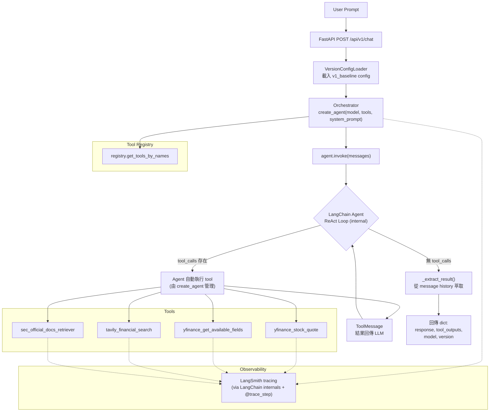

# Task Walkthrough

以下內容以更細緻的層級說明每個檔案與 function 的用途，並提供整體 flow 的 Mermaid 圖。

## 1. Architecture / Flow (Mermaid)



## 2. `backend/agent_engine/orchestrator/base.py`

Version-agnostic Orchestrator，是系統的中央推理引擎。使用 LangChain 的 `create_agent` 委託 tool calling loop，而非自行實作 while loop。

### Class: `Orchestrator`

- `__init__(self, config: VersionConfig)`
  - 透過 `get_tools_by_names(config.tools)` 從 Tool Registry 載入工具
  - 呼叫 `_build_system_prompt()` 建立 system prompt
  - 呼叫 `create_agent(model=config.model.name, tools=self.tools, system_prompt=self.system_prompt)` 建立 agent
  - `create_agent` 內部會自動執行 `bind_tools()`，將工具的 JSON schema（name、description、parameters）傳遞給 LLM，不需手動綁定
  - **不再有** `self.model`、`self.max_iterations` — agent 內部管理 ReAct loop

- `_build_system_prompt(self) -> str`
  - Zero Hallucination Policy：只使用 tool 回傳的資料
  - Response Format：結論先行、數據佐證、引用來源
  - **不再列出個別 tool 說明** — `create_agent` 的 `bind_tools` 已將 tool schemas 自動傳遞給 LLM

- `run(self, prompt: str, **kwargs) -> dict[str, Any]`
  - 呼叫 `self.agent.invoke({"messages": [{"role": "user", "content": prompt}]})`
  - `create_agent` 返回 `CompiledStateGraph`，`invoke()` 回傳 `{"messages": list[AnyMessage]}`
  - 呼叫 `_extract_result()` 從 message history 萃取結構化結果
  - **不再有** while loop 與 `_execute_tool()` — agent 自動管理 tool 呼叫與回應迴圈

- `_extract_result(self, agent_output: dict) -> dict[str, Any]`
  - 從 `agent_output["messages"]` 萃取結果
  - **response**：從後往前找第一個無 `tool_calls` 的 `AIMessage`，取其 `content`
  - **tool_outputs**：遍歷所有 `ToolMessage`，透過 `tool_call_id` 與前序 `AIMessage.tool_calls` 配對，取得 tool name、args、result
  - 回傳 `{"response", "tool_outputs", "model", "version"}`（不再含 `"iterations"`）

## 3. `backend/agent_engine/tools/`

### `base.py` — 工具基礎類別

- `InputT = TypeVar("InputT", bound=BaseModel)`
- `OutputT = TypeVar("OutputT")`
- `BaseTool(ABC)`：定義 `name`、`description`、`input_schema`，抽象方法 `execute()`，以及 `__call__()` 做 schema validation 後呼叫 `execute()`

### `financial.py` — 金融數據工具

#### Input schemas

- `YFinanceStockQuoteInput`：`ticker: str`
- `YFinanceGetAvailableFieldsInput`：`ticker: str`
- `TavilyFinancialSearchInput`：`query: str`、`ticker: str`

#### Global constants

- `TRUSTED_NEWS_DOMAINS`：僅允許 `reuters.com`、`bloomberg.com`、`cnbc.com`

#### Tool functions

- `yfinance_stock_quote(ticker: str) -> dict[str, Any] | str`
  - `@tool("yfinance_stock_quote")` + `@trace_step(tags=["tool:yfinance", "version:0.1.0"])`
  - `ticker.strip().upper()` 正規化
  - 以 `yf.Ticker(ticker).info` 取回 `currentPrice`、`fiftyTwoWeekHigh/Low`、`forwardPE`、`trailingPE`
  - 任何例外回傳 `Error:` 字串

- `yfinance_get_available_fields(ticker: str) -> dict[str, Any] | str`
  - `@tool("yfinance_get_available_fields")` + `@trace_step(tags=["tool:yfinance", "version:0.1.0"])`
  - 預定義 24 個常見欄位（`currentPrice`、`marketCap`、`revenueGrowth` 等）的 description mapping
  - 掃描 `yf.Ticker(ticker).info` 回傳所有可用欄位及數量
  - 任何例外回傳 `Error:` 字串

- `tavily_financial_search(query: str, ticker: str) -> dict[str, Any] | str`
  - `@tool("tavily_financial_search")` + `@trace_step(tags=["tool:tavily", "version:0.1.0"])`
  - 檢查 `TAVILY_API_KEY` 環境變數
  - 以 `TavilyClient.search()` 查詢 `{ticker} {query}`，限制 `include_domains=TRUSTED_NEWS_DOMAINS`，`max_results=5`
  - 回傳 `{"query", "results": [{"title", "url", "content", "published_date"}]}`
  - 任何例外回傳 `Error:` 字串

### `sec.py` — SEC 文件檢索工具

#### Constants

- `MAX_SECTION_CHARS = 4000`

#### Input schemas

- `SecOfficialDocsRetrieverInput`：`ticker: str`、`doc_type: Literal["10-K", "10-Q"]`（預設 `"10-K"`）

#### Helper functions

- `_extract_section(text: str, start_markers: list[str], end_markers: list[str]) -> str | None`
  - 以 marker 在 `text.lower()` 中尋找區段起止位置
  - 擷取並截斷至 `MAX_SECTION_CHARS`

#### Tool functions

- `sec_official_docs_retriever(ticker: str, doc_type: str = "10-K") -> dict[str, Any] | str`
  - `@tool("sec_official_docs_retriever")` + `@trace_step(tags=["tool:sec", "version:0.1.0"])`
  - 檢查 `EDGAR_IDENTITY` 環境變數，呼叫 `set_identity()`
  - 透過 `Company(ticker).get_filings(form=doc_type).latest()` 取最新文件
  - `re.sub(r"\s+", " ", filing.text())` 清理文字
  - 擷取 `Item 1A` (Risk Factors) 與 `Item 7` (MD&A)
  - 回傳 `{"ticker", "doc_type", "filing_date", "risk_factors", "mdna", "raw_excerpt"}`
  - 任何例外回傳 `Error:` 字串

### `__init__.py` — 工具註冊與匯出

- 從 `financial.py` 匯入 3 個工具，從 `sec.py` 匯入 1 個工具
- 透過 `register_tool()` 將 4 個工具註冊至全域 Tool Registry
- 匯出 `V1_TOOLS` list 供直接使用

## 4. `backend/agent_engine/agents/specialized/registry.py`

Central Tool Registry，負責工具的動態載入。

### Module-level

- `TOOL_REGISTRY: dict[str, Any]`：全域 registry 字典

### Functions

- `register_tool(name: str, tool: Any) -> None`：將 tool 註冊至 `TOOL_REGISTRY`
- `get_tool(name: str) -> Optional[Any]`：依名稱取得單一 tool
- `get_tools_by_names(tool_names: list[str]) -> list[Any]`：依名稱清單取得多個 tools（僅回傳存在的）
- `list_registered_tools() -> list[str]`：列出所有已註冊 tool 名稱
- `clear_registry() -> None`：清除 registry（用於測試）

### Class: `ToolRegistry`

- 提供 class-based interface（`register`、`get`、`get_all`、`list_all`），內部委派至 module-level functions

## 5. `backend/agent_engine/observability/langsmith_tracer.py`

LangSmith tracing 的核心裝飾器。

### `trace_step(step_name: str, run_type: str = "chain", tags: Optional[list[str]] = None) -> Callable`

- **注意：`tags` 必須是 `list[str]`，不是 `dict`**
- 建立 `RunTree(name=step_name, run_type=run_type, inputs=..., tags=tags or [])`
- 成功時呼叫 `run_tree.end(outputs=...)` + `run_tree.post()`
- 失敗時呼叫 `run_tree.end(error=str(e))` + `run_tree.post()` 後 re-raise

## 6. `backend/agent_engine/workflows/config_loader.py`

YAML-based 版本化設定載入器。

### Pydantic Models

- `ModelConfig`：`name="gpt-4o-mini"`、`temperature=0.0`、`max_iterations=10`
- `ObservabilityConfig`：`provider="langsmith"`、`trace_all_steps=True`、`project_name="finlabx"`
- `ConstraintsConfig`：`max_tool_calls_per_step=5`、`require_citations=True`、`zero_hallucination_policy=True`、`max_context_tokens`、`enable_code_execution`、`enable_graph_queries`、`enable_parallel_subagents`
- `VersionConfig`：`version`、`name`、`description`、`tools: list[str]`、`model`、`observability`、`constraints`

### Class: `VersionConfigLoader`

- `__init__(self, version_name: str)`：定位 `workflows/{version_name}/version_config.yaml`
- `load(self) -> VersionConfig`：以 `yaml.safe_load()` 讀取 YAML，解析為 `VersionConfig`（lazy load + 快取）
- `config` property：lazy load 存取
- `tools` property：直接取得 tool names list
- `model_config` property：直接取得 model 設定
- `list_available_versions()` classmethod：掃描 `workflows/` 目錄，回傳所有含 `version_config.yaml` 的版本名稱

### v1_baseline config (`workflows/v1_baseline/version_config.yaml`)

```yaml
version: "0.1.0"
name: "v1_baseline"
model:
  name: "gpt-4o-mini"
  temperature: 0.0
  max_iterations: 10
tools:
  - yfinance_stock_quote
  - yfinance_get_available_fields
  - tavily_financial_search
  - sec_official_docs_retriever
constraints:
  max_tool_calls_per_step: 3
  require_citations: true
  zero_hallucination_policy: true
```

## 7. `backend/api/` — FastAPI 端點

### `main.py`

- `FastAPI(title="FinLab-X API", version="0.1.0")`
- `app.include_router(chat.router)`
- `GET /health`：回傳 `{"status": "healthy", "version": "0.1.0"}`

### `routers/chat.py`

#### Request / Response models

- `ChatRequest`：`message: str`、`session_id: str | None = None`
- `ChatResponse`：`response: str`、`tool_outputs: list[dict[str, Any]]`、`session_id: str`、`version: str`

#### Endpoint

- `POST /api/v1/chat`
  - 載入 `VersionConfigLoader("v1_baseline")` → `config`
  - 建立 `Orchestrator(config)`
  - 執行 `orchestrator.run(request.message)`
  - 回傳 `ChatResponse`
  - 例外時拋 `HTTPException(status_code=500)`

## 8. README updates

以下 README 已更新以反映新架構：

- `backend/README.md`
  - Quick Start 指引（`uv sync`、環境變數、`uv run pytest`、API server）
  - 版本化 workflow 說明
  - 資料夾結構與實作規範

- `backend/agent_engine/README.md`
  - 架構元件說明（Orchestrator、Tools、Observability）
  - 設計原則（Single Orchestrator、Observability First、Version-Agnostic、Zero Hallucination）
  - 版本化 workflow 清單（v1_baseline ~ v5_analyst）
  - 使用範例與實作規範

## 9. Dependency updates

`backend/pyproject.toml` 配置：

### Runtime dependencies

- `langchain>=1.2.10`：核心 LLM 框架（`create_agent`，內含 `langgraph>=1.0.8` 作為 transitive dependency）
- `langchain-openai>=1.1.10`：OpenAI 整合
- `yfinance>=1.2.0`：Yahoo Finance 股票數據
- `tavily-python>=0.7.21`：Tavily 搜尋 API
- `edgartools>=5.17.1`：SEC EDGAR 文件檢索
- `fastapi>=0.115.0`：API 框架
- `pyyaml>=6.0.2`：YAML config 解析

### Dev dependencies

- `pytest>=8.0.0`：測試框架
- `pytest-asyncio>=0.24.0`：async 測試支援
- `httpx>=0.28.0`：FastAPI TestClient 依賴
- `ruff>=0.9.0`：linting / formatting

## 10. Test structure

共 18 個測試，分佈於 7 個測試檔案：

| 測試檔案 | 測試數 | 說明 |
|---|---|---|
| `tests/agents/test_registry.py` | 3 | Registry 初始化、註冊/取得、批量取得 |
| `tests/api/test_chat.py` | 2 | `/health` endpoint、`/api/v1/chat` endpoint 存在性 |
| `tests/integration/test_v1_integration.py` | 5 | yfinance/tavily/SEC tool integration、multi-tool 序列呼叫、zero hallucination policy |
| `tests/observability/test_langsmith_tracer.py` | 2 | decorator 回傳值正確性、RunTree 呼叫驗證 |
| `tests/orchestrator/test_base.py` | 2 | Orchestrator 初始化、run() 回傳結構 |
| `tests/tools/test_financial.py` | 3 | yfinance_stock_quote/get_available_fields/tavily 工具存在性 |
| `tests/tools/test_sec.py` | 1 | sec_official_docs_retriever 工具存在性 |

Integration tests 以 `unittest.mock` 完全隔離外部依賴（`create_agent`、`get_tools_by_names`），不需要 API keys 即可執行。Agent 的 `invoke()` 回傳模擬的 `{"messages": [HumanMessage, AIMessage, ToolMessage, ...]}` 結構。

## 11. Quick verification

1. 安裝依賴：
   ```bash
   cd backend && uv sync --extra dev
   ```

2. 執行全部測試：
   ```bash
   PYTHONPATH=$(pwd)/.. uv run python -m pytest tests/ -v
   ```

3. 驗證 imports：
   ```bash
   PYTHONPATH=$(pwd)/.. uv run python -c "
   from backend.agent_engine.orchestrator.base import Orchestrator
   from backend.agent_engine.tools import V1_TOOLS
   from backend.agent_engine.workflows.config_loader import VersionConfigLoader
   print('All imports successful!')
   print(f'Available versions: {VersionConfigLoader.list_available_versions()}')
   "
   ```

4. 啟動 API server（需設定環境變數）：
   ```bash
   export OPENAI_API_KEY="..."
   export TAVILY_API_KEY="..."
   export EDGAR_IDENTITY="..."
   export LANGSMITH_API_KEY="..."
   PYTHONPATH=$(pwd)/.. uv run python -m backend.api.main
   ```
