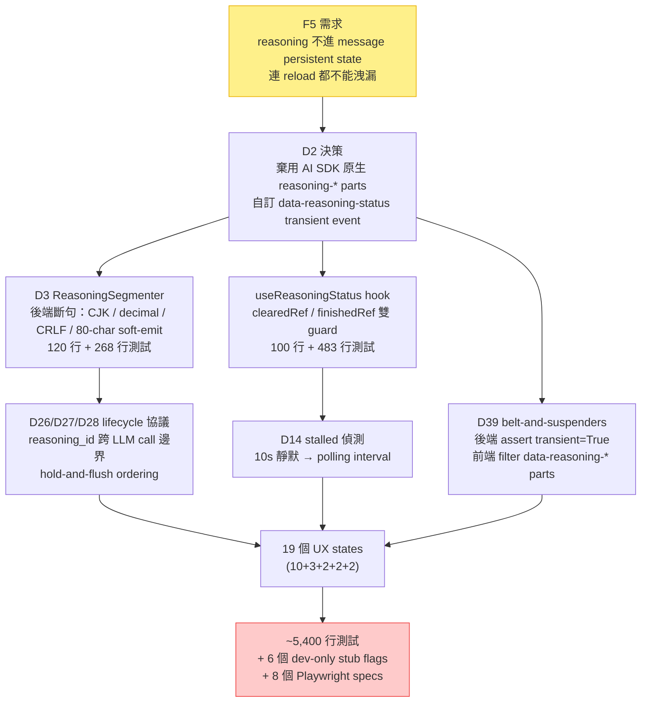
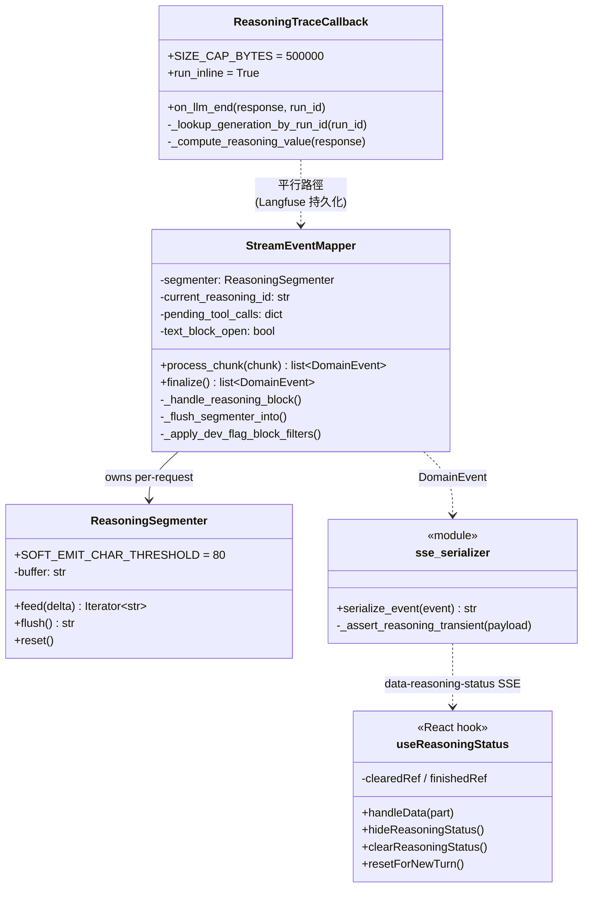
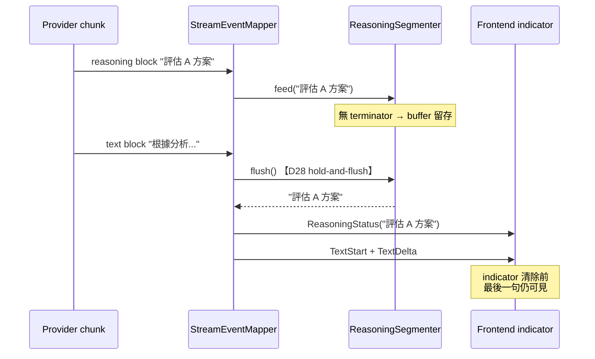
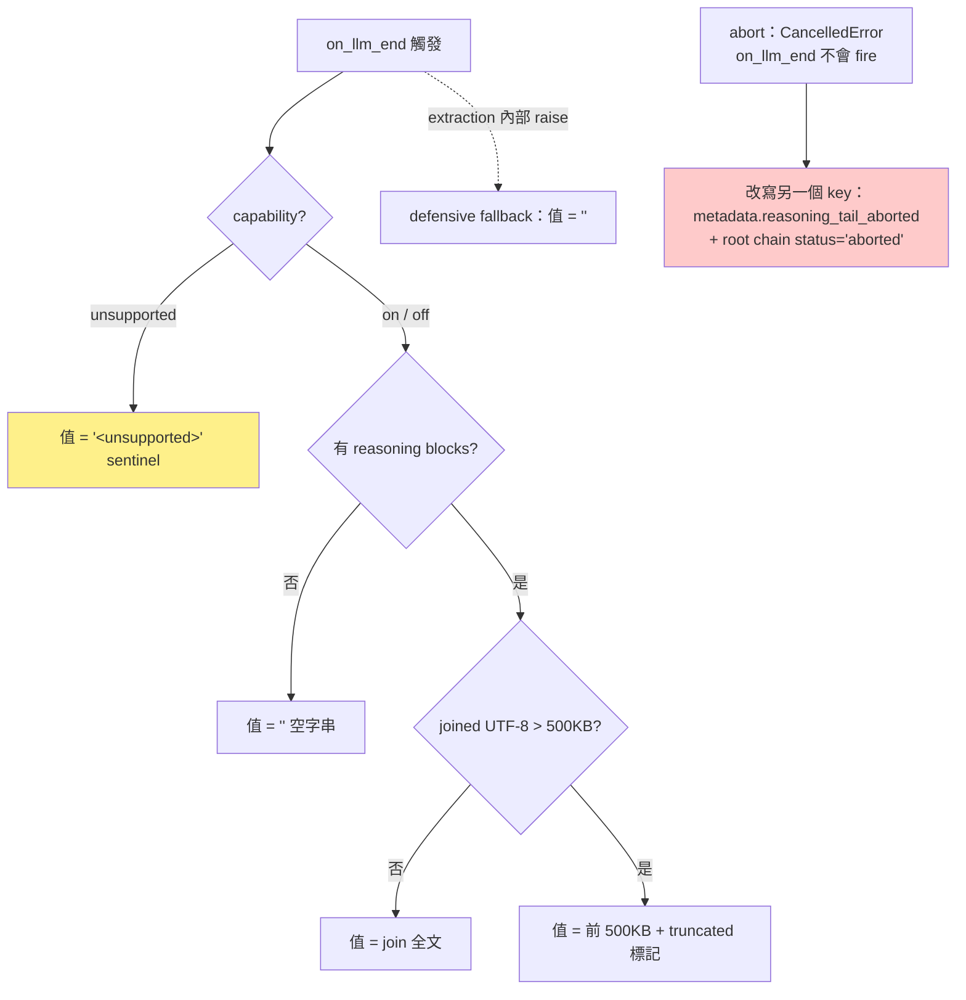

# Multi-Provider Streaming Reasoning — Over-Engineering 評估

對 `feat/multi-provider-streaming-reasoning` branch（+7,814 / −133，81 檔，36 commits）的複雜度來源做批判性拆解：哪些是需求的必然成本、哪些是值得質疑的 over-engineering、哪些是流程政策的衍生成本。

## 1. 評估框架：先分清楚三種複雜度

Over-engineering 的指控要成立，必須先區分複雜度的三種來源，因為對策完全不同：

| 類型 | 定義 | 對策 |
|---|---|---|
| Essential complexity | 需求本身要求的，砍 code 就砍到功能 | 只能透過**談判需求**來降 |
| Accidental complexity | 架構、抽象、流程自己長出來的，跟需求無關 | Refactor / 刪除，零功能損失 |
| Policy-induced complexity | 團隊政策（測試策略、流程約束）的衍生成本 | 檢討政策本身，不是檢討 code |

先講這份評估的核心結論：

> **這個 branch 幾乎沒有架構層的 accidental complexity — 三層 pipeline（domain events → mapper → serializer）是合理最小結構，provider 抽象直接用 LangChain、沒有自造。真正該質疑的是規格層：F5（ephemeral reasoning UX）、F7（per-LLM-call Langfuse 持久化）、19 個 UX states 這三條需求，各自觸發了一整條複雜度級聯（cascade）。**

一條需求如何級聯成兩千行，是這份文件的主線。以 F5 為例：



<div class="callout callout-key"><strong>核心 insight</strong> · 圖上每個節點單看都是合理決策（都有編號、有 rationale、可追溯），但沒有任何一個節點回頭質疑源頭 F5 的成本。這是 spec inflation 的典型形狀：逐步正確，整體昂貴。</div>

## 2. 複雜度分佈：7,814 行花在哪

先建立量化基準。Diff 的三大塊：

| 類別 | 行數（約） | 佔比 |
|---|---|---|
| Production code（backend + frontend） | ~1,900 | 24% |
| 測試（unit + integration + e2e + fixtures） | ~5,400 | 69% |
| Docs / scripts / config | ~500 | 7% |

測試比約 **2.8 : 1**。Production 端的元件關係（UML）：



值得注意的結構事實：**reasoning 相關的 production + 測試 code 約佔整個 diff 的 70%**，而「multi-provider」本身（換 provider 的能力）幾乎是免費的 — 靠 LangChain v1 `content_blocks` normalize，provider binding 只是 config yaml 裡的 model 字串。複雜度的名字不是 multi-provider，是 reasoning。

主要模組與其測試的對照（質疑點會反覆引用這張表）：

| 模組 | Production 行數 | 對應測試行數 | 測試比 |
|---|---|---|---|
| `reasoning_segmenter.py` | 120 | 268 | 2.2x |
| `reasoning_trace_callback.py` | 229 | 522 + 283（contract guard） | 3.5x |
| `useReasoningStatus.ts` | 100 | 483 | 4.8x |
| `verify_langfuse_trace.py`（operator script） | 292 | 304 | 1.0x |
| `event_mapper.py`（本次增量） | +180 | 195 + 183 + 157 | 3.0x |
| `ChatPanel.tsx`（本次增量） | +140 | 710（integration） | 5.1x |

## 3. 質疑點 1 — F5 Ephemeral Status-Line UX：最大的複雜度放大器

**這是四個質疑點中金額最大的一筆，估計 ~2,000 行的直接下游成本。**

### 決策現場

AI SDK v6 的 UIMessage Stream Protocol **原生支援 reasoning**：`reasoning-start` / `reasoning-delta` / `reasoning-end` parts，走完整的 streaming + 自動進 `message.parts`。design.md D2 明確棄用了它：

> D2：Reasoning 走 custom transient SSE event `data-reasoning-status`。理由：AI SDK v6 native `reasoning-*` parts 是 persistent，跟 ephemeral UX 不合。**Supersedes requirements.md §5/§9 的 native reasoning-* parts 提案。**

注意最後一句 — **requirements.md 原本提案就是 native 路線**，是 design 階段被 F5 推翻的。F5 的 hard contract 是：reasoning 文字不得進 message persistent state，連 reload 都不能洩漏（D39 rationale 原文：「一個 missing flag bug 永久污染 message.parts，reload 仍洩漏 reasoning」）。

### 級聯成本清單

一旦放棄 native parts，以下每一項都是必然衍生物：

| 衍生物 | 為什麼必然 | 行數（prod + test） |
|---|---|---|
| `ReasoningSegmenter` 後端斷句 | status-line 一次只顯示一句 → 必須在某處斷句；D3 決定放後端 | 120 + 268 |
| 自訂 `data-reasoning-status` + `transient: true` | native channel 不用了，得自己開 channel | ~40 + 52 |
| `useReasoningStatus` + 雙 ref guard | transient data 不進 messages array → 自己管理 UI state、自己防 race | 100 + 483 |
| D14 stalled 偵測（10s polling） | status-line 靜默時畫面會「僵住」→ 需要 stalled 視覺救援 | ~30 + 若干 e2e |
| D39 belt-and-suspenders 雙層防護 | 整個 F5 契約懸在一個 `transient` flag 上 → 單點信任不夠 | ~15 + 3 個 regression tests |
| D26/D27/D28 lifecycle 協議 | reasoning_id 跨 LLM call、hold-and-flush ordering | mapper 增量的大半 |
| 6 個 dev flags 中的 4 個 + 對應 Playwright specs | ephemeral 狀態機的視覺驗證需要確定性驅動 | 見 §5 |

### Hold-and-flush：自訂 channel 帶來的 ordering 契約

自訂 channel 最隱蔽的成本是 **ordering 協議**。segmenter 有 buffer，就有「buffer 裡的尾巴什麼時候出去」的問題 — D28 規定任何 text/tool block 出現前必須先 flush：



對比 counterfactual：native `reasoning-delta` 沒有 buffer、沒有 flush、沒有 ordering 協議 — SDK 的 parts array 順序就是契約。

### Counterfactual：native 路線長什麼樣

```tsx
// AssistantMessage.tsx — native 路線的 reasoning 渲染（全部前端邏輯）
{parts.map((part) => {
  if (part.type === "reasoning") {
    // streaming 中顯示、結束後摺疊；「不想看到」= 不 render，一行 filter
    return isStreaming ? <ReasoningIndicator text={lastLine(part.text)} /> : null;
  }
  // ...
})}
```

| 維度 | 現行（custom transient） | Counterfactual（native parts） |
|---|---|---|
| 後端斷句 | `ReasoningSegmenter` 120 行 | 不需要（原樣 delta，前端 `lastLine()` 一個 helper） |
| 前端 state | `useReasoningStatus` 100 行 + 雙 guard | AI SDK 管理，讀 `part.state === "streaming"` |
| Race 防護 | clearedRef / finishedRef / D39 兩層 | 不存在此類 race（parts array 單一事實來源） |
| Ordering | D28 hold-and-flush 協議 | SDK parts 順序即契約 |
| Reload 後 | 保證不出現（不落地） | **會出現在 message.parts** ← 唯一實質差異 |
| 估計省下 | — | **~1,600–2,000 行** |

### 質疑的核心：persistence 被跟 rendering 混為一談了嗎？

D2 的推理是「native parts 是 persistent → 跟 ephemeral UX 不合」。但 **persistent in `message.parts` ≠ 必須 render**。「使用者看不到 reasoning 殘留」這個 UX 目標，用 native parts + 前端不 render 就能達成 80%。真正無法達成的只有「reasoning 文字完全不落地（不進前端記憶體中的 messages array、不進任何會被存起來的 payload）」這一條。

所以整條 ~2,000 行的級聯，實際上是在為「**不落地**」這個增量保證買單，而不是為「看不到」買單。這就把問題推回 F5 本身：

1. **如果動機是資安/合規**（reasoning 可能含 system prompt 片段、內部推理不該進 DB）— 那 F5 成立，這 2,000 行是 essential complexity，只是 design.md 沒有把這個動機寫出來（Goals 表裡 F5 只描述行為，沒寫 why）。
2. **如果動機只是 UI 品味**（「reasoning 留在畫面上很醜」）— 那這是用 hard contract 的價格買 soft preference，是這個 branch 最大的一筆 over-engineering。

<div class="callout callout-warn"><strong>Heads-up</strong> · design.md 沒有記錄 F5 的動機層級（合規需求 vs UI 偏好），導致今天無法直接裁決這 2,000 行是 essential 還是 accidental。這本身就是一個 design gate 的失誤：高成本需求必須帶動機，否則後人無從重新談判。</div>

### 附帶質疑：sentence-by-sentence 是誰要的？

即使接受 ephemeral，「一句一句投射」這個顯示風格是另一層可質疑的選擇。Segmenter 的全部精密度都在服務它：

```python
# reasoning_segmenter.py — 為「一句一句」付出的語言處理成本
_HALF_WIDTH_BOUNDARY = re.compile(r"(?<!\d)[.!?](\s)")   # 防 "3.14" 被切
_IMMEDIATE_BOUNDARY = re.compile(r"[。！？\n]")            # CJK + newline

class ReasoningSegmenter:
    SOFT_EMIT_CHAR_THRESHOLD = 80  # D26 — Gemini 繁中 reasoning 可能整段無「。」
    def feed(self, delta: str) -> Iterator[str]:
        ...
        if len(remainder) >= self.SOFT_EMIT_CHAR_THRESHOLD:
            yield remainder  # 防 CJK 無限 buffer
```

Decimal look-behind、CRLF 剝除、全形半形雙 regex、80 字 soft-emit — 每一個都是真實 bug 的正確修法，但它們存在的前提是「後端負責斷句」。若顯示風格改成 rolling text（append delta、前端顯示最後 N 字），整個 class 連同 268 行測試直接消失。

## 4. 質疑點 2 — Langfuse `metadata.reasoning` 契約：observability 的 production-SLA 化

F7 要求 reasoning 寫進 Langfuse 供事後回溯，且「每個 LLM call 各自一塊」。單看合理，但實作把一個 debugging 輔助資料升級成了帶正式 schema 的 data contract。

### 五種 value shape + abort 專屬 schema

`metadata.reasoning` 的值有五種形狀，並承諾 always-write-key（completed path 上每個 GENERATION 必有此 key）：



質疑三點：

1. **Consumer 是誰？** 這個 key 的唯一消費者是「operator 事後人工回溯」+ `verify_langfuse_trace.py`。沒有下游系統、沒有 SLA、沒有 alerting 讀它。為一個人工查閱的 metadata 建立五形狀契約 + sentinel 值 + 500KB byte-boundary 截斷，是 production data contract 的工程強度用在 debugging 資料上。
2. **Abort 專屬 key 分裂了查詢介面。** 查 aborted trace 要讀 `reasoning_tail_aborted`，查正常 trace 讀 `reasoning` — operator 必須知道這個 schema 分裂（README 特別寫了一段教學）。更簡單的設計：同一個 key，abort 時值加 marker。
3. **Meta-testing。** `verify_langfuse_trace.py` 是 292 行的 operator 驗證 script，它自己又有 304 行測試 — **測「測工具」的測試**。Verifier 錯了的後果是 operator 看到誤報，成本極低，這 304 行的邊際價值存疑。

### `_runs` private API 依賴：手法正確，需求可疑

為了把 reasoning 寫到「正確的那個 GENERATION span」，callback 繞過了 Langfuse 公開 API（async dispatch 下 OTel context 會斷，`update_current_generation()` 靜默 no-op），直接讀 `CallbackHandler._runs` 私有 dict，並配了三層防禦：

```python
# reasoning_trace_callback.py — 三層 SDK-drift 防禦
runs = self._handler._runs          # ← Langfuse 私有 API
observation = runs.get(run_id)      # 1. UUID key（現行契約）
if observation is None:
    observation = runs.get(str(run_id))   # 2. drift fallback: str
    ...
    observation = runs.get(run_id.hex)    # 3. drift fallback: hex
    # 任何 fallback 命中 → once-per-process warning
# 另有 283 行 contract test 驅動真實 Langfuse handler，
# assert 精確的 key 型別 + value 型別，SDK 升級時 CI 先炸
```

以「依賴私有 API」為前提，這套防禦（fallback chain + drift warning + contract test）是教科書級的正確手法 — **問題在前提**。私有 API 依賴的根源是 F7 的「每個 LLM call 各自一塊」。如果 F7 放寬為「reasoning 全文掛在 root trace 上」，公開 API（`propagate_attributes` / trace-level metadata）就夠用，整條依賴 + 283 行 contract test + drift 防禦全部消失，代價只是 Langfuse UI 裡少一層 per-call 的對齊。事後回溯的場景（「這次回答時模型在想什麼」）用 trace-level 全文 + call 序號標記幾乎等價。

<div class="callout callout-key"><strong>核心 insight</strong> · 這是「手法無可挑剔、需求未經談判」的第二個實例。工程師在 D 層做了所有正確的事，但沒有人回頭問 F7 的粒度值不值這條私有 API 依賴。</div>

## 5. 質疑點 3 — 六個 dev-only flags 侵入 production code path

Mapper 和 serializer 的 production 邏輯裡散布著六個 `os.environ` 分支，專門讓 Playwright 驅動確定性的視覺場景：

| Flag | 位置 | 用途 |
|---|---|---|
| `FORCE_LLM_FAIL` | Orchestrator | mid-stream error path |
| `FORCE_REASONING_NON_TRANSIENT` | serializer | 剝掉 transient flag，驗證前端 filter |
| `EMIT_DELAYED_REASONING` | mapper | 只放行一個 reasoning chunk → 觸發 stalled |
| `EMIT_LATE_REASONING` | mapper `finalize()` | Finish 後注入 synthetic event → 驗證 finishedRef |
| `STUB_REASONING_ONLY` | mapper | 丟掉 text/tool blocks |
| `STUB_CONTENT_BLOCKS_NO_REASONING` | mapper | 丟掉 reasoning blocks（degrade 路徑） |

實際長相 — 測試邏輯與 production 邏輯同框：

```python
# event_mapper.py:_handle_reasoning_block — production 方法的開頭是測試 seam
def _handle_reasoning_block(self, block, events, prepend_separator=False):
    # DEV-ONLY: EMIT_DELAYED_REASONING releases ONE reasoning chunk total
    # then drops the rest. ... Production must NOT set EMIT_DELAYED_REASONING.
    if os.environ.get("EMIT_DELAYED_REASONING"):
        if self._delayed_reasoning_emitted:
            return
        self._delayed_reasoning_emitted = True
    ...

# finalize() 的結尾同樣：
    if os.environ.get("EMIT_LATE_REASONING"):
        events.append(ReasoningStatus(reasoning_id="reasoning-late", ...))
```

成本不只這幾行：每個 flag 都需要「flag 開著時」的專屬測試檔（`test_event_mapper_dev_flags.py` 183 行、`test_orchestrator_dev_flags.py` 100 行、`test_sse_serializer_dev_flags.py` 57 行 ≈ **340 行在測試「測試用的 code」**），以及每個 flag 的 README 文件 + 六處「Production must NOT set」警告 — 靠紀律而非型別防止誤開。

### 根因是政策，不是失手

這是 policy-induced complexity 的教科書案例：專案政策規定 **E2E 必須打真後端**（MSW 只准 error/edge case）。視覺狀態機的驗證需要確定性 → provider 真實輸出不可控 → 只剩「後端埋 flag」一條路。政策本身有好理由（MSW 驗過的東西不等於真系統會過），所以這些 flags 是政策的忠實執行。

### 但 seam 的位置選錯了

即使維持 real-backend 政策，測試 seam 也不必散在 mapper 內部。更乾淨的位置是 **composition 邊界 — 用一個 scripted fake chat model 取代真 provider**：

```python
# counterfactual：一個 seam 取代六個 flag
# STUB_PROVIDER=/fixtures/delayed-reasoning.json 時，
# init_chat_model 回傳 ScriptedChatModel 而非真 provider
class ScriptedChatModel(BaseChatModel):
    """照 JSON script 逐 chunk 重播 AIMessageChunk（含 reasoning blocks、延遲、截斷)。"""
    def _stream(self, ...):
        for step in self._script:
            yield make_chunk(step)   # 六個場景 = 六個 JSON script，零 production 分支
```

| 維度 | 現行（6 flags） | Counterfactual（scripted model） |
|---|---|---|
| Production 侵入 | mapper/serializer/orchestrator 共 6 處分支 | 1 處（model factory） |
| 新場景成本 | 改 production code + 新 flag + 新測試檔 | 加一個 JSON script |
| 誤開防護 | 6 處 docstring 警告 + 紀律 | 1 處檢查 |
| 場景表達力 | 受限於 flag 語意（如 delayed 無法真 sleep，用「只放一顆」近似） | script 可描述任意時序 |
| 額外收穫 | — | mapper 的 dev-flag 測試檔（340 行）整批不需要存在 |

<div class="callout callout-warn"><strong>Heads-up</strong> · flag 數量會繼續長：每個新的視覺狀態場景都傾向新增一個 flag。Scripted model 把「場景」變成資料（JSON），把成長成本從 code 降到 fixture — 這是這份評估裡少數「現在改划算」的重構。</div>

## 6. 質疑點 4 — 測試量是規格的函數：19 個 UX states 的下游

~5,400 行測試單看嚇人，但逐檔檢視後，**幾乎沒有一行在測不存在的需求** — 它們忠實覆蓋 design.md §7 的 UX 規格：

> §7. UX Specification — **10 Standard States + 3 Anthropic Re-entry + 2 Post-tool Idle + 2 Abort Sub-states + 2 Mid-text Interrupt Sub-states** = 19 states

每個 state 平均攤到三層測試（hook unit → ChatPanel integration → Playwright e2e），所以：

| 測試檔 | 行數 | 在測什麼 |
|---|---|---|
| `ChatPanel.integration.test.tsx` | 710 | 19 states 在真實 component 樹的轉移 |
| `useReasoningStatus.test.ts` | 483 | 雙 ref guard 的 race 矩陣 |
| `test_reasoning_trace_callback.py` | 522 | 五形狀契約 × 邊界（500KB、None、exception） |
| `reasoning-indicator-logic.test.ts` | 223 | dots cycling、post-tool idle 文案 |
| 8 個 Playwright specs | ~560 | 每個視覺 state 一個 spec |

所以指控「測試寫太多」找錯了對象 — **測試量是規格複雜度的忠實輸出**。19 個可觀察狀態的規格，就是會產出五千行測試；要砍測試，唯一誠實的方法是砍狀態。真正的問題要往上追：

1. **19 個 states 裡有多少是使用者可感知的價值？** 「stalled 10 秒顯示降級文案」「abort 後 STOPPED 標籤停在同一個 vertical slot」「post-tool idle 顯示 synthesizing 文案」— 這些是 polish 級的差異，每個都值一條 spec + 三層測試嗎？
2. **F6 是隱形的狀態倍增器。**「每個 thinking moment 都要有 status（pre-tool、post-tool 都顯示）」讓狀態機從「有 reasoning / 沒 reasoning」的 2 態，倍增出 post-tool idle、re-entry、mid-text interrupt 等家族。
3. 對照組：同功能的 ChatGPT/Claude.ai 式 collapsible reasoning block，UX states 大約是 4 個（streaming / done / empty / error）。

## 7. 反方觀點：為什麼這些不全是浪費

批判要成立，得先讓反方把話說完。四點：

1. **F5 可能有未記錄的正當動機。** Reasoning 文字可能含 system prompt 片段、工具內部資料或供應商不允許持久化的內容。若專案有「LLM 中間產物不落地」的資安立場，F5 是合規需求，級聯成本是 essential。問題退化為「design.md 沒寫動機」的文件缺失。
2. **這是個練 production 工程的 lab。** 從 repo 的流程痕跡（BDD、code review loop、Langfuse 驗證 CLI）看，這個專案的目的本來就包含把 production-grade 工程流程走一遍。以「lab 專案不需要」為由砍掉工程強度，可能砍掉的正是專案的存在理由。
3. **`_runs` contract test 已經證明了自己。** Commit 歷史顯示 Langfuse async context 的 bug 是真實踩到的（「Context error: No active span」），contract test 是對真實傷疤的正確防禦，不是臆想的防禦性工程。
4. **每個決策可追溯。** D1–D39 全部有編號、rationale、對應測試。這與「失控的複雜度」有本質區別 — 失控的複雜度無法做這份評估，這個 branch 可以，正因為它的複雜度是 deliberate 的。

<div class="callout callout-info"><strong>Note</strong> · 反方觀點共同指向同一件事：這不是工程紀律的失敗（紀律好得反常），而是「需求談判」這一環缺席。所有 D 層決策都在忠實服務 F 層，沒有 D 層決策回頭挑戰 F 層。</div>

## 8. 綜合判定與 Severity 排序

四個質疑點的最終裁決：

| # | 質疑點 | 判定 | 估計可省 | 建議 |
|---|---|---|---|---|
| 1 | F5 ephemeral UX 級聯 | **有條件的 over-engineering** — 若 F5 動機是 UI 偏好則成立；若是合規則為 essential | ~2,000 行 | 補記 F5 動機；下次遇到同型需求先問「不落地 vs 不顯示」 |
| 2 | Langfuse 五形狀契約 + `_runs` 依賴 | **強度錯配** — 手法正確但用在低價值資料上；F7 粒度未經談判 | ~600 行（meta-test + drift 防禦 + abort schema 分裂） | F7 降級為 trace-level 全文可消滅私有 API 依賴 |
| 3 | 6 個 dev flags | **Seam 位置錯誤**（policy-induced，但有更好的執行方式） | ~400 行 + 未來成長成本 | 重構為 scripted fake chat model — 唯一建議「現在就改」的項目 |
| 4 | 5,400 行測試 | **不是 over-engineering** — 是 19-state 規格的忠實輸出 | 0（砍測試不誠實） | 要省就砍 states，在 design gate 砍 |

### 如果重來，design gate 該問的三個問題

1. F5：「reasoning 不落地」是合規需求還是 UI 偏好？如果是偏好，native parts + 不 render 省 2,000 行，接受嗎？
2. F6/§7：這 19 個 UX states 每一個都有使用者可感知的價值嗎？先出 4-state 版本、按回饋加 polish，可以嗎？
3. F7：per-LLM-call 粒度需要到讓我們依賴 Langfuse 私有 API 嗎？trace-level 全文夠不夠回溯用？

### 最終結論

> 這個 branch 的問題不是「工程師寫了太多 code」，而是「**規格通過 design gate 時沒有附上價格標**」。F5、F6、F7 三條需求各自看都溫和合理，它們的級聯成本（2,000 + 600 + 倍增的測試矩陣）從未在任何一個 gate 上被加總呈現。Code 層面幾乎無可指摘 — 該 refactor 的只有 dev flags 一項；該改變的是流程：**高成本需求進 design.md 時必須帶動機和成本估計，讓「不做」成為每個 D 決策的顯式選項。**

## Learning Notes

### Essential vs Accidental vs Policy-Induced

判斷 over-engineering 的第一步永遠是歸因：這行 code 是需求要的（essential）、架構自己長的（accidental）、還是政策衍生的（policy-induced）？三者的修法完全不同 — 談判需求 / refactor / 檢討政策。本案例中三種各有代表：F5 級聯（essential-if-motivated）、abort schema 分裂（accidental）、dev flags（policy-induced）。

### Persistence ≠ Rendering

「使用者不該看到 X」有兩種強度完全不同的實作：不 render（一行 filter）與不落地（整條自訂 channel）。需求方說「不要顯示」時，工程師必須逼問是哪一種 — 兩者價差在本案是 2,000 行。

### 測試量是規格的函數

當測試看起來太多，先別怪測試 — 數一數規格定義了幾個可觀察狀態。N 個狀態 × M 層測試策略 = 測試量下限。砍測試不砍狀態是自欺；要便宜，在 design gate 砍狀態。

### Test seam 放在 composition 邊界

需要後端配合演出測試場景時，seam 應該放在依賴注入點（fake model / stub provider），讓「場景」變成資料（fixture script）。散在 domain 邏輯裡的 `if os.environ` flags 會線性成長，且每個都需要自己的測試與「請勿在 production 開啟」的紀律防護。

### 級聯成本要在源頭加總

D1–D39 每個決策 locally 正確，整體昂貴 — 因為成本在 D 層被分期付款，沒人在 F 層看到總帳。對策：design doc 的每條 F 級需求標註預估級聯成本（行數/模組數/測試矩陣），讓 reviewer 在 gate 上看到價格標再簽字。
