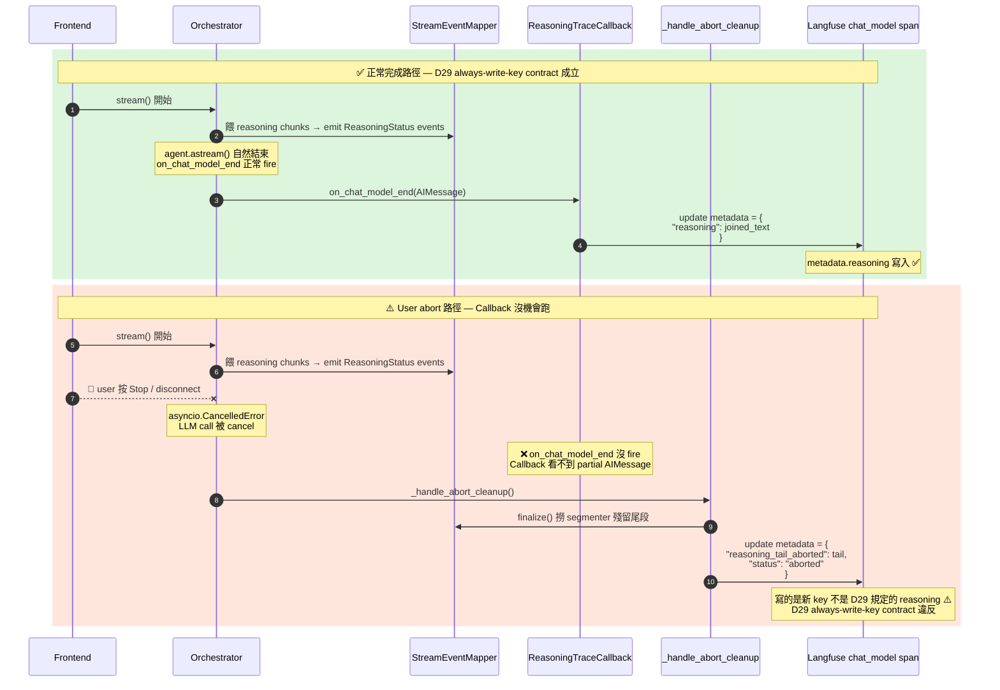
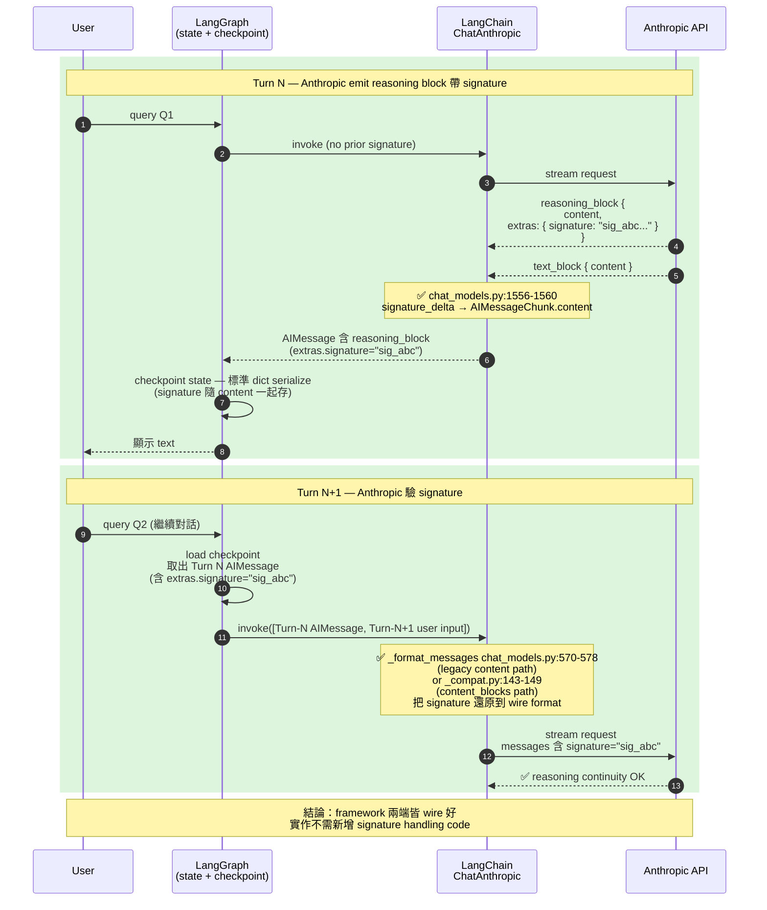
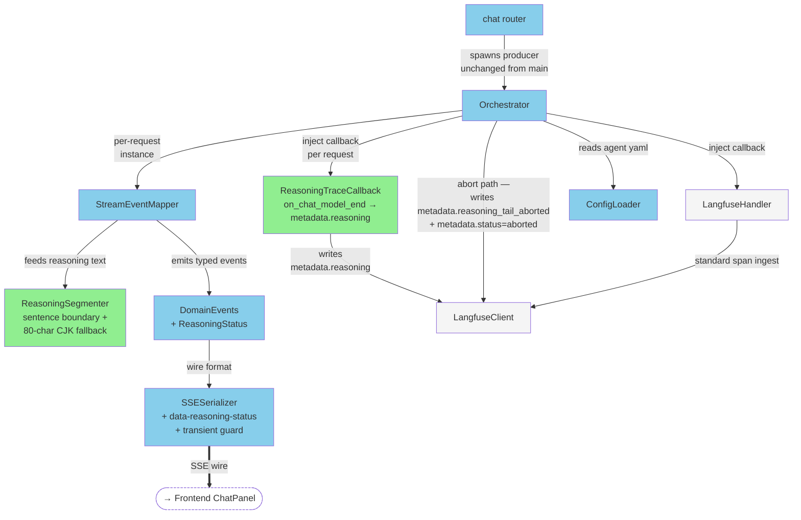
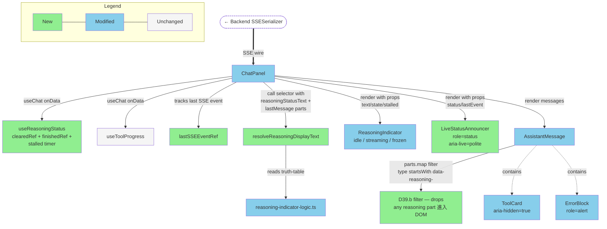

# Briefing: Multi-Provider Streaming with Reasoning Status

> Sources: [`implementation.md`](./implementation.md) · [`bdd-scenarios.md`](./bdd-scenarios.md) · [`verification-plan.md`](./verification-plan.md) · [`design.md`](./design.md)
> Generated: 2026-05-01

---

## 1. Design Delta

> ⚠️ 以下有 1 項發現需要回到 design 階段補充，建議先處理再繼續檢閱。

> ID 速查（避免讀到一半要去翻 source doc）:
> - **D-numbers** = `design.md` 的 design decision row（例：D29 = Langfuse metadata.reasoning schema、D35 = user-abort backend protocol）
> - **F-numbers** = functional requirements（例：F6 = 每個 thinking moment 都要有 reasoning status）
> - **R-numbers** = risk rows（例：R2 = Gemini thoughtSignature multi-round 風險）
> - **Task N** = `implementation.md` 的 task 編號（1–16；例：Task 6 = wire callback + finalize + abort cleanup 進 Orchestrator）
> - **S-xxx-NN** = `bdd-scenarios.md` 的 illustrative scenario（例：S-trace-06 = user abort 後 trace metadata 行為）
> - **J-xxx-NN** = `bdd-scenarios.md` 的 journey scenario（end-to-end flow；例：J-stream-01 = 6-case matrix E2E lifecycle）
>
> 以下每筆 finding 第一次出現的 ID 都會內嵌一句 gloss，後續出現以 ID 當交叉引用即可。

### 需補充 design

#### Abort cleanup 寫一個新的 `metadata.reasoning_tail_aborted` key，破壞了 `metadata.reasoning` 的 always-write-key contract

> 牽涉到的 design decisions:
> - **D29**：Langfuse `metadata.reasoning` schema contract — 規定 `metadata.reasoning` key 永遠存在於每個 chat_model span，value 有 5 種狀態（內容字串 / `""` empty / `"<unsupported>"` sentinel / 500KB truncate marker / 截斷後字串）
> - **D35**：user abort backend protocol — 規定 abort 觸發時 backend 必須 cancel `agent.astream` + cancel in-flight LLM API + 呼叫 `mapper.finalize()` 把 segmenter 殘留 emit 出來 + 在 `agent.run` root span 寫 `metadata.status="aborted"`

- **Design 原文**: D35 step (3) 要求 abort 觸發時呼叫 `mapper.finalize()`，把 segmenter 殘留尾段 emit 為 `ReasoningStatus` event，流向 `ReasoningTraceCallback`（負責把每個 LLM call 的 reasoning 寫進 Langfuse span metadata 的 callback）路徑，寫進 Langfuse trace metadata。D29 同時規定 `metadata.reasoning` key 永遠存在於每個 chat_model span。
- **實際情況**: 實作計畫的 **Task 6**（負責把 `ReasoningTraceCallback`、`mapper.finalize()`、abort cleanup 三件事 wire 進 Orchestrator 的 task）的 Approach Decision 明確指出：abort 觸發時 LangChain 的 `on_chat_model_end` callback 可能根本沒 fire（LLM call 被 cancel 掉了），`ReasoningTraceCallback` 看不到 partial `AIMessage`，因此 `metadata.reasoning` 不會被寫入；implementation 改成在 `_handle_abort_cleanup` 直接呼叫 `update_current_observation(metadata={"reasoning_tail_aborted": ...})`，**用一個跟 D29 schema 不同的新 key**。
- **影響**:
  1. 新增 `metadata.reasoning_tail_aborted` key 不在 D29 schema 表內，operator query contract 需要新增一行
  2. 對應的驗證 scenario **S-trace-06**（驗證 user abort 後 trace 應同時帶 `metadata.status="aborted"` 與 segmenter 殘留尾段的 illustrative scenario）的 verifier assertion 改抓 `reasoning_tail_aborted` 而非 `reasoning`，這對應到實作計畫 **Task 14**（acceptance matrix runner + Langfuse trace verifier helper 的 task）的 cross-reference 表
  3. abort 情境下該 chat_model span 的 `metadata.reasoning` 不會被寫（因為 `on_chat_model_end` 沒 fire），跟原 D29 的「key 永遠存在」假設不一致 — 需要把 schema 升級成 mode-aware 才能涵蓋
- **Resolution**: 需補充 design — 把 `reasoning_tail_aborted` 跟 `status` 兩個 key 補進 **D29 schema 表的單一 contract**，每個 key 標示對應的「必填 / optional / 視 mode」語意。原本 D29「key 永遠存在」的承諾改寫成 mode-aware contract：
  - **`metadata.reasoning`** — 完成路徑必填（5 種 value 狀態）；**aborted 路徑 optional**（可缺）
  - **`metadata.reasoning_tail_aborted`** — 僅 aborted 路徑寫入（segmenter 殘留尾段）；其他路徑不存在
  - **`metadata.status`** — 僅 aborted 路徑寫在 `agent.run` root span（值 `"aborted"`）；其他路徑不存在
  
  這樣 abort 跟 completed 兩種路徑一起被 D29 涵蓋，不再有「ad-hoc 新 key」感覺，operator query 也只需查 D29 一處就找得到所有可能 key 的語意。

**正常完成流程 vs user abort 流程的對比**（為什麼 abort 沒辦法走 ReasoningTraceCallback）：



**重點**:
- 正常路徑：reasoning text 走 `ReasoningTraceCallback.on_chat_model_end` → 寫 `metadata.reasoning`（D29 規定的 key）
- Abort 路徑：LLM call 被 cancel 後 `on_chat_model_end` 不會 fire，Callback 完全沒機會執行，所以 `_handle_abort_cleanup` 直接呼叫 Langfuse API 寫一個**不同名**的 key `metadata.reasoning_tail_aborted`
- 結果：abort 情境下，該 chat_model span 上 `metadata.reasoning` 是「key 不存在」狀態 — 違反 D29 「key 永遠存在」的 schema contract
- Operator 想查詢 abort 情境的 partial reasoning 必須改抓 `reasoning_tail_aborted` 這個新欄位
- 修正方向：把三個 key（`reasoning` / `reasoning_tail_aborted` / `status`）統一寫進 D29 schema，各自標 optional / required / 視 mode 語意，原本「always-write」改寫成「mode-aware required」

### 已解決

#### Anthropic reasoning `extras.signature` round-trip — 已查 LangChain source 確認 framework 自動處理

> 牽涉到的 design decisions:
> - Design Non-Goals line 41：聲明「不主動處理 signature round-trip — 仰賴 LangChain + LangGraph 框架」
> - **D26**：segmenter sentence boundary + 80-char CJK fallback；周邊指向 LangChain `content_blocks` 為 reasoning 唯一 source of truth
> - **R2**：risk row — Gemini `thoughtSignature` 多輪 round-trip 仰賴 LangChain + LangGraph 自動處理

- **Design 原文**: design §11 References 與 D26 周邊指向 LangChain `content_blocks` 為 source of truth；Non-Goals line 41 聲明不主動處理 signature round-trip。
- **實際情況**: 實作計畫的 **Task 3**（StreamEventMapper 切到 `chunk.content_blocks` + reasoning dispatch + finalize 的 task）跟 **Task 4**（ReasoningTraceCallback 實作 task）都直接用 `block.get("reasoning", "")` 取 reasoning text，不讀 `extras.signature`，不做任何 round-trip 處理。
- **驗證結果**: 已查 `langchain-anthropic` 主分支 source code 確認 framework **自動處理**了三條 round-trip 路徑（要求 `langchain-anthropic >= 0.3.x`，本期使用 `>= 0.4.0` 滿足）：
  1. **Inbound (streaming)** — `chat_models.py:1556-1560` 把 `signature_delta` event 合併進 thinking block 存到 `AIMessageChunk.content`
  2. **Outbound (legacy `content` list-of-dicts)** — `_format_messages` `chat_models.py:570-578` 在 reformat 上一輪 AIMessage 時明確保留 `signature` 欄位
  3. **Outbound (v1 `content_blocks` standard format)** — `_compat.py:143-149` 把 standardized `extras.signature` 還原到 Anthropic wire format 的 `thinking.signature`
- **影響**: LangGraph checkpointer 不需任何特別處理 — `AIMessage.content` 是 plain dict list，serialize / deserialize 自動帶回 signature。標準用法（`ChatAnthropic` + `MessagesState` + LangGraph checkpointer）零 custom code 即正確 round-trip。**唯一 caveat**：若 codebase 手動 construct `AIMessage` for replay（不從 model 來），需自行確保 thinking block 含 `signature`（content path）或 reasoning block 含 `extras.signature`（content_blocks path）— 本期沒有此 manual replay 情境。
- **Resolution**: 已解決 — framework 行為已驗證，implementation 不需新增程式碼；建議在 design Risk 表加一筆對應 R2 的 Anthropic note（標明已 verified by source）；6-case matrix 仍跑 Anthropic multi-round case 作 regression guard，但不再是 unknown risk。

**Signature round-trip 跨兩 turn 的流向**（驗證後結果為兩端皆有 framework 程式碼支撐）：



**重點**:
- Anthropic reasoning block 帶 `extras.signature`（類似 Gemini `thoughtSignature`），下一輪請求要原樣帶回，model 才認得「這段 reasoning 是我之前思考的」
- 已透過 source code review 確認 `langchain-anthropic >= 0.3.x` 在 inbound（streaming aggregation）跟 outbound（next-turn message format）兩端都正確處理 signature；LangGraph checkpointer 因為只是序列化標準 dict，自動順帶
- 從原本「需確認」status 升級為「已解決」 — 6-case acceptance matrix 仍跑 Anthropic multi-round 作 regression，但不再是未知風險

#### Idle-text fallback 從 hook 移到 pure selector

> 牽涉到的 design decisions:
> - **D15**：post-tool idle indicator — State 1 維持 3-dot；post-tool gap 用 Variant A 視覺 + context-aware 英文 idle text（"Synthesizing" / "Thinking"）
> - **F6**：functional requirement — 每個 thinking moment 都要有 reasoning status（pre-tool-selection、post-tool-result-synthesizing 都要顯示）

- **Design 原文**: design §4.2 line 359 — 「`useReasoningStatus` 需要在偵測到「last part 是 completed tool 且 reasoningStatusText null」時，自動 set `reasoningStatusText` 為 idle text」。§7.4 同樣指明「`useReasoningStatus` 加 idle-text fallback 邏輯」。
- **實際情況**: 實作計畫的 **Task 9**（新增 `resolveReasoningDisplayText` selector for post-tool idle text 的 task）改採 pure selector `resolveReasoningDisplayText` 放在 `lib/reasoning-indicator-logic.ts`，由 `ChatPanel` render site 呼叫；**Task 7**（`useReasoningStatus` hook + 兩個 race guard refs 的 task）維持 hook 為純 SSE 訂閱者，不感知 message 形狀。
- **影響**: hook 切面更乾淨（測試不需 mock `lastMessage`），但 `shouldShowReasoningIndicator` 跟 `resolveReasoningDisplayText` 兩個 function 同時依賴 last-part 邏輯，需保證一致。
- **Resolution**: 已解決 — 兩種放法都能滿足 F6 spirit，pure selector 設計更乾淨且與 `frontend-test-writing` skill 一致；不影響 D15 對外行為契約。

#### `mapper.finalize()` return type 從 `Iterator` 改成 `list`

> 牽涉到的 design decision:
> - **D34**：stream-loop finalize — `StreamEventMapper` 加 `finalize()` method，主 stream loop 在 `agent.astream()` 結束後呼叫一次，把 buffer 內未斷句尾段 emit 為 `ReasoningStatus`

- **Design 原文**: design §4.1 line 101 — 「新增 `finalize() → Iterator[DomainEvent]` method」。
- **實際情況**: 實作計畫的 **Task 3**（StreamEventMapper rewire task）的 Critical Contract 簽章為 `def finalize(self) -> list[DomainEvent]`；**Task 6**（Orchestrator wiring + abort cleanup task）也假設可重入 iterate（list 才安全）。
- **影響**: 行為等價，呼叫端都是 `for event in ...` 消費。Finalize 只 emit 1–3 個 events，記憶體差異不顯著。
- **Resolution**: 已解決 — design 的 `Iterator` 是 informal pseudo-code，functional contract 不變。

---

## 2. Overview

本次修掉 streaming pipeline 對多 provider 的 list-of-blocks bug、把 v1–v5 五個 agent 統一切到 `google_genai:gemini-2.5-flash`、並新增 reasoning ephemeral UX（`data-reasoning-status` transient SSE event + Variant A reasoning indicator）配合 Langfuse `metadata.reasoning` per chat_model span 持久化，共拆為 15 個 task（原規劃 16 個，Task 13 backend keepalive + first-chunk timeout 移出 scope；編號保留 gap）。

最大風險集中在兩處：
1. **Langfuse `metadata.reasoning` schema 需擴充涵蓋 abort 路徑** — 見 Section 1 design delta 第一筆 finding（D29 schema 要從「always-write-key」升級為 mode-aware contract，補進 `reasoning_tail_aborted` + `status` 兩 key 與 optional 語意）
2. **6-case provider × reasoning-mode acceptance matrix 是否能全綠** — 由 `bdd-scenarios.md` 的 journey scenario **J-stream-01**（完整 6-case matrix E2E lifecycle，3 providers × 2 reasoning modes）所定義的硬性 ship gate

---

## 3. File Impact

### Folder Tree

```
backend/
├── agent_engine/
│   ├── streaming/
│   │   ├── domain_events_schema.py         (modified — + ReasoningStatus event)
│   │   ├── event_mapper.py                 (modified — content_blocks rewire + segmenter + finalize)
│   │   ├── reasoning_segmenter.py          (new — sentence-boundary + 80-char CJK fallback)
│   │   ├── reasoning_trace_callback.py     (new — on_chat_model_end → metadata.reasoning)
│   │   └── sse_serializer.py               (modified — + data-reasoning-status + transient guard)
│   ├── agents/
│   │   ├── base.py                         (modified — inject callback + abort cleanup)
│   │   ├── config_loader.py                (modified — + reasoning + thinking_budget fields)
│   │   ├── versions/v{1..5}/orchestrator_config.yaml  (modified — Gemini 2.5 Flash binding)
│   │   └── utils/model_context_registry.yaml          (modified — + Gemini context window)
│   └── api/
│       └── main.py                         (modified — Orchestrator wiring)
│       (NOTE: routers/chat.py 不改 — keepalive / timeout 移出 scope)
├── tests/
│   ├── streaming/
│   │   ├── test_reasoning_segmenter.py                       (new)
│   │   ├── test_reasoning_trace_callback.py                  (new)
│   │   ├── test_event_mapper_reasoning_integration.py        (new — Anthropic / OpenAI / Gemini)
│   │   ├── test_orchestrator_invoke_reasoning_path.py        (new — S-stream-05)
│   │   ├── test_event_mapper.py                              (modified)
│   │   ├── test_sse_serializer.py                            (modified)
│   │   └── test_domain_events_schema.py                      (modified)
│   └── scripts/test_verify_langfuse_trace.py                 (new — verifier helper)
├── pyproject.toml                          (modified — + langchain-google-genai, langchain-anthropic)
└── scripts/validation/
    └── verify_langfuse_trace.py            (new — D29/D35 schema verifier
                                                  **operator CLI tool**，不是純 test helper；
                                                  primary use 是 BDD verification 跑完後讓
                                                  operator 對 real Langfuse trace 跑 schema check；
                                                  跟既有 validate_sec_eval_dataset.py 同類；
                                                  test_verify_langfuse_trace.py 用 mock import 它的
                                                  parsing functions 做 unit test，是次要 use case)

frontend/
├── src/
│   ├── hooks/
│   │   ├── useReasoningStatus.ts                                       (new — clearedRef + finishedRef + stalled)
│   │   └── __tests__/useReasoningStatus.test.ts                        (new)
│   ├── components/
│   │   ├── atoms/
│   │   │   ├── ReasoningIndicator.tsx                                  (modified — 3 modes,
│   │   │   │                                                                pure props-only,
│   │   │   │                                                                仍是 atom)
│   │   │   ├── LiveStatusAnnouncer.tsx                                 (new — ARIA hybrid)
│   │   │   └── __tests__/{ReasoningIndicator,LiveStatusAnnouncer}.test.tsx  (new)
│   │   ├── organisms/
│   │   │   ├── AssistantMessage.tsx                                    (modified — D39.b filter)
│   │   │   ├── ToolCard.tsx                                            (modified — aria-hidden)
│   │   │   ├── ErrorBlock.tsx                                          (modified — role="alert")
│   │   │   └── __tests__/AssistantMessage.test.tsx                     (new — filter test)
│   │   ├── pages/ChatPanel.tsx                                         (modified — wire hooks + announcer)
│   │   └── pages/__tests__/ChatPanel.integration.test.tsx              (modified — abort-then-resend)
│   ├── lib/
│   │   ├── reasoning-indicator-logic.ts                                (modified — + resolveReasoningDisplayText)
│   │   └── __tests__/reasoning-indicator-logic.test.ts                 (modified)
│   └── index.css                                                       (modified — Variant A + .sr-only)
├── tests/e2e/critical/
│   ├── multi-provider-matrix.spec.ts                                   (new — J-stream-01,
│   │                                                                       @critical tag)
│   └── fixtures/agent-capability/                                      (new — 6 yaml fragments
│                                                                           餵給 matrix spec)
└── playwright.config.ts                                                (modified — video on)
```

> **腳本歸屬調整說明**（為什麼不開 `scripts/bdd/`）:
> 既有 `scripts/` 是放 utility CLI（如 `embed_sec_filings.py`、`refresh_model_context_registry.py`），永久 guardrail 都在 `tests/`。原計畫的 `scripts/bdd/` 不符合慣例，按以下拆分原則歸屬：
>
> | 原計畫 | 新位置 | 理由 |
> | ------ | ------ | ---- |
> | `run_acceptance_matrix.sh`（matrix runner wrapper） | **刪除** — 直接記在 `verification-plan.md` 的 J-stream-01 步驟裡：`npx playwright test tests/e2e/critical/multi-provider-matrix.spec.ts --grep @critical` | wrapper 是 thin shell，沒必要 commit；命令 inline 在 verification-plan 裡更直接 |
> | `multi-provider-matrix.spec.ts`（Playwright spec） | `frontend/tests/e2e/critical/multi-provider-matrix.spec.ts` | 永久 P0 guardrail，每個 PR 都要跑，符合 `@critical` tag intent |
> | `agent_capability_overrides/*.yaml`（6 fixtures） | `frontend/tests/e2e/critical/fixtures/agent-capability/` | matrix spec 的測試 fixture，跟 spec 同 colocated |
> | `verify_langfuse_trace.py`（schema verifier CLI） | `backend/scripts/validation/verify_langfuse_trace.py` | reusable operator helper，跟既有 `validate_sec_eval_dataset.py` 同類；同時被 `backend/tests/scripts/test_verify_langfuse_trace.py` import 做 unit test |
> | `browser_use/s-*.sh, j-*.sh`（Browser-Use 視覺 lifecycle 腳本） | **刪除腳本檔** — bash 命令直接 inline 寫在 `verification-plan.md` 對應 scenario 步驟 | 這些是一次性 operator-driven 視覺驗證（要 real LLM key、產生 video 給 reviewer 看），不是 CI 自動化 guardrail，不需要 commit 進 repo |
> | `README.md`（operator guide + dev flags 說明） | **刪除** — 內容併入 `verification-plan.md` operator 章節 | 避免雙頭文件 drift；verification-plan.md 是 operator 跑驗證時讀的檔，把流程跟 dev flags 放同一處 |

### Dependency Flow

#### Backend



#### Frontend



---

## 4. Task 清單

| Task | 做什麼                                                                                                                                                                                  | 為什麼                                                                                                                                                                                      |
| ---- | ------------------------------------------------------------------------------------------------------------------------------------------------------------------------------------ | ---------------------------------------------------------------------------------------------------------------------------------------------------------------------------------------- |
| 1    | 加 `ReasoningStatus` domain event 與 `data-reasoning-status` SSE serializer + transient guard                                                                                          | 把 wire-format contract 先落地，下游 mapper / callback 才能引用                                                                                                                                     |
| 2    | 實作 `ReasoningSegmenter`（sentence boundary + 80-char CJK fallback）                                                                                                                    | Backend 處理 sentence segmentation，frontend 不該塞語言邏輯；解決 Gemini 繁中無 `。` 問題                                                                                                                   |
| 3    | `StreamEventMapper` 切到 `chunk.content_blocks` + reasoning dispatch + `finalize()`                                                                                                    | 修核心 streaming bug 並把 reasoning block 接進 segmenter；hold-and-flush 保證 final reasoning 不丟                                                                                                   |
| 4    | 新增 `ReasoningTraceCallback`（per-LLM-call Langfuse metadata）                                                                                                                          | D4 / D29 — 把每 chat_model call 的 reasoning 寫到 span `metadata.reasoning`，completed-path always-write-key + sentinel + 500KB cap（D29 mode-aware schema 的 completed-path 部分；abort-path 由 Task 6 寫 reasoning_tail_aborted）                                                                           |
| 5    | 把 v1–v5 切到 `google_genai:gemini-2.5-flash` 並擴充 `ModelConfig`                                                                                                                         | F1 / D24 admin-configured provider binding；reasoning capability 同時驅動 thinking budget + callback sentinel + matrix 篩選                                                                     |
| 6    | Wire callback + `mapper.finalize()` + abort cleanup 進 `Orchestrator`                                                                                                                 | F4 / F7 / F8 — invoke / stream 兩條路徑都要 reasoning trace；abort 觸發 D35 cleanup 寫 `reasoning_tail_aborted` 與 `status="aborted"`                                                               |
| 7    | `useReasoningStatus` hook（clearedRef + finishedRef 兩個 race guard）                                                                                                                    | D31 — 防 clear 200ms drain race 跟 finish 後 ghost re-appear                                                                                                                                |
| 8    | 改寫 `ReasoningIndicator` 支援 idle / streaming / frozen 三模式 + Variant A CSS                                                                                                             | D5 / D17 / D21 — vertical-slot alignment 確保 State 1↔2 切換無垂直跳動；hard-clip 處理長 sentence overflow                                                                                            |
| 9    | 新增 `resolveReasoningDisplayText` selector（post-tool idle text "Synthesizing"）                                                                                                        | D15 §7.4 補 reasoning-off + tool flow 的 3–7 秒空窗；以 pure selector 隔離 hook 與 message shape                                                                                                   |
| 10   | `LiveStatusAnnouncer` ARIA hybrid + 視覺元件 `aria-hidden="true"`                                                                                                                        | D22 — screen reader 收 transition-level status，不被逐句 reasoning 污染 polite queue                                                                                                             |
| 11   | Wire `ChatPanel` 整合所有 hook + `AssistantMessage` `data-reasoning-*` filter                                                                                                            | 組起前端整體；D39.b belt-and-suspenders 即使 backend transient flag 出 bug 也不洩漏                                                                                                                    |
| 12   | 加 stalled modifier 偵測（10s 無 reasoning chunk 切慢變淡）                                                                                                                                    | D14 frontend 部分提供「系統還活著」訊號；`setInterval` + `lastUpdateAt` ref。**注意**：Backend 端 D14 keepalive + D23 hung-provider timeout 已移出本期 scope（current main 沒有 timeout，不在此 PR 引入新 streaming infra） |
| 14   | 6-case matrix Playwright spec + Langfuse trace verifier CLI                                                                                                                          | J-stream-01 6-case ship gate 與 J-trace-01 trace tree 自動化（spec 走 `frontend/tests/e2e/critical/`，verifier CLI 走 `backend/scripts/validation/`）                                             |
| 15   | Backend dev-only feature flag handlers (6 flags) + Playwright specs for visual lifecycle scenarios | Visual lifecycle scenarios (S-rsn-* / S-chan-03 / S-rsn-06 / S-rsn-12 / J-rsn-02 / J-chan-01) 改用 Playwright tests + video recording — repeatable CI guardrail，commit 進 `frontend/tests/e2e/`。Backend dev flags 提供 stub injection 給 Playwright spec 用（不再仰賴 inline `browser-use`，那是 agent 做一次性探索才用的）                                                           |
| 16   | Pre-delivery README + lint / type 收尾                                                                                                                                                 | 維護單一資訊源；ship gate 前確認 baseline 乾淨                                                                                                                                                        |

> 原規劃 Task 13（Backend SSE keepalive + first-chunk-only timeout）已從 scope 移除 — 編號保留 gap，避免 Task 14/15/16 在 implementation.md 跨多檔的 cross-reference 大改。本期實際 deliverable 為 15 個 task（與 Section 2 Overview 一致）。

---

## 5. Behavior Verification

> 共 37 個 illustrative scenarios（S-*）+ 5 個 journey scenarios（J-*），涵蓋 5 個 features：Provider Streaming Pipeline、Reasoning Channel Isolation、Reasoning Indicator Lifecycle、Langfuse Reasoning Persistence、Cross-Feature Risk Mitigation。

### 5.1 During Implementation（按 Task 組織）

#### Task 1 — `ReasoningStatus` event + SSE serializer（`test_sse_serializer.py`, `test_domain_events_schema.py`）

> [!example]- **S-chan-01** — Streaming 期間 reasoning event 線上一律帶 `transient: true`，不會滲入 persistent type events
>
> - SSE wire 上 `data-reasoning-status` payload 有 `transient: true` flag
> - 沒有任何 reasoning sentence text 出現在 `text-*` / `tool-*` events
> - Source verification: serializer unit test (Task 1) + 跨步驟 integration via Playwright spec covering s-chan-01

> [!example]- **S-chan-04** — SSE serializer 偵測到 reasoning payload 缺 `transient: true` 時，dev/CI raise AssertionError，prod 改寫 warning log
>
> - Dev/CI: `pytest.raises(AssertionError)` with message "reasoning SSE event missing transient=True flag"
> - Prod: `APP_ENV=production` + caplog 含 warning 字串、無 raise
> - Source verification: `test_sse_serializer.py` assert + warn cases

#### Task 2 — `ReasoningSegmenter` unit（`test_reasoning_segmenter.py`）

> [!example]- **S-stream-09** (segmenter side) — 累積 110 個 CJK 字元無 `。` 時，80 字 fallback 觸發 soft-emit 整段 + reset buffer
>
> - feed("先看 10-K 結構並比對 Item 1A 跟 Item 7 找出 risk factors 變化包括新增加強刪去三類") 85 字無 terminator → yields 1 sentence
> - 餘下進新 buffer，下個 feed 從 0 累積
> - Source verification: segmenter unit (Task 2)
> - Additional depth: mapper integration via Task 3 + Playwright spec covering s-stream-09

#### Task 3 — `StreamEventMapper` content_blocks rewire（`test_event_mapper_reasoning_integration.py`）

> [!example]- **S-rsn-05** — Anthropic interleaved reasoning → text → reasoning 同 LLM call 內，event ordering 保持 `[ReasoningStatus(A), TextStart, TextDelta(1), ReasoningStatus(B), TextDelta(2)]`
>
> - 同 `id="msg-A"` chunks: `reasoning_A → text_1 → reasoning_B → text_2`
> - D28 hold-and-flush 保證 reasoning 在 text-start 之前 emit
> - Source verification: integration test 餵 fake `AIMessageChunk` 序列
> - Additional depth: Playwright spec covering s-rsn-05 用 real Anthropic Claude 4.x 視覺驗證

> [!example]- **S-rsn-10** — 最後一句 synthesizing reasoning 在 text-start event 之前抵達 frontend（D28 hold-and-flush）
>
> - `_handle_text_block` 開頭呼叫 `_flush_segmenter_into(events)` 確保 segmenter 殘留先 emit
> - SSE log 內 `data-reasoning-status` line index < 後續 `text-start` line index
> - Source verification: mapper unit test + Playwright spec covering s-rsn-10 slow-motion video

> [!example]- **S-trace-05** — Reasoning 是最後 block 自然 finish（model emit reasoning 後不 emit text/tool），`mapper.finalize()` 補洞確保尾段不丟
>
> - Mapper 結束呼叫 `_segmenter.flush()` 殘留 emit 為 `ReasoningStatus`
> - Langfuse `metadata.reasoning` 含完整尾段
> - Source verification: mapper unit `finalize()` test (Task 3)
> - Additional depth: `STUB_REASONING_ONLY=1` integration via Playwright spec covering s-trace-05

> [!example]- **S-trace-09** — Provider `content_blocks` 失敗（regression）時 reasoning emit 為 0，但其他 streaming 行為正常
>
> - Mapper dispatch loop 自然忽略無 reasoning block 的 chunk
> - `metadata.reasoning == ""`；text + tool events 照常 emit
> - Source verification: integration via `STUB_CONTENT_BLOCKS_NO_REASONING=<provider>` + Playwright spec covering s-trace-09

#### Task 4 — `ReasoningTraceCallback`（`test_reasoning_trace_callback.py`）

> [!example]- **S-trace-01** — Reasoning-on multi-call turn 對應 N 個獨立 chat_model spans，每個自帶 `metadata.reasoning`，parent `agent.run` 不含此 key
>
> - 1 個 `agent.run` parent + 3 個 `chat_model.invoke` children
> - 各 span `metadata.reasoning` 獨立、非 cumulative
> - Source verification: Backend E2E flow #2（real Gemini）+ Task 4 callback unit test

> [!example]- **S-trace-02** — `metadata.reasoning` schema 5 種狀態：實際內容 / `""` empty / `<unsupported>` sentinel / 500KB truncate marker
>
> - capability="on" + reasoning blocks → joined string
> - capability="on" + 無 reasoning blocks → `""`
> - capability="off" → `""`
> - capability="unsupported" → `"<unsupported>"`
> - > 500KB → 前 500KB + `... [truncated, original {N} bytes]`
> - Source verification: callback parametrized unit test (5 cases)

> [!example]- **S-trace-07** — Live UX SSE log 與 Langfuse `metadata.reasoning` 兩條路徑可接受微小 divergence，但 reasoning core 對齊
>
> - Substring match >= 50% 字元 or 高 text similarity
> - 兩者都不 empty（前提 segmenter buffer 在 abort 當下非空）
> - Source verification: callback unit + Task 3 mapper unit；UX 比對留 Browser-Use

#### Task 5 — Provider switch（`test_config_loader.py`, `test_orchestrator_init.py`）

> [!example]- **S-stream-01** — Default v3 agent 跑 D25 canonical SEC query，每個 chat_model span 走 `gemini-2.5-flash`、無 console / network error
>
> - Trace 內所有 chat_model span model field match `gemini-2.5-flash`
> - SSE log 無 `error` event
> - Source verification: Backend E2E flow #1（real Gemini）+ Task 5 yaml smoke

> [!example]- **S-stream-02** — Session 內從 v3 切到 v5 後新 turn 仍走 Gemini，前 3 turn 的 persisted `message.parts` 完整保留
>
> - 新 turn chat_model span model 仍為 `gemini-2.5-flash`
> - 前 3 turn assistant `parts`（text + tool）完整未污染
> - Source verification: Task 5 orchestrator init + flow #1

> [!example]- **S-stream-03** — 6-case acceptance matrix（3 providers × 2 modes）streaming 行為符合預期：reasoning-on rows ≥1 event、reasoning-off rows = 0
>
> - 6 rows: Gemini / OpenAI Responses / Anthropic × on / off
> - 每 chat_model span `metadata.reasoning` key 存在
> - Source verification: Task 14 acceptance matrix runner

#### Task 6 — Orchestrator wiring（`test_orchestrator_streaming.py`, `test_orchestrator_invoke_reasoning_path.py`）

> [!example]- **S-stream-05** — Non-streaming `Orchestrator.invoke` 路徑也產出 Langfuse reasoning trace，內容與 streaming path 等價
>
> - `_build_langfuse_config(mode="invoke")` 回傳 callbacks 含 `ReasoningTraceCallback`
> - 同一 prompt 的 streaming-path span 與 invoke-path span `metadata.reasoning` 語意對齊（substring match）
> - Source verification: `test_orchestrator_invoke_reasoning_path.py` (S-stream-05)

> [!example]- **S-stream-07** — 同 session 兩 tab 並發 streaming，各自 `traceId` 獨立，`metadata.reasoning` 內容無 cross-contamination
>
> - per-request `StreamEventMapper`（D33）+ contextvars 自動 isolated
> - Trace A `metadata.reasoning` 不含 Tab B 的 query 字眼
> - Source verification: D33 ctor docstring + concurrent Playwright spec covering s-stream-07

> [!example]- **S-stream-08** — Abort 後立即送新 query 同 session 仍可運作，前一 trace `metadata.status="aborted"` 新 trace 為 completed
>
> - 第 5 秒 click Stop → cleanup helper drain segmenter tail
> - 新 turn response coherent、無 stale state inherit
> - Source verification: `test_orchestrator_streaming.py` abort + Playwright spec covering s-stream-08

> [!example]- **S-trace-04** — Eval batch judge `gpt-5-mini` calls 對應的 chat_model spans 不含 `metadata.reasoning` key（不掛 callback）
>
> - Orchestrator wiring 跟 Braintrust eval runner 路徑分開
> - Judge spans metadata 內無 `reasoning` key；agent spans 有
> - Source verification: Orchestrator-only callback wiring（Task 6）+ Braintrust eval bypass test

> [!example]- **S-trace-06** — User abort 後 trace root span `metadata.status="aborted"`，in-flight chat_model span `metadata.reasoning_tail_aborted` 含 segmenter 殘留尾段
>
> - `_handle_abort_cleanup` drain `mapper.finalize()` reasoning events、寫 distinct key
> - Empty buffer case：只寫 status，不寫 tail key
> - Source verification: `test_orchestrator_streaming.py` abort cases + Task 14 verifier `--expect-aborted`

> [!example]- **S-trace-08** — 同 session 兩 tab 並發產生兩個獨立 traces，各自 `metadata.reasoning` 內容獨立、`session_id` / `user_id` 在 chat_model span 上正確繼承
>
> - D33 + D37 contextvars propagation
> - Langfuse API filter `session_id=$SESSION_ID` 撈得到 chat_model spans
> - Source verification: Backend E2E flow #3（POC ship gate）+ concurrent script

#### Task 7 — `useReasoningStatus` hook（`useReasoningStatus.test.ts`）

> [!example]- **S-rsn-11** — Click clear conversation 後，200ms in-flight buffered SSE events 不會重新填上 reasoning indicator（`clearedRef` guard）
>
> - `clearReasoningStatus()` 設 `clearedRef.current = true` + setText(null)
> - 後續 `data-reasoning-status` events 在 `handleData` 開頭被 ignore
> - `resetForNewTurn()` 重置 ref 才恢復
> - Source verification: hook unit test + Playwright spec covering s-rsn-11

> [!example]- **S-rsn-12** — Finish event 之後 late-arriving `data-reasoning-status` events 不重新出現（`finishedRef` guard）
>
> - `finish` / `error` event 設 `finishedRef.current = true`
> - Late event 被 hook ignore
> - Source verification: hook unit test + `EMIT_LATE_REASONING=1` + Playwright spec covering s-rsn-12

#### Task 8 — `ReasoningIndicator` 3 modes（`ReasoningIndicator.test.tsx`）

> [!example]- **S-rsn-01** — Multi-call turn 走過 State 1 → 2 → 3 → 4 → 5 → 6 → 7 → 8 標準 lifecycle，每 reasoning state 顯示 sentence + dots cycler
>
> - State 1 (3-dot idle) → State 2 (reasoning #1) → State 3 (tool running) → ... → State 8 (done)
> - Source verification: component unit test (3 modes) + Playwright spec covering s-rsn-01 10-state 截圖
> - Additional depth: Playwright spec covering j-rsn-01 slow-motion video reviewer hand-off

> [!example]- **S-rsn-02** — Pre-response idle 顯示 3-dot bouncing animation；State 1→2 切換無垂直跳動（vertical-slot alignment）
>
> - `.reasoning-status` 共用 container，dots 底部 = text 底部 y 座標對齊
> - 點直徑 0.4rem、container 高度 `calc(0.72rem * 1.5)`
> - Source verification: component unit (idle mode test) + Playwright spec covering s-rsn-02 image diff

> [!example]- **S-rsn-03** — Reasoning text 含 backticks / asterisks 字面顯示，不解析 markdown，HTML special chars escape 防 XSS
>
> - render `text="run \`list_sec_sections\` and **bold**"` → exact substring，無 `<code>` / `<strong>` element
> - Source verification: component unit test + Playwright spec covering s-rsn-03 DOM inspect

> [!example]- **S-rsn-04** — 600+ 字 CJK reasoning sentence 不破壞 layout：container 維持單行高度、超出邊緣 hard-clip 無 ellipsis、dots cycler 在 clip 邊界右側保持 visible
>
> - `.reasoning-status-text`: `overflow:hidden`, `white-space:nowrap`
> - 無 `…` 加註
> - Source verification: component class-presence test + Playwright spec covering s-rsn-04 視覺 + computed style

> [!example]- **S-rsn-08** — Abort 5 種 phase 對應 5 種 visible content：9a (pre-response)、9 (reasoning frozen)、9b (tool errored)、9c (text partial frozen)、9 (idle text frozen)
>
> - Frozen 視覺 opacity 0.65 + STOPPED label inline
> - Source verification: component frozen mode unit test + Playwright spec covering s-rsn-08 table-driven

#### Task 9 — `resolveReasoningDisplayText` selector（`reasoning-indicator-logic.test.ts`）

> [!example]- **S-rsn-07** — Reasoning-off agent 走 multi-tool flow 在 tool→text 之間 3-7s 空窗顯示 idle text "Synthesizing"
>
> - `reasoningStatusText=null` + `status=streaming` + last part 為 completed tool → `IDLE_SYNTHESIZING_TEXT`
> - "Thinking" 常數預留但本期不啟用
> - Source verification: selector unit test + Playwright spec covering s-rsn-07 2 cases

#### Task 10 — `LiveStatusAnnouncer`（`LiveStatusAnnouncer.test.tsx`）

> [!example]- **S-rsn-14** — Screen reader 收 transition-level status："Generating response" → "Calling list_sec_sections" → "Tool list_sec_sections completed" → "Response complete"；不逐句 announce reasoning
>
> - Reasoning text + idle text **不**進 announcer
> - `LiveStatusAnnouncer`: `role="status" aria-live="polite" .sr-only`
> - `ReasoningIndicator` / `ToolCard`: `aria-hidden="true"`
> - Source verification: component transition mapping unit test
> - Additional depth: manual VoiceOver listening test (User Acceptance)

#### Task 11 — `ChatPanel` 整合 + `AssistantMessage` D39.b filter

> [!example]- **S-chan-01** (frontend) — Reasoning streaming 期間 `message.parts` 找不到任何 reasoning sentence；stream 完成後 `parts` 僅 text + tool
>
> - Hook 永遠不寫 parts；`AssistantMessage` filter `data-reasoning-*`
> - Source verification: filter unit test + Playwright spec covering s-chan-01 mid-stream DOM polling

> [!example]- **S-chan-02** — Page reload 後從 backend rehydrate 的 transcript 不含 reasoning text；resume turn LangGraph state-replay 不發出 `data-reasoning-status`
>
> - Rehydrated parts 篩出無 `data-reasoning-` type
> - Resume turn 第一個 chat_model invoke 之前無 reasoning event
> - Source verification: backend SSE log + filter unit + Playwright spec covering s-chan-02

> [!example]- **S-chan-03** — Backend 因 bug 漏 `transient: true` 時，frontend filter 仍阻擋該 part 進入渲染（D39.b belt-and-suspenders）
>
> - `FORCE_REASONING_NON_TRANSIENT=1` 注入錯誤 → DOM 仍無 reasoning sentence
> - Source verification: `AssistantMessage.test.tsx` filter unit + Playwright spec covering s-chan-03

> [!example]- **S-rsn-09** — Stream error 發生時 ephemeral content（reasoning / idle text）一律隱藏 + ErrorBlock 顯示；mid-text-start phase partial text 保留可讀
>
> - 與 abort 不對稱：error 不留 frozen reasoning
> - Source verification: ChatPanel integration + Playwright spec covering s-rsn-09 3 phases

> [!example]- **S-rsn-13** — Abort 後立即送新 message，prior assistant bubble 凍住 + STOPPED label，新 turn 在下方並存 streaming
>
> - 兩個 `assistant-message` testid 同時 in DOM
> - Source verification: ChatPanel integration test (S-rsn-13) + Playwright spec covering s-rsn-13

#### Task 12 — Stalled modifier（`useReasoningStatus.test.ts` fake timers）

> [!example]- **S-rsn-06** — Reasoning 靜默 10 秒後 indicator 自動套 `.stalled` modifier：dots cycle 1.4s→2.5s + opacity 1.0→0.55，reasoning text 不變動，下個 chunk 抵達移除 modifier
>
> - `vi.useFakeTimers()` advance 11s → `stalled === true`；新 `handleData` 重置
> - 800ms ease transition
> - Source verification: hook fake-timer unit + Playwright spec covering s-rsn-06 視覺確認

#### Task 13 — 已移出 scope

> 原本 Task 13（Backend SSE keepalive + 30s first-chunk timeout）以及對應的 **S-stream-04 hung sub-case** 與 **S-stream-06 keepalive 場景**，本期已移出 scope。理由：current main `backend/api/routers/chat.py` 完全沒有 timeout / keepalive，這次 PR focus 在 reasoning streaming 本身，不變動既有 streaming infra。
>
> 相關影響：
> - `backend/api/routers/chat.py` 不修改
> - `test_chat_sse_keepalive.py` / `test_orchestrator_provider_hung_timeout.py` 不新增
> - S-stream-04 verification 縮回 pre-SSE-open + mid-stream 兩路（hung 子 case 拿掉）；hung case 行為等同 main：user 必須手動 Stop
> - S-stream-06 整個 scenario 拿掉
> - D14 long-silence UX 由 Task 12（frontend stalled modifier）獨立提供視覺訊號，不依賴 backend keepalive
> - D23 三路分流變兩路（pre-SSE-open / mid-stream），hung case 留作後續 PR

#### Task 14 — Acceptance matrix runner + Langfuse verifier

> [!example]- **S-trace-03** — 4 種 operator query 涵蓋對應 spans：`IS NOT NULL` / `length > 0` / `!= '<unsupported>'` / `LIKE '%[truncated%'`
>
> - Verifier helper 跑 4 query 各撈 spans 集合符合 D29 contract
> - Source verification: `verify_langfuse_trace.py --schema-check` operational

#### Backend E2E flows（real Gemini，跨 Task）

> [!example]- **S-cross-01** — POC 階段一輪 reasoning-on Gemini D25 prompt：每 chat_model span `metadata.reasoning` 落在自身（不在 parent agent.run），`session_id` / `user_id` 透過 contextvars propagate 到 chat_model spans，Langfuse API `session_id` filter 可撈到 chat_model spans
>
> - R5 ship gate：D29 + D37 callback ordering + contextvars propagation
> - Source verification: Backend E2E flow #3 (`/api/public/observations?sessionId=...`)

### 5.2 Post-Implementation Deferred Verifications

> 需 real backend / real provider / real Langfuse 才能跑的 scenarios，由 `bdd-e2e-loop` 在 coding 完成後執行。

#### 6-case acceptance matrix（J-stream-01 ship gate）

> [!abstract]- **J-stream-01** — 對 6 cases (Gemini / OpenAI / Anthropic × on/off) 各跑 D25 canonical prompt，每 case streaming 完成、reasoning-on ≥1 event / reasoning-off = 0、無 console / network error，產出 6 個可審查的 video
>
> - `cd frontend && npx playwright test tests/e2e/critical/multi-provider-matrix.spec.ts --grep @critical`
> - 每 row trace_id 經 `uv run python backend/scripts/validation/verify_langfuse_trace.py $TRACE_ID --expect-reasoning-{on/off}` 驗證
> - **Langfuse trace verifier 檢查項目**:
>   - Trace tree 結構：1 個 `agent.run` parent + ≥1 個 `chat_model.invoke` child spans
>   - Per chat_model span `metadata.reasoning` 符合 row 預期值（on→non-empty / off→`""` / unsupported→`<unsupported>` sentinel / >500KB→truncate marker）
>   - `session_id` / `user_id` 於所有子 span 正確繼承（D37 contextvars propagation）
>   - Parent agent.run span 不含 `metadata.reasoning` key（per S-trace-01 — reasoning 是 per-LLM-call 屬性）
> - Source verification: Task 14 Playwright spec + per-row video at `frontend/test-results/`

#### Visual lifecycle journey（Playwright specs + video）

> 改採 Playwright `frontend/tests/e2e/` 路徑（non-`@critical` tag 例如 `@regression` 或 visual-specific tag）— 取代原本的 inline `browser-use` 路徑。每個 journey 都用 Playwright `use.video: 'on'` 錄全程 video 給 reviewer 看，video 落到 `frontend/test-results/`。Backend stub 由 Task 15 的 dev-only feature flags 注入，不需 real LLM 也能跑出視覺。

> [!abstract]- **J-rsn-02** — Abort 中段然後 resend，prior bubble 顯示 frozen reasoning + STOPPED、新 bubble 完整跑完 lifecycle，兩 bubbles 並存於 chat list
>
> - 涵蓋 D17 abort sub-states + D32 message-list multi-bubble persistence
> - Source verification: Playwright spec at `frontend/tests/e2e/journeys/abort-then-resend.spec.ts` (or similar)，video record 全程供 reviewer 在 PR Review 時看

> [!abstract]- **J-chan-01** — 從 streaming → reload → new turn 完整 lifecycle，reasoning 永遠不洩漏到 `message.parts`
>
> - 4 階段檢查點：mid-stream / post-finish / reload / new turn
> - Source verification: Playwright spec at `frontend/tests/e2e/journeys/reasoning-channel-isolation.spec.ts`，video record 涵蓋 4 階段

#### Trace tree alignment

> [!abstract]- **J-trace-01** — Reasoning-on multi-call turn 在 Langfuse 上產生 §6.3 規格的 trace tree：1 trace `chat_request` → 1 `agent.run` → ≥3 `chat_model.invoke` 與 tool spans 交錯
>
> - Per chat_model span `metadata.reasoning` 符合 §6.2 schema
> - Trace-level `session_id` / `user_id` 在所有子 spans 都繼承
> - Source verification: Task 14 verifier + Backend E2E flow #2

### 5.3 User Acceptance Test（PR Review 時執行）

**J-stream-01 + J-rsn-01 — acceptance** 🖐️<br>
6 video × 不同 query 類型整體 streaming + reasoning UX 是否流暢、清晰、值得 ship。<br>
→ Reviewer 在 PR Review 時觀看 6 個 video，檢查：State 1↔2 切換無垂直跳動 / 多 reasoning sentence 切換平順 / stalled "系統還活著" 訊號 / Anthropic interleaved indicator re-entry 合理 / long-sentence overflow hard-clip 乾淨 / abort partial text + STOPPED 清楚

**J-trace-01 — acceptance** 🖐️<br>
Operator 從 Langfuse trace 上是否能查到該知道的 reasoning 資訊。<br>
→ Reviewer 在 Langfuse UI 用 `session_id` filter 撈 trace、點 chat_model span 確認 `metadata.reasoning` 顯示、跑 4 種 D29 operator query 語意

**S-rsn-14 (manual portion) — acceptance** 🖐️<br>
VoiceOver / NVDA / JAWS 實際聽感驗證 announcement 序列符合 D22 規格、reasoning text 不被逐句 announce。<br>
→ Reviewer 用 macOS VoiceOver (Cmd+F5) 聽完整 turn 的 audio output

---

## 6. Test Safety Net

### Guardrail（不需改的既有測試）

- **Existing streaming text + tool path** — `test_event_mapper.py` / `test_sse_serializer.py` 既有 cases (TextStart/Delta/End、ToolCall/Result/Error、Finish、usage_metadata aggregation) 仍須全綠，作為 mapper rewire 的 regression guard.
- **`useToolProgress` 流程** — 現有 hook + ChatPanel `useChat({ onData })` 既有 wiring 不被新增的 `useReasoningStatus` 影響；既有 ChatPanel.integration tests 持續保護 message rendering / tool card lifecycle / clear conversation.
- **Orchestrator 既有 invoke / streaming 主路徑** — `test_orchestrator_streaming.py` 既有 trace propagation / langfuse handler injection 測試保留，新增 case 疊加上去.

### 需調整的既有測試

| 影響區域 | 目前覆蓋 | 調整原因 |
|----------|----------|----------|
| `StreamEventMapper._handle_messages` | text / tool dispatch via `msg_chunk.content` raw string | 改 iterate `msg_chunk.content_blocks`，原本對 raw string 的 assertion 需改成 block-shape；新增 D27 boundary、D28 hold-and-flush、D34 finalize 路徑 |
| `shouldShowReasoningIndicator` | (status, lastMessage) 兩入參；display 規則只有 ready/error 分支 | 新增第 3 入參 `reasoningStatusText`；既有 fixtures 需補 `null` 值；新增 post-tool gap 分支需加測試 |
| `ChatPanel.integration` | 既有 message rendering / tool card / clear conversation | 加 reasoning indicator state-based 斷言、abort-then-resend 雙 bubble 並存（S-rsn-13）|
| `Orchestrator._build_langfuse_config` | callbacks list 只有 `[langfuse_handler]` | callback list 新增 `ReasoningTraceCallback`；既有 callback wiring 測試需 update assertion |
| `ModelConfig` schema | `name` + `temperature` | 新增 `reasoning: Literal["on","off","unsupported"]` + `thinking_budget: int \| None`；YAML loader 測試需新增 `extra="forbid"` regression case |

### 新增測試

- **Backend unit**：`ReasoningSegmenter`（sentence boundary + 80-char fallback + edge）、`ReasoningTraceCallback`（5 schema scenarios + 2 defensive + completed-path always-write-key contract — abort-path 由 Task 6 abort cleanup 寫 `reasoning_tail_aborted` + `status="aborted"` 涵蓋）、SSE `ReasoningStatus` serializer + missing-flag assert/warn、`StreamEventMapper` reasoning dispatch + chunk.id boundary + finalize.
- **Backend integration**：`test_event_mapper_reasoning_integration.py`（Anthropic interleave / OpenAI multi-summary / Gemini 80-char fallback 三 provider 流型）、`test_orchestrator_invoke_reasoning_path.py`（S-stream-05 invoke ↔ stream metadata 等價）、`test_orchestrator_streaming.py` 5 個 abort cleanup case.
- **Frontend RTL**：`useReasoningStatus`（6 clear triggers + 2 race guards + stalled fake timer）、`ReasoningIndicator`（3 modes + stalled + plain text + overflow class）、`LiveStatusAnnouncer`（6 transition mappings + ARIA structure）、`AssistantMessage` D39.b filter、`resolveReasoningDisplayText` 11 個 branch case.
- **E2E**：`frontend/tests/e2e/critical/multi-provider-matrix.spec.ts` (6-row matrix Playwright spec，`@critical` tag)、`backend/scripts/validation/verify_langfuse_trace.py` (D29 + D35 schema 驗證 CLI)、`frontend/tests/e2e/` 內各 visual lifecycle Playwright specs 搭配 5 個 backend dev-only feature flag 做 stub injection (S-rsn-* / S-chan-* / S-stream-* / S-trace-*) + Playwright `use.video: 'on'` 錄 video.

---

## 7. Environment / Config 變更

### 新增 runtime dependencies

| Package | Version | Purpose |
|---------|---------|---------|
| `langchain-google-genai` | `>=2.0.0` | `init_chat_model("google_genai:gemini-2.5-flash")` provider extra；reasoning 透過 `thinking_budget` 控制 |
| `langchain-anthropic` | `>=0.4.0` | Anthropic Claude 4.x extended thinking via `thinking={"type":"enabled","budget_tokens":N}` |

### Agent config schema 擴充

`backend/agent_engine/agents/config_loader.py` 的 `ModelConfig` 新增兩欄，並要求所有 5 個 `versions/v{1..5}/orchestrator_config.yaml` 統一改成：

> **`reasoning` 欄位是 codebase 自定的抽象層**：reasoning 是 provider native capability（Gemini `thinking_budget` / Anthropic `thinking={enabled}` / OpenAI Responses `reasoning.effort`），但每家 API 形狀不同。我們在 yaml 加 `reasoning: "on"|"off"|"unsupported"` 當統一抽象 — 這個值會餵給 (1) `ReasoningTraceCallback` 用以判定 capability（unsupported → 寫 `<unsupported>` sentinel）、(2) 6-case matrix runner 篩 reasoning-on / off rows、(3) `init_chat_model` 翻譯成 provider-specific 參數。可以 admin-config 開關，但底層仍仰賴 model 本身有支援 reasoning 才生效。
>
> **`thinking_budget` 預設 None** — v1–v5 agent 全部用 Gemini，`thinking_budget=None` + `reasoning="on"` 等於讓 Gemini 走 default thinking budget；`reasoning="off"` 時 implementation 強制傳 `0` 關閉 thinking。Anthropic provider 因 API 要求 `budget_tokens` 必填，若有 reasoning="on" 的 Anthropic agent 必須在 yaml 顯式給 thinking_budget — 這條路徑只在 6-case matrix fixture 用到（不在 default agent path），implementation 會在 None+Anthropic+on 時拋 ValueError 給 operator。

```yaml
model:
  name: "google_genai:gemini-2.5-flash"
  temperature: 0.0
  reasoning: "on"           # NEW — Literal["on","off","unsupported"], default "off"
  thinking_budget: null     # NEW — int | None；Gemini default 走 None；Anthropic+reasoning=on 必須顯式設值（≥1024）
```

`backend/agent_engine/utils/model_context_registry.yaml` 新增 `gemini-2.5-flash: { max_input_tokens: 1048576, source: google_official }`。

### Runtime env vars（既有）

- `GOOGLE_API_KEY` — Gemini provider；缺失時觸發 D23 pre-SSE-open 失敗路徑（HTTP 5xx）
- `ANTHROPIC_API_KEY`、`OPENAI_API_KEY` — 6-case matrix 必要
- `LANGFUSE_PUBLIC_KEY` / `LANGFUSE_SECRET_KEY` / `LANGFUSE_HOST` — 既有
- `APP_ENV` — `production` 時 SSE serializer 對 missing transient flag 改 warn log（dev/CI 仍 raise）

### Dev-only feature flags（Task 15 注入）

僅在 BDD Playwright specs 內透過 `frontend/playwright.config.ts` 或 spec 內 `process.env.X = '1'` 啟用，正式 deploy 不應設定：

- `FORCE_LLM_FAIL=1` — 第一個 LLM call raise（S-stream-04 mid-stream）
- ~~`STUB_LLM_HANG=1`~~ — 已隨 Task 13 移出 scope（hung sub-case 不驗）
- `FORCE_REASONING_NON_TRANSIENT=1` — serializer 故意漏 `transient: true`（S-chan-03）
- `EMIT_DELAYED_REASONING=1` — emit 第一個 reasoning chunk 後強制 backend silence ≥12s 才 emit 下一個（S-rsn-06 stalled 視覺）
- `EMIT_LATE_REASONING=1` — finish 後 100ms 多 emit 一個 reasoning event（S-rsn-12）
- `STUB_REASONING_ONLY=1` — emit reasoning 後直接 finish 不 emit text/tool（S-trace-05）
- `STUB_CONTENT_BLOCKS_NO_REASONING=<provider>` — 模擬 content_blocks regression（S-trace-09）

### Deployment / CI 影響

- Pre-push baseline（per memory `feedback_pre_push_mirror_ci.md`）：跑 `uv run ruff check`、`uv run pyright backend/agent_engine/{streaming,agents}`、`cd frontend && npm run format:check`、`tsc -b`、`vite build`、frontend `npm test`、backend `pytest -m "not integration and not eval and not sec_integration"`.
- Staging deployment：本期不需要為了 keepalive / hung-timeout 額外部署到 nginx 驗證（Task 13 已移出 scope）。
