# Briefing: near-v1 diagnostic evaluation pipeline

## 1. Design Delta

### 已解決

#### Langfuse export join 改為 deterministic `session_id`

- **Design 原文**: export / annotation join 應以 `row_id + run_label` 對齊，且「不能只靠 `experiment_name` 或 `session_id` 推斷」。
- **實際情況**: implementation planning 驗證 Langfuse scores export 可直接取得 `session_id`，因此改用 `"{dataset_name}::{run_label}::{row_id}"` 作為 join key，並從中 parse 出 identity。
- **影響**: export join 會依賴 deterministic `session_id` format；同時 `dataset_name`、`run_label`、`row_id` 仍會保留在 metadata 中供 UI 檢視與 sanity check。
- **Resolution**: 已解決 — deterministic `session_id = "{dataset_name}::{run_label}::{row_id}"` 是 v1 formal contract，不是任意依賴 Langfuse 平台生成的 session id。

#### Braintrust compare 改為 comparison key + lightweight compare guard

- **Design 原文**: 若兩個 experiment 的 row set 不同，summary 必須標記為 `overlap-only`，不能把不同 row distribution 的 aggregate 當成同質比較。
- **實際情況**: Braintrust official docs 說 experiment comparison 預設用 `input` matching rows，也可在 Project Settings 設 custom comparison key。implementation plan 因此改成要求 stable diagnostic comparison key，並新增 lightweight compare guard 產出 `same_row_set`、`overlap_only`、`dataset_version_drift`、`empty_intersection` 等 safety status。
- **影響**: Braintrust UI 負責 row-by-row comparison；compare guard 負責在 analyst 解讀前標示 run-to-run comparability，避免 full-vs-subset 或 cross-version aggregate 被誤讀。
- **Resolution**: 已解決 — 不重做 Braintrust compare UI，但實作最小 compare guard，並在 docs 中要求 Braintrust comparison key 使用 stable diagnostic identity。

#### 新增非品質型 execution-health scorer

- **Design 原文**: v1 不以 `LLM judge` 為主流程，不自動計算 overall quality score，也不對所有題目做 machine-based pass/fail judgment。
- **實際情況**: implementation plan 新增 deterministic code scorer；scope 收斂為 `execution_complete`、`tool_call_all_successful`、`tool_error_names`，不使用 LLM judge，也不讀 reference hints。
- **影響**: Braintrust 仍會出現一個自動 health score，但它只標示 execution / tool-call health；若 tool call 失敗但 agent 仍產生 final response，reviewer 可以先辨識這是 execution issue，而不是直接當成 answer quality 問題。
- **Resolution**: 已解決 — 保留單一 execution-health scorer，但它屬於 `diagnostic` bounded context，不是 nearV1 answer-quality scorer，也暫時不提升成 generic `backend/evals/scorers/` scorer。config path 應使用 `backend.evals.diagnostic.execution_scorer.execution_health`。

## 2. Overview

本次新增 `near_v1_diagnostic` evaluation pipeline，共拆為 7 個 implementation tasks。主要變更是讓 diagnostic dataset 可以用 slice 執行 near-v1，將 execution / compare identity 寫入 Braintrust，將 trace / reference metadata 寫入 Langfuse，把 Langfuse human annotation export join 回 discussion-ready CSV，並提供 lightweight compare guard 標示 run-to-run comparability。

`near_v1_diagnostic` 是第一個 consumer，但 `backend/evals/diagnostic/` 應作為 diagnostic-track shared package：裡面放未來 diagnostic datasets 可重用的 selector、identity、metadata、export join、compare guard、execution-health scorer。既有非 diagnostic scenarios 不應被迫 import 或採用這套 contract；root-level `backend/evals/` 則保留給 `eval_runner`、`eval_tasks`、`eval_spec_schema` 這類 high-level orchestration surface。最大風險是跨平台 identity contract 必須精準一致，尤其 deterministic `session_id`、Braintrust comparison key、Braintrust metadata、Langfuse trace metadata、annotation export join 之間只要任一處漂移，就會讓 reviewer 的人工標註、row-by-row compare、分析 CSV 無法可信對齊。

## 3. File Impact

### Folder Tree

```text
backend/
├── agent_engine/
│   └── agents/
│       └── base.py                                      (modified)
├── evals/
│   ├── diagnostic/
│   │   ├── __init__.py                                  (new — diagnostic-track shared package)
│   │   ├── annotation_export_joiner.py                  (new — join Langfuse scores export into discussion CSV)
│   │   ├── compare_guard.py                             (new — run-to-run compare safety guard)
│   │   ├── dataset_selector.py                          (new — deterministic diagnostic slice selection)
│   │   ├── execution_scorer.py                          (new — non-quality execution-health scorer)
│   │   ├── models.py                                    (new — run identity, slice identity, session id contracts)
│   │   ├── metadata_projector.py                        (new — Braintrust and Langfuse metadata projection)
│   │   └── run_manifest_writer.py                       (new — platform-mode run manifest writer)
│   ├── eval_runner.py                                   (modified)
│   ├── eval_spec_schema.py                              (modified)
│   ├── eval_tasks.py                                    (modified)
│   ├── README.md                                        (modified)
│   ├── ARCHITECTURE.md                                  (modified)
│   └── scenarios/
│       └── near_v1_diagnostic/
│           ├── dataset.csv                              (new — scenario-local diagnostic dataset)
│           ├── eval_spec.yaml                           (new — diagnostic scenario config)
│           └── README.md                                (new — operator and annotation workflow guide)
└── tests/
    ├── agents/
    │   └── test_orchestrator_langfuse.py                (modified)
    └── evals/
        ├── test_diagnostic_annotation_export_joiner.py  (new)
        ├── test_diagnostic_compare_guard.py             (new)
        ├── test_diagnostic_dataset_selector.py          (new)
        ├── test_diagnostic_metadata_projector.py        (new)
        ├── test_diagnostic_run_manifest_writer.py       (new)
        ├── test_eval_runner.py                          (modified)
        ├── test_eval_spec_schema.py                     (modified)
        ├── test_eval_tasks.py                           (modified)
        └── test_scorer_registry.py                      (modified if explicit scorer coverage is needed)
```

### Dependency Flow

```mermaid
graph TD
    EvalSpecYaml["near_v1_diagnostic/eval_spec.yaml"] -->|loads config| EvalSpecSchema["eval_spec_schema.py"]
    EvalSpecYaml -->|declares task| EvalTasks["eval_tasks.py"]
    EvalSpecYaml -->|declares scorer| ExecutionScorer["diagnostic/execution_scorer.py"]
    EvalRunner["eval_runner.py"] -->|parses config| EvalSpecSchema
    EvalRunner -->|reads rows| DatasetCsv["near_v1_diagnostic/dataset.csv"]
    EvalRunner -->|selects rows| DatasetSelector
    DatasetSelector["diagnostic/dataset_selector.py"] -->|reads raw rows| DatasetCsv
    DatasetSelector -->|returns slice identity| EvalModels["diagnostic/models.py"]
    EvalRunner -->|projects metadata| MetadataProjector
    MetadataProjector["diagnostic/metadata_projector.py"] -->|formats session id| EvalModels
    EvalRunner -->|runs task| EvalTasks
    EvalTasks -->|calls orchestrator| BaseAgent["agent_engine/agents/base.py"]
    EvalRunner -->|scores health| ExecutionScorer
    EvalRunner -->|writes manifest| ManifestWriter
    ManifestWriter["diagnostic/run_manifest_writer.py"] -->|serializes identity| EvalModels
    CompareGuard["diagnostic/compare_guard.py"] -->|reads run metadata| EvalModels
    ExportJoiner["diagnostic/annotation_export_joiner.py"] -->|parses session| EvalModels
    ExportJoiner -->|joins annotations| DatasetCsv

    style EvalSpecYaml fill:#90EE90
    style DatasetCsv fill:#90EE90
    style DatasetSelector fill:#90EE90
    style EvalModels fill:#90EE90
    style MetadataProjector fill:#90EE90
    style ManifestWriter fill:#90EE90
    style ExecutionScorer fill:#90EE90
    style CompareGuard fill:#90EE90
    style ExportJoiner fill:#90EE90
    style EvalRunner fill:#87CEEB
    style EvalSpecSchema fill:#87CEEB
    style EvalTasks fill:#87CEEB
    style BaseAgent fill:#87CEEB

    subgraph Legend
        N[New] --- M[Modified] --- U[Unchanged]
        style N fill:#90EE90
        style M fill:#87CEEB
        style U fill:#f5f5f5
    end
```



## 4. Task 清單

| Task | 做什麼 | 為什麼 |
|------|--------|--------|
| 1. Scenario Contract And Config Schema | 建立 `near_v1_diagnostic` scenario、`diagnostic` config block、scenario dataset / README，以及 `backend.evals.diagnostic.execution_scorer.execution_health`。 | 讓 scenario 成為 first-class eval scenario，並用 diagnostic bounded context 裡的最小 health signal 標出 execution / tool-call 問題。 |
| 2. Diagnostic Slice Selection | 實作 `full_dataset`、`row_ids`、`field_filter`、`manifest` 四種 deterministic row selection。 | 在執行前固定 row set 與 `slice_identity`，並保留 `row_id` 為 string，避免 CSV numeric coercion。 |
| 3. Identity And Langfuse Metadata Projection | 建立 Braintrust metadata、Langfuse trace metadata、deterministic session id 的單一投影來源，並擴充 `Orchestrator.astream_run()` 支援 extra trace metadata。 | 讓 Braintrust compare surface、Langfuse trace review、annotation export join 使用一致 identity。 |
| 4. Runner Integration And Diagnostic Task Execution | 將 slice selection、metadata projection、CLI flags、diagnostic task function 與 platform/local execution path 接進 `eval_runner`。 | 讓 diagnostic rows 可以被正確選取、執行一次、上傳 Braintrust / Langfuse，且不破壞既有 scenarios。 |
| 5. Langfuse Export Joiner | 實作本地 CLI / library，把 Langfuse scores export pivot 並 join 回原始 dataset。 | 產出 discussion-ready CSV，讓 `reference_*` 與 `observed_*` 並排檢視。 |
| 6. Diagnostic Compare Guard | 實作 lightweight compare guard，根據 run / slice metadata 輸出 `same_row_set`、`overlap_only`、`dataset_version_drift`、`empty_intersection`。 | Braintrust UI 做 row-by-row compare，但 diagnostic pipeline 需要額外標示 run-to-run comparability，避免 aggregate 被誤讀。 |
| 7. Documentation, Repo Checks, And Delivery Verification | 更新 eval docs、architecture docs、scenario README，並執行 final verification commands。 | 讓下一位 engineer 能找到 diagnostic human review track、Braintrust comparison key 設定、run / slice / export / compare guard commands。 |

## 5. Behavior Verification

> 共 47 個 illustrative scenarios（S-*）+ 7 個 journey scenarios（J-*），涵蓋 6 個 features；另有 3 個 Manual Behavior Tests 與 2 個 User Acceptance Tests 由 reviewer / user 在 PR Review 或實際平台上執行。

### 5.1 During Implementation（按 Task 組織）

#### Task 1 — Scenario Contract And Config Schema（schema / scorer contract）

> [!example]- **S-id-02** — 缺少 mandatory identity key 時，pipeline pre-flight abort 且不產生 Braintrust records 或 Langfuse traces
>
> - Input omission: `agent_version`
> - Expected outcome: `missing_identity_key=[agent_version]`，zero emissions
> - Source verification: verification-plan `S-id-02`（script）

> [!example]- **S-id-05** — 非 canonical `run_label` 會在 CLI input 階段被拒絕，且不進入 Braintrust duplicate detection
>
> - Trigger examples: `Baseline`、`baseline `、`exp,1`、fullwidth input
> - Expected outcome: `run_label_not_canonical`，不發出 Braintrust API call
> - Source verification: verification-plan `S-id-05`（script）

> [!example]- **S-id-08** — tool call 失敗但 final response 存在時，execution-health scorer 會標出 tool-call health issue
>
> - Trigger: agent 產生 final response，但其中一個 tool call 回傳 error
> - Expected outcome: `execution_complete=true`、`tool_call_all_successful=false`、`tool_error_names` 含失敗 tool；score 不讀 reference hints、不判斷答案品質
> - Source verification: verification-plan `S-id-08`（unit/integration test）

#### Task 2 — Diagnostic Slice Selection（selector determinism / fail-fast validation）

> [!example]- **S-slice-01** — stable dataset_version 的 full run 會選到全部 rows，重跑得到相同 `slice_hash`
>
> - Setup: dataset `v1.0` 有 30 rows
> - Expected outcome: 兩次都執行 30 rows，`slice_hash` 一致
> - Source verification: verification-plan `S-slice-01`（script）

> [!example]- **S-slice-02** — dataset_version bump 後 full run 會產生不同 `slice_hash`
>
> - Trigger: dataset 從 `v1.0` 30 rows 變成 `v1.1` 32 rows
> - Expected outcome: `slice_hash` 改變，run metadata 記錄 `dataset_version=v1.1`
> - Source verification: verification-plan `S-slice-02`（script）

> [!example]- **S-slice-03** — `row_ids` slice 只會執行指定 rows
>
> - Input: `slice_selector="3,7,12"`
> - Expected outcome: 只產生 rows 3、7、12 的 Braintrust records 與 Langfuse traces
> - Source verification: verification-plan `S-slice-03`（script）

> [!example]- **S-slice-04** — unknown `row_id` 會 pre-flight fail，且不留下 orphan traces
>
> - Input: `slice_selector="3,7,999"`
> - Expected outcome: `unknown_row_ids=[999]`，zero Braintrust records，zero Langfuse traces
> - Source verification: verification-plan `S-slice-04`（script）

> [!example]- **S-slice-05** — duplicate `row_id` list 會被拒絕
>
> - Input: `slice_selector="3,5,3,7"`
> - Expected outcome: `duplicate_row_ids=[3]`，zero emissions
> - Source verification: verification-plan `S-slice-05`（script）

> [!example]- **S-slice-06** — empty `row_ids` list 會被拒絕且不污染 `run_label` namespace
>
> - Input: `slice_type=row_ids`、`slice_selector=""`
> - Expected outcome: `empty_slice_forbidden`，same `run_label` 後續仍可用於 valid run
> - Source verification: verification-plan `S-slice-06`（script）

> [!example]- **S-slice-07** — stable dataset_version 上的 `field_filter` slice 會重現相同 row set 與 `slice_hash`
>
> - Input: `capability_band=boundary`
> - Expected outcome: 重跑後 `selected_row_ids` 與 `slice_hash` 一致
> - Source verification: verification-plan `S-slice-07`（script）

> [!example]- **S-slice-08** — zero-match `field_filter` 會被拒絕
>
> - Input: `capability_band=nonexistent`
> - Expected outcome: `empty_slice_forbidden`，zero Braintrust records
> - Source verification: verification-plan `S-slice-08`（script）

> [!example]- **S-slice-09** — manifest hash 依 parsed integer set 計算，不受 BOM / CRLF 影響
>
> - Setup: 同一組 ids 以 LF 與 UTF-8 BOM + CRLF 儲存
> - Expected outcome: 兩次都執行 rows 2、5、9、14、22，`slice_hash` 相同
> - Source verification: verification-plan `S-slice-09`（script）

> [!example]- **S-slice-10** — manifest unsupported syntax 會指出 line number
>
> - Trigger: manifest 包含 `3-7`
> - Expected outcome: `unsupported_manifest_syntax` 並指出該行；不建立 experiment
> - Source verification: verification-plan `S-slice-10`（script）

> [!example]- **S-slice-11** — manifest 引用 current dataset_version 不存在的 row 會 fail-fast
>
> - Trigger: manifest row 14 在 `v1.1` 已被移除
> - Expected outcome: `manifest_row_missing`，zero rows executed
> - Source verification: verification-plan `S-slice-11`（script）

> [!abstract]- **J-slice-01** — full run 與 subset rerun 會產生可區分且可重現的 `slice_identity`
>
> - Flow: full_dataset → row_ids 3,7,12 → same row_ids with new `run_label`
> - Expected outcome: full 與 subset `slice_hash` 不同；兩個 subset `slice_hash` 相同
> - Source verification: verification-plan `J-slice-01`（script）

#### Task 3 — Identity And Langfuse Metadata Projection（metadata / trace contract）

> [!example]- **S-id-01** — 每個 Braintrust case 都會記錄完整 identity keyset
>
> - Input: rows 7、12，`run_label`、`run_group`、`slice_label`、`agent_version` 明確指定
> - Expected outcome: 兩筆 Braintrust records 都有 8 個 identity keys 且值一致
> - Source verification: verification-plan `S-id-01`（script）

> [!example]- **S-ref-01** — Langfuse trace metadata 會包含 row identity 與全部 7 個 `reference_*` fields
>
> - Setup: row 12 有完整 reference source fields
> - Expected outcome: trace metadata 有 `row_id=12` 與所有 `reference_*` 值
> - Source verification: verification-plan `S-ref-01`（script + Langfuse SDK）

> [!example]- **S-ref-02** — sparse reference field 會以 null-present 表示，而不是省略 key
>
> - Setup: row 5 的 `secondary_failure_mechanism` 為空
> - Expected outcome: `reference_secondary_failure_mechanism` key 存在且值為 `null`
> - Source verification: verification-plan `S-ref-02`（script）

> [!example]- **S-ref-03** — `reference_*` 在第一個 LLM span 出現前就已存在於 trace root
>
> - Trigger: row 12 執行中，Reviewer 在 agent return 前打開 trace
> - Expected outcome: trace root 已有 7 個 `reference_*` 與 identity keys
> - Source verification: verification-plan `S-ref-03`（script）

> [!example]- **S-ref-04** — post-run dataset row edit 不會改變既有 trace 的 `reference_*`
>
> - Trigger: `expected_near_v1_behavior` 在 run 後被修改
> - Expected outcome: 既有 trace 仍保留 run time snapshot
> - Source verification: verification-plan `S-ref-04`（script）

> [!example]- **S-ref-05** — full run 開始後新增的 row 不會漏進 current run
>
> - Trigger: full run 執行到 row 10 時 append row 31
> - Expected outcome: current run 仍只執行原本 30 rows，`selected_row_ids` 不含 31
> - Source verification: verification-plan `S-ref-05`（script）

> [!example]- **S-ref-06** — mid-run row body edit 不會影響稍後才執行的同 row trace
>
> - Trigger: row 7 在 run start 後、row execution 前被修改
> - Expected outcome: trace 使用 run start snapshot value
> - Source verification: verification-plan `S-ref-06`（script）

> [!example]- **S-ref-07** — oversize reference metadata 會 pre-emit reject 而不是 silently truncate
>
> - Trigger: `expected_near_v1_behavior` 為 12 KB
> - Expected outcome: `metadata_size_exceeded`，沒有 partial trace
> - Source verification: verification-plan `S-ref-07`（script）

> [!abstract]- **J-ref-01** — Reviewer 在 Annotation Queue 打開 traces 時可以看到完整 reference context
>
> - Flow: 執行 rows 5、12，再查 Langfuse queue / traces
> - Expected outcome: row 5 有一個 null-present field，row 12 reference fields 全部 populated
> - Source verification: verification-plan `J-ref-01`（script + Langfuse SDK）
> - Additional depth: `MBT-ref-01` 會用真實 Langfuse UI 檢查可讀性

#### Task 4 — Runner Integration And Diagnostic Task Execution（CLI / Braintrust / Langfuse lifecycle）

> [!example]- **S-id-03** — 同一 row 用不同 `run_label` 會產生兩筆獨立 Braintrust records
>
> - Flow: row 7 先以 `baseline` 執行，再以 `after-fix` 執行
> - Expected outcome: records 只在 `run_label` 不同
> - Source verification: verification-plan `S-id-03`（script）

> [!example]- **S-id-04** — duplicate `run_label` 會在 Braintrust experiment boundary 被拒絕
>
> - Trigger: 另一台機器重用已完成 run 的 `run_label`
> - Expected outcome: `run_label_collision`，第二次 run 不產生新的 Langfuse trace
> - Source verification: verification-plan `S-id-04`（script）

> [!example]- **S-id-06** — Braintrust 與 Langfuse 指向不同 environment 時會 pre-flight reject
>
> - Trigger: `BRAINTRUST_API_KEY` 指向 prod，`LANGFUSE_HOST` 指向 staging
> - Expected outcome: `env_mismatch: braintrust=prod, langfuse=staging`，zero rows executed
> - Source verification: verification-plan `S-id-06`（script）

> [!example]- **S-id-07** — crashed prior run 的 `run_label` 不能被 silent reuse
>
> - Trigger: 前次 run 在 row 4 後 crash，再以 same `run_label` rerun
> - Expected outcome: `run_label_collision`，原 4-row stub 保留作為 audit
> - Source verification: verification-plan `S-id-07`（script）

> [!abstract]- **J-id-01** — 完整 run 會在 Braintrust 與 Langfuse emit 對齊的 identity
>
> - Flow: rows 3、7、12 以 fresh `run_label` 執行
> - Expected outcome: Braintrust records 與 Langfuse traces 以 `(row_id, run_label, dataset_version)` join 後剛好 3 pairs
> - Source verification: verification-plan `J-id-01`（script）

#### Task 5 — Langfuse Export Joiner（annotation / discussion CSV）

> [!example]- **S-ann-01** — Reviewer 可在 trace level 記錄 4 個 core `observed_*` fields，且 export 可取回
>
> - Fields: `observed_outcome`、`observed_alignment_to_prompt`、`review_confidence`、`review_comment`
> - Expected outcome: 4 個 named scores 都存在且值一致
> - Source verification: verification-plan `S-ann-01`（script）

> [!example]- **S-ann-02** — partial core annotation 會在 export 標為 incomplete
>
> - Trigger: 只填 `observed_outcome` 與 `review_comment`
> - Expected outcome: `annotation_incomplete=true`，`missing_fields` 列出缺少的 core fields
> - Source verification: verification-plan `S-ann-02`（script）

> [!example]- **S-ann-03** — optional primary mechanism 可單獨存在，secondary 可為 null
>
> - Trigger: 填完 4 個 core fields 後只填 `observed_primary_failure_mechanism`
> - Expected outcome: primary populated，secondary `null`，`annotation_incomplete=false`
> - Source verification: verification-plan `S-ann-03`（script）

> [!example]- **S-ann-04** — optional secondary mechanism 可在沒有 primary 的情況下存在
>
> - Trigger: 填完 4 個 core fields 後只填 `observed_secondary_failure_mechanism`
> - Expected outcome: 不出現 `secondary_without_primary` validation error
> - Source verification: verification-plan `S-ann-04`（script）

> [!example]- **S-ann-05** — revised annotation 會產出新的 timestamped export 並保留舊檔
>
> - Trigger: `observed_outcome` 從 `pass` 改成 `fail`
> - Expected outcome: 新檔案包含 revised value，舊檔案 untouched
> - Source verification: verification-plan `S-ann-05`（script）

> [!example]- **S-ann-06** — retracted annotation 和 never-set 不會被混為 pending
>
> - Trigger: 先填 core score 再刪除 `observed_outcome`
> - Expected outcome: `_annotation_status=retracted`，`observed_outcome=null`
> - Source verification: verification-plan `S-ann-06`（script）

> [!abstract]- **J-ann-01** — Reviewer 完成 trace-level annotation 後，export 會呈現 core + optional diagnostic round-trip
>
> - Flow: 填 4 core + primary mechanism + followup fields
> - Expected outcome: 6 個 submitted fields populated，未填 optional fields 為 `null`
> - Source verification: verification-plan `J-ann-01`（script + Langfuse SDK）

> [!example]- **S-join-01** — canonical 3-key join 會產生 exactly one matched pair
>
> - Join key: `(row_id, run_label, dataset_version)`
> - Expected outcome: row 7 在 output CSV 中剛好一列，identity keys present
> - Source verification: verification-plan `S-join-01`（script）

> [!example]- **S-join-02** — 同一 `row_id` 在兩個 dataset_versions 中會產生兩個獨立 matches
>
> - Trigger: row 7 分別在 `v1.0` 與 `v1.1` 執行 / export
> - Expected outcome: 合併 exports 後有兩列，依 `dataset_version` 區分
> - Source verification: verification-plan `S-join-02`（script）

> [!example]- **S-join-03** — Braintrust-only 或 Langfuse-only orphan state 會被 structured `_join_status` 呈現
>
> - Trigger: Braintrust write succeeded，但 Langfuse trace emit failed
> - Expected outcome: CSV row 不被 drop，`_join_status=langfuse_emit_failed`
> - Source verification: verification-plan `S-join-03`（script）

> [!example]- **S-join-04** — unannotated trace 會被標成 pending，且 `observed_*` 為空
>
> - Trigger: trace exists 但無人工 annotation scores
> - Expected outcome: `_annotation_status=pending`，7 個 `reference_*` populated
> - Source verification: verification-plan `S-join-04`（script）

> [!example]- **S-join-05** — reviewer observation 和 dataset reference 會並排保留，不互相覆寫
>
> - Setup: dataset reference primary mechanism 為 `stale_data`，reviewer observed primary 為 `overreach`
> - Expected outcome: `reference_primary_failure_mechanism` 與 `observed_primary_failure_mechanism` 各自保留
> - Source verification: verification-plan `S-join-05`（script）

> [!example]- **S-join-06** — blank observed field 不會 fallback copy reference value
>
> - Trigger: reviewer 填完 core fields 但不填 observed primary mechanism
> - Expected outcome: reference retained，observed empty/null
> - Source verification: verification-plan `S-join-06`（script）

> [!example]- **S-join-07** — zero-annotation export 會產生 worklist CSV，而不是 error
>
> - Setup: 30-row run，0 annotations
> - Expected outcome: 30 rows，`_annotation_status=pending`，header coverage `0/30`
> - Source verification: verification-plan `S-join-07`（script）

> [!example]- **S-join-08** — mid-annotation export 會呈現 point-in-time incomplete snapshot
>
> - Trigger: 只寫入 3 of 4 core fields 就 export
> - Expected outcome: `_annotation_status=incomplete`，3 fields populated，missing field 為 `null`
> - Source verification: verification-plan `S-join-08`（script）

> [!example]- **S-join-09** — revised annotation 的第二次 export 不會覆寫第一次 export
>
> - Trigger: 先 export，再 revision annotation，再 export
> - Expected outcome: `F1 != F2`，`F1` mtime unchanged，CLI prints revised rows diff summary
> - Source verification: verification-plan `S-join-09`（script）

> [!abstract]- **J-join-01** — Analyst 可產出含 reference + observed 的 full discussion CSV
>
> - Flow: 5-row run，4 rows annotated，1 row unannotated
> - Expected outcome: 4 rows 有 observed core + partial diagnostics，1 row pending，header coverage `4/5`
> - Source verification: verification-plan `J-join-01`（script）

> [!abstract]- **J-join-02** — 同一 row 的 `reference_*` 可以跨 runs 演化，但既有 export 不會被修改
>
> - Flow: row 5 先以 `expected_best_source=10-K` run，再改為 `10-Q` rerun
> - Expected outcome: run 1 export 保留 `10-K`，run 2 export 顯示 `10-Q`
> - Source verification: verification-plan `J-join-02`（script）

#### Task 6 — Diagnostic Compare Guard（run-to-run safety）

> [!example]- **S-cmp-01** — identical subsets on same dataset_version 會產生 clean summary，且不標 `overlap_only`
>
> - Trigger: run A 與 run B 都是 rows 1-5 on `v1.0`
> - Expected outcome: compare guard 輸出 5 rows、`same_row_set=true`、`overlap_only=false`
> - Source verification: verification-plan `S-cmp-01`（script）

> [!example]- **S-cmp-02** — overlapping but non-identical subsets 會以 intersection 比較，且不標 `overlap_only`
>
> - Trigger: run A rows 1-5，run B rows 3-7 on same dataset_version
> - Expected outcome: compare guard 輸出 intersection `{3,4,5}`，`overlap_only=false`
> - Source verification: verification-plan `S-cmp-02`（script）

> [!example]- **S-cmp-03** — full-vs-subset compare guard 會標示 `overlap_only`
>
> - Trigger: run A 是 full_dataset 30 rows，run B 是 5-row subset
> - Expected outcome: compare guard 輸出 intersection 5 rows、`overlap_only=true`，並警告不要把 aggregate 當 full-dataset improvement
> - Source verification: verification-plan `S-cmp-03`（script）

> [!example]- **S-cmp-04** — cross-version full-vs-full compare guard 會呈現 `dataset_version_drift`
>
> - Trigger: `v1.0` full_dataset 30 rows vs `v1.1` full_dataset 32 rows
> - Expected outcome: `overlap_only=true`、`dataset_version_drift={added:[31,32], removed:[], intersection_size:30}`
> - Source verification: verification-plan `S-cmp-04`（script）

> [!example]- **S-cmp-05** — cross-version subset row content 不對應時，compare guard 會拒絕比較
>
> - Trigger: row 3 在 `v1.0` 與 `v1.1` 內容不同
> - Expected outcome: `dataset_version_mismatch`，不輸出可比較 summary
> - Source verification: verification-plan `S-cmp-05`（script）

> [!example]- **S-cmp-06** — non-overlapping subsets 會輸出 empty-intersection warning，不產生 parity statistics
>
> - Trigger: run A rows 1-3，run B rows 10-12
> - Expected outcome: `intersection_size=0`、`warning=empty_intersection`
> - Source verification: verification-plan `S-cmp-06`（script）

> [!abstract]- **J-cmp-01** — Analyst 能在 dataset refresh 後看見 compare semantics 已改變
>
> - Flow: 先比較同版本 subsets，再比較 subset vs refreshed full_dataset
> - Expected outcome: 第一段 clean summary；第二段 `overlap_only=true` 且含 `dataset_version_drift`
> - Source verification: verification-plan `J-cmp-01`（script）

### 5.2 Post-Implementation Deferred Verifications

#### Real Braintrust / Langfuse platform checks

> [!example]- **S-id-04** (post-impl 補強) — duplicate `run_label` 必須在 Braintrust experiment boundary 被拒絕
>
> - Requires: real Braintrust project behavior for duplicate experiment detection
> - Source verification: verification-plan `S-id-04`

> [!example]- **S-id-06** (post-impl 補強) — Braintrust / Langfuse environment mismatch 必須在 pre-flight 被擋下
>
> - Requires: environment-to-project resolution after implementation
> - Source verification: verification-plan `S-id-06`

> [!example]- **S-ref-03** (post-impl 補強) — trace metadata 必須在 first LLM span 前可見
>
> - Requires: real Langfuse trace polling during an in-flight run
> - Source verification: verification-plan `S-ref-03`

> [!abstract]- **J-id-01** (post-impl 補強) — Braintrust records 與 Langfuse traces 可用 shared identity keys 互相對齊
>
> - Requires: real Braintrust / Langfuse records from the same run
> - Source verification: verification-plan `J-id-01`

#### External UI manual behavior tests

> [!example]- **MBT-ref-01** 🖐️ — Reviewer 在 Langfuse Annotation Queue side panel 中能讀到 `reference_*` context
>
> - Reviewer responsibility: 在真實 Langfuse UI 開 trace，檢查 long fields 不被截到不可用
> - Source verification: verification-plan `MBT-ref-01`

> [!example]- **MBT-ann-01** 🖐️ — Reviewer 可透過 Langfuse UI submit full annotation，並確認 skip core field 的 UX
>
> - Reviewer responsibility: 用 UI 實際提交 4 core + optional diagnostics，並測試缺 `review_confidence`
> - Source verification: verification-plan `MBT-ann-01`

> [!example]- **MBT-env-01** 🖐️ — Operator 能在 Braintrust 與 Langfuse UI 中 side-by-side 對齊 run records
>
> - Reviewer responsibility: 從 Braintrust experiment 找到 matching Langfuse traces，確認 identity keys 可用
> - Source verification: verification-plan `MBT-env-01`

### 5.3 User Acceptance Test（PR Review 時執行）

**UAT-workflow-01 — acceptance** 🖐️<br>
Reviewer + Analyst 可完成 5-row diagnostic-discussion cycle：執行 subset、在 Langfuse Annotation Queue 完成標註、export discussion CSV，並能直接討論 `reference_*` vs `observed_*` patterns。<br>
→ Reviewer 在 PR Review 時依 verification-plan `UAT-workflow-01` 執行。

**UAT-reproducibility-01 — acceptance** 🖐️<br>
同一個 stable dataset_version 上重跑 `row_ids="3,7,12"` 會產生 identical `slice_hash`，compare guard 不應出現 `overlap_only` 或 `dataset_version_drift`。<br>
→ Reviewer 在 PR Review 時依 verification-plan `UAT-reproducibility-01` 執行。

## 6. Test Safety Net

### Guardrail（不需改的既有測試）

- **既有 scenario discovery / runner behavior** — `language_policy`、`sec_retrieval` 等非 diagnostic scenarios 必須維持 current CLI compatibility；diagnostic CLI flags 傳給非 diagnostic scenario 時要 fail fast，而不是改變既有執行路徑。
- **Langfuse integration defaults** — `backend/tests/agents/test_orchestrator_langfuse.py` 既有 trace-name / request-id 行為仍保護 shared orchestrator path；本次只加入 optional `trace_metadata` merge，不應改變 default trace config。
- **Eval schema strictness** — `ScenarioConfig` 的 `extra="forbid"` 行為仍保護 config typo；新增 `diagnostic` block 不能讓 unknown fields 被 silently accepted。

### 需調整的既有測試

| 影響區域 | 目前覆蓋 | 調整原因 |
|----------|----------|----------|
| `eval_spec_schema` | scenario config parsing、unknown-field rejection | 新增 optional `diagnostic` block 後，需要證明 defaults、required keys、unknown diagnostic fields 都符合 contract。 |
| `eval_tasks` | 既有 task dispatch / orchestrator collection | 新增 `run_near_v1_diagnostic()` 後，需要確認只把 row question 傳給 agent，並 forwarding deterministic `session_id` / trace metadata。 |
| `eval_runner` | scenario discovery、local-only / Braintrust upload behavior | diagnostic path 需要 selected-row execution、platform-mode single execution、local CSV / manifest alignment；同時 generic scenarios 要維持舊行為。 |
| `test_orchestrator_langfuse` | Langfuse config metadata 與 request-scoped callback behavior | `trace_metadata` merge 會碰到 reserved keys collision semantics，需要新增 regression coverage。 |
| `test_scorer_registry` | scorer function resolution | 若新增 scorer registry case，需要證明 `diagnostic_execution_health` 能從 `backend.evals.diagnostic.execution_scorer.execution_health` resolve。 |

### 新增測試

- **Diagnostic selector** — 四種 slice modes、stable ordering、duplicate ids、missing ids、invalid field filter syntax、zero-match filters、manifest grammar、deterministic `slice_hash`。
- **Diagnostic metadata projector** — Braintrust metadata 與 Langfuse trace metadata exact keys、`reference_*` projection、no `observed_*` prefill、session id parse / delimiter validation。
- **Diagnostic run manifest writer** — platform mode 只寫 identity / run metadata，不包含 `output.*` columns，也不假裝有 local result output。
- **Diagnostic annotation export joiner** — long-form Langfuse score pivot、trace-level filtering、latest score wins、missing annotations、BOOLEAN normalization、malformed session id rejection、dataset row order preservation。
- **Diagnostic compare guard** — 讀取兩個 diagnostic runs 的 metadata，輸出 `same_row_set`、`overlap_only`、`dataset_version_drift`、`empty_intersection`，並在 cross-version subset row content 不對應時拒絕比較。
- **Diagnostic execution scorer** — 只檢查 `execution_complete`、`tool_call_all_successful`，並輸出 `tool_error_names`；不讀 reference hints，也不評估回答品質。

## 7. Environment / Config 變更

| 類型 | Before | After / New | 影響 |
|------|--------|-------------|------|
| Scenario config | `eval_spec.yaml` 無 diagnostic-specific schema | 新增 optional `diagnostic:` block，包含 `dataset_name`、`dataset_version`、`row_id_column`、`question_column`、`agent_version` | Diagnostic behavior 透過 config 啟用，不用 scenario-name conditional。 |
| CLI flags | generic eval runner flags | 新增 `--run-label`、`--run-group`、`--agent-version`、`--slice-label`、`--row-ids`、`--field-filter`、`--manifest` | Non-diagnostic scenario 若收到 diagnostic slice flags 應 fail fast。 |
| Braintrust metadata | 既有 scenario metadata | Diagnostic experiment / case metadata 新增 dataset、run、slice、agent、git identity | 支援 run-to-run compare 與 audit，但不新增 quality judge。 |
| Braintrust Project Settings | default comparison key 可能是 `input` | Diagnostic experiments 應使用 stable diagnostic comparison key，例如 row identity metadata | Braintrust UI 做 row-by-row compare 時，避免 variable input / session fields 影響 matching。 |
| Langfuse trace metadata | request-scoped trace metadata | Diagnostic traces 新增 deterministic `session_id` 與 `reference_*` context | 支援 Annotation Queue review 與 score export join。 |
| Dependencies | `braintrust>=0.11.0`、`langfuse>=4.5.0`、Pydantic v2 已在 project 中 | 不新增 dependency；implementation plan 已用官方 docs / existing repo usage 驗證 API surface | 主要風險在 API usage contract 與 platform export shape，不在 package installation。 |
| Required runtime env | 既有 platform credentials | Real platform smoke 需要 `BRAINTRUST_API_KEY`、`LANGFUSE_PUBLIC_KEY`、`LANGFUSE_SECRET_KEY`、`LANGFUSE_HOST`、`OPENAI_API_KEY`，以及 tool keys like `TAVILY_API_KEY` | 缺 env 時可跑 mocked unit tests；platform smoke / UAT 需記錄 skip reason。 |
