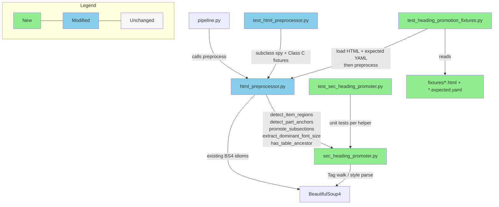

# Briefing — HTMLPreprocessor H3/H4 Sub-section Heading Promotion

> Sources: `artifacts/current/implementation_html-preprocessor-h3-h4-promotion.md`, `artifacts/current/bdd-scenarios_html-preprocessor-h3-h4-promotion.md`, `artifacts/current/verification-plan_html-preprocessor-h3-h4-promotion.md`
> 本任務無 brainstorming `design.md`，直接以 `task_html-preprocessor-h3-h4-promotion.md` 作為 design input，故省略 Design Delta section。

---

## Overview

本次擴充 `HTMLPreprocessor`，讓它在既有 h1/h2 promotion 之上，能對 SEC 10-K 的 Item region 內部 bold-only block 做 per-Item font-size ranking，emit `<h3>`/`<h4>`/`<h5>` sub-section heading，並對 Class C（INTC / JPM 類 `font-weight:400` Item heading）做 graceful fallback。共拆為 7 個 task，核心實作在新模組 `sec_heading_promoter.py`（~250 行純函式 heuristic）與 `html_preprocessor.py` 的呼叫順序調整。最大風險是 **R-10 preprocessing order（hard-gate）**：`_strip_decorative_styles` 必須移到 `_promote_headings` 之後，否則 font-size 會在 ranking 階段前被砍掉、整個 sub-section detection 無聲失效；這個順序錯誤在既有 h1/h2 test 下完全無法被察覺，必須由新 regression test（subclass spy hook 在 promote 入口 snapshot soup）與 validation script 的 AST order check 雙重守護。

---

## File Impact

### Folder Tree

```
backend/
├── ingestion/sec_filing_pipeline/
│   ├── html_preprocessor.py                          (modified — reorder preprocess steps; hook sec_heading_promoter; relax Item rule for Class C)
│   └── sec_heading_promoter.py                       (new — Item region detection, bold-only block detection, per-Item font-size ranking, noise/self-reference filters)
└── tests/ingestion/sec_filing_pipeline/
    ├── test_html_preprocessor.py                     (modified — add TestPreprocessingOrder regression + Class C fallback tests)
    ├── test_sec_heading_promoter.py                  (new — unit tests for every helper in the new module)
    ├── test_heading_promotion_fixtures.py            (new — parametrized anchor fixture tests for NVDA/BAC/INTC)
    └── fixtures/
        ├── __init__.py                                (new — package marker)
        ├── nvda_item7_class_a.html                    (new — NVDA Item 7 raw HTML slice, ~5–15KB)
        ├── nvda_item7_class_a.expected.yaml           (new — expected heading list incl. duplicate "Income Taxes")
        ├── bac_item7_class_b.html                     (new — BAC Item 7 slice, deep h3/h4/h5 hierarchy)
        ├── bac_item7_class_b.expected.yaml            (new — BAC expected heading list)
        ├── intc_item1a_class_c.html                   (new — INTC Item 1A slice, h2-only graceful fallback)
        └── intc_item1a_class_c.expected.yaml          (new — INTC expected heading list, h3 empty)
```

### Dependency Flow



### (c) Pipeline Decision Flow

> Preprocess pipeline 的五個 stage（含 Stage 2 內的 pre-compute substage）與每個 stage 內部的條件分支。
>
> **Stage 2a — Pre-compute (single source of truth)**：在 promotion 主迴圈跑之前，先 call `detect_item_regions` 跟 `detect_part_anchors` 把「哪些 tag 真的是 PART/Item 的 anchor」算清楚，產生兩個 `id()` set。`detect_item_regions` 用 last-occurrence-wins 做 TOC dedup，再加一個 BRK.A/B drop pass 把「在 body_start 之前 + 在 `<table>` 內」的 TOC-only Item 砍掉。`detect_part_anchors` 用同樣的 last-occurrence pattern + 必要的 `is_eligible=_has_bold_signal` filter 處理 TOC bold + body 非 bold 的 ticker（JNJ / MSFT / BAC）。
>
> **Stage 2b — PART/Item promotion**：reverse-traversal 主迴圈，PART 跟 Item 分支都先用 Stage 2a 的 `id()` set 篩過（SSOT filter），通過後 PART 跑 `_has_bold_signal` 確認；Item 走三條 OR path：(a) `_has_bold_signal`（標準 Workiva）/ (b) `_is_isolated_item_block`（Class C：font-size ≥ body + 孤立 block）/ (c) `_has_item_strong_size_signal`（JPM-style：text < 150 chars + font-size > body × 1.1，bypass sibling check）。
>
> **Stage 3 — Sub-section h3/h4/h5**：`promote_subsections(soup, regions)` 重用 Stage 2a 算過的 `regions`，三道 filter gate（`is_bold_only_block` → noise_tokens → self_reference）串聯後再走 per-region font-size ranking → h3/h4/h5。
>
> **Stage 4 — `_strip_decorative_styles`** 必須在 Stage 2+3 之後才跑（R-10 hard-gate）。

```mermaid
flowchart TD
    Start([Raw 10-K HTML]) --> Clean

    subgraph Clean["Stage 1 — Pre-cleanup"]
        direction TB
        C1["<b>_strip_xbrl_tags</b><br/>Remove every &lt;ix:*&gt; element<br/>(SEC inline-XBRL metadata for<br/>parsers, not human content)"]
        C2["<b>_remove_hidden_elements</b><br/>Drop any element with<br/>style='display:none'<br/>(invisible to humans → must not<br/>reach the markdown output)"]
        C3["<b>_unwrap_font_tags</b><br/>Unwrap legacy &lt;font&gt; tags<br/>(pre-CSS layout artifact —<br/>keep inner text, drop the wrapper)"]
        C4["<b>_normalize_text_whitespace</b><br/>Collapse runs of \\s inside text nodes<br/>down to a single space<br/>(mirrors browser rendering — markdown<br/>converters don't do this on their own)"]
        C1 --> C2 --> C3 --> C4
    end

    Clean --> Pre

    subgraph Pre["Stage 2a — Pre-compute SSOT anchor sets"]
        direction TB
        DetectItem["<b>detect_item_regions(soup)</b><br/>Find body Item anchors, dedup against TOC<br/><br/>1. Scan blocks whose text starts with 'Item N.'<br/>or 'Item NA.' (regex: ^Item \\d+&#91;A-Z&#93;? \\.)<br/>2. Group by item number — keep the LAST<br/>occurrence in document order<br/>(TOC always before body, so 'last' = body anchor)<br/>3. ★ BRK.A/B fix: drop items that ONLY exist<br/>inside the TOC &lt;table&gt; — Berkshire cross-references<br/>Items 10–14 to a consolidated section, so without<br/>this drop the final list would be non-monotonic<br/>4. Sort kept anchors by doc position<br/>→ list&#91;ItemRegion(item_num, start_tag, end_tag)&#93;"]
        DetectPart["<b>detect_part_anchors(soup, is_eligible=_has_bold_signal)</b><br/>Find body PART anchors, dedup against TOC<br/><br/>1. Scan blocks whose text starts with PART I/II/III/IV<br/>(regex: ^PART &#91;IVX&#93;+)<br/>2. ★ Filter to BOLD candidates only — rescues<br/>JNJ/MSFT/BAC where TOC PARTs are bold but<br/>body PARTs are visually styled non-bold<br/>(pure last-occurrence would lose the only usable anchor)<br/>3. Group by Roman numeral, keep last bold candidate<br/>4. Sort by doc position → list&#91;Tag&#93;"]
        BodyFont["<b>_estimate_body_font_size(soup)</b><br/>Character-weighted histogram of span font-sizes<br/>→ used by isolation & strong-signal checks<br/>in Stage 2b to decide what counts as 'larger than body'"]
        DetectItem --> RegionIds["<b>region_start_ids</b> = &#123;id(r.start_tag) for r in regions&#125;<br/>Pre-computed set for O(1) membership lookup<br/>in the main loop — drives the SSOT filter"]
        DetectPart --> PartIds["<b>part_anchor_ids</b> = &#123;id(t) for t in part_anchors&#125;<br/>Same purpose for PART headings"]
    end

    Pre --> PartItem

    subgraph PartItem["Stage 2b — PART / Item promotion (main loop)"]
        direction TB
        Scan["<b>Walk every &lt;div&gt;/&lt;p&gt;/&lt;td&gt;/&lt;th&gt; in REVERSE document order</b><br/>for tag in reversed(soup.find_all(&#123;div, p, td, th&#125;))<br/>(reverse traversal so inner matches promote first;<br/>outer wrappers get filtered by the descendant guard)"]
        Scan --> Q1{"Does this tag's text start with<br/><b>'PART I', 'PART II', 'PART III' or 'PART IV'</b>?<br/>(regex: ^PART &#91;IVX&#93;+)"}

        Q1 -- Yes --> QPid{"Is this tag the body PART anchor<br/>chosen in Stage 2a?<br/>(id(tag) ∈ part_anchor_ids)<br/><br/>Pre-computed check —<br/>guarantees TOC duplicates are skipped"}
        QPid -- No --> SkipP["<b>Skip</b><br/>Either a TOC duplicate, or the body PART<br/>is non-bold so no anchor exists for this<br/>Roman numeral (rare; affects no current ticker)"]
        QPid -- Yes --> H1["<b>Rewrite as &lt;h1&gt;</b><br/>Bold check already enforced by<br/>Stage 2a's eligibility filter, so promotion<br/>is unconditional once we get here"]

        Q1 -- No --> Q2{"Does this tag's text start with<br/><b>'Item N.' or 'Item NA.'</b>?<br/>(regex: ^Item \\d+&#91;A-Z&#93;? \\.)"}

        Q2 -- Yes --> QIid{"Is this tag the body Item anchor<br/>chosen in Stage 2a?<br/>(id(tag) ∈ region_start_ids)<br/><br/>SSOT — h2 promotion uses the SAME<br/>region set as Stage 3 sub-section detection,<br/>so h2 anchors and h3+ region boundaries<br/>can never disagree"}
        QIid -- No --> SkipI["<b>Skip</b><br/>TOC duplicate or non-selected anchor<br/>(another tag for the same item number<br/>was chosen as the body anchor)"]
        QIid -- Yes --> QIpath{"Does this Item heading have<br/><b>ANY of three promotion signals</b>?"}

        QIpath -- "(a) _has_bold_signal<br/>tag has &lt;b&gt;/&lt;strong&gt; ancestor<br/>OR font-weight:700/bold<br/>on tag or any descendant span" --> H2bold["<b>Rewrite as &lt;h2&gt;</b><br/>Standard Workiva path<br/>(majority of tickers)"]
        QIpath -- "(b) _is_isolated_item_block<br/>non-bold but visually a heading:<br/>font-size ≥ body AND tag is alone<br/>(no real-text block siblings,<br/>no &lt;table&gt; ancestor)" --> H2iso["<b>Rewrite as &lt;h2&gt;</b><br/>Class C fallback —<br/>non-bold but spatially isolated"]
        QIpath -- "(c) _has_item_strong_size_signal<br/>non-bold but a clear visual jump:<br/>text length &lt; 150 chars AND<br/>tag font-size &gt; body × 1.1<br/>(bypasses sibling check — the size<br/>jump + short text + strict regex<br/>make false positives unlikely)" --> H2ssig["<b>Rewrite as &lt;h2&gt;</b><br/>JPM-style strong-signal path —<br/>12pt non-bold over 10pt body,<br/>surrounded by real &lt;div&gt; paragraphs<br/>that the isolation check rejects"]
        QIpath -- "none of the three" --> R2miss["<b>Leave as &lt;div&gt;</b><br/>(reportable miss)<br/><br/>Currently only PG (font equals body,<br/>no signal at all) and INTC (color-only<br/>hierarchy, fully unsupported) hit this branch.<br/>See task_pg-item-detection-fallback.md<br/>and task_intc-color-hierarchy.md"]

        Q2 -- No --> Keep["<b>Leave untouched</b><br/>(text doesn't match PART or Item regex —<br/>just a regular block)"]
    end

    PartItem --> SubSec

    subgraph SubSec["Stage 3 — Sub-section h3/h4/h5 promotion"]
        direction TB
        S0["<b>promote_subsections(soup, regions)</b><br/>★ REUSES the same `regions` from Stage 2a<br/>SSOT alignment: every h2 anchor IS a sub-section<br/>region boundary; no possibility of disagreement<br/>between Stage 2b's h2 list and Stage 3's regions"]
        S0 --> S1["<b>_build_noise_tokens(soup)</b><br/>Build a 'NOT a heading' blacklist:<br/>collect every short text (≤ 50 chars) that<br/>appears 4 or more times in the document.<br/>(e.g. 'Bank of America' page footer,<br/>'Part I' pagination strip — these would<br/>otherwise look like sub-section headings)"]
        S1 --> S2["<b>For each ItemRegion:</b><br/>walk every block in [start_tag, end_tag)<br/>(these are the candidates for h3/h4/h5<br/>inside this Item's content)"]

        S2 --> G1{"Is this a <b>bold-only sub-section candidate</b>?<br/>(is_bold_only_block — ALL of:)<br/>• tag is &lt;div&gt; or &lt;p&gt;<br/>• no &lt;table&gt; ancestor<br/>• no nested div/p/table inside<br/>• 3 ≤ text length ≤ 200<br/>• not purely numeric (page-number guard)<br/>• if text &gt; 30 chars, doesn't end in .!?<br/>• every text descendant is bold"}
        G1 -- No --> Skip1["<b>Skip</b><br/>Not a bold-only block — could be<br/>body prose, a table cell, or just<br/>not styled as a heading"]

        G1 -- Yes --> G2{"Is this text on the<br/><b>noise blacklist</b>?<br/>(text ∈ noise_tokens —<br/>i.e. it's a repeating page header/footer,<br/>not a real sub-section heading)"}
        G2 -- Yes --> Skip2["<b>Skip</b><br/>Page header/footer noise"]

        G2 -- No --> G3{"Is this text a <b>back-reference</b><br/>to its own enclosing Item?<br/>(regex: ^Item \\d+&#91;A-Z&#93;? \\b)<br/><br/>e.g. 'Item 7. (continued)' inside Item 7,<br/>or 'see Item 1A above' — these are<br/>links, not sub-headings"}
        G3 -- Yes --> Skip3["<b>Skip</b><br/>Self-reference, not a sub-section heading"]

        G3 -- No --> Collect["<b>Collect candidate</b><br/>+ measure dominant font-size<br/>(extract_dominant_font_size — char-weighted<br/>across every text span inside this tag,<br/>so the 'biggest contributor' wins)"]
        Collect --> Rank["<b>Per Item region:</b><br/>sort the unique font-sizes of all collected<br/>candidates in descending order (largest first)"]
        Rank --> Map{"Where does this candidate's<br/><b>font-size rank</b> in the descending list?"}
        Map -- "index 0 (largest in region)" --> Rh3["<b>Rewrite as &lt;h3&gt;</b>"]
        Map -- "index 1 (second largest)" --> Rh4["<b>Rewrite as &lt;h4&gt;</b>"]
        Map -- "index ≥ 2 (third or smaller)" --> Rh5["<b>Rewrite as &lt;h5&gt;</b><br/>(capped at h5 even if<br/>more font-size tiers exist)"]
    end

    SubSec --> Strip["<b>Stage 4 — _strip_decorative_styles</b><br/>Remove inline font-size, color, margin, padding<br/>from every remaining tag<br/><br/>⚠ MUST run AFTER Stage 2 and Stage 3 (R-10 hard-gate)<br/>Stage 2's strong-signal path AND Stage 3's per-region<br/>font-size ranking BOTH need font-size to still be<br/>visible in the DOM. Running this before promotion<br/>would erase the heuristic's only signal."]
    Strip --> End(["Cleaned HTML<br/>h1..h5 hierarchy<br/>zero inline decorative styles"])

    classDef success fill:#bee0ff,stroke:#2b6cb0,color:#1a365d
    classDef fallback fill:#ffe4b3,stroke:#c05621,color:#5a2d0c
    classDef ssot fill:#d8b4fe,stroke:#7c3aed,color:#4c1d95
    classDef miss fill:#ffcccc,stroke:#c53030,color:#4a1515
    classDef skip fill:#e2e8f0,stroke:#718096,color:#2d3748
    classDef endpoint fill:#c6f6d5,stroke:#2f855a,color:#1c4532

    class H1,H2bold,Rh3,Rh4,Rh5 success
    class H2iso,H2ssig fallback
    class DetectItem,DetectPart,RegionIds,PartIds,S0 ssot
    class R2miss miss
    class Skip1,Skip2,Skip3,SkipP,SkipI,Keep skip
    class Start,End endpoint
```



**顏色編碼：**
- 🟦 藍（`success`）— h1/h2/h3/h4/h5 成功 promotion 的 terminal node
- 🟪 紫（`ssot`）— Stage 2a pre-compute 與 Stage 3 重用 regions（single source of truth nodes）
- 🟧 橘（`fallback`）— h2 promotion 的非 bold path：(b) Class C isolated block 或 (c) JPM-style strong size signal
- 🟥 紅（`miss`）— reportable miss（不阻斷 build，進 round report）— 目前只剩 PG/INTC 兩個 known limitations
- ⬜ 灰（`skip`）— 不 promote（SSOT filter 拒絕、不符合 candidate 條件、或非 PART/Item text）
- 🟩 綠（`endpoint`）— pipeline 入口 / 出口

---

## Task 清單

| Task | 做什麼 | 為什麼 |
|------|--------|--------|
| 1 | 調換 `preprocess()` 裡 `_strip_decorative_styles` 與 `_promote_headings` 的呼叫順序 | 新的 sub-section detection 依賴 `font-size:Npt` inline style，原順序會在 ranking 前就把它砍掉 |
| 2 | 建立 `sec_heading_promoter.py` 模組與底層純函式 helper（`has_table_ancestor` / `extract_dominant_font_size` / `is_bold_only_block`）| 把 ~250 行 heuristic 抽到獨立檔案，讓每個 helper 可以單獨 unit test，`HTMLPreprocessor` 保留 thin orchestration |
| 3 | 加入 `detect_item_regions(soup)` 與 `ItemRegion` dataclass | Per-Item font-size ranking 需要知道每個 Item 的 `[start_tag, end_tag)` 範圍，且必須用 last-occurrence heuristic 區分 TOC 與 body |
| 4 | 加入 `promote_subsections(soup, regions)`，做 per-region font-size ranking → h3/h4/h5 mapping，並接入 `HTMLPreprocessor._promote_headings` 尾端 | 這是整個 plan 的核心：Item region 內 unique font-size descending rank → 前三層 → h3/h4/h5（cap at h5）|
| 5 | 加入 `_build_noise_tokens(soup)` 與 `_is_self_reference(text)` false positive filters | 降低 page header/footer（"Part I"、"Bank of America"）與中段 `Item N.` self-reference 誤被 promote 的比例 |
| 6 | 在 `_promote_headings` Item branch 加 fallback：text 符合 Item regex + font-size ≥ body + isolated block → 即使非 bold 也 promote 為 `<h2>` | INTC/JPM 類 `font-weight:400` Item heading 原本會被 `_has_bold_signal` 濾掉，整份 filing 完全沒有 Item h2 |
| 7 | 建立 NVDA/BAC/INTC 三個 anchor fixture（raw HTML 切片 + expected YAML）與 `test_heading_promotion_fixtures.py` parametrized test | 合成 HTML 無法涵蓋真實 SEC HTML 的怪招；每個 class 釘一個 anchor 作為 regression 錨點，廣度的 23-ticker 驗證交給 validation script |

---

## Behavior Verification

> 共 48 個 illustrative scenarios（S-prep-*）+ 9 個 journey scenarios（J-prep-*），涵蓋 5 個 features。整體採 **Soft / Reportable** 模式：preprocessor 永遠 graceful return，hard-gate 僅套用在 R-10（順序）、R-11（API）、R-12（no-crash）、R-13（23-ticker H1/H2 regression）。
>
> **呈現說明**：每個 scenario 用 Obsidian 原生 foldable callout（`> [!example]-`，`-` 表示預設折疊）。在 Obsidian 中點 callout 標題可展開細節；在一般 markdown viewer（GitHub / VS Code preview）會顯示為 blockquote，內容仍完整可讀。hard-gate 用 🛑 標記、manual 用 🖐️ 標記。

### Feature 1 — H1/H2 Heading Detection Robustness

**Rule R-1: PART → H1**

> [!example]- **S-prep-01** — NVDA/AAPL/MSFT 的四個 PART 標頭都被 promote 成 `# PART I..IV` 且順序正確
> - **Given**: 標準 `<div><span font-weight:700>PART I</span></div>` 結構；AAPL 用 `font-weight: bold` keyword
> - **Then**: 輸出 markdown 正好 4 行以 `# PART ` 開頭的 H1
> - → Automated (per-ticker H1 inspection script)

> [!example]- **S-prep-02** — CVX 把 PART II wrap 在 `<table><td>` 內仍然被 promote 成 H1，且 R-6 sub-section table 排除規則不影響 PART 掃描
> - **Given**: `<table><tr><td><span fw:700>PART II</span></td></tr></table>`
> - **Then**: 輸出仍有 `# PART II`
> - → Automated

> [!example]- **S-prep-03** — PART 與 numeral 之間用 `&nbsp;` / `<br/>` / em-space 也能識別為 `# PART II`
> - **Given**: `PART&nbsp;II` 或 `PART<br/>II`
> - **Then**: Whitespace normalization 在 regex 前完成，H1 正確
> - → Automated

> [!example]- **S-prep-04** — Discovery ticker 用 `Part One` 或 `Part 1` 非 roman numeral 命名時，該 PART 可能 miss 但不阻斷 build，validation report 標示 `R-1 unmet`
> - **Given**: `<div>Part One</div>`
> - **Then**: Preprocessor 不 raise；report 列入 needs-review
> - → Automated (reportable only)

**Rule R-2: Item N. → H2**

> [!example]- **S-prep-05** — AAPL/NVDA/GOOGL 各自的 21（或 22）個 Item（含 1A/1B/7A/9A/9B/9C）全部 promote 為 `## Item ..`，順序按文件出現
> - AAPL expected 21；NVDA 21；GOOGL ~22（含 Item 9C cybersecurity）
> - → Automated (table-driven assertion)

> [!example]- **S-prep-06** — XOM 把每個 Item wrap 在 `<td>` 內，R-7 carve-out 允許 Item-level 走 table cell，Item 7 以下 sub-section 不會誤抓 financial cell
> - **Given**: `<table><tr><td>Item 7. MD&A</td></tr></table>`
> - **Then**: Item h2 正確；sub-section R-4 不會把同一個 table 裡的 financial cell 當候選
> - → Automated

> [!example]- **S-prep-07** — INTC/JPM 用 `font-weight:400` + font-size > body 的 Item heading 也被 promote 為 H2，且不誤抓 body 段落中以 Item N 開頭的句子
> - INTC: weight 400, 11pt, body 10pt → detect
> - JPM: weight 400, 12pt, body 10pt → detect
> - → Automated

> [!example]- **S-prep-08** — Donnelley-style 把 Item heading 切成多個 sibling `<span>`（中間夾 `<a id>` anchor）時，concatenate 後仍然 match regex
> - **Given**: `<span>Item</span><span>&nbsp;7.</span><span> MD&A</span>`
> - → Automated (synthetic fixture)

> [!example]- **S-prep-09** — GOOGL body Item 7 被 `<a id="item7">` 包覆時，H2 anchor 鎖在 body 位置，TOC 不被誤判，R-9 self-reference filter 不誤殺
> - **Given**: body `<div><a id="item7"><span fw:700>Item 7. MD&A</span></a></div>` + TOC `<a href="#item7">`
> - → Automated

> [!example]- **S-prep-10** — Discovery ticker 用 `` 或 SVG 渲染 Item heading 時 preprocess 不 raise，H2 count 可為 0，report 標示 `R-2 unmet` 不阻斷
> - → Automated (reportable only)

**Rule R-3: Class C fallback 不誤判 body 段落**

> [!example]- **S-prep-11** — JPM body 中「As discussed in Item 1A. Risk Factors above...」段落在 R-3 fallback 路徑下停留在 paragraph，不被 promote 成 H2（R-9 必須先於 R-3 套用）
> - → Automated (synthetic fixture `jpm_fontweight_400.html`)

**Journey**

> [!example]- **J-prep-01** — NVDA 最新 10-K 完整跑完 preprocess 後，H1 count == 4、H2 count == 21，所有 heading 文字非空非亂碼
> - → Automated (anchor smoke)

> [!example]- **J-prep-02** — 23 個 existing ticker 對 baseline_headings.json 跑全量 H1/H2 set regression，每個 ticker 的 H1/H2 set ⊇ baseline 且順序維持（LCS check）
> - → Automated (hard-gate, same path as J-prep-07)

> [!example]- **J-prep-03** — Discovery 47 ticker 各自跑 preprocess + sanity check（4 ≤ H1 ≤ 6、10 ≤ H2 ≤ 25），違規標示 `[NEEDS_REVIEW]` 不阻斷 batch
> - → Automated (reportable round report)

### Feature 2 — Sub-Section H3/H4 Promotion

**Rule R-4: Bold-only block detection**

> [!example]- **S-prep-12** — NVDA Item 7 的 `<div><span fw:700 fs:9pt>Our Company and Our Businesses</span></div>` 被加入 sub-section candidate，dominant size 記為 9pt
> - → Automated

> [!example]- **S-prep-13** — bold-only 偵測拒絕：句末標點（"Net revenue increased $4.2B."）、純數字（"42"、"Page 47 of 192"）、mixed bold+plain、內含 nested block — 五種 negative case 全部 reject
> - → Automated (table-driven)

> [!example]- **S-prep-14** — Bold token 除了 `font-weight:700`，還必須接受 `bold` / `bolder` / `600` / `800` / `900` 等等價值
> - → Automated

> [!example]- **S-prep-15** — Bold heading 後接 `<sup>(1)</sup>` footnote marker（plain weight）時，heading 仍被 detect，dominant size 取自 bold span 不受 footnote 影響
> - → Automated

> [!example]- **S-prep-16** — Bold block 中間夾一個 whitespace-only 非 bold span 時仍視為 bold candidate（stray whitespace span 視為 transparent）
> - → Automated

**Rule R-5: Per-Item font-size ranking**

> [!example]- **S-prep-17** — NVDA Item 7 region 內 {11pt, 10pt, 9pt} 三層 distinct font size 分別 rewrite 為 h3 / h4 / h5
> - → Automated

> [!example]- **S-prep-18** — AAPL Item 1A 內 8 個 candidate 全為 10pt 單一 size，全部 rewrite 為 h3，無 h4/h5 產生（degenerate case 仍要 work）
> - → Automated

> [!example]- **S-prep-19** — BAC Item 7 內 {12pt, 11pt, 10pt, 9pt, 8pt} 五層 distinct size：12pt→h3、11pt→h4、10pt→h5，9pt 與 8pt 也 cap 在 h5；report 註記 hierarchy depth loss
> - → Automated (anchor fixture)

> [!example]- **S-prep-20** — META 等近代 filing 使用 px 單位（16px / 14px / 12px），normalize 為 pt 後仍然正確排序為 h3 / h4 / h5
> - → Automated (synthetic fixture)

> [!example]- **S-prep-21** — 同 font size 但視覺階層不同（4 個 ALL CAPS + 8 個 Title Case 全 9pt）全部 collapse 為 h3，report 標示 `[VISUAL_HIERARCHY_COLLAPSE]` 為 known limitation 🖐️
> - → Manual Behavior Test（人眼對比原 HTML + markdown 判斷是否可接受）

**Rule R-6: Table cell exclusion (sub-section only)**

> [!example]- **S-prep-22** — BAC Item 7 內 ~1622 個 `<td><span fw:700>財務標籤</span></td>` cell 全部不被當 sub-section candidate，Item 7 的 sub-section count 落在 ~10–30 合理範圍而非 1000+
> - → Automated (real BAC cached HTML)

> [!example]- **S-prep-23** — 深層巢狀 `<table><td><div><p><span fw:700>`（5 層 wrap）仍然走 ancestor walk 被 reject
> - → Automated

> [!example]- **S-prep-24** — AMT 同時有 (a) financial table cell 裡的 plain text「Critical Accounting Estimates」與 (b) body 裡 bold 版，只有 (b) 成為 sub-section candidate
> - → Automated (real AMT cached HTML)

**Journey**

> [!example]- **J-prep-04** — NVDA Item 7 重現 task 文件範例：h3 「Critical Accounting Estimates」+ 「Results of Operations」；h4 「Inventories」「Income Taxes」「Reportable Segments」「Income Taxes」，且兩個 "Income Taxes" 都保留在各自 parent path 下
> - → Automated

> [!example]- **J-prep-05** — BAC Class B：preprocess 完成後 Item 7 sub-section count 在 ~10–30，至少 h3+h4+h5 三層齊備，R-15 ground truth 對應率 ≥ 50%
> - → Automated

### Feature 3 — Region Detection & Path-Aware Filtering

**Rule R-7: Item region 用 body last-occurrence**

> [!example]- **S-prep-25** — GOOGL 中 Item 1 在 TOC 與 body 各出現一次，H2 anchor 鎖在 body 位置（char position > 50000 from start），Item 1 region = `[body_item1, body_item1A)`
> - → Automated

> [!example]- **S-prep-26** — 10-K/A 或有 Cross-Reference Index 的 filing 被 filing type guard fail-fast，validation report 標示 `FILING_TYPE_REJECTED` 並 skip
> - → Automated (pre-flight guard)

> [!example]- **S-prep-27** — Item 順序錯亂（Item 16 在 Item 15 之前）時，region computation 用 sorted body position 避免 negative span
> - → Automated (synthetic fixture)

**Rule R-8: Path-aware repeated text dedup**

> [!example]- **S-prep-28** — NVDA 的兩個 "Income Taxes" 分別在 `["Item 7", "Critical Accounting Estimates"]` 與 `["Item 7", "Results of Operations"]` parent path 下，dedup 後**兩個都保留**
> - → Automated

> [!example]- **S-prep-29** — JPM "Income Taxes" 跨 Item 7 / 7A / 8 / 9 四次出現（parent path 全不同），dedup 後 4 個全保留
> - → Automated

> [!example]- **S-prep-30** — BAC running footer「Bank of America」在文件中 200+ 次出現，parent path 均為 root → dedup key 重複 4+ 次 → 全部不被 promote，H1/H2/H3/H4 中 0 次
> - → Automated

> [!example]- **S-prep-31** — CRM page header「Part I」50+ 次出現：legitimate 一個 `# PART I` H1 保留，其餘 49 個 page header occurrence 全部不被 promote
> - → Automated

**Rule R-9: Self-reference filter**

> [!example]- **S-prep-32** — NVDA Item 7 中段 paragraph「As discussed in Item 1A. Risk Factors above...」停留在 paragraph，Item 1A H2 出現次數仍正好 1
> - → Automated

> [!example]- **S-prep-33** — Item 7 region 中段有 `<div><span fw:700>Item 7A — Quantitative Disclosures</span></div>` 時，R-9 攔截不進 sub-section，真正的 Item 7A H2 仍鎖在更後面的 body 出現位置
> - → Automated

**Journey**

> [!example]- **J-prep-06** — GOOGL 完整跑完：Item count 等於 body 真實 Item 數（TOC 不污染），任一跨 Item 重複的 sub-section 文字在不同 path 下全保留
> - → Automated

### Feature 4 — Pipeline Integrity, API & Regression

**Rule R-10: Preprocessing order — hard-gate**

> [!example]- **S-prep-34** — AAPL preprocess 進行中，`_promote_headings` 入口 snapshot 的 soup 仍帶 `font-size`，最終 markdown 零 `font-size:` 殘留；若 AST order 錯誤則 validation script 立即 fail 🛑 hard-gate
> - → Automated (AST inspection + middle-hook snapshot)

**Rule R-11: Public API stability — hard-gate**

> [!example]- **S-prep-35** — `inspect.signature(HTMLPreprocessor.preprocess)` 回傳 `['self', 'html']`、`html` annotation 為 `str`、return annotation 為 `str`；對 NVDA 跑 preprocess 不 raise 🛑 hard-gate
> - → Automated (Python introspection)

**Rule R-12: No-crash + soft graceful return — hard-gate**

> [!example]- **S-prep-36** — INTC 10-K 整份 preprocess 不 raise，輸出 markdown 只有 H1 + H2 沒有 H3/H4；report 標示 R-4/R-5 unmet 但 hard-gate (no-crash) 通過 🛑
> - → Automated

> [!example]- **S-prep-37** — 空 body 的 pathological 10-K 跑 preprocess 不 raise，return 空字串或 whitespace markdown 🛑
> - → Automated

> [!example]- **S-prep-38** — SVG-rendered PART/Item 的 hypothetical discovery ticker 跑 preprocess 不 raise、H1/H2 count 都為 0，report 標示 `R-1/R-2 unmet` 不阻斷（非 hard-gate）
> - → Automated

**Rule R-13: 23-ticker H1/H2 regression — hard-gate**

> [!example]- **S-prep-39** — 每個 existing ticker 的 `set(new_h1) ⊇ set(baseline_h1)` 且 `set(new_h2) ⊇ set(baseline_h2)`，任何 missing 即 hard-gate fail 🛑
> - → Automated (JSON snapshot + set diff)

> [!example]- **S-prep-40** — AAPL H2 若被誤重排為 `[Item 1, Item 1B, Item 1A, Item 2, ...]`，LCS order check 必須偵測到順序改變並 fail，report 指出 reordering 位置 🛑
> - → Automated

> [!example]- **S-prep-41** — 新增 H3/H4（NVDA +50 h3 / +30 h4）不影響 R-13 的 H1/H2 hard-gate，report 顯示 `h3 +50, h4 +30 (added)`
> - → Automated

**Journey**

> [!example]- **J-prep-07** — 23-ticker hard-gate batch：R-10 AST/middle-hook、R-11 signature、R-12 no-crash per ticker、R-13 regression LCS check 全跑；任一 violation → exit code ≠ 0 並寫 `hard_gate_report_{N}.json`；runtime budget 60–90s 🛑
> - → Automated (CI gate)

### Feature 5 — Acceptance & Discovery Reporting

**Rule R-14: Class A 12 ticker — soft / reportable**

> [!example]- **S-prep-42** — Class A 12 ticker 每個 Item 底下至少 1 個 H3；任何 Item 的 h3_count == 0 則 ticker 標示 `[CLASS_A_DEGRADED]`，不阻斷
> - → Automated

**Rule R-15: Class B 10 ticker — soft / reportable**

> [!example]- **S-prep-43** — BAC Item 7 對照 `ground_truth/known_subsections/BAC.yaml`（11 個已知 sub-section），substring match ≥ 6/11 (50%)；missed 名單進 report 供下一輪 enhancement
> - → Automated

> [!example]- **S-prep-44** — Class B ticker 每個 H3/H4 的 parent Item 與 expected mapping 比對，misplacement ratio < 20%；違規 ticker 標示 `[REGION_OVERFLOW]`
> - → Automated

**Rule R-16: Performance — soft / reportable**

> [!example]- **S-prep-45** — 23 ticker 各跑 5 次取 median，每個 ticker 的 `new_median / baseline_median` ≤ 2.0；超過則標示 `[PERF_REGRESSION]`，不阻斷
> - → Automated (timeit)

**Rule R-17: Discovery 47 — soft / reportable**

> [!example]- **S-prep-46** — 47 discovery ticker 各自跑 preprocess，sanity check `4 ≤ H1 ≤ 6 AND 10 ≤ H2 ≤ 30`；違規標示 `[NEEDS_REVIEW]` 不阻斷
> - → Automated (EDGAR fetch + cache + preprocess)

> [!example]- **S-prep-47** — 47 discovery ticker 的 vendor 被 `<meta name="generator">` 或 head style fingerprint 識別（Workiva / Donnelley / ActiveDisclosure / Toppan / unknown），report 末尾列 sample distribution
> - → Automated (vendor heuristic)

> [!example]- **S-prep-48** — 當 user 在 round report 標記某 discovery ticker 的 H1/H2 都正確，跑 `promote_to_golden TICKER` 把該 ticker 的 heading list 寫入 baseline，之後進入 R-13 hard-gate 範圍 🖐️
> - → Manual CLI ops（user-driven 升 golden 流程）

**Journey**

> [!example]- **J-prep-08** — Discovery round workflow：run validation script → 產出 `discovery_round_{N}.json` + `.md` → user review → spot check `[NEEDS_REVIEW]` → 決定下一輪 enhancement priority → (optional) promote_to_golden
> - → Mixed: script automated；review & spot check manual

> [!example]- **J-prep-09** — 4-anchor smoke test（NVDA / BAC / INTC / CVX）跨 class preprocess + heading count + sanity，30 秒內 print stdout，pre-PR quick check
> - → Automated

### 🔍 User Acceptance Test（PR Review 時執行）

**J-prep-08 round report 是否充分支援 user review**<br>
Cold-start 跑一輪 discovery batch → 看 `discovery_round_1.md` summary → 計算 review 用時 → 判斷是否能在 5–10 分鐘內識別 top-3 priority enhancement target。<br>
→ Reviewer 在 PR Review 時手動跑 `uv run python -m tests.ingestion.sec_filing_pipeline.validation --mode discovery --tickers discovery47` 並評估 report 可讀性

---

## Test Safety Net

### Guardrail（不需改的既有測試）

- **既有 h1/h2 promotion** — `test_html_preprocessor.py::TestHeadingPromotion` 涵蓋標準 PART / Item bold-signal promotion、`_DECORATIVE_PROPS` 清除、font 子 tag unwrap 等行為；Task 1 的順序調整後這些 test 必須全數維持通過，是「final output 不變」不變量的主要守護。
- **Pipeline orchestration** — `pipeline.py` 對 `HTMLPreprocessor.preprocess()` 的 call site 不動，既有 `test_pipeline.py` 的 pipeline integration path 不受影響。
- **HTML-to-markdown 轉換** — `test_html_to_md_converter.py` 驗證 markdown heading syntax 與結構對應；新 h3/h4/h5 會自動繼承既有 converter 行為，無需調整 converter 測試。
- **SEC 網路整合** — `sec_integration` marker 的 live SEC download test 維持不變，本 plan 新增 fixture-based 測試不掛此 marker、走預設 suite。

### 需調整的既有測試

| 影響區域 | 目前覆蓋 | 調整原因 |
|----------|---------|----------|
| `test_html_preprocessor.py::TestPreprocessingOrder` | 目前無此 class | Task 1 新增 `test_promote_headings_sees_font_size` — 用 subclass spy hook 在 `_promote_headings` 入口 snapshot soup，assert font-size 在 promote 階段可見、最終 output 不殘留 |
| `test_html_preprocessor.py` Item promotion tests | 只涵蓋 bold Item | Task 6 新增五個 Class C test：font-weight:400 + 大於 body font → promote；小於 body → reject；非 isolated → reject；graceful no-sub-section；既有 bold path regression |

### 新增測試

- **`sec_heading_promoter` 單元** — 每個 helper（`has_table_ancestor`、`extract_dominant_font_size`、`is_bold_only_block`、`detect_item_regions`、`promote_subsections`、`_build_noise_tokens`、`_is_self_reference`）對應 positive + negative case：table ancestor walk、char-weighted font dominance、bold variant（700/bold/bolder/600/800/900）、punctuation/numeric/nested reject、TOC vs body last-occurrence、XOM table cell 支援、per-region ranking cap at h5、noise dedup threshold、self-reference regex。
- **Fixture-based 真實 HTML anchor** — NVDA Item 7（Class A：expected list 完全相等、含兩個 "Income Taxes"）、BAC Item 7（Class B：LCS 容忍 `ratio ≥ 0.8`）、INTC Item 1A（Class C：`h2 count ≥ 1`、`h3 count == 0` graceful）。
- **Validation script（外掛工具）** — `backend/tests/ingestion/sec_filing_pipeline/validation/__main__.py` + `fetcher.py` + `extractor.py` + `reporter.py`，提供 `--mode hard-gate|discovery|both` 與 `--tickers` 篩選，負責 23-ticker hard-gate（R-10/11/12/13）與 47-ticker discovery reporting。
- **Ground truth fixtures** — `baseline_headings.json`（R-13 hard-gate 比對基線）、`known_subsections/BAC.yaml` 等（R-15 Class B substring match ground truth）。

---

## 待後續決定的事項（Post-Coding Placeholders）

以下 7 項從 `verification-plan.md` 的 Post-Coding Placeholders 搬過來，實作時需要確定：

| ID | 待填項目 |
|----|---------|
| POST-CODING-1 | `extract_headings(md, level)` 的 markdown parser 實作（regex vs ast 套件） |
| POST-CODING-2 | `vendor_detect(html)` 的 fingerprint 規則（meta tag 路徑） |
| POST-CODING-3 | `longest_common_subsequence` 用第三方 lib 或自寫 |
| POST-CODING-4 | `parent_path` 的 representation（list of str / tuple / path string） |
| POST-CODING-5 | `sec-edgar-downloader` 的 cache directory 結構與 filename convention |
| POST-CODING-6 | `baseline_headings.json` 的精確 schema |
| POST-CODING-7 | `BAC.yaml` 等 ground truth 的 manual labeling work（首次 human cost） |
