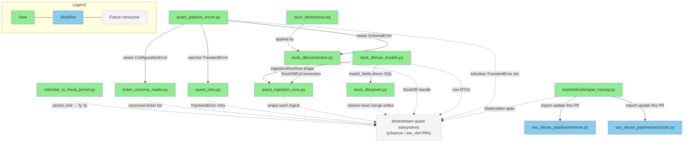

# Briefing — Quant Data Pipeline Foundation Layer

> Source artifacts:
> - Design: [design_quant_foundation.md](./design_quant_foundation.md)
> - Implementation plan: [implementation_quant_foundation.md](./implementation_quant_foundation.md)
>
> 注：本 PR 未產出 `bdd-scenarios.md` / `verification-plan.md`。foundation 層產物全為 infrastructure（DB schema / helper / DTO），沒有 user-facing behavior；驗證策略由 implementation plan 內 targeted pytest + flow verification 覆蓋，故省略 Section 5 Behavior Verification。

---

## 1. Design Delta

> 實作規劃未發現與 design 不一致的項目，可直接檢閱後續內容。

Plan 對 design 的所有決策（手寫 `schema.sql`、方案 A 顯式欄位 upsert、`traced_span` file move、6-class 扁平 error hierarchy、`ingestion_run` context manager 契約、10 ticker universe、`with_retry` 只 catch `TransientError`）皆照搬；新增內容屬 design 明確留給 implementation 的空間，不構成 delta。

---

## 2. Overview

本次建立兩條 quant data subsystem pipeline（yfinance / SEC XBRL）共用的 foundation 層 —— DuckDB connection bootstrap、手寫 `schema.sql`（8 表 + 全欄位 `COMMENT`）、5 個 Pydantic row DTO、`upsert_rows()` / `normalize_fiscal_period()` / `ingestion_run()` / `with_retry()` / universe loader、6-class error taxonomy，並把 `traced_span()` 從 `sec_dense_pipeline/tracing.py` file-move 到 `backend/utils/span_tracing.py` 供跨 pipeline 共用。共拆為 10 個 task。最大風險是 `quarterly_financials` ↔ `annual_financials` 的 COMMENT mirror 與 `upsert_rows()` 的 column-level merge 契約 —— 若 DTO 誤宣告 `updated_at` 或 helper SQL 誤把非 DTO 欄位納入 `DO UPDATE SET`，未來 SEC 子系統在同一 PK 寫進的欄位（e.g. `product_revenue_usd`、`current_rpo_usd`）會被 yfinance 覆寫清空。

---

## 3. File Impact

### (a) Folder Tree

```
backend/
├── utils/                                              (new — cross-pipeline shared utils)
│   ├── __init__.py                                     (new — package marker)
│   └── span_tracing.py                                 (new — conditional Langfuse observation span helper; file-moved from sec_dense_pipeline/tracing.py)
├── ingestion/
│   ├── sec_dense_pipeline/
│   │   ├── tracing.py                                  (deleted — lifted to backend/utils/span_tracing.py)
│   │   ├── retriever.py                                (modified — import path update)
│   │   └── vectorizer.py                               (modified — import path update)
│   └── quant_data_pipeline/                            (new — foundation package)
│       ├── __init__.py                                 (new — package marker)
│       ├── README.md                                   (new — ships-with-code public API doc, English)
│       ├── config/
│       │   └── ticker_universe.yaml                    (new — canonical 10 cross-industry tickers)
│       ├── duck_db/
│       │   ├── __init__.py                             (new — sub-package marker)
│       │   ├── connection.py                           (new — get_connection() + schema bootstrap)
│       │   ├── schema.sql                              (new — 8 tables DDL + full COMMENT ON COLUMN)
│       │   ├── row_models.py                           (new — 5 Pydantic row DTOs)
│       │   └── upsert.py                               (new — upsert_rows() column-level merge)
│       ├── calendar_to_fiscal_period.py                (new — normalize calendar period_end into (fiscal_year, fiscal_quarter) tuple; pure fn)
│       ├── ticker_universe_loader.py                   (new — load_ticker_universe)
│       ├── quant_pipeline_errors.py                    (new — 6-class error taxonomy)
│       ├── quant_ingestion_runs.py                     (new — ingestion_run context manager + RunReport)
│       └── quant_retry.py                              (new — with_retry exponential-backoff decorator)
└── tests/
    ├── utils/
    │   ├── __init__.py                                 (new)
    │   └── test_span_tracing.py                        (new — no-op / active-span paths)
    └── ingestion/quant_data_pipeline/
        ├── __init__.py                                 (new)
        ├── conftest.py                                 (new — tmp_duckdb fixture shared with subsystem PRs)
        ├── test_quant_pipeline_errors.py               (new — hierarchy + sibling non-inheritance)
        ├── test_connection.py                          (new — bootstrap / env var / SchemaError paths)
        ├── test_schema_comments.py                     (new — quarterly ↔ annual COMMENT mirror guard)
        ├── test_upsert.py                              (new — column-level merge, updated_at contract)
        ├── test_calendar_to_fiscal_period.py           (new — 10 golden cases + 2 error cases)
        ├── test_ticker_universe_loader.py              (new — happy path + 3 error paths)
        ├── test_quant_retry.py                         (new — 6 cases with monkey-patched time.sleep)
        ├── test_quant_ingestion_runs.py                (new — success / error / partial-metadata paths)
        └── test_schema_roundtrip.py                    (new — end-to-end smoke)

pyproject.toml                                          (modified — add duckdb>=1.0.0, pandas>=2.0.0)
.gitignore                                              (modified — add data/*.duckdb, data/*.db)
```

### (b) Dependency Flow

Foundation 內部的 source-code 依賴（實線）+ 對下游 subsystem PR（yfinance / sec_xbrl）與既有 `sec_dense_pipeline` 的公開 API surface（虛線）。`calendar_to_fiscal_period.py`、`ticker_universe_loader.py`、`quant_retry.py`、`span_tracing.py` 在 foundation 範圍內都是 leaf —— 沒有 foundation 內部模組 import 它們，但它們是下游 subsystem 消費的主要工具。

註：`quant_ingestion_runs.py` 寫入 `ingestion_runs` 表時**不透過 `upsert_rows()`**，而是直接 `conn.execute(sql, [params...])` 走 parameterized / prepared statement —— `run_id` 每次新 UUID 不會撞 conflict，且 `error_message` / `metadata` 含 untrusted content，走 prepared statement 更安全。因此 diagram 中 `upsert` 與 `runs` 之間**沒有** edge。



**實線 vs 虛線**：實線 = 本 PR 內 source-code 實際 import；虛線 = 下游 subsystem PR 將會消費的 public API（foundation 層自身不 import）。

---

## 4. Task 清單

每個 Task 明示交付的 **filename** + **public symbol**，與 Section 3 file tree 對齊。

| Task | 做什麼 | 為什麼 |
|------|--------|--------|
| 1 | `pyproject.toml` 加 `duckdb` / `pandas` runtime deps、`.gitignore` 加 `data/*.duckdb` / `data/*.db`、建 package skeleton（`backend/utils/`、`backend/ingestion/quant_data_pipeline/` + `duck_db/` + 對應 tests，7 個空 `__init__.py`） | 後續 task 才能 `import backend.ingestion.quant_data_pipeline.*` |
| 2 | `quant_pipeline_errors.py` 落地 6 class：`QuantPipelineError`（root）+ 5 subclass（`TransientError` / `TickerNotFoundError` / `DataValidationError` / `ConfigurationError` / `SchemaError`，扁平繼承） | 其他 foundation 模組都要 raise 這幾個 class，先當葉節點落地 |
| 3 | `duck_db/schema.sql`（8 表 DDL + 全欄位 `COMMENT ON COLUMN`）、`duck_db/connection.py` 的 `get_connection()`、`conftest.py` 的 `tmp_duckdb` fixture、`test_schema_comments.py` 的 quarterly ↔ annual COMMENT mirror 守護 | Schema + bootstrap + mirror 契約在設計上是一體，共一個 checkpoint |
| 4 | `duck_db/row_models.py` 5 個 Pydantic row DTO（`CompanyRow` / `MarketValuationRow` / `YFinanceQuarterlyRow` / `YFinanceAnnualRow` / `IngestionRunRow`）+ `duck_db/upsert.py` 的 `upsert_rows()` 顯式欄位 column-level merge | DTO 與 upsert 共同落地才完整；`updated_at` 由 helper 自動管理、SET 子句不覆寫非 DTO 欄位 |
| 5 | `calendar_to_fiscal_period.py` 的 `normalize_fiscal_period()` 純函式 | yfinance / SEC 把 calendar `period_end` 轉 `(fiscal_year, fiscal_quarter)` 的唯一管道 |
| 6 | `config/ticker_universe.yaml`（canonical 10 跨產業 ticker）+ `ticker_universe_loader.py` 的 `load_ticker_universe()` | 下游 batch CLI、`validate` subcommand、agent 邊界檢查共用的 single source of truth |
| 7 | `quant_retry.py` 的 `with_retry()` exponential-backoff decorator | 子系統 fetcher 遇 `TransientError` 走通用 retry；pacing 留給子系統 |
| 8 | `quant_ingestion_runs.py` 的 `ingestion_run()` context manager + `RunReport` dataclass + `test_schema_roundtrip.py` end-to-end smoke | 提供 auditability 主 API，同時用 E2E smoke 驗證 schema + connection + DTO + upsert 全鏈 |
| 9 | `git mv sec_dense_pipeline/tracing.py backend/utils/span_tracing.py`、更新 `retriever.py` / `vectorizer.py` 2 處 import、新建 `test_span_tracing.py` | 讓 foundation 與 SEC RAG pipeline 共用同一份 observability util，避免一字不差的重複實作 |
| 10 | `backend/ingestion/quant_data_pipeline/README.md`（English，8 節：Purpose / Quick start / Public API / Conventions / Adding a new DTO / Extending error taxonomy / Testing / Schema evolution） | Ships-with-code 文件供子系統 PR 作者與後續維護者 |

---

## 5. Behavior Verification

> 本 PR 未產出 `bdd-scenarios.md` / `verification-plan.md`。Foundation 交付物全為 infrastructure（DB schema、helper、DTO、decorator、context manager），沒有 end-user-facing behavior 可列 scenario；驗證策略由 implementation plan 內各 task 的 targeted pytest + 兩段 Flow Verification 覆蓋（foundation public API smoke、`sec_dense_pipeline` 遷移後 regression）。

---

## 6. Test Safety Net

### Guardrail（不需改的既有測試）

- **`sec_dense_pipeline` retriever / vectorizer suite** — 既有 integration tests 驗證 RAG dense pipeline 的 retrieval / ingestion 行為；Task 9 只改 `traced_span` 的 import 路徑，不動邏輯，既有 suite 跑綠 = 遷移無 regression 的唯一 gate（plan Task 9 flow verification 明確要求與遷移前 pass/skip 結果一致）。
- **`sec_filing_pipeline`** — v2 RAG 既有 pipeline，本 PR 完全不動其程式碼，既有 integration / unit tests 保護其行為不被連帶破壞。
- **Full repo default pytest（排除 eval / integration / sec_integration）** — Task 1 新 deps、Task 9 file-move 後各跑一次 baseline 對比，確認沒有意料外的 side effect。

### 需調整的既有測試

| 影響區域 | 目前覆蓋 | 調整原因 |
|---------|---------|---------|
| `sec_dense_pipeline.tracing` 的獨立單元測試 | 無（design §2.2 已 `find` 確認 `sec_dense_pipeline` 本來沒有 `test_tracing.py`） | 不需調整；Task 9 在新位置補建 `backend/tests/utils/test_span_tracing.py` |

### 新增測試

- **Error hierarchy** — `test_quant_pipeline_errors.py`：5 subclass `issubclass(QuantPipelineError)` / `issubclass(Exception)`；`TransientError` 與 `TickerNotFoundError` sibling 不互為 subclass（守 error handling 分流邏輯）。
- **Schema bootstrap + connection** — `test_connection.py`：正常路徑回 `DuckDBPyConnection`、`ensure_schema=True` 建 8 表、`ensure_schema=False` 不建、`DUCKDB_PATH` env var fallback、`schema.sql` 不存在 / invalid SQL → `SchemaError` 且 `__cause__` 為 `duckdb.Error`。
- **Schema COMMENT mirror** — `test_schema_comments.py`：`quarterly_financials` ↔ `annual_financials` 共用欄位 COMMENT 字對字一致（唯一排除 `fiscal_quarter`）；未來加欄位只改一邊立即 fail。
- **Upsert column-level merge（核心契約）** — `test_upsert.py`：空 list 短路回 0；insert 正常路徑 `updated_at` 非 NULL；idempotent update `updated_at` 遞增；先以 raw SQL 插含 SEC 欄位的完整 row、再以 `YFinanceQuarterlyRow` upsert 同 PK，確認 SEC 欄位值仍保留、yfinance 欄位反映新值；DTO 若誤宣告 `updated_at` 立即 `AssertionError`。
- **Fiscal period 轉換** — `test_calendar_to_fiscal_period.py`：Design Master §7.4 的 10 個 `(ticker, fye_month, period_end)` golden cases（AAPL / AMZN / MSFT / NVDA / CRM 不同 FYE）+ 2 個非季度邊界 → `ValueError` error cases。
- **Universe loader** — `test_ticker_universe_loader.py`：default path 回 10 ticker、全 uppercase、order 正確；custom path happy；缺 `tickers` key / YAML parse 失敗 / 檔案不存在 → `ConfigurationError` 且 `__cause__` 對應。
- **Retry semantics** — `test_quant_retry.py`：no-error 單次 call；eventual success（前 2 次 `TransientError`、第 3 次成功）；exhausted attempts 最終 `raise last_exc`；non-transient exception 立即 propagate、`time.sleep` 未呼叫；custom `max_attempts` / `base_delay_seconds`；`TransientError` subclass 也被 retry。
- **Ingestion run audit context** — `test_quant_ingestion_runs.py`：success path 寫入 `rows_written_total` + `metadata`（JSON 可讀回）；error path 寫 `status='error'` / `error_class` / `error_message`、`rows_written_total=0`、exception 照 re-raise；partial metadata 在 exception 前累積的內容保留；SEC 預留 kwargs（`target_filing_type` 等）寫入對應欄位；連續兩 run 的 `run_id` UUID 不同。
- **End-to-end roundtrip smoke** — `test_schema_roundtrip.py`：`upsert_rows(companies)` → `SELECT` → `normalize_fiscal_period` 產 `(fy, fq)` → upsert `quarterly_financials` → 以 `ingestion_run(...)` 包住 → 查 `ingestion_runs` 1 筆 success row；驗證 `schema.sql` + `get_connection` + `row_models` + `upsert_rows` + `ingestion_run` 合起來 end-to-end 跑得通。
- **Traced span no-op / active** — `test_span_tracing.py`：monkeypatch `get_current_span` 回 invalid-context → `with traced_span(...) as span: span.update(...)` 不擲錯、Langfuse client 未被呼叫；monkeypatch 回 valid span + mock Langfuse client → `start_as_current_observation(name=...)` 被呼叫一次。

---

## 7. Environment / Config 變更

### 新增 runtime dependencies

| Package | Version pin | 用途 |
|---------|-------------|------|
| `duckdb` | `>=1.0.0` | DB engine；支援 `ON CONFLICT ... DO UPDATE` 與 `register(df)` zero-copy Arrow scan |
| `pandas` | `>=2.0.0` | `upsert_rows()` staging bridge（`conn.register("staging", df)` 需要 DataFrame）|

`pydantic` / `pyyaml` / `langfuse` / `opentelemetry-api` 已在 `pyproject.toml`，不重複加入。

### 新增 environment variable（optional）

| Variable | 預設值 | 影響 |
|----------|-------|------|
| `DUCKDB_PATH` | `data/quant.db` | `get_connection()` 未傳 `db_path` 時讀此 env var |

### `.gitignore` 新增規則

```gitignore
# Quant data pipeline local DuckDB files
data/*.duckdb
data/*.db
```

`data/` 目錄由 `get_connection()` 以 `Path(path).parent.mkdir(parents=True, exist_ok=True)` runtime 自動建立，不在 repo 中 commit。

### 部署 / CI 影響

- 無部署影響（foundation-only、無 fetcher、無 CLI entry point）。
- CI 需執行 `uv sync` 以解析新 deps；既有 pytest job 自動涵蓋新增測試。
