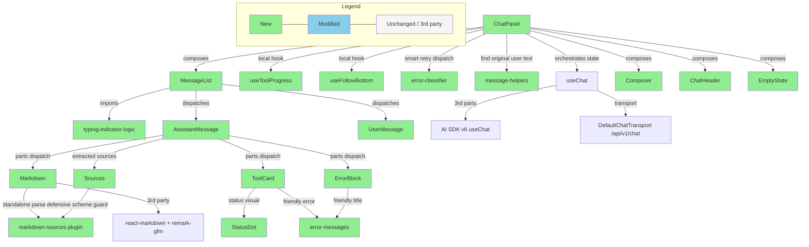

# Briefing — S3 Streaming Chat UI

## 1. Design Delta

> 全部 6 項 delta 已收斂為**已解決**，無需確認、無 blocker。語言策略、Markdown sources pipeline、Cursor placement、Composer chip-fill wiring 四個 design 偏離項目已由 user 決議並落地到 source artifacts；`models.ts` aborted type 與 V-1/V-2/V-3 contract gate 兩項屬於 plan 對 design 的補強，方向與 design intent 一致。

### 已解決

#### Cursor atom 位置：接受 block-level cursor placement

- **Design 原文**：Cursor 為「Streaming 時在 text 末尾的 blinking cursor」；Markdown organism 含「custom RefSup / Cursor renderer」— 暗示 Cursor 是透過 react-markdown component override 插入到 markdown AST 內部（text 末尾 token）。
- **實際情況**：Plan Task 4.2 的 Markdown.tsx snippet 直接把 `{isStreaming && <Cursor />}` 渲染在 `<ReactMarkdown>` 的 sibling 位置 — 也就是整個 markdown block 之外、之後的 DOM 節點。並未走 react-markdown component override 把 Cursor 注入到 AST 末端。
- **影響**：純段落 markdown 下視覺相同；若 markdown 結尾是 `<table>` / `<ul>` / `<pre>` 等 block element（streaming 中 table 常見於財務資料），cursor 會出現在 block 下方「另起一行」而非跟著最後一個 cell / list item / code line。
- **User 決議**：V1 接受 block-level cursor placement — 實作簡單，視覺差異侷限於 streaming 中含 table 的 case，可接受。未來如有用戶反饋，再升級為 custom rehype plugin 走 HAST tree 注入 cursor span。
- **Resolution**：已解決 — Plan Task 4.2 與 design.md 已 align 在 sibling-cursor 寫法。

#### Composer chip-fill wiring：接受 `forwardRef` + `useImperativeHandle` ref API

- **Design 原文**：design 只說 EmptyState 的 prompt chip 「點擊填入 input（不自動送出）」、`onPickPrompt(text)` callback。Composer 的 props 介面只列 textarea state，未說明如何接收外部 chip text。
- **實際情況**：Plan Task 4.6 為了讓 ChatPanel 能把 chip 點擊 propagate 到 Composer 內部 textarea state，必須讓 Composer 用 `forwardRef` + `useImperativeHandle` 暴露 `setValue` ref API，並由 ChatPanel 用 `composerRef.current?.setValue(text)` 呼叫。
- **影響**：Composer 從單純 `(props) => JSX` 變成 `forwardRef` 元件、新增 imperative API surface，偏離「props in / callback out」的 functional pattern。
- **User 決議**：V1 接受 ref API — design 沒給其他可行替代（lifting textarea state 到 ChatPanel 會把 ChatPanel 弄得更重），ref API 為合理 trade-off。未來如要重構，可在 V2 把 textarea state 上提到 ChatPanel。
- **Resolution**：已解決 — Plan Task 4.6 與 design.md Composer 段落已 align。

#### Markdown sources extraction 改採 defer-to-ready 策略（雙 parse + stateless 違反一次解掉）

- **Design 原文**：design.md「Markdown & Sources Pipeline」描繪的 pipeline 假設 `markdown-sources.ts` remark plugin 經由 react-markdown plugin chain 直接「回傳 extracted sources 給 Markdown organism」；Markdown 被描述為「無 state，但有 computational pipeline」。
- **實際情況**：`react-markdown` 不暴露 unified plugin 的 `file.data`，無法讓 plugin 把 `ExtractedSources` 回傳給 React 層。原 plan Task 4.2 用 standalone `extractSources(text)` 純函式 + react-markdown 雙 parse 解 unblock，代價是 streaming 中每個 text-delta 兩次 parse，且 AssistantMessage 被迫從 stateless 變成 `useState<ExtractedSources>` + `onExtractedSources` callback（違反 design「AssistantMessage 無 useState」principle）。
- **User 決議**：採 **defer-to-ready** 策略 — streaming 期間完全不 call `extractSources`，`[N]` 保留為純文字、Sources block 不渲染、definition 行暫時以 raw 顯示；stream 結束（status 離開 `streaming`）時 AssistantMessage 用 `useMemo` 一次性算出 sources，把 displayText + sources 傳給 stateless Markdown organism。
- **Resolution**：已解決 — 同一個 refactor 解掉雙 parse + stateless 違反兩個問題。同時 BDD scenarios S-md-04（URL chunk boundary）與 S-md-06（incremental label populate）已不再適用並從 bdd_scenarios.md 移除（由新增的 S-md-streaming-plain-text + S-md-ready-upgrade 兩個 scenario 取代，描述 defer-to-ready 的 streaming phase / ready phase behavior）；對應的 TC-unit-md-05 / TC-unit-md-07 保留為 `extractSources` 的 internal invariant unit tests（defensive malformed input + numeric sort），不再 1:1 對應 BDD。design.md「Markdown & Sources Pipeline」section 已改寫說明策略與 state table；implementation.md Task 2.5 / 4.2 / 4.4 已同步更新 snippets 與 test strategy mapping。

#### UI string language policy 由「繁中/英文 mixed」統一為 V1 English-only

- **Design 原文**：同一份 design.md 同時寫了兩種衝突指引：(1)「V1 UI 為英文（對齊 Q5 英文 prompt chips 決策），所有 user-facing error text 均為 user-friendly English」；(2)「V1 UI 混用（繁中主體、empty state 英文），不做 i18n framework」。Q5 本身只規定 prompt chips 為英文，沒指定 textarea placeholder / disclaimer / clear button label 的語言。
- **實際情況**：User 決議 V1 統一為 English-only；design.md 新增「UI String Language Policy」section 列出 canonical string 表（placeholder / disclaimer / clear button / tool state label / aria-label / chip text）全部 hardcoded 英文；backend-provided content（`data-tool-progress` message、assistant text body、tool output JSON）不翻譯。Implementation plan、prerequisites、BDD scenarios、verification plan 同步更新。
- **Resolution**：已解決 — 所有 artifacts 已 align，例如 Composer placeholder 改為 `"Ask about markets, companies, or filings..."`、disclaimer 改為 `"AI-generated responses may be inaccurate. Please verify important information."`、clear button label 改為 `"Clear conversation"`、tool success label 改為 `"Completed"`、aborted label 改為 `"Aborted"`。

#### `models.ts` 缺少 `'aborted'` ToolUIState 已被 plan 補上

- **Design 原文**：design.md「Models (`src/models.ts`)」段落 `ToolUIState` 列為 4 個值：`'input-streaming' | 'input-available' | 'output-available' | 'output-error'`，無 `'aborted'`。
- **實際情況**：同份 design 在「Streaming Event Handling」段落卻定義 `aborted` 為 frontend-only 第 4 個視覺狀態 — 兩段 design 自相矛盾。Plan Task 2.1 將 `ToolUIState` 擴成 5 個值（保留 `'input-streaming'` + 加 `'aborted'`）以解 type 衝突。
- **Resolution**：已解決 — Design 設計意圖明確（aborted 必為第 4 視覺狀態），只是 `models.ts` snippet 自相矛盾忘了同步；Plan 修正方向跟 design intent 一致。

#### V-1/V-2/V-3 contract verification 為 plan 補上的隱含驗證

- **Design 原文**：design 直接陳述 useChat v6 的行為假設（pre-stream error 時 user message 仍在 messages、`stop()` 為 graceful 不污染 status、S1 partial-turn regenerate 回 422），未提示需要事前驗證。
- **實際情況**：Plan Milestone 0 安排 3 個 BLOCKING contract verifications（V-1 curl probe + V-2/V-3 Vitest contract test），並明列「若 V-2 FAIL → ChatPanel 必須加 stash/restore」、「若 V-3 status==='error' → ChatPanel handleStop 需 wrap try-catch + 強制 setStatus」這類條件分支。
- **Resolution**：已解決 — Plan 顯式化了 design 對 SDK / backend 的隱含假設，並指明失敗時的補救路徑。建議 design 在「Backend Coordination Points」或新增「External Dependency Assumptions」段落 record 這 3 個假設來源，未來 V2 design 演進不會再次踩同一個坑。

---

## 2. Overview

本次將 S1 backend 的 SSE wire format 渲染成符合 mockup 的 dark-theme chat UI，採 atomic 6 層元件樹 + AI SDK v6 `useChat` + MSW URL-gated test infra，共拆為 **7 個 milestones、約 30 個 task**，覆蓋 **68 個 BDD scenarios**（56 illustrative + 12 journey），最大風險是 **M0 三個 contract verification** 任一失敗都會 invalidate design 對 useChat v6 與 S1 backend 的假設、整條 implementation 路線需 revisit；次大風險是 **XSS scheme allowlist 三層 defense**（lib unit + Sources molecule + e2e-tier0）的安全契約必須一致（Markdown sources 已改 defer-to-ready 策略消除雙 parse 開銷）。

---

## 3. File Impact

### (a) Folder Tree

```text
frontend/
├── index.html                                  (modified — <html class="dark">)
├── vite.config.ts                              (modified — server.proxy /api → :8000)
├── playwright.config.ts                        (modified — testDir → ./tests/e2e)
├── package.json                                (modified — deps swap, fonts + react-markdown + msw + radix peers)
├── vercel.json                                 (new — production rewrites with REPLACE_ME placeholder)
├── public/
│   └── mockServiceWorker.js                    (new — pnpm dlx msw init public/, commit)
├── src/
│   ├── main.tsx                                (modified — enableMocking() URL gate)
│   ├── App.tsx                                 (modified — mount <ChatPanel/>)
│   ├── index.css                               (modified — font imports + .dark scope full S3 vars)
│   ├── models.ts                               (new — domain types)
│   ├── lib/
│   │   ├── error-messages.ts                   (new — toFriendlyError, 14 mapping rows)
│   │   ├── error-classifier.ts                 (new — classifyError for smart retry dispatch)
│   │   ├── message-helpers.ts                  (new — findOriginalUserText for 422→sendMessage smart retry fallback)
│   │   ├── markdown-sources.ts                 (new — remark plugin, scheme allowlist, dedup)
│   │   ├── typing-indicator-logic.ts           (new — pure derivation function)
│   │   └── __tests__/*.test.ts                 (new — unit tests)
│   ├── hooks/
│   │   ├── useFollowBottom.ts                  (new — 100px threshold + force override)
│   │   ├── useToolProgress.ts                  (new — progress map with functional setState)
│   │   └── __tests__/*.test.ts                 (new — hook tests)
│   ├── components/
│   │   ├── primitives/                         (new — shadcn add textarea/scroll-area/collapsible/empty/alert/badge — no tests, immutable)
│   │   ├── atoms/                              (new — 6 trivial wrappers; behavior tested at organism/template layer)
│   │   ├── molecules/
│   │   │   ├── {SourceLink,ToolRow,ToolDetail,UserMessage,Sources}.tsx  (new — 5 molecules)
│   │   │   └── __tests__/Sources.test.tsx      (new — XSS 2nd defense)
│   │   ├── organisms/
│   │   │   ├── {ChatHeader,AssistantMessage,ToolCard,Markdown,ErrorBlock,Composer,EmptyState}.tsx  (new — 7 organisms)
│   │   │   └── __tests__/*.test.tsx            (new — 6 organism tests, all except Markdown which is verified via AssistantMessage)
│   │   ├── templates/
│   │   │   ├── MessageList.tsx                 (new — viewport + follow-bottom + dispatch)
│   │   │   └── __tests__/MessageList.test.tsx  (new — TC-comp-typing-01..02 truth table)
│   │   └── pages/
│   │       ├── ChatPanel.tsx                   (new — stateful orchestrator)
│   │       └── __tests__/ChatPanel.integration.test.tsx  (new — TC-int-retry/aborted/stop-clear)
│   └── __tests__/                              (cross-cutting only — NOT a missing-test surface)
│       ├── contract/                           (new — V-2 / V-3 useChat contract tests)
│       └── msw/                                (new — handlers + browser + ~19 fixtures)
├── tests/e2e/                                  (new dir — replaces frontend/e2e/)
│   ├── security/xss-source-link.spec.ts        (new — TC-e2e-xss-01 @security)
│   ├── smoke/{chat-tool,clear-session,app-shell}.spec.ts (new — @smoke)
│   └── critical/{error-recovery,stop-preserves-partial,refresh-invariant}.spec.ts (new — @critical)
└── e2e/                                        (deleted — moved to tests/e2e/)

artifacts/current/
└── verification_results_streaming_chat_ui.md   (new — M0 起逐步寫入 V-1/V-2/V-3 + post-impl 結果)
```

### (b) Dependency Flow



---

## 4. Task 清單

| Milestone | Task | 做什麼 | 為什麼 |
|---|---|---|---|
| **M0** Pre-coding contract gate | 0.1 V-1 | Curl probe S1 partial-turn regenerate 行為 | 鎖死 smart retry routing 假設（422 vs 200）|
| | 0.2 V-2 | Vitest contract test：useChat pre-stream HTTP 500 後 user message lifecycle | 鎖死「optimistic append」假設，否則 ChatPanel 需 stash/restore |
| | 0.3 V-3 | Vitest contract test：useChat.stop() abort semantic | 鎖死「stop → status=ready」假設，否則 handleStop 需特殊處理 |
| **M1** Test infra | 1.1 | 安裝 deps + MSW infra + Playwright dir 重整 + 5 個 priority fixtures + Vite proxy + dark class | 後續所有 layer 的前置條件 |
| **M2** Foundation libs + hooks | 2.1 | `models.ts` domain types | 集中 type，後續所有 layer 共用 |
| | 2.2 | `lib/error-messages.ts`（14 mapping rows）| 唯一 user-facing error string SoT，禁止 component 自寫 |
| | 2.3 | `lib/error-classifier.ts` | Smart retry routing 依賴 |
| | 2.4 | `lib/message-helpers.ts` | 422→sendMessage 降級時找原 user text |
| | 2.5 | `lib/markdown-sources.ts` remark plugin | First-wins dedup + scheme allowlist + orphan handling + numeric sort（XSS critical）|
| | 2.6 | `lib/typing-indicator-logic.ts` | TypingIndicator visibility 純函式 derivation |
| | 2.7 | `useToolProgress` hook | Progress Record + functional setState 防 stale closure |
| | 2.8 | `useFollowBottom` hook | 100px threshold + force override（per Q-USR-10）|
| **M3** Atoms + Molecules + Theme | 3.1 | `index.css` 主題 + 字型重寫 | S3 dark theme 完整 oklch 變數 + Inter/JetBrains Mono/Noto Sans TC |
| | 3.2 | 6 atoms（StatusDot / RefSup / Cursor / TypingIndicator / PromptChip / RegenerateButton）| Leaf DOM contracts，trivial wrappers |
| | 3.3 | 5 molecules（SourceLink / ToolRow / ToolDetail / UserMessage / Sources）| Stateless 結構性組合 + Sources 雙層 XSS 防線 |
| **M4** Organisms + Template | 4.1 | `ChatHeader` organism | 標題 + clear button (empty 時 disabled) |
| | 4.2 | `Markdown` organism | react-markdown wrapper + extractSources callback + Cursor placement |
| | 4.3 | `ToolCard` organism | 4 視覺狀態（含 aborted）+ Collapsible expand |
| | 4.4 | `AssistantMessage` organism | parts dispatcher + RegenerateButton visibility gating |
| | 4.5 | `ErrorBlock` organism | Pre-stream + mid-stream variant + friendly title + retriable gating + 200 字截斷 |
| | 4.6 | `Composer` organism | textarea + send/stop toggle + double-submit guard + chip ref API |
| | 4.7 | `EmptyState` organism | Welcome card + 4 prompt chips（onPickPrompt callback）|
| | 4.8 | `MessageList` template | Viewport + scroll + TypingIndicator phantom slot + follow-bottom |
| **M5** ChatPanel + integration | 5.1 | ChatPanel basic wiring + App.tsx mount | 唯一 stateful orchestrator |
| | 5.2 | Smart retry dispatch（422-on-regenerate fallback）| Q-USR-7 反 422 loop |
| | 5.3 | Aborted tools propagation + handleStop | Q-USR-3 灰色 aborted 狀態 |
| | 5.4 | Stop+clear race + 補剩餘 ~16 個 MSW fixtures | Atomic reset + E2E fixture coverage |
| **M6** E2E Tier 0 | 6.1 | 6 個 Playwright Tier 0 tests（@security + @smoke + @critical）| CI gate 上限，全部 deterministic with MSW |
| **M7** Post-impl verification | 7.1 | BDD Real Backend Verification（V2-01..V2-09）| Real LLM/network 抓 mock 抓不到的 wire format drift |
| | 7.2 | BDD Visual Mockup Comparison（V3-01..V3-08）| Browser-Use agent vs storyboard HTML |
| | 7.3 | Real Interaction Feel reports（V4-01..V4-05）| Qualitative agent 描述 |
| | 7.4 | Manual Behavior Tests（MBT-01..MBT-09）| 人工跑 edge case |
| | 7.5 | User Acceptance Tests（UAT-01..UAT-05）| PO / reviewer 驗收 |

---

## 5. Behavior Verification

### Layer Legend

| Icon | Layer | Where it runs |
|---|---|---|
| 🧪 | `unit` / `component` / `hook` / `integration` / `e2e-tier0` | **Implementation 階段**：Vitest watch + 每 PR Playwright Tier 0（CI gate）。每個 Task 完成後立即跑對應 BDD scenarios，未通過必須 fix that task 才能繼續下一個 Task。 |
| 🌐 | `bdd-real` | **BDD end-to-end loop**：Browser-Use CLI + real S1 backend，post-impl 一次性 |
| 🎨 | `bdd-visual` | **BDD end-to-end loop**：Browser-Use CLI + storyboard 視覺比對，post-impl 一次性 |
| 🖐️ | `manual-mbt` | **Release 前**：人工跑 manual behavior test edge case |
| 🔍 | `manual-uat` | **PR Review 時**：PO / reviewer 驗收 |

> 共 **56 illustrative scenarios（S-\*）** + **12 journey scenarios（J-\*）** = **68 scenarios**，涵蓋 **10 features**。
>
> - **§5.1** 列出 56 個 implementation-phase scenarios — 按 **Task gate** 組織。每個 Task 完成後 reviewer 可直接看到該 Task 該驗的 scenarios，failed 必須直接修該 Task 才能繼續下一個 Task。
> - **§5.2** 列出 12 個 post-impl deferred scenarios + 5 個 UAT — 按 **Task 7.x 機制** 組織。
>
> 部分 scenario 跨多 Task gate（例如 S-md-03 走 unit + component + e2e 三層 XSS defense），會在最早 gate 處列出**完整 body**，後續 task 用**一行 cross-ref** 指回。Obsidian 中所有 callout `[!example]-` 預設折疊，點擊展開。

---

### 5.1 Implementation-Phase Verifications（按 Task gate 組織）

> 🧪 layer scenarios。每個 callout = 一個 Task gate；展開後是該 Task 完成後該驗的 scenarios。**Task gate fail → 修該 Task → 重跑 → 全綠才繼續下一個 Task**。

#### M0 — Pre-coding contract gates

> [!example]- **Task 0.2 — V-2 contract test (`TC-int-v2-01`)** — useChat pre-stream HTTP 500 後 user message lifecycle
> 鎖死「optimistic append」假設。若 V-2 FAIL → ChatPanel 必須加 stash/restore 邏輯。
>
> **S-err-02** 🧪 — Pre-stream error 時 user bubble 保留在 messages array，retry 後對話串中只剩一則 user bubble（不重複）
> - Source verification: integration `TC-int-v2-01` contract test
> - Additional depth: Task 6.1 e2e (`TC-e2e-smoke-error-01`)

> [!example]- **Task 0.3 — V-3 contract test (`TC-int-v3-01`)** — useChat.stop() abort semantic
> 鎖死「stop → status=ready」假設。若 V-3 status==='error' → handleStop 需 wrap try-catch + 強制 setStatus。
>
> **S-stop-02** 🧪 — Stop 後即使 stop() promise reject（例如 fetch 已 drop），useChat.status 仍轉為 ready，error 保持 null，不被 AbortError 污染
> - Source verification: integration `TC-int-v3-01` contract test

#### M2 — Foundation libs + hooks

> [!example]- **Task 2.2 — `lib/error-messages.ts` (`TC-unit-err-01..04`)** — friendly English error mapping
>
> **S-err-01** 🧪 — Pre-stream HTTP error 顯示 friendly English distinct messaging（per error class）+ Retry 按鈕依 retriable gating
> - Table-driven 6 rows: 422 / 404 / 409 / 500 / network offline / 5xx unknown
> - 對應 friendly English title 集中於 `lib/error-messages.ts`，**禁止**直接顯示 backend raw
> - Source verification: unit `TC-unit-err-01..04`
> - Additional depth: Task 4.5 ErrorBlock component (`TC-comp-error-01`)
>
> **S-tool-02** 🧪 — Tool error inline 呈現 friendly translated text，**不**直接顯示 backend raw 訊息
> - backend 回 `tool-output-error` 帶 raw `"API rate limit exceeded"` → 🔴 紅點 + friendly title `"Too many requests. Please wait a moment and try again."`；展開後 ERROR DETAIL block 顯示 backend raw 供 debug
> - Source verification: unit `TC-unit-err-03` friendly mapping
> - Additional depth: Task 4.3 ToolCard component (`TC-comp-toolcard-01`)

> [!example]- **Task 2.5 — `lib/markdown-sources.ts` (`TC-unit-md-01..07`)** — `extractSources` pure function + scheme allowlist
>
> **S-md-01** 🧪 🌐 — Reference definition 抽取為 Sources block：有 title 顯示 title、無 title 顯示 hostname fallback
> - Table-driven 3 rows：`Reuters: NVIDIA...`（with title）/ `bloomberg.com`（hostname fallback）/ `CNBC: NVDA news`（with title）
> - 底部不出現 raw `[N]: url` 文字列；正文 `[N]` 為可點 RefSup（在 ready phase）
> - Source verification: unit `TC-unit-md-01/02`
> - Additional depth: Task 3.3 Sources molecule (`TC-comp-sources-01`)；post-impl Task 7.1 bdd-real (V2-04)
>
> **S-md-02** 🧪 — Duplicate reference label first-wins dedup：兩個 `[1]: ...` 只顯示第一個，DOM 中 `id="src-1"` 唯一
> - Source verification: unit `TC-unit-md-03` first-wins dedup
>
> **S-md-03** 🧪 — 非 http(s) URL（`javascript:` / `mailto:`）不得渲染為可點 `<a>` 元素，整個 Markdown organism 不因此 throw（XSS critical）
> - 三層 defense：lib unit (本 task) + Sources molecule (Task 3.3) + E2E tier 0 (Task 6.1)
> - Source verification: unit `TC-unit-md-04`
> - Additional depth: Task 3.3 Sources molecule (`TC-comp-sources-02`) + **Task 6.1 e2e (`TC-e2e-xss-01` @security)**
>
> **S-md-05** 🧪 — Orphan reference 處理：body 孤兒 `[3]` 顯為純文字、def 孤兒仍顯示在 Sources block
> - Source verification: unit `TC-unit-md-06` per Q-USR-9

> [!example]- **Task 2.7 — `useToolProgress` hook (`TC-hook-progress-01..02`)** — parallel routing + functional setState
>
> **S-tool-04** 🧪 — 單一 tool 收到 `data-tool-progress` 時 ToolCard label 即時更新
> - backend 發 `data-tool-progress {id: "tc_j1", data: {message: "Fetching NVDA quote..."}}` → ToolCard label 從 `"Calling yfinance..."` 更新為 `"Fetching NVDA quote..."`
> - Source verification: hook `TC-hook-progress-02` functional setState 防 stale closure
>
> **S-tool-05** 🧪 — 並列 tool 的 progress 路由完全獨立，progress for tc_i2 不污染 tc_i1 的 label
> - 同時 running tc_i1 (yfinance) + tc_i2 (news_search)；progress 給 tc_i2 → 只 tc_i2 ToolCard 更新；tc_i1 繼續顯示原 label
> - Source verification: hook `TC-hook-progress-01` parallel routing isolation

> [!example]- **Task 2.8 — `useFollowBottom` hook (`TC-hook-followbottom-01`)** — 100px threshold + force override
>
> **S-scroll-01** 🧪 — 貼底時自動跟隨新 content，不出現「距底 50px drift 卡住」現象
> - Source verification: hook `TC-hook-followbottom-01`
>
> **S-scroll-02** 🧪 — 滾離底部時不打斷 user 閱讀，新 text-delta 不 auto-scroll viewport
> - Source verification: hook `TC-hook-followbottom-01`
>
> **S-scroll-03** 🧪 — 重回底部（< 100px）時恢復 follow-bottom 追蹤
> - Source verification: hook `TC-hook-followbottom-01`
>
> **S-scroll-04** 🧪 — 送新訊息時 force-follow 優先於 user scroll intent，立即強制 scroll 到底
> - per Q-USR-10
> - Source verification: hook `TC-hook-followbottom-01`
>
> **S-scroll-05** 🧪 🖐️ — Keyboard scroll (PageUp / Space / Arrow) 正確打斷 follow-bottom；End key 跳底後 follow-bottom 重啟
> - Source verification: hook `TC-hook-followbottom-01` variant
> - Additional depth: Task 7.4 manual-mbt MBT-09 keyboard a11y
>
> **S-err-09** 🧪 🎨 — ErrorBlock 出現時若 follow-bottom 為 true 則自動 scroll 到可見位置；若 user 在中段閱讀則保留位置
> - Source verification: hook `TC-hook-followbottom-01` variant
> - Additional depth: Task 7.2 bdd-visual V3-05

#### M4 — Organisms + Template

> [!example]- **Task 4.1 — ChatHeader organism (`TC-comp-header-01`)**
>
> **S-clear-02** 🧪 — EmptyState 時 ChatHeader 的 `"Clear conversation"` button 為 disabled
> - Source verification: component `TC-comp-header-01`

> [!example]- **Task 4.3 — ToolCard organism (`TC-comp-toolcard-01..02`)** — 4 視覺狀態 + collapsible expand
>
> **S-tool-01** 🧪 🎨 — Tool 從 🟠 running 轉 🟢 success 時 dot 顏色 + label 同步切換、可展開查 INPUT/OUTPUT JSON
> - backend 依序發 `tool-input-available` → `tool-output-available` → 🟠 amber pulsing `"Calling yfinance..."` → 🟢 綠點 `"Completed"` → 點 header 展開 INPUT/OUTPUT JSON
> - Source verification: component `TC-comp-toolcard-01`
> - Additional depth: Task 7.2 bdd-visual V3-02
>
> **S-tool-06** 🧪 — Tool success 後 progress 文字不沿用，label 改顯示 generic `"Completed"`
> - tc_l1 曾收過 progress `"Fetching quote..."` → backend 發 `tool-output-available` → ToolCard 變 🟢 success、label 改顯示 `"Completed"`（不沿用 progress 文字）
> - Source verification: component `TC-comp-toolcard-01` variant
>
> **S-tool-07** 🧪 — Success ToolCard 點擊 header 展開可看 INPUT / OUTPUT JSON，各帶 INPUT/OUTPUT badge label
> - Source verification: component `TC-comp-toolcard-02` expand state stable
>
> **S-tool-09** 🧪 — Error ToolCard 點擊 header 展開可看 INPUT JSON 區塊
> - Source verification: component `TC-comp-toolcard-02` variant
>
> **S-regen-05** 🧪 — Regenerate 後新 ToolCard 預設 collapsed，不繼承舊 progress 文字 / 舊 expand state，即使 toolCallId 相同
> - Source verification: component `TC-comp-toolcard-02` variant

> [!example]- **Task 4.4 — AssistantMessage organism (`TC-comp-assistant-01..03`)** — parts dispatcher + RegenerateButton visibility + defer-to-ready
>
> **S-tool-03** 🧪 — 並列 tools 各自獨立呈現、render 順序穩定（由 arrival order 決定）、互不干擾 user 展開狀態
> - backend 依序發 tc_i1 input → tc_i2 input → tc_i1 success → tc_i2 error → 兩張獨立 ToolCard、tc_i1 🟢 / tc_i2 🔴、order stable、user 對 tc_i1 的展開不被 tc_i2 後續事件重設
> - Source verification: component `TC-comp-assistant-01` parts dispatch
>
> **S-md-streaming-plain-text** 🧪 — Streaming 期間 reference 顯示為純文字 `[N]`、Sources block 不渲染、definition 行以 raw markdown 暫時可見（defer-to-ready 策略 streaming phase）
> - Given：assistant 正在串流，已接收 ``NVDA Blackwell GPU 出貨創新高 [1]。\n\n[1]: https://reuters.com "Reuters"``
> - Then：`[1]` 為純文字不是 RefSup、底部無 Sources block、definition 行以 raw 顯示、trailing Cursor 於 markdown block 末端閃爍
> - Source verification: component `TC-comp-assistant-01` defer-to-ready streaming phase
>
> **S-md-ready-upgrade** 🧪 — Stream 結束後 AssistantMessage 一次性 `useMemo` 算 sources，`[N]` 升級為 RefSup、definition 行 strip、Sources block 出現
> - When：status 從 `streaming` 轉 `ready`
> - Then：`[1]` 升級為 `<RefSup label="1" href="#src-1">`、底部出現 Sources block「1 · Reuters」、displayText strip 掉 definition 行、Cursor 消失
> - Source verification: component `TC-comp-assistant-01` defer-to-ready ready phase
>
> **S-err-05** 🧪 — Mid-stream error 保留已接收 partial text + 已抽取的 Sources block（ready phase 後），inline ErrorBlock 出現在 assistant message 內
> - Source verification: component `TC-comp-assistant-01` mid-stream error variant
>
> **S-err-06** 🧪 — Mid-stream error 後已成功的 Tool 不被降級，ToolCard 維持 🟢 success、ErrorBlock 出現在 ToolCard 下方
> - Source verification: component `TC-comp-assistant-02`
>
> **S-regen-02** 🧪 — 只有最後一則 assistant message 顯示 RegenerateButton，前面歷史訊息皆無
> - Source verification: component `TC-comp-assistant-03`
>
> **S-regen-03** 🧪 — Streaming 進行中**所有** assistant messages 皆不顯示 RegenerateButton，避免 stale button 觸發 422
> - 依 Q-USR-1 pin
> - Source verification: component `TC-comp-assistant-03`

> [!example]- **Task 4.6 — Composer organism (`TC-comp-composer-01..03`)** — textarea + send/stop + double-submit guard + chip ref API
>
> **S-stream-04** 🧪 — 串流中 user 在 textarea 打字的 in-progress 內容不被 finish 事件清除
> - Given：assistant 正在串流 + Alice 在 textarea 輸入「and compare to Q1」
> - When：stream 自然完成（status 轉 ready）
> - Then：textarea 內容仍精確保留「and compare to Q1」、focus / cursor 位置未重設
> - Source verification: component `TC-comp-composer-02` — 反 `useEffect([status], setText(''))` anti-pattern
>
> **S-stream-05** 🧪 — Rapid 連按 Enter 兩次只產生一則 user bubble、只發一個 POST
> - Given：Bob 處於 status === 'ready'
> - When：輸入訊息並在 80ms 內連按 Enter 兩次
> - Then：只出現一則 user bubble、network 只有一個 POST、第二次 Enter 被 status guard no-op
> - Source verification: component `TC-comp-composer-01` double-submit guard
>
> **S-regen-04** 🧪 — 點擊 Regenerate 不清空 Composer textarea 內 user 正在打的 in-progress 輸入
> - Source verification: component `TC-comp-composer-02` textarea preservation
>
> **S-empty-02** 🧪 — 第 2 次點擊 prompt chip 覆蓋（last-wins）既有輸入，**不**做 append 合併
> - per Q-USR-2
> - Source verification: component `TC-comp-composer-03` chip overwrite via setValue ref API

> [!example]- **Task 4.7 — EmptyState organism (`TC-comp-empty-01`)**
>
> **S-empty-01** 🧪 🎨 — 點擊 prompt chip 立即填入 textarea 完整 chip 文字，**不**自動送出，textarea focus 移入末尾
> - Source verification: component `TC-comp-empty-01`
> - Additional depth: Task 7.2 bdd-visual V3-01

> [!example]- **Task 4.8 — MessageList template (`TC-comp-typing-01..02`)** — TypingIndicator visibility truth table
>
> **S-stream-06** 🧪 — 收到 transient progress 時 TypingIndicator 繼續顯示（transient sidecar 不算 "rendered part"）
> - Given：Frank 送出訊息，status === 'submitted'
> - When：第一個 event 是 `data-tool-progress`（transient sidecar）
> - Then：TypingIndicator 仍顯示（messages array 內無任何 assistant rendered part）、不出現 ghost ToolCard
> - Source verification: component `TC-comp-typing-02`
>
> **S-stream-07** 🧪 — Error 是 rendered part，TypingIndicator 必須立即隱藏，不出現「ErrorBlock 旁邊還在 typing」的視覺衝突
> - Given：Frank 送出訊息，status === 'streaming'
> - When：backend 發 start → 緊接 error event（無 text）
> - Then：error part append 到 last assistant message、TypingIndicator 消失、inline ErrorBlock 顯示
> - Source verification: component `TC-comp-typing-01` truth table
>
> **S-stream-08** 🧪 — status === 'ready' 且最後一筆已是 assistant message 時不顯示 TypingIndicator
> - Source verification: component `TC-comp-typing-01` truth table
>
> **S-err-03** 🧪 — Retry 後 ErrorBlock 立即從 DOM 消失，不會跟 TypingIndicator 並存
> - Source verification: component `TC-comp-typing-01` state derivation

#### M5 — ChatPanel + integration

> [!example]- **Task 5.2 — Smart retry dispatch (`TC-int-retry-01`)** — 422-on-regenerate fallback
>
> **S-regen-01** 🧪 — 點擊 RegenerateButton 後該 assistant message 立即移除 + 重新進入 streaming + Composer button 切為 Stop
> - Source verification: integration `TC-int-retry-01` setup
>
> **J-regen-01** 🧪 — 完整 regenerate recovery flow：舊 assistant message 與其 ToolCard / Sources 一併移除，新 stream 從頭呈現
> - Source verification: integration `TC-int-retry-01`
>
> **S-err-04** 🧪 — Smart retry：regenerate 422 自動降級為 `sendMessage(originalUserText)`，避免無限 422 loop
> - per Q-USR-7
> - Source verification: integration `TC-int-retry-01` smart retry dispatch
>
> **S-err-08** 🧪 — Mid-stream error inline retry 移除整個 assistant turn（含 partial text + Sources + aborted ToolCard + ErrorBlock）後從頭 stream
> - Source verification: integration `TC-int-retry-01` variant
>
> **J-err-02** 🧪 — Mid-stream error recovery：partial text + aborted ToolCard + inline ErrorBlock 完整被替換為新的完整 assistant message
> - Source verification: integration `TC-int-retry-01` variant

> [!example]- **Task 5.3 — Aborted tools propagation (`TC-int-aborted-01`)** — Q-USR-3 灰色 aborted 狀態
>
> **S-err-07** 🧪 — Mid-stream error 時仍 input-available 的 running ToolCard 轉為 aborted 灰色狀態（不再 pulsing）
> - per Q-USR-3
> - Source verification: integration `TC-int-aborted-01` abortedTools propagation
>
> **S-stop-03** 🧪 — Stop 時 running ToolCard 從 🟠 轉 aborted 灰色狀態 + 殘留 progress 文字被清除
> - per Q-USR-3
> - Source verification: integration `TC-int-aborted-01` variant

> [!example]- **Task 5.4 — Stop+clear race (`TC-int-stop-clear-01`)** — atomic reset
>
> **S-clear-01** 🧪 — 對話進行中清除 → messages 清空 + toolProgress 清空 + EmptyState 出現 + chatId 換新 UUID
> - Source verification: integration `TC-int-stop-clear-01`
> - Additional depth: Task 6.1 e2e (`TC-e2e-smoke-clear-01` @smoke)
>
> **S-clear-04** 🧪 — Streaming 中 clear → graceful abort + 舊 stream 的 late chunks 不渲染到新 EmptyState
> - per Q-USR-5
> - Source verification: integration `TC-int-stop-clear-01` atomic reset
>
> **S-stop-01** 🧪 — Stop 中止 text 串流：3 段已接收文字保留 + Cursor 立即消失 + Composer 1-frame 內切回 Send + textarea 重新可輸入
> - Source verification: integration `TC-int-stop-clear-01`
> - Additional depth: **Task 6.1 e2e (`TC-e2e-stop-01` @critical)**

#### M6 — E2E Tier 0（Task 6.1）

> 6 個 Playwright Tier 0 tests 全跑 deterministic with MSW。XSS @security 為 hard CI gate；@smoke + @critical 為 PR gate。

> [!example]- **`TC-e2e-xss-01` @security** — XSS scheme allowlist 第三防線（real browser dialog listener）
>
> **S-md-03** 🧪 — _(cross-ref，完整 body 在 Task 2.5 callout)_ — 本 task 為三層 defense 的最後一道，real browser 監聽 dialog event 確認 `javascript:` URL 不會觸發 alert

> [!example]- **`TC-e2e-smoke-tool-01` @smoke** — Tool + text 混合 happy path
>
> **S-stream-02** 🧪 🌐 — Tool 先於 text 的混合回覆中，TypingIndicator 不會跟 ToolCard 同時顯示
> - Given：Bob 處於 EmptyState
> - When：輸入「幫我查 NVDA 現價」並按 Send
> - Then：user bubble + 短暫 TypingIndicator → tool-input-available 到達時 TypingIndicator 消失改為 🟠 running ToolCard → tool 完成轉 🟢 success → assistant 文字逐字出現
> - Source verification: e2e `TC-e2e-smoke-tool-01`
> - Additional depth: Task 7.1 bdd-real (V2-02)
>
> **J-stream-02** 🧪 — Tool + text 混合端到端：tool lifecycle 跟 text streaming 在同一 assistant turn 正確並存
> - 觸發 tool 查詢的問題 → tool 執行 → tool 完成 → text 串流 → finish；user 依序看到 typing dots → 🟠 running → 🟢 success → 逐字 text → finish
> - Source verification: e2e `TC-e2e-smoke-tool-01`

> [!example]- **`TC-e2e-smoke-error-01` @critical** — Pre-stream error → retry full recovery
>
> **J-err-01** 🧪 — Pre-stream error 完整 recovery：送出 → error → retry → 成功，最終對話串中只有一則 user bubble + 一則完整 assistant message
> - Source verification: **e2e `TC-e2e-smoke-error-01` @critical**
>
> **S-err-02** 🧪 — _(cross-ref，完整 body 在 Task 0.2 callout)_ — 本 task 為 e2e end-to-end smoke，覆蓋 V-2 contract 的真實瀏覽器層

> [!example]- **`TC-e2e-smoke-clear-01` @smoke** — Clear conversation atomic reset
>
> **J-clear-01** 🧪 — 對話 → 清除 → 新對話的完整 session reset flow，新 stream context 不反映先前對話
> - Source verification: e2e `TC-e2e-smoke-clear-01` @smoke
>
> **S-clear-01** 🧪 — _(cross-ref，完整 body 在 Task 5.4 callout)_ — 本 task 為 e2e end-to-end smoke

> [!example]- **`TC-e2e-stop-01` @critical** — Stop preserves partial
>
> **S-stop-04** 🧪 — Submitted 狀態下（尚無 SSE event）按 Stop 仍保留 user bubble、不出現 ghost assistant、不出現 ErrorBlock
> - Source verification: **e2e `TC-e2e-stop-01` @critical**
>
> **J-stop-01** 🧪 — Stop + compose new question 完整 flow：partial 保留可讀、新 question 從新 user bubble 開始、全程無 blocking
> - Source verification: **e2e `TC-e2e-stop-01` @critical**
>
> **S-stop-01** 🧪 — _(cross-ref，完整 body 在 Task 5.4 callout)_ — 本 task 為 e2e end-to-end smoke

> [!example]- **`TC-e2e-refresh-01` @critical** — Refresh = 新對話 invariant
>
> **S-cross-01** 🧪 — Browser refresh 生成新 chatId、舊對話消失（refresh = 新對話 invariant，per design Q2）
> - Source verification: **e2e `TC-e2e-refresh-01` @critical**
>
> **J-cross-01** 🧪 — Refresh 在對話中段執行的完整 recovery flow：無 error、無殘留、新對話完全獨立
> - Source verification: e2e `TC-e2e-refresh-01`

---

### 5.2 Post-Implementation Deferred Verifications（按 Task 7.x 機制組織）

> 不適合 Vitest / Playwright deterministic test 的 scenarios — 必須在 implementation 全部結束後跑。**這是 Browser-Use agent / 人工 / PO 的責任**，不在 implementation TDD 階段完成。

#### Task 7.1 — bdd-real（Browser-Use CLI + real S1 backend）

> [!example]- **V2-01..09** — Real LLM/network 抓 wire format drift（Browser-Use agent 跑 prompt + 觀察 DOM）
>
> **S-stream-01** 🌐 🎨 — 純 text 回覆從 send 到 finish 期間：user bubble → TypingIndicator → 逐字 markdown + cursor → finish 後 cursor 消失 → Composer 切回 Send
> - Given：Alice 處於 EmptyState
> - When：輸入「NVDA 最近營收狀況？」並按 Send
> - Then：依序看到 user bubble、3 dots typing、逐字 markdown 配 trailing Cursor、finish 後 Cursor 消失、Composer 切回 Send
> - Source verification: bdd-real V2-01 + bdd-visual V3-08
>
> **S-stream-03** 🌐 — 純 tool 查詢無後續 text 的 stream 完成後 Composer 仍正確切回 Send
> - Given：Carol 處於 EmptyState
> - When：送出純工具查詢（backend 只回 tool events + finish，無 text-delta）
> - Then：ToolCard running → success；finish 一到 Composer button 切回 Send
> - 需 POST-CODING 找到能讓 LLM 只 call tool 不寫 text 的 prompt
> - Source verification: bdd-real V2-03
>
> **J-stream-01** 🌐 🎨 — Pure text 回答端到端：send → SSE stream → text-delta → finish → ready 整條 pipeline 對使用者可感知
> - 一位新 user 輸入無工具需求的開放問題並按 Send → 看到 typing dots → 逐字 markdown → trailing Cursor → finish 後 Composer 回 Send
> - Source verification: bdd-real V2-07 + bdd-visual
>
> **J-tool-01** 🌐 — 並列 tools 完整 lifecycle：兩 tool 不同步進度 + 一個成功一個錯誤 + user 展開查 INPUT，全部正確隔離
> - Source verification: bdd-real V2-08
>
> **S-clear-03** 🌐 — 清除後立即送新訊息使用新 chatId，backend 視為新 conversation（無歷史 context 洩漏）
> - Source verification: bdd-real V2-06 backend chatId isolation
>
> **J-empty-01** 🌐 — Onboarding via prompt chip：chip 填入 → 編輯 → send → assistant 正常回覆
> - Source verification: bdd-real V2-09

#### Task 7.2 — bdd-visual（Browser-Use CLI + storyboard / wireframe HTML）

> [!example]- **V3-01..08** — 視覺比對（Browser-Use agent vs `S3_state_storyboard.html` snapshots）
>
> **S-md-07** 🎨 — RefSup 點擊跳轉至 ScrollArea viewport 內對應 anchor，document.scrollTop 不變（侷限在 ScrollArea 內部）
> - Source verification: bdd-visual V3-04
>
> **S-md-08** 🎨 — Markdown 隨 text-delta 增量呈現、結尾跟 blinking Cursor、finish 後 Cursor 消失
> - Source verification: bdd-visual V3-03 streaming markdown + cursor visual
>
> **J-md-01** 🎨 — 長回答端到端：streaming markdown + Sources populate + RefSup 跳轉的完整 reading experience
> - Source verification: bdd-visual V3-06
>
> **J-scroll-01** 🎨 — 多輪對話 scroll lifecycle：滑上去讀歷史 + 送新問題自動追蹤的完整互動
> - Source verification: bdd-visual V3-07

#### Task 7.4 — manual-mbt（release 前手工 edge case）

> [!example]- **MBT-01..09** — 人工跑 manual behavior test
>
> **S-tool-08** 🖐️ — 大型 OUTPUT JSON（500KB sec_10k）展開不 freeze 主執行緒、stop button 仍 responsive、textarea 仍可輸入
> - Source verification: manual-mbt MBT-04
>
> **S-cross-02** 🖐️ — Browser back/forward 不重建舊對話，行為與 refresh 一致
> - Source verification: manual-mbt MBT-08

#### Task 7.5 — manual-uat（PR Review 時 PO/reviewer 驗收）

> 5 個 UAT 來自 verification_plan §6，由 Product Owner / reviewer 在 PR Review 時手動驗收。**這部分是 reviewer 的責任** — 不在 implementation TDD 階段完成。

> [!example]- **UAT-01 — Streaming chat 整體感受** 🔍
>
> **Acceptance Question**：整個 streaming chat 體驗是否流暢、可信、具備 ChatGPT-level polish？
>
> **Steps**：跑純 text / tool / references 三類 prompt + 嘗試 Stop / Regenerate / Clear + 觸發一次 error 場景

> [!example]- **UAT-02 — Empty state 與新 user onboarding** 🔍
>
> **Acceptance Question**：新 user 首次進入能否透過 prompt chips 順利開始對話？
>
> **Steps**：fresh open → 閱讀 welcome 文案 → click 各 chip 觀察填入 → 編輯後 send

> [!example]- **UAT-03 — Tool card 展開體驗** 🔍
>
> **Acceptance Question**：用戶能否從 tool card 了解 agent 做了什麼、結果如何？
>
> **Steps**：觸發 stock quote / news search / 10-K 分析 → 觀察 running label → 點開 INPUT/OUTPUT JSON

> [!example]- **UAT-04 — Error messaging 友善度** 🔍
>
> **Acceptance Question**：錯誤訊息是否告訴 user 該怎麼辦（actionable）？
>
> **Steps**：觸發 422 / 409 / offline / 500 各 error class → 閱讀 ErrorBlock → 嘗試 Retry

> [!example]- **UAT-05 — 暗色主題視覺一致性** 🔍
>
> **Acceptance Question**：暗色主題下對比度、閱讀性、品牌感是否符合設計？
>
> **Steps**：完整走過 S-stream-01 ~ S-clear-04 情境 → 對比 `S3_state_storyboard.html` 各 state snapshot

---

## 6. Test Safety Net

### Guardrail（不需改的既有測試）

- **既有 Playwright app shell smoke** — 從 `frontend/e2e/app.spec.ts` 平移到 `frontend/tests/e2e/smoke/app-shell.spec.ts`，內容保留，繼續守護「frontend dev server 可啟動 + index.html 可載入」基線。
- **S1 backend SSE wire format** — 已由 backend commit `7f505be` 鎖定（uiMessageChunkSchema 9 chunk types），本 plan 不重新驗證；plan §Constraints 把整個 backend 標為 lock（唯一例外是 system prompt reference link `title` attribute 加強，由 backend owner 在 separate PR 處理）。
- **既有 `frontend/src/components/primitives/button.tsx`** — shadcn primitive immutability 原則，**禁止手動編輯**（被 plan invariant checklist 明列），未來 `pnpm dlx shadcn add` upgrade 不會 break。

### 需調整的既有測試

| 影響區域 | 目前覆蓋 | 調整原因 |
|---|---|---|
| `frontend/playwright.config.ts` | `testDir: "./e2e"` | 改為 `./tests/e2e` 對齊新 test layout（M1 task 1.1）|
| `frontend/e2e/app.spec.ts` | App shell smoke | 物理移到 `tests/e2e/smoke/app-shell.spec.ts`，內容不變 |
| `frontend/package.json` | `@fontsource-variable/geist` 字型 | 移除，換成 Inter / JetBrains Mono / Noto Sans TC（M1 task 1.1）|

### 新增測試（按 layer 分類，對應到 BDD scenarios 已列在 Section 5）

| Layer | Count | Files | 守護的行為 |
|---|---|---|---|
| **unit** | 14 TC | `src/lib/__tests__/*.test.ts` | error-messages mapping、error classification、message-helpers traversal、`extractSources` 7 個不變量（first-wins / scheme allowlist / orphan / numeric sort / malformed input robustness）、typing-indicator truth table |
| **component** | 15 TC | `src/components/{atoms,molecules,organisms,templates}/__tests__/*.test.tsx` | DOM contract（21 個 testid）、parts dispatch、ToolCard 4 視覺狀態、ErrorBlock retriable gating、Composer double-submit guard、Sources XSS 第二防線 |
| **hook** | 4 TC | `src/hooks/__tests__/*.test.ts` | useToolProgress parallel routing isolation + functional setState、useFollowBottom 100px threshold + force override |
| **integration** | 5 TC | `src/components/pages/__tests__/ChatPanel.integration.test.tsx` + `src/__tests__/contract/*.ts` | V-2/V-3 SDK contract、smart retry 422-on-regen → sendMessage、abortedTools propagation、stop+clear race |
| **e2e-tier0** | 6 TC | `tests/e2e/{security,smoke,critical}/*.spec.ts` | XSS scheme allowlist 第三防線（@security）、tool/clear smoke（@smoke）、error recovery / stop preserves partial / refresh invariant（@critical）|
| **bdd-real** | 9 V2 | verification_plan §2 | Real S1 + real LLM 整合（wire format drift detection）|
| **bdd-visual** | 8 V3 | verification_plan §3 | Browser-Use agent vs storyboard / wireframe HTML 視覺比對 |
| **manual-mbt** | 9 MBT | verification_plan §5 | CSS overflow / CJK 混排 / window resize / paste bomb / browser back/forward / keyboard a11y |
| **manual-uat** | 5 UAT | verification_plan §6 | PO / reviewer 從 end-user 視角驗收 |

**Coverage gates**：unit ≥ 90% statement / component ≥ 80% statement / integration branch ≥ 70%（ChatPanel orchestration paths）/ e2e tier 0 全 6 個 pass。

---

## 7. Environment / Config 變更

### 新增 dependencies

| 套件 | 版本 | 用途 |
|---|---|---|
| `ai` | `^6.0.142` | AI SDK v6 core + DefaultChatTransport |
| `@ai-sdk/react` | `^3.0.144` | useChat hook |
| `react-markdown` | latest | Assistant message markdown 渲染 |
| `remark-gfm` | latest | GFM extras（tables / strikethrough / autolinks）|
| `msw` | `^2.x` (devDep) | Test infra：browser SW + node interceptor |
| `@fontsource-variable/inter` | latest | 主字型 |
| `@fontsource-variable/jetbrains-mono` | latest | Mono 字型 |
| `@fontsource-variable/noto-sans-tc` | latest | CJK fallback 字型 |
| shadcn primitives | via `pnpm dlx shadcn add` | textarea / scroll-area / collapsible / empty / alert / badge（自動帶入對應 `@radix-ui/*` peer deps）|

### 移除

- `@fontsource-variable/geist` — 換成 Inter

### CI / Deployment

- **`frontend/vercel.json`**（new）— production rewrites `/api/:path* → ${BACKEND_HOST}/api/:path*`，但因 backend host 未定，使用 `https://REPLACE_ME_BEFORE_DEPLOY/api/:path*` placeholder。**部署前必須改這行**。
- **`frontend/vite.config.ts`**（modified）— 新增 `server.proxy['/api'] = { target: 'http://localhost:8000', changeOrigin: true }` 讓 dev server 反代 backend。
- **`frontend/playwright.config.ts`**（modified）— `testDir: "./tests/e2e"` 對齊新 layout。
- **`frontend/public/mockServiceWorker.js`**（new）— `pnpm dlx msw init public/ --save` 產生，**必須 commit**。

### 無 backend 環境變數變更

S1 backend 完全 lock；系統提示詞補強 reference link `title` attribute 為唯一 backend coordination point，由 backend owner 在 separate PR 處理。
