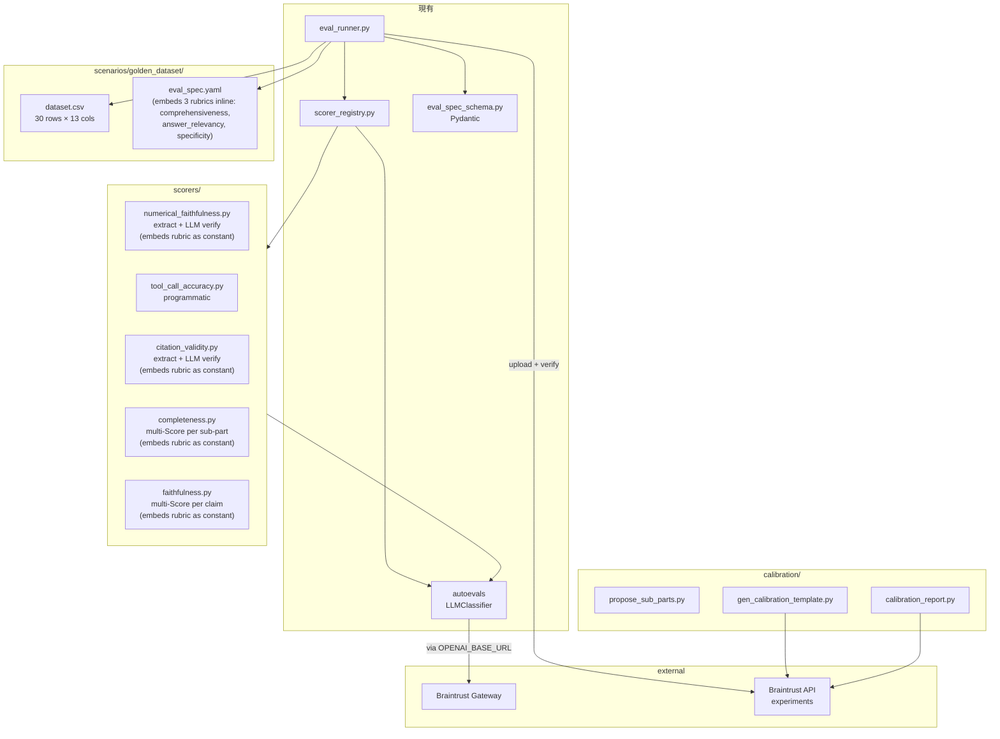
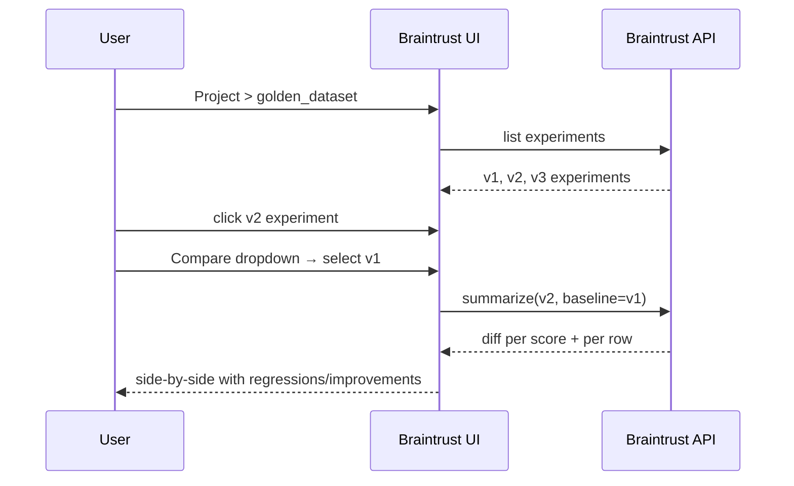
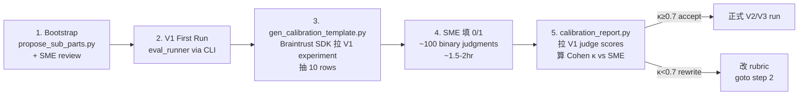

# Golden Dataset Evaluation Pipeline — Design

## 1. Context 與目標

**FinLab-X** 採 laboratory 演進路線（v1 → v5），每個 version 解決不同的 AI financial research 能力瓶頸。為量化各 version 能力差距，需要一份可重跑、可 diff 的 evaluation pipeline。

本 design 建立名為 `golden_dataset` 的 Braintrust scenario，吃 30 題手工 curate 的開放式財經問題，在 V1/V2/V3 各跑一次，產出 per-dimension 分數與 Braintrust compare experiment。

### Design 驅動原則

- **Architecture-only 差距（hard constraint）**：V1/V2/V3 必須使用相同 orchestrator LLM model id，能力差異只來自 tool 架構（raw retrieval → RAG → RAG + SQL）。`eval_runner` 於執行前做 cross-config assertion，任何 version 的 `orchestrator_config.yaml` 的 `model.name` 不一致直接 block（見 §8.8）
- **Binary rubric**：所有 LLM-judge dim 都是 0/1，不做連續分數（research 一致結論）
- **Multi-call per criterion**：每個獨立 judgment 一次 LLM call，避免 halo / anchoring bias
- **Cross-vendor judge（recommended, not enforced）**：agent vendor 與 judge vendor 不同時，自動打印 warning；不 block 執行。Whitelist 本身不以 vendor 區分（使用者可能明知風險仍要同 vendor 跑）
- **Deterministic-first**：有 programmatic 解的地方不用 LLM-judge
- **V1-first lean**：V2/V3 task function 等 agent 成熟再加，不預寫 stub

## 2. Scope

### 2.1 In scope

- 新 scenario `backend/evals/scenarios/golden_dataset/`（`dataset.csv` + `eval_spec.yaml`；7 個 rubric 以 YAML block scalar 內嵌於 `eval_spec.yaml`）
- 8 個 evaluation dimensions（展開為 ≥ 10 個 Score streams，見 §5）
- 2 個純 programmatic scorer：`tool_call_accuracy.py`、`citation_validity.py`（extraction 部分）
- 3 個 hybrid / multi-Score custom scorer：`completeness.py`、`faithfulness.py`、`numerical_faithfulness.py`
- `eval_runner.py` 擴充：`--judge-model` / `--limit` / `--version` flag、env var substitution in YAML（於 validation 前）、judge whitelist、Eval() 傳 metadata/base_experiment/tags、cross-vendor warn、cross-version model assert、upload verification、Braintrust Gateway routing
- `eval_spec_schema.py` 擴充：env var 替換（`_load_yaml_mapping` 內部、返回 dict 前）、judge whitelist `model_validator`
- Data prep scripts：`propose_sub_parts.py`（LLM 建議 sub-parts，bootstrap 用）
- Calibration scripts：`gen_calibration_template.py`、`calibration_report.py`（透過 Braintrust SDK 拉已上傳 experiment 的 judge scores）
- V1 orchestrator model 更新（pinned dated alias TBD at implementation time，詳 §13 Open Dependencies）
- Design doc

### 2.2 Out of scope

- Retrieval-quality metrics（Context Precision / Recall）—— 歸屬現有 `sec_retrieval` scenario
- Regression guardrail pytest（此 scenario 走 Quality Improvement track）
- 題庫自動生成 / 擴充
- CI 自動觸發 eval（手動執行）
- Langfuse ↔ Braintrust 雙向同步
- Production online evaluation
- Composite Overall Score（V1 first run 後依數據再談）
- Hallucination Rate、Completeness（multi-part structural）、Coherence、Format Adherence、Noise Sensitivity、Toxicity 維度
- V2 / V3 task function 實作（V2/V3 agent 成熟後再加 `run_v2` / `run_v3`）
- Tool-call sequence 嚴格驗證（`strict_set` mode 僅驗 set 相等，不驗 order）
- Dual-judge cross-validation（未來升級選項）
- Compare-experiment markdown 報表自動產出（Braintrust UI 原生 compare 已覆蓋）

## 3. Component Overview

### 3.1 依賴拓撲



### 3.2 變更統計

| Component | 類型 | 變更量 |
|---|---|---|
| `eval_spec_schema.py` | 擴充 | +40 行（env var 替換 + whitelist 驗證） |
| `eval_runner.py` | 擴充 | +120 行（CLI flags + Eval() 擴充 + banner + upload verify + Gateway setup） |
| `scorers/` 新增 | 新建 | ~600 行 Python（5 個 scorer + unit tests） |
| `scenarios/golden_dataset/` | 新建 | 1 dataset.csv + 1 eval_spec.yaml + 7 rubric 文字 |
| `scripts/` | 新建 | ~250 行（3 個 script） |
| Agent config | 修改 | `v1_baseline/orchestrator_config.yaml` 換 model |

## 4. Data Model — CSV Schema（13 欄）

**Migration context**：原始 CSV 為 8 欄（`id`, `question`, `target_version`, `category`, `why_v1_likely_fails`, `data_sources_needed`, `expected_answer_type`, `pass_criteria`）。Bootstrap 期間：刪除 `pass_criteria`，拆出 3 個 `pass_criterion_N`，並新增 3 個 `expected_*` 欄位。最終 end state = 13 欄。

| 欄位 | 型別 | 說明 |
|---|---|---|
| `id` | int | Row id（1..30） |
| `question` | string | 提問（繁中） |
| `target_version` | string | 該題預期由哪個 version 能答（`v2` / `v3` / `v2+v3`） |
| `category` | string | 題目分類（`geopolitical_risk` / `screening` / ...） |
| `why_v1_likely_fails` | string | V1 預期失敗理由（doc 用） |
| `data_sources_needed` | string | 預期資料來源描述（doc 用） |
| `expected_answer_type` | string | 預期答案形態（`影響分析+具體數據佐證` / `篩選清單+理由` / ...） |
| `pass_criterion_1` | string | Comprehensiveness criterion 1（從舊 `pass_criteria` 拆出） |
| `pass_criterion_2` | string | Comprehensiveness criterion 2 |
| `pass_criterion_3` | string | Comprehensiveness criterion 3 |
| `expected_sub_parts` | JSON list string | 題目拆解的 sub-aspects，供 Completeness 使用 |
| `expected_tools` | JSON list string | 預期應呼叫的 tool 名稱 |
| `expected_tools_mode` | string | `all`（預設）/ `any` / `strict_set`（set 相等，非 sequence ordered） |

### 4.1 JSON 欄位範例

```
expected_sub_parts:
  ["影響的量級（多大）", "影響的機制（為什麼）", "應對方式或緩解策略"]

expected_tools:
  ["sec_official_docs_retriever", "yfinance_stock_quote"]

expected_tools_mode:
  "all"
```

JSON 以字串存入 CSV（Google Sheets 可編輯）；scorer 讀取時 parse。

### 4.2 column_mapping 映射

```yaml
column_mapping:
  question: input
  target_version: metadata.target_version
  category: metadata.category
  expected_answer_type: metadata.expected_answer_type
  pass_criterion_1: expected.criterion_1
  pass_criterion_2: expected.criterion_2
  pass_criterion_3: expected.criterion_3
  expected_sub_parts: expected.sub_parts
  expected_tools: expected.tools
  expected_tools_mode: expected.tools_mode
```

## 5. 8-Dimension Scorer Map

**8 個 evaluation dimensions，展開為 10+ 個 Braintrust Score streams**：Comprehensiveness 一個 dim 展三個 Score（criterion 各獨立）；Completeness 一個 dim 展 N+1 個 Score（per sub-part + overall AND）；Faithfulness / Numerical / Citation 各展 N 個 Score（per claim / number / citation）。

| # | Dim | 方法 | 實作檔案 | 讀 expected | 讀 output | per-row call |
|---|---|---|---|---|---|---|
| 1 | Comprehensiveness（3 criteria 共用同一段 rubric 文字，差別只在讀哪個 `expected.criterion_N`） | LLM-judge × 3 | `eval_spec.yaml` LLMClassifier block × 3 | `criterion_1` / `criterion_2` / `criterion_3` | `response` | 3 |
| 2 | Completeness（per sub-part + `_overall` AND） | LLM-judge × N | `scorers/completeness.py` | `sub_parts[]` | `response` | ~3 |
| 3 | Faithfulness（per claim） | LLM-judge × N | `scorers/faithfulness.py` | — | `response`, `tool_outputs` | ~3 |
| 4 | Numerical Faithfulness（per number） | hybrid（extract + LLM verify） | `scorers/numerical_faithfulness.py` | — | `response`, `tool_outputs` | ~3 |
| 5 | Answer Relevancy | LLM-judge × 1 | `eval_spec.yaml` LLMClassifier block | — | `response` | 1 |
| 6 | Citation Validity（per citation） | hybrid（extract + LLM verify） | `scorers/citation_validity.py` | — | `response`, `tool_outputs` | 0–2 |
| 7 | Tool-Call Accuracy | programmatic | `scorers/tool_call_accuracy.py` | `tools[]`, `tools_mode` | `tool_outputs` | 0 |
| 8 | Specificity | LLM-judge × 1 | `eval_spec.yaml` LLMClassifier block | — | `response` | 1 |

### 5.1 聚合規則

- **Comprehensiveness**：無 `_overall`——pass_criteria 性質是「細節 checklist」，漏 1–2 個不代表答案整體不 comprehensive。保留 per-criterion 獨立分數。
- **Completeness**：發 per-sub-part Score + 一個 `_overall` AND 聚合（所有 sub-parts 都通過才算通過）。sub-parts 是「必答覆蓋」性質。
- **Faithfulness / Numerical Faithfulness / Citation Validity**：發 per-claim / per-number / per-citation Score，不設 `_overall`（V1 first run 後再決定要不要加）。

### 5.2 成本（per full suite V1+V2+V3）

```
per row LLM-judge calls
  = 3 (comprehensiveness)
  + ~3 (completeness per sub-part; avg 3)
  + ~3 (faithfulness per claim; avg 3)
  + ~3 (numerical_faithfulness per number; avg 3)
  + 1 (answer_relevancy)
  + 0–2 (citation_validity per detected citation)
  + 1 (specificity)
  ≈ 14 avg

30 rows × 14 avg × 3 versions ≈ 1260 calls per full V1+V2+V3 suite
@ gemini-2.5-flash ($0.30/$2.50 per M tok, avg 2K in + 200 out)
≈ $1.40 / full suite
```

實際成本 $1–3 區間，忽略不計。

## 6. LLM-Judge Rubric Templates

所有 rubric 遵循 `artifacts/current/reference-prompt.txt` 結構（metric → rubric → evaluation_steps → contextual inputs → prompt output → Y/N 選項），rubric 主體遵循 `artifacts/current/reference-rubric.txt` 格式（Score 1 / Score 0 定義 + 正反 example + explanation）。

### 6.1 存放方式

Rubric 文字**以 YAML block scalar 內嵌於 `eval_spec.yaml`**（配合既有 `language_policy/eval_spec.yaml` 慣例），不外部 `.txt` 檔。對於 multi-Score custom scorer（completeness / faithfulness / numerical_faithfulness / citation_validity）rubric 字串以 Python module-level constant 定義於各自 scorer `.py` 檔。

### 6.2 Mustache 變數命名遵循既有慣例

**必須使用 `{{output}}` 而非 `{{output.response}}`**（既有 `scorer_registry._TEMPLATE_VAR_RE` 只支援 `{{input}}` 與 `{{expected.<field>}}`；autoevals `LLMClassifier` 傳整個 `output` 物件）。

對於只需要 response 文字的 rubric（如 Comprehensiveness、Answer Relevancy、Specificity），由 scorer wrapper 或 YAML scorer 將 `output={"response": agent_output.response}` 預先 flatten 再傳給 LLMClassifier。Custom scorer 檔在內部處理這個 flatten 步驟。

### 6.3 7 個 rubric 一覽

| Rubric Name | 存放位置 | 對應 Scorer | 變數 |
|---|---|---|---|
| `comprehensiveness_criterion` | `eval_spec.yaml` LLMClassifier block × 3（每個 block 使用同一段 rubric 文字，但各自讀不同 expected 欄位） | Comprehensiveness c1/c2/c3 | `{{input}}`, `{{expected.criterion_1}}` / `{{expected.criterion_2}}` / `{{expected.criterion_3}}`（該 block 讀哪個欄位由該 block 自己決定）, `{{output}}` |
| `completeness_sub_part` | `scorers/completeness.py` constant | Completeness | `{{input}}`, `{{expected.sub_part}}`, `{{output}}` |
| `faithfulness_claim` | `scorers/faithfulness.py` constant | Faithfulness | `{{expected.claim}}`, `{{expected.source}}` |
| `numerical_faithfulness` | `scorers/numerical_faithfulness.py` constant | Numerical Faithfulness | `{{expected.number}}`, `{{expected.context}}`, `{{expected.source}}` |
| `answer_relevancy` | `eval_spec.yaml` LLMClassifier block | Answer Relevancy | `{{input}}`, `{{output}}` |
| `citation_support` | `scorers/citation_validity.py` constant | Citation Validity (L part) | `{{expected.claim}}`, `{{expected.source}}` |
| `specificity` | `eval_spec.yaml` LLMClassifier block | Specificity | `{{input}}`, `{{output}}` |

### 6.4 Rubric 內容結構（每個 rubric 都含這些 section）

```
Metric: <name>

<rubric>
Score 1: <positive definition>
Score 0: <negative definition>

Score 0 example:
  <inputs>
  <explanation why it's 0>

Score 1 example:
  <inputs>
  <explanation why it's 1>
</rubric>

<evaluation_steps>
1. ... 2. ... 3. ... 4. ...
</evaluation_steps>

<inputs via Mustache vars>

Choose Y or N.
```

具體 rubric 文字在 implementation plan 階段逐一撰寫；每個 rubric 長度 250–400 詞。本 design 不列完整 rubric 內文。

## 7. Programmatic / Hybrid Scorer Algorithms

### 7.1 Numerical Faithfulness（hybrid）

```
function numerical_faithfulness(output, expected, input) -> list[Score]:

  # Step 1 programmatic: 從 response 抽 claim-level 數字 + surrounding context
  response = output.response
  numeric_claims = extract_with_context(response, window=80 chars)
    # 每 item: (number, surrounding_text ±80 chars)
    # 濾掉 incidental 數字（與 question 中出現的數字重疊）
    # 濾掉非 claim 性質年份（保守策略：所有 4-digit year 都跳過；
    #   claim-like year 的語義判斷交給後面 LLM verify 那一層）
    # Note: 繁中/英文 response 共用此抽取邏輯，不依 verb list（因 corpus 是繁中題目）

  if no numeric_claims:
    return [Score(name="numerical_faithfulness", score=None,
                  metadata={"reason": "no numeric claims"})]

  # Step 2 LLM-judge: 每 number 帶 context 跑 rubric
  source = concat(tool_outputs)
  for i, (num, ctx) in enumerate(numeric_claims):
    verdict = LLMClassifier(
      rubric=numerical_faithfulness_rubric,
      expected={"number": num, "context": ctx, "source": source},
      input=input,
    )
    emit Score(name=f"numerical_faithfulness_{i}", score=verdict.score,
               metadata={"number": num, "context": ctx, "reason": ...})
```

Rubric 重點：判官要確認「number 綁定到 response 的正確 entity + metric」和「value 在 source 找得到（tolerance 容許）」**同時成立**。

### 7.2 Tool-Call Accuracy（programmatic）

```
function tool_call_accuracy(output, expected, input) -> Score:
  expected_tools = json_parse(expected.tools) or []
  mode = expected.tools_mode or "all"
  actual_tools = {t.tool for t in output.tool_outputs}

  if expected_tools is empty:
    return Score(score=None, metadata={"reason": "no expected tools"})

  if mode == "all":
    passed = expected_tools ⊆ actual_tools        # expected 全出現，可多
  elif mode == "any":
    passed = expected_tools ∩ actual_tools ≠ ∅   # 至少一個
  elif mode == "strict_set":
    passed = expected_tools == actual_tools      # set 相等，不含順序

  return Score(score=1.0 if passed else 0.0,
               metadata={"mode": mode, "expected": ..., "actual": ...,
                         "missing": ...})
```

### 7.3 Citation Validity（hybrid）

Extraction 依賴 V1 system prompt 規定的格式（`[N]` inline + `**References**` section + "according to X" 自然語言）：

```
CITATION_PATTERNS = [
  r"\[(\d+)\]",                                        # inline numbered ref
  r"\*\*References\*\*\s*\n((?:\[\d+\]\s+\S+\n?)+)",   # References section URLs
  r"according to\s+(yfinance|tavily|sec\w*)",          # tool-name attribution (English only)
  r"根據\s*(yfinance|tavily|SEC)",                      # tool-name attribution (Chinese)
]
# Note: natural-language tool attribution covers EN + 繁中; V1 system prompt
# 規定繁中 answer 配英文 tool name，所以實務上會看到 "根據 yfinance" 或
# "According to yfinance data"，兩者皆會 match。

function citation_validity(output, expected, input) -> list[Score]:
  response = output.response
  tool_outputs = output.tool_outputs

  # Step 1 programmatic: 抽 References dict
  refs = parse_references_section(response)
    # {"1": "https://...", "2": "https://..."}

  # Step 2 programmatic: 抽 inline [N] citations + surrounding claims
  citations = []
  for match of inline_ref_pattern:
    ref_num = match.group(1)
    if ref_num not in refs:
      emit Score 0 (引用了不存在編號) — skip LLM
      continue
    url = refs[ref_num]
    claim = surrounding_sentence(response, match.position)
    citations.append({url, claim, ref_num})

  if citations is empty and no tool-name attribution found:
    return [Score(name="citation_validity", score=None,
                  metadata={"reason": "no citations in response"})]

  # Step 3 programmatic: 對每 citation 查 tool_outputs 有無該 URL
  for c in citations:
    source_chunk = find_tool_output_containing(c.url, tool_outputs)
    if source_chunk is None:
      emit Score 0 (citation URL 未在 tool output 出現 = fabricated)
      continue

    # Step 4 LLM verify: source_chunk 是否 support claim
    verdict = LLMClassifier(
      rubric=citation_support_rubric,
      expected={"claim": c.claim, "source": source_chunk.text},
      input=input,
    )
    emit Score(name=f"citation_validity_{i}", score=verdict.score, ...)
```

## 8. eval_runner.py 擴充

### 8.1 新 CLI flags

| Flag | 說明 | 預設 |
|---|---|---|
| `--version {v1,v2,v3}` | 選 task function 對應 `run_v1` / `run_v2` / `run_v3` | `v1` |
| `--judge-model <pinned-alias>` | 全域覆蓋所有 llm_judge scorer 的 model。值必須是 whitelist 中的 **pinned alias 字串**（非 family 簡稱）；whitelist validator 會對該字串比對。Example: `--judge-model gpt-5-mini-2025-08-07` | 不設 = 照 eval_spec.yaml |
| `--limit N` | 只跑 CSV 前 N 列（smoke mode） | 全跑 |

### 8.2 eval_spec.yaml env var substitution

**Hook 位置**：於 `_load_yaml_mapping` 內部，`yaml.safe_load` 之後、**返回 dict 之前**。這保證 `ScorerConfig.model_validate` 看到的是已解析的字面值，whitelist validator 能正確比對。

遞迴替換 `${VAR}` 和 `${VAR:-default}` 於所有 string leaf 值：

```yaml
scorers:
  - name: specificity
    type: llm_judge
    model: ${JUDGE_MODEL:-gemini-2.5-flash}
```

`${VAR}` 未定義 → 替換成空字串；`${VAR:-default}` 未定義 → 替換成 default；`${VAR:-default}` 已定義 → 使用 env 值。

### 8.3 Judge whitelist 驗證

於 `ScorerConfig` 加 `@model_validator(mode="after")`。白名單具體 pinned alias 於 implementation 階段依 vendor 官方 model catalog 定（TBD at implementation；目標 model family 為 `gpt-5-mini` 和 `gemini-2.5-flash`）：

```
APPROVED_JUDGES: set[str] = {
    "<gpt-5-mini pinned alias TBD>",
    "<gemini-2.5-flash pinned alias TBD>",
}
# 若 type=="llm_judge" 且 model not in APPROVED_JUDGES → ValueError
# 白名單以 model id 比對，不按 vendor 分類（使用者可故意選同 vendor）
```

新增 model 只需改白名單常數 + review；不需動 scorer 邏輯。

### 8.4 Eval() 傳 metadata / base_experiment / tags

**Experiment name 格式變更**：現有 `eval_runner.py` 用底線 `_` 分隔（`f"{config.name}_{datetime...}"`）；本設計改用連字號 `-` 分隔，與其他子目錄 / API 命名慣例更一致，且人類閱讀更清楚（v1 / v2 / v3 不致和 timestamp 數字混淆）。此為 intentional convention change。

**Parsing 約定**：`YYYYMMDD-HHMM` 內部含 `-`，整個 experiment name 共 4 個 `-` 分隔段。`find_latest_experiment()` 用 **prefix match**（`startswith(f"{scenario}-v1-")`) 而非 split-by-hyphen，避開 ambiguity。

```
experiment_name = f"{scenario}-{version}-{YYYYMMDD-HHMM}"
metadata = {
  version, agent_model, judge_model_resolved, git_sha, run_id, limit
}
tags = [version, f"agent:{agent_vendor}", f"judge:{judge_vendor}", scenario]
base_experiment = find_latest_experiment(f"{scenario}-v1-") if version != "v1" else None

Eval(..., metadata=metadata, tags=tags, base_experiment=base_experiment)
```

### 8.5 Cross-vendor warning（non-blocking）

於 `run_scenario()` 起首印 banner。Cross-vendor 是 recommended 而非 hard-enforced（見 §1）——same vendor 只警告、不阻斷：

```
Agent: <agent_model> (vendor: <agent_vendor>)
Judge: <judge_model> (vendor: <judge_vendor>)

-- 若 vendor 相同，額外印 --

[warn] judge and agent share vendor '<vendor>'.
       Cross-vendor recommended to avoid self-enhancement bias.
       To proceed anyway (e.g., bootstrap with limited key setup), no action needed.
```

### 8.6 Braintrust Gateway 路由

於 `load_dotenv()` 之後：

```
if BRAINTRUST_API_KEY is set:
  os.environ.setdefault("OPENAI_BASE_URL", "https://api.braintrust.dev/v1/proxy")
  os.environ.setdefault("OPENAI_API_KEY", BRAINTRUST_API_KEY)
```

讓 autoevals.LLMClassifier 自動經 Gateway，Gateway 依 model 字串分流到 OpenAI / Anthropic / Google。

### 8.7 Upload verification

於 `braintrust.flush()` 之後：

```
fetched = list(init(project, experiment=experiment_name).fetch())
assert len(fetched) == len(raw_data)
assert all(r.scores for r in fetched)
print(f"[ok] Verified {len(fetched)} rows uploaded to Braintrust")
```

失敗 → 非 block（記 error log），因為 local CSV 仍有完整結果。

### 8.8 Cross-version model assertion（enforce 架構-only 原則）

於 `run_scenario()` 起首、load `eval_spec.yaml` 之後、dispatch task 之前：

```
active_version = args.version                   # v1 / v2 / v3
candidate_version_dirs = list dirs under agents/versions/
  只取「含有 orchestrator_config.yaml」的版本目錄
  （目前僅 v1_baseline；V2/V3 config 成熟後自動進入比對）

load all such configs, collect their model.name values
if len(unique(model_names)) > 1:
  error: refuse to run — "V1/V2/V3 orchestrator model mismatch: ..."
  exit non-zero

# 邊界：若只有 1 個 config 存在（初期），set 大小 = 1，assert 天然通過
```

此 check 保證任何時刻 eval 比較的 V1/V2/V3 都在同一 model 上跑。新增版本（V2/V3）時若 model 偏離 V1，CI 會紅。

## 9. Braintrust Experiment Organization

### 9.1 命名規範

```
{scenario}-{version}-{YYYYMMDD-HHMM}

golden_dataset-v1-20260421-1530
golden_dataset-v2-20260428-0915
golden_dataset-v3-20260505-1400
```

### 9.2 Metadata schema

```json
{
  "version": "v1",
  "agent_model": "<pinned gpt-5-mini alias>",
  "judge_model": "<pinned gemini-2.5-flash alias>",
  "git_sha": "abc123def456",
  "run_id": "2026-04-21T15:30:00Z",
  "limit": null
}
```

### 9.3 Base experiment 設定

```
version = "v1"       → base_experiment = None
version = "v2"       → base_experiment = latest "golden_dataset-v1-*"
version = "v3"       → base_experiment = latest "golden_dataset-v1-*"
```

若找不到 V1 baseline → warn + continue（不 block），compare view 需手動設定。此 fallback 只在「初次跑 V2/V3 之前尚未有任何 V1 experiment」時觸發——正常流程走 §10 Stage 2 的 V1 first run 之後，必定有 V1 baseline 可用。

### 9.4 Compare experiment 流程

所有 compare 分析透過 **Braintrust UI** 原生 compare experiment view。不產自訂 markdown 報表。需要的話 UI 有 export 功能。



## 10. Human Calibration Workflow

### 10.1 五階段流程



### 10.2 各階段輸出

| Stage | Input | Output |
|---|---|---|
| 1 Bootstrap | dataset.csv 原題 | dataset.csv 多欄 `expected_sub_parts`（SME 已 review） |
| 2 V1 First Run | dataset.csv + eval_spec.yaml | Braintrust experiment + local result CSV |
| 3 Template | Braintrust experiment name | `annotation_<timestamp>.csv`（10 rows × SME 填欄位空） |
| 4 Annotation | `annotation_<ts>.csv` | 同檔案，SME 欄位填完 |
| 5 Report | `annotation_<ts>.csv` + Braintrust experiment | `calibration_report_<ts>.md` |

### 10.3 SME annotation CSV 欄位

固定欄位（每 row 都有）：

```
row_id, question, v1_response_preview, v1_tool_outputs_summary,
expected_criterion_1/2/3, expected_sub_parts,
sme_comp_c1, sme_comp_c2, sme_comp_c3,
sme_faithfulness, sme_numerical_faithfulness,
sme_answer_relevancy, sme_citation_validity, sme_specificity
```

變長欄位（依該 row 的 `expected_sub_parts` 長度動態生成）：

```
sme_completeness_sub_1, sme_completeness_sub_2, ..., sme_completeness_sub_K
```

其中 `K = max(len(expected_sub_parts) for row in calibration_rows)`。單一 row 若 sub_parts 較少，多出來的欄位留空白。這樣 SME 看到的是對齊的表格（欄數固定），同時支援不同題目的變長 sub-parts。

每個 `sme_*` 欄位填 `0`（未通過）、`1`（通過）或空白（N/A）。

### 10.4 κ Report 樣貌

```
| Dim | κ(SME, judge) | Verdict |
|---|---|---|
| comprehensiveness_c1 | 0.82 | [ok] accept |
| completeness_sub_1 | 0.74 | [ok] accept |
| faithfulness | 0.65 | [warn] rewrite rubric |
| ... | ... | ... |

分歧 rows (SME 與 judge 不一致):
- row 13, dim comprehensiveness_c2: judge Y / SME N
  SME 理由: ...
```

## 11. Constraints & Trade-offs

### 11.1 Constraints

| Constraint | 影響 |
|---|---|
| CSV 欲 Google Sheets 可編輯 | 欄位純文字 / JSON 存字串、無 nested |
| Braintrust Eval() 測試單位 `{input, expected, metadata}` | `column_mapping` 必須配合 |
| autoevals LLMClassifier 僅支援 OpenAI SDK | 多 vendor 必經 Braintrust Gateway |
| autoevals `_TEMPLATE_VAR_RE` 只認 `{{input}}` / `{{expected.X}}` | Rubric 內 response 變數用 `{{output}}`；scorer 負責預先 flatten `output.response` |
| Scorer signature `(output, expected, *, input) → Score | list[Score]` | 遵照 autoevals 慣例 |
| V1/V2/V3 必須同 orchestrator model | 以 §8.8 cross-version assertion 強制 |
| Braintrust `set_global_handler()` process-wide | eval scenario 序列執行 |
| Citation extraction 依賴 V1 system prompt 的 `[N]` + References 格式 | Prompt 改動時須同步修 extractor |

### 11.2 Trade-offs

| Trade-off | 選擇 | 放棄 |
|---|---|---|
| Rubric 二元 Y/N | 研究支持、自一致 | 連續分數的 granularity |
| Judge pinned dated alias | Reproducibility | alias 退役需手動升 |
| 手動 SME 標 sub-parts | 一致性高 | 需 ~30 min 人力 |
| V2/V3 task function 不預寫 | 符合 V1-first 意圖 | V2/V3 上線時要加 `run_v2`/`run_v3` |
| No composite overall score | Data-driven later | 缺單一 headline 數字 |
| Compare 用 Braintrust UI 原生 | 零自訂報表碼 | 無法 export markdown auto-attach PR |

### 11.3 已知 pitfall

- Agent vendor 改變時要同時改 judge default（banner 會 warn）
- Gemini tool-calling through Gateway 歷史上較不穩；首次跑做 `--limit 3` smoke test，對應 Section 12 一個獨立 test 條目
- `expected_sub_parts` 數量變多會 linear 加 judge cost（4+ 時注意）
- base_experiment 永遠選「最新 V1」—— V1 prompt / model 改動後建議重跑 V1 baseline
- V1 system prompt 若更新 citation 格式，`scorers/citation_validity.py` 的 CITATION_PATTERNS 必須同步調整——建議在 system prompt 與 scorer 間加 docstring cross-reference

## 12. Testing Strategy

| 層級 | 範圍 | 工具 |
|---|---|---|
| Unit | `tool_call_accuracy` 純邏輯（set 操作 / match modes） | pytest + fixture |
| Unit | `citation_validity` extraction 邏輯（`[N]` + References parsing） | pytest + fixture |
| Unit | `numerical_faithfulness` extraction 邏輯（抽 number + surrounding context） | pytest + fixture |
| Unit | env var substitution（`${VAR}`, `${VAR:-default}`, undefined, malformed 各 case） | pytest |
| Unit | Judge whitelist validation | pytest |
| Unit | Cross-vendor warning banner | pytest |
| Unit | Cross-version model assertion（§8.8）拒跑 mismatch configs | pytest |
| Integration | 完整 eval_runner 跑 3 rows × fixture task fn | pytest `@pytest.mark.integration` |
| Integration | multi-Score scorer return 的 Braintrust column rendering | smoke test on live Braintrust |
| Integration | Braintrust Gateway → Gemini 的 tool-calling 驗證（研究警告點） | `--limit 3` dry run + 檢查 score 非 ERROR |
| Calibration | LLM-judge 對 10 rows SME 標註算 κ | `scripts/calibration_report.py` |
| Smoke | `--limit 3` 手動跑真 V1 | CLI |

不做：完整 V1+V2+V3 regression test、Braintrust UI 測試。

## 13. Open Dependencies（設計範圍外，但必須完成 eval 才跑）

1. **V1 orchestrator model 更新（scope creep but required）**：現行 `backend/agent_engine/agents/versions/v1_baseline/orchestrator_config.yaml:12` 為 `gpt-4o-mini`（placeholder per project owner）。Eval 執行前必須換成 `gpt-5-mini` family 的 **pinned dated alias**（具體 alias 於 implementation 階段向 OpenAI 官方 model catalog 確認，並 pin 到該 alias 字串）。V2/V3 未來 orchestrator_config 的 `model.name` 必須完全相同，否則被 §8.8 assertion 阻擋。
2. **Judge pinned alias 確認**：白名單成員的具體 pinned alias 同樣於 implementation 階段依 OpenAI / Google 官方 catalog 定案（`gpt-5-mini` family、`gemini-2.5-flash` family）。
3. **Braintrust 帳號 + key**：Gateway 走 `BRAINTRUST_API_KEY` 統一認證；OpenAI 和 Google 的 key 註冊到 Braintrust org settings。
4. **.env 配置**：
   ```
   BRAINTRUST_API_KEY=...     # 主要
   OPENAI_API_KEY=...         # 作 Gateway 後援 / 直接呼叫 OpenAI agent
   ```
5. **SME 手工時間**：30 分鐘 review sub_parts、30 分鐘 review expected_tools、1.5–2 小時 calibration annotation。

## 14. 估時

| 階段 | 時間（Claude 執行） |
|---|---|
| Code 實作（scorer / runner extensions / scripts） | ~1.5 天 |
| 7 個 rubric 文字撰寫（最長的一項，每 rubric 250–400 詞） | ~0.5–1 天（可能壓縮時程的主要 risk） |
| CSV bootstrap（LLM propose + SME review 非同步） | 半天 elapsed |
| V1 first run + calibration annotation + κ report | 半天 elapsed（含 SME 1.5–2 hr） |
| **Total elapsed** | **~2.5–4 天** |

Rubric 撰寫是時程最大 risk——每個 rubric 要 Score 0/Score 1 定義 + 正反 example + explanation，共 7 份約 2000 字 bespoke 文案。若 SME 需要 review 每個 rubric，還要加非同步 turnaround 時間。

## 15. 參考

- `artifacts/current/reference-prompt.txt` — 判官 prompt 模板來源
- `artifacts/current/reference-rubric.txt` — rubric Score 0/1 寫法範本
- `backend/evals/ARCHITECTURE.md` — 既有 eval 系統設計
- `backend/evals/README.md` — 既有 eval 使用手冊
- `backend/evals/scenarios/language_policy/eval_spec.yaml` — 既有 scenario 範例
- FinLab-X `docs/project_requirement.md` — V1–V5 路徑規劃
