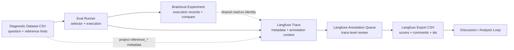
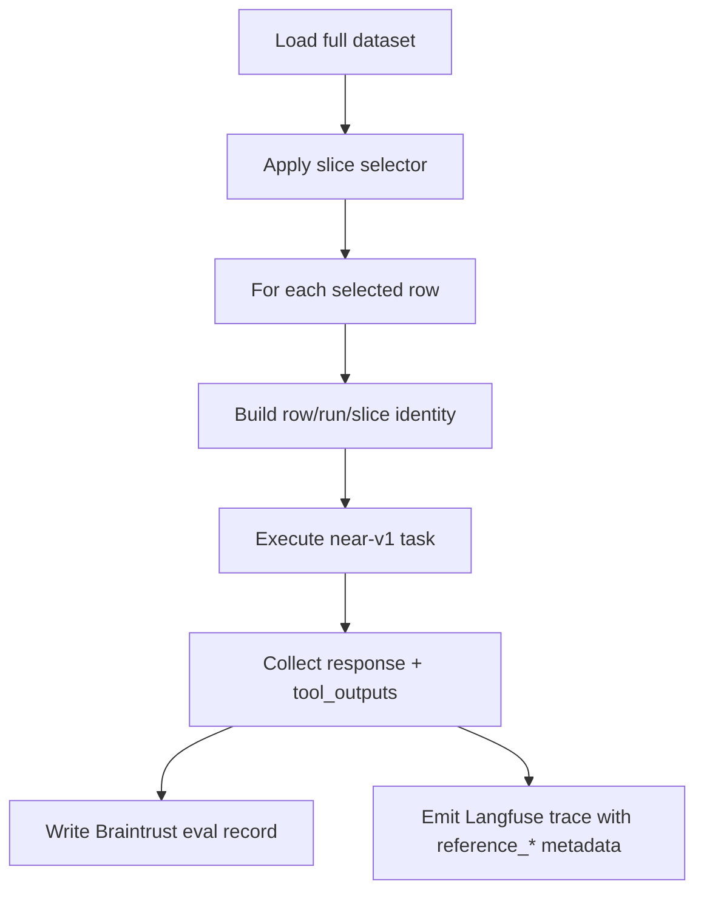
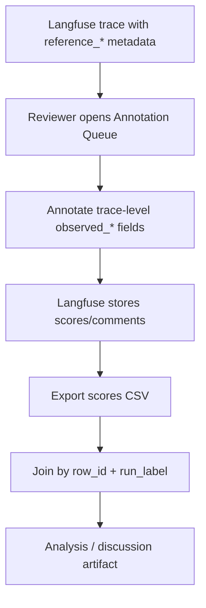
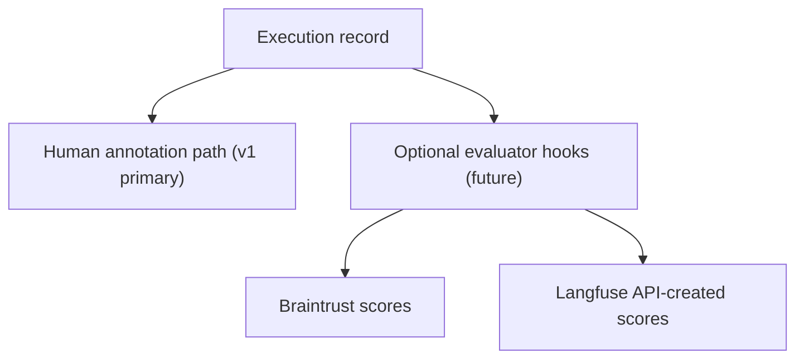

# Near-v1 Diagnostic Evaluation Pipeline — Design

## 1. Context 與目標

本設計針對 [fin-lab_near-v1_diagnostic_dataset_codex.csv](/Users/dong.wyt/Documents/dev-projects/fin-lab-x-wt/v1-eval-experiment-pipeline/artifacts/current/fin-lab_near-v1_diagnostic_dataset_codex.csv) 建立一條新的 `diagnostic evaluation pipeline`。這條 pipeline 的主要目的不是做 `LLM-as-a-Judge` 自動評分，而是讓 `near-v1` 的每題執行結果可以被穩定記錄、人工標註、匯出，再與 agent 進行後續分析與迭代。

本設計會參考 [design_reference.md](/Users/dong.wyt/Documents/dev-projects/fin-lab-x-wt/v1-eval-experiment-pipeline/artifacts/current/design_reference.md) 的 pipeline pattern，但不沿用其 `golden dataset` 導向的資料模型與 scorer 設計。第一版只為目前這份 `diagnostic dataset` 服務。

### 1.1 Primary goal

- 以 `Braintrust` 作為 execution 與 compare surface
- 以 `Langfuse Annotation Queue` 作為 human annotation surface
- 保留 dataset 內既有診斷欄位作為 `reference_*` context
- 讓 reviewer 可在 `Langfuse` 上參考這些 context 完成 `trace-level` annotation
- 之後可從 `Langfuse` export 成 CSV，與 agent 繼續討論

### 1.2 Non-goal of v1

- 不以 `LLM judge` 作為第一版主流程
- 不把 dataset 內既有預判欄位當作 machine-enforced ground truth
- 不要求每次都跑完整 30 題；必須支援 subset run

## 2. In Scope / Out of Scope

### 2.1 In Scope

- 新 scenario：`backend/evals/scenarios/near_v1_diagnostic/`
- 新 dataset loader / selector 能力：支援 `full_dataset`、`row_ids`、`field_filter`、`manifest`
- `eval_runner` 擴充成支援 `run_label` 與 slice 參數
- `Braintrust` experiment metadata contract
- `Langfuse` trace metadata contract
- `Langfuse` human annotation schema v1
- `Langfuse export -> discussion CSV` 的 join contract
- 為未來 `LLM judge` 預留 extension point，但不實作 judge scorer

### 2.2 Out of Scope

- 自動計算 overall quality score
- 對所有題目做 machine-based pass/fail judgment
- 將 annotation 主流程建立在本地 result CSV 上
- 直接在第一版支援 `observation-level` reviewer workflow
- 自動從 `Langfuse` 拉回 export 並產生完整分析報表
- 將 `diagnostic dataset` 轉換為 `golden dataset` 形式
- V1 以外 agent version 的正式支援

## 3. Dataset Model

目前 dataset 有 30 題，欄位如下：

- `id`
- `question`
- `company_universe`
- `category`
- `expected_answer_type`
- `time_sensitivity`
- `question_style`
- `capability_band`
- `expected_near_v1_behavior`
- `primary_failure_mechanism`
- `secondary_failure_mechanism`
- `expected_best_source`
- `likely_tuning_lever`
- `why_near_v1_might_fail_or_pass`
- `draft_pass_signals`

### 3.1 設計原則

- dataset 是 `reference source`
- dataset 既有欄位先不當 scorer input
- dataset 既有診斷欄位會被投影成 `reference_*` metadata，供 reviewer 參考

### 3.2 Stable row identity

`id` 是 stable `row_id`，所有 execution、annotation、export join 都以它為主鍵。

## 4. System Boundary

此 pipeline 採 `dual-surface split`：

- `Braintrust` 負責 execution record 與 experiment compare
- `Langfuse` 負責 trace review 與 annotation

## 5. Component Responsibilities

| Component | Responsibility | Non-responsibility |
|---|---|---|
| `Diagnostic Dataset` | 提供題目與 `reference_*` hints | 不做 machine scoring |
| `DatasetSelector` | 從 full dataset 切出本次要跑的 row set | 不執行 agent |
| `TaskExecutor` | 對單題執行 `near-v1`，收集 response 與 tool outputs | 不做人為診斷 |
| `Braintrust Experiment Layer` | 儲存 run record，支援 run-to-run compare | 不作為主要 annotation surface |
| `TraceMetadataProjector` | 將 row/run context 與 `reference_*` 投影到 `Langfuse` trace metadata | 不寫 annotation 結果 |
| `Langfuse Annotation Layer` | 承接人工 review 與 annotation queue | 不作為 execution compare 主體 |
| `AnnotationExportJoiner` | 將 `Langfuse` export 與 dataset/run identity join 回分析 CSV | 不重跑 eval |

## 6. Identity Contract

設計上拆成三層 identity：

### 6.1 Row identity

- `row_id`
- `dataset_name`
- `dataset_version`
- `question_hash`（optional）

### 6.2 Run identity

- `run_label`
- `run_group`
- `agent_version`
- `experiment_name`
- `started_at`
- `git_commit`（recommended）

### 6.3 Slice identity

- `slice_label`
- `slice_type`
- `slice_selector`
- `selected_row_ids`
- `slice_hash`（optional）

### 6.4 Design rule

`row identity`、`run identity`、`slice identity` 必須分離。任何 export、compare、annotation join 都不能只靠 `experiment_name` 或 `session_id` 推斷。

## 7. Slice Design

第一版支援四種 slice 模式：

| Slice type | Example | Purpose |
|---|---|---|
| `full_dataset` | 全 30 題 | 正式完整 run |
| `row_ids` | `3,7,12` | 修 bug 後快速 rerun |
| `field_filter` | `capability_band=boundary` | 跑特定題型 |
| `manifest` | 外部 row-id 清單檔 | 固定 regression subset |

### 7.1 Compare rule

| Compare type | Allowed | Summary rule |
|---|---|---|
| `full vs full` | Yes | 用全題集合 |
| `subset vs subset` | Yes | 用交集 row set |
| `full vs subset` | Yes, but not default | 僅做 `overlap-only` summary |

### 7.2 Design rule

如果兩個 experiment 的 row set 不同，summary 必須標記為 `overlap-only`，不能把不同 row distribution 的 aggregate 當成同質比較。

## 8. Metadata Contract

### 8.1 Braintrust metadata

`Braintrust` metadata 偏 execution 與 compare：

- `row_id`
- `dataset_name`
- `dataset_version`
- `run_label`
- `run_group`
- `slice_label`
- `slice_type`
- `agent_version`

### 8.2 Langfuse trace metadata

`Langfuse` trace metadata 除了 identity keys，還需包含 annotation context：

- `reference_capability_band`
- `reference_expected_behavior`
- `reference_primary_failure_mechanism`
- `reference_secondary_failure_mechanism`
- `reference_best_source`
- `reference_likely_tuning_lever`
- `reference_pass_signals`

### 8.3 Design rule

- `Braintrust` metadata 與 `Langfuse` metadata 不要求完全相同
- `Braintrust` 偏 run management
- `Langfuse` 偏 reviewer context
- `reference_*` 只能作為 context，不能覆寫 reviewer 的 `observed_*`

## 9. Human Annotation Schema v1

annotation schema 採 `mixed core + optional diagnostics`。

### 9.1 Core required fields

| Field | Type | Notes |
|---|---|---|
| `observed_outcome` | `CATEGORICAL` | `strong_answer` / `acceptable_answer` / `partial_answer` / `failed_cleanly` / `failed_with_overreach` |
| `observed_alignment_to_prompt` | `CATEGORICAL` | `high` / `medium` / `low` |
| `review_confidence` | `CATEGORICAL` | `high` / `medium` / `low` |
| `review_comment` | `TEXT` | reviewer 判斷依據 |

### 9.2 Optional diagnostic fields

| Field | Type | Notes |
|---|---|---|
| `observed_primary_failure_mechanism` | `CATEGORICAL` | 對齊 dataset 常見 failure 類型 |
| `observed_secondary_failure_mechanism` | `CATEGORICAL` | 選填 |
| `observed_tuning_lever` | `CATEGORICAL` | 對齊 dataset 常見 lever |
| `needs_followup` | `BOOLEAN` | 是否需後續追蹤 |
| `followup_note` | `TEXT` | 補充說明 |

### 9.3 Naming rule

- dataset 提供的是 `reference_*`
- reviewer 寫入的是 `observed_*`
- 兩者在匯出後必須可並排比較

## 10. Data Flow

### 10.1 Execution path

### 10.2 Human annotation path

### 10.3 Future extension path

## 11. Interfaces Between Components

### 11.1 DatasetSelector

Input:

- full dataset rows
- optional slice arguments

Output:

- selected rows
- `slice_identity`

### 11.2 TaskExecutor

Input:

- one selected row
- `run_identity`

Output:

- `response`
- `tool_outputs`
- execution metadata

### 11.3 TraceMetadataProjector

Input:

- dataset row
- run identity
- slice identity

Output:

- `Langfuse` metadata payload

### 11.4 AnnotationExportJoiner

Input:

- `Langfuse` export CSV
- dataset rows
- run metadata

Output:

- discussion-ready joined CSV

## 12. Key Decisions

| Decision | Choice | Rationale |
|---|---|---|
| Primary review surface | `Langfuse Annotation Queue` | 符合 human annotation workflow |
| Execution compare surface | `Braintrust` | 適合 run-to-run compare |
| Dataset hints usage | `reference_*` metadata only | 保留人工判斷主體 |
| Annotation granularity in v1 | `trace-level` first | 先降低 reviewer friction |
| Slice support | built-in, first-class | subset rerun 是正式需求 |
| Full vs subset compare | `overlap-only` summary | 避免 aggregate 誤導 |
| LLM judge in v1 | deferred | 第一版不以 auto scoring 為主 |

## 13. Constraints / Trade-offs

### 13.1 Constraints

- 現有 eval framework 以 `Braintrust Eval()` 為 execution entry
- 現有 agent layer 已有 `Langfuse` tracing 與 `session_id` 傳遞機制
- 第一版 dataset 本質上是 human review dataset，不是 gold scorer dataset
- `Langfuse` export 需要能以 stable identity 回 join 到 dataset

### 13.2 Trade-offs

| Trade-off | Chosen | Gave up |
|---|---|---|
| reviewer speed vs diagnostic depth | mixed schema | full mirror annotation |
| one platform vs dual platform | dual-surface split | 單一介面簡化 |
| full-run purity vs fast rerun | first-class slice support | aggregate summary simplicity |
| immediate auto scoring vs workflow-first | workflow-first | 初期自動量化 |

## 14. Verification Strategy

第一版驗證重點不是 score quality，而是 workflow integrity。

### 14.1 Selector correctness

- slice selector 是否選到正確 row ids
- `field_filter` 與 `manifest` 是否穩定可重現

### 14.2 Metadata integrity

- `Braintrust` case metadata 是否包含正確 identity keys
- `Langfuse` trace metadata 是否正確投影 `reference_*`
- `row_id + run_label` 是否能穩定對齊兩個平台

### 14.3 Workflow viability

- reviewer 是否可在 `Langfuse Annotation Queue` 完成 `trace-level` annotation
- export 後是否能 join 回 dataset
- joined CSV 是否同時保留 `reference_*` 與 `observed_*`

## 15. Future Evolution

未來若要擴充，可沿以下方向演進：

- 加入 `observation-level` annotation schema
- 對 subset run 加入 targeted `LLM judge`
- 將部分 `observed_*` 欄位轉成 API-created scores
- 建立 export 後的標準分析腳本

## 16. Review Notes

本次依 `design-brainstorming` 原流程應進行 spec reviewer subagent review loop；但此 session 的工具規則不允許在未明示授權下主動 dispatch subagent，因此這份 spec 先採本地嚴格自我審查作為 fallback。若後續需要正式 reviewer subagent round，再另外啟動。
