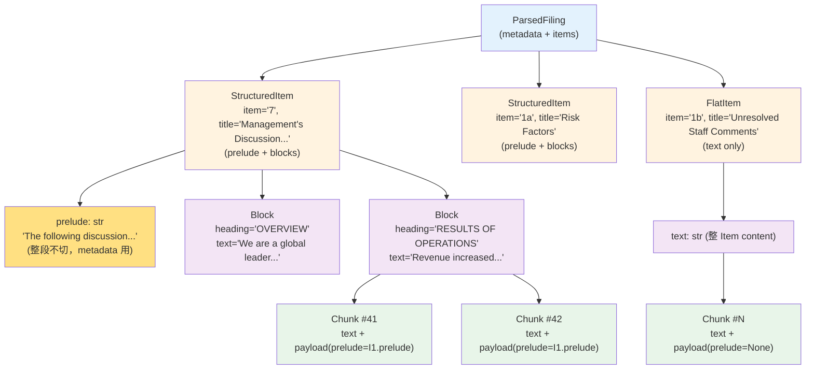
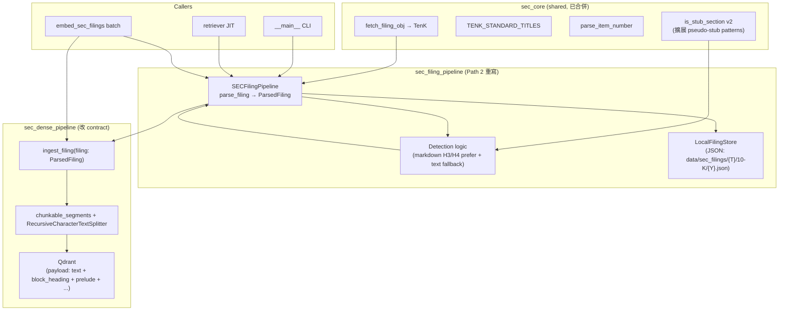
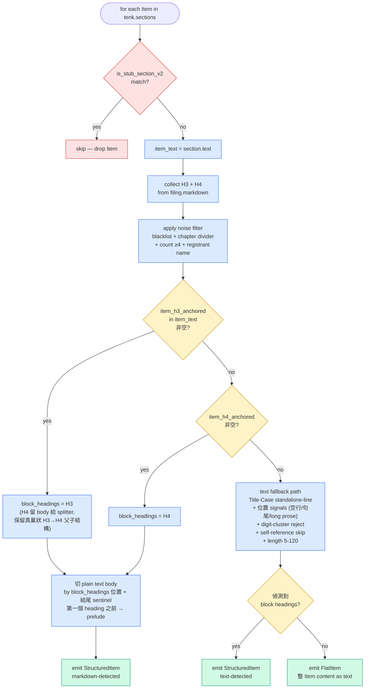
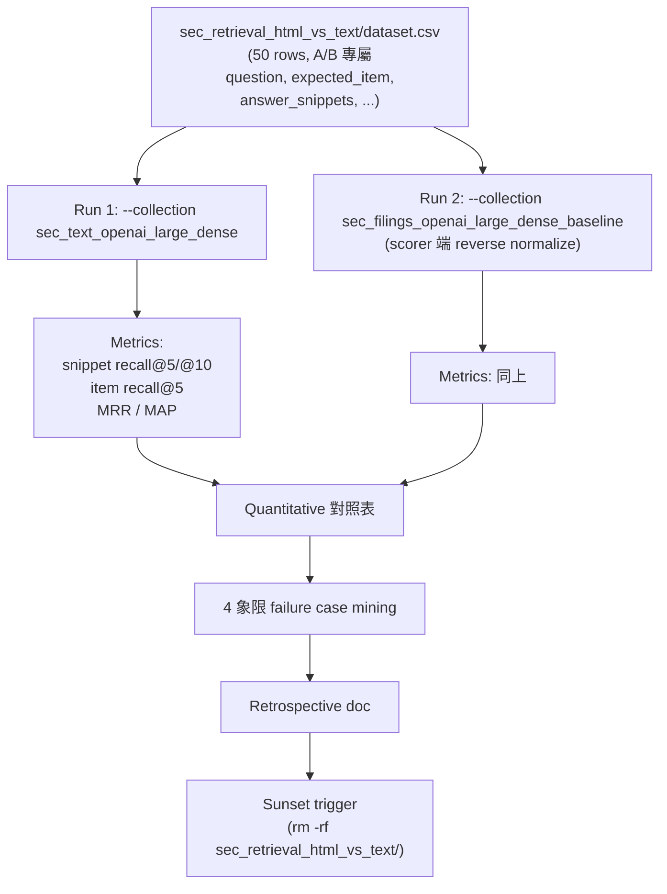

# Design: SEC Filing Pipeline 簡化 — Path 2 (RAG Pipeline)

> **狀態**：brainstorming 中，本 doc 為當前共識的 draft。
> **前置**：Path 1 (Agent Tool) 已合併（commit e1d9d98），shared core `backend/common/sec_core.py` 已就位。
> **配套 research**：
> - `research_sec_filing_api.md` — edgartools API vs 舊實作
> - `research_filing_markdown_quality.md` — `filing.markdown()` 早期評估（3 家 tech）
> - `research_prelude_block_relationship.md` — prelude 跨 sector 實證
> - `research_legacy_heading_heuristics.md` — 舊 pipeline heuristic 借鑑
> - `research_edgartools_subsection_structure.md` — Section 物件 + markdown 跨 sector 評估
> - `research_markdown_h3_cross_sector.md` — markdown H3/H4 跨 10 家公司可行性

---

## 1. 背景與動機

FinLab-X v2 RAG pipeline 用了 ~1000 行自製 HTML parsing：

| Module | 行數 | 職責 |
|--------|-----|------|
| `sec_downloader.py` | ~90 | `Company.get_filings()` + `filing.html()` |
| `html_preprocessor.py` | ~300 | decorative CSS 清理 + font-size 估算 + heading promotion |
| `sec_heading_promoter.py` | ~365 | regex + font-size/bold heuristic 偵測 Part/Item 邊界 |
| `html_to_md_converter.py` | ~150 | `html-to-markdown` + `markdownify` fallback |
| `markdown_cleaner.py` | ~100 | boilerplate strip + heading 後處理 |

每家新公司可能引入新 HTML quirk（JNJ / MSFT / BAC / BRK 都有公司專屬 workaround）。

edgartools 5.17.1 提供結構化 API：
- `tenk[item_key]` — 拿到 Item 純文字 (Item 邊界 reliable)
- `filing.markdown()` — 內建好 markdown，含 H2/H3/H4 結構標記

Path 2 用 edgartools native API + 簡化的 detection logic 取代舊 1000 行 pipeline。

---

## 2. Scope 與 Terminology

### 2.1 Scope boundary（A 路線）

跨兩個 module：

```
sec_text_pipeline (新版 primary):
  - parse: edgartools → ParsedFiling 結構化（不再輸出 markdown 字串）

sec_dense_pipeline (沿用名):
  - ingest_filing(filing: ParsedFiling) → 直接吃結構，內部 chunk + embed + Qdrant upsert
```

兩個 module 都改 contract，PR scope 較大但徹底 — 沒有 markdown 中介層、沒 round-trip。

**舊 HTML pipeline 處理**：`sec_filing_pipeline` + `sec_dense_pipeline` 透過 `git mv` 改名搬到 `_html` suffix 凍結保留，作為 A/B testing baseline，等 sunset trigger 達成後（見 §15）才一次砍除。新版 primary 命名 `sec_text_pipeline` 區分未來 `sec_quant`（V3 numeric extraction → DuckDB）的 axis。

### 2.2 Terminology

| 概念 | 統一用詞 | 不再用 |
|------|---------|--------|
| 10-K 的 Item N（1, 1A, 7, 7A 等） | **Item** | section, item-section |
| Item 第一行 `ITEM 7. MANAGEMENT'S DISCUSSION...` | **Item heading line** | ITEM heading, item title |
| Item 內，偵測到的子標題（H3/H4 或 ALL CAPS / Title Case standalone） | **Block heading** | sub-heading, ALL CAPS heading |
| Item 內，block heading 之間（或之前）的文字段 | **Block** | sub-section, segment |
| 進到 splitter 的 input 單位 | **Block** | (同上) |
| Splitter 切出的 token-bounded 單位 | **Chunk** | (already chunk) |
| edgartools `tenk.sections` API 物件 | edgartools 自己用 "section"，code 中 reference 時加註「edgartools section（即一個 Item）」 | (避免在 design 用 "section" 一詞) |

### 2.3 階層圖



> **Prelude 在哪一層？** Prelude 不在 chunk text 本身、不獨立 embed，而是落在每個 block-derived chunk 的 **Qdrant payload metadata** 中（圖上 `payload(prelude=I1.prelude)`）。Retrieve 時於 LLM context preparation 階段 concat 進 prompt。完整理由 + 替代方案對照見 §5.2。

### 2.4 跨層 data flow（架構整體）



---

## 3. ParsedFiling Schema

### 3.1 Discriminated union

兩種 Item kind 行為完全不同（structured 有 prelude/blocks、flat 整段 chunk），用 union 表達：

```python
# Block 是 StructuredItem.blocks 的元素 — 用 Pydantic BaseModel 而不是
# tuple/dict 是為了：(a) JSON round-trip 自動處理（StructuredItem.blocks
# 是 list[Block]，filing_store JSON 序列化/反序列化都有 schema validation）；
# (b) IDE 跟 mypy 知道 .heading / .text 兩個 field；(c) 未來若要加 fields
# (e.g. char_offset, source_path=markdown_h3|markdown_h4|text_fallback)
# 不破壞 caller。
class Block(BaseModel):
    heading: str               # 必有 block heading
    text: str                  # block body (plain text)

class StructuredItem(BaseModel):
    kind: Literal["structured"] = "structured"
    item: str                  # "1a", "7" — TENK_STANDARD_TITLES key (normalized)
    title: str                 # SEC 標準 title
    prelude: str               # 第一個 block heading 之前的 text；無 prelude 時 = ""
    blocks: list[Block]        # 至少一個 block

class FlatItem(BaseModel):
    kind: Literal["flat"] = "flat"
    item: str
    title: str
    text: str                  # 整 Item content (無 block heading)

ParsedItem = StructuredItem | FlatItem

class ParsedFiling(BaseModel):
    metadata: FilingMetadata   # 對應現況，無 markdown_content / converter 欄位
    items: list[ParsedItem]    # stub items 已 filter，discriminated by `kind`
```

### 3.2 Schema 不變決策

- **Stub items 在 parse 階段直接 drop**（不留 flag 給下游）
- **無 `markdown_content` 字段**（A 路線完全消除 markdown 中介）
- **`FilingMetadata.converter` 欄位移除**（沒語義）
- **`RawFiling` dataclass 移除**（fetch_filing_obj 直接給 TenK）

---

## 4. Detection Logic

### 4.1 整體 flow



<details>
<summary>對應 pseudo-code（implementation reference）</summary>

```
For each Item in tenk.sections:
  is_stub_section_v2(text)?  → skip if stub
  item_text = section.text()

  Markdown path (主):
    1. all_h3 = collect H3 from filing.markdown()
    2. all_h4 = collect H4 from filing.markdown()
    3. apply noise filter to both H3 and H4
    4. item_h3_anchored = anchored search filtered_H3 in item_text
    5. IF item_h3_anchored 非空:
         block_headings = item_h3_anchored
         (H4 留 body 給 splitter；保留真巢狀 H3→H4 父子結構)
    6. ELSE:
         item_h4_anchored = anchored search filtered_H4 in item_text
         IF item_h4_anchored 非空:
           block_headings = item_h4_anchored
         ELSE:
           → goto Fallback path
    7. 切 plain text body (block_headings positions + 結尾 sentinel)
       第一個 block heading 之前 plain text → prelude
       → emit StructuredItem (markdown-detected)

  Fallback path (markdown 兩個 level 都無 anchored):
    item_text + Title-Case standalone-line detection
        + 位置 signals (前後空行 / 上行不結尾 .!? / 下行 long prose)
        + digit-cluster reject + self-reference skip + length 5-120
    IF 偵測到 block headings:
      → emit StructuredItem (text-detected)
    ELSE:
      → emit FlatItem
```

</details>

### 4.2 Markdown level 對應

| Markdown Level | SEC 對應 | 我們處理 |
|----------------|---------|---------|
| H1 (`#`) | Part I/II/III/IV | drop（不用） |
| H2 (`##`) | Item heading | 不用 markdown 切 Item range（走 `tenk[item_key]` 拿 Item 邊界） |
| **H3 (`###`)** | **Block heading 主場景一**（如 JPM 用 H3） | **prefer**：有 useful H3 anchored 就用 H3 |
| **H4 (`####`)** | **Block heading 主場景二**（如 ADSK 用 H4） | **fallback to H4**：H3 沒 anchored 才用 H4 |
| H5+ | （罕見） | drop |

**H3 vs H4 不分階層**：每家公司 sub-heading 落 H3 或 H4 是 edgartools 從 HTML font-size 排序映射造成的，不代表 hierarchy。多數公司只用其中一個 level；30 probes 沒看到 H3+H4 真巢狀。

**真巢狀 H3→H4 out of scope**：若某 Item 有 useful H3，H4 留在 body 給 recursive splitter 處理（不切散 H4 為獨立 Block）。

### 4.3 Noise filter rules

> **Rules 出處**：以下五類 noise 來自 `research_markdown_h3_cross_sector.md` + `research_prelude_block_relationship.md` 跨 10 家公司、共 30 probes 的實證統計 — 不是先驗推測，是看到實際 H3/H4 list 後歸納的 pattern。

`filing.markdown()` 中常見 H3/H4 noise：

| Noise type | 範例 | Filter rule |
|-----------|-----|------------|
| Cover-page boilerplate | `UNITED STATES`, `SECURITIES AND EXCHANGE COMMISSION` | literal blacklist |
| Financial-statement chapter divider | `CONSOLIDATED STATEMENTS OF OPERATIONS`, `NOTES TO CONSOLIDATED FINANCIAL STATEMENTS` | regex `^CONSOLIDATED STATEMENTS OF .+` + 重複次數 |
| 重複 ≥ 4 次 | JPM `NOTES TO CONSOLIDATED FINANCIAL STATEMENTS` ×11 | count-based reject |
| Registrant company name | 公司全名重複 | match `metadata.company_name` |
| Page-break artifact | DIS `TABLE OF CONTENTS` ×16 | literal blacklist |

**「重複 ≥4 次」怎麼算？** 不需 traverse 比對 — `filing.markdown()` 解析完後一次收集全部 H3 + H4 為 list（每個 H3/H4 是字串 heading text），用 `collections.Counter` 一行統計：

```python
from collections import Counter
heading_counts = Counter(all_h3 + all_h4)  # O(N)，N = filing 內 H3/H4 總數，通常 < 200
noisy = {h for h, n in heading_counts.items() if n >= 4}
```

只算一次，整個 filing 內共享。Anchored search 每個 item 各跑一次，但是先用 `noisy` set 把候選 list filter 過了再 search，搜尋成本不變。

**ToC pollution 不是問題**：30 probes 證實 `filing.markdown()` 不會把 ToC 條目標 H3/H4。

### 4.4 Anchored search 規則

對 markdown H3/H4 候選 list，每個 title 在 `item_text` 找 standalone line：

```python
pattern = re.compile(rf'^\s*{re.escape(heading)}\s*$', re.MULTILINE)
match = pattern.search(item_text)
```

必須整行只有 heading（不含 inline 提到的 noise）。Cross-Item collision 自動隔離 — Item 1 的 `Overview` 不會出現在 Item 7 的 plain text 中，因 plain text 是 Item-bounded。

### 4.5 Text fallback path 細則

走 Title-Case standalone-line detection（Research A 借鑑）：

```python
def is_block_heading_text_fallback(line, prev_line, next_line):
    s = line.strip()
    return (
        5 <= len(s) <= 120
        and not s.isdigit()                         # 排除頁碼
        and not has_digit_cluster(s, threshold=3)   # 排除 table cell
        and not is_item_self_reference(s)           # 排除 ITEM N. 自身
        and not any(c in s for c in {'|', '$', '%'})# 排除 table data
        and not prev_line.rstrip().endswith(('.', '!', '?'))  # 上行非句尾
        and len(next_line.strip()) > 80             # 下行 long prose
        # （ALL-CAPS 是這個 rule 的特例自動 cover）
    )
```

只有 markdown path 完全失敗（item_h3_anchored 跟 item_h4_anchored 都空）才走這條。Research 30 probes 估計 3/30 會走 fallback (ADSK 1A、VZ 1A、XOM 1)。

### 4.6 `is_stub_section` v2 擴展

現有 regex（cover「incorporated by reference」）必須擴展加 patterns：

| Phrase | 範例 case |
|--------|---------|
| `r"reference\s+is\s+made\s+to"` | XOM Item 7: "Reference is made to the section..." |
| `r"appears\s+on\s+pages?\s+\d+"` | JPM Item 7: "appears on pages 46–160" |
| `r"refer\s+to\s+the\s+\S+\s+section"` | JPM Item 7A: "Refer to the Market Risk Management section" |

涵蓋 4/24 之前漏 catch 的 pseudo-stub case。

---

## 5. Chunking & Prelude payload metadata

### 5.1 `chunkable_segments` generator

統一 pipeline path（structured 跟 flat 不分支）：

```python
def chunkable_segments(item: ParsedItem) -> Iterator[tuple[str | None, str, str | None]]:
    """yield (block_heading, text, item_prelude) for each chunkable text segment.

    block_heading=None ⇔ FlatItem 的整段 text（沒 block heading 概念）
    block_heading=str  ⇔ StructuredItem 的 Block (含對應 item_prelude)
    item_prelude=None  ⇔ FlatItem（沒 prelude 概念）
    item_prelude=str   ⇔ StructuredItem 的 prelude（"" 表無 prelude）
    """
    if isinstance(item, FlatItem):
        yield (None, item.text, None)
    else:  # StructuredItem
        for block in item.blocks:
            yield (block.heading, block.text, item.prelude)
```

下游 chunking pipeline（`create_text_splitter()` 完整內容見 §5.3，core 是 `RecursiveCharacterTextSplitter.from_tiktoken_encoder(cl100k_base, chunk_size=512, chunk_overlap=50)`）：

```python
splitter = create_text_splitter()
chunk_index = 0
for item in parsed_filing.items:
    for block_heading, text, item_prelude in chunkable_segments(item):
        for chunk_text in splitter.split_text(text):
            payload = {
                "ticker": ticker, "year": year, ...,
                "item": item.item,                # normalized key "7" / "1a"
                "block_heading": block_heading,   # str | None
                "prelude": item_prelude,          # str | None (整段)
                "text": chunk_text,
                "chunk_index": chunk_index,       # 全 filing 範圍
                "header_path": build_header_path(ticker, year, item, block_heading),
                ...
            }
            chunk_index += 1
```

### 5.2 Prelude as payload metadata（不獨立 chunk / embed）

> **為什麼選 payload metadata 而不是獨立 chunk？** 替代方案 — **Prelude as separate chunks**：prelude 像普通段落一樣 chunked + embedded，retrieve 時若 hit 到 block chunk，再額外 Qdrant query (filter same item, `block_heading=None`) 拉回 prelude chunks 拼進 context。**Reject** 因為：(1) retrieve-time 多一次 Qdrant query（latency + N+1 query 模式）；(2) prelude chunk 自身有 embedding 會跟 block chunk 在 semantic 上搶 retrieval slot（稀釋 ranking）；(3) retrieve 端要靠 `block_heading=None` flag 區別 prelude 與一般 chunk，邏輯複雜易錯。本設計把 prelude 完全移到 payload metadata 端：不切、不 embed、payload self-contains，retrieve-time 零 augment query。

**核心 insight**：prelude（如 MD&A 的 scoping + FLS disclaimer + cross-reference）對 Item 內所有 block 都是 cross-cutting context。

**Schema**：StructuredItem.prelude 只在 ParsedFiling 結構中存一份，每個 block-derived chunk 在 Qdrant payload 中**整段帶 prelude**：

| 行為 | 說明 |
|------|------|
| Prelude 是否獨立 chunk + embed | ❌ No |
| Prelude 是否進 vector store 自身 | ❌ No (沒 embedding) |
| Prelude 是否在 block chunk payload 帶 | ✅ Yes (整段不切) |
| Retrieve 時 augment query | ❌ 不需要（payload self-contains） |
| Prelude 整體性 | ✅ 保留 |
| Storage overhead | Prelude 重複存（per Item N block chunks 次），實際 100-300 MB 跨 corpus，可接受 |

**LLM context preparation — retrieve-time 階段**（不是 ingest-time）：

時序：使用者 query → vector match top-K chunks → load matched chunks payloads（payload 自帶 prelude）→ **此時**用以下 helper 把 payload 組成給 LLM 看的 context → 送進 LLM prompt。

```python
# 在 retrieve-time、把 matched chunk 丟回 LLM 之前才呼叫
def build_chunk_context(chunk):
    context = f"[Item {chunk.item.upper()}: {chunk.item_title}]"
    if chunk.block_heading:
        context += f" / [{chunk.block_heading}]"
    if chunk.prelude:
        context += f"\n\nItem context:\n{chunk.prelude}"
    context += f"\n\n{chunk.text}"
    return context
```

零 augment query、零 retrieve-time 補拼邏輯 — payload 本身已 self-contain，函式只是格式化。

### 5.3 Splitter 配置

| Decision | Choice |
|---------|--------|
| Splitter | `RecursiveCharacterTextSplitter.from_tiktoken_encoder(cl100k_base)` |
| chunk_size | 512 (env var `SEC_CHUNK_SIZE` override 保留) |
| chunk_overlap | 50 (env var `SEC_CHUNK_OVERLAP` override 保留) |
| Overlap 跨 Block 邊界 | ❌ 不跨（每個 Block 獨立 split，splitter 各跑各的） |
| Overlap 在 Block 內 | ✅ 同 Block 內相鄰 chunk 50 token overlap |

**不跨 Block 邊界的理由**：block heading 是 SEC 結構訊號（OVERVIEW vs RESULTS OF OPERATIONS），semantic 上不該硬 overlap。要跨 Block 前後文走 query-time window expansion 補（後續 PR）。

**不用 LlamaIndex node 抽象**：`splitter.split_text(string) → list[str]` 直接吃 string 輸出 list，不包成 LlamaIndex `TextNode`。Qdrant `PointStruct` 只認 string + vector + dict，過 node 抽象是無謂 round-trip。

### 5.4 不引入 LlamaIndex Hierarchical / SentenceWindow

| Approach | Prerequisite | 衝突 |
|----------|------------|-----|
| `AutoMergingRetriever` | `HierarchicalNodeParser` 切 3 層 + `SimpleDocumentStore` 持久化 + `StorageContext` + `VectorStoreIndex`（必須走 `QdrantVectorStore` wrapper） | 跟「直接 `qdrant-client` + flat `PointStruct`」180 度衝突 |
| `SentenceWindowNodeParser` | sentence-level embedding | 跟現況 token-based 512-chunk 不對齊，要重 design chunk size 策略 |

SEC 10-K hierarchy 透過 metadata 顯式表達 (`ticker → year → item → block_heading → chunk_index`)，比 LlamaIndex 抽象更靈活、更可控。

---

## 6. Qdrant Payload Schema

```python
payload = {
    "ticker": str,                # canonicalized upper
    "year": int,                  # fiscal year
    "filing_date": str,           # ISO date
    "filing_type": str,           # "10-K"
    "accession_number": str | None,

    "item": str,                  # normalized key "7" / "1a" (sec_core.parse_item_number 格式)
    "block_heading": str | None,  # None ⇔ chunk 來自 FlatItem.text
    "prelude": str | None,        # None ⇔ FlatItem; str ⇔ StructuredItem prelude (可能是 "")
    "header_path": str,           # human-readable string
    "chunk_index": int,           # 全 filing 範圍 idx (0..N)
    "text": str,                  # chunk content (plain text)
    "ingested_at": str,           # ISO datetime
}
```

### 6.1 `header_path` 組成

| Item kind | `block_heading` | `header_path` 格式 |
|-----------|----------------|------------------|
| StructuredItem + has block heading | str | `{ticker} / {year} / Item {item.upper()}. {title} / {block_heading}` |
| FlatItem | None | `{ticker} / {year} / Item {item.upper()}. {title}` |

### 6.2 vs 現況差異

| Field | 現況 | 新版 |
|-------|------|------|
| `item` | `"Item 7"` 字串 | `"7"` / `"1a"` (normalized) |
| `block_heading` | 沒這 field（埋在 header_path 字串） | 顯式 `str \| None` |
| `prelude` | 沒這 field | 整段 `str \| None` |
| `chunk_index` | 全 filing idx | 同（保留全 filing 範圍）|

`item` 改 normalized key 是 breaking change — 但已決定 wipe Qdrant 重 ingest，無妨。

### 6.3 Payload index（Qdrant collection schema）

| Field | Index type | 用途 |
|-------|-----------|------|
| `ticker` | Keyword (tenant) | 多 ticker 隔離 |
| `year` | Integer | 年度 filter |
| `item` | Keyword | Item filter |

新加 index：
| `block_heading` | Keyword | 後續 augment / window expansion 用 |

---

## 7. Filing Store

> **Filing store 是什麼？** 一個 **machine 端的本地 cache**，存的是 fetch + detect 完之後的 `ParsedFiling` 物件序列化成 JSON。**不是**給人類讀的（人類讀走 §10 inspect helper），是給下次同 ticker/year 跑 pipeline 的程式自己讀，省一次 EDGAR fetch + detect。

> **不是 pipeline 一路做完就好嗎？為什麼還要存中間產物？**
>
> Pipeline 確實是一路做完（fetch → parse → chunk → embed → Qdrant upsert），filing store 是 fetch+parse 完之後 **順手 save 的副產物**。真正的好處在「**下次同 ticker/year 還要做什麼**」這些場景：
>
> | 場景 | 沒 filing store | 有 filing store |
> |---|---|---|
> | 改 chunk 策略重 ingest（e.g. chunk_size 512→1024 跑 eval 對照） | 重做 fetch (HTTP, SEC rate limit) + parse + chunk + embed | 跳過 fetch+parse → load JSON → re-chunk → re-embed |
> | Inspect helper review detection 對不對（§10） | 重做 fetch + parse 才能 render | load JSON → render markdown，秒回 |
> | Retriever JIT process restart 後第一次 query 同 filing | 重做 fetch + parse + chunk + embed | load JSON → re-chunk + re-embed（省 HTTP fetch） |
> | edgartools 升級想看 detection 變化 | 重做 fetch + parse 才能 diff | load 舊 JSON vs 新 parse 結果直接 diff |
>
> 換句話說 — **filing store 是 fetch+parse 階段的 cache，Qdrant 是 embedding 階段的 cache**，平行兩段。兩個 cache 是因為 invalidation 觸發條件不同：filing store 只在 SEC filing 改版/edgartools 升級時失效（罕見）；Qdrant 在 chunking/embedding model 改時失效（更常見）。如果只存 Qdrant，每次改 chunk 策略都要重 fetch SEC，浪費 HTTP quota 跟 latency。

### 7.1 格式：JSON

| 維度 | 決定 |
|------|-----|
| 路徑 | `data/sec_text/{TICKER}/10-K/{YEAR}.json` |
| 內容 | `ParsedFiling.model_dump_json(indent=2)` — 完整 ParsedFiling 物件（見下方）|
| YAML frontmatter | 移除（換成 JSON 整檔）|
| Markdown body | 移除（schema 不再有 markdown_content）|

**JSON 內容範例**（structure 對齊 §3.1 ParsedFiling schema）:

```json
{
  "metadata": {
    "ticker": "AAPL",
    "fiscal_year": 2024,
    "filing_date": "2024-09-30",
    "filing_type": "10-K",
    "accession_number": "0000320193-24-000123",
    "company_name": "Apple Inc."
  },
  "items": [
    {
      "kind": "structured",
      "item": "7",
      "title": "Management's Discussion and Analysis of Financial Condition and Results of Operations",
      "prelude": "The following discussion should be read in conjunction with...",
      "blocks": [
        { "heading": "OVERVIEW", "text": "We are a global leader in..." },
        { "heading": "RESULTS OF OPERATIONS", "text": "Revenue increased 17%..." }
      ]
    },
    {
      "kind": "flat",
      "item": "1b",
      "title": "Unresolved Staff Comments",
      "text": "..."
    }
  ]
}
```

### 7.2 LocalFilingStore 改動

| Method | 變動 |
|--------|------|
| `save(filing)` | dump JSON 到 `.json` |
| `get(...)` | load JSON 到 ParsedFiling |
| `exists(...)` | check `.json` exist |
| `list_filings(...)` | iter `.json` 檔，parse year |
| `_parse_frontmatter` | 刪 |

### 7.3 Filing store vs §10 inspect helper（兩個用途不重疊）

| 維度 | Filing store（本 section）| §10 `inspect` subcommand |
|---|---|---|
| **目標 audience** | Machine — pipeline 自己 load | Human — 對照 SEC 原文 review |
| **檔案位置** | `data/sec_text/{T}/10-K/{Y}.json`（git-tracked, structured store）| `inspect/{T}_{Y}.md`（gitignored, ephemeral）|
| **格式** | JSON（machine-friendly, schema validated）| Markdown（human-friendly, prelude/block 顯式展開）|
| **生命週期** | 永久 cache，跨 process 共享 | On-demand 產出，看完手動 `rm` |
| **觸發時機** | Pipeline 跑 fetch+parse 後自動 save | User 主動 `python -m sec_text_pipeline inspect --ticker ... --year ...` |
| **可以彼此 derive 嗎** | ✅ 是 source of truth | inspect helper 讀 filing store 的 JSON 後 render markdown |

換句話說 — **filing store 是 cache，inspect helper 是 derived view**。沒有 filing store 的話，每次 inspect 都要重 fetch + parse；有 filing store 的話，inspect helper 直接 load JSON → ParsedFiling → render markdown，秒回。

### 7.4 不存 markdown 中介層的理由

- A 路線完全消除 markdown 中介（JSON schema round-trip 取代）
- edgartools `@lru_cache` 是 process-level，跨 process（CLI / batch / retriever JIT 各自 cold start）EDGAR re-fetch 風險高（見 §7 開頭 callout）
- JIT 路徑現有的 `filing_hit` cache 訊號（observability 用）必須保留
- Human inspect 走 §10 helper（從 JSON derive markdown，不需要存中介層）

---

## 8. Sunset 計畫（A/B testing 完成後）

走 **A 路線（短期 A/B 後砍舊）+ Option 2 改名共存**：舊 HTML pipeline `git mv` 搬到 `_html` suffix 凍結保留，新版 pipeline 走主名 primary 路徑。Sunset trigger（§15.4 deliverable-based）達成後，sunset PR 一次砍除以下項目。

### 8.1 共存 layout（A/B 期間）

| Layer | 舊（`git mv` 後）| 新（primary）|
|---|---|---|
| Pipeline module | `sec_filing_pipeline_html/` | `sec_text_pipeline/` |
| Dense pipeline | `sec_dense_pipeline_html/` | `sec_dense_pipeline/`（沿用名）|
| Tests | `tests/.../sec_filing_pipeline_html/` + `tests/.../sec_dense_pipeline_html/` | 新 module 對應 test 從零寫 |
| Filing store | `data/sec_filings_html/{TICKER}/10-K/{YEAR}.md`（凍結，不再寫入）| `data/sec_text/{TICKER}/10-K/{YEAR}.json` |
| Qdrant collection | `sec_filings_openai_large_dense_baseline`（凍結，不再寫入）| `sec_text_openai_large_dense`（新建）|
| Routing | Eval script 顯式 `--collection` 指定 | SEC agent tool / production retriever 寫死打新 collection |

### 8.2 Sunset PR 一次砍

Sunset trigger 達成後（見 §15.4），單一 PR 砍除：

#### 8.2.1 Module 樹

兩個獨立 module（上游 + 下游），不是重複條目：

- `backend/ingestion/sec_filing_pipeline_html/`（整 directory）— **上游 parse pipeline**（HTML → markdown → block heading detection）
- `backend/ingestion/sec_dense_pipeline_html/`（整 directory）— **下游 dense embedding pipeline**（markdown chunk → embed → Qdrant upsert）
- `backend/tests/...` 對應 `_html` 下的所有 test 檔（含 `test_sec_downloader.py` / `test_html_preprocessor.py` / `test_sec_heading_promoter.py` / `test_html_to_md_converter.py` / `test_markdown_cleaner.py` / `test_filing_store.py` / `test_pipeline.py` / `test_main.py`）

#### 8.2.2 Validation script

- `backend/scripts/validation/validate_sec_md_cleanup.py`（沒 `markdown_cleaner` 可驗）

#### 8.2.3 Dependency（pyproject.toml）

| Package | sunset 後 | 原因 |
|---------|---------|------|
| `beautifulsoup4>=4.12.0` | **移除** | 只 `_html` module 用 |
| `html-to-markdown>=3.0.2,<4.0.0` | **移除** | 只 `_html` module 用 |
| `markdownify>=1.2.0` | **移除** | 只 `_html` module 用 fallback |

A/B 期間以上三個 dep 全部 **保留**。

| Package | A/B 期間 | sunset 後 |
|---------|---------|----------|
| `pyyaml` | 保留 | 保留 — eval / agents / quant 還用 |
| `langchain-text-splitters` | 保留 | 保留 — RecursiveCharacterTextSplitter 還用 |
| `llama-index-core` | 保留 | 保留 — OpenAIEmbedding 還用（transitive） |
| `llama-index-vector-stores-qdrant` | 保留 | 後續另開 PR 移除（over-installed, zero import）|
| `llama-index-embeddings-openai` | 保留 | 保留 — OpenAIEmbedding |

#### 8.2.4 資料層

- `data/sec_filings_html/` 整 directory rm
- Qdrant collection `sec_filings_openai_large_dense_baseline` → drop

#### 8.2.5 sec_core audit

A/B 期間 `sec_core` **只增不減**（見 §8.3）。Sunset 一併 audit，砍除沒 import 的 helper。

### 8.3 sec_core 演進規則（A/B 期間）

`sec_core`（已 merged 的 shared layer）兩 pipeline 共用，A/B 期間規則：

- **新增 helper 自由** — 新版需要的新 API 直接加
- **既有 API（被 `_html` module 引用的）signature 不改、不砍** — 否則 `_html` module break，A/B baseline 不可信
- **Sunset 時 audit 一次** — 砍掉沒人 import 的 helper

### 8.4 新版 schema 不引入的 fields / types

新版 ParsedFiling 跟 `_html` module 的舊 schema 完全分離（兩 module 各自演化），新版 **不含**：

- `FilingMetadata.converter` 欄位
- `RawFiling` dataclass
- `LocalFilingStore._parse_frontmatter()` YAML parser
- `.md` extension（新版用 `.json`）
- `vectorizer.parse_item(header_path)` / `vectorizer._build_header_path(node)`
- `from llama_index.core import Document` / `MarkdownNodeParser` / `LangchainNodeParser`

舊版這些 schema/method 凍結在 `_html` module 不動，sunset 一併砍。

---

## 9. Outdated Scripts 處理

### 9.1 `backend/ingestion/sec_text_pipeline/__main__.py` (新版 CLI)

| Flag | 行為 |
|------|-----|
| `--verbose` | 印 metadata + items 列表（每個 item 的 kind, item, title, block 數量, char count）|
| `--section <key>` | 印單一 Item 的 plain text（debug inspect）|
| `--json` | dump ParsedFiling JSON |
| `--force` | bypass cache 重 fetch（保留）|
| `--fiscal-year <year>` | 指定年度（保留）|

舊版 `sec_filing_pipeline_html/__main__.py` 跟著 git mv 凍結，A/B 期間若需要產 baseline data 再用，sunset 後砍。

### 9.2 `backend/scripts/embed_sec_filings.py` (batch)

`ingest_filing(markdown_str, metadata)` → `ingest_filing(parsed_filing: ParsedFiling)`，import 路徑從 `sec_filing_pipeline` 改 `sec_text_pipeline`，`sec_dense_pipeline` 沿用名（內部 contract 換）。

### 9.3 Eval dataset CSV

完整 schema 改動見 **§15.2 Eval Dataset**（規模 50 rows、sentence-level snippets、`expected_item` normalized key、新版 header path drop Part）。Scorer 端對舊 (HTML) collection 結果做 reverse normalize 後比對。

---

## 10. Inspect Ergonomics

**A 路線完成後 markdown 不再是 production artifact**，inspect 走獨立 helper。

> **JSON 跟 markdown 不是雙存** — JSON (`data/sec_text/{T}/10-K/{Y}.json`) 是 **machine source of truth**（pipeline 自己 load）；markdown 是 **derived human view**（從 JSON 衍生，給人類對照 SEC 原文用）。兩者都從同一個 `ParsedFiling` 物件來，不是 redundant storage（詳見 §7.3 對照表）。

### 10.1 兩層抽象

| 層級 | 名稱 | 角色 |
|---|---|---|
| Schema method（building block） | `ParsedFiling.to_inspect_markdown() -> str` | 把單一 ParsedFiling 物件 render 成完整 markdown 字串（所有 items + 所有 prelude + 所有 blocks）|
| CLI commands（user-facing entry points） | `--verbose` / `--section` / `inspect` | 不同 use case 的入口；最完整的 `inspect` 內部就是呼叫 `to_inspect_markdown()` 然後寫檔 |

### 10.2 三個 CLI use cases（不是重複功能）

| 需求 | 工具 | 輸出特性 |
|------|-----|---------|
| 一頁 summary 快速 scan | `python -m sec_text_pipeline --verbose` | 表格列每個 item 的 kind/title/block 數/char count；**不含內文**，1 screen 看完 |
| Debug 抓單一 Item raw text 貼 chat / grep | `python -m sec_text_pipeline --section <key>` | 純 plain text（無 markdown 結構），給其他工具消費用 |
| **整份 10-K markdown 對照 SEC 原文** | `python -m sec_text_pipeline inspect --ticker <T> --year <Y>` | **整份 ParsedFiling 所有 items 跟所有 blocks 一次 render**，結構化 markdown（h2 = Item、blockquote = prelude、h3 = Block heading）|
| 程式化 inspect | `LocalFilingStore.get(...)` 拿 ParsedFiling，dict access | Python object |
| 對照 SEC 原文 | 去 SEC EDGAR website 看 | HTML |

### 10.3 `inspect` subcommand（on-demand）

產出 **chunking 之前** 的 ParsedFiling 人類可讀 view，用於驗證 detection 對不對（整份 10-K 的所有 items + prelude + blocks 顯式展開），讓「retrieval 出問題不出在 chunking 之前」這個判斷可被人工確認。

**Behavior**:
1. 從 `LocalFilingStore` 載入 ParsedFiling（cache miss 即時 fetch + parse）
2. 呼叫 `ParsedFiling.to_inspect_markdown()` render（整份所有 items）
3. 寫到 default `inspect/{ticker}_{year}.md`，印 file path 到 stdout
4. User 對照 SEC 原文檢查，看完手動 `rm`

**Flags**:

| Flag | 行為 |
|---|---|
| `--ticker` / `--year` | 必填 |
| `--out PATH` | optional，override default 位置 |

**Repo policy**: `.gitignore` 加 `inspect/`；該 directory 不 git-tracked，user 自己 housekeeping。

### 10.4 `ParsedFiling.to_inspect_markdown()` 輸出格式

每個 Item 顯式分區，diff SEC 原文容易。**實際 output 包含整份 10-K 所有 items**（StructuredItem 跟 FlatItem 都 render），以下範例只截錄 Item 7 + 1B 兩個示意：

```markdown
# AAPL 2024 10-K

**Filing date**: 2024-09-30
**Items**: 1, 1A, 1B, 2, 3, 4, 5, 7, 7A, 8, ...

---

## Item 7: Management's Discussion and Analysis

**Kind**: structured  |  **Total chars**: 41,927  |  **Blocks**: 3

> **Prelude** (1,245 chars)
>
> The following discussion should be read in conjunction with...

### Block: OVERVIEW (8,432 chars)

We are a global leader in...

### Block: RESULTS OF OPERATIONS (31,250 chars)

Revenue increased 17%...

---

## Item 1B: Unresolved Staff Comments

**Kind**: flat  |  **Total chars**: 0  |  (stub filtered)

(... 其餘 items 也都會 render ...)
```

一眼能 diff 的東西：

- Item heading list 對不對 → 跟 SEC ToC 比
- Prelude 範圍對不對 → 跟 first block 之前內容比
- Block heading 是不是真的 heading → 排除 ToC 殘留 / table cell 誤判
- Block content 範圍對不對 → 沒切到別的 item / 沒漏內容

---

## 11. 未來工作（out of scope，後續 PR）

| 項目 | 說明 |
|------|------|
| **Window expansion / re-ranking** | retrieve-time post-processor，從 metadata filter 鄰近 chunk 拉回（用 `chunk_index` range）。Qdrant payload 已支援，零 ingest 改動 |
| **真巢狀 H3→H4 處理** | 30 probes 沒看到 case；若未來實際遇到，加 logic 把 H4 升格為 sub-block |
| **Title Case 巢狀子子標題** | 偵測「H3 sub-heading 之下還有 Title Case 細項」（罕見）|
| **`llama-index-vector-stores-qdrant` 移除** | LlamaIndex 官方的 Qdrant adapter（提供 `QdrantVectorStore` 包裝 `qdrant-client`，讓 `VectorStoreIndex` / `AutoMergingRetriever` 能用 Qdrant 當 backend）。**為什麼當初選 low-level 是 first-principle decision**，wrapper 變 dead dep 是結果：(1) §5.4 decision — 不引入 LlamaIndex Hierarchical/SentenceWindow，wrapper 是這套抽象的 prerequisite（綁 `VectorStoreIndex` + `NodeParser` + `TextNode`）；(2) §5.3 chunking 直接吃 string 輸出 list[str]，不包 `TextNode`，中間無 node 抽象 vector store 端自然不需要 node-aware wrapper；(3) §6 payload 自訂 field（`block_heading` / `prelude` / `chunk_index` / `header_path`），直接寫 `PointStruct(payload={...})` 比 `TextNode.metadata` 一層 indirection 更可控、schema migration 直觀。**結果**：wrapper 變 zero-import dead dep，獨立 cleanup PR 移除即可，跟 Path 2 主軸無關 |

> **曾考慮但撤回的項目** — 「進一步用 `openai` SDK 直接算 embedding」：bypass LlamaIndex `OpenAIEmbedding` 自管 batching / retry / token counting。**撤回理由**：LlamaIndex embedding 還在 work、沒實際 trigger（不像 vector store wrapper 是 zero-import dead dep）；「少 transitive dep」是 cosmetic improvement 不 ship value；自管 retry 反而增加 maintenance surface。**Bypass 等於為了 simplification 而 simplification**。若未來有真正 motivation（streaming embedding / fine-grained retry / 換 embedding provider 想避開 LlamaIndex 抽象）再 reopen design discussion。

---

## 12. 關鍵 Design Decision Summary

### 12.1 Pipeline 設計 decisions

| # | Decision | 選擇 | 理由 |
|---|----------|------|------|
| 1 | Path 2 boundary | A 路線（跨 sec_text_pipeline + sec_dense_pipeline） | 徹底消除 markdown round-trip |
| 2 | Item heading 對應 markdown level | H2 (但不靠 markdown 切 Item range，走 `tenk[item_key]`) | edgartools 已切好 Item 邊界 |
| 3 | Block heading 偵測 | markdown H3/H4 (prefer H3) + text fallback | 跨 sector 30 probes 證實覆蓋率最高 |
| 4 | Part 處理 | drop（不在 header_path 不在 metadata）| Item normalized key 已唯一識別 |
| 5 | Stub filtering 時機 | parse 階段 drop | RAG 不需要 stub；下游邏輯純 |
| 6 | Sub-heading recursive 偵測 | out of scope（YAGNI） | 30 probes 無真巢狀；Title Case 巢狀子子標題後續 PR |
| 7 | ParsedItem schema | discriminated union (StructuredItem \| FlatItem) | structured/flat 行為完全不同；schema 表達意圖明確 |
| 8 | Prelude 處理 | 不 chunk、不 embed、整段塞 block chunk payload metadata | SEC MD&A prelude 是 cross-cutting context；retrieve-time payload self-contains（vs 替代方案「prelude as separate chunks」需 N+1 query + ranking 稀釋）|
| 9 | Block heading source priority | markdown H3 > markdown H4 > text fallback | H3/H4 不分階層；H3 prefer 保留真巢狀父子結構 |
| 10 | Noise filter | literal blacklist + chapter divider regex + 重複次數 + registrant name | 30 probes 證實 ToC 不污染，真 noise 是 boilerplate |
| 11 | Text fallback rule | Title-Case standalone-line + 位置 signals | ALL-CAPS rule 太弱（24 probes 8% 對）；Title-Case 是多數公司 case |
| 12 | `is_stub_section` v2 擴展 | 加 "Reference is made to..." / "appears on pages N-M" / "Refer to ... section" | 17% pseudo-stub 漏 catch |
| 13 | filing_store 格式 | JSON | schema round-trip；JIT cache 命中直接 hydrate |
| 14 | Chunk overlap 跨 Block 邊界 | ❌ 不跨 | block 是 SEC 結構訊號；query-time window expansion 補 |
| 15 | Splitter | RecursiveCharacterTextSplitter (token-based, 512/50) | 沿用現況；不引入 LlamaIndex node 抽象 |
| 16 | LlamaIndex Hierarchical/SentenceWindow | 不引入 | prerequisite 跟「直接 qdrant-client」180 度衝突 |
| 17 | Window expansion | retrieve-time post-processor，後續 PR | 零 ingest 改動，metadata 已支援 |
| 18 | Qdrant payload 改動 | 顯式 `block_heading` + `prelude` field；`item` 改 normalized key；`chunk_index` 全 filing 範圍 | retrieve filter ergonomics + augment-ready |

### 12.2 共存與 cleanup decisions

| # | Decision | 選擇 | 理由 |
|---|----------|------|------|
| 19 | Deprecated 處理 | A/B 期間 git mv 到 `_html` suffix 凍結保留，sunset 後一次砍 | 保留作 eval baseline；git log + git mv 雙重保留 |
| 20 | Existing markdown data | A/B 期間 git mv 到 `data/sec_filings_html/` 凍結，sunset 後 wipe | 跑舊 pipeline eval baseline 用得上 |
| 21 | Qdrant collection | 舊 `sec_filings_openai_large_dense_baseline` 凍結保留 + 新建 `sec_text_openai_large_dense` 並存 | schema 不相容無法 in-place rebuild；舊 collection 名稱不 rename（Qdrant 端零 ops 成本）|
| 22 | HTML/Markdown deps | A/B 期間 **保留**（beautifulsoup4 / html-to-markdown / markdownify），sunset 後移除 | `_html` module 還要 importable，sunset 一次砍 |
| 23 | pyyaml | 保留 | eval / agents / quant 還用 |
| 24 | Docker | 無版本問題（pure Python wheel）| 改 pyproject.toml + uv lock + docker rebuild 即可 |
| 25 | Inspect ergonomics | `--verbose` + `--section <key>` flag | 不需要 derive markdown helper |

### 12.3 A/B testing methodology decisions

| # | Decision | 選擇 | 理由 |
|---|----------|------|------|
| 26 | 路線決策 | A 路線（短期 A/B 後砍舊） | 用 eval 數字 + 失敗案例證明 improvement 有效，避免長期 dual maintain |
| 27 | 共存策略 | Option 2（`git mv` 到 `_html` suffix + 新建 primary） | Sunset 最乾淨（單一 PR `rm -rf` 兩 dir 結束），不需要雙 contract |
| 28 | 新版 module naming | `sec_text_pipeline` + `sec_dense_pipeline`（後者沿用名） | `text` vs 未來 `sec_quant`（V3 numeric → DuckDB）axis 清楚；`dense` 是 embedding 形式不衝 quant 軸 |
| 29 | Filing store layout | `data/sec_text/` (新) + `data/sec_filings_html/` (舊) sibling dir | Sunset 直接 `rm -rf` 一邊；不需 migration |
| 30 | Qdrant collection naming | 舊 `sec_filings_openai_large_dense_baseline` 不 rename + 新主名 `sec_text_openai_large_dense` | Rename collection 在 Qdrant 端要 alias/copy；保留現名零成本 |
| 31 | `sec_core` 演進規則 | 只增不減（A/B 期間） | 既有 API 被 `_html` module 引用，改 signature 會 break baseline；sunset 一併 audit |
| 32 | Eval methodology | Composite hit（path startswith + snippet substring） | Reuse 既有 `sec_retrieval_scorer.py` 零新 metric infra |
| 33 | Dataset 規模 | 50 rows | 4 axis cover（detection path × item × query type × sector）+ failure pattern mining 樣本量 |
| 34 | Snippet granularity | sentence-level 50-200 chars（淘汰 keyword） | Keyword level (`["export controls"]`) 整 Item 1A 都 hit，無法定位 chunk |
| 35 | Dataset schema 對齊 | 對齊新 design (drop Part, `expected_item` normalized key)；scorer 跑舊 pipeline 時 reverse normalize | Dataset 維持一份不雙標；舊版 retrieve 結果做 strip Part + item key normalize 後 startswith 比對 |
| 36 | Eval script 寫在哪 | 另開 sibling scenario `backend/evals/scenarios/sec_retrieval_html_vs_text/`（own dataset.csv + eval_spec.yaml）；sunset 後整 dir 砍 | One-shot experiment 不混 production eval data — production `sec_retrieval` scenario 不被污染；sunset cleanup 一行 `rm -rf` |
| 37 | Annotation workflow | LLM augment（gen question + snippet 候選 → 人工 review snippet 對位）| 降 manual annotation cost，50 rows 仍可控 |
| 38 | Sunset trigger | Deliverable-based（quantitative A/B + qualitative 4 象限 failure case manual review + retrospective doc） | 不設 timeline；trigger 對齊「歸納 error mode + 確定 improvement 方向」mental model |

### 12.4 API contract decisions

| # | Decision | 選擇 | 理由 |
|---|----------|------|------|
| 39 | `sec_text_pipeline` method count | Option A — 單一 `parse_filing(ticker, year, force) -> ParsedFiling` | TenK 是 edgartools internal type 不該 leak 到 caller；JIT / batch 兩 caller 都是「給 ticker/year 要 ParsedFiling」一個 method 對齊；span 粒度不損失（nested @observe）|
| 40 | Class rename | `SECFilingPipeline` → `SECTextPipeline` | 對齊 module 命名 `sec_text_pipeline` |
| 41 | Retriever JIT Langfuse span 接口 | nested `@observe` — outer `sec_text_pipeline` wrapper（含 cache_hit / 整段 latency attribute）+ inner `sec_edgar_fetch`（含 cache check）+ `sec_text_parse`（detection + assemble）；後續 `sec_dense_ingestion` 沿用 | 跟舊版三段 span 對應演進；cache_hit miss/hit latency 差距 ~100x，必須 visible |
| 42 | ParsedFiling inspect API | `ParsedFiling.to_inspect_markdown() -> str` method + `python -m sec_text_pipeline inspect` subcommand | Chunking 之前的 detection sanity check 是 debug-by-elimination 核心；class 對外的 inspectability 屬於 schema 自身 |
| 43 | Inspect artifact 位置 | `inspect/{ticker}_{year}.md`（repo root，`.gitignore` 加 `inspect/`）；optional `--out PATH` override | On-demand 產出；user 主動 cleanup 有清理儀式感；不寄生 `data/sec_text/`（不污染 production data dir）|

---

## 13. 待解 Open Questions（implementation phase 決定）

1. **Detection rule 的 implementation 細節**：
   - Noise filter 的 literal blacklist 維護位置（hardcoded constants vs config）
   - Anchored search 的 fuzzy tolerance（heading title 在 markdown 跟 text 中可能 whitespace 不同）

> 原 Q1 (`sec_text_pipeline` API contract) — 已 close（#39 Option A 單一 `parse_filing`）。
> 原 Q2 (Retriever JIT Langfuse span) — 已 close（#41 nested @observe 三層）。
> 原 Q3 (batch script contract) — 已 settled 在 §9.2。
> 原 Q5 (Tests 安排) — 隨 Option 2 共存策略消解：舊 tests 隨 `git mv` 凍結，新 tests 從零寫。
> D3-D5（eval methodology / script / sunset trigger） — 已 close，見 §12.3 + §15。

---

## 14. 配套 Research 結果摘要

| Research | 關鍵 finding |
|----------|------------|
| `research_sec_filing_api.md` | edgartools `tenk[item_key]` 給結構化 plain text，零 ToC 污染 |
| `research_filing_markdown_quality.md` | `filing.markdown()` 早期評估只看 3 家 tech，結論 MSFT 損壞 — 但跨 sector 重測後修正 |
| `research_prelude_block_relationship.md` | ALL-CAPS rule 24 probes 只 8% 對；多數公司 Title Case sub-heading；prelude cross-cutting hypothesis 在 algorithm 對的 case 成立 |
| `research_legacy_heading_heuristics.md` | 8 條純 text heuristic 可借鑑（length window / digit-cluster / self-reference / Title-Case / 位置 signals）；HTML signals 不可借鑑 |
| `research_edgartools_subsection_structure.md` | `Section.node` 是 marker 不是 subtree 不能下鑽；`filing.markdown()` 跨 sector 8/12 良好；edgartools 5.30.2 同樣 broken 不必升 |
| `research_markdown_h3_cross_sector.md` | H3 only 19/30 失敗；H3+H4 union + filter 可達 23/30 good + 2 partial + 3 fallback + 2 stub skip = 30/30 全 cover；ToC pollution 不存在 |

---

## 15. A/B Testing Methodology

A/B testing 是 §1 「為什麼要重構」的 quantitative + qualitative 證據基礎。設計信念（edgartools structured API > 自製 HTML parsing）必須用 eval 驗證；Sunset trigger（§15.4）是這條路線的 deliverable-based 出口。

### 15.1 路線總覽

| 維度 | 決定 |
|---|---|
| 路線 | A — 短期 A/B 後砍舊 |
| 共存策略 | Option 2 — `git mv` 到 `_html` suffix + 新建 primary |
| 主 pipeline | `sec_text_pipeline` + `sec_dense_pipeline` |
| Baseline pipeline | `sec_filing_pipeline_html` + `sec_dense_pipeline_html`（凍結，不再寫入）|
| Production routing | SEC agent tool / production retriever 寫死打新 collection；舊 collection 不接 production traffic |
| Eval routing | Sibling scenario `sec_retrieval_html_vs_text/`（不污染 production `sec_retrieval/`）顯式跑兩 collection；sunset 後整 dir 砍 |

### 15.2 Eval Dataset

#### 15.2.1 Schema

對齊新 design 的 normalized schema（dataset 維持一份）：

| 欄位 | 說明 |
|---|---|
| `question` | natural language 提問 |
| `expected_tickers` | list of ticker |
| `expected_item` | normalized item key（e.g. `"1a"` for Item 1A）|
| `expected_header_paths` | (optional) 新版格式：`"NVDA / 2026 / Item 1A"`（drop Part）|
| `answer_snippets` | list of sentence-level snippet 50-200 chars，必須在 ground-truth filing 出現 |
| `match_mode` | `startswith` |
| `query_type` | `single_ticker_fact` / `single_ticker_deep` / `cross_company_comparison` |

跑舊 (HTML) collection 時 scorer 端 reverse normalize：strip retrieve 結果的 `Part X /` prefix + `Item 1A` → `1a`，再 startswith 比對；snippet substring 比對對兩 pipeline 一致。

#### 15.2.2 規模 + 多樣性

50 rows，cover 4 axis：

| Axis | 為什麼重要 |
|---|---|
| Detection path（markdown H3 / H4 / text fallback）| 新版核心能力差異，三條 path 都要驗 |
| Item type（1, 1A, 7, 7A）| 不同 item 結構不同，prelude / block heading 行為差很多 |
| Query type（既有 3 個 type）| 影響 retrieval 行為 |
| GICS sector | Detection rule cross-sector robustness |

#### 15.2.3 Annotation workflow

1. 從 detection path × item × query_type × sector 4 軸組合採樣 ticker（CAT / JPM / JNJ / WMT / XOM / ADSK / NVDA / AAPL / MSFT / VZ / GE / PFE 等）
2. LLM 生成 question candidate + sentence-level snippet 候選
3. 人工 review：snippet 是否真在 ground-truth filing 出現？item 標對嗎？

### 15.3 A/B Eval Flow

A/B experiment 落在獨立 sibling scenario `backend/evals/scenarios/sec_retrieval_html_vs_text/`（own dataset.csv + eval_spec.yaml），不污染 production `sec_retrieval/` scenario。Scorer code 共用 `backend/evals/scorers/sec_retrieval_scorer.py`（util 不分 scenario）。Sunset 時整 `sec_retrieval_html_vs_text/` directory `rm -rf`，production scenario 完全沒被觸碰。



四象限 failure case mining：

| 象限 | 對策 |
|---|---|
| snippet hit + item hit | 完美，無需 review |
| **snippet miss + item hit** | 章節對段落錯（chunking quality 主訊號 — prelude lost / wrong block boundary / chunk 太碎），必 review |
| snippet miss + item miss | 完全錯，review root cause（detection 完全 fail / 抓錯 ticker / ground-truth 標錯）|
| snippet hit + item miss | 不可能（snippet 在 expected item 內） |

### 15.4 Sunset Trigger（deliverable-based）

不設 timeline。三個 deliverable 都完成才啟動 sunset PR：

1. **Quantitative A/B 對照表** — 兩 collection metric 對照（snippet recall@5/@10, MRR, MAP）
2. **Qualitative 4 象限 failure case manual review** — 對「新贏 / 舊贏 / 兩邊皆失敗」case 歸納 root cause
3. **Retrospective doc** — 寫 HTML pipeline 的 systematic 弱點 + 確認新版有 fix；如有 regression case，先 fix 新版再重跑 eval；最終確定「採取 improvement 方向」

Sunset PR 內容見 §8.2。

---

**End of design draft. 待續 brainstorming open questions §13。**
