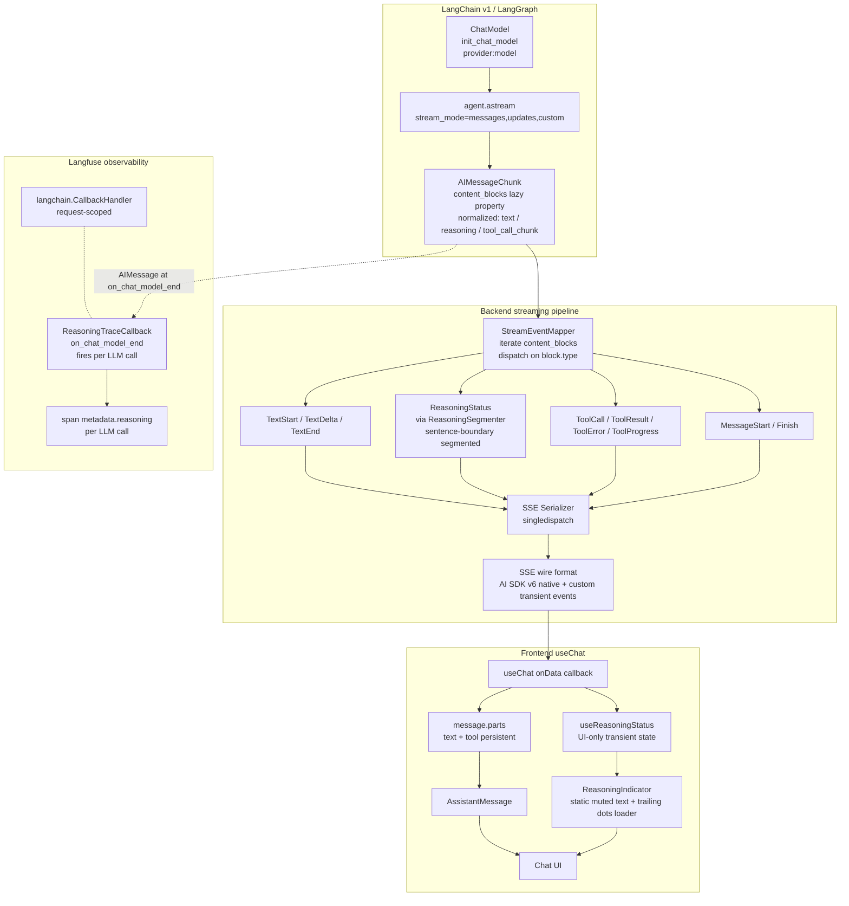
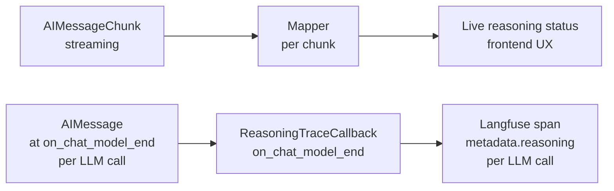

# Multi-Provider Streaming with Reasoning Status — Design

> Status: Draft
> Source requirements: `artifacts/current/requirements.md`
> UI mockup: `artifacts/current/mockups/reasoning_status_states.html`（Variant A · 字級 0.72rem · 含 Anthropic Option B re-entry State 7a/7b/7c · Topic 5 stalled modifier · Topic 6 post-tool idle State 11/12 · Topic 14 abort sub-states State 9a/9b · Topic 15/16 mid-text interrupt State 9c/10b · Topic 12 long-sentence overflow hard-clip demo · 已 user-approved）

## 1. Overview

這份 design 把兩件耦合的工作合併處理：

1. **Provider swap**：v1–v5 五個 agent 從 OpenAI 切到 Gemini 2.5 Flash；LLM-as-judge 改用 GPT-5-mini（cross-vendor）
2. **Streaming pipeline + reasoning UX upgrade**：修掉 provider 切換後 streaming 直接報錯的 bug，順便讓 reasoning 過程以 ephemeral reasoning status 形式呈現給使用者，並把 reasoning 寫進 Langfuse trace 供事後回溯

兩件事必須一起做：(1) 換 provider 立即觸發 streaming pipeline 的 list-of-blocks bug，(2) 修這個 bug 同時就拿到 reasoning content，順勢做 reasoning status 是邊際成本最低的時機。

## 2. Goals / Non-Goals

### Goals

| ID | Requirement |
|---|---|
| F1 | v1–v5 五個 agent version 統一切到 Gemini 2.5 Flash |
| F2 | LLM-as-judge 改用 `gpt-5-mini`（cross-vendor） |
| F3 | Streaming pipeline 對任意 LangChain v1 chat model provider 跑通；驗收矩陣 = {OpenAI Responses, Anthropic Claude 4.x, Gemini 2.5} × {reasoning-on, reasoning-off} = 6 cases |
| F4 | Reasoning content 以獨立 stream channel 暴露給前端，不混入 final answer |
| F5 | Reasoning UI 採 ephemeral reasoning status：streaming 期間 `ReasoningIndicator` 把每一個 reasoning sentence 即時投射；reasoning 結束 → indicator 消失；reasoning 文字**不**進 message persistent state |
| F6 | 每個 thinking moment 都要有 reasoning status：pre-tool-selection、post-tool-result-synthesizing 都顯示；非 reasoning model 維持固定 idle 文字 |
| F7 | Reasoning 內容寫到 Langfuse 供事後回溯，**每個 LLM call 各自一塊** |
| F8 | `Orchestrator.invoke`（non-streaming）也支援多 provider；若 `init_chat_model` 的抽象已足夠則 code 零變動 |

### Non-Goals

- LLM-as-judge whitelist 驗證
- 對 reasoning 內容做 LLM-as-judge / scorer
- Reasoning UI design system 重做（沿用既有 `ReasoningIndicator` 視覺語彙）
- 改 `Orchestrator.invoke` 的 non-streaming 路徑
- Vertex AI 認證路徑
- Anthropic 為 default provider
- xAI Grok（reasoning 走 `additional_kwargs` 破壞抽象，Fast tier 實戰資料稀少）
- 主動處理 Anthropic `signature` / Gemini `thoughtSignature` / OpenAI `encrypted_content` 的 multi-round round-trip — 仰賴 LangChain + LangGraph 框架
- **User-facing model / provider 切換 UI**：agent 的 provider binding 由 admin 在 codebase 設定，user 無法 runtime 切換（D24）。Mid-session cross-provider signature contamination 不是 user-facing 問題

## 3. Architecture



## 4. Component Responsibilities & Boundaries

紅 = 新增；藍 = 修改；其他 = 不變。

### 4.1 Backend

#### 🔵 `StreamEventMapper`（modified · `backend/agent_engine/streaming/event_mapper.py`）

職責：從 `AIMessageChunk` 解出 DomainEvent 序列。

- 改用 `chunk.content_blocks` 而非 `chunk.content`（**這是 streaming bug 的核心修復**）
- 新增 reasoning block 處理路徑，餵給內部的 `ReasoningSegmenter`
- 新增 LLM-call boundary 偵測（chunk.id 變化 → flush + reset segmenter）
- **`chunk.id` None policy (D27 / T7.1)**：當 `msg_chunk.id is None` 視為 same-call continuation，不 trigger flush + reset；避免 provider 在 continuation chunk 上 emit None 時誤觸 boundary detection
- **reasoning_id per LLM call (D27 / T7.2)**：同一個 chunk.id 內不論有幾個邏輯 reasoning blocks（含 Anthropic interleaved 的 D13 case），統一共用一個 `_current_reasoning_id`；frontend setText 連續 update，不需區分 block-level lifecycle
- 在轉換點 flush segmenter：當 block.type 從 `reasoning` 切到 `text`、或收到 `tool_call_chunks` 時，主動呼叫 `segmenter.flush()` 把殘留尾段（沒 terminator 的最後一句）也送出，避免使用者看不到 reasoning 最後一個 status
- **Hold-and-flush ordering (D28 / T21)**：處理 reasoning→text/tool 轉換時必須先 emit `segmenter.flush()` 出來的 ReasoningStatus event，**再** emit TextStart 或 ToolCall event；SSE wire 順序保證 frontend 收到 reasoning text 後才收到 `text-start` / `tool-input-available`，避免 frontend `useReasoningStatus.handleData` 在 flush event 抵達前就已 clear
- **Stream-loop finalize (D34 / T22)**：新增 `finalize() → Iterator[DomainEvent]` method，主 stream loop 在 `agent.astream()` 迭代結束後呼叫一次，內部執行 `_segmenter.flush()` 把 buffer 內最後尾段包成 `ReasoningStatus` event yield。涵蓋邊角 case：reasoning 是 LLM call 最後 block 且後面沒 text/tool/下一個 chunk.id（既有 3 個 flush trigger 都不觸發）

既有 `StreamEventMapper` instance state（**per-request**, D33 / T20）擴增：

```
+ _segmenter: ReasoningSegmenter           # mapper 自己 instantiate
+ _current_llm_call_id: str | None         # 來自 chunk.id（LangChain 給的，同 LLM call 共享）
+ _current_reasoning_id: str | None        # 當前 reasoning lifecycle 的 id；非 null 代表「reasoning 進行中」
```

**Mapper instance scope (D33 / T20)**：每個 chat HTTP request 建立**獨立**的 `StreamEventMapper`（per-request，非 per-session）。Multi-tab 同 session 並發 streaming 不會互相污染 segmenter buffer / `_current_llm_call_id` / `_current_reasoning_id`。Langfuse contextvars 在 async coroutine context 內天然 per-request scope。

**Cancellation handling (D35 / T25)**：當 `asyncio.CancelledError` 觸發（user abort），stream handler 必須執行：
1. 中斷 `agent.astream()` 迭代（cancel propagation 到 LangChain）
2. Cancel in-flight LLM API call（避免 quota 浪費）
3. 呼叫 `mapper.finalize()` 一次：把 segmenter 殘留尾段 emit 為 `ReasoningStatus`（**不送 SSE，連線已斷**）；此 event 流向 ReasoningTraceCallback 路徑，寫進 Langfuse trace metadata（user 看不到尾段，但 operator 可從 trace 還原）
4. 在 Langfuse `agent.run` root span 寫入 `metadata.status = "aborted"` (D35 / T25.C)
5. **不**嘗試 emit final SSE event 給 frontend：fetch abort 已斷 socket，write 送不到；frontend abort 是 frontend-driven (useChat.stop callback) 已涵蓋 UX


`_current_reasoning_id` 的 monotonic uniqueness（每次新 lifecycle 拿到不重複的 id）由 implementation 自己處理（用 `itertools.count()` 或 internal counter），design 層不暴露。

LLM call 邊界偵測：

```python
def is_new_llm_call(msg_chunk_id: str | None) -> bool:
    # D27 / T7.1: None 視為 continuation
    if msg_chunk_id is None:
        return False
    return msg_chunk_id != self._current_llm_call_id

if is_new_llm_call(msg_chunk.id):
    # 真正的 LLM-call boundary
    self._segmenter.flush()       # emit 上一輪殘留尾段
    self._segmenter.reset()
    self._current_llm_call_id = msg_chunk.id
    self._current_reasoning_id = None  # 下一個 reasoning block 觸發 lazy mount
```

`_current_reasoning_id` 在新 LLM call 時 reset 為 None；同一 LLM call 內所有 reasoning blocks 共用同一個 mount 後的 id（D27 / T7.2）。

#### 🔴 `ReasoningSegmenter`（new · `backend/agent_engine/streaming/reasoning_segmenter.py`）

職責：把 streaming 進來的 reasoning 字串片段切成完整句子。

- `feed(delta) → Iterator[sentence]` — 餵進 chunk delta，yield 已完成的句子
- `flush() → str | None` — 取出 buffer 內未完成的尾段
- `reset()` — LLM call 邊界呼叫，清空 buffer

Sentence boundary 規則：
- 半形 `.!?` **後接 whitespace** 才算（避免 `3.14` / `v1.2` 誤切）
- 全形 `。！？` 直接算（中文不需空白）
- `\n` 永遠算
- **Char-count fallback (D26)**：當 buffer 累積 ≥ **80 字** 仍無 terminator → soft-emit 整段並 reset 該段 buffer。處理 Gemini 繁中 reasoning 整段無 `。` 的 case，避免 user streaming 期間長時間看不到任何 reasoning text
- 已知 trade-off：`Dr. Smith` 仍會被誤切，acceptable cost

#### 🔵 `DomainEventSchema`（extended · `backend/agent_engine/streaming/domain_events_schema.py`）

新增一個 frozen dataclass（沿用既有 event 的 `@dataclass(frozen=True)` convention，不引入 Pydantic — DomainEvent 是 internal value object，hot path 上 frozen dataclass 比 BaseModel 輕量，且 `functools.singledispatch` 直接認 dataclass class hierarchy）：

```python
@dataclass(frozen=True)
class ReasoningStatus:
    reasoning_id: str
    text: str
```

`DomainEvent` union 新增 `ReasoningStatus`。其他 event 不變。

#### 🔵 `SSE Serializer`（extended · `backend/agent_engine/streaming/sse_serializer.py`）

新增一個 `@serialize_event.register`：

```python
@serialize_event.register
def _(event: ReasoningStatus) -> str:
    payload = {
        "type": "data-reasoning-status",
        "id": event.reasoning_id,
        "data": {"text": event.text},
        "transient": True,
    }
    # D39 / T27: server-side guard against missing transient flag
    assert payload["type"].startswith("data-reasoning-") and payload.get("transient") is True, \
        "reasoning SSE event must have transient=True"
    return _sse(payload)
```

完全 mirror 既有 `ToolProgress → data-tool-progress` 的 transient 模式，**不引入新模式**。

**Server-side defense (D39 / T27.c)**：assert + production warning log 確保 reasoning SSE event 一律帶 `transient: True`；missing flag 在 dev/CI 直接 raise，prod 則 log warning 不 raise（避免 abort 整個 stream）。配合 frontend filter (D39 / T27.b) 形成 belt-and-suspenders 防 D2 single-contract 失效。

#### 🔴 `ReasoningTraceCallback`（new · `backend/agent_engine/streaming/reasoning_trace_callback.py`）

職責：把每個 LLM call 的完整 reasoning 內容 attach 到該次 span 的 metadata。

- 繼承 LangChain `BaseCallbackHandler`
- 覆寫 `on_chat_model_end(response: LLMResult, ...)`：從 `response.generations[0][0].message` 拿 final `AIMessage`，filter `content_blocks` 取 `type == "reasoning"`，join 成單一字串
- **永遠呼叫** `update(metadata={"reasoning": <value>})`，不論有無 reasoning content（D29 / 8.3 always-write-key contract）
- **value 規則**：
  - 有 reasoning content → 實際 reasoning 文字
  - reasoning-capable provider 但無 content（reasoning-off mode 或 model 沒 emit reasoning）→ `""` empty string（D29 / 8.1）
  - non-reasoning-capable provider（agent config 標記）→ `"<unsupported>"` sentinel（D29 / 8.3）
- **Size cap**：value 超過 **500KB** 則截斷並接 marker `... [truncated, original {N} bytes]`（D29 / 8.2）
- 註冊在 orchestrator 的 callback list 中，與 Langfuse `langchain.CallbackHandler` 並存
- **Scope 限制 (D30 / 9.1)**：只在 production agent invocation path 註冊；**judge model invocation（gpt-5-mini，跑在 Braintrust eval CLI）不註冊此 callback**，judge reasoning 不寫 Langfuse `metadata.reasoning`。Judge 自己的觀測由 Braintrust 處理（per memory `feedback_braintrust_host_only.md`）

關鍵設計：與 `StreamEventMapper` **完全解耦**，只共用「`AIMessage.content_blocks`」這個資料來源。

##### Live UX vs Trace content divergence (D36 / T23)

兩條路徑（live UX via mapper、trace persistence via callback）有**已知可接受的內容差異**：

| 路徑 | 資料來源 | 內容形式 |
|---|---|---|
| Live UX (frontend ReasoningIndicator) | `AIMessageChunk.content_blocks` per-chunk delta → segmenter sentence-level emit | Sentence-segmented for human readability |
| Trace persistence (Langfuse `metadata.reasoning`) | `AIMessage.content_blocks` (assembled at `on_chat_model_end`) → join all reasoning blocks | 完整 raw reasoning |

**Contract**: AIMessage 是 model ground truth；trace 寫的是「model 想了什麼」，UX 寫的是「user 看到什麼」。兩者在 abort / error / 邊角 provider behavior 下可能微小差異，acceptable。Operator 要查 model reasoning → 找 trace；要 reproduce user 體驗 → 看 SSE log。

#### Operator query contract

`metadata.reasoning` 的三種 value 對應的 query 語意：

| Query | 涵蓋 |
|---|---|
| `WHERE metadata.reasoning IS NOT NULL` | 所有 chat_model spans（key 永遠存在）|
| `WHERE length(metadata.reasoning) > 0` | 有實際 reasoning content 的 spans（排除 `""`）|
| `WHERE metadata.reasoning != '<unsupported>'` | 排除 non-reasoning-capable provider 的 spans |
| `WHERE metadata.reasoning LIKE '%[truncated%'` | 找出 size cap 觸發的 spans（debugging 用）|

### 4.2 Frontend

#### 🔴 `useReasoningStatus`（new · `frontend/src/hooks/useReasoningStatus.ts`）

職責：訂閱 SSE 上的 `data-reasoning-status` 事件，對外暴露當前 reasoning status 文字。Pattern mirror 既有 `useToolProgress.ts`（同 `frontend/src/hooks/`）。

- React hook，內含一個 `string | null` state + 兩個 internal guard refs（D31）
- 對外 export：`{ reasoningStatusText, handleData, clearReasoningStatus, resetForNewTurn }`
  - `handleData(dataPart)` — 給 `useChat.onData` 用
  - `clearReasoningStatus()` — 給 app-level 動作呼叫
  - `resetForNewTurn()` — 由 `useChat.onSubmit` 呼叫，重置 guards

6 個 clear trigger 分兩類：

| 類別 | Triggers | 接點 |
|---|---|---|
| **SSE 事件類** | `text-start` / `tool-input-available` / `finish` / `error` | hook 內 `handleData` callback 一起判斷 type 後 `setText(null)` |
| **App-level 動作類** | user abort（`useChat.stop()`）、clear conversation、新 user message 送出 | 由呼叫端（ChatHeader / Composer / useChat onSubmit）呼叫 hook export 的 `clearReasoningStatus()` |

收到 `data-reasoning-status` → `setText(payload.data.text)`。

##### Guards (D31 / T13.A + T19)

兩個 internal `useRef<boolean>(false)`：

- **`clearedRef`**（T13.A clear-race guard）：`clearReasoningStatus()` 呼叫時 set true；`handleData()` 開頭 check，true 則 ignore 該 SSE event。Backend 可能還有 ~200ms in-flight buffered events，這個 flag 防 setText 被重新填上。`resetForNewTurn()` 呼叫時 reset 為 false
- **`finishedRef`**（T19 reject-after-finish guard）：`handleData()` 收到 `finish` 或 `error` event 時 set true；後續任何 `data-*` event 一律 ignore。`resetForNewTurn()` 呼叫時 reset 為 false

```typescript
function handleData(part) {
  if (clearedRef.current) return;       // T13.A guard
  if (finishedRef.current) return;      // T19 guard
  switch (part.type) {
    case 'data-reasoning-status':
      setText(part.data.text);
      break;
    case 'text-start':
    case 'tool-input-available':
      setText(null);
      break;
    case 'finish':
    case 'error':
      setText(null);
      finishedRef.current = true;
      break;
  }
}
```

##### Abort-then-resend (D32 / T13.B)

User abort 後 prior turn 顯示 State 9c (frozen partial text + STOPPED label)；user 立刻 resend 新 message：
- Prior turn 是 `messages` array 內 immutable assistant message，自然 persist 在 chat history
- 新 turn 透過 `useChat.append()` 新增 assistant message 到 array 末尾
- Two bubbles 並存於 chat list，不需特別清理 prior STOPPED
- `useReasoningStatus` 的 state 跟 prior turn 解耦（prior 已不再 mutate；新 turn 透過 `resetForNewTurn()` 重新開始）

#### 🔵 `ReasoningIndicator`（modified · `frontend/src/components/atoms/ReasoningIndicator.tsx`）

兩件事一起改：
1. **新增功能**：accept optional text，渲染為 reasoning status（streaming / frozen 兩態）
2. **既有 pre-response 3-dot 動畫一併調整**：點變小、container 縮高、貼底對齊，讓 `null → text` 切換時不會出現垂直跳動

```typescript
interface ReasoningIndicatorProps {
  text?: string | null;
  state?: 'streaming' | 'frozen';  // for abort case
}
```

行為：

| `text` | `state` | 渲染 |
|---|---|---|
| null | n/a | 3-dot bouncing animation（pre-response idle） |
| 有內容 | streaming | static muted text + trailing dots cycler（0→1→2→3→0 loop） |
| 有內容 | frozen | static text（dim opacity 0.65）+ STOPPED label（abort case） |

##### 視覺規格 — Reasoning status text 模式（`text` 非 null）

- 字級：`0.72rem`（≈ 12.7px @ html 110%；vs response `0.875rem`，差異 17.7% 階層感明顯）
- 字色：`var(--muted-foreground)`（lightness 0.62）
- italic
- **渲染：純文字**（D20）—— `<span>{text}</span>` 直接渲染、HTML special chars escape 防 XSS；**不**做 Markdown render；reasoning 內若含 backticks / asterisks / code fences 等 markdown syntax 一律字面顯示
- **超長 sentence overflow**（D21）—— `.reasoning-status` 用 flex layout；text span 套 `overflow: hidden; white-space: nowrap; flex: 1; min-width: 0` 在容器邊緣 hard-clip（不加 `text-overflow: ellipsis`）；dots cycler `flex-shrink: 0` 永遠 visible
- Trailing dots cycler（句尾 0→1→2→3 dot 循環）：`var(--muted-foreground)`、`letter-spacing: 0.08em`、`padding-left: 5px` 跟文字保持距離
- Margin top: `-8px`（讓 reasoning status 跟前一個 element 視覺距離比 response 更窄）
- STOPPED label（frozen 態）：`0.62rem`、padding `1px 5px`，對應主字級縮小

##### 視覺規格 — Pre-response idle 3-dot 模式（`text == null`）

跟 reasoning status text 模式**搭配同一個 vertical slot**，避免切換時感覺往上/往下跳：

- 點直徑：`0.4rem`（≈ 7px @ 110%；對齊 0.72rem 文字的視覺比例，比原 `0.5rem` 更小）
- 點之間 `gap`：`3px`（原 `4px`，配合縮小的點）
- 點顏色：`var(--muted-foreground)`，`border-radius: 9999px`
- Container 高度：`calc(0.72rem * 1.5)` —— 等於 reasoning-status text 一行 line-box（font 0.72 × line-height 1.5），讓 idle dots 跟 reasoning status 佔同樣的垂直空間
- Container padding：`4px 12px 6px`（上少下多，把點往下推）
- Container `align-items: flex-end` —— 點貼容器底部，**最低點與 reasoning status text 底部對齊**
- Bounce animation：`translateY(-25%) ↔ 0`，1s 週期，相鄰點 0.15s 延遲

> 對齊原理：State 1（idle dots）跟 State 2（reasoning text）在同一容器位置（chat-area gap 後第二個 child）。`align-items: flex-end` + 統一 line-box 高度確保 dots 最低點與 text 底部視覺底邊一致，切換時無垂直位移感。

完整視覺 reference 見 `mockups/reasoning_status_states.html`（含 standard 10-state lifecycle + Anthropic Option B re-entry 系列 State 7a/7b/7c，**所有規格以 mockup HTML/CSS 為實作 source of truth**）。

#### 🔵 `shouldShowReasoningIndicator`（modified · `frontend/src/lib/reasoning-indicator-logic.ts`）

新增 `reasoningStatusText` 入參，並補 Topic 6 post-tool idle 分支：

```typescript
function shouldShowReasoningIndicator({
  status, lastMessage, reasoningStatusText
}): boolean {
  if (status === "ready" || status === "error") return false;
  if (!lastMessage || lastMessage.role !== "assistant") return true;
  if (reasoningStatusText) return true;       // reasoning status active (含 idle text) overrides 其他條件
  if (lastMessage.parts.length === 0) return true;
  // NEW (Topic 6): post-tool idle gap — last part 是 tool 且已完成、stream 還在跑、無 active reasoning
  const lastPart = lastMessage.parts.at(-1);
  if (lastPart?.type === "tool" && isToolComplete(lastPart) && status === "streaming") {
    return true;  // → ReasoningIndicator 渲染 idle text "Synthesizing..." 或 "Thinking..."
  }
  return false;
}
```

`useReasoningStatus` 需要在偵測到「last part 是 completed tool 且 reasoningStatusText null」時，自動 set `reasoningStatusText` 為 idle text（"Synthesizing..." / "Thinking..."）。詳見 §7.4。

#### 🔴 `LiveStatusAnnouncer`（new · `frontend/src/components/atoms/LiveStatusAnnouncer.tsx`）

ARIA 對 screen reader 的 hybrid status 廣播器（D22）。

職責：在 chat lifecycle 關鍵 transition 寫高層級 status text 進一個視覺隱藏（`.sr-only`）的 `aria-live` region，讓 screen reader user 知道系統階段，但**不**逐句 announce reasoning content。

```typescript
interface LiveStatusAnnouncerProps {
  status: ChatStatus;          // useChat status (ready / streaming / error)
  lastEvent: SSEEvent | null;  // 最近一個 SSE event（用於判斷 transition）
}
```

DOM 結構：
```html
<div role="status" aria-live="polite" class="sr-only">
  {currentStatusText}
</div>
```

`.sr-only` CSS（standard pattern）：
```css
.sr-only {
  position: absolute;
  width: 1px; height: 1px;
  padding: 0; margin: -1px;
  overflow: hidden;
  clip: rect(0, 0, 0, 0);
  white-space: nowrap;
  border: 0;
}
```

Transition → announce 字串對照（D16 全英文）：

| Transition | Announce text |
|---|---|
| Stream start | `Generating response` |
| Tool call start (`tool-input-available`) | `Calling {tool_name}` |
| Tool result (`tool-output-available`) | `Tool {tool_name} completed` |
| Tool error (`tool-output-error`) | `Tool {tool_name} failed` |
| Final answer text starts (`text-start`) | （silent — 答案 text 本身是 message content，screen reader 會自然讀）|
| Finish | `Response complete` |
| User abort | `Response stopped` |
| Stream error | `Error: {error message}` |

**不 announce 的內容**：
- Reasoning text（每 turn 8-12 句、ephemeral，逐句 announce 會 queue 延遲 30 秒以上，desync 嚴重）
- Idle text "Synthesizing" / "Thinking"（已有「Tool ... completed」+「Generating response」夾住，不需要冗餘 announce）
- 3-dot idle animation（純視覺）
- Stalled state visual（screen reader user 沒 visual 反饋需求）
- Long-silence stalled modifier（同上）

#### Component-level ARIA spec（D22）

| Component | ARIA |
|---|---|
| `ReasoningIndicator`（任何 mode：idle dots / reasoning text / idle text / frozen STOPPED） | `aria-hidden="true"` —— 內容由 `LiveStatusAnnouncer` 代為 announce，視覺對 sighted user，不對 screen reader |
| `ToolCard`（running / success / error / aborted） | `aria-hidden="true"` —— 同上 |
| `AssistantMessage` 的 final response text (`response-text`) | 不加 ARIA（screen reader 自然讀 message content；既有 message a11y） |
| `ErrorBlock` | `role="alert"`（隱含 `aria-live="assertive"`）—— error 屬於需立即注意的事件 |
| `LiveStatusAnnouncer` | `role="status"` + `aria-live="polite"` + `.sr-only` |
| `STOPPED` label（State 9 / 9a / 9c frozen） | 不加單獨 ARIA —— 由 LiveStatusAnnouncer 在 abort transition announce「Response stopped」處理 |

#### 🔵 Frontend `data-reasoning-*` filter（D39 / T27.b · defense in depth）

防 D2 transient flag 假設失效：`AssistantMessage.tsx` 的 `parts.map` dispatcher 顯式 filter 任何 `type` 開頭為 `data-reasoning-` 的 part：

```typescript
// AssistantMessage.tsx
const filteredParts = message.parts.filter(
  (part) => !part.type.startsWith('data-reasoning-')
);
return filteredParts.map(...);
```

理由：即使 SSE event 因 bug / library 升級沒帶 `transient: true` 而被 AI SDK 寫進 `message.parts`，dispatcher 階段也不會 render 出來；reasoning 永遠不可能洩漏進 persistent UI。配合 server-side serializer assert (D39 / T27.c) 形成 belt-and-suspenders。

#### 不變的元件

`AssistantMessage.tsx` 的 `parts.map` dispatcher 不需要新增 reasoning **render** 分支 — reasoning 不進 `message.parts`。但需要新增 reasoning **filter** 分支（上面 D39 規格）。

## 5. Wire Format

### Domain event → SSE event 對照

| DomainEvent | SSE wire | Persistent in `message.parts`? |
|---|---|---|
| MessageStart | `start` | metadata only |
| TextStart | `text-start` | yes |
| TextDelta | `text-delta` | yes（incremental）|
| TextEnd | `text-end` | yes |
| ToolCall | `tool-input-available` | yes |
| ToolResult | `tool-output-available` | yes |
| ToolError | `tool-output-error` | yes |
| ToolProgress | `data-tool-progress` (transient) | no |
| **ReasoningStatus** | **`data-reasoning-status` (transient)** | **no — UI-only transient** |
| Finish | `finish` | metadata only |

### `data-reasoning-status` payload

```json
{
  "type": "data-reasoning-status",
  "id": "reasoning-0",
  "data": { "text": "理解 user 在問 risk factors 的變化" },
  "transient": true
}
```

`transient: true` 讓 AI SDK v6 知道不要持久化進 `message.parts`。

## 6. Langfuse Integration

### 6.1 兩條獨立路徑



> 注意：每個 chat_model invoke 對應自己一個 LangChain span。`on_chat_model_end` callback 在**每次** LLM call 結束時觸發（不是整個 turn 結束才觸發），所以多輪 LLM call 的 reasoning 會自然分塊到各自的 span metadata。


| 路徑                | 觸發                                | 內容粒度                             | 失敗影響              |
| ----------------- | --------------------------------- | -------------------------------- | ----------------- |
| Live UX           | per chunk during streaming        | 句子級（segmented for human reading） | UX 退化（看不到 reasoning status） |
| Trace persistence | per LLM call at on_chat_model_end | 整段（per call 完整 reasoning）        | Trace 缺一塊（不影響使用者） |

### 6.2 `metadata.reasoning` schema 對照

per D29，每個 chat_model span `metadata.reasoning` key 一律存在，value 依場景：

| 場景 | `metadata.reasoning` value |
|---|---|
| Reasoning-on，model emit reasoning content | 實際 reasoning 文字（join 多個 reasoning blocks）|
| Reasoning-on，model 沒 emit reasoning（短 prompt 邊角）| `""` empty string |
| Reasoning-off mode（reasoning-capable provider）| `""` empty string |
| Non-reasoning-capable provider（agent config 標記）| `"<unsupported>"` sentinel |
| Reasoning content > 500KB | 前 500KB + `... [truncated, original {N} bytes]` marker |
| Judge model (gpt-5-mini) call | **N/A** —— judge 不掛 ReasoningTraceCallback，無 metadata.reasoning（D30）|

### 6.3 SEC 範例的 Langfuse trace tree

```
trace: chat_request
└── span: agent.run
    ├── 🔵 span: chat_model.invoke #1
    │     metadata.reasoning: "user 在問 risk factors 的變化，先看 10-K 結構，
    │                          選 list_sec_sections"
    ├── span: tool.list_sec_sections
    ├── 🔵 span: chat_model.invoke #2
    │     metadata.reasoning: "Item 1A 命中問題；Item 7 MD&A 也常涉及 risk，
    │                          一併讀"
    ├── span: tool.get_section (Item 1A)
    ├── span: tool.get_section (Item 7)
    └── 🔵 span: chat_model.invoke #3
          metadata.reasoning: "兩段內容拿到，組織成新增/加強/刪去三類，條列呈現"
```

每個 🔵 是一個獨立的 chat_model span，各自帶該次的 reasoning。

### 6.4 Streaming Observability Guardrails 對齊

| Guardrail rule | 我們的對齊 |
|---|---|
| Use request-scoped `langfuse.langchain.CallbackHandler` | 不變，沿用既有 |
| Don't rely on per-chunk current-trace mutation as a core mechanism | ✅ ReasoningTraceCallback 是 **per LLM call**（在 `on_chat_model_end`），不是 per chunk |
| `@observe` only on deterministic single-return functions | ✅ ReasoningTraceCallback 不用 @observe，是 BaseCallbackHandler subclass |
| Set correlation attributes at orchestration entry point | 不變 |

## 7. UX Specification — 10 Standard States + 3 Anthropic Re-entry + 2 Post-tool Idle + 2 Abort Sub-states + 2 Mid-text Interrupt Sub-states

完整視覺見 `mockups/reasoning_status_states.html`。本節列 state machine 與行為。

### 7.1 Standard 10-state lifecycle

| State | 條件 | Indicator 行為 |
|---|---|---|
| 1. Pre-response idle | `parts.length == 0` AND no reasoning status text | 3-dot bouncing animation |
| 2. Reasoning streaming（LLM call N）| 收到 `data-reasoning-status` | static muted text + trailing dots cycler |
| 3. Tool executing（single）| 收到 `tool-input-available` → reasoning status cleared | 隱藏（ToolCard 接手） |
| 4. Reasoning streaming（LLM call N+1）| 新 chunk.id → 新 reasoning_id → 新 reasoning status | 同 state 2，文字覆蓋 |
| 5. Tool executing（multiple parallel）| 多個 ToolCard 同時 running | 隱藏 |
| 6. Reasoning streaming（synthesizing）| 最後一輪 LLM call 的 reasoning | 同 state 2 |
| 7. Final answer streaming | 收到 `text-start` → reasoning status cleared | 隱藏，inline cursor 接手 |
| 8. Done | `finish` event | 全部 transient state 清空 |
| 9. **User abort** | `useChat.stop()` 觸發，reasoning text 或 idle text 在螢幕上 | reasoning/idle text 凍結最後一句（dim opacity 0.65）+ `STOPPED` label；該次 running tool 變 aborted state。**沒有 text 可 freeze 的 case 見 §7.5 (State 9a / 9b)** |
| 10. **Stream error mid-flight** | `error` event 或 network drop（pre-text-start 階段；含 reasoning streaming / idle text / pre-response idle） | ephemeral content（reasoning text / idle text / 3-dot）**隱藏**，下方顯示 `ErrorBlock`；維持既有 D11 asymmetry。**Mid-text-start error 見 §7.6 (State 10b)** |

### 7.2 Anthropic interleaved reasoning · Option B re-entry (State 7a / 7b / 7c)

Anthropic Claude 4.x extended thinking 在**同一個 chat_model call 內**可能 emit `reasoning → text → reasoning → text` 多次切換。OpenAI Responses 邊角會出現；Gemini 幾乎不會。

設計選擇 **Option B：re-entry to State 2 mid-text** —— 對齊 F6「每個 thinking moment 都要有 reasoning status」精神（D13）。

| State | 條件 | Indicator 行為 |
|---|---|---|
| 7a. **Reasoning re-entry**（mid-text 第 N 次） | 已進入 State 7 後，收到新的 `data-reasoning-status` | indicator 在已 streamed text **下方**重新顯示；`shouldShowReasoningIndicator` 因 `reasoningStatusText` 非 null 回傳 true（§4.2 line 224） |
| 7b. **Text resumes** | 下一個 `text-delta` 抵達 → reasoning status cleared | indicator 隱藏，inline cursor 接回 text 末尾 |
| 7c. **Subsequent re-entry** | 同上，可任意次數來回 | 同 7a，indicator 在更長的 text 下方再次出現 |

State 7 ↔ State 2 互相切換不限次數；視覺平順度的 trade-off 由 Topic 21 (clear-on-text-start ordering) 決定。

### 7.3 Long-silence stalled modifier (Topic 5 Option e)

Reasoning streaming 中段，模型可能靜默 15–30 秒（Gemini 深度思考 / Anthropic extended thinking 常見）。Variant A 的 trailing dots 一直規律 cycle，使用者無法區分「深思中」vs「stream 死了」。

**設計選擇：Option (e) 後端 SSE keepalive baseline + 前端 stalled-state 視覺**（D14）

| Layer | 機制 |
|---|---|
| Backend (C4.5 Include scenario) | 每 15 秒送 `: ping\n\n` SSE comment，防止 nginx/Vercel/iOS Safari idle timeout 砍連線 |
| Frontend `useReasoningStatus` | 維護 `lastUpdateAt` ref；setInterval 每秒檢查；超過 **10 秒**沒收到新 `data-reasoning-status` chunk 就 toggle `.stalled` CSS class |

**Stalled state 視覺規格**（套用 `.stalled` modifier 時）：

- Trailing dots cycle 從 `1.4s` 變慢到 `2.5s`（約 1.8x 慢）
- Trailing dots opacity 從 `1.0` 降到 `0.55`
- Reasoning text **不變動**（preserve 閱讀脈絡，避免打斷使用者讀那句 reasoning）
- Transition: `opacity 800ms ease`（避免硬切）
- 下一個 `data-reasoning-status` chunk 抵達 → 立即移除 `.stalled` modifier 恢復 normal

> **Topic 5 反問題（fast updates）決策**：兩句 reasoning <50ms 連續到達時不做 min-display queue；接受 React batched render 可能讓某句被 overwrite 看不到。Reasoning 為 ephemeral 一瞥定位，F6「每個 thinking moment 都要有 reasoning status」精神保留即可（出現過 indicator 即可），不保證每句都被看到。Topic 21 grace window 處理「最重要的最後一句」。

### 7.4 Post-tool idle indicator (Topic 6 / D15)

#### 問題範圍

Reasoning-off model（或 reasoning-on 但這個 turn 沒 emit reasoning chunk）走 tool-using turn 時，**tool 結束**到 **next text-start / next reasoning chunk** 之間有 3-7 秒空窗：
- `parts.length > 0`（ToolCard 已在 parts）
- `reasoningStatusText == null`（沒 reasoning 事件）
- 既有 `shouldShowReasoningIndicator` 落到 `return false` → 完全沒 indicator visible
- 違反 F6「每個 thinking moment 都要有 reasoning status」

#### 設計選擇 (D15)

| Sub-question | 決定 |
|---|---|
| **6.1 範圍** | 只補 post-tool gap；State 1 pre-response 維持既有 3-dot bouncing |
| **6.2 視覺** | Post-tool gap 用 Variant A 視覺（static italic muted text + dots cycler）；3-dot 跟 idle text 兩個 visual idiom 並存：3-dot=「query 剛送出，系統還沒做事」；idle text=「系統做了 tool，正在處理」 |
| **6.3 文字內容** | Context-aware 英文：`"Synthesizing"`（post-tool synthesis 階段）/ `"Thinking"`（multi-call mid gap）。語言選擇對齊 D16（hardcoded UI labels 預設英文）|
| **6 反問題（distinguishing logic）** | 預設用 `"Synthesizing"`（涵蓋 post-tool 多數情境，含 final synthesis）；只有在 frontend 已知接下來會有更多 tool（例如收到 next `tool-input-available` 之前的短暫 gap）才覆蓋為 `"Thinking"`。實作上可採簡化版「全部用 `Synthesizing`」 ship MVP，後續 iterate 區分 |

#### State 11 / 12 規格

| State | 條件 | Indicator 行為 |
|---|---|---|
| 11. **Post-tool synthesis** | `status === "streaming"` AND last part 是 completed tool AND no active reasoning text AND 沒有 in-flight `tool-input-available` | Variant A 視覺，`text = "Synthesizing"` + dots cycler |
| 12. **Multi-call mid-gap** | 同 State 11 條件 + frontend 已預期下一個是另一個 tool（heuristic：上一個 tool 結束 < N ms 內收到新的 `tool-input-available`） | Variant A 視覺，`text = "Thinking"` + dots cycler |

#### 實作要點

- `useReasoningStatus` 加 idle-text fallback 邏輯：當 `reasoningStatusText` null 但 `shouldShowReasoningIndicator` 因 post-tool gap 條件回 true 時，set text = `"Synthesizing"`（預設）或 `"Thinking"`（heuristic 命中時）
- `text-start` 抵達 → clear（接管為 cursor）
- `tool-input-available` 抵達 → clear（接管為 ToolCard，State 3/5）
- `data-reasoning-status` 抵達 → 覆蓋為實際 reasoning sentence（reasoning-on 時優先；reasoning-off 不會發生）
- **不套用 stalled modifier**：Topic 5 的 stalled state 只對 reasoning sentence 有意義；idle text 本身已是「等待」訊號

#### 跟 reasoning-on 的視覺一致性

| Mode | Indicator visual | Text 內容 |
|---|---|---|
| Reasoning-on, reasoning chunk 已到 | Variant A | 真實 reasoning sentence (e.g.「理解 user 在問 risk factors」) |
| Reasoning-on, 但這 turn 沒 emit reasoning（短 prompt 邊角） | Variant A | "Synthesizing" / "Thinking" idle text |
| Reasoning-off, post-tool gap | Variant A | "Synthesizing" / "Thinking" idle text |
| Pre-response（任何 mode） | 3-dot bouncing | n/a |

**結論**：reasoning-on 跟 reasoning-off 在 post-tool gap 的視覺一致；user 不需要 care 自己用哪個 mode。

### 7.5 Abort sub-states · State 9a / 9b (Topic 14 / D17)

State 9 假設 abort 時螢幕上有 reasoning text 或 idle text 可 freeze。但兩個情境沒有 text 可 freeze，需要獨立規格：

| State | 條件 | Indicator 行為 |
|---|---|---|
| 9a. **Pre-response idle abort** | `useChat.stop()` 觸發；State 1（3-dot bouncing）期間，無 reasoning/idle text 顯示 | 3-dot **直接移除**，只顯示 `STOPPED` label；用 `.reasoning-status` container 提供 vertical slot |
| 9b. **Pure tool abort** | `useChat.stop()` 觸發；當下處於 State 3/5（tool running）期間，reasoning 已 cleared、idle text 還沒進來 | running 中的 ToolCard 變 aborted state（dot color、文字「Aborted ...」）；**不額外加 STOPPED label**——ToolCard aborted 本身已是清楚訊號 |

#### 9a 視覺規格

- Container：沿用 `.reasoning-status`（`font-size: 0.72rem` italic、`padding: 0 12px`、`margin-top: -8px`）作為 vertical slot host
- 內容：只有單一 `.reasoning-status-frozen-label`（`0.62rem`、padding `1px 5px`、`color: var(--status-aborted)`、灰底 background）
- 不留 3-dot 殘影 —— user abort 後直接就是 STOPPED label，乾淨明確

#### 9b 設計理由

- State 9 canonical 形式是「STOPPED label 附在最後一個 active 的 reasoning/idle text 上」
- 沒有 active text 時，憑空 spawn 一個合成 placeholder host 給 STOPPED 反而引入新元件
- ToolCard aborted state 的 dot color (`var(--status-aborted)`) + 文字 prefix `Aborted ...` 已具備足夠視覺強度
- 對齊原則：「不重複展示同一訊號」（同 D11 對 ErrorBlock 的態度）

#### Edge case · 100ms transition gap (C7.3)

「reasoning 剛 cleared、ToolCard 還沒 render 完」的 < 100ms 視窗：abort 訊號傳到 backend > 100ms，ToolCard 通常已 render 完才被 kill → **退化為 9b 處理**，不需獨立規格。

### 7.6 Mid-text-start interruption · State 9c / 10b (Topic 15 / 16 / D18 / D19)

State 10 canonical 形式假設 error 發生在 pre-text-start 階段（reasoning streaming / idle text / pre-response idle），ephemeral content 直接 hide。但 **error 或 abort 也可能發生在 final answer text streaming 期間**（已有 `text-start`，partial text 已進 `message.parts`），這時 user 已拿到部分答案，UX 處理跟 pre-text-start 不一樣。

#### 設計原則

| 內容類型 | 中斷處理 |
|---|---|
| Ephemeral content (reasoning / idle text / 3-dot) | Error: hide；Abort: freeze + STOPPED |
| **Persistent content (`message.parts` 內的 partial answer text)** | **Error 與 abort 都 preserve**，不 throw away |

對 user 來說 partial 答案是有用的 context（可能足以判斷問題、可決定要不要 retry），不該被中斷事件清除。

#### State 9c / 10b 規格

| State | 條件 | Indicator 行為 |
|---|---|---|
| 9c. **Abort during text streaming** | `useChat.stop()` 觸發；當下處於 State 7（text streaming），partial text 已進 `message.parts` | partial text **保留**可讀；末尾 inline 加 `STOPPED` label，沿用 `.reasoning-status-frozen-label` 視覺規格（`0.62rem` / status-aborted color / 灰底 background）；inline cursor 消失 |
| 10b. **Error during text streaming** | `error` event 或 network drop；當下處於 State 7 | partial text **保留**可讀；下方追加既有 `.error-block`（沿用 State 10 設計）；inline cursor 消失；**不加 inline ERROR marker**——既有 stream-level error handling（AI SDK v6 + ErrorBlock）已是足夠訊號 |

#### 為何 9c 加 inline label，10b 不加

| 維度 | 9c (abort) | 10b (error) |
|---|---|---|
| 觸發來源 | User 主動 | 系統失敗 |
| 既有 surface | 沒有專屬 surface 給 abort（過去靠 reasoning text frozen 充當 anchor） | ErrorBlock 已是既有 stream-level error 顯示 surface（D11 / State 10 都用） |
| 額外 marker 需求 | 需要 STOPPED 告訴 user「我做的 stop 生效了」 | ErrorBlock 已負責訊號傳達；inline marker 重複展示違反 D11 精神 |
| 訊號 | `STOPPED` inline | `Stream interrupted` ErrorBlock 全文 |

→ 9c 跟 10b 的 asymmetry 跟 D11 一脈相承：**有既有 surface 就用既有的，沒有再新增**。

### Reasoning Status visual variant decision

| Variant | 描述 | 結論 |
|---|---|---|
| A. Static text + trailing dots cycler | 文字本身不動，句尾 0→1→2→3 dot 循環 | ✅ **採用** |
| B. Streaming-shimmer only | 沿用 `Markdown.tsx` 既有 streaming-shimmer class | ❌ 太低調，使用者讀不出 loading |
| C. Both shimmer + dots | 兩個都加 | ❌ 訊號疊加過度 |

選 A 的理由：
- "Thinking..." 是普世 loading 隱喻，trailing dots 是其視覺對應
- Reasoning reasoning status 跟 final response 的 streaming-shimmer 區隔開 — 兩個階段的「streaming」性質不同（reasoning ephemeral / response persistent），視覺不一致是 OK 的
- shimmer 在 dark bg 上動態範圍受限（chat-fg-secondary 0.85 ↔ foreground 0.96，range 0.11），用戶實測讀不出 loading 感

對應 mockup 已合併進 `reasoning_status_states.html` —— Variant A 為 user-approved 採用版本。

## 8. Key Design Decisions

| ID | Decision | Rationale |
|---|---|---|
| D1 | Approach: 純 LangChain `content_blocks` lazy property | 官方 doc 明文 normalize 三家 provider；最小工程量；無 fallback path 死代碼 |
| D2 | Reasoning 走 custom transient SSE event `data-reasoning-status` | AI SDK v6 native `reasoning-*` parts 是 persistent，跟 ephemeral UX 不合；沿用既有 `ToolProgress` transient 模式。**Supersedes requirements.md §5/§9 的 native reasoning-* parts 提案** |
| D3 | Backend sentence-boundary segmentation | LangChain reasoning chunk 是字元片段非句子；frontend 不該塞語言邏輯 |
| D4 | Langfuse 走獨立 `ReasoningTraceCallback`（per LLM call） | 避開 streaming guardrail STOP CONDITION；自然分塊到對應 span；與 mapper 解耦 |
| D5 | Variant A: static muted text `0.72rem` + trailing dots | shimmer 對 reasoning 太低調；trailing dots 是普世 thinking 隱喻；reasoning vs response 視覺區隔（差 17.7% 階層感明顯） |
| D6 | Test matrix 6 cases (3 provider × 2 mode) | 務實平衡，不做完整 sub-variant 矩陣 |
| D7 | Anthropic 列 test matrix 但無 default agent version 用它 | 保留可擴展性，無 commit |
| D8 | xAI Grok 不採用 | reasoning 走 `additional_kwargs` 破壞抽象；Fast tier 實戰資料稀少 |
| D9 | 不留「(thought for X seconds)」metadata 給 user | reasoning 完全 ephemeral；persistent metadata 屬 future scope |
| D10 | Abort: reasoning status frozen + STOPPED label | 給使用者明確「streaming 中斷」訊號，不只是消失 |
| D11 | Error mid-stream: reasoning status 消失，只留 ErrorBlock | ErrorBlock 已是現有 error 處理 surface，不重複展示 |
| D12 | OpenAI multi-summary: block 之間用 `\n` 餵 segmenter | LangChain 把 summary array 攤平成多 block；用 `\n` 確保不同 summary 不會黏在一起 |
| D13 | Anthropic interleaved reasoning ↔ text: **Option B re-entry** （indicator 在已 streamed text 下方重新出現） | 對齊 F6「每個 thinking moment 都要顯示 reasoning status」；忠實呈現模型完整思考流；Anthropic 是主要使用 provider；OpenAI 邊角偶發、Gemini 幾乎不會。視覺跳動風險由 Topic 21 (clear-on-text-start ordering) 緩解 |
| D14 | Long-silence UX: **Option (e) hybrid** —— SSE keepalive baseline + 前端 dots 在 10s 無新 chunk 後變慢（1.4s→2.5s）+ 變淡（opacity 1.0→0.55），text 不變動 | C4.5 keepalive 解決連線層；前端 stalled-state 提供視覺透明度（區分「深思」vs「卡死」）；不切換 text 避免打斷閱讀；不做 min-display queue（fast-update overwrite 接受為 best-effort，reasoning 為 ephemeral 一瞥定位）|
| D15 | Post-tool idle indicator: **State 1 (pre-response) 維持 3-dot；post-tool gap 用 Variant A 視覺 + context-aware 英文 idle text** (`Synthesizing` / `Thinking`) | 補 F6「每個 thinking moment 都要有 reasoning status」對 reasoning-off + tool-using turn 的洞；Reasoning-on/off 在 post-tool 視覺一致；3-dot 留給 pre-response 維持「query 剛送出」訊號區分；語言對齊 D16 |
| D16 | System-level UI labels（`STOPPED` / `Synthesizing` / `Thinking` / `Stream interrupted` / button labels / error titles 等）**全部使用英文硬寫**，不引入 i18n infra | Webapp 同時服務中英文 user，沒有 i18n framework；英文當共同 denominator，避免 over-engineer。**僅適用 system-level UI labels**，不適用 user-generated content（chat messages、reasoning text、document content 等仍隨 user/model 自然語言）。未來若要 i18n，再 refactor 字串到 translation module |
| D17 | Abort sub-states: **9a (pre-response idle abort)** 3-dot 直接移除，只顯示 STOPPED label；**9b (pure tool abort)** 只靠 ToolCard aborted state，不另加 STOPPED label | State 9 canonical 形式假設有 reasoning/idle text 可 freeze；補這兩個無 text 的 case。9a 直接用 STOPPED label 表達中斷，3-dot 凍結反而留下殘影沒必要；9b 不重複展示訊號（ToolCard aborted dot color + 文字 prefix 已足夠），對齊 D11 的「不重複展示」原則 |
| D18 | Stream error 維持 D11 asymmetry：error 一律**隱藏 ephemeral content**（reasoning text / idle text / 3-dot），由既有 `ErrorBlock` 接管。Tool error 沿用既有 tool error UI | 既有 stream-level error handling（AI SDK v6 + ErrorBlock）已是 canonical surface；ephemeral content 跟 ErrorBlock 競爭視覺空間沒有 user 價值；abort vs error 的視覺差異（freeze vs hide）由各自的觸發者語意自然區分（user 主動 vs 系統失敗），不需要硬要對稱 |
| D19 | Mid-text-start interruption: **partial answer text 保留 in `message.parts` 不清除**。9c (abort during text) 末尾 inline 加 STOPPED；10b (error during text) 沿用既有 ErrorBlock 在下方，**不加 inline ERROR marker** | Persistent content (parts 內 text) 跟 ephemeral content 不同處理：partial 答案對 user 有 retry value，不該被中斷清除。9c 跟 10b 的 inline marker asymmetry 對齊 D11 / D18：有既有 surface 就用既有的，不重複展示 |
| D20 | Reasoning text 渲染為**純文字**（plain `<span>`），不 render Markdown | Reasoning 為 ephemeral 一瞥（1-2 秒閃過），markdown render 投資 ROI 低；mid-stream partial markdown（如未閉合的 `**bold`）有壞 layout 風險；reasoning 整段已 italic，markdown italic 反而違和；code fences / lists / headings 不適合 inline 一行 sentence。實作零成本：`<span>{text}</span>` + escape HTML special chars 防 XSS。**Backticks / asterisks 字面顯示**作為已知 trade-off，1-2 秒閃過的內容可接受。未來若做 collapsible reasoning panel 可升級為 selective markdown |
| D21 | Long-sentence overflow: **single-line hard-clip without `text-overflow: ellipsis`**。`.reasoning-status` flex container；text 用 `overflow: hidden` + `white-space: nowrap` + `flex: 1` + `min-width: 0` 在容器邊緣硬截；trailing dots cycler `flex-shrink: 0` 永遠 visible 在 text 之外 | 600+ 字 CJK 無終止符 sentence 不允許 wrap 到多行（會破壞 chat layout、違反 ephemeral 性質）；不加 `…` ellipsis 是因為要避免跟既有 trailing dots cycler `...` 視覺撞——dots cycler 動畫本身已是「還有更多 / 還在 streaming」的訊號，再加靜態 `…` 重複展示。短句 case 此 modifier 無作用（不會誤觸發 clip） |
| D22 | ARIA: **Hybrid pattern** —— `ReasoningIndicator` / `ToolCard` 加 `aria-hidden="true"`（內容對 screen reader 透明）；新增 `LiveStatusAnnouncer` 元件用 `role="status"` + `aria-live="polite"` + `.sr-only` 在關鍵 transition (stream start / tool call / tool result / finish / abort / error) 寫高層級 status text；`ErrorBlock` 用 `role="alert"`；reasoning content **不**逐句 announce | 完整 announce reasoning text (8-12 句/turn) 會 queue 延遲 30+ 秒，screen reader 收到時 stream 早結束，information-vs-visual 嚴重 desync；完全 silent 又對視障 user 失敗。Hybrid 對齊 ChatGPT / Claude.ai pattern：transition-level status 給 a11y，content-level 由 message body 自然 readable 處理。Announce 字串全英文對齊 D16 |
| D23 | Provider boot 失敗的 user-facing surface 採**三路分流**：(1) **Pre-SSE-open** raise → HTTP 5xx，由 `useChat` `onError` callback 顯示 fetch-level error UI；(2) **Mid-stream** error event → `ErrorBlock` (State 10)；(3) **Hung**（quota exhausted、provider 沉默）→ backend-side 30s timeout 後送 SSE `error` event → 退化成 case (2) | 三條失敗路徑在 server 端本質不同（pre-init / mid-stream / silent-timeout），統一在 ErrorBlock 會抹平 root cause 差異。Pre-SSE 5xx 由 useChat fetch error pattern 處理（既有 AI SDK v6 機制）；mid-stream 走 ErrorBlock；hung 加 backend timeout 後 fall through 到 mid-stream，避免 user 永遠卡 State 1 |
| D24 | **User-facing model / provider 切換 UI 不在 scope 內**：agent provider binding 由 admin 在 codebase 設定，user 無法 runtime 切換。Mid-session cross-provider signature contamination (Gemini `thoughtSignature` / Anthropic `signature` / OpenAI `encrypted_content` mismatch) 不是 user-facing 問題 | 切 model 是 admin/deploy-time 行為，非 user flow；UI 不需要 provider switcher、不需要 sanitize history、不需要 contamination recovery flow。**C1.3 / C1.4 從 BDD scope 移除**。同 provider session 內的 abort recovery (C3.6) 仍保留為 backend 正確性 scenario |
| D25 | **Canonical reasoning-rich prompt** 為 `Compare Apple's 10-K fiscal year 2024 vs 2023 Item 1A risk factors and categorize changes (added / strengthened / removed)`；6-case matrix 各 reasoning-on case 斷言 **`data-reasoning-status` event count ≥ 1**（依靠 prompt 本身的複雜度保證 multi-call reasoning） | 固定 prompt 讓 E2E 結果可重現；prompt 必須觸發 multi-call (list_sec_sections + get_section ×2 + synthesize) 才能驗證 multi-LLM-call reasoning 切換；≥1 而非 ≥N 避免 brittle test，但 prompt 已保證複雜度足夠；若某 provider 真的回 0 reasoning events，是 R1 風險 (content_blocks normalizer 不完整) 觸發 ship-blocker。**Note**: 早期 wording 用 "Q3 2024 vs Q3 2023" 觸發 Gemini one-shot pushback（10-K 是年報無季度）— Round 1 v2 verification 改成 fiscal year + Item 1A 明確化 |
| D26 | Segmenter sentence boundary 加 **char-count fallback**：buffer 累積 ≥ 80 字仍無 terminator 就 soft-emit 整段 + reset 該段 buffer。Terminator 規則仍優先 | Gemini 繁中 reasoning 常整段沒 `。`，純 terminator-only 規則會讓 segmenter 一直 buffer，user streaming 期間 30s 看不到 reasoning text，違反 F6；80 字邊界對應 CJK 一行視覺長度（與 Topic 12 hard-clip 同等級），soft-emit 不過分切碎；正常英文 reasoning 不受影響（terminator 自然觸發）|
| D27 | **chunk.id 邊界偵測**：`chunk.id is None` 視為 same-call continuation 不 trigger flush+reset（T7.1）；同一個 chunk.id 內所有 reasoning blocks 共用一個 `_current_reasoning_id`（T7.2，frontend setText 連續 update） | 部分 provider 在 continuation chunk emit None，視為 boundary 會 mid-thought 切斷 segmenter buffer 造成 ghost reset；reasoning_id per-LLM-call 的粒度跟 D22 ARIA 對齊（LiveStatusAnnouncer 也是 per-LLM-call announce），block-level id 在目前 frontend 沒 use case |
| D28 | **Hold-and-flush ordering**：`StreamEventMapper` 處理 reasoning→text/tool 轉換時，先 emit `segmenter.flush()` 出來的 `ReasoningStatus` event，再 emit `TextStart` 或 `ToolCall` event；SSE wire 順序保證 frontend 收到 flushed-tail 後才收到 `text-start` / `tool-input-available` | Backend ordering 保證取代 frontend grace window；frontend `useReasoningStatus` 邏輯極簡（直接 setText null on text-start/tool-input-available）；確保 final synthesizing call 的最後一句 reasoning 永遠在 frontend 看得見 |
| D29 | **`metadata.reasoning` schema contract**：(8.1) reasoning-capable provider 無 content → `""` empty string；(8.2) value 超過 **500KB** 截斷接 `... [truncated, original {N} bytes]` marker；(8.3) non-reasoning-capable provider 寫 sentinel `"<unsupported>"`；(always) key 永遠存在於 chat_model span metadata（不論 reasoning-on/off / 是否有 content / 是否 capable） | 統一 schema 讓 operator query 可預期：`IS NOT NULL` 抓 chat_model spans、`length > 0` 抓有 content、`!= '<unsupported>'` 排除 non-reasoning provider、LIKE truncate marker 找 size 邊緣 case；500KB 對 Langfuse ~1MB span field cap 留 buffer；sentinel 用 `<>` 包覆避免跟真實 reasoning content 撞 |
| D30 | **ReasoningTraceCallback scope 限制**：只在 production agent invocation path 註冊；**judge model (gpt-5-mini) 不註冊此 callback**，judge reasoning 不寫 Langfuse `metadata.reasoning`；judge 自己的觀測 100% 由 Braintrust 處理 | 避免 judge rubric 內容透過 Langfuse trace 洩漏（"the answer correctly identifies X because the rubric says Y"）；對齊 memory `feedback_braintrust_host_only.md` —— eval 在 host CLI 跑，本來就跟 Langfuse production trace 分離；自動避免 cross-vendor schema drift（agent 長 CoT vs judge 結構化 verdict） |
| D31 | **`useReasoningStatus` 兩個 guard refs**：`clearedRef`（clearReasoningStatus 後 ignore in-flight buffered SSE，防 200ms drain race）+ `finishedRef`（收到 finish/error 後 ignore 後續 data-*，防 ghost ReasoningIndicator re-appear）；兩 guards 由 `resetForNewTurn()` 在 useChat.onSubmit 時重置 | T13.A clear-race 跟 T19 late-events-after-finish 是同類問題（frontend 該不該接收某 SSE event）；用兩個 ref 各自處理觸發條件不同但 reject 邏輯一致；ref 而非 state 避免不必要 re-render；`resetForNewTurn` 統一 reset 點避免 reset 邏輯散落 |
| D32 | **Abort-then-resend coexistence**：prior turn 的 State 9c (frozen partial text + STOPPED) 保留在 message history；新 turn 透過 `useChat.append()` 新增 assistant message bubble；不特別清理 prior STOPPED label | Message-list 架構天然處理 multi-turn 並存；prior STOPPED 在 history 上有訊息價值（告訴 user 過去那 turn 沒寫完）；不需 explicit cleanup |
| D33 | **`StreamEventMapper` instance scope = per-request**（非 per-session）：每個 chat HTTP request 建立獨立 mapper；同 session 多 tab 並發 streaming 各自 isolated；Langfuse contextvars 在 async coroutine context 天然 per-request scope | per-session 共享是 design.md §4.1 既有 dangerous wording；per-request 是正確 scope；multi-tab 是真實 user 行為（power user 經常開多 tab）；per-request 沒實作成本，本來 mapper 就是隨 stream 開啟才創建 |
| D34 | **Stream-loop finalize**：`StreamEventMapper` 加 `finalize()` method；主 stream loop 在 `agent.astream()` 迭代結束後一律呼叫一次（natural finish），內部 `_segmenter.flush()` 把 buffer 內未斷句尾段 emit 為 `ReasoningStatus` event | 既有 3 個 flush triggers (D28: reasoning→text、tool_call_chunk、chunk.id 變化) 不涵蓋 "reasoning 是 LLM call 最後 block 且後面沒 text/tool/下一個 call" 邊角 case；finalize() 補洞讓 buffer 100% 不會漏；不破壞 mapper / ReasoningTraceCallback 解耦（仍是 mapper 內部處理）|
| D35 | **User abort backend protocol**：(A) close-only 不送 final SSE event（fetch abort socket 已斷，write 無意義）；(B) cancellation 觸發時必須 cancel agent.astream + cancel in-flight LLM API + 呼叫 mapper.finalize() 寫入 Langfuse + 寫入 `metadata.status = "aborted"` 在 agent.run root span (C) | 抓住 frontend abort 後 backend 該做什麼的完整 protocol；segmenter finalize 即使 user 看不到，仍寫進 Langfuse trace 讓 operator 可還原；status 標記讓 operator query 可區分 aborted / completed / errored 三類；對齊 D29 metadata schema 風格 |
| D36 | **Live UX vs Trace content divergence 接受**：mapper 路徑寫 sentence-segmented（user 看到什麼）；ReasoningTraceCallback 從 AIMessage.content_blocks 重組整段（model 想了什麼）；兩者在 abort / error / 邊角 provider behavior 可能微小差異，acceptable | Trace persistence 應為 model ground truth，不應為 UX 渲染版本；強制一致會破壞 D4 解耦設計；雙寫加 trace size 沒收益；operator 兩種需求（debug user 體驗 / 查 model reasoning）走不同 source 自然解決 |
| D37 | **Langfuse trace-level attribute propagation**：trust LangChain BaseCallbackHandler dispatch + Langfuse contextvars，POC ship gate 驗證；失敗 fallback 到顯式 `on_chat_model_start` capture + `propagate_attributes()` | LangChain async callback dispatch 應該天然 propagate contextvars；R5 既有 POC mitigation 涵蓋此驗證點，不重複 setup；顯式 propagate 增加 callback 複雜度，沒必要除非 POC 失敗；ship gate 加具體驗證內容（用 session_id filter 篩出 reasoning span）|
| D38 | **R1 ship-time policy = per-provider graceful degrade**：若 LangChain `content_blocks` 對某 provider 缺 reasoning blocks，不寫 fallback normalizer（守住 D1）、不 hard block ship；UX 落到 D15 idle text "Synthesizing..." / "Thinking..."；`metadata.reasoning` 落 `""`；release notes 記載 known limitation | D15 idle text 是 D1 + R1 之後新加的設計，已天然 cover graceful degrade；寫 fallback 違反 D1 commitment 且維護成本高（相當部分重寫 LangChain v1 normalize）；hard block ship 太嚴格（單一 provider 失敗整個 feature 推遲不划算）；F6 spirit 由 idle text 滿足；user-visible loss 僅是 reasoning text 不可見，整體 chat 可用 |
| D39 | **Transient flag belt-and-suspenders**：(b) Frontend `AssistantMessage` `parts.map` 顯式 filter `type.startsWith('data-reasoning-')` 的 part、不 render；(c) Backend SSE serializer 加 `assert payload['transient'] is True for type startswith 'data-reasoning-'` + production warning log | D2 single-contract trust 風險高（一個 missing flag bug 永久污染 message.parts，reload 仍洩漏 reasoning）；兩層各自為 trivial 實作（一行 filter + 一行 assert）；regression test (C2.1/C2.2/C2.5) 仍保留作為 catch-all；defense in depth 對齊 F5「reasoning 不進 message persistent state」的 hard contract |

## 9. Testing Strategy

驗收 gate 是 **provider × mode E2E + Langfuse trace 驗證**，unit / integration 屬於 implementation 階段的標準動作，不是 ship gate。

### E2E 矩陣（Playwright，video 錄影）

```
Canonical prompt (D25):
  "Compare Apple's 10-K fiscal year 2024 vs 2023 Item 1A risk factors and
   categorize changes (added / strengthened / removed)"

Base cases:    3 providers × 2 modes = 6 cases
UX state cases:
  - User abort during reasoning      ← 驗 reasoning status frozen + STOPPED label + tool aborted state
  - Stream error mid-flight          ← 驗 reasoning status 消失 + ErrorBlock 出現
  - Status A → B transition          ← 驗 reasoning status 文字平順切換（同一 LLM call 內多句 / 跨 LLM call）
```

每個 case：
- Playwright 跑 canonical prompt（D25 固定，觸發 multi-call: list_sec_sections + get_section ×2 + synthesize）
- Video 錄影 → PR 描述附下載連結，reviewer 親眼看每家 streaming 行為
- 斷言：streaming 完成、**reasoning-on case 至少 1 個 `data-reasoning-status` event**、無 console / network error
- **Langfuse trace 驗證**：每個 chat_model span 都有 `metadata.reasoning` key（thinking on 非空，thinking off 可空但 key 存在）

UX state cases 屬硬性 gate，因為 abort / error 是 reasoning status lifecycle 的兩個關鍵收尾路徑，沒測等於沒驗。

### 為什麼 E2E 是硬 gate

- streaming + reasoning + Langfuse 三條路徑只有真實 provider call 能驗證
- LangChain `content_blocks` normalizer 對某 provider 的支援度只能由真實 chunk 揭露
- Langfuse callback ordering 跟 span lifecycle 同樣只能由真實 trace 揭露

## 10. Risks

| ID  | Risk                                                                              | Mitigation                                                                                                          |
| --- | --------------------------------------------------------------------------------- | ------------------------------------------------------------------------------------------------------------------- |
| R1  | LangChain `content_blocks` normalizer 對某 provider 不完整                             | **Per-provider graceful degrade (D38)**：reasoning blocks 抓不到時 → 沒 `data-reasoning-status` events → frontend 落到 D15 idle text "Synthesizing..." → 整個 chat 仍可運作（tool / text 正常）；`metadata.reasoning` 落 `""`。Release notes 記載 known limitation；不 block ship；不寫 fallback normalizer（守住 D1）|
| R2  | Gemini `thoughtSignature` 多輪 round-trip 仰賴 LangChain + LangGraph 自動處理             | E2E case (Gemini thinking on) 涵蓋 multi-round；失敗則 workaround（降版 / 暫關 thinking）；default 是 thinking off，非 ship blocker |
| R3  | Gemini API quota 比 OpenAI 嚴                                                       | 啟動前查 quota；eval batch 必要時加 rate limit                                                                               |
| R4  | OpenAI Responses summary multi-entry 在同一 chunk 出現                                 | E2E case (OpenAI Responses) 涵蓋；segmenter 用 `\n` 接保證切句                                                               |
| R5  | `ReasoningTraceCallback` 與 Langfuse `langchain.CallbackHandler` callback ordering + trace-level attribute propagation (D37) | POC 階段跑一輪 multi-call thinking model 驗證：(1) callback chain ordering（`get_current_observation()` 回傳 chat_model span 而非 parent agent.run）；(2) trace-level attributes (`session_id`, `user_id`) 經 contextvars 自動繼承到 chat_model span（用 Langfuse trace API filter session_id 可篩出 reasoning span）。失敗則 fallback 到顯式 capture span reference 在 `on_chat_model_start` + 用 `propagate_attributes()` 替代 |
| R6  | Langfuse per-LLM-call reasoning 覆蓋率                                               | 6 E2E 都跑 trace 驗證：每個 chat_model span `metadata.reasoning` key 必存在                                                   |

## 11. Out of Scope

- Reasoning content 的 token usage 拆分顯示
- Reasoning 折疊偏好持久化（user setting）
- Reasoning 引用 / cite 的 inline link
- 從 reasoning 抽取 tool-call rationale 給 ToolCard
- Provider-specific config UI（thinking budget、reasoning effort）
- Judge model whitelist 驗證
- 多 vendor 同時並存（v1 跑 Gemini、v2 跑 Anthropic 等 mix）
- Vertex AI 認證路徑
- 主動處理 thinking signature round-trip
- Reasoning persistent metadata（"thought for X seconds"）

## 12. References

### LangChain Docs

- Streaming reasoning tokens: `oss/python/langchain/streaming.mdx#streaming-thinking-/-reasoning-tokens`
- Standard content blocks: `oss/python/langchain/messages.mdx#standard-content-blocks`
- Reasoning frontend UX: `oss/python/langchain/frontend/reasoning-tokens.mdx`
- Provider prefix `init_chat_model`: `oss/python/concepts/providers-and-models.mdx`
- LangChain Google GenAI integration: `langchain-google-genai`

### Wire Format

- AI SDK v6 native event types: `text-start` / `text-delta` / `text-end` / `tool-input-available` / `tool-output-available` / `tool-output-error` / `data-*` (custom transient)

### 本專案相關

- 既有 streaming pipeline：`backend/agent_engine/streaming/{event_mapper,sse_serializer,domain_events_schema}.py`
- 既有 frontend reasoning UI：`frontend/src/components/atoms/ReasoningIndicator.tsx`、`frontend/src/lib/reasoning-indicator-logic.ts`
- Streaming observability 規範：`backend/agent_engine/CLAUDE.md` + `backend/agent_engine/docs/streaming_observability_guardrails.md`
- Mockup（user-approved，Variant A · 0.72rem · 含 Anthropic Option B re-entry State 7a/7b/7c）：`artifacts/current/mockups/reasoning_status_states.html`

### Provider API

- Gemini Developer API: <https://aistudio.google.com/apikey>
- OpenAI Models: <https://platform.openai.com/docs/models>
- Anthropic Models: <https://docs.anthropic.com/en/docs/about-claude/models>
