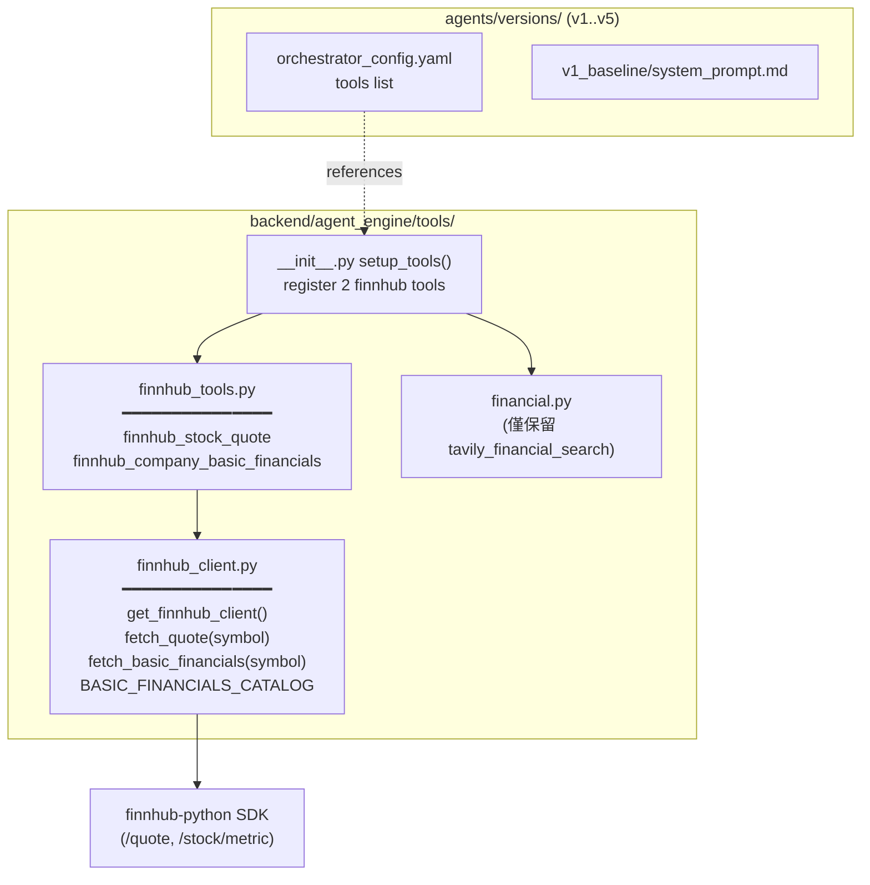
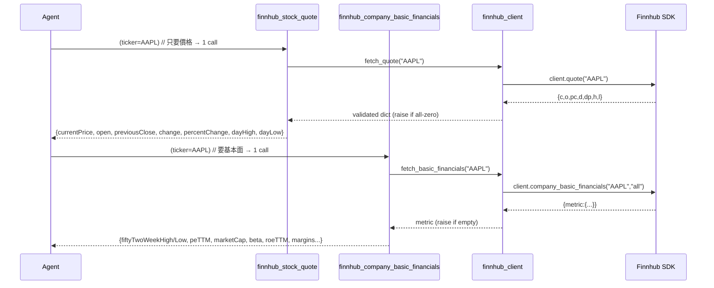

# Design: 以 Finnhub Free-Tier API 抽換 Agent 的 Yahoo Finance 工具

## 背景與動機

FinLab-X agent 目前透過 `yfinance`（Yahoo Finance 非官方 scraping library）取得即時股價與基本面資料，常踩到 Yahoo 的 **rate limit / IP throttling**，導致 tool call 不穩定。

本 design 把 agent 的兩個 yfinance tool **整個抽換**成 [Finnhub](https://finnhub.io/) 官方 REST API（透過官方 `finnhub-python` SDK），只使用 **Free tier**（60 calls/min）即可取得的 endpoint 與 field。

> **範圍**：只動 **agent tool**（`backend/agent_engine/`）。`backend/ingestion/quant_data_pipeline/`（離線 quant ETL，另有自己的 yfinance 使用）**不在本 PR 範圍**。`tavily_financial_search`（新聞，非 Yahoo）**保留不動**。

---

## 關鍵研究結論：Finnhub Free-Tier 欄位映射

來源：Context7 `/finnhub-stock-api/finnhub-python` 與 `/websites/finnhub_io_api`（官方文件鏡像）。

| 現有 yfinance 欄位 | Finnhub free-tier 來源 | 備註 |
|---|---|---|
| `currentPrice` | `/quote` → `c` | ✅ 即時；單一 endpoint |
| `fiftyTwoWeekHigh/Low` | `/stock/metric`（Basic Financials）→ `52WeekHigh/Low` | ✅ free，但是**另一個** endpoint |
| `trailingPE` | `/stock/metric` → `peTTM` | ✅ |
| `forwardPE` | ~~❌ free tier 無~~ → ✅ `/stock/metric` → `forwardPE` | 原判定有誤，live 驗證推翻（見文末修訂記錄 R2）；**欄位保留** |
| `/stock/price-metric`（52 週） | ❌ **Premium-only** | **不使用**；改用 `/stock/metric` |
| `/stock/profile`（v1 完整 profile） | ❌ **Premium** | 不使用 |
| `/stock/profile2` | ✅ free | 本 design **不需要**（marketCap/beta 已在 `/stock/metric`） |

### Finnhub free endpoint 行為要點（實作必踩）

1. **`quote('AAPL')`** 回傳 `{c, d, dp, h, l, o, pc, t}`：
   - `c`=current、`o`=open、`pc`=previous close、`d`=change、`dp`=% change、`h`=day high、`l`=day low（**注意：是「當日」高低，不是 52 週**）。
2. **無效 ticker → 不會 raise**，而是回傳**全 0**：`{c:0, h:0, l:0, o:0, pc:0, d:None, dp:None, t:0}`。
   → 必須在 client 層判定「全 0」為無效 ticker 並 `raise ValueError`。
3. **`company_basic_financials('AAPL', 'all')`** 回傳 `{metric:{...}, series:{...}, metricType:'all', symbol:'AAPL'}`；`metric` 內含 `52WeekHigh/Low`、`peTTM`、`marketCapitalization`、`beta`、`roeTTM`、margins 等。無效 ticker → `metric` 為空 `{}`。
4. **Rate limit (429)** → SDK 拋 `finnhub.exceptions.FinnhubAPIException(status_code=429)`；交由既有 `_HandleToolErrors` middleware sanitize（不在本 PR 加 retry）。

---

## 架構



### 資料流（agent 問股價 + 基本面）



---

## 模組設計

### `backend/agent_engine/tools/finnhub_client.py`（新增，domain core）

```python
import os
import finnhub

def get_finnhub_client() -> finnhub.Client:
    """Build a Finnhub client from FINNHUB_API_KEY.

    Resolved at call time (not import) so tests can patch this seam and so a
    missing key only fails when a finnhub tool is actually invoked.
    """
    api_key = os.getenv("FINNHUB_API_KEY")
    if not api_key:
        raise ValueError("FINNHUB_API_KEY is not set.")
    return finnhub.Client(api_key=api_key)


def fetch_quote(symbol: str) -> dict:
    """Return validated real-time quote. Raise ValueError on unknown ticker."""
    data = get_finnhub_client().quote(symbol)
    # Finnhub returns all-zero for unknown symbols (no exception).
    if not data or (data.get("c") in (0, None) and data.get("pc") in (0, None)):
        raise ValueError(
            f"No quote data for ticker '{symbol}'. The symbol may be invalid, "
            f"delisted, or not covered by Finnhub free tier."
        )
    return data


def fetch_basic_financials(symbol: str) -> dict:
    """Return the 'metric' map. Raise ValueError when empty (unknown ticker)."""
    data = get_finnhub_client().company_basic_financials(symbol, "all")
    metric = (data or {}).get("metric") or {}
    if not metric:
        raise ValueError(
            f"No basic financials for ticker '{symbol}'. The symbol may be "
            f"invalid or not covered by Finnhub free tier."
        )
    return metric
```

#### 基本面欄位 catalog（單一 source of truth）

`BASIC_FINANCIALS_CATALOG: dict[str, FieldSpec]` —— output key → (Finnhub `metric` key, 中性英文描述)。由 `finnhub_company_basic_financials` 使用（review 修訂後 discovery tool 已移除，見文末修訂記錄）。

| Output key | Finnhub metric key | Description |
|---|---|---|
| `fiftyTwoWeekHigh` | `52WeekHigh` | 52-week high price |
| `fiftyTwoWeekLow` | `52WeekLow` | 52-week low price |
| `peTTM` | `peTTM` | Trailing twelve-month P/E ratio |
| `forwardPE` | `forwardPE` | Forward P/E ratio |
| `psTTM` | `psTTM` | Trailing twelve-month price-to-sales |
| `pb` | `pbQuarterly` | Price-to-book ratio |
| `marketCap` | `marketCapitalization` | Market capitalization (millions of reporting currency) |
| `enterpriseValue` | `enterpriseValue` | Enterprise value (millions of reporting currency) |
| `beta` | `beta` | Beta coefficient |
| `epsTTM` | `epsTTM` | Earnings per share (TTM) |
| `roeTTM` | `roeTTM` | Return on equity (TTM) |
| `roaTTM` | `roaTTM` | Return on assets (TTM) |
| `grossMarginTTM` | `grossMarginTTM` | Gross margin (TTM) |
| `netProfitMarginTTM` | `netProfitMarginTTM` | Net profit margin (TTM) |
| `operatingMarginTTM` | `operatingMarginTTM` | Operating margin (TTM) |
| `currentRatio` | `currentRatioQuarterly` | Current ratio |
| `quickRatio` | `quickRatioQuarterly` | Quick ratio |
| `debtToEquity` | `totalDebt/totalEquityQuarterly` | Debt-to-equity ratio |
| `dividendYield` | `dividendYieldIndicatedAnnual` | Indicated annual dividend yield |
| `revenueGrowthTTMYoy` | `revenueGrowthTTMYoy` | Revenue growth (TTM YoY) |
| `epsGrowthTTMYoy` | `epsGrowthTTMYoy` | EPS growth (TTM YoY) |
| `tenDayAvgVolume` | `10DayAverageTradingVolume` | 10-day average trading volume |

> 取值時只輸出 `metric` 內**實際存在**的 key（present-only），避免一堆 `null` 浪費 token。實作時以 smoke test 校正每個 Finnhub key 的正確拼寫（free tier 實際回傳為準）。

### `backend/agent_engine/tools/finnhub_tools.py`（新增，2 個 `@tool`；review 修訂前為 3 個）

沿用既有 tool 慣例：`@tool(name, args_schema=...)`、`InjectedToolCallId`、`get_stream_writer()`（try/except 容錯）、回傳 `dict[str, Any]`。

**Tool 1 — `finnhub_stock_quote(ticker)`**（即時報價，1 call）
```json
{
  "ticker": "AAPL",
  "currentPrice": 190.5,
  "open": 188.0,
  "previousClose": 187.2,
  "change": 3.3,
  "percentChange": 1.76,
  "dayHigh": 191.2,
  "dayLow": 187.9
}
```
Stream event：`{"status":"querying_stock","message":"Querying AAPL...","toolName":"finnhub_stock_quote","toolCallId":...}`

**Tool 2 — `finnhub_company_basic_financials(ticker)`**（基本面，1 call）
```json
{
  "ticker": "AAPL",
  "fiftyTwoWeekHigh": 260.1,
  "fiftyTwoWeekLow": 164.0,
  "peTTM": 28.4,
  "marketCap": 2900000,
  "beta": 1.25,
  "roeTTM": 147.2,
  "netProfitMarginTTM": 24.3
}
```
（只列 present 的 catalog 欄位。）Stream event：`status="querying_financials"`。

**Tool 3 — `finnhub_get_available_fields(ticker)`**（已於 review 修訂移除）

原設計沿用舊 `yfinance_get_available_fields` 的 discovery 語意，但 review 發現它與
Tool 2 打同一個 `/stock/metric` endpoint、回傳資訊為 Tool 2 的嚴格子集（描述是
static 常數），discovery→fetch 流程使基本面問題的 API 成本翻倍。已移除；catalog
欄位摘要改寫進 Tool 2 的 tool description（LLM 決定呼叫前即可見，零成本揭露）。
詳見文末修訂記錄。

### Error handling

| 情境 | 行為 |
|---|---|
| `FINNHUB_API_KEY` 未設 | `get_finnhub_client()` raise `ValueError("FINNHUB_API_KEY is not set.")` |
| 無效 ticker（quote 全 0 / metric 空） | client 層 raise `ValueError(...invalid/delisted...)` |
| 429 rate limit / 網路錯誤 | SDK 拋 `FinnhubAPIException` / `FinnhubRequestException`，bubble up → `_HandleToolErrors` middleware sanitize |

所有 tool 一律 `raise`（非 return error dict），與 SEC tool 一致。

### Observability

- 沿用既有 `get_stream_writer()` SSE 機制，**無新 async 路徑、無新 observability backend**。
- 是否加 `@observe()`：與既有 yfinance tool 對齊（目前未加）。遵守 `backend/agent_engine/CLAUDE.md` guardrail——只有需要 nested span/custom metadata 才加；本 PR 不加。

---

## System prompt / 既有檔案改動

### DECISION-001：Citation 規則去 Yahoo 化（需在實作前定稿）

現有 `v1_baseline/system_prompt.md` 把 **citation 綁死 Yahoo**：每個 quote claim 必須附 `https://finance.yahoo.com/quote/TICKER`。Finnhub 是 API、free tier **沒有 per-ticker 公開頁面**，硬編一個不存在的 URL 會違反 ZERO HALLUCINATION POLICY。

**採用方案**：
- 即時報價 / 基本面 claim → 以 **provider/tool 名稱**標註（"According to Finnhub real-time quote data..."），**不強制 per-ticker URL**。
- 真正有 URL 的來源（Tavily 新聞、SEC filing）→ 維持原本的 inline `[N]` + 底部 reference 規則。
- 移除「yfinance-backed claims 必附 Yahoo URL」整段 + Example 1 的 Yahoo URL + `forwardPE` 欄位（free tier 無）。

> 此為唯一具產品語意的決策點；其餘皆機械式改名。

### 受影響檔案（agent 子系統）

| 檔案 | 改動 |
|---|---|
| `tools/finnhub_client.py`、`tools/finnhub_tools.py` | **新增** |
| `tools/financial.py` | 移除 2 個 yfinance tool + `import yfinance`；保留 tavily |
| `tools/__init__.py` `setup_tools()` | register 改為 3 個 finnhub tool |
| `agents/versions/v1..v5/orchestrator_config.yaml` | tools list：`yfinance_*` → `finnhub_*`（3 個） |
| `agents/versions/v1_baseline/system_prompt.md` | 重寫 quote 範例（Finnhub 欄位）、套用 DECISION-001、移除 forwardPE/Yahoo URL |
| `agents/base.py` | `_DEFAULT_SYSTEM_PROMPT` 與 budget 訊息：`yfinance`/`Yahoo Finance` → `Finnhub`（純改名，語意不變） |
| `streaming/tool_error_sanitizer.py` | docstring 範例 `'yfinance API timeout'` → `'Finnhub API timeout'` |
| `agent_engine/README.md`、`tools/README.md` | 文件改名 yfinance → Finnhub |
| `evals/datasets/language_policy.py` + `evals/scenarios/language_policy/dataset.csv` | LP-05/LP-06 `expect_tool: yfinance_stock_quote` → `finnhub_stock_quote` |
| `pyproject.toml` | 移除 `yfinance>=1.2.0`（agent 端）、加 `finnhub-python`；**保留 yfinance 若 ingestion pipeline 仍依賴**（見下） |

> **yfinance 依賴去留**：`backend/ingestion/quant_data_pipeline/` 仍用 yfinance。`pyproject.toml` 的 `yfinance` **不可直接移除**——僅移除 agent tool 對它的 import/使用。實作時以 grep 確認 ingestion 仍 import 後保留 dependency。

### 測試改動

| 測試檔 | 改動 |
|---|---|
| `tests/tools/test_finnhub_tools.py` | **新增**：mock `finnhub.Client`，覆蓋 3 tool 的 output schema、無效 ticker（全 0 / 空 metric）、missing API key、無 stream writer、ticker 正規化 |
| `tests/tools/test_financial.py` | 移除 yfinance 測試，保留 tavily |
| `tests/tools/test_observe_decorators.py` | tool 名稱/schema 名稱對應改 finnhub |
| `tests/agents/test_base.py`、`test_orchestrator_prompt_rendering.py` | yfinance 字串 → finnhub |
| `tests/integration/test_v1_integration.py`、`tests/api/test_e2e.py` | mock 與 tool 名稱改 finnhub |
| `tests/streaming/test_*` | tool 名稱字串改 finnhub |
| `tests/evals/test_scorer_registry.py` | 同上 |

---

## 測試策略

| 層級 | 範圍 | 機制 |
|---|---|---|
| Unit | `finnhub_client`：`fetch_quote`/`fetch_basic_financials` 的 validation、catalog 映射 | mock `finnhub.Client`（patch `get_finnhub_client` seam） |
| Unit | 3 個 tool 的 output schema、stream event、exception surface、missing key、ticker uppercase 正規化 | LangChain `.invoke()` + mock |
| Integration (live, opt-in marker) | 真打 Finnhub free API：AAPL/MSFT 各 1 次 quote + 1 次 basic_financials，驗證關鍵欄位非空、無效 ticker raise | 需 `FINNHUB_API_KEY`；新 pytest marker `finnhub_integration`（沿用既有 marker 慣例，預設排除） |

---

## 設計決策摘要

| 決策 | 選擇 | 理由 |
|---|---|---|
| Data provider | Finnhub free tier（`finnhub-python` SDK） | 避 Yahoo rate limit；官方 SDK = documented path；sync 與既有 tool 一致；test 易 mock |
| Tool 切分 | **2 tool**：quote / basic_financials（review 修訂：available_fields 已移除） | 拆 price vs fundamentals → 只要價格時 1 call，省 rate budget；discovery 與 fetch 同 endpoint 零資訊增量 |
| Forward P/E | **保留**（review 修訂推翻原「移除」決定） | 原判定「free tier 無」有誤 — live 驗證（2026-07-21，AAPL/MSFT/TSM）`/stock/metric` 實有 `forwardPE` |
| 52 週高低來源 | `/stock/metric`（free），**不用** `/stock/price-metric`（premium） | 維持 free tier |
| Quote payload | curated richer（open/prevClose/change/%change/day H/L） | Finnhub 免費就給，提升 agent 分析訊號 |
| 無效 ticker 偵測 | quote 全 0 / metric 空 → `raise ValueError` | Finnhub 對無效 symbol 不 raise，需自行判定 |
| Citation（DECISION-001） | provider-name 標註，去 Yahoo URL 強制 | free tier 無 per-ticker 頁；硬編 URL 違反 zero-hallucination |
| `yfinance` dependency | agent 端移除 import；pyproject 視 ingestion 依賴決定保留 | ingestion pipeline 仍用，不可誤刪 |
| client 模組位置 | `tools/finnhub_client.py`（非 `common/`） | 只有 agent tool 使用，不像 SEC core 跨子系統共用 |

## Scope

### 包含
1. 新增 `finnhub_client.py` + `finnhub_tools.py` + `test_finnhub_tools.py`
2. `financial.py` 移除 yfinance tool（保留 tavily）、`setup_tools()` 改 register
3. v1–v5 config tools list、v1 system_prompt、base.py default prompt/budget 訊息、sanitizer docstring、READMEs
4. eval dataset（.py + .csv）tool 名稱
5. 既有測試的 yfinance 字串/mock 全面改 finnhub
6. `pyproject.toml` 加 `finnhub-python`（yfinance 去留依 ingestion 依賴）
7. `.env`：新增 `FINNHUB_API_KEY`（user 提供 key）

### 不包含
| 項目 | 原因 |
|---|---|
| `ingestion/quant_data_pipeline/` 的 yfinance 抽換 | 離線 ETL，獨立子系統，非本 PR 動機（rate limit 影響的是 agent 即時查詢） |
| Finnhub premium endpoint（price-metric、profile v1、estimates） | free tier 限制（註：forward P/E 經 live 驗證存在於 free `/stock/metric`，已納入 catalog） |
| Retry / 自建 rate-limit 機制 | 沿用 middleware bubble-up；free tier 60/min 已足夠 |
| 報價結果的前端 UI 渲染調整 | tool 回傳 dict 由 LLM 消化，無前端 contract 變更 |

---

## Review 修訂記錄（2026-07-21，human review round）

### R1. 移除 `finnhub_get_available_fields`

Discovery tool 與 `finnhub_company_basic_financials` 打同一個 `/stock/metric`
endpoint，回傳的 key 集合完全相同（描述為 static 常數），資訊量是後者的嚴格子集。
它的存在引誘 LLM 走 discovery→fetch 兩段式流程：基本面問題的 API 成本與
per-run tool budget 消耗翻倍，卻零資訊增量。考古：舊 `yfinance_get_available_fields`
的 docstring 承諾「then use yfinance_stock_quote with specific fields」，但 `fields`
參數從未實作 — 此 tool 自 yfinance 時代即為未完成設計的殘留。

替代：catalog 欄位分組摘要寫進 Tool 2 的 tool description（function calling 的
static 揭露通道，零 round trip）。演化觸發條件：catalog 若擴至 ~40–50 欄以上
（或暴露完整 raw metric namespace），屆時改採 static-catalog tool + `fields`
selection 的 progressive disclosure 架構才划算。

### R2. Catalog 19 → 22 欄（live 驗證，AAPL/MSFT/TSM 三檔交叉）

| 新增欄位 | 依據 |
|---|---|
| `forwardPE` | 原「free tier 無」的判定錯誤 — live `/stock/metric` 三檔皆有值；prompt guard 已同步移除 `forwardpe` 斷言 |
| `grossMarginTTM` | 三檔皆有值（AAPL 47.9% / MSFT 68.3% / TSM 64.5%）；growth-stock 產品核心指標，舊 yfinance 清單本來就缺 |
| `enterpriseValue` | 三檔皆有絕對值；單位為百萬 × 財報幣別（TSM = 57,233,353 百萬 TWD 為證），description 已標注 |

### R3. 單位慣例（查核筆記，擴欄前必讀）

- metric map 的 margin/yield/ratio 為**百分比數值**（`47.86` = 47.86%）；官方文件
  顯示 `series` 區塊為**小數**（`0.2124`）— 兩區慣例不同。
- 貨幣總量欄位（`marketCapitalization`、`enterpriseValue`）為**百萬 × 財報幣別**，
  非一律 USD。

### R4. 絕對值欄位缺口與職責劃分（下一個 slice）

舊 yfinance discovery 清單中的 6 個絕對值欄位，live 驗證 `/stock/metric` 的去向：
`enterpriseValue` 實有（已加回，見 R2）；`totalRevenue`、`netIncome`、`ebitda`、
`freeCashflow`、`operatingCashflow` **確實不存在**（僅有 per-share / ratio 變體）。
註：舊工具僅「廣告」這些欄位（available: true），從無任何工具能取值 — 此為
既存缺口，非本次遷移造成的退化。

職責劃分原則（ratified）：**Finnhub tools = 數值資訊提供者；SEC tools = 文字
敘事資訊提供者**。絕對財務數字（營收、淨利、現金流）屬 Finnhub 工具組職責，
由下一個 slice 以 `/stock/financials-reported`（free tier）補完。已驗證的設計輸入：
AAPL 10-K FY2025 回傳乾淨絕對值（Revenue $416.16B / Net Income $112.01B, USD）；
**ADR（20-F filer，如 TSM）回傳 0 筆** — fallback 策略是該 slice 的核心設計題；
us-gaap concept tag 跨公司不一致需候選清單匹配；EBITDA/FCF 非報表科目需推導。
