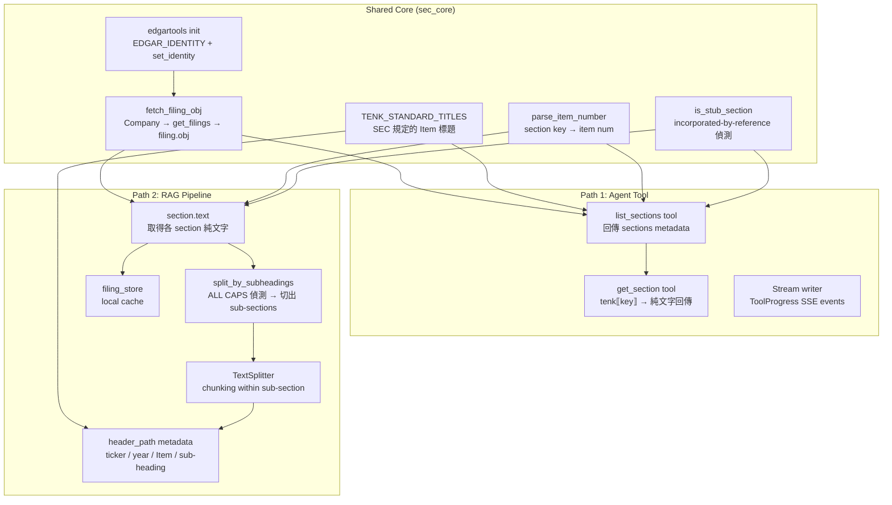

# Design: SEC Filing Pipeline 簡化 — 改用 edgartools 原生 API

## 背景與動機

FinLab-X 有兩條 code path 處理 SEC filings，都用了 `edgartools` 定位和下載 filing，但接著立刻丟棄 library 的結構化輸出，退回到 raw text/HTML parsing：

1. **Agent Tool**（`sec.py`）— `filing.text()` + `text.find()` string matching，命中 ToC stub
2. **Ingestion Pipeline**（`sec_filing_pipeline/`）— `filing.html()` + ~1000 行自製 HTML parsing

edgartools 5.17.1 提供的 `filing.obj()` → `tenk[key]` 結構化 API 在 ADSK、AAPL、MSFT 三家公司的 smoke test 中都**完美運作**（0.95 confidence、零 ToC 污染），可以取代這些自製 parsing。

詳細研究結果見：
- `artifacts/current/research_sec_filing_api.md` — edgartools API vs 現有實作
- `artifacts/current/research_filing_markdown_quality.md` — `filing.markdown()` 品質問題 & 替代方案

---

## Scope

本 design 定義兩條路各自要做什麼，以及 shared logic。兩條路將各自進行獨立的 design brainstorming、behavior validation plan、implementation plan，並以獨立 PR 交付。

---

## 兩條路的架構

> **注意：** 以下架構圖為示意。Path 1 的 two-step 細節（如 filing object caching、fiscal year 處理）和 Path 2 的具體做法（如 sub-heading 偵測規則、header path 組成方式）會在各自的 design brainstorming 中再深入設計。



---

## Shared Core：`sec_core.py`

兩條路都需要的基礎設施，抽成一個 module。

### 職責

目前只支援 10-K，但 SEC filing 未來可能擴展到 10-Q 或其他文件類型。因此 shared core 的設計以 10-K 為起點，但 naming 和結構不應 hardcode 為 10-K only。

| 元素 | 說明 |
|------|------|
| `TENK_STANDARD_TITLES` | SEC 規定的 **10-K** Item 標題常數表（16 個 Items）。以 filing type prefix 命名，方便未來新增 `TENQ_STANDARD_TITLES` 等 |
| `fetch_filing_obj(ticker, filing_type, fiscal_year?)` | edgartools wrapper：初始化 identity → `Company(ticker)` → `get_filings(form=filing_type)` → `filing.obj()` → 回傳 filing object（目前為 `TenK`，未來可能是 `TenQ` 等） |
| `parse_item_number(section_key)` | 從不一致的 section key（`part_i_item_1a` 或 `Item 1A`）extract item number |
| `is_stub_section(text)` | 偵測 "incorporated by reference" 空殼 section（主要為 Items 10-14） |
| Error hierarchy | `TickerNotFoundError`、`FilingNotFoundError` 等（複用現有 `filing_models.py`） |

### 為什麼用 `TENK_STANDARD_TITLES` 而不從 text parse

實測發現 `section.text()` 第一行格式不一致：

- ADSK: `ITEM 1.BUSINESS`（period 後無空格）
- ADSK Item 9: 第一行是 `Table of Contents`
- AAPL: `Item 1.\xa0\xa0\xa0\xa0Business`（non-breaking spaces + Title Case）
- AAPL Item 8 (Part IV): 第一行是 `Apple Inc.`

10-K Item titles 是 SEC 規定的標準格式，用常數表查就好，零 regex on filing content。

### 為什麼不需要 Part

Item number 在 10-K 中是唯一的（不會有兩個 Item 7），足以識別 section 位置。Part（I/II/III/IV）只是分組標籤，不提供額外的識別資訊。無論是 Agent Tool 的 metadata 回傳或 RAG 的 `header_path`，有 Item number 和 `TENK_STANDARD_TITLES` 查到的 title 就夠了。

---

## Path 1：Agent Tool 重構

### 現有問題

- `_extract_section()` 用 `text.find()` 做 case-insensitive marker matching → 命中 ToC stub
- 固定只回傳 Risk Factors + MD&A，每個截斷到 4000 chars
- 單一 section 可達 103K chars (≈25K tokens)，多個 section 可能超過 context window

### 設計方向：Two-step metadata-first

基於業界實踐（Claude Code offloading、LangGraph Deep Agents、IBM Memory Pointer），agent 不應該一次把大量 text 塞進 context。

**Tool 1: `list_sections`**

```
Input:  { ticker, doc_type, fiscal_year? }
Output: { sections: [{ key, title, char_count }], filing_date, fiscal_year }
```

- `fiscal_year` 為 optional（default `None` = 最新 filing），LLM 可指定歷史年份做跨年比較
- 呼叫 `fetch_filing_obj()` 取得 filing object
- 對每個 section 回傳 metadata（不回傳 content）
- Agent 看到各 section 的大小後，決定要 fetch 哪些

**Tool 2: `get_section`**

```
Input:  { ticker, doc_type, section_key, fiscal_year? }
Output: { key, title, content, char_count }
```

- `fiscal_year` 同 `list_sections`，optional
- 用 `tenk[key]` 取得完整 section 純文字，不截斷
- Agent 可以多次呼叫，逐步取需要的 sections

> **實作備註：** `list_sections` 和 `get_section` 都需要 `ticker + doc_type + fiscal_year` 來定位 filing，代表 edgartools 的 `Company().get_filings()` 可能被呼叫兩次。可考慮在 `list_sections` 時 cache filing object，讓 `get_section` 直接使用。具體 caching 策略留到 Path 1 design 處理。

### 與現有 API 的關係

現有 `sec_official_docs_retriever` 的 input schema（`ticker`, `doc_type`）和 stream writer integration 保留，但拆成兩個 tool。Version config 需要更新 tool names。

---

## Path 2：RAG Pipeline 簡化

### 現有問題

- 5 個 module (~1000 行) 做 HTML → Markdown 轉換
- 公司專屬 workaround（JNJ, MSFT, BAC, BRK heading quirks）
- `filing.markdown()` 在 MSFT 上嚴重損壞（零 H1、body text 被標成 H2）

### 設計方向：section.text() + 直接 sub-heading 偵測 + manual metadata

不經過 Markdown 重建，直接從 `section.text()` 偵測 sub-heading 並切 chunks，手動設定 `header_path` metadata。

**Flow:**

```
for each section from tenk.sections:
    skip if is_stub_section(text)

    item = parse_item_number(key)
    title = TENK_STANDARD_TITLES[item]
    sub_sections = split_by_subheadings(section.text())

    for sub_heading, sub_text in sub_sections:
        header_path = f"{ticker} / {year} / Item {item}. {title} / {sub_heading}"
        chunks = text_splitter.split(sub_text)
        for chunk in chunks:
            chunk.metadata = { header_path, ticker, year, item, sub_heading, ... }
```

**Sub-heading 偵測規則** (`split_by_subheadings`)：

- `stripped.isupper()` — 全大寫
- `5 < len(stripped) < 120` — 合理長度
- 不是純數字（排除頁碼）
- 不含 `|`, `$`, `%`（排除 table data）

**已知限制：** Title Case sub-heading（如 MSFT 的 "What We Offer"）不會被偵測到。但 Item 層級保證正確。

### 保留與修改

| 檔案 | 狀態 |
|------|------|
| `filing_models.py` | KEEP — domain types |
| `filing_store.py` | KEEP — local cache |
| `pipeline.py` | MODIFY — orchestration 改用 `sec_core.fetch_filing_obj()` |
| `sec_downloader.py` | ARCHIVE — 職責被 `sec_core.fetch_filing_obj()` 吸收 |
| `html_preprocessor.py` | ARCHIVE |
| `sec_heading_promoter.py` | ARCHIVE |
| `html_to_md_converter.py` | ARCHIVE |
| `markdown_cleaner.py` | ARCHIVE（stub 偵測邏輯搬到 `sec_core.is_stub_section()`） |

---

## Archive 策略

被移除的 module 移至 `backend/ingestion/sec_filing_pipeline/archive/`，不直接刪除。

`archive/README.md` 說明：
1. 這些是原本 pipeline 使用 HTML parsing + font-size/bold heuristic 做 heading detection 的實作
2. 因為 edgartools 原生 API 提供了結構化 section access，這些 heuristic 不再需要
3. 保留作為紀錄，記載曾經手動清理 SEC filings 時遇到的各種公司專屬問題

---

## 設計決策摘要

| 決策 | 選擇 | 理由 |
|------|------|------|
| Section heading 來源 | `TENK_STANDARD_TITLES` 常數表 | `section.text()` 第一行格式不一致 |
| Part 資訊 | 不使用 | Item number 已是唯一識別，Part 不提供額外識別價值 |
| Agent Tool API | Two-step (list → get) | 業界共識：不把 100K+ chars 直接塞 context |
| RAG heading path | 直接偵測 + manual metadata | 重建 markdown 再 parse 是無謂的 round-trip |
| Sub-heading 偵測 | ALL CAPS pattern matching | 比 HTML font-size heuristic 簡單得多，偵測邏輯 ~10 行 |
| 被取代的 code | Archive（不刪除） | 留下 heuristic 時代的紀錄 |

---

## 測試策略

- **Shared core**: Unit test `fetch_filing_obj()`、`parse_item_number()`、`is_stub_section()` with mocked edgartools
- **Agent Tool**: 用 mocked filing object 測試 list_sections / get_section 的 output schema
- **RAG Pipeline**: `split_by_subheadings()` 用 snapshot text（ADSK, AAPL, MSFT）驗證切出的 sub-sections
- **Integration test** (requires `EDGAR_IDENTITY`): End-to-end smoke test 各 3 家公司
