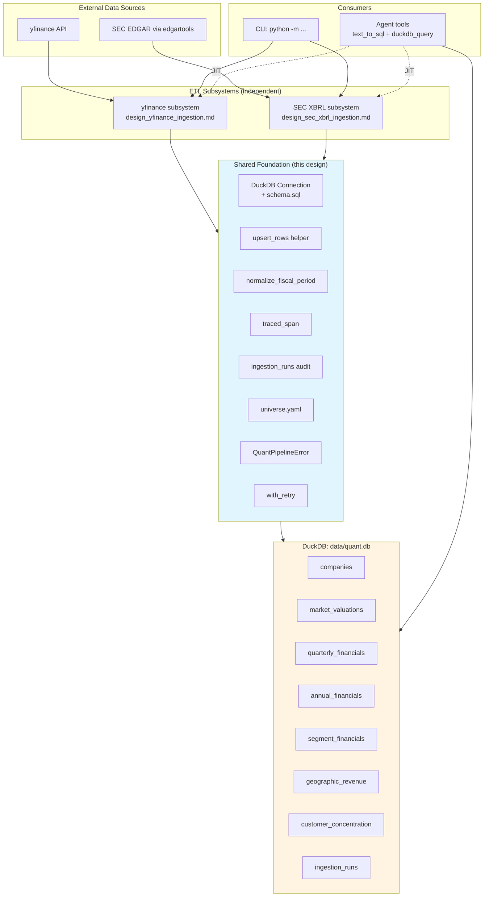

# Design Master: Quant Data Pipeline

> **範圍宣告**：本文件是 quant data pipeline 的**共用基礎層** design，不包含 yfinance / SEC 各自的 extraction / parsing 邏輯。子系統 design 後續以 `design_yfinance_ingestion.md` 與 `design_sec_xbrl_ingestion.md` 單獨撰寫，執行時遵守本文件定義的契約。
>
> **Self-contained**：本文件內嵌完整 DDL、共用元件、所有決策依據。實作與 implementation plan 只需引用此文件，不依賴 `quant-research.md`。

---

## 1. Purpose & Scope

### Purpose

為 V3 Quant Research 建立一個 DuckDB 驅動的結構化財務資料層，讓 agent 能透過 Text-to-SQL 精確回答跨公司、跨時間、多條件篩選與計算的財務問題。所有 ETL 抓到的 figures **都持久化存進 `data/quant.db`**——10-K / 10-Q 一旦 filing 就不變，自然當 cache 保留；yfinance 每日 snapshot 也以 `as_of_date` 為 PK 一筆筆累積，不會覆蓋歷史。選 DuckDB 的理由是它的 **OLAP 分析查詢能力**（columnar、vectorized execution），把 LLM 不擅長的算數、join、aggregate 交給 SQL。

**唯一不落地的資料是「即時股價」**（秒級變化、落地沒意義），agent 需要當前股價時直接 call yfinance API（見 §2 Hybrid 資料路徑）。所有財報資料（10-K / 10-Q / 季度數字 / 估值 snapshot）全部 persist 到 DuckDB。

### In-Scope（本 Design Master）

| 面向 | 範圍 |
|------|------|
| DuckDB 連線管理 | 單一檔案、env var 控制路徑、schema 自動 bootstrap |
| Schema DDL | 8 張表（7 張業務表 + `ingestion_runs`）完整 DDL 內嵌 |
| Row-level type safety | Pydantic DTO 規範 |
| Idempotent upsert | `upsert_rows()` helper，column-level merge |
| Fiscal period normalization | `normalize_fiscal_period()` helper |
| Audit trail | `ingestion_runs` 表 schema 與寫入契約 |
| Error taxonomy & retry | `QuantPipelineError` 家族 + exponential backoff |
| Observability | `traced_span()` context manager + `@observe` on agent tool entry points |
| Universe 管理 | YAML config + CLI override |
| CLI surface | `python -m backend.ingestion.quant_data_pipeline ...` |
| Schema evolution | iteration 期砍檔重跑策略 |

### Out-of-Scope（由 subsystem design 決定）

- yfinance API 呼叫細節、欄位映射邏輯
- SEC 10-K/10-Q 下載、XBRL 解析細節
- SEC fiscal period 選擇策略（全歷史 / 固定窗口 / incremental，本文件只列候選）
- segment name / customer identifier normalization
- Text-to-SQL prompt 設計（屬於 agent_engine 範疇）

---

## 2. System Positioning

### 與既有 pipeline 的關係

專案中已有 `backend/ingestion/sec_filing_pipeline/`（v2 分支成熟版本還含 dense embedding），但那是 **RAG 路線**——下載 10-K 轉 Markdown、chunking、embedding 進 Qdrant，給 agent 做 text similarity search。

本設計的 **quant data pipeline** 是**結構化資料路線**——下載 yfinance / SEC XBRL、parse 成數字、寫入 DuckDB，給 agent 做 Text-to-SQL。兩條 pipeline：

| 面向 | sec_filing_pipeline (RAG 路線) | quant_data_pipeline (本設計) |
|------|------------------------------|------------------------------|
| 資料形態 | Markdown + YAML frontmatter | 結構化 numeric rows |
| 儲存 | 本地檔案 + Qdrant vector store | DuckDB |
| 消費方式 | Vector similarity search | SQL query |
| 下游 agent tool | `sec_filing_downloader` | `text_to_sql` + `duckdb_query`（未來） |

兩者**共用 edgartools library**，但呼叫不同的 API（raw HTML vs XBRL financial facts）。**不共享 code**。

### Hybrid 資料路徑

V3 的 agent 查詢路徑是 hybrid：

- **DuckDB（本 pipeline）**：歷史資料、跨公司比較、排序/篩選/聚合計算
- **yfinance API（即時）**：單家公司即時數據（「AAPL 現在股價多少？」直接 call yfinance，不落地 DuckDB）

---

## 3. Subsystem Map & Relationships

本 Design Master 之下規劃**兩條獨立的 ingestion subsystem**，各自有自己的 design doc（後續撰寫），但都遵守本文件 §8 定義的契約。兩條 subsystem 寫入同一個 DuckDB、互補而非重疊、有明確執行順序。

### 3.1 兩條 subsystem 一覽

| Subsystem | Design doc | 資料源 | 主要用途 |
|-----------|-----------|--------|---------|
| **yfinance subsystem** | `design_yfinance_ingestion.md`（尚未撰寫） | yfinance Python API | 股價估值、完整財報歷史、公司基本資料 |
| **SEC XBRL subsystem** | `design_sec_xbrl_ingestion.md`（尚未撰寫） | SEC EDGAR via edgartools (XBRL facts) | Segment / 地區 / 大客戶拆分、SEC-only disclosure（RPO、operating lease、product-service revenue 拆分） |

### 3.2 yfinance Subsystem Scope

**負責寫入的表**：
- `companies`（完整）— 含關鍵欄位 `fy_end_month`，是後續 fiscal period normalization 的 dependency
- `market_valuations`（完整）
- `quarterly_financials`（除 SEC-sourced 欄位外）
- `annual_financials`（除 SEC-sourced 欄位外）

**負責的欄位類型**：
- 三大財報（Income / Balance Sheet / Cash Flow）中 yfinance 能提供的 numeric 欄位
- Market valuation 相關（P/E、P/B、market cap、dividend yield 等）
- 公司基本資料（sector / industry / fiscal year end）

**Dependencies**：無。整條 pipeline 的第一棒，負責 bootstrap `companies` 表。

**Design doc 需決定的事**（out of scope for Design Master）：
- yfinance API 呼叫組合（`ticker.info` / `quarterly_income_stmt` / `quarterly_balance_sheet` / `quarterly_cashflow` / annual 版本）
- yfinance line item 名稱 → DDL column 的完整 mapping table
- 欄位型別轉換（如 `dividendYield` 要 ×100）
- Rate limit 處理
- 公司類型差異容錯（科技 vs 金融 vs 保險 line items 不同）

### 3.3 SEC XBRL Subsystem Scope

**負責寫入的表**：
- `segment_financials`（完整）
- `geographic_revenue`（完整）
- `customer_concentration`（完整）
- `quarterly_financials` / `annual_financials` 的 SEC-only columns：
  - `product_revenue_usd`（ASC 606 revenue disaggregation by nature）
  - `service_revenue_usd`（ASC 606 revenue disaggregation by nature）
  - `current_rpo_usd`（RPO current portion）
  - `noncurrent_rpo_usd`（RPO non-current portion）
  - `total_lease_obligation_usd`（補齊 operating lease portion，詳見 §3.5）

**Dependencies**：
- 需要 `companies.fy_end_month` 做 fiscal period normalization → 必須在 yfinance subsystem 跑完該 ticker 後才能跑
- 需要 `edgartools` library + SEC EDGAR access（`EDGAR_IDENTITY` env var）

**Design doc 需決定的事**（out of scope for Design Master）：
- **SEC period coverage 策略**（三候選記錄於 §13.1：全歷史 / 固定窗口 / incremental + backfill）
- 10-K vs 10-Q 優先順序與資料融合策略
- XBRL axis 抽取方法（`StatementBusinessSegmentsAxis` / `StatementGeographicalAxis` / `ProductOrServiceAxis` 等）
- `segment_name` / `region_name` / `customer_identifier` 的 normalization 策略
- `accession_number` 作為 idempotency key 的使用方式
- 是否與既有 `sec_filing_pipeline`（RAG 路線）共用 edgartools 呼叫層（預期**不共用**——兩條 pipeline 消費的 edgartools API 不同：raw HTML vs XBRL facts）

### 3.4 執行順序與依賴關係

```
┌──────────────────────────────────────────────┐
│ Step 1: yfinance subsystem                    │
│   - Upsert companies (含 fy_end_month)        │
│   - Upsert market_valuations                  │
│   - Upsert [yf] columns of                    │
│     quarterly_financials / annual_financials  │
└───────────────┬──────────────────────────────┘
                │ companies.fy_end_month now populated
                ↓
┌──────────────────────────────────────────────┐
│ Step 2: SEC XBRL subsystem                    │
│   - Upsert [sec] columns of                   │
│     quarterly_financials / annual_financials  │
│   - Upsert segment_financials (full)          │
│   - Upsert geographic_revenue (full)          │
│   - Upsert customer_concentration (full)      │
└──────────────────────────────────────────────┘
```

**為什麼必須 yfinance 先跑**：SEC subsystem 的 fiscal period normalization 需要 `companies.fy_end_month`。若 SEC 先跑、該 ticker 的 `companies` row 尚未 bootstrap，normalization 會失敗。

**例外情境**：JIT refresh 某個已經存在 `companies` 表的 ticker 時，理論上可以單跑 SEC 而跳過 yfinance。**本 Design Master 不推薦**——`refresh` 命令永遠 sequential 跑完兩條，避免 edge case。

**併發限制**：兩條 subsystem **不能** parallel 跑同一個 DB 檔（DuckDB single-writer 限制，見 §12.1）。

### 3.5 重疊欄位處理

唯一兩條 subsystem 都會寫入同一個 DDL column 的是 `total_lease_obligation_usd`：

| 時序 | yfinance 寫入的值 | SEC 寫入後的值 |
|-----|----------------|-------------|
| yfinance 先跑 | finance lease only（不完整） | — |
| SEC 後跑 | — | finance + operating lease（完整） |

**設計接受此覆蓋行為**：SEC 的 10-K / 10-Q 是 operating lease 的權威資料來源（US-GAAP ASC 842 規範），後寫的正確值覆蓋前寫的不完整值。

**其他所有 DDL column 都是單一 subsystem 專屬**。yfinance DTO 與 SEC DTO 的 field 集合**不交集**（除了 PK 與這個重疊欄位），因此 §7.3 的 `upsert_rows()` column-level merge 自動保證雙方不互相抹除。

> **Stored column ownership ≠ derived metric source**  
> 本節討論的是 **stored column**（DB 實際儲存的欄位）歸屬——這決定了 upsert 時誰會寫誰。  
> 有些**衍生指標**（如 `Segment Revenue Share = segment_revenue / total_revenue`、`Region Revenue Share`）確實需要同時讀 yfinance 寫入的欄位（`total_revenue_usd` in `quarterly_financials`）與 SEC 寫入的欄位（`segment_revenue_usd` in `segment_financials`），透過 SQL `JOIN` 在查詢時計算。  
> 但**衍生指標不是 stored column**——它們不存 DB，每次查詢時由 Text-to-SQL 生成 JOIN query 即時算出。所以「DDL column 單一 subsystem 專屬」的 claim 仍然成立。

### 3.6 共用契約（兩條 subsystem 都必須遵守）

完整契約細節見 §8 Subsystem Contract，核心項目：
- 必用共用元件（`upsert_rows`、`normalize_fiscal_period`、`ingestion_run`、`traced_span`、`with_retry`）
- DTO field name = DDL column name
- Ticker 寫入前一律 uppercase
- `fiscal_year` / `fiscal_quarter` 必經 `normalize_fiscal_period()` 產出，不自己算
- Error 按 §7.6 taxonomy 分類
- 不得直接建 duckdb connection，必須透過 `get_connection()`
- 不得起 subprocess / thread pool（single-writer 限制）

---

## 4. Architecture Overview



### Trace hierarchy（JIT 觸發時）

用 ASCII tree 表達 Langfuse span 的 parent-child 結構（這也是 Langfuse UI 實際呈現 trace 的樣子）：

```
agent_run                                        ← root trace (@observe on agent entrypoint)
├── text_to_sql_generate                         ← LLM 生成 SQL
├── duckdb_query_stale_detection                 ← 判斷 DB 資料是否過期
├── quant_data_refresh_ticker                    ← JIT 觸發 (@observe on agent tool)
│   ├── yf_fetch_ticker_info            (~0.3s)
│   ├── yf_fetch_quarterly_financials   (~2.1s)
│   ├── yf_upsert_quarterly_financials  (~40ms)
│   ├── sec_fetch_10k                   (~3.2s)  ← 瓶頸：要下載完整 filing
│   ├── sec_parse_xbrl_financials       (~1.1s)
│   └── sec_upsert_segment_financials   (~80ms)
├── duckdb_query_execute                         ← 跑剛生成的 SQL
└── agent_final_response                         ← LLM 總結回覆給使用者
```

**閱讀方式**：
- **縮排層級 = span parent-child**：同一縮排的 span 是 siblings、都歸在上一層的 parent 底下
- `agent_run` 是 root trace（由 agent entrypoint 用 `@observe` 建立）
- `quant_data_refresh_ticker` 是 agent tool 的 `@observe` span，**本 pipeline 的所有 `yf_*` / `sec_*` span 都掛在它底下**
- 其餘 sibling span（`text_to_sql_generate`、`duckdb_query_execute` 等）由 agent_engine 負責產出，不在本 pipeline 的實作範圍

**時間順序**（非 hierarchy，只是執行流程的常見 pattern）：從上到下大致依序執行，但 span tree 本身只表達 parent-child、不表達執行時序。實際時序要看 Langfuse UI 的 Gantt-style timeline 或 span 的 `start_time`。

---

## 5. Directory Structure

```
backend/ingestion/quant_data_pipeline/
├── __init__.py
├── __main__.py                    # CLI entry point (argparse)
├── README.md
├── config/
│   └── universe.yaml              # canonical ticker list
├── db/
│   ├── __init__.py
│   ├── connection.py              # get_connection(), schema bootstrap
│   ├── schema.sql                 # full DDL (all 8 tables + COMMENT)
│   ├── upsert.py                  # upsert_rows() helper
│   └── row_models.py              # Pydantic DTOs for each table
├── fiscal_periods.py              # normalize_fiscal_period() — fiscal year/quarter helper
├── ticker_universe.py             # load_universe() — canonical ticker list loader
├── pipeline_errors.py             # QuantPipelineError taxonomy
├── ingestion_runs.py              # ingestion_run() context manager — writes to ingestion_runs table
├── retry.py                       # with_retry() — TransientError exponential backoff
├── tracing.py                     # traced_span() — Langfuse child span, no-op when no outer trace
├── yfinance/                      # [子系統 A — design_yfinance_ingestion.md]
│   └── ...
└── sec_xbrl/                      # [子系統 B — design_sec_xbrl_ingestion.md]
    └── ...
```

**約定**：
- 共用基礎層直接放在 `quant_data_pipeline/` 根目錄（`periods.py`, `tracing.py` 等）
- 子系統各自放在 `yfinance/` 與 `sec_xbrl/` 子目錄，透過 import 使用共用層
- 測試放在 `backend/tests/ingestion/quant_data_pipeline/` 對應結構

---

## 6. Data Schema (DDL)

完整 `schema.sql`。DuckDB `CREATE TABLE IF NOT EXISTS` + `COMMENT ON COLUMN` 格式。Text-to-SQL 的 system prompt 會直接讀此 SQL 當作 LLM 可見的 schema description。

### 6.1 `companies`

公司基本資料。資料來源全部為 `yfinance.ticker.info`。`fy_end_month` 與 `fy_end_day` 是共用基礎層的**關鍵依賴**——`normalize_fiscal_period()` 需要 `fy_end_month` 做 fiscal_year / fiscal_quarter 計算。

```sql
CREATE TABLE IF NOT EXISTS companies (
    ticker VARCHAR PRIMARY KEY,
    company_name VARCHAR NOT NULL,
    sector VARCHAR,
    industry VARCHAR,
    fy_end_month INTEGER NOT NULL,
    fy_end_day INTEGER NOT NULL,
    updated_at TIMESTAMP DEFAULT CURRENT_TIMESTAMP
);

COMMENT ON COLUMN companies.ticker IS
  'Stock ticker symbol, uppercase. E.g. AAPL, MSFT, NVDA.';
COMMENT ON COLUMN companies.company_name IS
  'Full legal company name from yfinance.info longName.';
COMMENT ON COLUMN companies.sector IS
  'Broad industry classification. E.g. Technology, Financial Services.';
COMMENT ON COLUMN companies.industry IS
  'Fine-grained industry. E.g. Consumer Electronics, Software Application.';
COMMENT ON COLUMN companies.fy_end_month IS
  'Fiscal year end month (1-12). E.g. NVDA=1, WMT=1, MSFT=6, BRK.B=12, CAT=12.';
COMMENT ON COLUMN companies.fy_end_day IS
  'Fiscal year end day of month (1-31). Used only for display.';
COMMENT ON COLUMN companies.updated_at IS
  'Last time this row was upserted by ETL.';
```

### 6.2 `market_valuations`

需要「即時股價」才能計算的指標 + 市場結構指標。財報可推算的指標（margins, ROE 等）不在此表。

```sql
CREATE TABLE IF NOT EXISTS market_valuations (
    ticker VARCHAR NOT NULL,
    as_of_date DATE NOT NULL,
    market_cap_usd BIGINT,
    enterprise_value_usd BIGINT,
    trailing_price_to_earnings DOUBLE,
    forward_price_to_earnings DOUBLE,
    price_to_book_ratio DOUBLE,
    price_to_sales_trailing_12m DOUBLE,
    ev_to_ebitda_ratio DOUBLE,
    trailing_peg_ratio DOUBLE,
    dividend_yield_pct DOUBLE,
    beta DOUBLE,
    held_pct_institutions DOUBLE,
    updated_at TIMESTAMP DEFAULT CURRENT_TIMESTAMP,
    PRIMARY KEY (ticker, as_of_date)
);

COMMENT ON COLUMN market_valuations.as_of_date IS
  'Snapshot date of market data (typically today when ETL runs).';
COMMENT ON COLUMN market_valuations.market_cap_usd IS
  'Market capitalization in USD. = share_price * shares_outstanding.';
COMMENT ON COLUMN market_valuations.enterprise_value_usd IS
  'Enterprise value in USD. = market_cap + total_debt - cash.';
COMMENT ON COLUMN market_valuations.trailing_price_to_earnings IS
  'Trailing P/E ratio. = share_price / trailing 12-month EPS.';
COMMENT ON COLUMN market_valuations.forward_price_to_earnings IS
  'Forward P/E ratio. = share_price / forward 12-month EPS estimate.';
COMMENT ON COLUMN market_valuations.price_to_book_ratio IS
  'P/B ratio. = share_price / book_value_per_share.';
COMMENT ON COLUMN market_valuations.price_to_sales_trailing_12m IS
  'P/S TTM. = market_cap / trailing 12-month revenue.';
COMMENT ON COLUMN market_valuations.ev_to_ebitda_ratio IS
  'EV/EBITDA ratio. = enterprise_value / EBITDA.';
COMMENT ON COLUMN market_valuations.trailing_peg_ratio IS
  'PEG ratio. = trailing P/E / earnings growth rate.';
COMMENT ON COLUMN market_valuations.dividend_yield_pct IS
  'Dividend yield as percentage (already converted from decimal).';
COMMENT ON COLUMN market_valuations.beta IS
  'Beta. Volatility relative to broad market (S&P 500).';
COMMENT ON COLUMN market_valuations.held_pct_institutions IS
  'Institutional ownership as percentage.';
```

### 6.3 `quarterly_financials`

每季完整財報。`fiscal_year` + `fiscal_quarter` 由 ETL 計算。大部分欄位來自 yfinance，少數欄位（標示 `SEC-sourced`）需 10-Q / 10-K 補齊。

```sql
CREATE TABLE IF NOT EXISTS quarterly_financials (
    ticker VARCHAR NOT NULL,
    fiscal_year INTEGER NOT NULL,
    fiscal_quarter INTEGER NOT NULL,
    period_start DATE,
    period_end DATE NOT NULL,

    -- Income Statement (yfinance-sourced)
    total_revenue_usd BIGINT,
    cost_of_revenue_usd BIGINT,
    gross_profit_usd BIGINT,
    research_and_development_usd BIGINT,
    selling_general_admin_usd BIGINT,
    operating_income_usd BIGINT,
    ebit_usd BIGINT,
    net_income_usd BIGINT,
    interest_income_usd BIGINT,
    interest_expense_usd BIGINT,
    tax_provision_usd BIGINT,
    ebitda_usd BIGINT,
    diluted_eps DOUBLE,
    diluted_avg_shares BIGINT,

    -- Income Statement (SEC-sourced, revenue disaggregation per ASC 606)
    product_revenue_usd BIGINT,
    service_revenue_usd BIGINT,

    -- Balance Sheet (yfinance-sourced)
    total_assets_usd BIGINT,
    goodwill_usd BIGINT,
    net_ppe_usd BIGINT,
    total_debt_usd BIGINT,
    long_term_debt_usd BIGINT,
    net_debt_usd BIGINT,
    cash_and_equivalents_usd BIGINT,
    stockholders_equity_usd BIGINT,
    current_assets_usd BIGINT,
    current_liabilities_usd BIGINT,
    accounts_receivable_usd BIGINT,
    inventory_usd BIGINT,
    deferred_revenue_usd BIGINT,

    -- Balance Sheet (yf+sec: finance lease from yfinance, operating lease from SEC)
    total_lease_obligation_usd BIGINT,

    -- Cash Flow (yfinance-sourced)
    operating_cash_flow_usd BIGINT,
    capital_expenditure_usd BIGINT,
    free_cash_flow_usd BIGINT,
    depreciation_amortization_usd BIGINT,
    stock_buyback_usd BIGINT,
    dividends_paid_usd BIGINT,
    stock_based_compensation_usd BIGINT,

    -- Revenue Quality (SEC-sourced, RPO from ASC 606 disclosure)
    current_rpo_usd BIGINT,
    noncurrent_rpo_usd BIGINT,

    updated_at TIMESTAMP DEFAULT CURRENT_TIMESTAMP,
    PRIMARY KEY (ticker, fiscal_year, fiscal_quarter)
);

COMMENT ON COLUMN quarterly_financials.fiscal_year IS
  'Fiscal year (US SEC convention: year in which the fiscal year ENDS). AAPL FY2024 ends 2024-09-28.';
COMMENT ON COLUMN quarterly_financials.fiscal_quarter IS
  'Fiscal quarter 1-4. Q4 is the quarter ending on the fiscal year end.';
COMMENT ON COLUMN quarterly_financials.period_end IS
  'Calendar date of fiscal period end (from data source, varies slightly year-to-year for 52/53-week calendars).';
COMMENT ON COLUMN quarterly_financials.total_revenue_usd IS
  'Total revenue in USD for the quarter.';
COMMENT ON COLUMN quarterly_financials.gross_profit_usd IS
  'Gross profit = total_revenue - cost_of_revenue.';
COMMENT ON COLUMN quarterly_financials.operating_income_usd IS
  'Operating income = gross_profit - operating expenses (R&D + SG&A).';
COMMENT ON COLUMN quarterly_financials.ebit_usd IS
  'Earnings before interest and taxes.';
COMMENT ON COLUMN quarterly_financials.ebitda_usd IS
  'Earnings before interest, taxes, depreciation, and amortization.';
COMMENT ON COLUMN quarterly_financials.net_income_usd IS
  'Net income attributable to company shareholders.';
COMMENT ON COLUMN quarterly_financials.interest_income_usd IS
  'Non-operating interest income. Core revenue for financial services firms.';
COMMENT ON COLUMN quarterly_financials.interest_expense_usd IS
  'Non-operating interest expense. Used for interest coverage ratio.';
COMMENT ON COLUMN quarterly_financials.tax_provision_usd IS
  'Income tax provision. Used for effective tax rate.';
COMMENT ON COLUMN quarterly_financials.diluted_eps IS
  'Diluted earnings per share (EPS).';
COMMENT ON COLUMN quarterly_financials.diluted_avg_shares IS
  'Diluted weighted-average shares outstanding for the period.';
COMMENT ON COLUMN quarterly_financials.product_revenue_usd IS
  'Revenue from products (goods) per ASC 606 disaggregation. NULL if company does not disclose.';
COMMENT ON COLUMN quarterly_financials.service_revenue_usd IS
  'Revenue from services per ASC 606 disaggregation. NULL if company does not disclose.';
COMMENT ON COLUMN quarterly_financials.total_assets_usd IS
  'Total assets at period end.';
COMMENT ON COLUMN quarterly_financials.goodwill_usd IS
  'Goodwill from past acquisitions.';
COMMENT ON COLUMN quarterly_financials.net_ppe_usd IS
  'Net property, plant, and equipment.';
COMMENT ON COLUMN quarterly_financials.total_debt_usd IS
  'Total debt = long_term_debt + current_debt.';
COMMENT ON COLUMN quarterly_financials.long_term_debt_usd IS
  'Long-term debt (due > 1 year).';
COMMENT ON COLUMN quarterly_financials.net_debt_usd IS
  'Net debt = total_debt - cash_and_equivalents. Negative means cash exceeds debt.';
COMMENT ON COLUMN quarterly_financials.cash_and_equivalents_usd IS
  'Cash and cash equivalents (excludes short-term investments).';
COMMENT ON COLUMN quarterly_financials.stockholders_equity_usd IS
  'Total stockholders equity (book value).';
COMMENT ON COLUMN quarterly_financials.current_assets_usd IS
  'Current assets (expected to be realized within 1 year).';
COMMENT ON COLUMN quarterly_financials.current_liabilities_usd IS
  'Current liabilities (due within 1 year).';
COMMENT ON COLUMN quarterly_financials.accounts_receivable_usd IS
  'Accounts receivable at period end.';
COMMENT ON COLUMN quarterly_financials.inventory_usd IS
  'Inventory at period end.';
COMMENT ON COLUMN quarterly_financials.deferred_revenue_usd IS
  'Current deferred revenue (payments received but service not yet delivered).';
COMMENT ON COLUMN quarterly_financials.total_lease_obligation_usd IS
  'Total lease obligation (finance + operating). yfinance provides finance only; SEC 10-K/10-Q supplements operating.';
COMMENT ON COLUMN quarterly_financials.operating_cash_flow_usd IS
  'Cash flow from operating activities.';
COMMENT ON COLUMN quarterly_financials.capital_expenditure_usd IS
  'Capital expenditures. Stored with original sign (yfinance returns negative).';
COMMENT ON COLUMN quarterly_financials.free_cash_flow_usd IS
  'Free cash flow = operating_cash_flow - capital_expenditure (sign-normalized by yfinance).';
COMMENT ON COLUMN quarterly_financials.depreciation_amortization_usd IS
  'Depreciation and amortization from cash flow statement.';
COMMENT ON COLUMN quarterly_financials.stock_buyback_usd IS
  'Share repurchases. Original sign preserved (negative = cash outflow).';
COMMENT ON COLUMN quarterly_financials.dividends_paid_usd IS
  'Common stock dividends paid. Original sign preserved (negative = cash outflow).';
COMMENT ON COLUMN quarterly_financials.stock_based_compensation_usd IS
  'Stock-based compensation expense.';
COMMENT ON COLUMN quarterly_financials.current_rpo_usd IS
  'Remaining performance obligation expected to be recognized within 12 months. NULL if company does not disclose (typically SaaS/Cloud only).';
COMMENT ON COLUMN quarterly_financials.noncurrent_rpo_usd IS
  'Remaining performance obligation expected to be recognized beyond 12 months. NULL if company does not disclose.';
```

### 6.4 `annual_financials`

與 `quarterly_financials` 欄位**完全相同**（除了沒有 `fiscal_quarter`），PK 只有 `(ticker, fiscal_year)`。對應 10-K 年度數字。

**關於 COMMENT**：DuckDB 的 `COMMENT ON COLUMN` 是 per-table、不跨表繼承——所以 `annual_financials` 每一個欄位的 COMMENT 都**必須獨立再寫一次**（內容與 `quarterly_financials` 對應欄位相同）。Text-to-SQL 的 LLM 需要每欄都有 COMMENT 才能穩定生成 SQL，不能省略 `annual_financials` 這一份。

**Implementation 建議**：為避免手動維護兩份 COMMENT 漂移，implementation plan 應該用 Python script 以一份 column spec source of truth 產生 `schema.sql`，自動套用到 `quarterly_financials` 與 `annual_financials`。Design Master 不限定產法，但**契約是：兩張表的相同欄位必須有相同 COMMENT**。

```sql
CREATE TABLE IF NOT EXISTS annual_financials (
    ticker VARCHAR NOT NULL,
    fiscal_year INTEGER NOT NULL,
    period_start DATE,
    period_end DATE NOT NULL,
    -- ... 所有 quarterly_financials 的欄位（不包含 fiscal_quarter）...
    updated_at TIMESTAMP DEFAULT CURRENT_TIMESTAMP,
    PRIMARY KEY (ticker, fiscal_year)
);
-- 每一欄的 COMMENT ON COLUMN 必須手動（或由 build script）複製一份，
-- 內容與 quarterly_financials 對應欄位相同。
```

### 6.5 `segment_financials`

業務部門拆分（ASC 280）。**整張表由 SEC 子系統填寫**，yfinance 無此資料。季度與年度合併一張表，年度資料 `fiscal_quarter` 為 NULL。

```sql
CREATE TABLE IF NOT EXISTS segment_financials (
    ticker VARCHAR NOT NULL,
    fiscal_year INTEGER NOT NULL,
    fiscal_quarter INTEGER,                     -- NULL for annual
    period_start DATE,
    period_end DATE NOT NULL,
    segment_name VARCHAR NOT NULL,
    segment_revenue_usd BIGINT,
    segment_operating_income_usd BIGINT,
    segment_assets_usd BIGINT,
    segment_capex_usd BIGINT,
    updated_at TIMESTAMP DEFAULT CURRENT_TIMESTAMP,
    PRIMARY KEY (ticker, fiscal_year, fiscal_quarter, period_end, segment_name)
);

COMMENT ON COLUMN segment_financials.fiscal_quarter IS
  'Fiscal quarter 1-4, or NULL for annual (full-year) segment reporting.';
COMMENT ON COLUMN segment_financials.segment_name IS
  'Company-defined business segment name. E.g. AWS, Reality Labs, Services.';
COMMENT ON COLUMN segment_financials.segment_revenue_usd IS
  'Segment revenue.';
COMMENT ON COLUMN segment_financials.segment_operating_income_usd IS
  'Segment operating income or loss (can be negative).';
COMMENT ON COLUMN segment_financials.segment_assets_usd IS
  'Segment assets. NULL if not disclosed at segment level.';
COMMENT ON COLUMN segment_financials.segment_capex_usd IS
  'Segment capital expenditure. NULL if not disclosed at segment level.';
```

**注意**：`segment_name` normalization 策略（各公司自訂 XBRL extension name）由 SEC 子系統 design 決定。

### 6.6 `geographic_revenue`

各地區營收拆分（ASC 280）。**整張表由 SEC 子系統填寫**。

與 `segment_financials` 分開的兩個理由：
1. ASC 280 只要求 geographic revenue，不要求 geographic operating income（跨國成本歸屬太主觀），所以此表**只有 revenue**
2. `region_name`（Americas / Europe）與 `segment_name`（AWS / Services）語意不同，分表讓 Text-to-SQL 判斷更準確

```sql
CREATE TABLE IF NOT EXISTS geographic_revenue (
    ticker VARCHAR NOT NULL,
    fiscal_year INTEGER NOT NULL,
    fiscal_quarter INTEGER,                     -- NULL for annual
    period_start DATE,
    period_end DATE NOT NULL,
    region_name VARCHAR NOT NULL,
    revenue_usd BIGINT NOT NULL,
    updated_at TIMESTAMP DEFAULT CURRENT_TIMESTAMP,
    PRIMARY KEY (ticker, fiscal_year, fiscal_quarter, period_end, region_name)
);

COMMENT ON COLUMN geographic_revenue.region_name IS
  'Company-defined geographic region name. E.g. Americas, Greater China, Europe.';
COMMENT ON COLUMN geographic_revenue.revenue_usd IS
  'Revenue attributed to this region for the period.';
```

各公司拆分粒度不一（AAPL 拆 5 區、MSFT 只分 2 區）。此差異由 SQL query 端自行處理，schema 不做統一化。

### 6.7 `customer_concentration`

SEC 規定單一客戶佔營收 >10% 須揭露。**整張表由 SEC 子系統填寫**。年度粒度（10-K 揭露），無季度拆分。

```sql
CREATE TABLE IF NOT EXISTS customer_concentration (
    ticker VARCHAR NOT NULL,
    fiscal_year INTEGER NOT NULL,
    customer_identifier VARCHAR NOT NULL,
    revenue_pct DOUBLE NOT NULL,
    updated_at TIMESTAMP DEFAULT CURRENT_TIMESTAMP,
    PRIMARY KEY (ticker, fiscal_year, customer_identifier)
);

COMMENT ON COLUMN customer_concentration.customer_identifier IS
  'Customer name if disclosed (e.g. Apple Inc.), or anonymized label (e.g. Customer A) depending on filing.';
COMMENT ON COLUMN customer_concentration.revenue_pct IS
  'Percentage of total company revenue from this customer. Only disclosed when >10%.';
```

### 6.8 `ingestion_runs`

ETL 執行 audit trail。**每一次 pipeline 呼叫一個 ticker 寫一筆 row**。

```sql
CREATE TABLE IF NOT EXISTS ingestion_runs (
    run_id UUID PRIMARY KEY DEFAULT gen_random_uuid(),
    pipeline VARCHAR NOT NULL,
    ticker VARCHAR NOT NULL,

    -- SEC-only: identifies the specific filing being processed
    target_filing_type VARCHAR,                 -- '10-K' | '10-Q' | NULL for yfinance
    target_fiscal_year INTEGER,
    target_fiscal_quarter INTEGER,
    target_accession_number VARCHAR,

    started_at TIMESTAMP NOT NULL,
    finished_at TIMESTAMP,

    status VARCHAR NOT NULL,                    -- 'success' | 'error'
    error_class VARCHAR,
    error_message VARCHAR,

    rows_written_total INTEGER,
    metadata JSON
);

CREATE INDEX IF NOT EXISTS idx_runs_pipeline_ticker_started
    ON ingestion_runs(pipeline, ticker, started_at DESC);

COMMENT ON TABLE ingestion_runs IS
  'Audit log of every ETL invocation. Tracks WHO/WHEN/HOW data got in. For "WHAT data exists" query data tables directly (they carry fiscal_year/fiscal_quarter).';
COMMENT ON COLUMN ingestion_runs.pipeline IS
  'Pipeline name: yfinance | sec_xbrl.';
COMMENT ON COLUMN ingestion_runs.target_accession_number IS
  'SEC filing immutable identity. NULL for yfinance (no single-filing target).';
COMMENT ON COLUMN ingestion_runs.metadata IS
  'Per-run summary. Free-form JSON: {periods_covered, rows_per_table, api_latency_ms, ...}.';
```

**Source of truth 分工**：
- 「DB 有 NVDA Q3 2024 嗎？」→ query **data table** `quarterly_financials`（時間在 PK 裡）
- 「NVDA 上次 yfinance ETL 跑成功是什麼時候？」→ query **ingestion_runs**
- 「那份 10-K 是哪個 accession_number？」→ query **ingestion_runs** `target_accession_number`

---

## 7. Shared Foundation Components

### 7.1 DuckDB Connection & Schema Bootstrap

**檔案位置**：由 env var `DUCKDB_PATH` 控制，預設 `data/quant.db`。`.gitignore` 必須加入 `data/*.duckdb` 避免誤 commit。

**Single-writer 限制**：DuckDB 是檔案鎖，同一時間只能一個 process 寫入。本 pipeline 不做 cross-process coordination，ETL 需**序列執行**（詳見 §12.1）。

```python
# backend/ingestion/quant_data_pipeline/db/connection.py
from pathlib import Path
from typing import Optional
import os
import duckdb
from duckdb import DuckDBPyConnection

_SCHEMA_SQL_PATH = Path(__file__).parent / "schema.sql"

def get_connection(
    db_path: Optional[str] = None,
    *,
    ensure_schema: bool = True,
) -> DuckDBPyConnection:
    """Open a DuckDB connection. Schema is idempotently applied by default."""
    path = db_path or os.getenv("DUCKDB_PATH", "data/quant.db")
    Path(path).parent.mkdir(parents=True, exist_ok=True)
    conn = duckdb.connect(path)
    if ensure_schema:
        conn.execute(_SCHEMA_SQL_PATH.read_text())
    return conn
```

**Key decisions**：
- `ensure_schema=True` 是 default——每次開 connection 就 apply `CREATE TABLE IF NOT EXISTS` 一遍，沒開銷
- 不用 connection pool（DuckDB 對單 process 單 connection 已經夠快）
- 不做 auto-commit 控制，DuckDB 預設每個 statement 就 commit

### 7.2 Pydantic Row DTOs

**Purpose**：每張表的寫入對應一個（或多個）Pydantic model，做 Python-side type validation + IDE rename 友善。

**原則**：
- 一張表可以有**多個 DTO**（子系統之間寫入不同欄位時，各自定義只含自己負責欄位的 DTO）
- DTO field 名稱**必須**與 DDL column 名稱一致（upsert helper 靠 `model_fields` 推 SQL）
- PK 欄位一律 required（`str`, `int`）；非 PK 欄位依 DDL 是否 nullable 決定 `| None`

```python
# backend/ingestion/quant_data_pipeline/db/row_models.py
from datetime import date
from decimal import Decimal
from pydantic import BaseModel


class CompanyRow(BaseModel):
    ticker: str
    company_name: str
    sector: str | None = None
    industry: str | None = None
    fy_end_month: int
    fy_end_day: int


class MarketValuationRow(BaseModel):
    ticker: str
    as_of_date: date
    market_cap_usd: int | None = None
    enterprise_value_usd: int | None = None
    # ... 其餘 yfinance-sourced 欄位 ...


class YFinanceQuarterlyRow(BaseModel):
    """yfinance 子系統負責欄位的 DTO。SEC-only 欄位不在此 DTO 裡。"""
    ticker: str
    fiscal_year: int
    fiscal_quarter: int
    period_end: date
    period_start: date | None = None
    total_revenue_usd: int | None = None
    # ... 其餘 yfinance-sourced 欄位 ...


class SECQuarterlyRow(BaseModel):
    """SEC 子系統負責欄位的 DTO。yfinance-sourced 欄位不在此 DTO 裡。"""
    ticker: str
    fiscal_year: int
    fiscal_quarter: int
    product_revenue_usd: int | None = None
    service_revenue_usd: int | None = None
    current_rpo_usd: int | None = None
    noncurrent_rpo_usd: int | None = None
    total_lease_obligation_usd: int | None = None
    # 注意：total_lease_obligation 被兩條 pipeline 都寫，後寫的覆蓋前寫的（設計接受）


# ... Segment / Geographic / Customer / IngestionRun DTOs ...
```

**關鍵設計**：**同一張 DB table 可以對應多個 DTO**。`upsert_rows()` 只 update DTO `model_fields` 列出的欄位，其他欄位保留。這就是 column-level merge 的運作基礎。

**Implementation plan 必須產出**：一份「DDL 欄位 × DTO 覆蓋矩陣」文件，精確列出每個 DTO 包含哪些 DDL 欄位，特別是 `total_lease_obligation_usd` 這種被兩條 pipeline 都會寫的欄位——DTO 歸屬直接決定 upsert 時是否會被蓋過。

### 7.3 Idempotent Upsert Helper

**Purpose**：所有資料寫入統一走此 helper。Idempotent、batch-friendly、column-level merge。

```python
# backend/ingestion/quant_data_pipeline/db/upsert.py
import pandas as pd
from typing import TypeVar
from pydantic import BaseModel
from duckdb import DuckDBPyConnection

T = TypeVar("T", bound=BaseModel)


def upsert_rows(
    conn: DuckDBPyConnection,
    table: str,
    pk_columns: list[str],
    rows: list[T],
) -> int:
    """
    Batch idempotent upsert via DuckDB INSERT ... ON CONFLICT DO UPDATE.

    Only columns present in the row DTO are written. Columns managed by
    other pipelines (absent from this DTO) are preserved on conflict.

    Returns the number of rows passed in (not DuckDB affected count,
    which DuckDB does not always report accurately for ON CONFLICT).
    """
    if not rows:
        return 0

    df = pd.DataFrame([r.model_dump() for r in rows])
    columns = list(df.columns)
    update_set_parts = [f"{c} = EXCLUDED.{c}" for c in columns if c not in pk_columns]
    update_set_parts.append("updated_at = CURRENT_TIMESTAMP")
    update_set = ", ".join(update_set_parts)

    conn.register("staging", df)
    try:
        conn.execute(f"""
            INSERT INTO {table} ({", ".join(columns)})
            SELECT {", ".join(columns)} FROM staging
            ON CONFLICT ({", ".join(pk_columns)}) DO UPDATE SET {update_set}
        """)
    finally:
        conn.unregister("staging")

    return len(rows)
```

**契約**：
- 呼叫端必須永遠傳 `list[T]`（1-row 場景也包成 list）
- DTO field 名稱必須是 DDL column 的子集
- PK 必填
- `updated_at` 自動由 helper 維護，DTO 不用定義

### 7.4 Fiscal Period Normalization

**Purpose**：把不同 source 的「時間標籤」轉成統一的 `(fiscal_year, fiscal_quarter)`。

**為什麼需要**：
- yfinance 的 `quarterly_income_stmt` columns 是日曆日期（`2024-09-30`），沒有 fiscal label
- 不同公司 FYE 不同：AAPL=Sep、NVDA=Jan、MSFT=Jun，同一個日曆日對應不同 fiscal_year / fiscal_quarter

**依賴**：`companies.fy_end_month`（由 yfinance 子系統 bootstrap 填入）。

**Convention**（US SEC）：fiscal year 的名字 = **它 END 在哪個日曆年**。
- AAPL FY2024 ends 2024-09-28 → 叫 FY2024
- NVDA FY2024 ends 2024-01-28 → 叫 FY2024（雖然大部分 period 在 2023）

**Algorithm**：

**Step 1** — 判斷 fiscal_year：下一個 FYE（>= period_end）的日曆年就是 fiscal_year。
- `period_end.month <= fye_month` → fiscal_year = period_end.year
- `period_end.month > fye_month` → fiscal_year = period_end.year + 1（跨年）

**Step 2** — 判斷 fiscal_quarter：period_end 距離該 FYE 還有幾個月。
- 0 月差 → Q4（恰好在 FYE）
- 3 月差 → Q3
- 6 月差 → Q2
- 9 月差 → Q1
- 公式：`quarter = 4 - (month_diff / 3)`

```python
# backend/ingestion/quant_data_pipeline/fiscal_periods.py
from datetime import date


def normalize_fiscal_period(
    period_end: date,
    fiscal_year_end_month: int,     # 1-12
) -> tuple[int, int]:
    """
    Convert (calendar period-end date, company FYE month) → (fiscal_year, fiscal_quarter).

    Uses US SEC convention where fiscal_year is the calendar year in which the
    fiscal year ENDS. Month-level precision (day ignored) for robustness against
    52/53-week calendar drift.

    Raises ValueError if period_end month does not align with a fiscal quarter
    boundary relative to FYE (i.e. not 0/3/6/9 months before next FYE).
    """
    if period_end.month <= fiscal_year_end_month:
        fiscal_year = period_end.year
        fy_end_month_scaled = fiscal_year_end_month
    else:
        fiscal_year = period_end.year + 1
        fy_end_month_scaled = fiscal_year_end_month + 12

    months_before_fye = fy_end_month_scaled - period_end.month
    if months_before_fye % 3 != 0:
        raise ValueError(
            f"period_end {period_end} not quarter-aligned to FYE month "
            f"{fiscal_year_end_month}: delta={months_before_fye} months"
        )

    quarter = 4 - (months_before_fye // 3)
    return fiscal_year, quarter
```

**Golden test cases**（implementation plan 會定義完整 test fixture）：

下表是 `normalize_fiscal_period()` 的**單元測試案例表**。每一列 = 一個 test case：
- `FYE month` 與 `period_end` 是函式的兩個 input
- `Expected` 是預期的 `(fiscal_year, fiscal_quarter)` output
- `Ticker` 欄只是示意「這個 FYE month 對應哪家公司」，函式本身不吃 ticker 參數

**「normalize」在此的意思**：把日曆日期（`2024-06-30`）轉成**該公司自己的** fiscal labeling。不是把各公司拉齊到同一個日曆時間——而是保留各公司自己的會計年度時間軸，只把 label 統一成 `(fiscal_year, fiscal_quarter)` 格式。這樣 Text-to-SQL 就能用 `WHERE fiscal_year=2024 AND fiscal_quarter=3` 一行 query 到各家公司的「他們自己的 Q3」，不需要 LLM 去計算每家公司的 Q3 對應哪個日曆月份（AAPL Q3 = Apr-Jun，NVDA Q3 = Aug-Oct，MSFT Q3 = Jan-Mar，完全不同但 label 一致）。

| Ticker | FYE month | period_end | Expected |
|--------|-----------|-----------|----------|
| AAPL | 9 | 2024-06-30 | (2024, 3) |
| AAPL | 9 | 2024-09-28 | (2024, 4) |
| AAPL | 9 | 2024-12-31 | (2025, 1) |
| AMZN | 12 | 2024-03-31 | (2024, 1) |
| AMZN | 12 | 2024-12-31 | (2024, 4) |
| MSFT | 6 | 2024-06-30 | (2024, 4) |
| MSFT | 6 | 2024-09-30 | (2025, 1) |
| NVDA | 1 | 2024-01-28 | (2024, 4) |
| NVDA | 1 | 2024-04-30 | (2025, 1) |
| CRM | 1 | 2025-01-31 | (2025, 4) |

### 7.5 Ingestion Run Audit Trail

**Purpose**：每一次 pipeline 處理一個 ticker 就寫一筆 `ingestion_runs`。success 或 error 都寫。

Context manager 透過一個顯式 `RunReport` 物件傳遞 run-specific 資訊，**避免 metadata dict 被 side-effectfully 改寫**：

```python
# backend/ingestion/quant_data_pipeline/ingestion_runs.py
from contextlib import contextmanager
from dataclasses import dataclass, field
from datetime import datetime, UTC
from typing import Any
from uuid import uuid4


@dataclass
class RunReport:
    """Mutable report object populated by the caller within ingestion_run()."""
    rows_written_total: int = 0
    metadata: dict[str, Any] = field(default_factory=dict)


@contextmanager
def ingestion_run(
    conn,
    pipeline: str,
    ticker: str,
    *,
    target_filing_type: str | None = None,
    target_fiscal_year: int | None = None,
    target_fiscal_quarter: int | None = None,
    target_accession_number: str | None = None,
):
    """
    Context manager that bookends an ingestion attempt with an ingestion_runs row.
    Yields a RunReport — caller fills rows_written_total and metadata dict.
    Success or error, an ingestion_runs row is always written.
    """
    run_id = str(uuid4())
    started_at = datetime.now(UTC)
    report = RunReport()

    try:
        yield report
        _write_run(
            conn, run_id, pipeline, ticker,
            target_filing_type, target_fiscal_year,
            target_fiscal_quarter, target_accession_number,
            started_at, datetime.now(UTC),
            status="success",
            error_class=None, error_message=None,
            rows_written_total=report.rows_written_total,
            metadata=report.metadata,
        )
    except Exception as exc:
        _write_run(
            conn, run_id, pipeline, ticker,
            target_filing_type, target_fiscal_year,
            target_fiscal_quarter, target_accession_number,
            started_at, datetime.now(UTC),
            status="error",
            error_class=type(exc).__name__, error_message=str(exc),
            rows_written_total=0,
            metadata=report.metadata,
        )
        raise
```

**使用方式**：

```python
with ingestion_run(conn, "yfinance", "NVDA") as report:
    rows = fetch_and_upsert_yfinance(conn, "NVDA")
    report.rows_written_total = rows
    report.metadata["periods_covered"] = {"quarterly": ["2025Q3", "2025Q2"]}
    report.metadata["rows_per_table"] = {"quarterly_financials": 4}

with ingestion_run(
    conn, "sec_xbrl", "NVDA",
    target_filing_type="10-K", target_fiscal_year=2024,
    target_accession_number="0001045810-24-000316",
) as report:
    rows = parse_and_upsert_sec(conn, "NVDA", fiscal_year=2024)
    report.rows_written_total = rows
```

### 7.6 Error Taxonomy

與既有 `sec_filing_pipeline.SECPipelineError` **平行不繼承**（兩條 pipeline 目的不同，錯誤語意不共享）。

```python
# backend/ingestion/quant_data_pipeline/pipeline_errors.py

class QuantPipelineError(Exception):
    """Base for all quant data pipeline errors."""

class TransientError(QuantPipelineError):
    """Retryable: network blip, API rate limit, 5xx responses."""

class TickerNotFoundError(QuantPipelineError):
    """Non-retryable: ticker does not exist at the data source."""

class DataValidationError(QuantPipelineError):
    """Non-retryable: extracted data violates schema invariants.
    E.g. revenue_usd negative, fiscal_quarter not in 1-4, duplicate PK in batch."""

class ConfigurationError(QuantPipelineError):
    """Non-retryable: missing env var, invalid universe config, schema.sql missing."""

class SchemaError(QuantPipelineError):
    """Non-retryable: DB schema missing or corrupted at connect time."""
```

子系統自己擴展：

```python
# backend/ingestion/quant_data_pipeline/yfinance/pipeline_errors.py
from backend.ingestion.quant_data_pipeline.pipeline_errors import TransientError

class YFinanceRateLimitError(TransientError): ...

# backend/ingestion/quant_data_pipeline/sec_xbrl/pipeline_errors.py
from backend.ingestion.quant_data_pipeline.pipeline_errors import DataValidationError

class XBRLParsingError(DataValidationError): ...
```

### 7.7 Retry Pattern

```python
# backend/ingestion/quant_data_pipeline/retry.py
import logging
import time
from functools import wraps
from typing import Callable, TypeVar
from backend.ingestion.quant_data_pipeline.pipeline_errors import TransientError

T = TypeVar("T")
logger = logging.getLogger(__name__)


def with_retry(
    max_attempts: int = 3,
    base_delay_seconds: float = 1.0,
):
    """
    Decorator: retry on TransientError with exponential backoff.
    Non-TransientError propagates immediately. Retries are logged and
    recorded in ingestion_runs.metadata.retry_count by the caller.
    """
    def decorator(fn: Callable[..., T]) -> Callable[..., T]:
        @wraps(fn)
        def wrapper(*args, **kwargs) -> T:
            last_exc: Exception | None = None
            for attempt in range(max_attempts):
                try:
                    return fn(*args, **kwargs)
                except TransientError as exc:
                    last_exc = exc
                    if attempt < max_attempts - 1:
                        delay = base_delay_seconds * (2 ** attempt)
                        logger.warning(
                            "Transient error on attempt %d/%d for %s: %s. Retrying in %.1fs.",
                            attempt + 1, max_attempts, fn.__name__, exc, delay,
                        )
                        time.sleep(delay)
            assert last_exc is not None
            raise last_exc
        return wrapper
    return decorator
```

**契約**：
- 只對 `TransientError` retry
- Default: max 3 次，base 1 秒，exponential backoff（1s, 2s, 4s）
- 最壞情況總延遲 7 秒

### 7.8 Observability

**Pattern 採用 `sec_dense_pipeline/tracing.py` 的設計**——entry points 加 `@observe` 建 root trace，內部 helper 用 `traced_span()`，沒 outer trace 時 no-op（避免 batch CLI / unit test 污染 Langfuse）。

```python
# backend/ingestion/quant_data_pipeline/tracing.py
"""Langfuse span helper that only emits when an outer trace is active.

Agent tool entry points use @observe to create the root span. Internal
pipeline helpers use traced_span(), which checks OpenTelemetry's current
span and emits a Langfuse observation only when a valid parent exists.

Batch CLI and unit tests have no outer trace → helpers no-op → no Langfuse
pollution. JIT invocations via agent → full parent-child hierarchy.
"""
from contextlib import contextmanager
from typing import Any
from langfuse import Langfuse
from opentelemetry import trace as otel_trace


class _NoOpSpan:
    def update(self, **kwargs: Any) -> None: pass
    def update_trace(self, **kwargs: Any) -> None: pass


@contextmanager
def traced_span(name: str, **kwargs: Any):
    """Yield a Langfuse span if an outer trace is active, else a no-op."""
    current = otel_trace.get_current_span()
    if not current.get_span_context().is_valid:
        yield _NoOpSpan()
        return
    lf = Langfuse()
    with lf.start_as_current_observation(name=name, **kwargs) as span:
        yield span
```

**Span naming rules**（對齊 memory `feedback_observe_span_naming.md`）：
- snake_case
- `yf_` prefix for yfinance subsystem，`sec_` prefix for SEC subsystem
- Specific operation names（`yf_fetch_quarterly_financials`，不是 `fetch`）

**Entry point example**（未來由 agent tool 觸發 JIT）：

```python
# backend/agent_engine/tools/quant_data.py (由 agent_engine 負責實作，本 design 僅定義契約)
from langchain.tools import tool
from langfuse import observe

@tool("quant_data_refresh_ticker")
@observe(name="quant_data_refresh_ticker")
def refresh_ticker_tool(ticker: str) -> dict:
    """Refresh DuckDB with latest data for a single ticker (JIT use)."""
    ...
```

**Internal helper example**：

```python
from backend.ingestion.quant_data_pipeline.tracing import traced_span

def refresh_yfinance_ticker(conn, ticker: str) -> int:
    with traced_span("yf_fetch_ticker_info", input={"ticker": ticker}) as span:
        info = fetch_info(ticker)
        span.update(output={"keys_found": len(info)})

    with traced_span("yf_fetch_quarterly_financials", input={"ticker": ticker}) as span:
        df = fetch_quarterly(ticker)
        span.update(output={"rows": len(df.columns)})

    with traced_span("yf_upsert_quarterly_financials", input={"ticker": ticker}) as span:
        rows_written = upsert_rows(conn, "quarterly_financials", [...], rows)
        span.update(output={"rows_written": rows_written})

    return rows_written
```

**Tracing verification contract**（對齊 memory `feedback_tracing_verification.md`）：每個子系統實作完成後，必須驗證三種場景：
1. **Warm case**：DB 已有資料、JIT 未觸發 → root span 無 child
2. **Cold case - single ticker**：JIT 觸發單一 ticker → 所有預期 span 出現
3. **Cold case - batch**：CLI batch 觸發多個 ticker → ingestion_runs 有完整記錄（**CLI 不開 Langfuse trace**）

驗證方式：Langfuse SDK 查詢 trace 比對預期 span name list（不只看 UI）。

### 7.9 Universe Configuration

**File**：`backend/ingestion/quant_data_pipeline/config/ticker_universe.yaml`（見 `design_quant_foundation.md` §2.1 / §5.7）

**Schema**（極簡版，只有 tickers）：

```yaml
# 刻意跨產業挑選，避免 tech-only 導致 schema 只被單一 column-null pattern 壓測。
# 產業對應見 design_quant_foundation.md §5.7。
tickers:
  - MSFT   # Software + Cloud
  - NVDA   # Semiconductor
  - CRM    # SaaS（RPO 欄位有值的代表）
  - WMT    # Retail（inventory / AR 模式）
  - JPM    # Banking（interest income/expense 主營）
  - BRK.B  # Insurance / Holding company
  - JNJ    # Pharma / Healthcare
  - KO     # Consumer staples
  - XOM    # Integrated Energy（capex-heavy）
  - CAT    # Industrial（跨地區 segment 豐富）
```

**Loader**：

```python
# backend/ingestion/quant_data_pipeline/ticker_universe_loader.py
from pathlib import Path
import yaml

_UNIVERSE_PATH = Path(__file__).parent / "config" / "ticker_universe.yaml"

def load_ticker_universe(path: Path | None = None) -> list[str]:
    """Load canonical ticker list from ticker_universe.yaml."""
    p = path or _UNIVERSE_PATH
    with p.open() as f:
        data = yaml.safe_load(f)
    return [t.upper() for t in data["tickers"]]
```

**契約**：
- Universe YAML 只宣告「intent」（我想追蹤誰）
- Pipeline 對 non-coverage ticker（e.g. ADR 沒 10-K）寫 `ingestion_runs` `status='error'`，**不中斷整批 batch**
- Universe 不記錄 fiscal period scope（那屬於各 subsystem 決定）
- 同一份 YAML 兩條 subsystem 共用

---

## 8. Subsystem Contract

**所有子系統**（yfinance、SEC XBRL）實作時**必須**遵守以下契約：

### 8.1 必用共用元件
- 寫入 DB 一律透過 `upsert_rows()`
- Fiscal period 轉換一律透過 `normalize_fiscal_period()`
- 每個 ticker 的 ETL 包在 `ingestion_run()` context manager 內
- 內部 observability 用 `traced_span()`（不要直接 `@observe`）
- Retry 用 `with_retry()` decorator 或等價邏輯

### 8.2 必遵守的資料規則
- DTO field 名稱 = DDL column 名稱
- PK 必填、不為 NULL
- Ticker 全部 uppercase 後寫入
- Currency 一律 USD（欄位名已 `_usd` 結尾，不做幣別欄位）
- `fiscal_year` / `fiscal_quarter` 由 `normalize_fiscal_period()` 產出，不自行拼湊
- 欄位不為 NULL 時，數值必須 validated（`revenue_usd >= 0` 除少數合法負值欄位外）

### 8.3 必遵守的錯誤分類
- 瞬時錯誤 → `TransientError`（或其子類）
- 公司在 source 找不到 → `TickerNotFoundError`
- 資料解析失敗但非網路問題 → `DataValidationError`
- Config 相關 → `ConfigurationError`

### 8.4 必遵守的執行模型
- 不要起 subprocess / thread pool（single-writer 限制）
- 不要直接建 duckdb connection，只能透過 `get_connection()`
- 每個 ticker 的處理必須是 atomic（要嘛全部 upsert，要嘛全部不寫；出錯時 ingestion_runs 必寫）

### 8.5 子系統職責對照（細節見 §3）

Subsystem scope、執行順序、重疊欄位處理詳見 §3 Subsystem Map & Relationships。本節僅作快速對照：

| 子系統 | 負責寫入的表 | 負責的欄位類型 |
|--------|-------------|-------------|
| yfinance | `companies`, `market_valuations`, `quarterly_financials`, `annual_financials` | 所有非 SEC-only 欄位 + bootstrap `companies.fy_end_month` |
| SEC XBRL | `quarterly_financials`, `annual_financials`, `segment_financials`, `geographic_revenue`, `customer_concentration` | SEC-only 欄位（`product_revenue_usd` / `service_revenue_usd` / `current_rpo_usd` / `noncurrent_rpo_usd` / `total_lease_obligation_usd` operating lease 部分）+ segment/geographic/customer 全表 |

---

## 9. CLI Surface

```
python -m backend.ingestion.quant_data_pipeline <command> [options]

Commands:
  refresh [TICKER...]      Refresh data for ticker(s). If no TICKER given,
                           refresh all tickers in universe.yaml.
                           Runs yfinance then SEC sequentially.

  refresh-yfinance [TICKER...]
                           Run only yfinance pipeline.

  refresh-sec [TICKER...]  Run only SEC pipeline.

  status                   Print ingestion_runs summary (last success per
                           pipeline × ticker, recent errors).

  validate                 Ops-oriented sanity checks:
                           - Universe tickers missing from companies table
                           - Recent ingestion_runs errors (last N days)
                           - Quarterly data gaps (e.g. ticker has FY2024 Q1/Q3
                             but missing Q2)
                           - Orphan rows in child tables (no matching companies row)
                           Does NOT check foreign keys (DDL has no FK declarations)
                           or PK conflicts (upsert pattern prevents these).

Options:
  --db-path PATH           Override DUCKDB_PATH env var.
  --universe PATH          Override default universe.yaml path.
  --verbose                Show per-stage detail.
  --json                   Machine-readable output.
  -h, --help               Show help.
```

CLI 不加 `@observe`——batch 模式不進 Langfuse，audit 全靠 `ingestion_runs`。

---

## 10. Schema Evolution Strategy

### Iteration 階段（目前）

- 單一 `schema.sql` 為 desired state
- 修改流程：
  1. 改 `schema.sql`（rename column / table、add column、改 COMMENT）
  2. 砍掉 `data/quant.db`
  3. 跑 yfinance + SEC ETL 重建（Golden Dataset 10 ticker ≈ 10-20 分鐘）
  4. Git commit `schema.sql` —— git log 就是 migration history
- **不允許手動 `ALTER`**（避免 DB state 與 `schema.sql` 漂移）

### 觸發升級到 Alembic 的條件

當以下任一成立時，引入 `duckdb-engine` + Alembic + 自訂 `AlembicDuckDBImpl`：

- Universe 擴大到 >100 家公司，重跑成本 > 1 小時
- 有下游消費者（agent、eval runner）依賴 DB 長期可用
- 需要保留歷史 run data（無法 re-derive 的 user state）

---

## 11. Testing Strategy

### 11.1 測試層級

| 層級 | 範圍 | Pytest marker |
|-----|------|--------------|
| Unit | 共用元件純邏輯（`normalize_fiscal_period`, `upsert_rows`, error classes）—— 使用 in-memory DuckDB, 不打外部 API | 無 marker，預設跑 |
| Component | 單一子系統 + DuckDB（不打 yfinance / SEC），用 fixture 資料 | 無 marker，預設跑 |
| Integration | 真正打 yfinance / SEC | `yfinance_integration`, `sec_integration` （預設 exclude） |
| Tracing verification | `@observe` + `traced_span` 產出的 span hierarchy | `tracing`（預設 exclude） |

### 11.2 測試原則

- **Unit test 用 `:memory:` DuckDB**：快速、隔離、不留檔
- **DTO golden fixture**：每個子系統準備 1-2 組 canonical DTO input → 預期 DB state 的 snapshot test
- **`normalize_fiscal_period` 必須覆蓋 §7.4 golden test table 全部 cases**
- **Integration test 打真 API 但收 minimal ticker**（例如只用 AAPL），預設 CI 不跑

### 11.3 Tracing 驗證（對齊 memory）

每個子系統實作完成後**必須**跑三個驗證 case：
1. Warm：DB 已有資料 → agent 查詢不觸發 ingestion，trace 中沒有 ingestion span
2. Cold single：trigger JIT 單 ticker → 所有預期 span 在 Langfuse 出現
3. Cold batch：CLI 跑 batch → Langfuse 不該出現 trace，`ingestion_runs` 必須有完整記錄

驗證方式：Langfuse SDK `get_trace()` 查 span name list，`assert` 比對 expected。

---

## 12. Known Constraints

### 12.1 Single-Writer Concurrency

- DuckDB 檔案鎖同時只允許一個 writer
- 兩條子系統不得 parallel 跑同一個 DB
- CLI 設計為**單 process 序列執行**（yfinance → SEC）
- 若兩個 CLI 同時跑：第二個會被 file lock 阻塞或拋 `IOError`
- **日後上 Prefect 時**：每個 flow run 需要 semaphore / lock，保證 DB 不併寫

### 12.2 yfinance 資料窗口不可控

- yfinance 回傳的 `quarterly_income_stmt` 通常只含最近 4-8 季
- 無法指定「我要 2020 Q1」——要嘛 yfinance 有、要嘛沒有
- 歷史資料需要靠 SEC 子系統補（如果 SEC 策略選「全歷史」）

### 12.3 XBRL segment / geographic 名稱差異

- 各公司自訂 XBRL extension name（例：AAPL 的 "Services" vs MSFT 的 "Intelligent Cloud"）
- Normalization 策略由 SEC 子系統決定（本 Design Master 不限定）

### 12.4 Customer identifier 語義模糊

- SEC 揭露格式不一：實名（"Apple Inc."）vs 代號（"Customer A"）
- Normalization 策略由 SEC 子系統決定

### 12.5 `total_lease_obligation_usd` 兩來源覆寫順序

- yfinance 只含 finance lease，SEC 含 finance + operating lease
- 設計上接受 SEC 覆蓋 yfinance
- ETL 執行順序：**先 yfinance，後 SEC**（保證最終 DB 值是完整值）

---

## 13. Deferred Decisions

以下三類決策在本 Design Master **不做**，留給後續 design / implementation 階段解決：

### 13.1 SEC Fiscal Period Coverage 策略

由 `design_sec_xbrl_ingestion.md` 決定。候選方案：

| 策略 | 行為 | 優點 | 缺點 |
|-----|------|-----|-----|
| **全歷史** | edgartools 看得到的全部 10-K + 10-Q 都抓（NVDA 可能 25 年 = 25 份 10-K + 75 份 10-Q） | 資料最完整 | API 呼叫量大、backfill 耗時 |
| **固定窗口** | 只抓最近 N 年（e.g. N=5） | 控制總量、常規 refresh 快 | 分析早年資料受限 |
| **Incremental + backfill 窗口** | 新 ticker 首次進 universe 抓最近 N 年、常規 refresh 只抓 `ingestion_runs` 沒成功過的 | 最經濟、兼顧新 ticker 與增量更新 | 邏輯較複雜、需 accession_number 比對 |

### 13.2 Segment / Geographic / Customer Normalization

由 `design_sec_xbrl_ingestion.md` 決定。候選方案：
- Rule-based rename table（硬編碼常見別名）
- LLM-based extraction 並 normalize
- 原樣存入、查詢端 fuzzy match

### 13.3 衍生指標的處理方式

Gross margin、ROE、Interest Coverage 等衍生指標：
- ETL 時預先算好 → 額外欄位 / 額外表
- Text-to-SQL 即時算 → 不存
- DuckDB View → `CREATE VIEW`

本 Design Master **不決定**，等 Text-to-SQL agent tool design 確定「LLM 可以自己寫 division 嗎」後再定。

**目前已決定的 heuristic**（解釋為何 `market_valuations` 已經包含衍生比率如 `trailing_price_to_earnings` / `ev_to_ebitda_ratio`）：
- **Source 已算好的衍生欄位 → 直接存**（例：`trailing_price_to_earnings` 來自 `yfinance.info.trailingPE`，yfinance 本身已算好，不重算）
- **Source 沒算、需要我們計算的衍生指標 → Deferred 至上述決策**（例：`gross_margin = gross_profit_usd / total_revenue_usd` 需要我們自己算）

---

## 14. Future: Prefect Migration Path

本 Design Master 採 **Plain Python + Prefect-ready structure**。未來統一遷移到 Prefect 時，只需：

1. 每個 `refresh_*_ticker()` 函式加 `@task`
2. CLI 的 batch loop 改寫成 `@flow`
3. `ingestion_run()` context manager 改用 Prefect `create_artifact()`（或保留並讓 Prefect UI + `ingestion_runs` 並存）
4. Single-writer 限制用 Prefect concurrency limit 處理（e.g. `tag=duckdb-writer, slots=1`）
5. 引入 Prefect Server (local Docker) 或 Prefect Cloud

**遷移不需要重寫 pipeline 邏輯**，因為：
- Pure function 本來就能 `@task` 包裹
- Retry 已集中在 `with_retry` helper
- DuckDB connection factory 模式不變
- Tracing 從 `traced_span` / `@observe` 切換成 Prefect 的 run context 也是機械轉換

觸發遷移的實際條件（任一成立）：
- 需要排程多個 pipeline（cron / GitHub Actions 不夠用）
- 多人協作需要 UI 看 run history
- 下游系統（eval runner、agent deployment）需要 SLA
- 需要 data lineage 視覺化

---

## Appendix A: 決策一覽

| # | 決策 | 選項 |
|---|------|------|
| 1 | ETL framework | Plain Python，Prefect 延後獨立 PR |
| 2 | DuckDB 位置 | env var `DUCKDB_PATH`, default `data/quant.db` |
| 3 | Schema 管理 | 單一 `schema.sql` + Pydantic DTOs + iteration 期砍檔重跑 |
| 4 | Upsert pattern | Batch-only `upsert_rows(conn, table, pk_columns, list[T])` |
| 5 | Watermark | `updated_at` 欄位 + `ingestion_runs` 表（SEC 帶 `target_*`） |
| 6 | Universe | YAML + CLI override，只列 tickers |
| 7 | SEC period strategy | Deferred 至 SEC subsystem，三候選記錄於 §13.1 |
| 8 | Fiscal period normalization | `companies.fy_end_month` + `normalize_fiscal_period()` |
| 9 | Error hierarchy | `QuantPipelineError` 家族（與 `SECPipelineError` 平行） |
| 10 | Retry | 僅 `TransientError`, exponential backoff, max 3 |
| 11 | Concurrency | 單 process 序列執行 |
| 12 | Observability | `@observe` on agent tool + `traced_span()` on internals + no-op no-outer-trace |

## Appendix B: 命名規範速查

| 類型 | 規則 | 例 |
|-----|------|----|
| DB column 名 | snake_case | `total_revenue_usd` |
| 金額欄位 | `_usd` 結尾 | `free_cash_flow_usd` |
| 百分比 | `_pct` 結尾 | `dividend_yield_pct` |
| 比率 | `_ratio` 結尾 | `price_to_book_ratio` |
| 數量 | 無後綴 | `diluted_avg_shares` |
| Span name | snake_case + `yf_`/`sec_` prefix | `yf_fetch_quarterly_financials` |
| Pydantic DTO | PascalCase, suffix `Row` | `YFinanceQuarterlyRow` |
| Error class | PascalCase, suffix `Error` | `TickerNotFoundError` |
