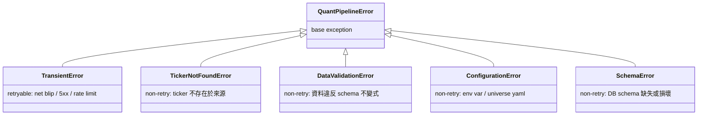
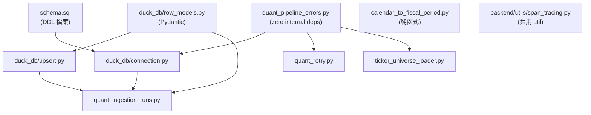

# Design — Quant Data Pipeline 共用基礎層（Foundation Layer）

> **上位契約**：`artifacts/current/design_master.md`。本文件細化 Design Master §5（目錄）、§6（DDL）、§7（shared foundation components）於 foundation PR 這個範圍內要交付的產物、邊界、與驗證方式。
>
> **下游消費者**：`design_yfinance_ingestion.md`（下一個 PR）、之後的 `design_sec_xbrl_ingestion.md`（尚未建立）。

---

## 1. Purpose & Scope

### 目的
一次建齊兩條 subsystem pipeline 共用的 infrastructure，讓 yfinance / SEC XBRL 兩條 PR 上場時只需專注各自的 fetcher / transformer 邏輯。

### In-Scope（本 PR）
- DuckDB connection bootstrap + schema 落地
- `schema.sql` 全 8 張表 DDL + 全欄位 `COMMENT ON COLUMN`
- 5 個 Pydantic row DTO（供 foundation 自身 + yfinance PR 直接 import 使用）
- 工具模組：`upsert_rows()`、`normalize_fiscal_period()`、`ingestion_run()` context manager、`with_retry()` decorator
- **Lift `traced_span()`**：把 `backend/ingestion/sec_dense_pipeline/tracing.py` 搬到 `backend/utils/span_tracing.py`，foundation PR 與 `sec_dense_pipeline` 共用（詳見 §13）；連動更新 `sec_dense_pipeline/retriever.py`、`sec_dense_pipeline/vectorizer.py` 的 import
- Error taxonomy 6 個 class（`QuantPipelineError` base + 5 subclass）
- Universe loader + `ticker_universe.yaml`（10 tickers）
- pytest 測試（unit + schema roundtrip smoke + comment mirror + fixture）

### Out-of-Scope
| 項目 | 原因 |
|---|---|
| CLI (`__main__.py`、`refresh*` subcommand) | Design Master §9 所有 subcommand 都需要子系統能力；第一個有實質 refresh 能力的子系統 PR 一併建立 |
| SEC-specific DTO（`SECQuarterlyRow`、`SECAnnualRow`、`SegmentFinancialRow`、`GeographicRevenueRow`、`CustomerConcentrationRow`） | SEC 子系統 design 未定、overlap 欄位（`total_lease_obligation_usd`）歸屬與 DTO 切法屬 SEC 子系統決策 |
| Alembic migration | Design Master §10 iteration 階段採「砍 `data/quant.db` + 重跑 ETL」 |
| `data/quant.db` 實際資料 seeding | 本 PR 無 fetcher |
| Cross-process write coordination | Design Master §12.1 single-writer 靠 convention |
| Langfuse SDK 端到端 tracing 驗證 | foundation 無 root trace，該驗證屬子系統 PR 責任（memory `feedback_tracing_verification.md`）|

---

## 2. Module Layout

### 2.1 Source tree

**命名約定**：foundation 層的 utility module 一律採 descriptive 檔名，避免 generic 名稱（`utils.py` / `tools.py` / `helpers.py`）。原則：
- `quant_data_pipeline/` root 的 utility module 凡名稱偏泛用（errors / retry / ingestion_runs）一律加 `quant_` prefix 避免跨 pipeline 撞名
- Loader / data 檔名顯式標明角色（`ticker_universe_loader.py`、`ticker_universe.yaml`）
- 純函式工具依轉換方向命名（`calendar_to_fiscal_period.py`：從 calendar date 轉 fiscal period tuple）
- `duck_db/` 取代模糊的 `db/` 以明示 engine
- 跨 pipeline 共用 observability util 放在 `backend/utils/`，檔名顯式標明語意（`span_tracing.py`：span-based conditional tracing helper）—— 不用 generic 的 `tracing.py`，讓 caller 讀 import path 就知道這是 span-level tracing helper

標記圖例：**🆕 新增** / **✏️ 修改** / **🗑️ 刪除**

```
backend/
├── utils/                                   🆕 新增資料夾
│   ├── __init__.py                          🆕
│   └── span_tracing.py                      🆕（內容源自 sec_dense_pipeline/tracing.py，file move 非 rewrite）
└── ingestion/
    ├── sec_dense_pipeline/
    │   ├── tracing.py                       🗑️ 刪除（已被 lift 到 backend/utils/span_tracing.py）
    │   ├── retriever.py                     ✏️ 修改 import: sec_dense_pipeline.tracing → backend.utils.span_tracing
    │   └── vectorizer.py                    ✏️ 修改 import（同上）
    └── quant_data_pipeline/                 🆕 新增整個 package
        ├── __init__.py                      🆕
        ├── config/
        │   └── ticker_universe.yaml         🆕 Canonical 10-ticker 清單（§7.9 of Design Master）
        ├── duck_db/
        │   ├── __init__.py                  🆕
        │   ├── connection.py                🆕 get_connection()
        │   ├── schema.sql                   🆕 手寫單檔、8 表、全 COMMENT
        │   ├── upsert.py                    🆕 upsert_rows()
        │   └── row_models.py                🆕 5 DTO (見 §4)
        ├── calendar_to_fiscal_period.py     🆕 normalize_fiscal_period()
        ├── ticker_universe_loader.py        🆕 load_ticker_universe()
        ├── quant_pipeline_errors.py         🆕 QuantPipelineError base + 5 subclass
        ├── quant_ingestion_runs.py          🆕 ingestion_run() + RunReport
        ├── quant_retry.py                   🆕 with_retry()
        └── README.md                        🆕
```

### 2.2 Tests tree

```
backend/tests/
├── utils/                                   🆕 對應 backend/utils/
│   ├── __init__.py                          🆕
│   └── test_span_tracing.py                 🆕 traced_span() unit test（§8.4）
└── ingestion/
    └── quant_data_pipeline/                 🆕 新增整個 package
        ├── conftest.py                      🆕 tmp_duckdb fixture（子系統 PR 共用入口）
        ├── test_connection.py               🆕
        ├── test_schema_comments.py          🆕 quarterly ↔ annual COMMENT mirror
        ├── test_schema_roundtrip.py         🆕 end-to-end smoke
        ├── test_upsert.py                   🆕
        ├── test_calendar_to_fiscal_period.py 🆕 §7.4 的 10 個 golden cases
        ├── test_quant_ingestion_runs.py     🆕
        ├── test_quant_retry.py              🆕
        ├── test_ticker_universe_loader.py   🆕
        └── test_quant_pipeline_errors.py    🆕
```

**連動驗證**：`sec_dense_pipeline` 本來沒有獨立單元測試（已 `find` 確認無 `test_tracing.py`）；遷移後僅需跑 `sec_dense_pipeline` 既有整合測試確認 import 改動無 regression；新的 `test_span_tracing.py` 補回單元 coverage。

---

## 3. `schema.sql` 組織與 mirror 守護

### 3.1 檔案結構（手寫單檔）

依 Design Master §6 順序逐表寫入：

```
-- 1. companies
CREATE TABLE IF NOT EXISTS companies (...);
COMMENT ON COLUMN companies.ticker IS '...';
...

-- 2. market_valuations
CREATE TABLE IF NOT EXISTS market_valuations (...);
COMMENT ON COLUMN ...;
...

-- 3. quarterly_financials
...

-- 4. annual_financials
-- （欄位與 quarterly_financials 相同；扣掉 fiscal_quarter）
-- 共用欄位的 COMMENT 必須與 quarterly_financials 對應欄位字對字一致
...

-- 5. segment_financials
-- 6. geographic_revenue
-- 7. customer_concentration
-- 8. ingestion_runs (含 idx_runs_pipeline_ticker_started index)
```

### 3.2 選擇不走 build script 的理由

Design Master §6.4 「建議用 Python script 以一份 column spec source of truth 產生 `schema.sql`」是建議不是契約。本 PR 採手寫 + pytest 守漂移：

| 方案 | 選擇 |
|---|---|
| 手寫單檔 + mirror pytest | ✅ 本 PR 採用 |
| Python build script + YAML spec | ❌ 過早抽象；iteration 階段欄位還會變動，手寫摩擦力反而是 review checkpoint |
| 產物不 commit（runtime 產生） | ❌ PR reviewer 看不到 schema；Text-to-SQL 讀檔變動態 |

### 3.3 `test_schema_comments.py` — mirror 守護契約

```
1. get_connection(":memory:", ensure_schema=True)
2. SELECT column_name, comment FROM duckdb_columns()
     WHERE table_name IN ('quarterly_financials', 'annual_financials')
3. 取兩表欄位交集（唯一排除 fiscal_quarter —— 結構差異；
   updated_at 納入 mirror 檢查，兩表 COMMENT 應字對字一致）
4. 逐欄比對 comment 字串
5. 若不一致：assert False，error message 列出
     - 不一致欄位名
     - quarterly 版本 comment 全文
     - annual 版本 comment 全文
```

此測試存在的原因：避免未來加欄位時只改 quarterly 或只改 annual。

---

## 4. DTO Coverage

### 4.1 本 PR 落地的 5 個 DTO

| DTO | 對應表 | 包含欄位 | Writer |
|---|---|---|---|
| `CompanyRow` | `companies` | 全欄位（不含 `updated_at` —— 由 `upsert_rows()` 管理，DTO 不定義） | yfinance（唯一） |
| `MarketValuationRow` | `market_valuations` | 全欄位（同上不含 `updated_at`） | yfinance（唯一） |
| `YFinanceQuarterlyRow` | `quarterly_financials` | PK + yfinance-sourced 欄位（不含 `product_revenue_usd`、`service_revenue_usd`、`current_rpo_usd`、`noncurrent_rpo_usd`；`total_lease_obligation_usd` 不在此 DTO —— 歸 SEC） | yfinance |
| `YFinanceAnnualRow` | `annual_financials` | 與 `YFinanceQuarterlyRow` 同欄位，扣掉 `fiscal_quarter` | yfinance |
| `IngestionRunRow` | `ingestion_runs` | 全欄位 | foundation（唯一 writer，由 `ingestion_run()` 呼叫） |

### 4.2 延後到 SEC 子系統 PR 的 DTO

| 延後項目 | 原因 |
|---|---|
| `SECQuarterlyRow` / `SECAnnualRow` | DTO shape 切法（單一大 DTO vs 拆 `SECRevenueDisaggRow` + `SECRPORow` + `SECLeaseRow`）由 SEC fetcher / transformer 實作邏輯決定；§7.2 範例是示範不是契約 |
| `SegmentFinancialRow`、`GeographicRevenueRow`、`CustomerConcentrationRow` | foundation 與 yfinance 都不寫這三張表；DTO 放 foundation 沒服務任何 caller |

### 4.3 DTO 契約（與 Design Master §7.2 一致）

- DTO field 名稱**必須**與 DDL column 名稱一致（`upsert_rows()` 靠 `model_fields` 推 SQL）
- PK 欄位 required（`str`、`int`），非 PK 依 DDL nullable 決定 `| None`
- `updated_at` 由 `upsert_rows()` 自動維護，DTO **不定義**此欄位
- `total_lease_obligation_usd` **不在** `YFinanceQuarterlyRow` / `YFinanceAnnualRow` —— 此欄位由 SEC 子系統 DTO own（Design Master §12.5：SEC 覆寫 yfinance）

---

## 5. Public API Surface

本 PR 對外（子系統 PR）export 的 symbol：

```python
# duck_db
from backend.ingestion.quant_data_pipeline.duck_db.connection import get_connection
from backend.ingestion.quant_data_pipeline.duck_db.upsert import upsert_rows
from backend.ingestion.quant_data_pipeline.duck_db.row_models import (
    CompanyRow,
    MarketValuationRow,
    YFinanceQuarterlyRow,
    YFinanceAnnualRow,
    IngestionRunRow,
)

# util modules
from backend.ingestion.quant_data_pipeline.calendar_to_fiscal_period import normalize_fiscal_period
from backend.ingestion.quant_data_pipeline.ticker_universe_loader import load_ticker_universe
from backend.ingestion.quant_data_pipeline.quant_ingestion_runs import ingestion_run, RunReport
from backend.ingestion.quant_data_pipeline.quant_retry import with_retry
from backend.utils.span_tracing import traced_span

# error taxonomy
from backend.ingestion.quant_data_pipeline.quant_pipeline_errors import (
    QuantPipelineError,
    TransientError,
    TickerNotFoundError,
    DataValidationError,
    ConfigurationError,
    SchemaError,
)
```

### 5.1 `get_connection()`

```
def get_connection(
    db_path: str | None = None,
    *,
    ensure_schema: bool = True,
) -> DuckDBPyConnection
```

- `db_path=None` 時讀 `os.getenv("DUCKDB_PATH", "data/quant.db")`
- `ensure_schema=True` 時每次 open 都套用 `schema.sql`（DDL 以 `IF NOT EXISTS` 寫，重複執行無副作用；DuckDB `conn.execute()` 支援單一字串內多段 SQL statement）
- 若 `schema.sql` 檔案不存在（packaging 失敗）或 DDL 執行失敗（schema 無法建立） → raise `SchemaError`
- 回傳的 `DuckDBPyConnection` 支援 Python context manager（`with get_connection() as conn:`）；caller 與測試程式建議使用 `with` 確保自動 `close()`

**`SchemaError` vs `ConfigurationError` 分工**：`schema.sql` 是 foundation package 交付物、檔案系統保證存在；缺失或執行失敗屬「schema 無法建立」→ `SchemaError`。`ConfigurationError` 專留給使用者可控制的 configuration 錯誤（env var、universe yaml 解析）。

### 5.2 `upsert_rows()`

**做什麼**：把一批 Pydantic row DTO 寫入 DuckDB 一張表。若 row 的 primary key 已存在，就**只更新 DTO 本身列出的那些欄位**、保留由其他 DTO 管理的欄位——這是多 DTO-per-table pattern（e.g. `quarterly_financials` 同時被 `YFinanceQuarterlyRow` 與未來 SEC-side DTO 寫不同欄位集）能成立的基礎機制。

```
def upsert_rows(
    conn: DuckDBPyConnection,
    table: str,
    pk_columns: list[str],
    rows: list[T],  # T bound=BaseModel
) -> int
```

#### 5.2.1 行為契約

**Column-level merge（核心機制）**
- Helper 讀 `T.model_fields` 取得這份 DTO 宣告的欄位 list，只把這些欄位放進 `INSERT (...)` 與 `ON CONFLICT ({pk}) DO UPDATE SET col = EXCLUDED.col, ...` 子句
- DDL 存在但 DTO 沒宣告的欄位：**既不 insert 也不 update**（upsert 時保留原值）
- 這保證：用 `YFinanceQuarterlyRow` upsert `quarterly_financials` 時，不會動到 SEC 子系統之前寫進 `product_revenue_usd` / `current_rpo_usd` 的值

**`updated_at` 由 helper 自動管理**
- DTO 類別刻意**不**宣告 `updated_at` 欄位
- Helper 每次組 SQL 都會在 SET 子句尾巴加 `, updated_at = CURRENT_TIMESTAMP`
- 呼叫端不該自己傳 `updated_at`；若 DTO 裡偷加這欄，會被 helper 拒絕（implementation 要 assert）

**空 list 短路**
- `rows == []` → 直接 `return 0`，不送 SQL、不走 `conn.register`
- 理由：避免對空 staging view 跑 `INSERT ... SELECT`（雖然是 no-op 但多一個 round-trip、污染 Langfuse span 的 `num_rows=0` 紀錄）

**Return value**
- 回 `len(rows)`，**不**回 DuckDB 的 affected-rows count
- 理由：DuckDB 對 `INSERT ... ON CONFLICT DO UPDATE` 的 affected count 不穩定（見 DuckDB issue 追蹤）。我們回報的是「caller 交給我們幾 row」而不是「DB 實際動了幾 row」；語意對 `RunReport.rows_written_total` 的 aggregation 更有用

#### 5.2.2 底層 SQL 形式（**決定採 A**）

```sql
INSERT INTO {table} ({col1}, {col2}, ...)
SELECT {col1}, {col2}, ... FROM staging
ON CONFLICT ({pk_cols}) DO UPDATE SET
    {col1} = EXCLUDED.{col1}, ..., updated_at = CURRENT_TIMESTAMP
```

**候選方案 B 比較**：`INSERT INTO {table} BY NAME SELECT * FROM staging ON CONFLICT ...`（DuckDB-specific 變體，按欄位名對齊）。

Pros / Cons 誠實對照：

| 面向 | A（顯式欄位列表）| B（`BY NAME SELECT *`）|
|---|---|---|
| SQL 字串長度 | 長（column list 寫兩次）| 短 |
| Helper 拼 SQL 複雜度 | 拼三處 column list（INSERT、SELECT、SET）| 拼一處（SET 子句仍需 explicit，見下）|
| Audit log 自解釋性 | ✅ SQL 字串本身列出寫了哪些欄位 | ❌ 需交叉比對 staging DataFrame |
| DuckDB-idiomatic | 普通 | ✅ |
| Schema / 型別 drift detection | 兩者等價（DuckDB runtime 擲錯） | 兩者等價 |
| DTO 欄位順序無感 | ✅ helper 顯式拿 `model_fields` 決定順序 | ✅ DuckDB 按 name 對齊 |

**`ON CONFLICT DO UPDATE SET` 沒有 `BY NAME` 簡寫**：非 PK 欄位必須逐個 `col = EXCLUDED.col` 列出，所以不管走 A 或 B，helper 都必須從 `T.model_fields` 拿 column list 去組 SET 子句——B 僅省掉 INSERT / SELECT 那兩行的 column enumeration，整體 helper 複雜度差距有限。

**決策理由（採 A）**：Audit log readability 勝過 SQL 簡潔。pipeline 偵錯最常發生在「為什麼 column X 沒寫到 / 寫錯了」，觀測介面是 Langfuse span + DB log 而非 REPL interactive debugging；SQL 字串自我說明是反覆受益的資產（每次看 log 都賺），B 的簡潔只在寫 helper 那天賺一次。

**不採的理由不是 portability**：本專案確定走 DuckDB-only（Agent 的 Text-to-SQL 場景 DuckDB 最合適），跨 DB 移植的機率極低；此 factor 不列入決策。

#### 5.2.3 Pandas staging bridge

##### View 是什麼、View name 是什麼

**View（檢視）** 在 SQL 術語裡是一個「具名的 SELECT 查詢」：看起來像表（可以 `SELECT * FROM view_name`），但**不儲存資料**——每次查詢時 DB 臨時執行它底層定義的 SELECT。可以想像成「存起來的 SELECT 公式」。

DuckDB 的 `conn.register("staging", df)` 做的事：
- 在當前 connection 的 **view registry** 裡登記一個名叫 `staging` 的 view，它的資料來源是傳進去的 pandas DataFrame
- 後續 SQL 寫 `FROM staging` 時，DuckDB 會去讀那個 DataFrame 在記憶體裡的 Arrow buffer（zero-copy，不複製）
- 不建 table、不寫 disk、不進 WAL、不會出現在 `duckdb_tables()` 查詢結果裡

`"staging"` 這個字串只是 view 的 label：
- 可以換成任何合法 identifier（`tmp`、`buffer`、`yf_rows`…），對 DuckDB 來說就只是一個 dict key
- 選 `"staging"` 純粹因為 ETL / data warehouse 界慣用——「upsert 前的資料準備區」
- **不是**環境分離（dev / staging / prod）的那個「staging」——那是完全不同的用語；跨環境隔離靠 `DUCKDB_PATH` env var 指到不同 `.db` 檔
- Scope 只在 connection 本地；同一 `.db` 檔被兩個 connection 同時開啟，各自有獨立 view registry、彼此看不到對方的 `staging`

生命週期：每次 `upsert_rows()` 呼叫內才存在：
```
conn.register("staging", df)          # registry 多一筆 "staging" → df 的綁定
conn.execute("... FROM staging ...")  # DuckDB 讀 df
conn.unregister("staging")            # 從 registry 移除
```

##### 為什麼走 DataFrame 中介而不是 parameterized SQL

- DuckDB Python client 讀 pandas DataFrame 是 **zero-copy**（直接 scan Arrow buffer、不複製）
- 比「把每一 row 組成 `VALUES (...)` 字串」safer（避掉 escaping、型別 coercion 風險）
- 比 parameterized `executemany` 快（DuckDB 走 bulk path，單次 SQL 處理整批 row）

##### 實作步驟

```python
df = pd.DataFrame([r.model_dump() for r in rows])
conn.register("staging", df)
try:
    conn.execute(<<§5.2.2 的 SQL>>)
finally:
    conn.unregister("staging")
```

### 5.3 `normalize_fiscal_period()`

```
def normalize_fiscal_period(
    period_end: date,
    fiscal_year_end_month: int,  # 1-12
) -> tuple[int, int]  # (fiscal_year, fiscal_quarter)
```

- 月精度判斷（day 忽略，容忍 52/53-week calendar drift）
- 非季度邊界 → raise `ValueError`（不是 `DataValidationError`，因這是 helper-level validation；子系統會視需要轉型）

### 5.4 `ingestion_run()`

**做什麼**：每次 pipeline 處理一個 ticker 都包在這個 context manager 內，**強制**寫一筆 `ingestion_runs` audit row——不論 ingestion 成功還是失敗。這張表是「ops 事後還原 pipeline 行為」的唯一資料來源（見 Design Master §6.8：「DB 有 NVDA Q3 2024 嗎？」查 `quarterly_financials`；「NVDA 上次 ETL 跑成功是什麼時候？」查 `ingestion_runs`）。與 tracing 無關，tracing 是 `traced_span()` 的責任。

```
@contextmanager
def ingestion_run(
    conn: DuckDBPyConnection,
    pipeline: str,              # 'yfinance' | 'sec_xbrl'
    ticker: str,
    *,
    target_filing_type: str | None = None,
    target_fiscal_year: int | None = None,
    target_fiscal_quarter: int | None = None,
    target_accession_number: str | None = None,
) -> Iterator[RunReport]
```

#### 5.4.1 `RunReport` 是什麼

Context manager **yield 出來的物件**，是 mutable dataclass，讓 caller 在 `with` block 內把本次 ingestion 的統計資訊填進去：

```python
@dataclass
class RunReport:
    rows_written_total: int = 0        # 本次 ingestion 寫進 DB 幾 row（跨表加總）
    metadata: dict[str, Any] = field(default_factory=dict)  # 自由形式 JSON，見 §7 reserved keys
```

使用慣例：

```python
with ingestion_run(conn, "yfinance", "NVDA") as report:
    rows1 = upsert_rows(conn, "companies", ["ticker"], [...])
    rows2 = upsert_rows(conn, "quarterly_financials", [...], [...])
    report.rows_written_total = rows1 + rows2
    report.metadata["periods_covered"] = {"quarterly": ["2025Q3", "2025Q2"]}
    report.metadata["rows_per_table"] = {"companies": rows1, "quarterly_financials": rows2}
```

Exit 時 context manager 把 `report.rows_written_total` 與 `report.metadata`（serialized to JSON）一起寫進 `ingestion_runs` row。

用 mutable dataclass 而不是「回傳 dict 要 caller 自己塞」是為了避免 side-effectful 地改 metadata dict（多個地方 mutate 同一 dict 容易出 bug）；傳顯式 `report` object 強制 caller 用 attribute 名稱更新。

#### 5.4.2 兩條 exit 路徑

Context manager 的 `__exit__` 根據 with block 是正常離開還是 exception 離開，走不同路徑：

**Success path**（with block 正常結束）
- `status = 'success'`
- `finished_at = now()`
- 把 `report.rows_written_total` 與 `report.metadata` 寫入 row
- `error_class` / `error_message` 為 `NULL`

**Error path**（with block 拋例外）
- `status = 'error'`
- `error_class = type(exc).__name__`（e.g. `YFinanceRateLimitError`、`TickerNotFoundError`）
- `error_message = str(exc)`
- `rows_written_total = 0`（不信 caller 在 exception 前填的 partial count）
- `metadata` 仍寫入（caller 在 exception 前累積的 partial info 保留，例如 `api_latency_ms`）
- 寫完後 **re-raise** exception，讓 上層 caller 看得到錯誤（context manager 不吃 exception）

#### 5.4.3 為什麼要用 context manager

對比兩種 API 設計：

| 方案 | 樣子 |
|---|---|
| 兩個獨立函式 | `run_id = start_run(...); try: ... finally: end_run(run_id, report)` |
| Context manager（本 PR 採用）| `with ingestion_run(...) as report: ...` |

Context manager 的好處：
- Python `with` 語意保證 `__exit__` 一定被執行（對 early return、exception 都成立），不像手動 `try/finally` 有 caller 忘記的風險
- Exception 自動 catch → 寫 error row → re-raise，每個 caller 不用重覆實作 try/except
- Caller code 更乾淨、意圖更顯式

#### 5.4.4 SEC-only 預留 kwargs

`target_filing_type` / `target_fiscal_year` / `target_fiscal_quarter` / `target_accession_number` 四個 kwargs 為 SEC 子系統預留（見 Design Master §6.8），foundation PR 與 yfinance PR 皆傳 `None`；本 PR 不加額外驗證邏輯。

### 5.5 `with_retry()`

```
def with_retry(
    max_attempts: int = 3,
    base_delay_seconds: float = 1.0,
) -> Callable[[Callable[..., T]], Callable[..., T]]
```

- 只 retry `TransientError`（其他 exception 立即 propagate）
- Exponential backoff：`base_delay_seconds` × `2^attempt`（預設 1s / 2s / 4s，最壞總延遲 7s）
- Retry 過程 `logger.warning` 一筆；子系統若要把 retry 次數記入 `ingestion_runs.metadata.retry_count`，自行計數

#### 5.5.1 Rate limit handling：pacing vs retry 是兩件事

Foundation `with_retry` **不**處理 rate limit；它只做**反應式**的 retry。Rate limit 的**預防式** throttle 是**子系統責任**，不在 foundation scope。以 yfinance 為例（見 `design_yfinance_ingestion.md` §8）：

```mermaid
flowchart TD
    pacing["Pacing / Throttle 子系統 fetcher.py 負責<br/>module-level _last_call_ts gate<br/>每次 API call 前 sleep 至 _MIN_INTERVAL<br/>預設 1.0s for yfinance"]
    call["呼叫外部 API<br/>yfinance / SEC EDGAR / ..."]
    check{"回應 429 ?"}
    raiseErr["fetcher 偵測 429<br/>raise YFinanceRateLimitError<br/>繼承 TransientError"]
    retry["with_retry foundation 負責<br/>catch TransientError + exponential backoff<br/>yfinance 覆寫 base_delay_seconds=60.0"]
    ok["成功 + 回傳資料"]
    fail["重試用盡 + 往上拋 TransientError"]

    pacing --> call
    call --> check
    check -->|否| ok
    check -->|是| raiseErr
    raiseErr --> retry
    retry -->|重試成功| ok
    retry -->|重試用盡| fail

    classDef subsys fill:#ffe0b3,stroke:#ff8c00,color:#000
    classDef foundation fill:#d4edda,stroke:#28a745,color:#000
    class pacing,raiseErr subsys
    class retry,fail foundation
```

**Foundation 該做 / 不該做**：

| 項目 | Foundation 該做 | 原因 |
|---|---|---|
| Retry on `TransientError` with exponential backoff | ✅ | 通用機制、全子系統共用 |
| Retry base_delay 可 override | ✅（`with_retry(base_delay_seconds=60.0)`）| yfinance 需要 60s、SEC EDGAR 需要其他值，不同子系統不同 |
| Module-level `_last_call_ts` pacing gate | ❌（子系統自己做）| Pacing 間隔每個資料源不同（yfinance 1s、SEC EDGAR ~0.1s、其他未知），不該寫死在 foundation |
| 把 rate limit exception 分類 | ❌（子系統自己做）| 429 的 HTTP body 語意因 API 而異，分類要 subsystem-specific knowledge |

Foundation 只提供機制（`with_retry` + `TransientError` base class），**子系統**決定策略（何時 pacing、pacing 多久、什麼 exception 歸 `TransientError`、retry 的 `base_delay_seconds` 設多少）。

### 5.6 `traced_span()`

**實作狀態**：這個 helper 在先前的 `sec_dense_pipeline` PR（已合併進 v3 main）已經寫完、有測試覆蓋、已於 `retriever.py` 與 `vectorizer.py` 實戰使用中。**本 PR 不重寫任何 runtime 邏輯**，只做 **file move**：把 `backend/ingestion/sec_dense_pipeline/tracing.py` 搬到 `backend/utils/span_tracing.py`，讓它升格為跨 pipeline 共用的 observability util；並把 `sec_dense_pipeline/retriever.py`、`sec_dense_pipeline/vectorizer.py` 的 2 行 import 改到新位置。

**這個 helper 做的事**（摘錄既有實作，供 design 讀者理解 foundation 其他 module 為何依賴它）：
- Context manager，enter 時讀當前 OpenTelemetry span
- **有有效 outer span**（通常是 agent tool `@observe` 建的 root trace）→ 透過 `langfuse.get_client().start_as_current_observation()` 開一個 child observation，讓 pipeline 內部 span 自然掛進 parent-child tree
- **無 outer span**（batch CLI、pytest）→ yield `_NoOpSpan`，所有 `.update()` / `.update_trace()` 呼叫都是 no-op，不送任何資料到 Langfuse
- 淨效果：batch 與測試環境不污染 Langfuse UI；agent JIT 呼叫自然形成完整 trace 樹——不需要每個 entry point 靠 env var 切 tracing on/off

**本 PR 的 import 位置**：`from backend.utils.span_tracing import traced_span`

### 5.7 `load_ticker_universe()`

**Ticker universe 是什麼**：一份**正式追蹤的公司 ticker 清單**，由 `config/ticker_universe.yaml` 宣告，是 pipeline 對「我負責哪些公司的資料」的 single source of truth。

**本階段 10 個 ticker（跨產業挑選，非 tech-only）**：專案定位不限 tech，初始 universe 刻意跨產業選，讓 schema 在早期就被不同 column-null pattern 壓測（例：銀行沒有 `gross_profit_usd` 意義下的毛利、保險沒 `inventory_usd`、SaaS 才有 `current_rpo_usd`、能源 / 製造 `capital_expenditure_usd` 佔比大、零售 `inventory_usd` / `accounts_receivable_usd` 模式不同）。

| Ticker | Industry | 期望壓測的 schema 面向 |
|---|---|---|
| MSFT | Software + Cloud | 基線大型 tech，常規欄位齊全 |
| NVDA | Semiconductor | 高毛利、SBC / capex 曲線特殊 |
| CRM | SaaS | `current_rpo_usd` / `noncurrent_rpo_usd` 有值；`inventory_usd` 為 NULL |
| WMT | Retail | `inventory_usd` / `accounts_receivable_usd` 為核心；RPO 為 NULL |
| JPM | Banking | `interest_income_usd` / `interest_expense_usd` 是主營收；`gross_profit_usd` 語意薄弱 |
| BRK.B | Insurance / Holdco | 投資收益主導、`cost_of_revenue_usd` 結構特殊 |
| JNJ | Pharma / Healthcare | R&D 高、產品 / 服務 revenue 拆分（ASC 606）|
| KO | Consumer staples | 穩定營運、dividend-heavy 現金流 |
| XOM | Integrated Energy | `capital_expenditure_usd` 占比極大；`depreciation_amortization_usd` 大量 |
| CAT | Industrial | `inventory_usd`、`net_ppe_usd` 重；跨地區 `segment_financials` 豐富 |

**連動變更**：Design Master §7.9 原列的 tech-only 10 ticker 也同步替換成本表。

**為什麼要 load**：下游有三類 consumer 會用到這份清單：

| Consumer | 用途 |
|---|---|
| **CLI batch refresh**（子系統 PR 建）| `python -m ... refresh` 不帶 ticker 參數時，loader 回傳的 list 就是要跑一輪 ingestion 的對象 |
| **Coverage validation**（Design Master §9 `validate` subcommand）| 比對 `companies` 表與 universe —— 找出「宣告要追但尚未 ingest」或「ingest 了但不在 universe」的 ticker |
| **Agent 邊界檢查**（未來）| Agent tool 若要檢驗 user 問的 ticker 是否在「我們有可靠資料」範圍內，就查這份 universe |

```
def load_ticker_universe(path: Path | None = None) -> list[str]
```

- 預設讀 `config/ticker_universe.yaml`
- 回傳 ticker list，全部 `upper()`（canonicalize）
- YAML 缺 `tickers` key / 解析失敗 → raise `ConfigurationError`

**不做的事**：
- **不**從 universe 推斷「哪些 fiscal period 要 ingest」——那是各子系統的決定（yfinance 吃整段歷史、SEC 依 filing 逐份處理）
- **不**驗證 ticker 在外部資料源（EDGAR / yfinance）存在——碰撞時子系統層 raise `TickerNotFoundError`
- **不**跟 `companies` DB 表同步——universe 是 intent 宣告，DB 表是實際到貨紀錄，兩者刻意分開

---

## 6. Error Taxonomy（§7.6 全落）



### 6.1 本 PR 自 raise 的情境

| Class | raise 於 | 觸發條件 |
|---|---|---|
| `ConfigurationError` | `load_ticker_universe()` | YAML 缺 `tickers` / 解析失敗 |
| `SchemaError` | `get_connection()` | `schema.sql` 檔案不存在 |

`TransientError` / `TickerNotFoundError` / `DataValidationError` 本 PR 不 raise，僅 export 供子系統 subclass / raise（e.g. `YFinanceRateLimitError(TransientError)`）。

### 6.2 與既有 `sec_filing_pipeline.SECPipelineError` 的關係

**平行不繼承**。兩條 pipeline 目的不同：`sec_filing_pipeline` 是 RAG 的 10-K 下載 pipeline、`quant_data_pipeline` 是 Text-to-SQL 的結構化資料 pipeline，錯誤語意不共享。

---

## 7. `ingestion_runs.metadata` JSON Convention

本 PR **不硬凍** key schema，但建議 reserved keys 如下（子系統實作時遵循；自定 key 不得覆寫以下語意）：

| Key                                 | 型別               | 用途                                                             | 維護者                                               |
| ----------------------------------- | ---------------- | -------------------------------------------------------------- | ------------------------------------------------- |
| `periods_covered`                   | `dict`           | e.g. `{"quarterly": ["2025Q3", "2025Q2"], "annual": ["2024"]}` | 子系統                                               |
| `rows_per_table`                    | `dict[str, int]` | 本次 run 在每張 DB 表寫了幾 row，e.g. `{"companies": 1, "quarterly_financials": 8}`；是 `rows_written_total` 的分表拆解，供 debug 哪個表可能漏寫 | 子系統 |
| `retry_count`                       | `int`            | `with_retry()` 實際重試次數                                          | 子系統（`with_retry()` **不自動寫入** metadata；呼叫端需要時自行計數） |
| `api_latency_ms`                    | `dict[str, int]` | 每個上游 API 呼叫的延遲（ms）                                             | 子系統                                               |

Design Master §6.8 COMMENT: `'Per-run summary. Free-form JSON: {periods_covered, rows_per_table, api_latency_ms, ...}.'` — 此處的 reserved key 建議與該 COMMENT 對齊。

---

## 8. Testing Strategy

### 8.1 測試層級

| 層級 | 內容 |
|---|---|
| **Unit** | 每個模組一個 `test_<module>.py`，覆蓋正常 / 邊界 / 錯誤路徑 |
| **Integration smoke** | `test_schema_roundtrip.py`：in-memory DuckDB → bootstrap → upsert 真實 DTO → select → assert |
| **合約 mirror** | `test_schema_comments.py`：quarterly ↔ annual 欄位 COMMENT 字對字一致 |
| **Golden fixtures** | `test_calendar_to_fiscal_period.py`：Design Master §7.4 的 10 個 `(ticker, fye_month, period_end) → (fy, fq)` cases 全跑過 |

### 8.2 `conftest.py` 共用 fixtures

```python
@pytest.fixture
def tmp_duckdb(tmp_path) -> DuckDBPyConnection:
    """每個 test 一個新 tmpdir DuckDB；schema 已 bootstrap。"""
    db_path = tmp_path / "test.db"
    conn = get_connection(str(db_path), ensure_schema=True)
    try:
        yield conn
    finally:
        conn.close()
```

此 fixture 同時供 foundation tests 與後續子系統 PR tests 使用（子系統 PR `conftest.py` 直接 re-export 或 `pytest_plugins` 引入）。

### 8.3 `test_schema_roundtrip.py` — end-to-end smoke

```
步驟：
1. tmp_duckdb fixture → 取 conn
2. upsert_rows(conn, "companies", ["ticker"], [CompanyRow(ticker="MSFT", ...)])
3. SELECT * FROM companies WHERE ticker = 'MSFT'
4. assert 所有欄位值正確、updated_at 非 NULL
5. 用 ingestion_run(conn, "yfinance", "MSFT") 包住一個 no-op block
6. SELECT * FROM ingestion_runs
7. assert 一筆 success row、status 正確、started_at <= finished_at
```

覆蓋目的：驗證 `schema.sql` → `get_connection` → `row_models` → `upsert_rows` → `ingestion_run` 五件事合起來 end-to-end 跑得通。

### 8.4 `test_span_tracing.py`

```
Case 1 — no outer span:
  mock otel_trace.get_current_span() → 回一個 invalid-span-context 物件
  with traced_span("foo") as span:
      span.update(output={...})        # 必須不 throw
      span.update_trace(metadata={})   # 必須不 throw
  assert Langfuse client 從未被呼叫

Case 2 — outer span active:
  mock otel_trace.get_current_span() → 回 valid span
  mock Langfuse() → 回 mock client
  with traced_span("foo"):
      pass
  assert mock_client.start_as_current_observation.called_with(name="foo")
```

**不做**：真實 Langfuse 端到端驗證（子系統 PR 責任）。

---

## 9. Dependency Graph



### 9.1 關鍵規則

- `quant_pipeline_errors.py` 是葉節點（無 import 其他本模組）
- `calendar_to_fiscal_period.py` 純函式、零依賴、可獨立測試
- `backend/utils/span_tracing.py` 是 **跨 pipeline 共用** util（foundation + `sec_dense_pipeline` 同時消費），只依賴外部庫（`langfuse`、`opentelemetry.trace`），不 import 任何 pipeline 內部模組
- `quant_data_pipeline/*` 內部模組之間無循環依賴

---

## 10. 外部依賴（`pyproject.toml` / `uv`）

| Package | 用途 | 必要性 |
|---|---|---|
| `duckdb` | DB engine | 必要 |
| `pydantic` | DTO | 必要 |
| `pandas` | `upsert_rows()` 用 `conn.register` 註冊 DataFrame | 必要（DuckDB `register` 需要 DataFrame 作為來源）|
| `pyyaml` | `load_ticker_universe()` | 必要 |
| `langfuse` | `traced_span()`（`backend/utils/span_tracing.py`）| 已有（`sec_dense_pipeline` 引入，在 `uv.lock`）；本 PR 不新增 |

**約定**：使用 `uv` 管理依賴（memory `feedback_use_uv.md`）。以上 package 若已在 `pyproject.toml`（`langfuse` 由 `sec_dense_pipeline` 引入），不重複加入。

---

## 11. `.gitignore` / 檔案系統配置

本 PR 更新 `.gitignore`（若未存在對應規則）：

```
# Quant data pipeline local DuckDB files
data/*.duckdb
data/*.db
```

`data/` 目錄由 `get_connection()` 以 `Path(path).parent.mkdir(parents=True, exist_ok=True)` 自動建立。

---

## 12. README

`backend/ingestion/quant_data_pipeline/README.md` 是 package 內 ships-with-code 的文件，讀者是後續維護者與子系統 PR 作者。**不引用任何 `artifacts/` 路徑**（artifacts 不進 final codebase）。以下為需要 inline 寫進 README 的章節（內容須自含，不連結外部 design doc）：

1. **Purpose**：一句話——shared infrastructure for yfinance and SEC XBRL quant ETL pipelines, providing DuckDB connection / schema / upsert, Pydantic row DTOs, retry, audit-trail, and ticker universe loader.
2. **Quick start**：最小呼叫範例（~10 行）——`get_connection()` + 宣告 DTO + `upsert_rows()` + `ingestion_run()` 包起來。
3. **Public API**：export symbol 表，依 group（`duck_db/` connection & upsert & DTOs、audit trail、retry、tracing、errors、ticker universe）列 import path 與一行功能描述。
4. **Conventions**：
   - DuckDB is single-writer; batch CLI must serialize across tickers.
   - `updated_at` is managed by `upsert_rows()`; do not declare it in row DTOs.
   - `span_tracing.py` lives in `backend/utils/` (cross-pipeline util); `quant_retry.py` lives here (pipeline-scoped).
5. **Adding a new DTO**：一段 pattern 說明——declare fields matching DDL columns; exclude `updated_at`; pass `pk_columns` list when calling `upsert_rows()`.
6. **Extending error taxonomy**：subsystem 應 subclass `TransientError` / `TickerNotFoundError` / `DataValidationError` 等 base class，命名加自己 pipeline prefix（e.g. `YFinanceRateLimitError(TransientError)`）。
7. **Testing**：`pytest backend/tests/ingestion/quant_data_pipeline/`；`conftest.py` 提供 `tmp_duckdb` fixture 供子系統測試直接 re-use。
8. **Schema evolution policy**：iteration 階段不跑 migration；改 `schema.sql` 後 drop 本地 `data/quant.db` + 重跑 ETL。

---

## 13. 模組擺放決策

**`traced_span()` → `backend/utils/span_tracing.py`**（跨 pipeline 共用 util）  
`sec_dense_pipeline/tracing.py` 已在 v3 main、內容 generic 無 SEC 專屬邏輯。foundation 若自建會產生一字不差的重複實作。本 PR 做 file move + 更新 `sec_dense_pipeline` 的 2 個 import（`retriever.py`、`vectorizer.py`）。  
**檔名採 `span_tracing.py` 而非 generic `tracing.py`**：`utils/` 資料夾雖可作 disambiguator，但檔名本身更該自我說明 —— `span_tracing` 明示這是 span-based conditional tracing helper（有 outer OTel span 時 open Langfuse observation、否則 no-op），caller 讀 import path `from backend.utils.span_tracing import traced_span` 就能推斷語意，不需開檔看實作。

**`with_retry()` → `quant_data_pipeline/quant_retry.py`**（單一 pipeline 內，不 lift）  
只 catch `QuantPipelineError.TransientError`，與 `SECPipelineError.TransientError` 依 Design Master §7.6 **平行不繼承**。拉到 shared utils 必須統一兩個 base class（違反 §7.6）或加 `catch_cls` 參數（為尚未存在的 consumer 提前抽象），兩者皆不值得。
