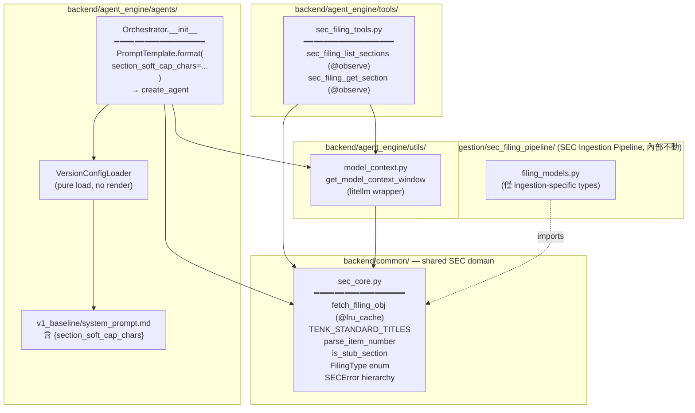
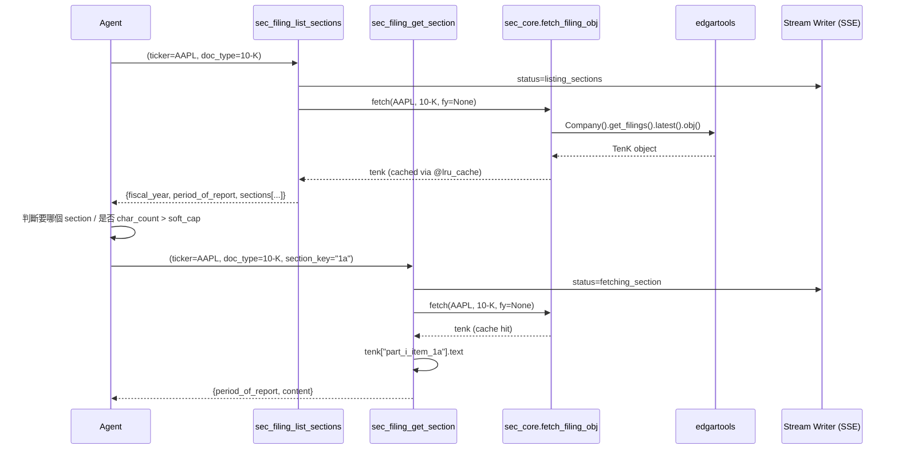

# Design: SEC Agent Tool 拆分為 Two-Step（list_sections + get_section）

## 背景

FinLab-X backend 目前有**兩個**需要從 SEC EDGAR 取得 10-K filing 的子系統：

| Subsystem | 位置 | 用途 | 本 design 涉及 |
|-----------|------|------|---------------|
| **SEC Agent Tool** | `backend/agent_engine/tools/sec.py` | Agent 在對話中即時取 10-K section 原文給 LLM 閱讀 | ✅ 本 design 的主題 |
| **SEC Ingestion Pipeline** | `backend/ingestion/sec_filing_pipeline/` | 離線下載 + HTML/Markdown 轉換 + 本地 cache，供未來 RAG 使用 | ❌ 本 design 不改；僅搬共用 domain 類型 |

兩個子系統目前都用 `edgartools` 定位 filing，但接著立刻丟棄 library 的結構化輸出，退回到 raw text/HTML parsing：

- **SEC Agent Tool**：`filing.text()` + `text.find()` case-insensitive string matching，容易命中 ToC stub、section 截斷武斷、fixed 4000-char cap
- **SEC Ingestion Pipeline**：`filing.html()` + 約 1000 行自製 HTML parsing、公司專屬 heading heuristic 修補

edgartools 5.17.1 已提供 `filing.obj()` → `TenK[key]` 結構化 section API，在 ADSK / AAPL / MSFT 的 smoke test 中穩定抽出 section 文字（0.95 confidence、零 ToC 污染），可以取代這些自製 parsing。

### 本 design 的範圍

只重構 **SEC Agent Tool**：

1. 單一 `sec_official_docs_retriever` tool 拆成 metadata-first 的 two-step（`sec_filing_list_sections` + `sec_filing_get_section`）—— 避免一次把 100K+ chars 塞進 context
2. 改走 edgartools 結構化 API，不再 string matching
3. 共用 SEC domain 類型（exception hierarchy、`FilingType` enum 等）抽成 `backend/common/sec_core.py`，供 SEC Ingestion Pipeline 也 import

**SEC Ingestion Pipeline** 的內部實作（HTML preprocessing、markdown conversion、heading promoter 等）這次 PR 不動；僅跟著 `sec_core` 的搬遷更新 import site。

### 相關 research（選讀）

| 檔案 | 內容 |
|------|------|
| `artifacts/current/design_master.md` | 兩子系統重構的 high-level overview |
| `artifacts/current/research_sec_filing_api.md` | edgartools `filing.obj()` / `TenK[key]` API 驗證（ADSK、AAPL、MSFT） |
| `artifacts/current/research_filing_markdown_quality.md` | `filing.markdown()` 品質問題分析 |

---

## 架構



### 資料流（agent 端到端一次 query）



---

## Shared core：`backend/common/sec_core.py`

### 職責

| 元素                                                         | 說明                                                                                                     |
| ---------------------------------------------------------- | ------------------------------------------------------------------------------------------------------ |
| `FilingType` enum                                          | 從 `filing_models.py` 搬來，兩個子系統共用                                                                        |
| `TENK_STANDARD_TITLES`                                     | SEC 規定的 **10-K** Item 標題常數表（16 個 Items）。以 filing type prefix 命名，未來可新增 `TENQ_STANDARD_TITLES`           |
| `fetch_filing_obj(ticker, filing_type, fiscal_year=None)`  | edgartools wrapper，`@lru_cache(maxsize=64)` 快取 `TenK` object                                           |
| `parse_item_number(section_key)`                           | edgartools native key（`part_i_item_1a`）↔ 正規化 item number（`1a`）雙向 mapping                               |
| `is_stub_section(text)`                                    | 偵測 "incorporated by reference" 空殼 section（主要 Items 10–14）                                              |
| `SECError` + 子類別                                           | Exception hierarchy，從 `filing_models.py` 搬來 + rename（原 `SECPipelineError`） + 新增 `SectionNotFoundError` |

> **Note**：`compute_section_soft_cap_chars` **不在 `sec_core`**。它是 agent-runtime 概念（LLM context budget），SEC Ingestion Pipeline 不用，因此放在 `backend/agent_engine/utils/model_context.py`（見下節）。

### Function signatures

```python
from enum import StrEnum
from edgar._filings import TenK  # type hint reference

class FilingType(StrEnum):
    TEN_K = "10-K"
    # TEN_Q = "10-Q"  # future

TENK_STANDARD_TITLES: dict[str, str] = {
    "1":  "Business",
    "1a": "Risk Factors",
    "1b": "Unresolved Staff Comments",
    "1c": "Cybersecurity",
    "2":  "Properties",
    "3":  "Legal Proceedings",
    "4":  "Mine Safety Disclosures",
    "5":  "Market for Registrant's Common Equity, Related Stockholder Matters and Issuer Purchases of Equity Securities",
    "6":  "[Reserved]",
    "7":  "Management's Discussion and Analysis of Financial Condition and Results of Operations",
    "7a": "Quantitative and Qualitative Disclosures About Market Risk",
    "8":  "Financial Statements and Supplementary Data",
    "9":  "Changes in and Disagreements With Accountants on Accounting and Financial Disclosure",
    "9a": "Controls and Procedures",
    "9b": "Other Information",
    "9c": "Disclosure Regarding Foreign Jurisdictions that Prevent Inspections",
    "10": "Directors, Executive Officers and Corporate Governance",
    "11": "Executive Compensation",
    "12": "Security Ownership of Certain Beneficial Owners and Management and Related Stockholder Matters",
    "13": "Certain Relationships and Related Transactions, and Director Independence",
    "14": "Principal Accountant Fees and Services",
    "15": "Exhibits, Financial Statement Schedules",
    "16": "Form 10-K Summary",
}

def fetch_filing_obj(
    ticker: str,
    filing_type: FilingType,
    fiscal_year: int | None = None,
) -> TenK: ...

def parse_item_number(section_key: str) -> str:
    """'part_i_item_1a' → '1a'，反向也支援。"""

def is_stub_section(text: str) -> tuple[bool, str | None]:
    """回傳 (is_stub, stub_reason)。"""
```

### Exception hierarchy

```python
class SECError(Exception):
    """SEC domain 的 base exception。"""

class TickerNotFoundError(SECError): ...
class FilingNotFoundError(SECError): ...
class UnsupportedFilingTypeError(SECError): ...
class TransientError(SECError): ...
class ConfigurationError(SECError): ...
class SectionNotFoundError(SECError):
    """Agent 傳入 get_section 的 section_key 不合法。"""
```

### Caching 策略

`fetch_filing_obj` 使用 `functools.lru_cache(maxsize=64)`：

- **Key**: `(ticker, filing_type, fiscal_year)`
- **Value**: `TenK` object
- **Rationale**: 同一 conversation 內 `list_sections` + N 次 `get_section` 共用同一 filing object，避免重複呼叫 SEC EDGAR（10 req/s rate limit）
- **TTL**: 無 —— 10-K 一旦提交不會改
- **Maxsize**: 64 —— 控制 memory 佔用（每個 TenK object 可能數 MB）
- **邊界**: 不可與 `@observe` 疊加（目前沒加）；若未來要加，`@observe` 須在外層，避免 cache hit 時 Langfuse 看不到 span

### 為什麼用 `TENK_STANDARD_TITLES` 常數表，而非 parse from text

實測 `section.text()` 第一行格式極不一致：

| 公司 | 第一行 |
|------|--------|
| ADSK | `ITEM 1.BUSINESS`（period 後無空格）|
| ADSK Item 9 | `Table of Contents`（完全偏離）|
| AAPL | `Item 1.\xa0\xa0\xa0\xa0Business`（non-breaking spaces + Title Case）|
| AAPL Item 8 | `Apple Inc.`（Part IV header）|

10-K Item titles 是 SEC 17 CFR 229 規定的 stable 格式，用常數表查零 regex 風險。

### 為什麼 section_key 用 normalized item number 而非 native key

edgartools native key（如 `part_i_item_1a`）把 Part 結構洩漏到 agent mental model，但 design master 已決定 Part 不提供額外識別價值（Item number 在 10-K 中已唯一）。

Agent 看到的 section_key 為 `"1a"`、`"7"`、`"7a"`，對齊 SEC 自己對 Item 的編號。`parse_item_number` 在 `sec_core` 內部做 normalized ↔ native key 的 mapping。

### 為什麼 fiscal_year 定義為公司會計年度

SEC 10-K 的 `period_of_report` 代表 fiscal period 結束日。實測：

| 公司 | `period_of_report` | 公司官方稱呼 | 推導 `fiscal_year` |
|------|--------------------|-----------|-------------------|
| AAPL | `2025-09-27` | FY2025 | 2025 |
| MSFT | `2025-06-30` | FY2025 | 2025 |
| NVDA | `2026-01-25` | FY2026 | 2026 |

**Convention**: `fiscal_year = period_of_report.year`。對 AAPL/MSFT（fiscal year 結束在上半年至 Q3）以及 NVDA（結束在 Q1）都適用。邊界情況（少數公司可能採不同 labeling）留待實際踩到再處理。

Tool output 必回傳 `period_of_report`，讓 agent 看得到實際涵蓋的時間段，避免 FY 數字的歧義。

### edgartools 屬性驗證（2026-04 with 5.17.1）

| 屬性 | 可用 | 備註 |
|------|------|------|
| `filing.period_of_report` | ✅ | string `"YYYY-MM-DD"` |
| `filing.filing_date` | ✅ | `datetime.date` |
| `filing.accession_no` | ✅ | |
| `filing.form` | ✅ | |
| `filing.fiscal_year` | ❌ | 未暴露，需自行從 `period_of_report` 推導 |

---

## Utils：`backend/agent_engine/utils/model_context.py`

容納兩個 agent-runtime helper：

1. `get_model_context_window(model_name)` —— 純 model metadata 查詢
2. `compute_section_soft_cap_chars(model_name, fraction=0.4)` —— 根據 context window 推導 SEC section 的 char 預算，供 system prompt 注入

不放 `sec_core` 的原因：SEC Ingestion Pipeline 離線跑，不用管 LLM context budget；這兩個 helper 都是 agent runtime 概念。

### Model context window 資料來源 — Materialized registry pattern

**為什麼不直接 runtime 呼叫 litellm？**

- litellm 本體 57 MB、連帶 `tokenizers` + `typer` + `jsonschema` 等 10+ transitive deps（總計 ~80 MB）
- litellm 安裝時會 downgrade `python-dotenv` / `importlib-metadata`，有潛在版本衝突
- 我們只要一個 `get_model_info()` 查 `max_input_tokens`，runtime 背 80MB 不成比例
- 實測 litellm 對某些 model ID（如 `claude-opus-4-5-20250929`、`claude-3-5-sonnet-latest`）還不認識，runtime lookup 也會 miss

**方案：litellm 作為 dev-dep + materialized YAML registry**

```
pyproject.toml [project.optional-dependencies].dev
  +litellm >= 1.83.10    # 僅 dev-time，Docker production image 不含

scripts/refresh_model_context_registry.py
  └─ 讀所有 orchestrator_config.yaml 蒐集 model names
  └─ for each model: litellm.get_model_info(name)
  └─ 寫入 backend/agent_engine/utils/model_context_registry.yaml
  └─ litellm miss 的 model → log warning + 留 TODO comment

backend/agent_engine/utils/model_context_registry.yaml   (committed)
  gpt-4o-mini:
    max_input_tokens: 128000
    source: litellm  (or: manual, if litellm didn't know)
  claude-opus-4-20250514:
    max_input_tokens: 200000
    source: litellm
  ...

backend/agent_engine/utils/model_context.py   (runtime, no litellm import)
  載入 YAML → dict cache
  get_model_context_window(name) → dict lookup + DEFAULT fallback
  compute_section_soft_cap_chars(name, fraction=0.4)
    → uses get_model_context_window
    → returns int(ctx_tokens * fraction * 4)  # 1 token ≈ 4 chars
```

**Registry refresh workflow（開發者加新 model 時）：**

```
1. 更新 orchestrator_config.yaml 裡的 model.name
2. uv run --extra dev python scripts/refresh_model_context_registry.py
3. Review + commit 更新的 registry.yaml
   (litellm miss 的 model 需手動填值 + 把 source 標為 manual)
```

**Runtime 行為：**

- `model_context_registry.yaml` 在模組 import 時 load 到 module-level dict，subsequent 呼叫都是 dict lookup
- Model 不在 registry → fallback 到 `DEFAULT_CONTEXT_WINDOW = 128_000` + 一次 log warning（不 crash）
- `compute_section_soft_cap_chars(model_name, fraction=0.4)` → `int(ctx_tokens * fraction * 4)`，`fraction=0.4` 代表「單一 section 最多占 context window 40%」

### 設計 rationale

| 選項 | Pros | Cons |
|------|------|------|
| litellm runtime dep | 永遠 fresh、authoritative | +80MB production image、版本衝突、coverage gap |
| Hardcoded dict | 零 dep、簡單 | 手動維護、易漏、沒有權威性 |
| **Materialized YAML（採用）** | litellm 權威來源、runtime 零 weight、可 diff 可 review | 加一層 refresh 流程 |

Registry 是 frozen snapshot，加新 model 時 refresh，適合我們這種「model 數量有限、更新頻率低」的情境。未來若 model matrix 複雜到維護吃力，可升級為 runtime litellm 呼叫。

---

## Tools：`backend/agent_engine/tools/sec_filing_tools.py`

### Tool 1: `sec_filing_list_sections`

**Input schema**

```python
class SecFilingListSectionsInput(BaseModel):
    ticker: str
    doc_type: Literal["10-K"] = "10-K"
    fiscal_year: int | None = None  # None = latest
```

**Output**

```json
{
  "ticker": "AAPL",
  "doc_type": "10-K",
  "fiscal_year": 2025,
  "period_of_report": "2025-09-27",
  "filing_date": "2025-10-31",
  "company_name": "Apple Inc.",
  "sections": [
    { "key": "1",  "char_count": 38421 },
    { "key": "1a", "char_count": 102337 },
    { "key": "7",  "char_count": 88210 },
    {
      "key": "11",
      "char_count": 312,
      "is_stub": true,
      "stub_reason": "incorporated by reference from proxy statement"
    }
  ]
}
```

**欄位規則**：
- `item_title` **不回傳** —— agent 從 system prompt 的 standard titles 表查詢
- `is_stub` / `stub_reason` 僅在 stub 時出現（optional），省 token
- `sections` 順序為 Item 1, 1A, 1B, 1C, 2, 3, 4, 5, 6, 7, 7A, 8, 9, 9A, 9B, 9C, 10–16

**Stream event**：
```json
{
  "status": "listing_sections",
  "message": "Listing 10-K sections for AAPL FY2025...",
  "toolName": "sec_filing_list_sections",
  "toolCallId": "<uuid>"
}
```

### Tool 2: `sec_filing_get_section`

**Input schema**

```python
class SecFilingGetSectionInput(BaseModel):
    ticker: str
    doc_type: Literal["10-K"] = "10-K"
    section_key: str  # normalized item number: "1a", "7", "7a"
    fiscal_year: int | None = None
```

**Output**

```json
{
  "period_of_report": "2025-09-27",
  "content": "..."
}
```

Stub section：

```json
{
  "period_of_report": "2025-09-27",
  "content": "The information required ... is incorporated by reference from ...",
  "is_stub": true,
  "stub_reason": "incorporated by reference from proxy statement"
}
```

**欄位規則**：
- 不 echo inputs（ticker / doc_type / fiscal_year / section_key）—— agent context 已含，重複浪費 token
- 不截斷 content —— agent 依 `list_sections` 的 `char_count` 與 system prompt 的 soft cap 指引判斷

**Stream event**：
```json
{
  "status": "fetching_section",
  "message": "Fetching Item 1A. Risk Factors for AAPL FY2025...",
  "toolName": "sec_filing_get_section",
  "toolCallId": "<uuid>"
}
```

### Error handling

| 情境 | Exception | Message（範例） |
|------|-----------|---------------|
| `EDGAR_IDENTITY` 未設 | `ConfigurationError` | `"EDGAR_IDENTITY environment variable is not set."` |
| Ticker 不存在 | `TickerNotFoundError` | `"Ticker 'ZZZZ' not found on SEC EDGAR."` |
| `fiscal_year` 找不到 | `FilingNotFoundError` | `"No 10-K filing for AAPL in fiscal year 2050."` |
| `doc_type` 不支援 | `UnsupportedFilingTypeError` | `"Only '10-K' is supported; got '10-Q'."` |
| `section_key` 不合法（`get_section`） | `SectionNotFoundError` | `"Section '99z' not found in AAPL 10-K FY2025. Call sec_filing_list_sections first to see available section keys."` |
| Transient error（429 / network） | 不特別 catch —— bubble up to middleware | 這次 PR 不加 retry |

兩 tool 皆 `raise` exception（非 return error dict），交由 `_HandleToolErrors` middleware sanitize 成 `ToolMessage(status="error")`，agent 讀到後可自行修正 argument 重試。

### Observability

- `sec_filing_list_sections` → `@observe(name="sec_filing_list_sections")`
- `sec_filing_get_section` → `@observe(name="sec_filing_get_section")`
- `fetch_filing_obj` 與其他 `sec_core` utility **不加** `@observe`，避免 trace tree 雜訊
- 遵守 `backend/agent_engine/CLAUDE.md` guardrails：`@observe` 僅用於 deterministic single-return sync function
- Stream writer 沿用現有 `get_stream_writer()` 機制，無新 async 路徑、無新 observability backend

---

## Orchestrator 改動

### Prompt 渲染機制（新）

`VersionConfigLoader` 保持純 load，**不做 render**。渲染改在 `Orchestrator.__init__` 執行，依賴已握有的 model name。

```python
from langchain_core.prompts import PromptTemplate
from backend.agent_engine.utils.model_context import compute_section_soft_cap_chars

class Orchestrator:
    def __init__(self, config: VersionConfig, ...):
        ...
        raw_prompt = config.system_prompt or _DEFAULT_SYSTEM_PROMPT
        rendered = self._render_prompt(raw_prompt, config.model.name)

        self.agent = create_agent(
            model=model,
            tools=self.tools,
            system_prompt=rendered,
            ...
        )

    @staticmethod
    def _render_prompt(raw: str, model_name: str) -> str:
        template = PromptTemplate.from_template(raw)
        if not template.input_variables:
            return raw

        provided = {
            "section_soft_cap_chars": compute_section_soft_cap_chars(model_name),
        }
        missing = set(template.input_variables) - set(provided.keys())
        if missing:
            raise ValueError(
                f"Prompt references undefined variables: {sorted(missing)}"
            )
        return template.format(
            **{k: provided[k] for k in template.input_variables}
        )
```

**行為**：
- 無 `{var}` placeholder 的 prompt（v2-v5 fallback 到 `_DEFAULT_SYSTEM_PROMPT`）→ 跳過 format，直接用原文
- 有 placeholder 但 provider 沒提供變數 → startup crash，避免 runtime 出現怪 prompt
- 提供了但 template 不需要的變數 → 忽略

### `_DEFAULT_SYSTEM_PROMPT`

不動。v2-v5 是 placeholder 配置，實作時會各自寫 system prompt。

---

## Config 改動

### `backend/agent_engine/agents/versions/v1_baseline/system_prompt.md`

新增 `SEC FILING ACCESS STRATEGY` 段落（含 `{section_soft_cap_chars}` placeholder）與 10-K standard titles 表。Agent 讀到後知道：

1. 先用 `sec_filing_list_sections` 看目錄 + `char_count`
2. 確知要哪個 section → `sec_filing_get_section`
3. `char_count > {section_soft_cap_chars}` 則改用 `sec_filing_search`（未來 RAG retrieval tool，本 PR 僅 reserve naming）

完整 prompt 片段：

```markdown
SEC FILING ACCESS STRATEGY:
- To read SEC 10-K filings, first call sec_filing_list_sections to see the table of contents and each section's character count.
- Once you know which section you need, call sec_filing_get_section with the section_key.
- If a section's char_count exceeds {section_soft_cap_chars}, prefer sec_filing_search (RAG semantic retrieval) instead — it returns the most relevant passages rather than the full section, saving context budget.
- Section keys are normalized item numbers: "1", "1a", "1b", "1c", "2", "3", "4", "5", "6", "7", "7a", "8", "9", "9a", "9b", "9c", "10", "11", "12", "13", "14", "15", "16".

10-K STANDARD SECTION TITLES (SEC 17 CFR 229):
| Key  | Title                                                   |
|------|---------------------------------------------------------|
| 1    | Business                                                |
| 1a   | Risk Factors                                            |
| 1b   | Unresolved Staff Comments                               |
| 1c   | Cybersecurity                                           |
| 2    | Properties                                              |
| 3    | Legal Proceedings                                       |
| 4    | Mine Safety Disclosures                                 |
| 5    | Market for Registrant's Common Equity...                |
| 6    | [Reserved]                                              |
| 7    | Management's Discussion and Analysis (MD&A)             |
| 7a   | Quantitative and Qualitative Disclosures About Market Risk |
| 8    | Financial Statements and Supplementary Data             |
| 9    | Changes in and Disagreements With Accountants           |
| 9a   | Controls and Procedures                                 |
| 9b   | Other Information                                       |
| 9c   | Disclosure Regarding Foreign Jurisdictions...           |
| 10   | Directors, Executive Officers and Corporate Governance  |
| 11   | Executive Compensation                                  |
| 12   | Security Ownership of Certain Beneficial Owners         |
| 13   | Certain Relationships and Related Transactions          |
| 14   | Principal Accountant Fees and Services                  |
| 15   | Exhibits, Financial Statement Schedules                 |
| 16   | Form 10-K Summary                                       |

A section may be marked is_stub=true, which means its content is incorporated
by reference from another filing (typically DEF 14A proxy statement). You can
still fetch it, but content will be brief.
```

### `backend/agent_engine/agents/versions/{v1_baseline,v2_reader,v3_quant,v4_graph,v5_analyst}/orchestrator_config.yaml`

五個 version 的 `tools:` list 中，移除 `sec_official_docs_retriever`，加入：
- `sec_filing_list_sections`
- `sec_filing_get_section`

v2-v5 的 `system_prompt.md` **不動**（它們 fallback 到 `_DEFAULT_SYSTEM_PROMPT`，本 PR 不為 placeholder version 寫 SEC 指引）。

### `backend/agent_engine/tools/__init__.py` — `setup_tools()`

移除 `sec_official_docs_retriever` 的 import / register。
加入兩個新 tool 的 import / register。

---

## Migration 策略

### 刪除舊檔案

- **Delete** `backend/agent_engine/tools/sec.py` — 不 archive，git history 自然保留；`project_new_codebase.md` 規定新 codebase 不需向後相容

### `filing_models.py` 拆解

原 `backend/ingestion/sec_filing_pipeline/filing_models.py` 搬到 `sec_core.py` 的內容：

- `FilingType` enum
- `SECPipelineError` → rename 為 `SECError`
- `TickerNotFoundError`
- `FilingNotFoundError`
- `UnsupportedFilingTypeError`
- `TransientError`
- `ConfigurationError`

留在 `filing_models.py`（SEC Ingestion Pipeline 專屬）：
- `RawFiling`（含 `raw_html`）
- `ParsedFiling`（含 `markdown_content`）
- `FilingMetadata`（含 `parsed_at` / `converter`，ingestion pipeline metadata）
- `RetryCallback` Protocol

**Backwards compat**：無 alias、無 re-export。直接更新 10+ 個 internal import site 改 import from `backend.common.sec_core`（主要是 `sec_filing_pipeline/` 內檔案與 `backend/tests/` 下的 tests）。Frontend contract 未受影響（這些 class 僅在 backend 內流動）。

---

## 測試策略

| 層級 | 範圍 | 機制 |
|------|------|------|
| Unit | `sec_core`：`parse_item_number`、`is_stub_section` | pytest，無外部依賴 |
| Unit | `model_context`：`get_model_context_window`、`compute_section_soft_cap_chars` | pytest 覆蓋 registered model、unknown model fallback、fraction 計算 |
| Unit | `fetch_filing_obj` | Mock `edgar.Company` + `get_filings`，驗證 cache hit、fiscal_year filter、exception 路徑 |
| Unit | `sec_filing_list_sections` / `sec_filing_get_section` | Mock `fetch_filing_obj` 回傳 `TenK`-shaped fake；驗證 output schema、stream event、exception surface |
| Unit | Orchestrator `_render_prompt` | 純 string-level 測試：有/無 placeholder、missing var crash、extra var ignored |
| Integration (smoke) | End-to-end 打真實 SEC EDGAR | `pytest -m sec_integration`，覆蓋 AAPL / MSFT / NVDA 三家，各做 1 次 `list_sections` + 1 次 `get_section`，驗證 `period_of_report`、`fiscal_year` 推導正確、section 非空 |

測試 marker 沿用既有 `sec_integration`（見 `pyproject.toml`）。

---

## 設計決策摘要

| 決策 | 選擇 | 理由 |
|------|------|------|
| Tool 切分 | Two-step（list_sections + get_section） | 避免單次注入 100K+ chars；業界 pattern（Claude Code offloading、LangGraph Deep Agents）|
| Tool 命名 verb | `get` vs `search` | REST-style primitive，無 authority 偏見；未來 RAG retrieval tool 用 `sec_filing_search` |
| `section_key` 格式 | 正規化 item number（`"1a"`）| 對齊 SEC 官方 Item 編號，避開 Part 結構 |
| `item_title` 是否回傳 | 不回傳 | SEC 規定固定映射，agent 從 system prompt 查，省 token |
| Stub section | `list_sections` 保留 + optional `is_stub` flag | 資料透明，agent 自主；stub 偵測誤判的 blast radius 最小 |
| `fiscal_year` 語意 | 公司會計年度（`period_of_report.year`） | 對齊 SEC 慣例，跨公司一致；metadata 帶 `period_of_report` 讓 agent 看到實際時段 |
| Filing caching | `@lru_cache(maxsize=64)` + edgartools disk cache | 避 SEC 10 req/s rate limit；10-K 一旦提交不變 → TTL 不需要 |
| Error handling | `raise` exception（非 error dict） | Tool code 乾淨、observability 明確、未預期 bug 自然 bubble up |
| Exception 基類 rename | `SECPipelineError` → `SECError` | 「Pipeline」語意僅適用 SEC Ingestion Pipeline；rename 後中性、兩個子系統共用 |
| Shared module 位置 | `backend/common/sec_core.py` | 兩子系統對稱共用；避免「tool 擁有 shared」的反直覺結構 |
| Prompt render 層 | `Orchestrator.__init__`，用 `PromptTemplate` | config_loader 保持 pure；LangChain primitive 一致性 |
| Threshold 動態化 | 本 PR 做 | threshold 本質 model-dependent；延後會留 tech debt |
| `fraction` knob | Hardcode `0.4`（暫不暴露到 yaml） | YAGNI，目前無跨 model fine-tuning 需求 |
| 舊 `sec.py` | 直接 delete，不 archive | 新 codebase，git history 已足夠 |
| Ingestion pipeline code 改動 | 僅 `filing_models.py` 拆解，無 alias | `project_new_codebase.md` 允許直接 break internal contract |

---

## Scope

### 包含

1. 新建 `backend/common/__init__.py` + `backend/common/sec_core.py`
2. 新建 `backend/agent_engine/utils/__init__.py`（若無） + `backend/agent_engine/utils/model_context.py`
3. 新建 `backend/agent_engine/utils/model_context_registry.yaml`（materialized 產物，committed）
4. 新建 `scripts/refresh_model_context_registry.py`（dev-time 重跑 litellm 的工具）
5. `pyproject.toml` 把 `litellm` 加到 `[project.optional-dependencies].dev`
6. 新建 `backend/agent_engine/tools/sec_filing_tools.py`（兩個新 tool 合一檔）
7. 刪除 `backend/agent_engine/tools/sec.py`
8. 拆解 `backend/ingestion/sec_filing_pipeline/filing_models.py` + 更新所有 internal import sites
9. 改 `backend/agent_engine/agents/base.py` 加入 prompt render 機制
10. 改 `backend/agent_engine/agents/versions/v1_baseline/system_prompt.md` 加入 SEC 指引段落與 `{section_soft_cap_chars}` placeholder
11. 改 v1_baseline ~ v5_analyst 五個 `orchestrator_config.yaml` 的 tools list
12. 改 `backend/agent_engine/tools/__init__.py` 的 `setup_tools()` tool registry
13. 測試：unit + integration smoke

### 不包含（Out of Scope）

| 項目 | 延到 |
|------|------|
| 10-Q 支援（`TENQ_STANDARD_TITLES`、tool input 擴展） | 未來 PR；本 PR 架構已預留 hook |
| `sec_filing_search`（RAG retrieval tool）實作 | 未來獨立 PR；本 PR 僅 reserve naming |
| Per-model `fraction` knob 暴露到 `orchestrator_config.yaml` | 未來 PR；YAGNI |
| SEC Ingestion Pipeline 完整重構（`sec_filing_pipeline/` archive + 簡化） | 獨立 PR |
| v2-v5 system prompt 寫入 SEC 指引 | v2-v5 真正實作時 |
| `FilingMetadata` 拆分（agent-tool view vs ingestion-pipeline view） | 未來 ingestion pipeline refactor |
| `SECError` hierarchy 搬到更 neutral 位置（`backend/core/` 等）| 未來 architecture pass |

---

## 開放問題 / 需驗證

### 已驗證（2026-04-19）

- [x] **litellm dependency weight**：實測 `uv add litellm` 拉進 litellm 57 MB 本體 + 8.2 MB `tokenizers` + 約 10 個 transitive deps（總計 ~80 MB），並強制 downgrade `python-dotenv` 與 `importlib-metadata`（潛在版本衝突）。此外 litellm 對某些 model ID（如 `claude-opus-4-5-20250929`、`claude-3-5-sonnet-latest`）還不認識，runtime lookup 也會 miss。結論：不作 runtime dep；改採 **dev-dep + materialized YAML registry** pattern（見 `model_context.py` 章節）。

- [x] **edgartools `period_of_report` 推導跨公司一致性**：實測 12 家公司各 FY2023–2025（共 36 筆 filing）：
    - Jan FY end: NVDA、WMT
    - May FY end: ORCL
    - Jun FY end: MSFT
    - Jul FY end: CSCO
    - Aug/Sep FY end: COST（2025 為 Aug 31、2024 為 Sep 1 — 52/53-week calendar 特性）
    - Sep FY end: AAPL、DIS
    - Dec FY end: GOOGL、AMZN、META、TSLA

    全部 `period_of_report` 為 `"YYYY-MM-DD"` 字串、`int(period[:4])` 都正確推出 fiscal_year，無例外。

- [x] **同一 fiscal year 多筆 filing（amendments）邊界**：TSLA FY2024 有兩筆 filing：
    - `2025-01-30` filed, period `2024-12-31`（原版 10-K）
    - `2025-04-30` filed, period `2024-12-31`（10-K/A 修正版）

    `fetch_filing_obj` 的 fiscal_year filter 邏輯需在 matches 中取**最後 `filing_date`** 的一筆（即修正版），才拿到權威最終版本。

### 留待 integration test 覆蓋

- [ ] **`is_stub_section` heuristic 的準確度邊界**

    **要驗證什麼**：heuristic 能否正確分辨「真正的 stub（只是指向 proxy statement 等其他文件）」vs「真實內容」。

    **為什麼重要（stakes 不對稱）**：
    - **False positive**（真實 section 被誤判成 stub）→ `list_sections` 告訴 agent「這是 stub 別 fetch」→ agent 跳過 → **使用者資料真的遺失**（嚴重錯誤）
    - **False negative**（漏偵測 stub）→ agent 多做一次 tool call、拿到 300 字 cross-reference（只是沒效率）

    heuristic 必須**寧願漏偵測也不能誤判**。因此 test 重點在 negative case（short-but-real）。

    **Integration test 至少要覆蓋的 4 種 case**：

    | Case | 範例 | Expected | 驗什麼 |
    |------|------|----------|--------|
    | Common stub | AAPL Item 11「incorporated by reference from Proxy Statement...」 | `is_stub=True` | 基本 positive 命中 |
    | Long real content | AAPL Item 1A（100K 字 Risk Factors） | `is_stub=False` | 不會誤判大 section |
    | **Short real content** | AAPL Item 1B「None.」 | `is_stub=False` | ⚠️ heuristic 不能只靠長度判斷 |
    | Rare location stub | 挑一家 Item 3 或 Item 5 stub 到其他文件的公司 | `is_stub=True` | heuristic 不依賴 item-number 白名單 |

    第 3 個 case 最關鍵 —— 確保 heuristic 必須查「incorporated by reference」之類的關鍵字，不能用「字數 < N 就 stub」這種偷懶方式。