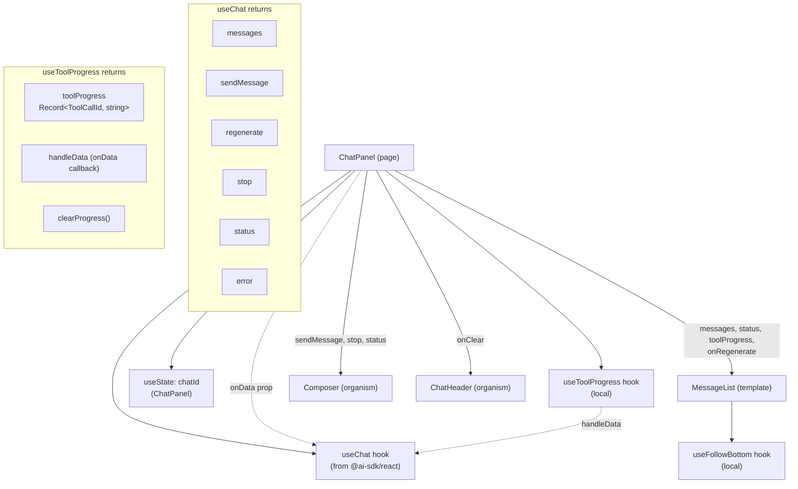
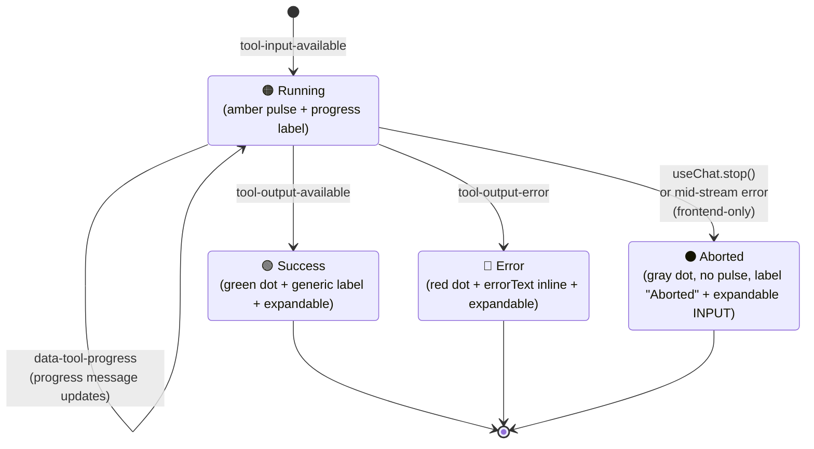
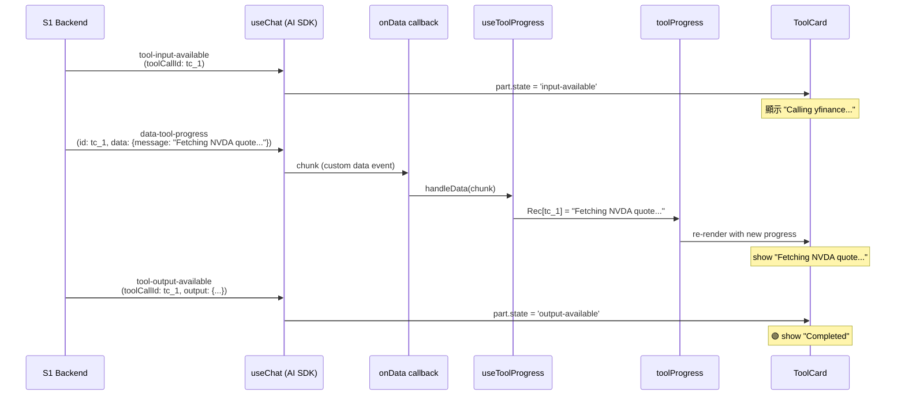
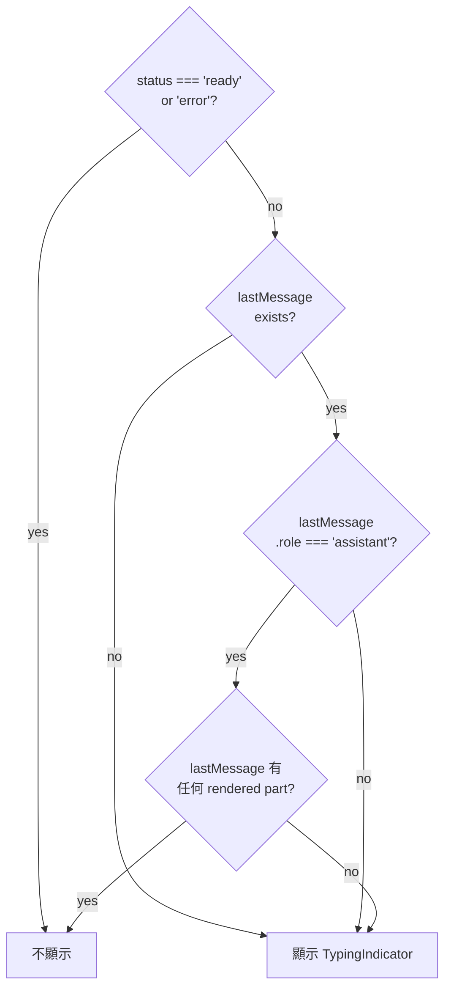
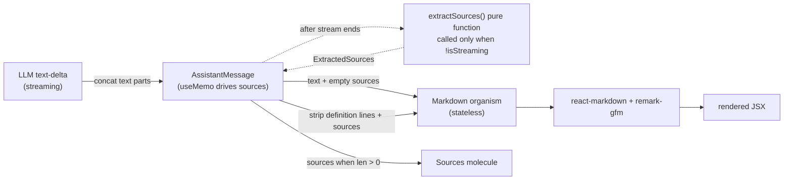
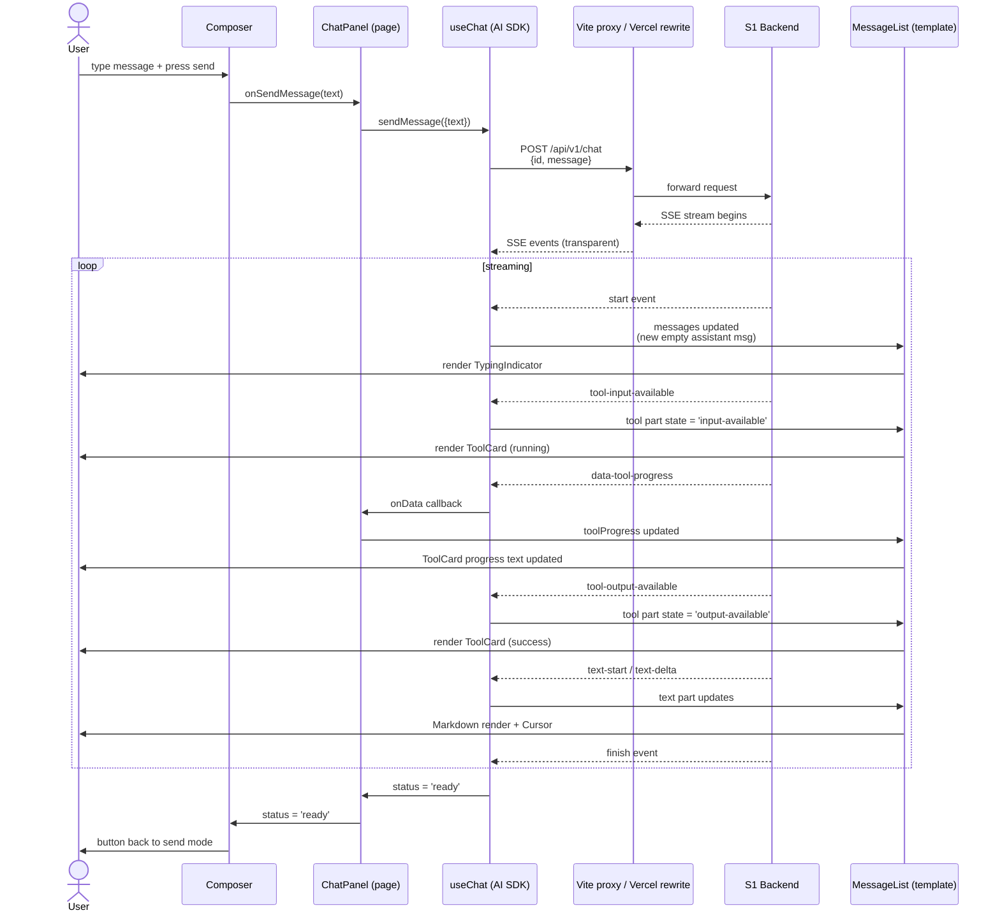
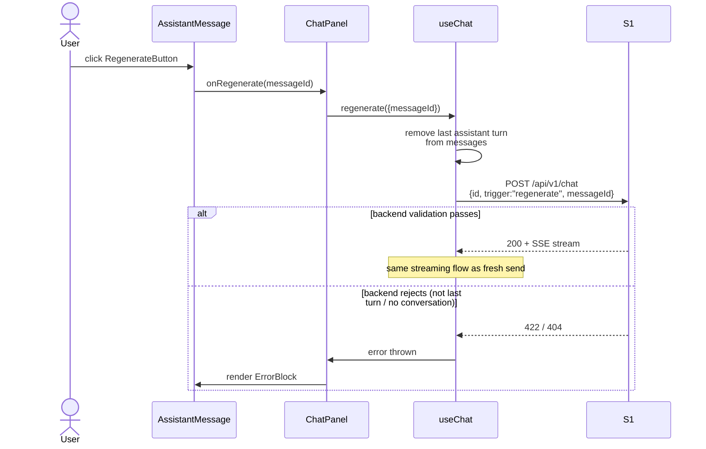
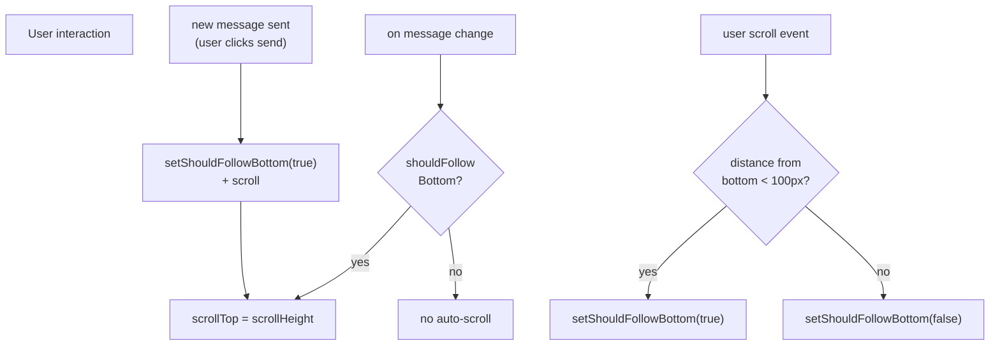

# S3 Streaming Chat UI — Design Document

> S3 subsystem design。定義 streaming chat UI 的元件架構、狀態管理、SSE event 整合策略、與視覺主題系統。
> 基於已 lock 的 S1 backend（已 align AI SDK v6 wire format）與 S2 frontend scaffold。
> 供 `implementation-planning` skill 作為輸入。

---

## 背景

FinLab-X V1 streaming chat 採 subsystem-first 分解：

| Subsystem | 職責 | 狀態 |
|---|---|---|
| **S1** Backend Streaming | `Orchestrator.astream_run()` + FastAPI SSE endpoint | ✅ 已完成 |
| **S2** Frontend Scaffold | 前端基礎建設（Vite + React + Tailwind v4 + shadcn/ui + Vitest + Playwright）| ✅ 已完成 |
| **S3** Streaming Chat UI（本文件） | `useChat` 整合 + chat UI 元件 + streaming event handling | ⚠️ 設計中 |

### 實作基準點

- S1 endpoint：`POST /api/v1/chat`，header `x-vercel-ai-ui-message-stream: v1`，wire format 已對齊 AI SDK v6 `uiMessageChunkSchema`
- S1 支援 `trigger: "regenerate"` + `messageId`，內部 `_find_regenerate_target()` 僅允許重生最後一個 assistant turn
- S2 stack：`ai@^6.0.142` + `@ai-sdk/react@^3.0.144` + Tailwind CSS v4 + shadcn/ui (`radix-nova` style, `neutral` base) + Vitest + Playwright
- S2 目前只有 placeholder App shell，尚未安裝 `react-markdown`、`remark-gfm`、字型 npm package

---

## Scope

### S3 包含

1. `useChat` hook 整合 + `DefaultChatTransport` 配置
2. Chat UI 完整元件集（按 Atomic Design 5 層拆分）
3. Streaming SSE event handling（text delta、tool call lifecycle、tool progress、stream error）
4. Markdown rendering（`react-markdown` + `remark-gfm` + custom reference extraction plugin）
5. Reference sources block（從 markdown AST 抽取、fallback title → hostname）— **依賴 backend system prompt 更新**：要求 LLM 在 markdown reference definition 中使用 `[label]: url "title"` 格式並附上 title attribute，否則 Sources block 只能 fallback 到 hostname 顯示。此 coordination point 詳見後文〈Backend Coordination Points〉章節。
6. 主題系統 CSS variables 設定（`.dark` scope、oklch 色彩空間）
7. Vite dev proxy + `vercel.json` production rewrites
8. Unit / component / integration test strategy

### S3 不包含（Out of Scope）

- Multi-session UI（V2）
- Session history fetch / restore（V2）
- Authentication / API key middleware（V2）
- Light theme / theme toggle（V2，CSS 保留 `:root` shadcn 預設 light values 供未來用）
- Tool output summary（V2，需 backend 補強 progress event 約定）
- New content indicator pill（「↓ N new messages」，V2）
- Mobile / small screen responsive（V2，V1 設計以 desktop 為主）
- Backend 任何變更（唯一例外：system prompt 補 reference title，屬於協調點）

---

## 設計決策 (Q1–Q12)

| #   | 主題                           | 決策                                                                                                                     | 理由                                                                                                                                        |
| --- | ---------------------------- | ---------------------------------------------------------------------------------------------------------------------- | ----------------------------------------------------------------------------------------------------------------------------------------- |
| Q1  | Send/Stop button 切換          | streaming 中 send button → stop button 切換                                                                               | ChatGPT / Claude.ai 標準 pattern，textarea 保留可繼續輸入                                                                                           |
| Q2  | chatId 生命週期                  | 純記憶體 UUID，refresh = 新對話                                                                                                | 避免「UI 清空但 backend 記得舊 context」的 broken UX，V1 scope                                                                                        |
| Q3  | Markdown rendering           | `react-markdown` + `remark-gfm` + superscript inline reference + Sources block extraction                              | reference link format 的必要前置條件、對齊 backend commit `7f505be`                                                                                 |
| Q4  | Regenerate 觸發點               | 最後一條 assistant message 底部 ghost button + error block retry                                                             | backend `_find_regenerate_target()` 實作上僅允許最後 turn                                                                                         |
| Q5  | Empty state                  | Welcome card + 4 英文 prompt chips、點擊填入 input（不自動送出）                                                                     | 金融領域專屬工具，user 需要 onboarding 示範能力範圍                                                                                                        |
| Q6  | 主題系統                         | `.dark` scope CSS variables + hardcoded `<html class="dark">` + `--primary` deep CTA blue                              | 保留 shadcn light theme 結構、未來 toggle 零成本                                                                                                    |
| Q7  | API endpoint 整合              | Vite dev proxy + Vercel prod rewrites，backend 無 CORS                                                                   | Same-origin for all envs，無 allowlist 維護成本                                                                                                 |
| Q8  | Tool card 狀態                 | `useState<Record<ToolCallId, ToolProgressMessage>>` 存 transient progress + `onData` callback，V1 無 summary，預設 collapsed | AI SDK `ToolUIPart.state`（`input-available` / `output-available` / `output-error`）為 SoT，progress 是 transient sidecar（不進 `messages` array） |
| Q9  | Auto-scroll                  | Follow-the-bottom smart tracking（100px threshold）                                                                      | User 主動滾到上面看歷史時不打斷                                                                                                                        |
| Q10 | 字型                           | Inter + JetBrains Mono + Noto Sans TC                                                                                  | Latin/Mono/CJK 分工、browser font fallback 自動 per-character                                                                                  |
| Q11 | 元件架構                         | Atomic Design 5 層（atoms/molecules/organisms/templates/pages）扁平放在 `src/components/` 下 + 單檔 `models.ts`                  | V1 只有 chat 一個 feature，不引入 `features/` 抽象；binary rule 避免 bikeshedding                                                                      |
| Q12 | Loading / Thinking indicator | `TypingIndicator` atom（3 pulsing dots）by MessageList template                                                          | State storyboard 既有設計，S1 submitted → 第一個 SSE chunk 之間的視覺佔位。**無 initial page loader / skeleton** — EmptyState 立刻渲染（無 async init）           |

---

## Architecture Overview

### Atomic Design 5-Layer Composition

```mermaid
flowchart BT
    %% Primitives (shadcn raw, outside atomic 5 layer)
    ShadcnButton["Button<br/>primitive"]
    ShadcnTextarea["Textarea<br/>primitive"]
    ShadcnScrollArea["ScrollArea<br/>primitive"]
    ShadcnCollapsible["Collapsible<br/>primitive"]
    ShadcnEmpty["Empty<br/>primitive"]
    ShadcnAlert["Alert<br/>primitive"]
    ShadcnBadge["Badge<br/>primitive"]

    %% Primitives from lucide-react (aggregated as one node)
    LucideIcons["lucide-react icons<br/>(AlertCircle, ExternalLink,<br/>RefreshCw, ChevronRight, ...)<br/>primitive"]

    %% Atoms (own hand-coded + trivial primitive wrappers)
    StatusDot["StatusDot<br/>atom"]
    RefSup["RefSup<br/>atom"]
    Cursor["Cursor<br/>atom"]
    TypingIndicator["TypingIndicator<br/>atom"]
    PromptChip["PromptChip<br/>atom<br/>(Button + Icon + Text trivial wrapper)"]
    RegenButton["RegenerateButton<br/>atom<br/>(Button + Icon + Text trivial wrapper)"]

    %% Molecules (structural compositions)
    SourceLink["SourceLink<br/>molecule"]
    ToolRow["ToolRow<br/>molecule"]
    ToolDetail["ToolDetail<br/>molecule"]
    UserMessage["UserMessage<br/>molecule"]
    Sources["Sources<br/>molecule"]

    %% Organisms
    ChatHeader["ChatHeader<br/>organism"]
    AssistantMessage["AssistantMessage<br/>organism"]
    ToolCard["ToolCard<br/>organism"]
    Markdown["Markdown<br/>organism"]
    ErrorBlock["ErrorBlock<br/>organism"]
    Composer["Composer<br/>organism"]
    EmptyState["EmptyState<br/>organism"]

    %% Template
    MessageList["MessageList<br/>template"]

    %% Page
    ChatPanel["ChatPanel<br/>page"]

    %% primitives (shadcn) → atoms / molecules / organisms (direct use)
    ShadcnButton --> PromptChip
    ShadcnButton --> RegenButton
    ShadcnButton --> ChatHeader
    ShadcnButton --> Composer
    ShadcnButton --> ErrorBlock

    ShadcnTextarea --> Composer
    ShadcnScrollArea --> MessageList
    ShadcnCollapsible --> ToolCard
    ShadcnEmpty --> EmptyState
    ShadcnAlert --> ErrorBlock
    ShadcnBadge --> ChatHeader
    ShadcnBadge --> SourceLink
    ShadcnBadge --> ToolDetail

    %% primitives (lucide) → atoms / molecules / organisms
    LucideIcons --> PromptChip
    LucideIcons --> RegenButton
    LucideIcons --> SourceLink
    LucideIcons --> ToolRow
    LucideIcons --> ErrorBlock

    %% atoms → molecules / organisms
    StatusDot --> ToolRow
    RefSup --> Markdown
    Cursor --> Markdown

    %% atoms (trivial wrappers) → organisms
    PromptChip --> EmptyState
    RegenButton --> AssistantMessage

    %% molecules → organisms (lower-layer composition)
    ToolRow --> ToolCard
    ToolDetail --> ToolCard
    SourceLink --> Sources

    %% molecules / organisms → AssistantMessage (parts dispatch)
    Sources --> AssistantMessage
    Markdown --> AssistantMessage
    ToolCard --> AssistantMessage
    ErrorBlock --> AssistantMessage

    %% molecules / organisms → template
    UserMessage --> MessageList
    AssistantMessage --> MessageList
    EmptyState --> MessageList
    TypingIndicator --> MessageList

    %% template + remaining organisms → page
    ChatHeader --> ChatPanel
    MessageList --> ChatPanel
    Composer --> ChatPanel

    classDef primitive fill:#f3f4f6,stroke:#6b7280,color:#374151,stroke-dasharray: 5 5
    classDef atom fill:#dbeafe,stroke:#2563eb,color:#1e3a8a
    classDef molecule fill:#fef3c7,stroke:#d97706,color:#78350f
    classDef organism fill:#dcfce7,stroke:#16a34a,color:#14532d
    classDef template fill:#ede9fe,stroke:#7c3aed,color:#4c1d95
    classDef page fill:#fce7f3,stroke:#db2777,color:#831843,stroke-width:3px

    class ShadcnButton,ShadcnTextarea,ShadcnScrollArea,ShadcnCollapsible,ShadcnEmpty,ShadcnAlert,ShadcnBadge,LucideIcons primitive
    class StatusDot,RefSup,Cursor,TypingIndicator,PromptChip,RegenButton atom
    class SourceLink,ToolRow,ToolDetail,UserMessage,Sources molecule
    class ChatHeader,AssistantMessage,ToolCard,Markdown,ErrorBlock,Composer,EmptyState organism
    class MessageList template
    class ChatPanel page
```



**顏色對應**：
- ⬜ **灰色 + 虛線邊框** — primitives（shadcn raw：`Button`、`Textarea`、`ScrollArea`、`Collapsible`、`Empty`、`Alert`、`Badge` + lucide-react icons：`AlertCircle`、`ExternalLink`、`RefreshCw`、`ChevronRight` 等），**在 atomic 5 層之外**
- 🔵 **藍色** — atoms：自家手刻 `StatusDot`、`RefSup`、`Cursor`、`TypingIndicator` + trivial wrappers `PromptChip`、`RegenerateButton`
- 🟡 **黃色** — molecules（`SourceLink`、`ToolRow`、`ToolDetail`、`UserMessage`、`Sources`）
- 🟢 **綠色** — organisms（`ChatHeader`、`AssistantMessage`、`ToolCard`、`Markdown`、`ErrorBlock`、`Composer`、`EmptyState`）
- 🟣 **紫色** — templates（`MessageList`）
- 🩷 **粉色 + 粗邊框** — pages（`ChatPanel`）


### Atomic Level 分類 Rule（避免 bikeshedding）

**六層結構**：primitives → atoms → molecules → organisms → templates → pages

| Level | 判斷標準 | 範例 |
|---|---|---|
| **primitives** _(atomic 5 之外)_ | 外部來源的 raw components，pristine 狀態、**不做任何修改**。兩種物理來源：(1) shadcn CLI 安裝到 `components/primitives/`；(2) `lucide-react` 從 `node_modules` import — 兩者都是 primitives，只是物理位置不同 | shadcn：`Button`、`Textarea`、`ScrollArea`、`Collapsible`、`Empty`、`Alert`、`Badge`<br/>lucide：`AlertCircle`、`ExternalLink`、`RefreshCw`、`ChevronRight`、`BarChart3`、`Newspaper`、`FileText`、`DollarSign` 等 |
| **atoms** | Leaf component 或 **trivial primitive wrapper**。「Trivial wrapper」= primitive + 1–2 個非常簡單的 element（例如 text、icon），屬於單一 inline composition，無結構性分層。也包含純自家手刻的 leaf components | 自家手刻：`StatusDot`、`RefSup`、`Cursor`、`TypingIndicator`<br/>Trivial wrappers：`PromptChip`（Button + Icon + Text）、`RegenerateButton`（Button + Icon + Text） |
| **molecules** | 把 primitive、atom、或兩者做**結構性組合** — 有明顯 layout 結構（多個 rows / columns / sections）或 3+ distinct 子元件構成非 trivial 的排列。**仍無 state/hook/business logic**、純 `(props) => JSX` | `SourceLink`、`ToolRow`、`ToolDetail`、`UserMessage`、`Sources` |
| **organisms** | 有 `useState` / hook / business logic 或「domain-aware」 | `ChatHeader`、`AssistantMessage`、`ToolCard`、`Markdown`、`ErrorBlock`、`Composer`、`EmptyState` |
| **templates** | Layout 骨架、定義結構接受 data props、不 wire useChat | `MessageList` |
| **pages** | Top-level orchestrator、wire useChat + hooks + real data | `ChatPanel` |

### 物理資料夾跟 atomic 層級的關係

```
src/components/
├── primitives/     ← shadcn raw components (primitive layer, physical home for shadcn)
├── atoms/          ← 自家手刻 atoms + trivial primitive wrappers
├── molecules/      ← 結構性組合
├── organisms/      ← stateful / domain-aware
├── templates/      ← layout shell
└── pages/          ← top-level orchestrator

node_modules/lucide-react/    ← lucide icons (primitive layer, physical home for lucide)
```

**為什麼 `components/primitives/` 存在**：shadcn CLI 在 `components.json` 中固定使用這個路徑管理 primitive 檔案，**不可搬到 `atoms/`** — 會破壞 CLI 的 add / update 流程。Lucide icons 則不需要 project 內的資料夾，直接 import from `lucide-react`。兩者物理位置不同，但在 atomic taxonomy 中都是 primitive 層。

---

## Component Responsibilities

> **Folder organization note**：V1 scope 只有 chat 一個 feature，**不引入 `features/` 資料夾抽象**。所有 atomic 層級元件直接放在 `src/components/` 下對應的子資料夾（`atoms/`、`molecules/`、`organisms/`、`templates/`、`pages/`），跟 shadcn 的 `components/primitives/` 同層。未來若新增 `settings` / `history` 等 feature，再評估是否重構到 `features/` 結構。

### Atoms (`components/atoms/`)

| Component | 責任 | 類型 | 組成 / Props 介面 |
|---|---|---|---|
| `StatusDot` | 顯示 tool 狀態彩點（running pulse / success / error） | 自家手刻 leaf | `{ state: 'running' \| 'success' \| 'error' }` |
| `RefSup` | 顯示 inline superscript reference 連結，點擊跳轉到 Sources block 對應條目 | 自家手刻 leaf | `{ label: string; href: string }` |
| `Cursor` | Streaming 時 markdown block 之後的 blinking cursor（V1 為 block-level placement — `<Markdown>` 的 sibling 渲染，**非** inline at text end；user 已接受視覺差異，simplicity over fidelity）| 自家手刻 leaf | `{}`（無 props，純裝飾）|
| `TypingIndicator` | 三個 pulsing dots，顯示於 thinking 狀態 | 自家手刻 leaf | `{}` |
| `PromptChip` | EmptyState 的單一 suggested prompt button | Trivial wrapper | shadcn `Button` primitive + lucide icon primitive（`BarChart3` / `Newspaper` / `FileText` / `DollarSign`）+ text label 的 inline composition。Props: `{ icon, text, onClick }` |
| `RegenerateButton` | Assistant message 底部的「重新生成」ghost button | Trivial wrapper | shadcn `Button` primitive（ghost variant）+ lucide `RefreshCw` primitive + text label 的 inline composition。Props: `{ onRegenerate }` |

### Molecules (`components/molecules/`)

| Component | 責任 | 組成 |
|---|---|---|
| `SourceLink` | Sources block 的單行連結（num + title + arrow） | shadcn `Badge` primitive（outline variant, 用於 num "1"/"2"）+ lucide `ExternalLink` primitive + `<a>` wrapper + title span — 多元件結構性排列 |
| `ToolRow` | Tool card 的 collapsed row（dot + label + name + toggle） | `StatusDot` atom + multi-label text + tool name + lucide `ChevronRight` primitive — 多區塊 horizontal layout |
| `ToolDetail` | Tool card 展開時的 INPUT / OUTPUT JSON 區塊 | 多組 `Badge` primitive（outline, small uppercase, 用於 "INPUT"/"OUTPUT" labels）+ `<pre>` with mono font — vertical stack of label/value pairs |
| `UserMessage` | 右靠齊 user bubble（純 render，props 接受 `{ content: string }`） | bubble container + text content 的結構性組合，無 state / hook |
| `Sources` | SOURCES 標題 + 連結列表（純 render，props 接受 `ExtractedSources`） | 標題 section + `SourceLink` molecule 列表的 vertical stack |

**每個 molecule 都是結構性組合**：都有明顯的 multi-element layout（非 trivial wrapper），無 state / hook / business logic。

### Organisms (`components/organisms/`)

| Component                          | 責任                                                                                 | Primitives / atoms used                                                                         | 內部 state / 依賴                                                                   |
| ---------------------------------- | ---------------------------------------------------------------------------------- | ----------------------------------------------------------------------------------------------- | ------------------------------------------------------------------------------- |
| `ChatHeader`       | 品牌標題 +「v1」tag + `"Clear conversation"` button（empty state 時 disabled）                  | `Button`、`Badge`                                                                                | 無 state，props 接受 `onClear`                                                      |
| `AssistantMessage` | 文字（Markdown）+ tool cards + sources + error block + regenerate button               | 使用 `Markdown` / `ToolCard` / `ErrorBlock` organisms + `Sources` molecule + `RegenerateButton` atom | domain-aware：走訪 `UIMessage.parts` 分派到對應子元件。Props 接 AI SDK `UIMessage` + `isLast` + `toolProgress` + callbacks |
| `ToolCard`         | **4** 狀態 card（running/success/error/**aborted**）+ expand/collapse toggle             | `Collapsible`（Trigger + Content）                                                                | 讀 `part.state` 為主要 SoT，加上 ChatPanel 提供的 `abortedSet: Set<ToolCallId>` 作為 frontend-only override（state 為 `input-available` 且 `abortedSet.has(toolCallId)` 時 render 為 aborted）；expand/collapse state 由 `Collapsible` 管理 |
| `Markdown`         | react-markdown wrapper + custom `RefSup` / `Cursor` renderer + reference plugin 呼叫 | —                                                                                               | 無 state，但有 computational pipeline                                               |
| `ErrorBlock`                       | Stream error 獨立 message card + retry button + **errorText > 200 字元時截斷 + 展開**     | `Alert`（variant=destructive、`AlertTitle`、`AlertDescription`）、`Button`、lucide `AlertCircle` icon | `useState` for expand/collapse 截斷文字；props 接受 `{ errorText, errorClass?, onRetry }`，由 `errorClass` 決定 friendly mapping |
| `Composer`                         | Textarea + send/stop button toggle + disclaimer                                    | `Textarea`、`Button`                                                                             | `useState` for textarea value；V1 採 `forwardRef` + `useImperativeHandle` 暴露 `setValue` ref API 給 ChatPanel 處理 prompt chip click（user 已接受偏離 props-only 模式 — 替代方案是把 textarea state 上提到 ChatPanel，但會讓 ChatPanel 過度集中）|
| `EmptyState`                       | Welcome card + 4 prompt chips                                                      | `Empty`（`EmptyHeader`、`EmptyTitle`、`EmptyDescription`、`EmptyContent`）                           | 無 state，props 接受 `onPickPrompt(text)`                                           |

**ToolCard state simplification**：採用 shadcn `Collapsible` 後，不再需要 `useState<boolean>` 管 expand/collapse — `Collapsible` 內部處理 state + 原生 ARIA 支援。這讓 ToolCard 的 state 更 lean：唯一的 state 來源是 AI SDK 的 `part.state`。

### Templates (`components/templates/`)

| Component | 責任 | Primitives / atoms used | 備註 |
|---|---|---|---|
| `MessageList` | 可 scroll messages viewport + 訊息迭代 + follow-bottom 行為 + 處理 `TypingIndicator` 的 phantom slot | `ScrollArea`（+ `ScrollBar`） | 用 `useFollowBottom(ref)` hook，props 接 `messages / status / toolProgress / callbacks`。**完全不知道 useChat 存在**，以便 mock data 獨立測試。`ScrollArea` 提供 cross-platform 一致 styled scrollbar，hook 透過 `ref` 讀取 scroll position 做 follow-bottom 判斷 |

### Pages (`components/pages/`)

| Component | 責任 | 內部 hooks |
|---|---|---|
| `ChatPanel` | Top-level orchestrator、掛 `useChat`、wire 所有 data 到子元件、管理 `chatId` 生命週期 | `useChat({ transport, id })`、`useToolProgress()`、`useState<ChatId>(() => crypto.randomUUID())` |

---

## Shadcn Primitives Usage

> Shadcn primitives 構成 **primitive layer**（在 atomic 5 層之外）。它們是 pristine 狀態的 raw components，由 atoms / molecules / organisms 直接使用。本章節說明採用策略、不可變性原則、具體列表、以及視覺落差處理。

### 原則

優先使用 **shadcn/ui** 提供的 built-in primitives 來取代手刻元件，理由：

1. **Accessibility 原生支援**：shadcn primitives 基於 `@radix-ui/*` 實作，原生提供 ARIA、keyboard navigation、focus management，手刻容易遺漏
2. **一致的設計 token 整合**：shadcn primitives 預設使用 `--primary`、`--background`、`--border` 等 CSS variables — 跟我們的 `.dark` scope 主題系統天然對齊
3. **減少手刻 surface area**：能刪除就刪除、能沿用就沿用；手刻元件的 maintenance 成本長期比 adopt primitive 高
4. **Copy-paste model**：shadcn 不是 library，CLI 把 source code 複製到 `components/primitives/`，可以自由客製而不會有 library version lock-in 問題

### Primitive Immutability 原則

**`components/primitives/` 內的 shadcn 檔案必須保持 pristine**，不直接修改它們。理由：

- Primitive 是「shadcn CLI 管理的原始狀態」，未來 `pnpm dlx shadcn@latest add` 升級時會覆寫檔案，手動修改會丟失
- Primitive 是「理論上與 shadcn 上游同步的 single source of truth」，手動改會造成 divergence 無法追蹤

**需要客製化時，wrap 在上層 atom / molecule**：

```
Primitive 層 (pristine)            →  自家 Wrapper 層 (客製化)
──────────────────────              ──────────────────────────
components/primitives/Button.tsx   →  components/atoms/PrimaryCTA.tsx
                                       ↓
                                       import { Button } from '@/components/primitives/button'
                                       export const PrimaryCTA = (props) => (
                                         <Button
                                           variant="default"
                                           className="h-11 rounded-xl shadow-lg"
                                           {...props}
                                         />
                                       )
```

客製化的三種層級（由輕到重）：

1. **ClassName override** — 直接在 consumer 傳 `className`，Tailwind 覆蓋樣式。**首選**。
2. **Atom wrapper** — 固定 variant + default className + 專用 props，wrap 在 `components/atoms/`。當某個樣式組合被**多處重複使用**時採用。
3. **客製化 CSS variable** — 在 `.dark` scope 新增專用 variable 讓 primitive 讀取。當要改的是**所有 primitive 共用的 token**（例如主色）時採用。

**禁止**：直接編輯 `components/primitives/*.tsx` 內的樣式或結構。

### 採用列表

| Shadcn Primitive | 用在哪個 organism / template | 取代什麼 | 備註 |
|---|---|---|---|
| `Button` | ChatHeader、Composer、ErrorBlock + atoms `PromptChip` / `RegenerateButton` | 手刻 button 元素 | S2 已既有 |
| `Textarea` | Composer | 手刻 `<textarea>` | Auto-resize、focus styles 原生 |
| `ScrollArea`（+ `ScrollBar`）| MessageList template | 手刻 `overflow-auto` + 自訂 scrollbar CSS | Cross-platform 一致 styled scrollbar |
| `Collapsible`（Trigger + Content）| ToolCard | 手刻 `useState<boolean>` + 條件渲染 + chevron transform | 原生 keyboard / ARIA，`data-state` attribute 驅動 CSS transform |
| `Empty`（Header + Title + Description + Content）| EmptyState | 手刻 `HeroText` molecule + centered flex layout | 標準 empty state pattern，slot 式 composition |
| `Alert`（+ `AlertTitle`、`AlertDescription`）| ErrorBlock | 手刻 `ErrorHeader` molecule + 手刻 error card container | `variant="destructive"` 直接對應紅色 error 樣式 |
| `Badge` | ChatHeader 的「v1」tag、`SourceLink` molecule 的 num badge、`ToolDetail` molecule 的 INPUT/OUTPUT label | 手刻 span with className | Variant system 一致 |

### 故意不採用的 shadcn primitives

| Primitive | 原因 |
|---|---|
| `Skeleton` | S3 的 loading state 用特殊 `TypingIndicator`（3 pulsing dots），不是通用 skeleton bar |
| `Card` | ToolCard 有自己的 `Collapsible`-based state machine，包 Card 多一層嵌套無收益 |
| `Separator` | Sources block 內部 divider 直接用 border 更輕量 |
| `Tooltip` | V1 不做 hover 提示（RegenerateButton / ClearButton 的 label 已直接顯示文字），V2 再考慮 |
| `Dialog` / `Sheet` / `Popover` / `Drawer` | V1 無 modal / overlay 需求 |
| `Avatar` | V1 messages 無 avatar 設計 |

### 視覺落差與處理

| 元件 | 潛在落差 | 處理 |
|---|---|---|
| `EmptyState` 的 `EmptyTitle` | shadcn 預設 font size 較小，mockup 要 28px bold | 用 `className="text-[28px] font-bold tracking-tight"` override |
| `EmptyState` 的「What would you like to know?」 | `Empty` 沒有直接對應 slot | 放在 `EmptyContent` 的 prompt chips 之前作為自訂 `<p>` child（`Empty` children 是 loose composition） |
| `ErrorBlock` 的 icon | mockup 是填滿圓 + "!"，shadcn 慣用 lucide outline icon | 採用 lucide-react `AlertCircle` 作為 Alert children，視覺差異極小 |

兩個落差都可以用 className override 或 children composition 補平，不會跟現有 mockup 設計稿產生大分歧。

---

## State Management Architecture

### State 所有權分配



### 三個狀態來源的責任

| State | 擁有者 | 責任邊界 |
| --- | --- | --- |
| `messages`、`status`、`error`、`sendMessage`、`regenerate`、`stop`、`id` | `useChat` hook | AI SDK 全權管理 SSE lifecycle、message reconciliation、tool part state |
| `toolProgress: Record<ToolCallId, ToolProgressMessage>` | `useToolProgress` hook（內部 `useState`） | 訂閱 `useChat.onData` callback，當 `data-tool-progress` 事件到達時更新對應 tool call 的 progress message |
| `chatId: ChatId` | ChatPanel 的 `useState` | 初始化時 `crypto.randomUUID()`，`"Clear conversation"` 時重新 generate → 觸發 useChat 重 mount（改 id prop） |
| `shouldFollowBottom: boolean`、`containerRef` | `useFollowBottom` hook（內部 `useState` + `useRef`） | MessageList scroll 行為偵測，無外部依賴 |

### 為什麼 ChatPanel 還需要自己的 `useState<ChatId>`

`useChat` 的 return value **確實包含 `id` field**（AI SDK v6 官方 API：`{ id, messages, status, error, sendMessage, regenerate, stop, ... }`）。但 **`id` 是 read-only**，沒有對應的 `setId` — 它只是回傳 caller 傳進去的 `id` prop（或 auto-generated id 如果沒傳）。

為了實作 `"Clear conversation"` reset 功能，**必須從外部改 id prop 觸發 useChat 內部 reset**。具體流程：

1. ChatPanel 用 `useState<ChatId>(() => crypto.randomUUID())` 擁有 id 生命週期
2. 把這個 state 傳給 `useChat({ id: chatId })` 作為 prop
3. `"Clear conversation"` 時 `setChatId(crypto.randomUUID())` → useChat 看到 id prop 改變 → 重置內部 messages

如果讓 useChat auto-generate id，我們就**失去 reset 控制權**（沒有方式主動換 id）。所以 ChatPanel 擁有 chatId state 是正確設計。

### 為什麼 `toolProgress` 用 `useState<Record>` 而不是 `useState<Map>` 或 `useReducer`

- **Record vs Map**：`Record<ToolCallId, string>` 比 `Map<...>` 更符合 React 慣例 — 更新用 spread operator `{ ...prev, [id]: msg }`，reset 用 `{}`，JSON-serializable 方便 debugging。Map 需要 `new Map(prev).set(id, msg)` 模板化寫法，額外的 constructor cost 跟 verbose 沒有對應收益
- **為什麼不用 `useReducer`**：useReducer 適合複雜 state 轉換 + 多 action types + 需要 colocate dispatcher logic 的場景。我們的 hook 只有 2 個 operations（`setProgress(id, msg)`、`clearProgress()`），用 reducer + action types 的 boilerplate 是過度工程。useState 的兩個 setter function 就足夠，且 hook API 對外暴露的 surface 更小更清晰

### `"Clear conversation"` 的觸發機制

User 點擊 `ChatHeader` 的 `"Clear conversation"` button：

1. `ChatPanel` 執行 `setChatId(crypto.randomUUID())`
2. 新 chatId 傳給 `useChat({ id: newChatId })` — AI SDK v6 的 `useChat` 看到 id 改變會 reset 內部 state（messages 清空）
3. `ChatPanel` **顯式呼叫** `useToolProgress` 暴露的 `clearProgress()` 方法清空 `toolProgress`
4. UI 回到 empty state（`messages.length === 0`）

**設計決策**：`useToolProgress` hook 不訂閱 `chatId` — 它保持 stateless（不知道 chatId 存在），reset 由 ChatPanel 這個 orchestrator 顯式觸發。這避免了 hook 內部 `useEffect` 監聽 chatId 的隱式副作用，讓「何時 clear」的控制權統一留在 page 層。

**Note**：這個 reset 不通知 backend — S1 的 SQLite checkpointer 會留存舊 chatId 的 conversation，但因為新的 request 都用新 chatId，舊資料會被閒置。V2 再做 backend cleanup endpoint 或 TTL。

---

## Streaming Event Handling

### SSE Event → ToolUIPart State 對應

S1 wire format（已 align AI SDK v6 `uiMessageChunkSchema`）→ AI SDK 內部 → UI render：

| S1 SSE event type | AI SDK `ToolUIPart.state` | UI 表現 |
|---|---|---|
| `tool-input-available` | `input-available` | 🟠 StatusDot running + `toolProgress` or `Calling {toolName}...` |
| `data-tool-progress` (transient) | — (sidecar state) | 更新 `toolProgress[toolCallId] = progressMessage`，觸發 ToolCard re-render |
| `tool-output-available` | `output-available` | 🟢 StatusDot success + 可展開 INPUT/OUTPUT JSON |
| `tool-output-error` | `output-error` | 🔴 StatusDot error + inline **friendly translated title**（透過 `lib/error-messages.ts`，不直接顯示 backend rawMessage）+ 可展開查看 INPUT JSON 與 raw error detail |
| `text-start` / `text-delta` / `text-end` | text part streaming | Markdown incremental re-render + trailing `Cursor` during streaming |
| `error` | stream-level error | 獨立 `ErrorBlock` message 顯示 **friendly translated title** + retry button（依 friendly mapping 決定 retriable）+ 可展開查看 raw detail |
| `finish` | — | `status` 轉為 `ready` |
| _(no SSE — frontend-only)_ | `aborted` (S3 擴充) | ⚫ StatusDot 灰色 + label `"Aborted"` + 仍可展開 INPUT；由 `useChat.stop()` 或 mid-stream `error` 在 tool 仍 `input-available` 時觸發，**不對應任何 backend SSE event** |

**Note on `text-start` / `text-end`**：AI SDK 內部消費這兩個 event 來管理 text part 的 lifecycle，S3 不直接響應它們 — UI 只 react to `messages` array 中 text part 的 `text` 欄位內容變化（react-markdown 每次 re-render 即可）。

**Note on `aborted` state**：AI SDK v6 `ToolUIPart.state` enum 不包含 `aborted`，但 S3 在 frontend 自行擴充第 4 個視覺狀態（依 BDD discovery 階段 Q-USR-3 決議）。當 user `stop()` 或 mid-stream `error` 發生時，若有 tool 仍處於 `input-available`，frontend 必須將該 tool 視覺標記為 aborted（**不可繼續顯示 pulsing**，否則暗示「仍在進行」會誤導 user）。實作上可在 ChatPanel 維護 `Set<ToolCallId>` 記錄哪些 toolCallId 被中止，AssistantMessage 在 dispatch 時若 `part.state === 'input-available'` 且 `abortedSet.has(part.toolCallId)` 則 render 為 aborted 視覺。

### Error 路徑雙通道

ErrorBlock 會被兩種錯誤來源觸發，S3 設計上**兩者都渲染為同一個 ErrorBlock organism**：

| 錯誤來源 | HTTP/SSE 階段 | AI SDK 表面 | 觸發 |
|---|---|---|---|
| **Pre-stream HTTP error** | SSE 還沒開始就被 backend 拒絕（`422` regenerate 驗證失敗、`404` conversation 不存在、`409` session busy、`500` internal）| `useChat().error` field 被 set | `ChatPanel` 讀 `error` state → 傳給 MessageList 渲染 ErrorBlock |
| **Mid-stream SSE error** | Stream 進行中收到 `error` event（orchestrator 拋 exception、sanitized 後發出 `StreamError`）| `useChat` 把 `error` part append 到 last assistant message | `AssistantMessage` 偵測 `error` part → 內嵌 ErrorBlock 在 message 內 |

### UI String Language Policy（V1 決議：English-only）

**V1 policy**：所有 frontend-controlled user-facing strings 統一為 **English**。無 bilingual mix、無 i18n framework。對齊 Q5 empty state 英文 prompt chips 決策，並避免同 viewport 內的語言不一致。

此 policy 涵蓋：placeholder、button label、disclaimer、tool state label、error title、welcome text、prompt chip text、所有 `aria-label` / `aria-description`。

#### Canonical UI string table（frontend-controlled，全部為 hardcoded 英文）

| Surface | String |
|---|---|
| Composer textarea `placeholder` | `Ask about markets, companies, or filings...` |
| Composer disclaimer | `AI-generated responses may be inaccurate. Please verify important information.` |
| Composer textarea `aria-label` | `Message input` |
| Composer send button `aria-label` | `Send message` |
| Composer stop button `aria-label` | `Stop response` |
| ChatHeader clear button label + `aria-label` | `Clear conversation` |
| ToolCard generic success label | `Completed` |
| ToolCard aborted label | `Aborted` |
| ToolCard initial running label（無 progress message 時）| `Calling {toolName}...` |
| ToolCard expand button `aria-label` | `Toggle tool details` |
| EmptyState welcome title | `What would you like to know?` |
| EmptyState prompt chips（4 個，per Q5）| `Latest market news for NVDA` / `Show AAPL stock quote` / `Compare NVDA and AMD financials` / `Summarize the latest 10-K of MSFT` |
| RegenerateButton label + `aria-label` | `Regenerate response` |
| ErrorBlock retry button `aria-label` | `Retry` |
| Friendly error titles | 見下方 Friendly Mapping 表（`lib/error-messages.ts` 統一翻譯）|

#### Exceptions — backend-provided strings（frontend 原樣顯示）

- `data-tool-progress` 的 `message` field：由 backend 決定語言，frontend 直接顯示。例如 backend 可能送 `"Fetching stock quote for NVDA..."` 或任何 language — frontend 不翻譯。
- Assistant message body text（`text-delta`）：LLM 依 user prompt 語言決定。
- Tool output JSON：backend raw，frontend 原樣顯示在 ToolDetail。
- Backend raw error message（`rawMessage`）：**不直接渲染**，必須走 `lib/error-messages.ts` 翻譯為 English friendly title；raw message 只出現在可展開的「Show details」block。

#### Rationale

1. **Consistency**：mixed-language UI 在同 viewport 內會造成 visual noise，英文 chrome + LLM-driven content 是目前最清楚的分界。
2. **Error stability**：error messages 與 backend technical terms（HTTP status、tool names、error classes）對齊時，英文更穩定、不需額外 mapping 維護。
3. **Onboarding alignment**：Q5 已鎖定 empty state 為英文 prompt chips，若 placeholder / disclaimer / clear button 為繁中會跟 chip 風格不一致。
4. **V2 scope**：i18n framework（zh-TW / English toggle）留給 V2，目前 hardcode 英文無 migration cost。

---

### Error 顯示文字策略：Friendly 翻譯 + Technical Detail 隱藏（Q-USR-4 + Q-USR-6）

**核心原則**：所有顯示給 user 的錯誤文字都必須是 **user-friendly English**（對齊上方 UI String Language Policy），**不直接顯示 backend technical message**（例如 `"API rate limit exceeded"`、`"context length exceeded"`、`"ECONNRESET"`）。Backend 的原始 message 只在「Show details」中作為 technical detail 顯示，給能 debug 的 user 參考。

#### 翻譯機制 — `lib/error-messages.ts`

集中一個 frontend pure function library 把 raw error 轉成 friendly text：

```typescript
// frontend/src/lib/error-messages.ts
type ErrorContext = {
  source: 'pre-stream-http' | 'mid-stream-sse' | 'tool-output-error' | 'network';
  status?: number;        // for pre-stream-http
  rawMessage?: string;    // backend's original errorText
};

type FriendlyError = {
  title: string;          // 標題（顯示於 inline / ErrorBlock 主文字）
  detail?: string;        // 完整 backend message，給 expand 用
  retriable: boolean;     // 是否顯示 Retry button
};

export function toFriendlyError(ctx: ErrorContext): FriendlyError;
```

#### Friendly Mapping 表

V1 UI 為英文（對齊 Q5 的「英文 prompt chips」決策），所有 user-facing error text 均為 **user-friendly English**。語氣原則：calm、clear、actionable，第一句陳述問題、第二句給 user 下一步動作。

| 錯誤來源 | 條件 | 顯示文字 (`title`) | retriable |
|---|---|---|---|
| `pre-stream-http` | `status === 422` | Couldn't regenerate that message. Please try again. | ✅ |
| `pre-stream-http` | `status === 404` | Conversation not found. Refresh to start a new one. | ❌（refresh 即可）|
| `pre-stream-http` | `status === 409` | The system is busy. Please try again in a moment. | ✅ |
| `pre-stream-http` | `status === 500` | Server error. Please try again. | ✅ |
| `pre-stream-http` | other 5xx / unknown | Something went wrong. Please try again. | ✅ |
| `network` | `fetch` TypeError | Connection lost. Check your network and try again. | ✅ |
| `tool-output-error` | `rawMessage` matches `/rate limit/i` | Too many requests. Please wait a moment and try again. | ✅ |
| `tool-output-error` | `rawMessage` matches `/not found\|404/i` | We couldn't find that data. | ❌ |
| `tool-output-error` | `rawMessage` matches `/timeout/i` | The tool timed out. Please try again. | ✅ |
| `tool-output-error` | `rawMessage` matches `/permission\|forbidden\|401\|403/i` | Access denied for this resource. | ❌ |
| `tool-output-error` | other / unknown | The tool failed to run. Please try again. | ✅ |
| `mid-stream-sse` | `rawMessage` matches `/context.*length\|context.*overflow\|token.*limit/i` | This conversation is too long. Start a new chat to continue. | ❌ |
| `mid-stream-sse` | `rawMessage` matches `/rate limit/i` | The system is busy. Please try again in a moment. | ✅ |
| `mid-stream-sse` | other / unknown | Something went wrong while generating the response. Please try again. | ✅ |

#### 顯示規則

1. **Inline tool error**（ToolCard 紅色狀態下的錯誤文字）：顯示 `friendly.title`，原始 `rawMessage` 透過 ToolCard 既有的 expand 機制查看（INPUT JSON 區塊旁多一個 `ERROR DETAIL` block）。
2. **ErrorBlock**（pre-stream / mid-stream 共用）：顯示 `friendly.title`；若有 `friendly.detail`（即 `rawMessage` 存在）則加「Show details」toggle 顯示原 message。
3. **Retry button visibility**：依 `friendly.retriable` 決定是否顯示。`404` / `permission denied` / `context overflow` 等不可恢復錯誤不顯示 Retry，避免 user 反覆無效嘗試。
4. **Toggle / button label 用語**：`title` 跟 `detail` 都是英文；對應的 UI affordance label 也是英文 — 「Show details」/「Hide details」、「Retry」、「Refresh」、「Start new chat」。整個 ErrorBlock + ToolCard error inline 沒有任何中文 string。

#### Error text 截斷規則（Q-USR-6）

`friendly.title` 永遠是固定短句（mapping 表內最長 ~60 字元），不需截斷。
`friendly.detail`（從 backend 來的原始 message）若超過 200 字元，截斷顯示前 200 字 + ellipsis + 一個「Show more」toggle。實務上 backend stack trace 可達數 KB，必須截斷避免撐破 layout。

#### 為什麼不依賴 backend 翻譯

S1 backend 已 locked，且金融 tool 的錯誤來自上游 API（yfinance、SEC EDGAR、Bloomberg 等），這些訊息本來就是英文且不可控。讓 frontend 集中翻譯比讓每個 tool 自己處理本地化更實際。Translation library 是 pure function 容易 unit test，未來支援多語系也只需擴充 mapping 表。

### Smart Retry Routing（Q-USR-7）

Retry button 的 onClick 處理：`ChatPanel` 的 `handleRetry` 依錯誤來源 + 類型 dispatch：

| 情境 | Retry action |
|---|---|
| Pre-stream `404` / `409` / `500` / network offline | `sendMessage(originalUserText)` 重送 |
| Pre-stream `422` on regenerate（messageId stale / not last turn）| **降級**為 `sendMessage(originalUserText)` 重送，**避免**再次 `regenerate` 同 messageId 陷入無限 422 loop |
| Mid-stream `error`（last assistant message 已存在含 partial parts）| `regenerate({ messageId: lastAssistantMessageId })` |

實作上 `handleRetry` 必須能取得 `useChat.error` 的 error class 與來源資訊。若 `useChat` v6 的 error 物件不夠豐富，需在 ChatPanel 維護「最近一次 trigger」的 metadata（trigger type + messageId + originalUserText）以支援 dispatch。

### Tool Card State Machine



**4 個視覺狀態 vs 3 個 backend states**：AI SDK 的 `ToolUIPart.state` 只有 3 個 enum（input-available / output-available / output-error），第 4 個 `Aborted` 是 S3 frontend 擴充。Aborted 狀態的進入條件 **不來自任何 SSE event**，而是 user `stop()` 或 mid-stream `error` 發生時，若該 tool 仍在 `input-available`（從未收到 output-available / output-error），frontend 必須把它標記為 aborted。Aborted 跟 OutputAvailable / OutputError 一樣是 terminal — 進入後不再轉換。

**為什麼需要 Aborted state**：若沿用 InputAvailable 視覺，pulsing 會持續暗示「正在執行」，但事實上 backend 已被中止，造成 user 困惑。Aborted 灰色（無 pulse）明確傳達「已停止、未完成」。INPUT JSON 仍可展開供 user 查看當時送了什麼參數。

### onData Callback Flow



### Thinking Indicator Trigger



涵蓋場景：
- User 剛送出 message，status === 'submitted'，沒 assistant message → 顯示
- 收到 `start` 但還沒任何 parts → 顯示
- 第一個 text-delta 或 tool-input-available 到達 → 隱藏
- Tool running 中（assistant message 已有 tool part）→ 隱藏（不跟 tool card 重疊）

---

## Markdown & Sources Pipeline

### Strategy: Defer-to-ready extraction

Sources extraction **不在 streaming 期間執行**。原因：`react-markdown` 不暴露 unified plugin 的 `file.data`，無法讓 custom remark plugin 把 `ExtractedSources` 回傳給 React 層；硬做的話只能在 Markdown organism 內用一個 standalone `extractSources(text)` 純函式「第二次 parse」— 但這會造成 streaming 中每個 text-delta 雙 parse，且迫使 Markdown / AssistantMessage 變成 stateful（違反「AssistantMessage 無 useState」的 organism principle）。

**Defer-to-ready 策略**：`AssistantMessage` 在 `status === 'streaming' && isLast` 時完全不 call `extractSources`；一旦 stream 結束（status 轉 `ready` 或 mid-stream `error` 使 stream 停止），`useMemo` recomputes 觸發**一次性** extraction，把 sources 傳給 `Markdown` organism 作為 prop。這個策略：

- **解掉雙 parse**：streaming 中 react-markdown 只跑一次自己的 parse（掛 `remarkGfm`），完全沒有 standalone `extractSources` 呼叫
- **保持 stateless**：AssistantMessage 的 sources 為 `useMemo` derived value，不是 `useState`；Markdown organism 的 props 多一個 `sources: ExtractedSources`，無 state、無 callback
- **容忍 error / stop**：mid-stream error 與 user stop 都會讓 stream 停下，`useMemo` 會在那一刻對已接收的 partial text 跑一次 extraction，preserve 「partial sources」行為（S-err-05）

代價：**streaming 期間 reference 不是 clickable RefSup**，`[N]` 顯示為純文字字面值，底部 Sources block 不出現，definition 行以 raw markdown 暫時可見於文字末端。stream 結束後一次性升級（pop-in UX，類似 ChatGPT / Claude.ai）。此 UX trade-off 由 user 決議接受。

### Rendering Pipeline



### Streaming phase vs ready phase

| Phase | text shown in Markdown | reference `[N]` | Sources block | Cursor |
|---|---|---|---|---|
| `streaming` | raw `concatenatedText` (含 definition 行) | 純文字 `[N]` | 不渲染 | blinking 於 markdown block 末端 |
| `ready` / error / stop | `displayText`（definition 行已 strip）| clickable `<RefSup>` | 顯示（依 `useMemo` 算出的 sources）| 消失 |

### Reference Link 處理策略

LLM 輸出（backend commit `7f505be` 的 system prompt 格式）：

```markdown
NVDA 宣布擴大 Blackwell 產能 [1]，第二季營收預期優於市場 [2]。

[1]: https://reuters.com/nvda-blackwell-expansion "Reuters: NVIDIA expands Blackwell production"
[2]: https://bloomberg.com/nvda-q2 "Bloomberg: NVDA Q2 revenue beats forecast"
```

`lib/markdown-sources.ts` 的 pure function `extractSources(text: string): ExtractedSources`（**不再是 unified plugin**）負責：

1. **Parse markdown AST**（用 `remark-parse` 或 `mdast-util-from-markdown`）
2. **Visit `definition` nodes**，找出所有 reference-style link definitions
3. **Filter by scheme allowlist**（security critical per Q-USR-11）
4. **First-wins dedup**（per Q-USR-8）
5. **Filter body orphans**（per Q-USR-9）
6. **Sort by numeric label**
7. **Return `ExtractedSources`**：`[{label, url, title, hostname}, ...]`

AssistantMessage 拿到結果後：
- 用 regex `/^\[[0-9]+\]:\s+\S+.*$/gm` strip 掉 `displayText` 中的 definition 行（避免 react-markdown render 成底部純文字列表）
- 把 `displayText` + `sources` 傳給 `<Markdown>`；把 `sources` 傳給 `<Sources>` molecule

`react-markdown` 的 component override（Markdown organism 內部）：

- `<a>` 標籤：如果 `href` 或 children 對應到 prop `sources` 裡的 label，替換為 `<RefSup label={label} href={#src-${label}}>` 元素
- 其他 markdown elements：維持預設或加入專案樣式

### Title Fallback 策略

Sources block 顯示文字優先順序：

1. **Markdown definition title**：`[1]: url "title"` 的引號內容
2. **URL hostname**：從 URL 解析 hostname（例如 `reuters.com`）
3. **URL 截斷顯示**：極端情況 fallback

### Backend Coordination Point

此設計依賴 backend system prompt 要求 LLM 在 reference definition 中**包含 title 屬性**。屬於 S3 對 backend 的協調請求（低成本 prompt 補強），frontend 仍實作 fallback 以保證 robustness。

---

## Theme & Styling System

### 主題策略

採 **A2 策略**：

- `:root` 保留 shadcn 預設 **light theme values**（不刪除，未來加 toggle 時免重構）
- `.dark` scope **覆寫為 mockup dark theme values**
- `index.html` hardcode `<html lang="en" class="dark">` 強制永遠 dark
- V1 無 light/dark toggle，但 CSS 結構為 future-proof

### CSS Variables 完整定義

```css
.dark {
  /* === backgrounds === */
  --background:           oklch(0.1571 0.0081 248.36);   /* body bg */
  --foreground:           oklch(0.9567 0.0052 247.88);   /* primary text */
  --card:                 oklch(0.1918 0.0098 234.36);   /* panel bg */
  --card-foreground:      oklch(0.9567 0.0052 247.88);
  --popover:              oklch(0.1918 0.0098 234.36);
  --popover-foreground:   oklch(0.9567 0.0052 247.88);

  /* === primary action (send button, future Button default) === */
  --primary:              oklch(0.42 0.13 255);          /* deep CTA blue */
  --primary-foreground:   oklch(0.9567 0.0052 247.88);
  --primary-hover:        oklch(0.47 0.135 255);

  /* === secondary surfaces === */
  --secondary:            oklch(0.2914 0.0357 250.70);   /* user bubble hi */
  --secondary-foreground: oklch(0.9567 0.0052 247.88);
  --muted:                oklch(0.2130 0.0144 239.42);   /* header gradient */
  --muted-foreground:     oklch(0.6210 0.0230 248.20);   /* secondary text */
  --accent:               oklch(0.2914 0.0357 250.70);
  --accent-foreground:    oklch(0.9567 0.0052 247.88);

  /* === destructive === */
  --destructive:          oklch(0.7282 0.1610 27.12);
  --destructive-foreground: oklch(0.9567 0.0052 247.88);

  /* === borders / inputs / focus === */
  --border:               oklch(0.9567 0.0052 247.88 / 0.06);
  --input:                oklch(0.9567 0.0052 247.88 / 0.08);
  --ring:                 oklch(0.42 0.13 255 / 0.30);

  /* === chat-specific extensions === */
  --chat-brand-accent:        oklch(0.6425 0.1682 255.13);   /* vivid blue: links, cursor, user bubble border */
  --chat-brand-accent-hover:  oklch(0.7055 0.1403 253.62);

  --status-running:           oklch(0.7677 0.1513 69.88);    /* amber */
  --status-success:           oklch(0.7771 0.1882 154.28);   /* green */
  --status-error:             oklch(0.7282 0.1610 27.12);    /* coral red */
  --status-aborted:           oklch(0.5500 0.0100 250.00);   /* neutral gray (frontend-only state, see ToolCard) */

  --chat-fg-secondary:        oklch(0.8462 0.0100 252.82);   /* between fg and muted-fg */
  --chat-fg-subtle:           oklch(0.4368 0.0253 261.66);   /* tool detail labels */
  --chat-fg-subtler:          oklch(0.3690 0.0159 255.61);   /* disclaimer */
}
```

### 兩個藍的角色分工

| Variable | 值 | 用途 |
|---|---|---|
| `--primary` | `oklch(0.42 0.13 255)` (deep) | Send button bg、未來 shadcn Button default、primary CTA |
| `--chat-brand-accent` | `oklch(0.6425 0.1682 255.13)` (vivid) | User bubble border (alpha 12%)、source link text、streaming cursor |

**設計原則**：vivid 藍只用在「小區域 / 線狀 / alpha」處，是「品牌色存在感」；deep 藍用在「大區塊填充 / CTA button」，是「最專業的主要動作色」。

### Tailwind Class Mapping

| Mockup 元素 | Tailwind class / var |
|---|---|
| Body bg | `bg-background` |
| Panel bg | `bg-card` |
| Primary text | `text-foreground` |
| Secondary text | `text-[var(--chat-fg-secondary)]` |
| Muted text | `text-muted-foreground` |
| Subtle text | `text-[var(--chat-fg-subtle)]` |
| Send button bg | `bg-primary` |
| Send button icon | `text-primary-foreground` |
| User bubble border | `border-[var(--chat-brand-accent)]/[0.12]` |
| Source link | `text-[var(--chat-brand-accent)]` |
| Cursor | `bg-[var(--chat-brand-accent)]` |
| Tool dot running | `bg-[var(--status-running)]` |
| Tool dot success | `bg-[var(--status-success)]` |
| Tool dot error | `bg-[var(--status-error)]` |
| Tool dot aborted | `bg-[var(--status-aborted)]`（無 `animate-pulse` class）|
| Border subtle | `border-border` |
| Input border | `border-input` |

### Font Stack

```css
/* Tailwind v4 theme config */
@theme {
  --font-sans: "Inter Variable", "Noto Sans TC", -apple-system,
               "PingFang TC", "Microsoft JhengHei", system-ui, sans-serif;
  --font-mono: "JetBrains Mono Variable", "Noto Sans TC",
               ui-monospace, "Consolas", "Menlo", monospace;
}
```

- **Inter**：Latin UI text、標題、body
- **JetBrains Mono**：tool name、tool detail JSON code
- **Noto Sans TC**：CJK 繁中字元（browser per-character fallback）
- **Fallback chain**：`-apple-system` / `PingFang TC` / `Microsoft JhengHei` / `system-ui` 保證極端情況下仍有繁中字可用

npm packages 需要安裝（S2 目前只有 Geist，專案 standard 是 **pnpm**，`frontend/pnpm-lock.yaml` 為 single source of truth）：

```bash
# Fonts
pnpm remove @fontsource-variable/geist
pnpm add @fontsource-variable/inter
pnpm add @fontsource-variable/jetbrains-mono
pnpm add @fontsource-variable/noto-sans-tc

# Markdown pipeline + icons
pnpm add react-markdown remark-gfm lucide-react

# Shadcn primitives (CLI copies component source into components/primitives/
# and auto-installs radix-ui peer deps)
pnpm dlx shadcn@latest add textarea scroll-area collapsible empty alert badge
```

---

## Routing & Proxy

### Dev environment — Vite proxy

```typescript
// vite.config.ts
export default defineConfig({
  plugins: [react(), tailwindcss()],
  server: {
    port: 5173,
    strictPort: true,
    proxy: {
      '/api': {
        target: 'http://localhost:8000',
        changeOrigin: true,
      },
    },
  },
  resolve: { alias: { '@': path.resolve(__dirname, './src') } },
});
```

### Production environment — Vercel rewrites

```json
// vercel.json (frontend root)
{
  "rewrites": [
    {
      "source": "/api/:path*",
      "destination": "https://<backend-paas-host>/api/:path*"
    }
  ]
}
```

部署情境：
- **Frontend**：Vercel（靜態 build artifacts）
- **Backend**：Render / Railway / Fly.io 等 PaaS
- **`<backend-paas-host>`**：V1 可 hardcode，V2 用 `${BACKEND_HOST}` env variable 支援 staging/prod

### 關鍵特性

1. **同一份 frontend code** 在 dev / prod / preview 都 fetch relative path `/api/v1/chat`，無 environment-specific 邏輯
2. **Backend 完全不需要 CORS middleware** — browser 永遠是 same-origin
3. **SSE 透明 passthrough**：Vercel rewrites 是 Edge Network 層的 transparent HTTP proxy，無 10 秒 timeout 限制（那是 Vercel function 才有），原生支援 streaming
4. **Preview deployments 自動 work**：Vercel 為每個 PR 產生 unique URL，都透過 rewrites 指向同一個 backend，無 allowlist 維護

### useChat Transport 配置

```typescript
import { DefaultChatTransport } from 'ai';

const transport = new DefaultChatTransport({
  api: '/api/v1/chat',  // 必須 override，預設是 /api/chat
});

const { messages, sendMessage, status, stop, regenerate, error } = useChat({
  transport,
  id: chatId,
  onData: handleToolProgress,  // from useToolProgress hook
});
```

---

## File Structure

```
frontend/src/
├── App.tsx                                      (mounts ChatPanel)
├── main.tsx                                     (entry, existing)
├── index.css                                    (updated: font imports + .dark scope)
├── models.ts                                    ★ NEW: domain types 單檔
├── components/
│   ├── primitives/                              (shadcn, external — pristine, do not edit)
│   │   ├── button.tsx                           (existing)
│   │   ├── textarea.tsx                         ★ NEW (shadcn add)
│   │   ├── scroll-area.tsx                      ★ NEW (shadcn add)
│   │   ├── collapsible.tsx                      ★ NEW (shadcn add)
│   │   ├── empty.tsx                            ★ NEW (shadcn add)
│   │   ├── alert.tsx                            ★ NEW (shadcn add)
│   │   └── badge.tsx                            ★ NEW (shadcn add)
│   ├── atoms/                                   ★ S3 新增 (own + trivial wrappers)
│   │   ├── StatusDot.tsx                        (own leaf)
│   │   ├── RefSup.tsx                           (own leaf)
│   │   ├── Cursor.tsx                           (own leaf)
│   │   ├── TypingIndicator.tsx                  (own leaf)
│   │   ├── PromptChip.tsx                       (trivial wrapper: Button + Icon + Text)
│   │   └── RegenerateButton.tsx                 (trivial wrapper: Button + Icon + Text)
│   ├── molecules/                               ★ S3 新增 (structural compositions, no state)
│   │   ├── SourceLink.tsx                       (Badge + Icon + anchor + title 多元件排列)
│   │   ├── ToolRow.tsx                          (StatusDot + multi-labels + name + Chevron horizontal layout)
│   │   ├── ToolDetail.tsx                       (Badge × N + pre × N vertical stack)
│   │   ├── UserMessage.tsx                      (right-aligned user bubble)
│   │   └── Sources.tsx                          (SOURCES title + SourceLink list)
│   ├── organisms/                               ★ S3 新增
│   │   ├── ChatHeader.tsx                       (uses Button, Badge)
│   │   ├── AssistantMessage.tsx
│   │   ├── ToolCard.tsx                         (uses Collapsible)
│   │   ├── Markdown.tsx
│   │   ├── ErrorBlock.tsx                       (uses Alert, Button, lucide AlertCircle)
│   │   ├── Composer.tsx                         (uses Textarea, Button)
│   │   └── EmptyState.tsx                       (uses Empty)
│   ├── templates/                               ★ S3 新增
│   │   └── MessageList.tsx                      (uses ScrollArea)
│   └── pages/                                   ★ S3 新增
│       └── ChatPanel.tsx
├── hooks/                                       ★ S3 新增
│   ├── useFollowBottom.ts
│   └── useToolProgress.ts
└── lib/                                         ★ S3 新增
    └── markdown-sources.ts                      (remark plugin: reference extraction)
```

**Folder structure 理由**：V1 只有單一 feature（chat），所以不引入 `features/` 抽象 — 所有 atomic 層級的 chat components 直接放 `components/` 下扁平的 atomic 子資料夾（與 `components/primitives/` 同層）。`hooks/` 跟 `lib/` 放在 `src/` top-level。這個結構在 V1 scope 下最簡潔；若未來新增 settings / history 等 feature，再評估是否重構到 `features/{chat,settings,...}` 結構。

### 非 S3 但會更新的既有檔案

| File | 改動 |
|---|---|
| `frontend/package.json` | 新增 `react-markdown`、`remark-gfm`、`lucide-react`、`@fontsource-variable/inter`、`@fontsource-variable/jetbrains-mono`、`@fontsource-variable/noto-sans-tc`；移除 `@fontsource-variable/geist`；經由 shadcn CLI 新增 `@radix-ui/react-collapsible`、`@radix-ui/react-scroll-area` 等 peer deps |
| `frontend/src/index.css` | 更新 font imports、加入 `.dark` scope 完整 CSS variables |
| `frontend/src/App.tsx` | 從 placeholder 改為掛載 `<ChatPanel />` |
| `frontend/index.html` | `<html>` tag 加上 `class="dark"` |
| `frontend/vite.config.ts` | 加入 `server.proxy` 配置 |
| `frontend/vercel.json` | **新建** — production rewrites 配置 |

---

## Models (`src/models.ts`)

所有 domain types 集中單檔管理。V1 scope 不拆分 domain 檔案，未來膨脹（> 300 行或 > 5 個 domain）再拆成 `models/chat.ts` 等。

```typescript
// frontend/src/models.ts
import type { UIMessage } from '@ai-sdk/react';

// === Chat domain ===
export type ChatMessage = UIMessage;
export type ChatRole = 'user' | 'assistant';
// Matches AI SDK v6 `useChat().status` enum exactly.
// Do NOT diverge from this set — the thinking-indicator trigger logic
// depends on `'submitted'` being the pre-stream state.
export type ChatStatus = 'submitted' | 'streaming' | 'ready' | 'error';
export type ChatId = string;

// === Tool call domain ===
export type ToolCallId = string;
export type ToolProgressMessage = string;
export type ToolProgressRecord = Record<ToolCallId, ToolProgressMessage>;
export type ToolUIState =
  | 'input-streaming'      // not used in V1 (S1 sends atomic tool calls)
  | 'input-available'
  | 'output-available'
  | 'output-error';

// === Reference source domain ===
export type SourceRef = {
  label: string;           // "1", "2", ...
  url: string;
  title?: string;          // from markdown def: [1]: url "title"
  hostname: string;        // fallback when title missing
};
export type ExtractedSources = ReadonlyArray<SourceRef>;
```

---

## Data Flow Diagrams

### End-to-End Message Flow



### Regenerate Flow



### Scroll Behavior



---

## Backend Coordination Points

S3 設計依賴 backend 做**兩個協調性改動**（不屬於 backend breaking change）：

### 1. System prompt 補強：reference definition 包含 title

**Why**：Sources block 設計顯示 title（而非 URL），需要 LLM 在 markdown reference definition 語法中附上 title attribute：

```markdown
[1]: https://reuters.com/nvda-blackwell-expansion "Reuters: NVIDIA expands Blackwell production"
```

Markdown spec 原生支援這個 syntax，react-markdown 解析後可從 AST 直接取得。

**How**：Backend 更新 `backend/agent_engine/agents/` 下的 system prompt template，加入一段指令要求 LLM 在引用來源時使用 `[label]: url "title"` 格式。

**Graceful fallback**：S3 的 `Sources` molecule 仍實作 hostname fallback，萬一某次 LLM 漏掉 title，顯示 URL hostname 不至於崩潰。

### 2. V2 預留：`data-tool-progress` 加 summary field

**Why**：V1 的 ToolCard 在 success 狀態只顯示 generic label（`"Completed"`），失去 mockup 中「$135.42 (+2.3%)」的 at-a-glance summary。V2 想做 summary 時，最 clean 的方式是 backend 在 tool completion 時多 emit 一個 progress event：

```json
{
  "type": "data-tool-progress",
  "id": "tc_1",
  "data": {
    "status": "completed",
    "summary": "$135.42 (+2.3%)",
    "toolName": "yfinance_stock_quote"
  },
  "transient": true
}
```

**V1 狀態**：**S3 不做 summary**。V2 再做這個協調改動。

---

## Testing Strategy

### 測試分層

| Level | 工具 | 對象 | 覆蓋重點 |
|---|---|---|---|
| **Unit** | Vitest | `lib/markdown-sources.ts`、`hooks/useFollowBottom.ts`、`hooks/useToolProgress.ts` | Pure functions、hook state transitions、remark plugin AST transformation |
| **Component** | Vitest + `@testing-library/react` + jsdom | 所有 atoms / molecules / organisms / template（**除了 ChatPanel**） | Props → JSX 輸出、state transitions（ToolCard expand、Composer textarea input）、callback 觸發 |
| **Integration** | Vitest + `@testing-library/react` + MSW（mock SSE） | `ChatPanel` page | End-to-end flow with mocked SSE responses |
| **E2E** | Playwright | Full app 跨 browser | Happy path：send → stream → regenerate；錯誤路徑：stream error + retry |

### 關鍵 testability 設計

- **`MessageList` 完全不知道 useChat** — 接 props 即可 mock data 獨立測試，不用 mock 整個 useChat
- **`useToolProgress` hook 獨立** — 可用 `renderHook` 測 onData handler 對 Record state 的影響
- **`lib/markdown-sources.ts` 是 pure function** — 給 markdown string 測輸出 AST + extracted sources
- **MSW mock SSE** — 讓 integration test 可以重現完整 streaming lifecycle，測 ChatPanel 對各種 event 序列的反應

### V1 不包含的測試

- Visual regression（Percy / Chromatic）— V2 考慮
- Accessibility audit 自動化（axe-core）— V2 考慮
- Performance budgets（Lighthouse CI）— V2 考慮

---

## Out of Scope 詳列

| 項目 | 延後到 | 理由 |
|---|---|---|
| Multi-session UI（sidebar 列出歷史 conversation）| V2 | 需要 backend 提供 session list endpoint + UI 狀態複雜度大幅上升 |
| Session history fetch（refresh 復原對話）| V2 | 需要 backend session messages endpoint + SSE message 反序列化為 UI messages 的轉換邏輯 |
| Authentication（API key / OAuth）| V2 | V1 demo 階段不必要，但「backend URL 等同 API key」這個事實已被 acknowledge |
| Light theme toggle | V2 | CSS `:root` light values 保留 for future，但 V1 無 toggle UI |
| Tool output summary | V2 | 需要 backend 補 summary field 的 progress event 約定 |
| New-content indicator pill（scroll 上去時「↓ N new messages」）| V2 | Follow-the-bottom 已覆蓋 80% 場景，這是 nice-to-have |
| Mobile responsive（< 768px）| V2 | V1 以 desktop 設計，layout wireframe 是 780px fixed |
| Tool card summary formatter | V2 | 避免 frontend 跟 tool output schema 緊耦合 |
| Reference inline click → scroll | V1 做最簡單的 `href="#src-N"` | 更進階的 smooth scroll / highlight V2 再加 |
| `react-markdown` plugin ecosystem 擴充（math、mermaid、syntax highlight）| V2 | V1 只要基本 markdown + reference extraction |
| Retry exponential backoff on network error | V2 | V1 error block 有 retry button 但 user 手動觸發 |
| Accessibility（完整 ARIA、keyboard navigation）| V2 | V1 做 baseline，不做 audit |
| i18n（Traditional Chinese / English toggle）| V2 | V1 UI 統一為 English（見上方「UI String Language Policy」），不做 i18n framework |

---

## 接下來流程

1. 此文件 lock 後 → `implementation-planning` skill 產出 `implementation_S3_streaming_chat_ui.md`
2. `behavior-validation-plan` skill 產出 `bdd_scenarios_S3_streaming_chat_ui.md` + `verification_plan_S3_streaming_chat_ui.md`
3. `generate-briefing` skill 產出 `briefing_S3_streaming_chat_ui.md` 供 human review
4. Implementation 執行（subagent-driven 或人類接手）
5. `code-review-loop` 進行 post-implementation review
6. 完成後將 S3 相關 artifacts 移至 `.artifacts/archive/`

---

## 附錄：Mockup Reference

視覺設計以下列兩份 mockup 為準：

- `.artifacts/current/S3_layout_wireframe.html` — 整體 layout + active chat + empty state
- `.artifacts/current/S3_state_storyboard.html` — 7 個 state snapshots（happy path + tool error + stream error）

兩份 mockup 均已：
- 所有色值轉為 oklch（41 個 hex + 41 個 rgba → 0 hex/rgba）
- 字體改為 Inter + JetBrains Mono + Noto Sans TC
- Send button 改為 deep CTA blue（oklch 0.42 0.13 255），無 shadow、無 border
- Inline reference 改為 superscript（`.ref-sup` 上標 link 格式）
- Sources block anchor 加 `id="src-N"` 配合 inline 跳轉
- Regenerate ghost button 加入 last assistant message 底部（collapsed by default）
- Empty state welcome card + 4 suggested prompt chips（英文 UI）
- Input area 改為 textarea + stop button toggle 現代 pattern
- State storyboard 所有 `input-hint` 已替換為 `input-row` 現代 pattern
