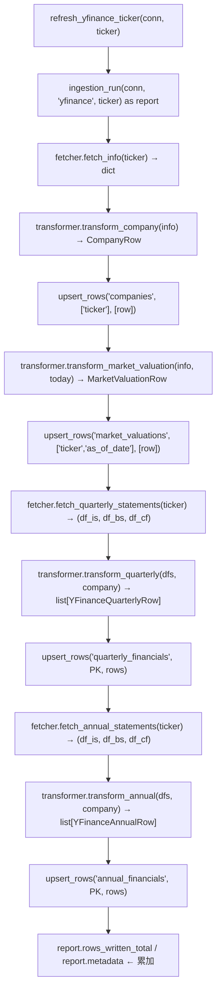

# Design: yfinance Ingestion Subsystem

> **上位契約**：本文件屬於 `design_master.md`（Design Master）規範下的子系統 design。凡本文件未明述的共用行為（DuckDB connection、`upsert_rows()`、`normalize_fiscal_period()`、`ingestion_run()`、`traced_span()`、`with_retry()`、error taxonomy），一律遵守 Design Master §7 / §8 定義，不重述。
>
> **Self-contained 範圍**：本文件定義 yfinance subsystem 的**目標、介面、職責分層、關鍵決策、錯誤策略、觀測策略、測試策略**。具體 code、完整 line-item mapping 表、逐欄 DTO 定義屬於 implementation plan 範疇。

---

## 1. Purpose & Scope

### Purpose

Quant Data Pipeline 的第一棒 subsystem。負責從 `yfinance` Python library 抽取**公司基本資料、即時估值指標、季度與年度完整財報**，寫入 DuckDB，讓下游 agent 透過 Text-to-SQL 查詢。

### In Scope

| 寫入的表 | 欄位範圍 |
|---------|---------|
| `companies` | 全表（含關鍵 `fy_end_month`，後續 fiscal period normalization 的 dependency） |
| `market_valuations` | 全表 |
| `quarterly_financials` | 除 SEC-only 欄位外所有欄位（Income Statement、Balance Sheet、Cash Flow 三大報表的 yfinance 可得值） |
| `annual_financials` | 同 `quarterly_financials` 的欄位集（減 `fiscal_quarter`） |

**SEC-only 欄位明確排除**（由 SEC XBRL subsystem 負責）：
- `product_revenue_usd` / `service_revenue_usd`（ASC 606 revenue disaggregation）
- `current_rpo_usd` / `noncurrent_rpo_usd`
- `total_lease_obligation_usd` 的 operating lease 部分（yfinance 只寫 finance lease 值，SEC subsystem 後覆蓋為 finance+operating 完整值，詳見 Design Master §3.5）
- `segment_financials` / `geographic_revenue` / `customer_concentration` 三張表

### Out of Scope

| 項目 | 理由 |
|------|-----|
| 股價 / OHLC / volume 時間序列 | 遵守 Design Master §1「即時股價不落地」原則；eval 若有跨公司走勢需求再開新 design（例：`design_price_history.md`） |
| Agent-side staleness / cache TTL 判斷 | 屬於 agent_engine，不屬 yfinance subsystem |
| Batch refresh 的排程 cadence | 運維決定；Prefect 遷移時統一規範 |
| Sector-specific required field 檢查 | 交給 `validate` CLI（Design Master §9） |
| Universe 擴大 >100 ticker 後的 concurrent fetch | 受限於 DuckDB single-writer（Design Master §12.1） |
| 與既有 v1 `backend/agent_engine/tools/financial.py` 整合 | v1 tool 走 JIT snapshot query（無落地），本 subsystem 是 v3 ETL 路徑，兩者並存互不修改 |

---

## 2. Public API

subsystem 只暴露**一個 entrypoint**：

```python
def refresh_yfinance_ticker(
    conn: DuckDBPyConnection,
    ticker: str,
) -> RunReport:
    """Refresh all yfinance-owned data for a single ticker (atomic unit)."""
```

### 契約

- **Atomic unit**：成功定義為 4 張表該 ticker 的 yfinance 欄位都 upsert 完成 + `ingestion_runs` 寫一筆 `status='success'`
- **失敗定義**：任一 stage raise `QuantPipelineError` 家族 → `ingestion_runs` 寫 `status='error'` → re-raise 給 caller
- **Ticker normalization**：函式開頭一律 `ticker = ticker.strip().upper()`
- **Audit**：整個函式包在 Design Master §7.5 的 `ingestion_run(conn, "yfinance", ticker)` context manager 內
- **Tracing**：本函式**不自加** `@observe` 或 outer `traced_span`——root trace 由 caller 層（agent tool）以 `@observe("quant_data_refresh_ticker")` 建立；本函式只在 heavy I/O stage 發 child span（詳見 §7）

### 唯一 entrypoint 的動機

- Batch CLI（`__main__.py`）只需 for-loop + catch `QuantPipelineError` continue，不需 class 包裝
- Agent tool JIT 只 call `refresh_yfinance_ticker`，不需解剖式呼叫內部 stage
- 避免 `sec_filing_pipeline.SECFilingPipeline` 的反模式：為了讓外部 caller 包自己的 trace 而被迫把 `download_raw` / `parse_raw` / `resolve_latest_year` 暴露為 public method（leaky abstraction）

### 不做 Class 包裝的理由

| 面向 | 本 subsystem | `sec_filing_pipeline`（對照） |
|------|-------------|----------------------------|
| Collaborator 數 | 1（`yf.Ticker` factory） | 6（downloader/preprocessor/converter/fallback/cleaner/store） |
| Retry 擺放 | 共用 `with_retry` decorator（Design Master §7.7） | Class 內 `_execute_with_retry` |
| Batch 失敗隔離 | 共用 `ingestion_run` 寫 audit + CLI for-loop catch | Class 內 `process_batch` + `BatchResult` |
| Stage-level trace | 內部 `traced_span`，不暴露 stage | 暴露 public stage method 讓 caller 包 trace |

yfinance subsystem 的 collaborator 單薄、橫切關切已由共用層抽出，class + DI 會是 over-engineering。

---

## 3. Module Layout

```
backend/ingestion/quant_data_pipeline/yfinance/
├── __init__.py              # 只 re-export refresh_yfinance_ticker
├── README.md                # 使用說明與 env var 清單
├── mapping.py               # 純常數：yfinance key/line-item ↔ DDL column + 型別轉換規則
├── fetcher.py               # 唯一 I/O 層：pacing + yfinance call + error classification
├── transformer.py           # 純 function：raw dict / DataFrame → Pydantic DTO
├── pipeline_errors.py       # subsystem-specific error class
└── pipeline.py              # orchestration：fetch → transform → upsert + tracing + audit
```

### 每個模組的職責

| 模組 | 職責 | 不做什麼 |
|------|-----|---------|
| `mapping.py` | 宣告「yfinance 的 key / line-item name」與「DDL column name + 型別 converter」的對照表，以 module-level constant 存放（`dict` / `frozenset`） | 不含任何函式邏輯 |
| `fetcher.py` | 呼叫 `yf.Ticker`、pacing gate、yfinance exception → subsystem error 分類 | 不碰 DuckDB、不做欄位轉換、不認識 DTO |
| `transformer.py` | `dict` / `DataFrame` → Pydantic DTO（`CompanyRow` / `MarketValuationRow` / `YFinanceQuarterlyRow` / `YFinanceAnnualRow`），型別轉換、fiscal period normalization、missing field 記錄。`transform_quarterly` / `transform_annual` 明確接受 `company: CompanyRow` 作顯式參數，不走全域狀態 | 不做 I/O、不 `time.sleep`、不認識 DuckDB |
| `pipeline_errors.py` | `YFinanceRateLimitError` / `YFinanceTickerNotFoundError` / `YFinanceEmptyResponseError` 等 subsystem-specific error，繼承 Design Master §7.6 共用 error 家族 | 不含 retry / log 邏輯 |
| `pipeline.py` | `refresh_yfinance_ticker` orchestration：串接 fetch → transform → upsert，包 `ingestion_run`、發 `traced_span`、填 `RunReport.metadata` | 不實作 fetch / transform 細節，只做組合 |

### Import 方向規則

```
pipeline.py  → fetcher, transformer, mapping, pipeline_errors, <共用層>
transformer.py → mapping, <共用層 fiscal_periods>
fetcher.py   → pipeline_errors, <共用層 retry?>（不 import mapping / transformer）
mapping.py   → （不 import 其他 subsystem 模組）
```

Pure leaf（`mapping.py`）→ transformer / fetcher → orchestrator（`pipeline.py`）。禁止反向 import。

---

## 4. Data Flow



### 關鍵說明

- `companies` **必須先於** quarterly / annual upsert：`transform_quarterly` / `transform_annual` 都呼叫 `normalize_fiscal_period(period_end, company.fy_end_month)`，所以 `company.fy_end_month` 必須先可用
- `transformer` 拿到的 `company` 是**剛 transform 出來的 `CompanyRow` 物件**，不是 re-query DuckDB（避免多一次 DB round-trip；fetch 一次後就在 Python 記憶體流通）
- `transform_quarterly(dfs, company: CompanyRow)` 與 `transform_annual(dfs, company: CompanyRow)` 都把 `CompanyRow` 當**顯式依賴參數**傳入（不是 implicit 全域狀態）。這也是 §3 模組職責表所述「transformer 不碰 DB」的落實
- `transform_annual` 仍呼叫 `normalize_fiscal_period(period_end, company.fy_end_month)`，但**只取回傳的 `fiscal_year`，捨棄 `fiscal_quarter`**（annual 的 `period_end` 恰好落在 FYE、quarter 必為 4，`annual_financials` 表本來就沒有 `fiscal_quarter` 欄位）
- 所有 `upsert_rows` 第一參數都是同一個 `conn`（DuckDB single-writer，不會開多 connection）
- `report.metadata` 最終 shape 見 §10

---

## 5. Key Decisions

| # | 決策 | 選擇 | 依據 |
|---|------|------|-----|
| 1 | Multi-sector 支援 | 一開始就支援（tech / financial / insurance） | v3 PRD 不限 tech；schema 已 nullable 準備 |
| 2 | Required field 守備範圍 | 只守 PK + `total_revenue_usd` | 擋住「API 壞掉」訊號；sector-specific 缺失由 `validate` CLI 處理 |
| 3 | 歷史窗口策略 | 照 yfinance 回傳的**全存**（full refresh） | `upsert_rows` idempotent；公司 restate 自動 propagate；邏輯最簡 |
| 4 | `market_valuations.as_of_date` 語意 | ETL run date（`date.today()`，UTC） | Sub-day 精度非設計目標；同日覆蓋即可 |
| 5 | 股價 / OHLC 落地 | 不落地（延後決定） | 遵守 Design Master §1；v3 eval 題目以 fundamental 跨公司比較為主 |
| 6 | Subsystem 形狀 | Module-level function（非 class） | Collaborator 單薄、橫切關切已抽出、避免 `SECFilingPipeline` 的 leaky abstraction |
| 7 | Public API surface | 單一 `refresh_yfinance_ticker` | Stage-level trace 靠內部 `traced_span`，JIT caller 不需解剖式呼叫 |
| 8 | yfinance session 策略 | **不傳 `session=`**，讓 yfinance 自管 `curl_cffi` session | yfinance 0.2.58+ 已切換 curl_cffi，`CachedLimiterSession`（`requests-ratelimiter`）pattern 失效 |
| 9 | Pacing 實作位置 | `fetcher.py` module-level gate | Fetch 層唯一有狀態的地方；transformer / pipeline 保持 stateless |
| 10 | Retry 策略分層 | Built-in `yf.config.network.retries=2`（transient net error）+ 自家 `with_retry`（429） | yfinance 內建 retry 不處理 429；自家 retry `base_delay=60s` 對應 cookie TTL |

---

## 6. Rate Limit Strategy（2026-04 現況）

### 背景

yfinance 自 0.2.58（2025-05）改用 `curl_cffi` 做 TLS fingerprint impersonation。傳統 `requests`-based `CachedLimiterSession`（`requests-ratelimiter` + `requests-cache`）**已失效**：若傳 `session=` 會 raise `YFDataException("request_cache sessions don't work with curl_cffi...")`。

參考來源：
- yfinance GH issue [#2486](https://github.com/ranaroussi/yfinance/issues/2486)（session 相容性）
- yfinance GH issue [#2125](https://github.com/ranaroussi/yfinance/issues/2125)（1 req/s 實測）
- yfinance GH issue [#2411](https://github.com/ranaroussi/yfinance/issues/2411) / [#2422](https://github.com/ranaroussi/yfinance/issues/2422)（2025-04 起 per-cookie 限流）

### 策略

| 項目 | 決策 | 備註 |
|------|-----|------|
| 自訂 session | 不使用，讓 yfinance 自管 curl_cffi session | 避開 0.2.58+ 相容性破壞 |
| 應用層 pacing | `fetcher.py` module-level `_last_call_ts` + `time.monotonic()` gate | 每次 yfinance data-fetching call 前 `_pace()` sleep 至 `_MIN_INTERVAL` |
| 預設 pacing 間隔 | **1.0 秒** | 社群觀察值：`@skoenig` 測 1 req/s 跑 320 tickers 通過（#2125）|
| 間隔可配置 | env var `YFINANCE_MIN_REQUEST_INTERVAL_SECONDS` | Default 1.0；測試時注入 0.0 |
| yfinance 內建 retry | `yf.config.network.retries = 2` | 處理 transient network error（`1s/2s/4s` exponential backoff）；**不**處理 429 |
| 429 retry 策略 | 共用層 `with_retry(max_attempts=3, base_delay_seconds=60.0)` | 60s base 對應 A3 cookie TTL；最壞延遲 ~3.5 分鐘 |

### 預期負荷

10 tickers × ~7 HTTP call per ticker（1 info + 3 quarterly statements + 3 annual statements，假設 annual 無快取、最保守估算）≈ 70 call per batch。以 1 req/s pacing 計，單輪 batch 時間約 70 秒，顯著低於社群觀察的觸發閾值。

若實際遇到 429，靠 60s-base exponential backoff 自動等待限速窗口過期。

### fetcher.py 內部 state

```
# module-level
_last_call_ts: float | None = None
_MIN_INTERVAL: float = float(os.getenv("YFINANCE_MIN_REQUEST_INTERVAL_SECONDS", "1.0"))

def _pace() -> None:
    """Sleep so that time since last call ≥ _MIN_INTERVAL."""

def _classify(exc: Exception) -> NoReturn:
    """yfinance exception → subsystem error family; raise."""
```

Process-global state 可接受——Design Master §12.1 已規範 single-writer、不併發。

---

## 7. Observability（span hierarchy）

### 整體原則（對齊 `rag-search-tool-pipeline` 既有 pattern）

- `@observe` 只在 **entry point**（agent tool 層）一次；本 subsystem 不加 `@observe`
- `traced_span` 只包 **heavy I/O stage**（network call、DB write）
- Pure in-memory transform **不**包 `traced_span`
- Orchestrator function **不自包** outer `traced_span`（避免與 root `@observe` 重疊）
- Stage 失敗時 span 自己 `update(output={"status": "error"})` 再 re-raise

### Span hierarchy

```
quant_data_refresh_ticker         ← root @observe, by agent tool (本 subsystem 外)
├── yf_fetch_info                     (fetcher)
├── yf_upsert_companies               (upsert_rows 'companies')
├── yf_upsert_market_valuations       (upsert_rows 'market_valuations')
├── yf_fetch_quarterly_statements     (fetcher)
├── yf_upsert_quarterly_financials    (upsert_rows 'quarterly_financials')
├── yf_fetch_annual_statements        (fetcher)
└── yf_upsert_annual_financials       (upsert_rows 'annual_financials')
```

**7 個 sibling span** 直接掛 root 底下，不再加 wrapper 層。與 `sec_dense_pipeline.vectorizer.ingest_filing` 發出 `sec_chunking` / `sec_chunk_embedding` / `sec_qdrant_upsert` sibling 的 shape 一致。

### Span 命名規則

- snake_case
- `yf_` prefix（對齊 Design Master §7.8 與 memory `feedback_observe_span_naming.md`）
- 動作明確（`yf_fetch_info`，不是 `fetch`）

### 三場景驗證（對齊 memory `feedback_tracing_verification.md`）

| 場景 | 預期 | 驗證方式 |
|------|-----|---------|
| Warm（DB 已有資料，JIT 不觸發） | root 下無 `yf_*` span | Langfuse SDK `get_trace` → assert span name set 不含 `yf_*` |
| Cold single ticker | 7 個 sibling span 皆出現 | Langfuse SDK 查 trace → assert 覆蓋預期 span list |
| Cold batch（CLI 模式） | Langfuse 無此次 trace；但 `ingestion_runs` 表有完整記錄 | CLI 不開 `@observe`；`traced_span` 無 outer trace 時 no-op |

### Audit vs Tracing 責任分離

| 層 | 表達載體 | 何時寫入 | 何時 no-op |
|----|--------|---------|-----------|
| Audit | `ingestion_runs` 表（DuckDB） | **永遠寫**（success / error 都寫） | 無 |
| Tracing | Langfuse span | 有 outer `@observe` trace 才 emit | CLI batch / unit test：no-op |

兩層語意獨立，同一個 `refresh_yfinance_ticker` 內並存。

---

## 8. Error Taxonomy

繼承 Design Master §7.6 的共用基礎 error family。

### subsystem-specific error class

```python
# backend/ingestion/quant_data_pipeline/yfinance/pipeline_errors.py
from backend.ingestion.quant_data_pipeline.pipeline_errors import (
    TransientError, TickerNotFoundError, DataValidationError,
)

class YFinanceRateLimitError(TransientError):
    """Yahoo 429 / cookie-limited. Retry with 60s+ base backoff."""

class YFinanceTickerNotFoundError(TickerNotFoundError):
    """yfinance.exceptions.YFTickerMissingError — ticker does not exist."""

class YFinanceEmptyResponseError(DataValidationError):
    """Empty DataFrame / missing required field (PK or total_revenue_usd)."""
```

### yfinance exception 對應表

| yfinance exception | Subsystem error | Retry? |
|--------------------|-----------------|--------|
| `yfinance.exceptions.YFRateLimitError` | `YFinanceRateLimitError(TransientError)` | ✅（`base_delay=60s`） |
| `yfinance.exceptions.YFTickerMissingError` | `YFinanceTickerNotFoundError` | ❌ |
| `yfinance.exceptions.YFTzMissingError` / `YFPricesMissingError` | `YFinanceTickerNotFoundError` | ❌ |
| `yfinance.exceptions.YFDataException` | `DataValidationError`（共用層） | ❌ |
| `TimeoutError` / `ConnectionError` / `OSError` | `TransientError`（共用層） | ✅（`base_delay=1s`） |
| `JSONDecodeError`（偶發於 rate limit bypass layer） | `TransientError`（視為 429 訊號） | ✅ |

### Empty DataFrame 的特殊處理

yfinance 對某些 ticker / 某些 statement 會**回傳空 DataFrame 而不 raise**（例：保險公司的 `quarterly_cashflow`、新上市公司的 annual history）。處理原則：

| 情境 | 處置 |
|------|-----|
| Empty DataFrame **且** required field（PK / `total_revenue_usd`）無法填 | `raise YFinanceEmptyResponseError` |
| Empty DataFrame **但** PK / `total_revenue_usd` 可從其他 statement 湊齊 | 不 raise；受影響欄位記入 `report.metadata.missing_fields` |
| 特定 line item 缺失（非 required） | 不 raise；欄位存 NULL；記入 `report.metadata.missing_fields` |

### Required field 定義（Design Master §8.2 的擴充）

| 表 | Required（缺則 raise） |
|----|---------------------|
| `companies` | `ticker`, `company_name`, `fy_end_month`, `fy_end_day` |
| `market_valuations` | `ticker`, `as_of_date`（value 欄位可為 NULL） |
| `quarterly_financials` | `ticker`, `fiscal_year`, `fiscal_quarter`, `period_end`, **`total_revenue_usd`** |
| `annual_financials` | `ticker`, `fiscal_year`, `period_end`, **`total_revenue_usd`** |

除上表之外的欄位：缺 → NULL + `metadata.missing_fields` 記錄。

> **Scope 釐清**：`total_revenue_usd` 被列為 required 是**本 subsystem 的 invariant**（「API 壞掉」訊號），不是 DDL schema 層級的 `NOT NULL`。Design Master §6 的 DDL 允許 `total_revenue_usd` 為 NULL（保留給 SEC subsystem 覆蓋或其他 subsystem 共用的靈活性）。意即：
> - yfinance subsystem 自己 fetch 回來的資料缺 `total_revenue_usd` → raise `YFinanceEmptyResponseError`
> - 若 DB 已有 row 而該 row 的 `total_revenue_usd` 為 NULL（例：某 upstream 先寫了空值）→ 本 subsystem 不檢查也不 raise
> 下游測試與 validate CLI 應避免把本規則誤認為 schema-level 保證。

---

## 9. Testing Strategy

### 層級與 marker

| 層級 | Target | Pytest marker | 預設跑？ |
|------|--------|--------------|---------|
| Unit | `mapping.py` 常數一致性（DDL column 存在 check） | 無 | ✅ |
| Unit | `transformer.py` 各 `transform_*` 純函式 | 無 | ✅ |
| Unit | `fetcher.py` `_pace` / `_classify` | 無 | ✅ |
| Component | `refresh_yfinance_ticker` end-to-end（in-memory DuckDB + stub `yf.Ticker`） | 無 | ✅ |
| Integration | 真打 yfinance API（minimal ticker = AAPL） | `yfinance_integration` | ❌（CI 不跑） |
| Tracing | 三場景 span hierarchy 驗證 | `tracing` | ❌（CI 不跑） |

### 測試原則

- `pyproject.toml [tool.pytest.ini_options]` `markers` 新增 `yfinance_integration` 與 `tracing`；`addopts = "-m 'not eval and not sec_integration and not yfinance_integration and not tracing'"`
- Unit / Component 用 `duckdb.connect(":memory:")` 不留檔
- `yf.Ticker` stub 走 function parameter 注入：transformer / fetcher 測試時傳 `ticker_factory` callable；生產 default `yf.Ticker`
- Integration test 打真 API 前先用 `yfinance.utils.set_tz_cache_location` 避免測試汙染主 cache

### Fixture 策略

真實 yfinance 回傳 DataFrame 的 JSON 快照存入 `backend/tests/fixtures/yfinance/<ticker>/<endpoint>.json`（僅 AAPL + NVDA 兩檔做 fixture，作為 golden input）。Fixture 產生腳本由 implementation plan 交代。

### 三場景 tracing 驗證（對齊 memory `feedback_tracing_verification.md`）

1. **Warm**：預先 populate DuckDB → agent 查詢不觸發 JIT → assert Langfuse trace 下無 `yf_*` span
2. **Cold single**：清空 DB → call 一次 JIT → assert trace 含完整 7 個 sibling span
3. **Cold batch**：CLI 跑 universe → assert Langfuse 無此次 trace；`ingestion_runs` 表行數 = universe size

驗證**以 Langfuse SDK `get_trace()` 查實際 span name list 比對**，不只看 Langfuse UI（對齊 memory）。

---

## 10. `RunReport.metadata` 契約

`ingestion_run()` context manager 產出的 `RunReport.metadata` dict，本 subsystem 寫入下列欄位：

```python
report.metadata = {
    "periods_covered": {
        "quarterly": ["2024Q1", "2024Q2", ...],  # fiscal_year + fiscal_quarter
        "annual": [2023, 2024],                  # fiscal_year only
    },
    "rows_per_table": {
        "companies": 1,
        "market_valuations": 1,
        "quarterly_financials": N,
        "annual_financials": M,
    },
    "missing_fields": [                          # 空 list 表 nothing missing
        {"table": "quarterly_financials", "period": "2024Q1", "fields": ["interest_income_usd"]},
        ...
    ],
    "pacing": {
        "calls": 7,
        "total_sleep_seconds": 5.2,
    },
    "retry_count": 0,                            # 429 retry 次數
}
```

`ingestion_runs.rows_written_total = sum(rows_per_table.values())`。

### `retry_count` 的責任歸屬

共用層 `with_retry` decorator **不會**把 retry 次數寫回 `RunReport.metadata`（其 docstring 明述「retry count is NOT written to ingestion_runs.metadata by this decorator; callers track it themselves if needed.」）。

因此 `metadata.retry_count` 由 **`pipeline.py` 自己維護**——可採下列任一策略：

- **自行 bookkeeping**：在 `pipeline.py` 對 429-retry 敏感的 fetch 呼叫外層自包 `try/except YFinanceRateLimitError`，捕到就 `counter += 1`、手動 backoff + 重試；不套 `with_retry`。
- **包裝 decorator**：為本 subsystem 寫薄的 `with_retry_counted(report)` adapter，在 decorator 邊界把失敗次數累加到 `report.metadata["retry_count"]`，再 delegate 給共用 `with_retry`。

implementation plan 需明確選定其中一種並落地，不能假設 `with_retry` 會代填。

---

## 11. Mapping 策略（交給 implementation plan 的輸入）

本 design 不窮舉 line-item ↔ DDL column 的完整對照（約 50 組 mapping）。依 Design Master 既定 reference 由 implementation plan 產出完整 mapping table。對照表來源：

- `info` dict → `companies` / `market_valuations`：`quant-research.md` §「yfinance Field Mapping / `ticker.info` → `market_valuations`」
- `quarterly_income_stmt` / `quarterly_balance_sheet` / `quarterly_cashflow` → `quarterly_financials`：同文件 §「`ticker.quarterly_*` → `quarterly_financials`」
- annual 版本 mapping 與 quarterly 同欄位集

### 型別轉換特例（implementation plan 需在 mapping.py 寫死）

| DDL column | yfinance key | 轉換 |
|-----------|-------------|------|
| `dividend_yield_pct` | `info["dividendYield"]` | × 100（yfinance 回 decimal） |
| `held_pct_institutions` | `info["heldPercentInstitutions"]` | × 100 |
| `capital_expenditure_usd` | line item `Capital Expenditure` | **保留原始負號**（代表現金流出） |
| `stock_buyback_usd` | line item `Repurchase Of Capital Stock` | 保留原始負號 |
| `dividends_paid_usd` | line item `Common Stock Dividend Paid` | 保留原始負號 |
| `total_lease_obligation_usd` | `Long Term Capital Lease Obligation` + `Current Capital Lease Obligation` | 加總；**僅 finance lease**，SEC subsystem 會覆蓋為含 operating 的完整值 |
| `fy_end_month` / `fy_end_day` | `info["lastFiscalYearEnd"]` | Unix timestamp → `date` → 取 month / day |

其他欄位一律 scalar 直取，無轉換。

---

## 12. CLI Integration

本 subsystem 不自帶 CLI；CLI 由 quant_data_pipeline 根目錄 `__main__.py` 提供（Design Master §9）。對應命令：

| Design Master CLI command | 呼叫行為 |
|--------------------------|---------|
| `refresh [TICKER...]` | for ticker in tickers: `refresh_yfinance_ticker(conn, ticker)`；續接 SEC subsystem |
| `refresh-yfinance [TICKER...]` | 同上但**只**跑本 subsystem |

Batch 模式下：

```
for ticker in universe:
    try:
        refresh_yfinance_ticker(conn, ticker)
    except QuantPipelineError:
        # ingestion_run() 已寫 error row 到 ingestion_runs
        continue  # 不中斷其他 ticker
```

CLI 不加 `@observe`；`traced_span` 自動 no-op。

---

## 13. 與既有 v1 `financial.py` Tool 的關係

v1 的 `backend/agent_engine/tools/financial.py` 暴露 `yfinance_stock_quote` 與 `yfinance_get_available_fields` 兩個 agent tool，走 **JIT snapshot query 模式**（無落地，每次問每次打 yfinance）。

本 subsystem 與 v1 tool **並存、不互相修改**：

| 面向 | v1 `financial.py` | v3 yfinance subsystem |
|------|------------------|----------------------|
| 目的 | Single-ticker quote lookup（v1 agent 用） | Batch ETL 寫入 DuckDB（v3 Text-to-SQL 用） |
| 資料落地 | ❌ | ✅（4 張表） |
| Rate limit | 無 | 有 pacing + retry |
| Error taxonomy | try/except 吞成 dict | `QuantPipelineError` 家族 |
| 呼叫端 | v1 agent | v3 agent via Text-to-SQL + CLI |

本 design 明確**不 touch** v1 tool。未來 v3 agent tool 若需要「JIT 補資料」入口，應另開 `quant_data_refresh_ticker` tool（agent_engine 範疇），內部 call `refresh_yfinance_ticker`；仍不動 v1 tool。

---

## 14. Deferred / Future

| 項目 | 原因 | 觸發條件 |
|------|-----|---------|
| 股價 / OHLC 時間序列落地 | Design Master §1 現行排除 | Eval 題目確認需跨公司走勢比較 |
| Concurrent fetch（多 ticker 同時打 yfinance） | DuckDB single-writer 限制 | Prefect 遷移 + concurrency limit 設計 |
| Sector-aware required field | 目前只守 universal core | `validate` CLI 積累 sector-specific 規則後提升 |
| `updated_at` 只在「真的有值變化」時 bump | 目前每次 upsert 都 bump | 共用層 `upsert_rows` 升級加 `IS DISTINCT FROM` 檢查 |
| Staleness-aware JIT（agent tool 判斷要不要 refresh） | 屬 agent_engine 範疇 | v3 agent tool design |

---

## Appendix A: 決策速查

| # | 決策 | 選擇 |
|---|-----|------|
| 1 | Multi-sector | 支援 |
| 2 | Required field | PK + `total_revenue_usd` |
| 3 | 歷史窗口 | 全存 |
| 4 | `as_of_date` 語意 | ETL run date |
| 5 | 股價落地 | 不落地（延後） |
| 6 | 實作形狀 | Module-level function |
| 7 | Public API | 單一 `refresh_yfinance_ticker` |
| 8 | session 策略 | 不傳（yfinance 自管 curl_cffi） |
| 9 | Pacing 位置 | `fetcher.py` module-level gate |
| 10 | 429 retry | `with_retry` base_delay=60s |

## Appendix B: 檔案清單

| 路徑 | 類型 |
|------|-----|
| `backend/ingestion/quant_data_pipeline/yfinance/__init__.py` | 程式 |
| `backend/ingestion/quant_data_pipeline/yfinance/README.md` | 文件 |
| `backend/ingestion/quant_data_pipeline/yfinance/mapping.py` | 程式 |
| `backend/ingestion/quant_data_pipeline/yfinance/fetcher.py` | 程式 |
| `backend/ingestion/quant_data_pipeline/yfinance/transformer.py` | 程式 |
| `backend/ingestion/quant_data_pipeline/yfinance/pipeline_errors.py` | 程式 |
| `backend/ingestion/quant_data_pipeline/yfinance/pipeline.py` | 程式 |
| `backend/tests/ingestion/quant_data_pipeline/yfinance/...` | 測試 |
| `backend/tests/fixtures/yfinance/<ticker>/*.json` | fixture |
