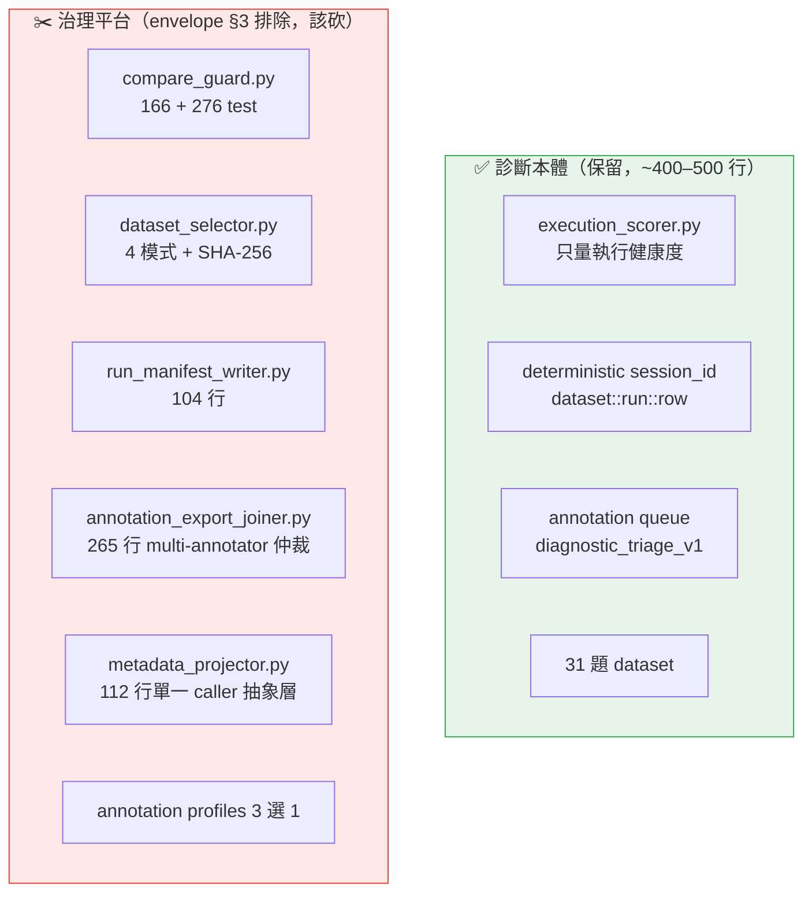
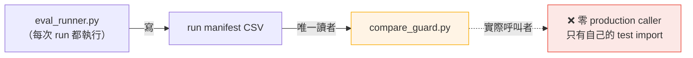

# near-v1 diagnostic pipeline — Over-Engineering 修正建議

> 對象：`feat/v1-eval-experiment-pipeline`（DEV-62，現於 Code Review）
> 來源：7/8 全 worktrees over-engineering 稽核（DEV-83）、eval 嚴謹度欠帳（DEV-80）、DEV-62 的 📐 Envelope re-scope comment（7/9）
> 本文的每一條「為什麼」都用實際程式碼查證過（呼叫者、行數、模式數），不是照抄 Linear。

## TL;DR

這條 pipeline 的**診斷本體是合宜的**（~400–500 行）：`execution_scorer` 只量執行健康度、deterministic `session_id` 串起 Langfuse、annotation queue、31 題中文財經 dataset — 這些對「一個人跑 near-v1、人工看 trace、標註、迭代」的真實需求剛好對得上。

問題出在 diff 的**另一半**：它為「多人、多次、要治理」的工作流蓋了一座 eval 治理平台，而真實使用者是**一個人、跑一次、看一眼**。這半邊正好落在 design envelope §3 **逐字明列排除**的項目（"dataset slicing / comparability guards / run manifests / multi-annotator reconciliation"）。

**淨效果**：rebase 開 PR 前可砍 **~800–900 prod + ~1,600 test 行**，診斷能力不減。

## 一個誠實的張力

我在 knowledge-graph walkthrough 裡把 `compare_guard`（防呆）和 `dataset_selector` 的 4 種 slice（first-class subset rerun）講成設計亮點。稽核的判定正好相反：**這幾個就是 over-engineering 的主體**。兩種說法都成立，差別在**視角**——

- design.md 的視角：把 slice、compare guard 寫成「正式需求」和 trade-off 的 "chosen" 項。
- envelope 稽核的視角：那個「正式需求」是為**想像中的**多人 / 多輪治理場景設計的，跟「一人一個下午標註」的真實使用者對不上。YAGNI 的經典形狀。

## 判斷準則：什麼算 over-engineering？

不是「程式碼寫得好不好」，而是**「為誰、跑幾次、誰治理」和實作規模是否匹配**。這條 pipeline 的真實座標：

| 維度 | 真實情況 | 但實作假設 |
| --- | --- | --- |
| 使用者 | 1 人（自己） | 多標註者、要仲裁 |
| 執行頻率 | 偶爾、循序、full run | 頻繁、要 subset rerun、要跨 run 比對治理 |
| Dataset | 31 列 CSV，全跑幾分鐘 | 大到需要 slice + hash 指紋 |
| Registry | git + Braintrust experiment metadata 已足夠 | 需要自建 run manifest identity 層 |

只要一個機制的存在理由是右欄、而現實是左欄，它就是該砍的對象。

## 核心 vs 平台

## 死輸出鏈：manifest 寫給誰看？

稽核最有說服力的一條，是這條依賴鏈的實證（用 grep 查證）：

`eval_runner` 每次 run 都花力氣寫一份 manifest，但那份 manifest 的**唯一下游讀者是 `compare_guard`，而 `compare_guard` 從來沒被 pipeline 呼叫過**（`grep` 全 backend：唯一 import 它的是 `test_diagnostic_compare_guard.py`）。整條鏈的產出，除非你手動去跑那個沒接線的 CLI，否則沒有任何人讀。

## 逐項修正建議

### 1. `compare_guard.py` — 全刪（166 + 276 test 行）

- **現況**：166 行、6 種可比性判定（`same_row_set` / `overlap_only` / `dataset_version_mismatch` / `empty_intersection` …）的獨立 CLI。
- **為什麼是 over-engineering**：查證結果——**零 production 呼叫者**，只有它自己的測試 import。單一操作者、循序 full run，兩次 run 可不可比是**不證自明**的（你就是那個決定跑哪些列的人）。這正是 envelope §3 的 case-law 判例本尊。
- **修正**：整檔 + 測試刪除。
- **依據**：envelope §3（comparability guards 明列排除）。

### 2. `dataset_selector.py` — 4 模式 → `full` + `--row-ids`（省 ~150 prod + 大半測試）

- **現況**：`full_dataset` / `row_ids` / `field_filter` / `manifest` 四種 slice 模式，外加 SHA-256 slice hash 指紋。
- **為什麼是 over-engineering**：31 列 CSV 全跑只要幾分鐘。`field_filter`（跑特定題型）和 `manifest`（外部固定 subset）是為「dataset 大到不能全跑、要治理固定 regression 子集」設計的——這個規模不存在。SHA-256 指紋是為「要證明兩次跑的是同一批列」，同上，單人不需要。
- **修正**：留 `full_dataset` + 一個 `--row-ids`（修 bug 後快速重跑確實有用）。刪 `field_filter`、`manifest`、slice hash。
- **依據**：envelope §3（dataset slicing 排除）。

### 3. `run_manifest_writer.py` — 全刪（104 行）

- **現況**：寫 platform-mode run manifest（experiment_name / run_label / slice_label / dataset_version / git_commit …）。
- **為什麼是 over-engineering**：見上方「死輸出鏈」。`eval_runner` 會呼叫它，但它的產出（manifest）唯一下游是已判死的 `compare_guard`。run identity 本來就已經在 Braintrust experiment metadata 裡（envelope §1：「git + Braintrust ARE the registry」），不需要自建一層。
- **修正**：整檔 + 測試刪除；`eval_runner` 移除對它的 import 與呼叫。
- **依據**：envelope §1（git + Braintrust 即 registry）、§3（run manifests 排除）。

### 4. `annotation_export_joiner.py` — 265 → ~40 行

- **現況**：把 Langfuse scores export CSV join 回 dataset。內含 latest-score-wins 的 timestamp 仲裁、UI 欄名 alias map、tri-state `join_status`（annotated / partial_annotation / missing_annotation）。測試 555 行（全 diff 最大）。
- **為什麼是 over-engineering**：latest-wins 仲裁和 tri-state 狀態是**multi-annotator reconciliation** 機械——處理「多個標註者對同一 trace 給不同分、要仲裁誰的算數」。真實情況是**一個人一個下午標一輪**，不會有衝突要仲裁。
- **修正**：留最小 join（by `session_id` 併回 dataset + reviewer 欄位），刪仲裁 / alias / tri-state。
- **依據**：envelope §3（multi-annotator reconciliation 排除）。

### 5. `metadata_projector.py` — inline 進唯一 caller（112 行）

- **現況**：把 row / run / slice identity + `reference_*` hints 投影成 Braintrust + Langfuse metadata payload 的獨立模組。
- **為什麼是 over-engineering**：查證——production 呼叫者只有 `eval_runner` 一個。112 行的抽象層服務單一 caller，是 envelope §0 的「一人抽象層」反模式。
- **修正**：把投影邏輯 inline 回 `eval_runner`（或縮成一個小 helper 函式），移除獨立模組。
- **依據**：envelope §0（單一 caller 不抽象）。
- **注意**：`test_orchestrator_langfuse.py` 也引用它——inline 時要一併調整該測試的驗證點。

### 6. Annotation profiles 3 → 1（省 ~75 行 + `--profile all`）

- **現況**：`langfuse_annotation_setup.py` 定義 3 個 profile（`diagnostic_triage_v1` / `triage_binary` / `diagnostic_v1`）+ `--profile all` 一次佈建全部。
- **為什麼是 over-engineering**：實際只有 `diagnostic_triage_v1`（預設）被 provision 過。另兩個 profile + `all` 是「將來可能要不同標註配置」的投機性通用化。
- **修正**：留 `diagnostic_triage_v1` 一個，刪另兩個 profile 與 `--profile all` 分支。
- **依據**：envelope §0（只建被用到的）。

### 7. `results/` 三份 run 輸出 — 移出 git + gitignore

- **現況**：4/24 兩輪 run 的結果 CSV + manifest 被 force-add 進 history（DEV-58 救援）。
- **為什麼**：run 輸出是資料產物，不是原始碼；長期留在 git 會膨脹 history。當初 force-add 是為了搶救 gitignored 成果（正確的一次性動作），但長期該 gitignore。
- **修正**：移出 tracked、加進 `.gitignore`；要保存就存到 artifacts 或外部。
- **依據**：envelope §6（產物同步縮減）。

## 為什麼會發生？（root cause）

不是「不會寫程式」，而是**把想像中的治理需求當成真實需求**。設計時腦中的畫面是「一個能長期運作、多人協作、跨版本比對的 eval 平台」，於是每個維度都往那個畫面補齊：能 slice、能比對、能仲裁、能追溯 identity。但這條 pipeline 的真實工作是「跑 near-v1、人工看 30 題 trace、標一標、討論」——一次性的診斷動作。

envelope 稽核用一句話總結全 repo 的同一模式：

> 替「多人、多次、要治理」的工作流打造基礎設施，實際使用者是一個人、跑一次、看一眼。

DEV-80 補了反面：平台這樣過度建設的同時，真正該深耕的 **eval 嚴謹度**（judge 的 TPR/TNR 驗證、per-item 策展理由、reproducibility pinning）反而欠建設——這叫**投資倒置**。砍平台不是為了少寫，是為了把力氣挪到會變成履歷深度的地方。

## 淨效果

| 項目 | Prod 行 | Test 行 |
| --- | ---: | ---: |
| compare_guard 全刪 | −166 | −276 |
| run_manifest_writer 全刪 | −104 | −133 |
| dataset_selector 4→2 模式 | ~−150 | 大半 −390 的一部分 |
| annotation_export_joiner 265→40 | ~−225 | ~−470（555 的大半） |
| metadata_projector inline | −112 | 併入 caller test |
| annotation profiles 3→1 | ~−75 | — |
| **合計（約略）** | **~−830** | **~−1,600** |

保留：`execution_scorer`、`session_id` 串接、annotation queue（單 profile）、31 題 dataset、`eval_runner` 的 diagnostic 執行路徑、`models.py` 的核心 identity（去掉 slice hash 相關）。

## 執行順序

DEV-62 那則 re-scope comment 的意思是 **trim → rebase → 才開 PR**——trim 是 PR 前的前置動作，不是 merge 後清理。另外兩個既有相依不變：

1. main 的 sec_retrieval scoring 修復（DEV-63）要先進。
2. rebase 時 `_convert_cell` 私有複製改走 shared helper。

## 出處（Linear）

- **DEV-62** — pipeline 本張的 📐 Envelope re-scope comment（7/9），8 項 trib 清單的原始出處。
- **DEV-83** — 7/8 全 worktrees over-engineering 稽核，總表判本 worktree「約一半是單人用的 eval 治理平台」。
- **DEV-80** — eval 嚴謹度欠帳，「投資倒置」的反面論證。
- **envelope** — `fin-lab-x/docs/design-envelope.md`（§0 抽象層 / §1 registry / §3 排除項 / §6 產物），DEV-77 落地。
