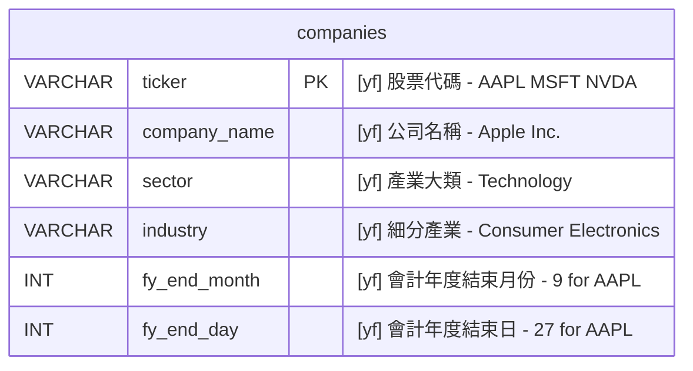
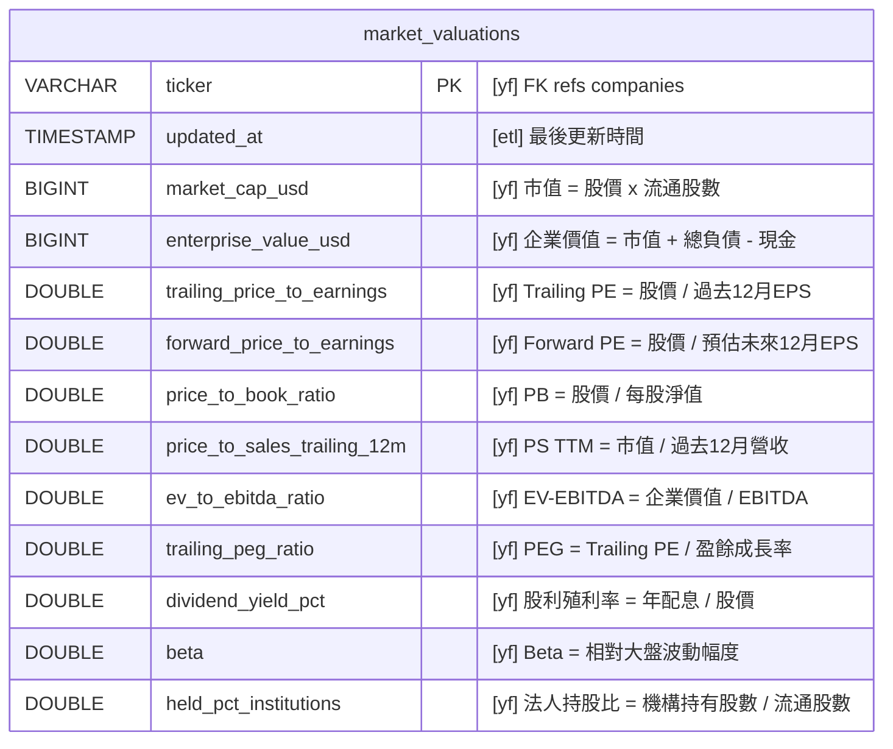
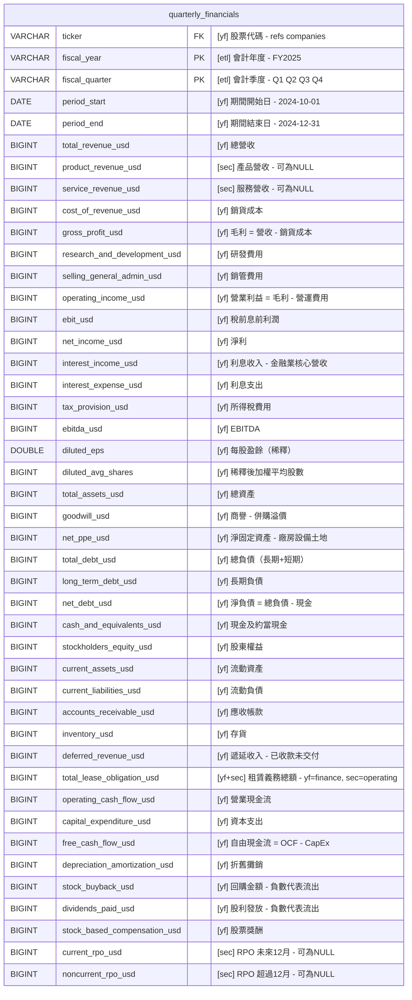
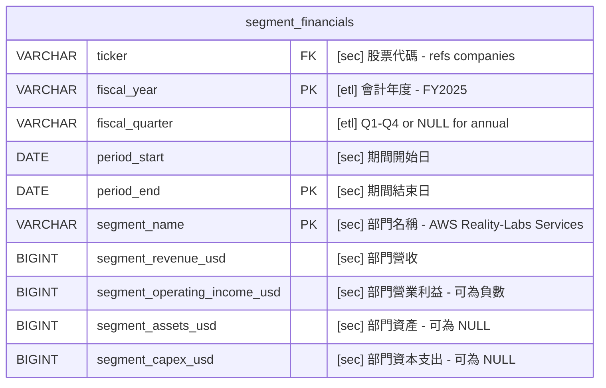
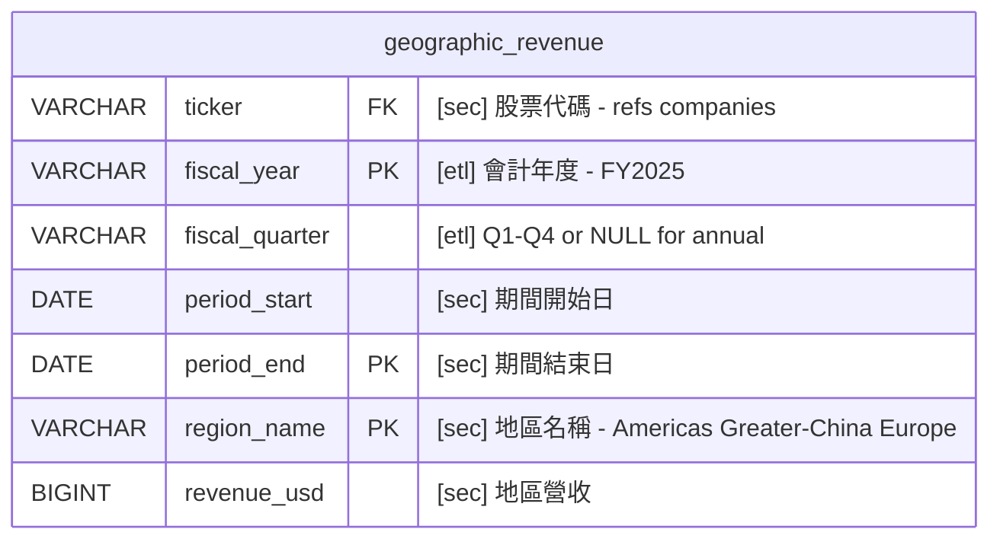
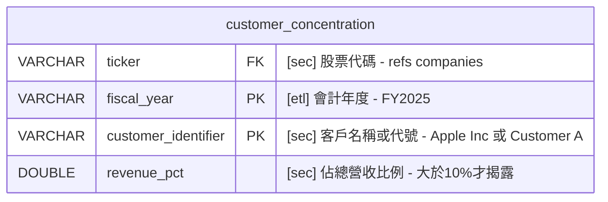

# V3 Quant Research — 設計決策

> 指標的詳細解釋、解讀方式、產業基準等教學內容見 [quant-research-reference.md](./quant-research-reference.md)

## 核心目標

讓 agent 能夠用 SQL 精確回答任何需要跨公司、跨時間、多條件篩選或計算的財務問題。
將「計算」的責任從 LLM 轉移到 SQL engine，解決 LLM 算數不可靠的痛點。

## 價值鏈

```
資料收集（yfinance + 10-K/10-Q）
  → 結構化儲存（DuckDB）
    → 精確查詢（Text-to-SQL）
      → LLM 解讀結果並回答使用者
```

## 架構決策

### Hybrid 資料路徑

V3 是 hybrid 架構，兩條資料路徑並存：

- **DuckDB**：負責歷史資料、跨公司比較、排序/篩選/聚合等計算密集型查詢
- **yfinance API（即時）**：負責單家公司的即時數據查詢（如「AAPL 現在股價多少？」）

DuckDB 的價值不是持久化，而是**計算引擎**——一條 SQL 完成 10 家公司 × 8 季的比較，取代 LLM 在 context 裡對著數字硬算。

### Text-to-SQL 分兩步

決定將 Text-to-SQL 拆成兩個 tool：

1. `text_to_sql`：LLM 生成 SQL
2. `duckdb_query`：執行 SQL 並回傳結果

理由：Observability 優先。在 Langfuse trace 裡可以清楚看到 LLM 生成了什麼 SQL，方便 evaluation 和 improvement。Tool call 次數翻倍在研究階段不是問題。

### Fiscal Year 處理

各公司會計年度不同（AAPL 結束於 9/27、MSFT 結束於 6/30 等），「Q1」代表的實際月份因公司而異。

設計決策：`fiscal_year` 和 `fiscal_quarter` 由 ETL 時用 Python 預先算好存入 DB，避免讓 LLM 做日期推理（LLM 日期推理容易出錯）。各公司的 fiscal year 對照表見 [reference](./quant-research-reference.md#fiscal-year會計年度)。

## DuckDB Schema 設計

### 設計原則：產業中立

Schema 設計不偏向特定產業。美股涵蓋科技、金融、零售、能源、製造、醫療等，欄位選擇需跨產業通用。只有極冷門且佔美股極小比例的產業特有欄位才排除。

### 資料來源標示

實作時兩條 ETL path 分別負責不同欄位，因此每個欄位標示其來源：

- **`[yf]`** — 來自 yfinance API
- **`[sec]`** — 來自 SEC 10-K / 10-Q（透過 edgartools 提取 XBRL）
- **`[yf+sec]`** — yfinance 有部分資料，SEC 補齊完整值（例如 lease obligation：yfinance 只有 finance lease，operating lease 需從 10-K 補）
- **`[etl]`** — ETL 計算欄位（如 `fiscal_year` / `fiscal_quarter` / `updated_at`）

### 七張表 Overview

```mermaid
---
config:
  layout: elk
  elk:
    mergeEdges: false
    elk.direction: RIGHT
---
erDiagram
    companies {
        VARCHAR ticker PK "[yf] AAPL MSFT"
        VARCHAR company_name "[yf] Apple Inc."
        VARCHAR sector "[yf] Technology"
        VARCHAR industry "[yf] Consumer Electronics"
        INT fy_end_month "[yf] 9 for AAPL"
        INT fy_end_day "[yf] 27 for AAPL"
    }

    market_valuations {
        VARCHAR ticker PK "[yf] FK refs companies"
        TIMESTAMP updated_at "[etl] 最後更新時間"
        BIGINT market_cap_usd "[yf] 市值"
        BIGINT enterprise_value_usd "[yf] 企業價值"
        DOUBLE trailing_pe "[yf] 股價 / 過去12月EPS"
        DOUBLE forward_pe "[yf] 股價 / 預估EPS"
        DOUBLE price_to_book "[yf] 股價 / 每股淨值"
        DOUBLE price_to_sales_ttm "[yf] 股價 / 營收TTM"
        DOUBLE ev_to_ebitda "[yf] 企業價值 / EBITDA"
        DOUBLE trailing_peg_ratio "[yf] PE / 盈餘成長率"
        DOUBLE dividend_yield_pct "[yf] 年配息 / 股價"
        DOUBLE beta "[yf] 相對大盤波動"
        DOUBLE held_pct_institutions "[yf] 法人持股比"
    }

    quarterly_financials {
        VARCHAR ticker FK "[yf] refs companies"
        VARCHAR fiscal_year PK "[etl] FY2025"
        VARCHAR fiscal_quarter PK "[etl] Q1 Q2 Q3 Q4"
        DATE period_start "[yf] 期間開始日"
        DATE period_end "[yf] 期間結束日"
        BIGINT income_stmt "[yf] 營收 毛利 淨利 EBIT 等"
        BIGINT balance_sheet "[yf] 資產 負債 權益 PP&E 等"
        BIGINT cash_flow "[yf] OCF CapEx FCF D&A 等"
        BIGINT product_service_revenue "[sec] product + service 拆分"
        BIGINT rpo "[sec] RPO current + noncurrent"
        BIGINT lease_obligation "[yf+sec] yf=finance, sec=operating"
    }

    annual_financials {
        VARCHAR ticker FK "[yf] refs companies"
        VARCHAR fiscal_year PK "[etl] FY2025"
        DATE period_start "[yf] 期間開始日"
        DATE period_end "[yf] 期間結束日"
        BIGINT income_stmt "[yf] 同 quarterly 欄位"
        BIGINT balance_sheet "[yf] 同 quarterly 欄位"
        BIGINT cash_flow "[yf] 同 quarterly 欄位"
        BIGINT product_service_revenue "[sec] 同 quarterly"
        BIGINT rpo "[sec] 同 quarterly"
        BIGINT lease_obligation "[yf+sec] 同 quarterly"
    }

    segment_financials {
        VARCHAR ticker FK "[sec] refs companies"
        VARCHAR fiscal_year PK "[etl] FY2025"
        VARCHAR fiscal_quarter "[etl] Q1-Q4 or NULL"
        DATE period_start "[sec] 期間開始日"
        DATE period_end PK "[sec] 期間結束日"
        VARCHAR segment_name PK "[sec] AWS Services"
        BIGINT segment_revenue_usd "[sec] 部門營收"
        BIGINT segment_op_income_usd "[sec] 部門營業利益"
        BIGINT segment_assets_usd "[sec] 部門資產"
        BIGINT segment_capex_usd "[sec] 部門資本支出"
    }

    geographic_revenue {
        VARCHAR ticker FK "[sec] refs companies"
        VARCHAR fiscal_year PK "[etl] FY2025"
        VARCHAR fiscal_quarter "[etl] Q1-Q4 or NULL"
        DATE period_start "[sec] 期間開始日"
        DATE period_end PK "[sec] 期間結束日"
        VARCHAR region_name PK "[sec] Americas Europe"
        BIGINT revenue_usd "[sec] 地區營收"
    }

    customer_concentration {
        VARCHAR ticker FK "[sec] refs companies"
        VARCHAR fiscal_year PK "[etl] FY2025"
        VARCHAR customer_identifier PK "[sec] Apple Inc 或 Customer A"
        DOUBLE revenue_pct "[sec] 佔總營收比例"
    }

    companies ||--|| market_valuations : "股價相關估值"
    companies ||--o{ quarterly_financials : "每季財報"
    companies ||--o{ annual_financials : "年度財報-經審計"
    companies ||--o{ segment_financials : "部門拆分"
    companies ||--o{ geographic_revenue : "地區營收"
    companies ||--o{ customer_concentration : "大客戶集中度"
```



### 各表定位與 ETL 責任

| 表 | 存什麼 | yfinance path | SEC path | 更新頻率 |
|---|-------|--------------|----------|---------|
| `companies` | 公司基本資料 | ✅ 全部 | — | 很少變動 |
| `market_valuations` | 需要「當天股價」的指標 | ✅ 全部 | — | 每週 |
| `quarterly_financials` | 每季完整財報數字 | ✅ 大部分欄位 | ⚠️ 補 `product_revenue_usd` / `service_revenue_usd` / `current_rpo_usd` / `noncurrent_rpo_usd` / `total_lease_obligation_usd`（operating lease 部分） | 每季 |
| `annual_financials` | 每年完整財報數字 | ✅ 大部分欄位 | ⚠️ 同 quarterly，補相同欄位 | 每年 |
| `segment_financials` | 業務部門拆分 | — | ✅ 全部 | 每季或每年 |
| `geographic_revenue` | 地區營收拆分 | — | ✅ 全部 | 每季或每年 |
| `customer_concentration` | >10% 大客戶揭露 | — | ✅ 全部 | 每年 |

### ETL Path 劃分

兩條 path 可獨立開發與排程：

**yfinance path：**
- 對象表：`companies`、`market_valuations`、`quarterly_financials`、`annual_financials`
- 負責填：所有 `[yf]` 標記的欄位
- 可以先跑通這條 path，DB 即可回答大部分公司整體層級問題
- SEC path 未完成時，標 `[sec]` 的欄位先為 NULL

**SEC path：**
- 對象表：`segment_financials`、`geographic_revenue`、`customer_concentration`、以及補齊 `quarterly_financials` / `annual_financials` 裡標 `[sec]` 的欄位
- 負責填：所有 `[sec]` 和 `[yf+sec]` 標記的欄位
- 依賴 edgartools 提取 10-K/10-Q XBRL 維度資料
- 複雜度較高（segment member name normalization、各公司揭露粒度差異）

**SEC 來源選擇原則：優先 10-K，10-Q 補齊季度粒度**

10-K 是資料超集合（涵蓋整年 + 完整註解），但只揭露「全年」和「Q4」的數字。Q1/Q2/Q3 的單季數字和期中 segment/geographic/RPO 狀態必須從對應的 10-Q 取。

| 目標表 | 主要來源 | 補充來源 |
|--------|---------|---------|
| `annual_financials` 的 `[sec]` 欄位 | 10-K | — |
| `customer_concentration` | 10-K | — |
| `quarterly_financials` 的 `[sec]` 欄位（Q4）| 10-K | — |
| `quarterly_financials` 的 `[sec]` 欄位（Q1/Q2/Q3）| 10-Q | — |
| `segment_financials` / `geographic_revenue`（年度）| 10-K | — |
| `segment_financials` / `geographic_revenue`（Q1/Q2/Q3）| 10-Q | — |

**`[yf+sec]` 標記的意義：**

只有 `total_lease_obligation_usd` 屬於此類。yfinance 的 Capital Lease Obligation 只涵蓋 **finance lease**，**operating lease** 需從 10-K/10-Q 補齊。若僅 yfinance path 執行，此欄位會低估（只含 finance lease）；SEC path 補齊後才是完整值。

**ETL 計算欄位（`[etl]`）：**

ETL = Extract, Transform, Load，是兩條 path 共同的三步驟。`[etl]` 標記代表該欄位不是從來源直接取值，而是在 Transform 階段計算出來的。
- `fiscal_year` / `fiscal_quarter`：由 period_end + 公司會計年度結束月份計算
- `updated_at`：ETL 執行時間戳

### 表 1: `companies`

所有欄位來自 **yfinance `.info`**。



### 表 2: `market_valuations`

只放**需要即時股價才能計算的指標**，加上**法人持股比**等市場結構指標。財報可推算的指標（margins, ROE 等）不在此表。所有財務欄位來自 **yfinance `.info`**。



### 表 3: `quarterly_financials`

每季完整財報。`fiscal_year` + `fiscal_quarter` 由 ETL 預先算好。**大部分欄位從 yfinance 來，少數 SEC 獨有欄位（標 `[sec]`）需從 10-Q 補齊**。



### 表 4: `annual_financials`

與 `quarterly_financials` 欄位相同，但涵蓋完整會計年度（12 個月）。來自 10-K（經審計）。

### 表 5: `segment_financials`

季度和年度合併在一張表。年度資料 `fiscal_quarter` 為 NULL。除了營收和營業利益外，也收部門資產和 CapEx。**整張表由 SEC path 填寫**（yfinance 無 segment 資料）。



### 表 6: `geographic_revenue`

各地區營收拆分。**整張表由 SEC path 填寫**（yfinance 無 geographic 資料）。

與 `segment_financials` 分開因為：(1) geographic 只有 revenue，business segment 有 revenue + operating income + assets + capex，合在一起會大量 NULL；(2) `region_name`（Americas / Europe）和 `segment_name`（AWS / Services）語意不同，分表讓 Text-to-SQL 判斷更準確。

ASC 280 只要求揭露 geographic revenue 和 long-lived assets，不要求 geographic operating income（跨國成本歸屬太主觀），所以此表只有 `revenue_usd`。

各公司的 geographic 拆分粒度不同（AAPL 拆 5 個地區，MSFT 只分美國 vs 其他）。



### 表 7: `customer_concentration`

SEC 規定：當單一客戶佔總營收超過 10% 時必須揭露。沒有記錄 = 營收分散（正面訊號）。**整張表由 SEC path 填寫**。

此表為年度粒度（10-K 揭露），不做季度拆分。`customer_identifier` 可能是實名（"Apple Inc."）或代號（"Customer A"），取決於公司揭露方式。



### 欄位命名原則

- 百分比加 `_pct`（如 `dividend_yield_pct`、`held_pct_institutions`）
- 金額加 `_usd`（如 `free_cash_flow_usd`）
- 比率加 `_ratio`（如 `price_to_book_ratio`、`trailing_peg_ratio`）
- 數量欄位不加後綴（如 `diluted_avg_shares`）
- 用全稱不用縮寫（`price_to_earnings` 而非 `pe`）
- 例外：`ebit_usd`、`ebitda_usd` 使用業界通用縮寫（全稱太長且無人使用）

### Schema 放在哪裡

Schema 描述（[DDL](./quant-research-reference.md#ddl-是什麼) + COMMENT）放在 `text_to_sql` tool 的 system prompt 裡，讓 LLM 在生成 SQL 時能看到所有可用的表和欄位。V3 初版使用 DDL + COMMENT 格式即可。

## 衍生指標公式

以下指標可從 `quarterly_financials` / `annual_financials` 的原始欄位計算得出，不需要額外存儲：

### Profitability（獲利能力）

| 指標 | 公式 |
|------|------|
| Gross Profit Margin | `gross_profit_usd / total_revenue_usd` |
| Operating Margin | `operating_income_usd / total_revenue_usd` |
| Net Profit Margin | `net_income_usd / total_revenue_usd` |
| Effective Tax Rate | `tax_provision_usd / (net_income_usd + tax_provision_usd)` |
| ROE | `net_income_usd / stockholders_equity_usd` |
| ROA | `net_income_usd / total_assets_usd` |

### Financial Health（財務健康）

| 指標 | 公式 |
|------|------|
| Debt-to-Equity Ratio | `total_debt_usd / stockholders_equity_usd` |
| Long-term Debt Ratio | `long_term_debt_usd / total_debt_usd` |
| Interest Coverage Ratio | `ebit_usd / interest_expense_usd` |
| Current Ratio | `current_assets_usd / current_liabilities_usd` |
| Net Debt | `total_debt_usd - cash_and_equivalents_usd` |
| Lease / Assets | `total_lease_obligation_usd / total_assets_usd` |
| Goodwill / Assets | `goodwill_usd / total_assets_usd` |

### Growth（成長）

| 指標 | 公式 | 備註 |
|------|------|------|
| Revenue Growth YoY | `(本季 revenue - 去年同季 revenue) / 去年同季 revenue` | 需要兩筆不同期間 |
| Earnings Growth YoY | `(本季 net_income - 去年同季 net_income) / 去年同季 net_income` | 需要兩筆不同期間 |
| CapEx / Revenue | `capital_expenditure_usd / total_revenue_usd` | |
| D&A / Revenue | `depreciation_amortization_usd / total_revenue_usd` | |
| Product Revenue % | `product_revenue_usd / total_revenue_usd` | |

### Per-Share Metrics（每股指標）

| 指標 | 公式 |
|------|------|
| Diluted EPS（原始欄位） | `net_income_usd / diluted_avg_shares` |
| FCF per Share | `free_cash_flow_usd / diluted_avg_shares` |
| Revenue per Share | `total_revenue_usd / diluted_avg_shares` |
| Share Count Change YoY | `(本期 diluted_avg_shares - 去年同期) / 去年同期` |

### Revenue Quality（營收品質）

| 指標 | 公式 |
|------|------|
| RPO / Revenue | `(current_rpo_usd + noncurrent_rpo_usd) / total_revenue_usd` |
| Current RPO % | `current_rpo_usd / (current_rpo_usd + noncurrent_rpo_usd)` |
| Deferred Revenue / Revenue | `deferred_revenue_usd / total_revenue_usd` |
| Net Interest Income | `interest_income_usd - interest_expense_usd` |

### Capital Return（資本回報）

| 指標 | 公式 | 備註 |
|------|------|------|
| Payout Ratio | `ABS(dividends_paid_usd) / net_income_usd` | |
| Buyback / Net Income | `ABS(stock_buyback_usd) / net_income_usd` | |
| Buyback / Market Cap | `ABS(stock_buyback_usd) / market_cap_usd` | JOIN market_valuations |

### Segment（部門）

| 指標 | 公式 | 備註 |
|------|------|------|
| Segment Operating Margin | `segment_operating_income_usd / segment_revenue_usd` | |
| Segment Revenue Share | `segment_revenue_usd / total_revenue_usd` | JOIN quarterly/annual_financials |
| Segment CapEx Intensity | `segment_capex_usd / segment_revenue_usd` | |
| Segment Asset Efficiency | `segment_revenue_usd / segment_assets_usd` | |

### Geographic（地區）

| 指標 | 公式 | 備註 |
|------|------|------|
| Region Revenue Share | `revenue_usd / total_revenue_usd` | JOIN quarterly/annual_financials |
| Region Revenue Growth YoY | `(本期地區 revenue - 去年同期) / 去年同期` | 需要兩筆不同期間 |

> 各指標的閾值基準、解讀方式、產業差異見 [reference](./quant-research-reference.md#指標解讀指南)

## 查詢路由：什麼時候查哪張表

| 使用者問的問題 | 查哪張表 | 為什麼 |
|-------------|---------|-------|
| 「AAPL 現在股價多少？」 | 直接 call yfinance API | 需要即時數據 |
| 「這 10 家誰的 P/E 最低？」 | `market_valuations` | 跨公司比較股價相關指標 |
| 「法人持股比最高的前 5 名？」 | `market_valuations` | 市場結構指標 |
| 「AAPL 上季營收多少？」 | `quarterly_financials` | 單季公司整體數字 |
| 「過去 8 季營收成長趨勢？」 | `quarterly_financials` | 季度時間序列 |
| 「誰的 interest coverage 最危險？」 | `quarterly_financials` | EBIT / Interest Expense |
| 「AAPL 去年全年營收？」 | `annual_financials` | 年度數字 |
| 「AWS 上季營收多少？」 | `segment_financials` | 特定部門 |
| 「AMZN 哪個部門最賺錢？」 | `segment_financials` | 比較各部門 |
| 「AWS 佔 AMZN 總營收幾 %？」 | `segment_financials` + `quarterly_financials` | 部門 ÷ 公司合計 |
| 「AAPL 中國市場營收趨勢？」 | `geographic_revenue` | 特定地區 |
| 「NVDA 哪個地區營收最高？」 | `geographic_revenue` | 跨地區比較 |
| 「AAPL 美國 vs 中國營收佔比？」 | `geographic_revenue` | 地區營收分佈 |
| 「AVGO 最大客戶是誰？佔多少？」 | `customer_concentration` | 客戶集中度 |
| 「哪些公司的客戶集中度最高？」 | `customer_concentration` | 跨公司比較客戶風險 |

判斷規則：
- 提到**特定部門名稱**（AWS、Services、Reality Labs）→ `segment_financials`
- 提到**地區 / 國家 / 市場**（中國、美國、歐洲、Asia）→ `geographic_revenue`
- 提到**客戶、供應商依賴、集中度**→ `customer_concentration`
- 問**公司整體**的財務數字 → `quarterly_financials` 或 `annual_financials`
- 問**現在**的估值或市價相關 → `market_valuations`
- 問**即時**單家公司 → 直接 yfinance API

## 資料來源分析

### yfinance 能提供的

**`ticker.info`（即時快照）→ `market_valuations` + `companies`：**
- 股價相關：`forwardPE`, `trailingPE`, `priceToBook`, `priceToSalesTrailing12Months`, `enterpriseToEbitda`, `enterpriseValue`, `marketCap`, `dividendYield`, `beta`, `trailingPegRatio`
- 市場結構：`heldPercentInstitutions`
- 公司資訊：`longName`, `sector`, `industry`, `lastFiscalYearEnd`

**`ticker.quarterly_financials` + `quarterly_balance_sheet` + `quarterly_cashflow` → `quarterly_financials`：**
- Income Statement: Total Revenue, Cost Of Revenue, Gross Profit, Operating Income, EBIT, Net Income, EBITDA, EPS, Interest Income, Interest Expense, Tax Provision 等 33 項
- Balance Sheet: Total Assets, Total Debt, Long Term Debt, Cash, Equity, Goodwill, Net PPE, Lease Obligations, Deferred Revenue, Diluted Average Shares 等 65 項
- Cash Flow: Operating Cash Flow, Free Cash Flow, CapEx, Buyback, Dividends, Depreciation And Amortization, Stock Based Compensation 等 46 項

**`ticker.financials` + `balance_sheet` + `cashflow`（年度版）→ `annual_financials`：**
- 與季度相同欄位，涵蓋完整會計年度

### 10-K / 10-Q 補齊的部分

**Segment-level 財務數據 → `segment_financials`：**

| 公司 | Segments | yfinance 只有合計數 |
|------|----------|-------------------|
| AMZN | North America / International / AWS | 總營收 $716.9B（看不到 AWS $128.7B） |
| META | Family of Apps / Reality Labs | 總營收（看不到 Reality Labs 虧損 $-17B） |
| AAPL | Products / Services | 總營收（看不到 Services margin 75%） |
| MSFT | Intelligent Cloud / Productivity / Personal Computing | 總營收（看不到 Azure 成長率） |

透過 edgartools 已確認可從 10-K XBRL 維度資料（`StatementBusinessSegmentsAxis`）取得 segment 數據。也可透過 `to_dataframe(view="detailed")` 或 `facts.query().by_dimension('Segment')` 提取。注意 segment member names 是各公司自訂的 XBRL extension，需要做 normalization。

**Geographic-level 營收數據 → `geographic_revenue`：**

| 公司 | Geographic 拆法 | 粒度 |
|------|----------------|------|
| AAPL | Americas / Europe / Greater China / Japan / Rest of Asia Pacific | 5 個地區 |
| MSFT | United States / Other countries | 2 個（粗） |
| NVDA | United States / Taiwan / China / Other | 4 個 |
| META | US and Canada / Europe / Asia-Pacific / Rest of World | 4 個 |
| AMZN | United States / International（按 segment 分，非純地理） | 2 個 |

ASC 280 只要求揭露 geographic revenue 和 long-lived assets，不要求 geographic operating income（跨國成本歸屬太主觀）。各公司的拆分粒度差異大。

**10-K/10-Q 獨有數據 → `quarterly_financials` / `annual_financials` 額外欄位：**

| 數據 | 對應欄位 | XBRL 標籤 | 說明 |
|------|---------|-----------|------|
| Product vs Service Revenue | `product_revenue_usd`, `service_revenue_usd` | `ProductOrServiceAxis` | ASC 606 revenue disaggregation by nature |
| RPO | `current_rpo_usd`, `noncurrent_rpo_usd` | `RevenueRemainingPerformanceObligation` | 已簽約未認列營收 |

**10-K 獨有數據 → `customer_concentration`：**

SEC 規定單一客戶佔營收 >10% 需揭露。來自 10-K Note: Segment Reporting 或 Revenue from Contracts。

## Golden Dataset 覆蓋率分析

### 純 v3 題目（9 題）

| # | 問題摘要 | 需要的資料 | 覆蓋狀態 |
|---|---------|-----------|---------|
| 5 | AI 概念股估值合理 | P/E, revenue growth | ✅（但 AI revenue 佔比無法取得） |
| 7 | 現金流強 + 大量回購 | FCF, buyback, net income | ✅ |
| 10 | 經濟衰退誰最抗跌 | margin stability, debt ratio, revenue quality | ⚠️（recurring revenue % 無法直接取得，但 service_revenue_usd + deferred_revenue_usd + RPO 可作為 proxy） |
| 14 | 半導體 CapEx/Revenue 排名 | CapEx, revenue | ✅ |
| 16 | 誰的負債最擔心 | debt-to-equity, net debt, interest coverage | ✅（新增 ebit_usd + interest_expense_usd 後可算 interest coverage ratio） |
| 18 | 高成長 + 已獲利篩選 | revenue growth, net income, FCF | ✅ |
| 23 | 回購排名 | buyback, market cap, net income | ✅ |
| 24 | 穩定配息推薦 | dividend yield, payout ratio | ✅ |
| 29 | 降息受惠 | debt, P/E, growth | ✅ |

### v2+v3 題目中 v3 負責的部分（12 題）

| # | 問題摘要 | v3 需要的資料 | yfinance 覆蓋 | 10-K 可補齊 |
|---|---------|-------------|-------------|-----------|
| 2 | TSLA 非汽車收入 | segment revenue | ❌ | ✅ |
| 3 | NVDA vs AMD 估值 | P/E, P/S | ✅ | — |
| 4 | META Reality Labs 虧損 | segment operating loss | ❌ | ✅ |
| 9 | AWS vs Azure 成長 | segment revenue | ❌ | ✅ |
| 12 | 10 家選組合 | P/E, growth, margin | ✅ | — |
| 13 | CRM AI 轉型驗證 | margin, RPO | ⚠️ | ✅（新增 current_rpo_usd + noncurrent_rpo_usd） |
| 15 | AMZN 廣告業務 | segment revenue | ❌ | ✅ |
| 20 | AI 泡沫情境 | segment breakdown | ❌ | ✅（部分） |
| 21 | AAPL Services 佔比 | segment revenue + margin | ❌ | ✅ |
| 27 | AI CapEx 排名 | CapEx | ✅（總額） | — |
| 28 | AMD data center 成長 | segment revenue | ❌ | ✅ |
| 30 | 長期持有推薦 | growth + valuation | ✅ | — |

## yfinance Field Mapping（ETL 對照表）

### `ticker.info` → `market_valuations`

| DuckDB Column | yfinance `info` Key | 型別轉換 |
|--------------|---------------------|---------|
| `market_cap_usd` | `marketCap` | 直接取 |
| `enterprise_value_usd` | `enterpriseValue` | 直接取 |
| `trailing_price_to_earnings` | `trailingPE` | 直接取 |
| `forward_price_to_earnings` | `forwardPE` | 直接取 |
| `price_to_book_ratio` | `priceToBook` | 直接取 |
| `price_to_sales_trailing_12m` | `priceToSalesTrailing12Months` | 直接取 |
| `ev_to_ebitda_ratio` | `enterpriseToEbitda` | 直接取 |
| `trailing_peg_ratio` | `trailingPegRatio` | 直接取 |
| `dividend_yield_pct` | `dividendYield` | ×100（yfinance 回傳 decimal） |
| `beta` | `beta` | 直接取 |
| `held_pct_institutions` | `heldPercentInstitutions` | ×100（yfinance 回傳 decimal） |

### `ticker.quarterly_income_stmt` → `quarterly_financials`（Income Statement 部分）

| DuckDB Column | yfinance Line Item | 備註 |
|--------------|-------------------|------|
| `total_revenue_usd` | `Total Revenue` | |
| `cost_of_revenue_usd` | `Cost Of Revenue` | |
| `gross_profit_usd` | `Gross Profit` | |
| `research_and_development_usd` | `Research And Development` | |
| `selling_general_admin_usd` | `Selling General And Administration` | |
| `operating_income_usd` | `Operating Income` | |
| `ebit_usd` | `EBIT` | |
| `net_income_usd` | `Net Income` | |
| `interest_income_usd` | `Interest Income Non Operating` | 營業外利息收入（金融業核心） |
| `interest_expense_usd` | `Interest Expense Non Operating` | 營業外利息支出 |
| `tax_provision_usd` | `Tax Provision` | |
| `ebitda_usd` | `EBITDA` | |
| `diluted_eps` | `Diluted EPS` | |
| `diluted_avg_shares` | `Diluted Average Shares` | |

### `ticker.quarterly_balance_sheet` → `quarterly_financials`（Balance Sheet 部分）

| DuckDB Column | yfinance Line Item | 備註 |
|--------------|-------------------|------|
| `total_assets_usd` | `Total Assets` | |
| `goodwill_usd` | `Goodwill` | 併購溢價 |
| `net_ppe_usd` | `Net PPE` | 淨固定資產 |
| `total_debt_usd` | `Total Debt` | = Long Term + Current Debt |
| `long_term_debt_usd` | `Long Term Debt` | |
| `net_debt_usd` | `Net Debt` | yfinance 直接提供 |
| `cash_and_equivalents_usd` | `Cash And Cash Equivalents` | |
| `stockholders_equity_usd` | `Stockholders Equity` | |
| `current_assets_usd` | `Current Assets` | |
| `current_liabilities_usd` | `Current Liabilities` | |
| `accounts_receivable_usd` | `Accounts Receivable` | |
| `inventory_usd` | `Inventory` | |
| `deferred_revenue_usd` | `Current Deferred Revenue` | 已收款未交付的服務 |
| `total_lease_obligation_usd` | `Long Term Capital Lease Obligation` + `Current Capital Lease Obligation` | 需加總兩個 line items；10-K 可補 operating lease |

### `ticker.quarterly_cashflow` → `quarterly_financials`（Cash Flow 部分）

| DuckDB Column | yfinance Line Item | 備註 |
|--------------|-------------------|------|
| `operating_cash_flow_usd` | `Operating Cash Flow` | |
| `capital_expenditure_usd` | `Capital Expenditure` | yfinance 回傳負數 |
| `free_cash_flow_usd` | `Free Cash Flow` | |
| `depreciation_amortization_usd` | `Depreciation And Amortization` | |
| `stock_buyback_usd` | `Repurchase Of Capital Stock` | 負數代表流出 |
| `dividends_paid_usd` | `Common Stock Dividend Paid` | 負數代表流出 |
| `stock_based_compensation_usd` | `Stock Based Compensation` | |

### 10-K/10-Q 獨有欄位（無 yfinance 對應）

| DuckDB Column | 10-K/10-Q 來源 | XBRL 提取方式 |
|--------------|---------------|--------------|
| `product_revenue_usd` | Revenue Disaggregation (ASC 606) | `ProductOrServiceAxis` dimension |
| `service_revenue_usd` | Revenue Disaggregation (ASC 606) | `ProductOrServiceAxis` dimension |
| `current_rpo_usd` | Revenue from Contracts note | `RevenueRemainingPerformanceObligation` with period filter |
| `noncurrent_rpo_usd` | Revenue from Contracts note | 同上，total RPO - current RPO |

### 注意事項

- yfinance 的 financial statement DataFrames 以日期為 columns、line items 為 row index，ETL 需要 transpose
- Line items 會因公司類型而異（科技 vs 銀行 vs 保險），schema 中的欄位若 yfinance 沒回傳則存 NULL
- `Diluted Average Shares` 在 income statement 裡（不在 balance sheet），因為它是 per-period 加權平均值
- `Capital Expenditure` 在 yfinance 中可能回傳負數（代表現金流出），ETL 應保持原始正負號
- `total_lease_obligation_usd` 的 yfinance 來源只涵蓋 finance lease（Capital Lease），operating lease 需從 10-K 補齊
- `deferred_revenue_usd` 的 yfinance 來源是 `Current Deferred Revenue`，不含 non-current 部分；如需完整可從 10-K 補

## 待決定事項

- [ ] 衍生指標的處理方式：ETL 時預先算好存入 DB vs SQL query 時即時計算 vs DuckDB View
- [ ] 具體收錄哪些公司（Golden Dataset 涵蓋：AAPL, MSFT, GOOGL, AMZN, META, NVDA, TSLA, AVGO, AMD, CRM）
- [ ] 10-K/10-Q segment data 的 parsing 策略（LLM extraction vs rule-based parsing vs edgartools XBRL 維度查詢）
- [ ] edgartools segment member name normalization 策略（各公司自訂 XBRL extension names）
- [ ] ETL pipeline 的技術實作（script 架構、排程方式、error handling）
- [ ] Text-to-SQL prompt 設計（schema description 格式、few-shot examples 選擇）
- [ ] 實作順序：先做 yfinance 路線跑通 Text-to-SQL，再加 10-K 路線
- [ ] geographic_revenue 粒度不一致的處理方式（有的公司拆 5 個地區，有的只分 2 個）
- [ ] customer_concentration 的 customer_identifier normalization（實名 vs "Customer A" 代號）
- [ ] product_revenue / service_revenue 的 10-K 提取方式（XBRL ProductOrServiceAxis vs 文本 parsing）
- [ ] RPO 提取可靠性驗證（不是每家公司都有 RPO，非 SaaS/Cloud 公司通常沒有）
- [ ] total_lease_obligation 的完整性：yfinance 只有 finance lease，operating lease 需要 10-K 補齊
