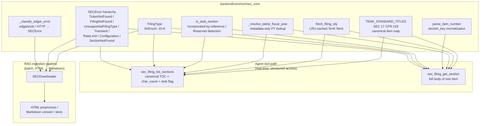

# sec_core

Shared SEC filing layer used by both the agent's two-step section tools and the RAG ingestion pipeline. Implementation lives at `backend/common/sec_core.py`.

## Why a shared core

FinLab-X has two consumers of SEC EDGAR, with very different shapes:

- **Agent tool path** (`backend/agent_engine/tools/sec_filing_tools.py`) — answers natural-language questions about a single 10-K item per turn. Reads the filing's structured `TenK` object directly via edgartools and returns plain text inline; never goes near markdown conversion or local caching.
- **RAG ingestion pipeline** (`backend/ingestion/sec_filing_pipeline/`) — bulk-downloads filings, converts HTML → Markdown, and persists `.md` files for downstream chunking + embedding. Optimized for offline batch runs and S3-style cache reuse, not single-call latency.

Both paths still need the same domain primitives: a `FilingType` enum, a stable error hierarchy that callers can branch on, the canonical SEC item table, and one place that knows how to map raw edgartools / HTTP errors to typed exceptions. Without `sec_core`, those primitives would be duplicated and would drift.

The thicker dependency on the agent side is intentional: agent calls are the latency-sensitive path that benefits most from a shared cache and a unified resolution rule, while the pipeline only needs the typed-error contract and the enum to stay aligned with the agent's `SECError`-aware callers.

## Design note: no app-level retry on SEC 429

By the time `_classify_edgar_error` sees a `TooManyRequestsError`, edgartools' own backoff is exhausted and SEC has typically issued a ~10-minute IP block; SEC's docs warn against immediate retry. We surface `RateLimitError` with the `Retry-After` seconds populated and let the caller stop rather than spin.

## Extending to a new SEC filing type

1. Add a variant to `FilingType` and a corresponding `TENQ_STANDARD_TITLES`-style constant.
2. Decide whether `parse_item_number`'s normalization rule is the same — if items can collide across Parts, introduce a per-filing-type key scheme instead.
3. Update `_classify_edgar_error`'s `UnsupportedFilingTypeError` branch (currently hard-codes the 20-F fallback for FPI detection on 10-K-only callers).
4. Re-evaluate `is_stub_section` thresholds against real samples from the new filing type before reusing.
