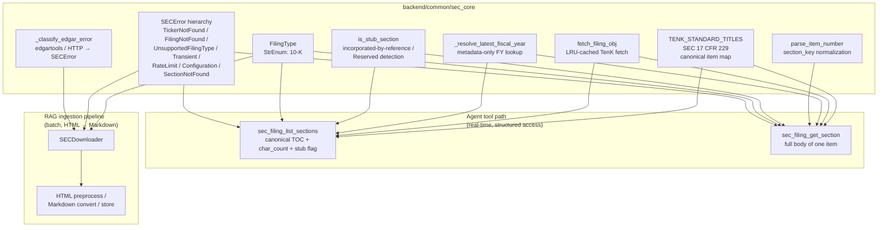

# common

Cross-subsystem domain types and helpers that more than one feature area depends on. Today this package only contains `sec_core` — the shared SEC filing layer used by both the agent's two-step section tools and the RAG ingestion pipeline.

## Why a shared core for SEC

FinLab-X has two consumers of SEC EDGAR, with very different shapes:

- **Agent tool path** (`backend/agent_engine/tools/sec_filing_tools.py`) — answers natural-language questions about a single 10-K item per turn. Reads the filing's structured `TenK` object directly via edgartools and returns plain text inline; never goes near markdown conversion or local caching.
- **RAG ingestion pipeline** (`backend/ingestion/sec_filing_pipeline/`) — bulk-downloads filings, converts HTML → Markdown, and persists `.md` files for downstream chunking + embedding. Optimized for offline batch runs and S3-style cache reuse, not single-call latency.

Both paths still need the same domain primitives: a `FilingType` enum, a stable error hierarchy that callers can branch on, the canonical SEC item table, and one place that knows how to map raw edgartools / HTTP errors to typed exceptions. Without `sec_core`, those primitives would be duplicated and would drift.

The thicker dependency on the agent side is intentional: agent calls are the latency-sensitive path that benefits most from a shared cache and a unified resolution rule, while the pipeline only needs the typed-error contract and the enum to stay aligned with the agent's `SECError`-aware callers.

## Map

- `sec_core.py` — single module, intentionally flat. No further submodules until this package gains a second domain.
- `__init__.py` — empty (no re-exports). Import from `backend.common.sec_core` directly so the import surface stays explicit.

## Design notes

### `TENK_STANDARD_TITLES` is a constant, not parsed from filing text

Section titles in 10-K filings are governed by SEC 17 CFR 229 — they are a fixed, regulator-defined list. Parsing them out of `section.text()` is unreliable in practice: the first line varies by issuer (`ITEM 1.BUSINESS` vs `Item 1.\xa0\xa0\xa0\xa0Business` vs the literal string `Table of Contents` for some sections of some filers). Looking up the title in a 23-entry constant map is correct by construction; parsing is correct only when issuers happen to format consistently.

### `section_key` is a normalized item number, not the native edgartools key

`edgar.TenK.document.sections` exposes keys like `part_i_item_1a` or `Item 1A.` depending on the filing. Agents should not have to know which form of the key the underlying library happens to return. `parse_item_number` accepts forgiving inputs (`"1a"`, `"Item 1A"`, `"  ITEM 1A. "`) and yields a canonical lowercase key (`1a`) that maps directly into `TENK_STANDARD_TITLES`. Anything that doesn't normalize raises `SectionNotFoundError` with guidance to call `list_sections` first.

### Item number alone is enough — Part is intentionally dropped

Item numbers are unique within a 10-K (there is no second "Item 7"), so Part I/II/III/IV adds no identification value over `1a / 7 / 7a`. Both the agent's TOC payload and any downstream metadata would only get noisier by including Part. If a future filing type breaks this assumption (e.g. 10-Q with overlapping item numbers across parts), the right move is a per-filing-type key scheme, not retrofitting Part onto 10-K.

### `fetch_filing_obj` cache key includes `fiscal_year`

The LRU cache is keyed by `(ticker_upper, filing_type, fiscal_year)`. `fiscal_year=None` resolves "latest" and is its own cache slot; passing the resolved integer is a different slot. The agent's system prompt instructs the model to forward the resolved FY from `list_sections` into `get_section` so the two calls share one cache entry. Without that hint, `None`-then-int would fetch the filing twice on a follow-up turn.

### `fiscal_year` follows the company's accounting calendar, not the calendar year

A filing's fiscal year is the year that contains the company's `period_of_report`. NVDA's FY2026 ends 2026-01-25; AAPL's FY2025 ends 2025-09-27. The metadata-only resolver `_resolve_latest_fiscal_year` reads `period_of_report` from the filing index without calling `filing.obj()`, so callers can resolve "latest" cheaply before deciding whether to download the full 10-K.

### Stub detection: bracketed `[Reserved]` only, with a 100-char residual threshold

`is_stub_section` classifies an item body as either an incorporated-by-reference stub (Items 10–14 commonly point to the proxy statement) or a Reserved/deprecated sentinel (Item 6 since 2021). The Reserved match is intentionally narrow — only the literal `[Reserved]` bracket form, not bare "Reserved" in prose, since the latter appears in real section bodies. The incorp-by-reference branch drops the pointer sentence and any markdown links, then requires fewer than 100 residual characters before classifying as stub; above that threshold the section likely contains substantive commentary alongside the pointer and we decline to suppress it.

### No app-level retry on SEC 429

When `edgar.httprequests.TooManyRequestsError` propagates to `_classify_edgar_error`, edgartools' own conservative-rate-limit + exponential-backoff retry has already been exhausted and SEC has typically issued a ~10-minute IP block. SEC's documentation explicitly warns against immediate retry. We surface `RateLimitError` with `retry_after` populated from the `Retry-After` header (integer seconds — SEC's observed form) and let the caller decide; the agent's correct response is to stop and report rather than spin.

## Extending

Adding a new SEC filing type (e.g. 10-Q):

1. Add a variant to `FilingType` and a corresponding `TENQ_STANDARD_TITLES` constant.
2. Decide whether `parse_item_number`'s normalization rule is the same — if items can collide across Parts, introduce a per-filing-type key scheme instead.
3. Update `_classify_edgar_error`'s `UnsupportedFilingTypeError` branch (currently hard-codes the 20-F fallback for FPI detection on 10-K-only callers).
4. Re-evaluate `is_stub_section` thresholds against real samples from the new filing type before reusing.

Adding a new shared domain to `backend/common/`:

- Land it as a new sibling module (`backend/common/<domain>_core.py`) plus its own README section here. Keep cross-domain imports out of `sec_core.py` — the package's value is that each module stays narrow.
