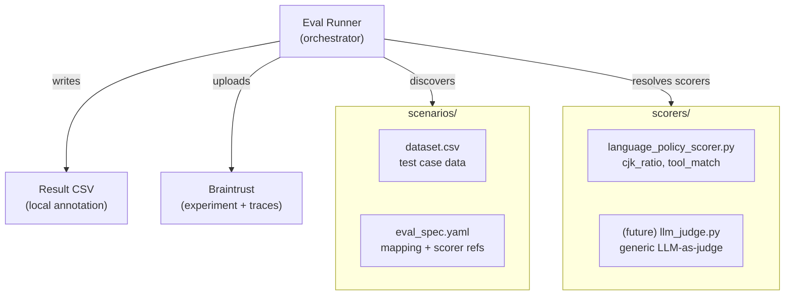
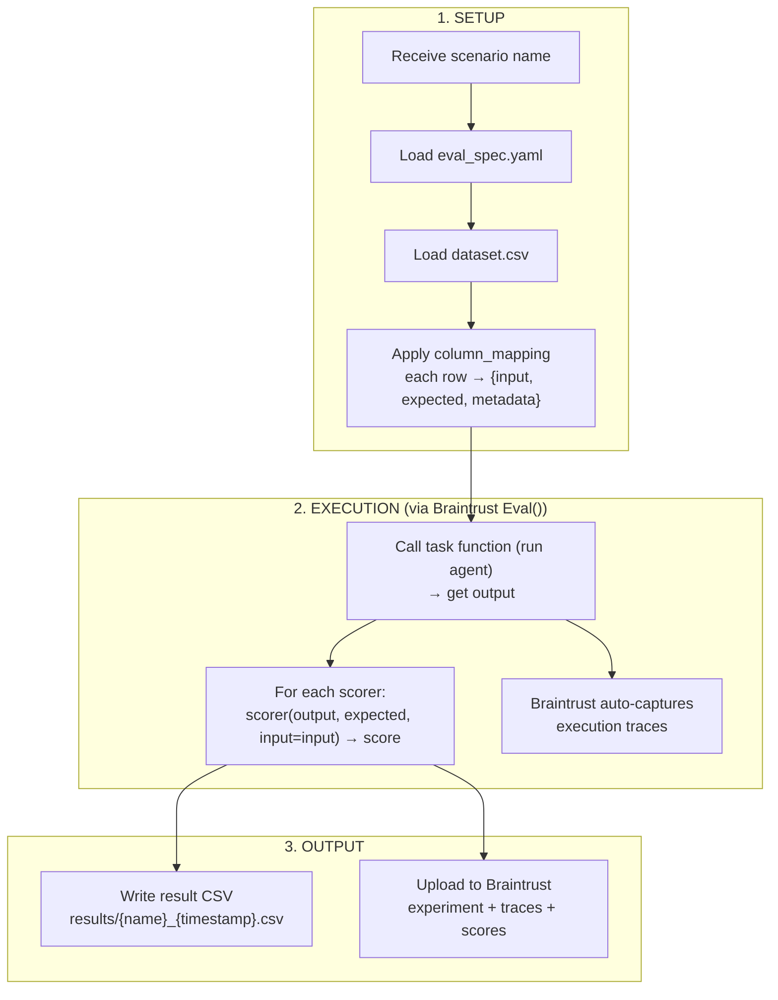
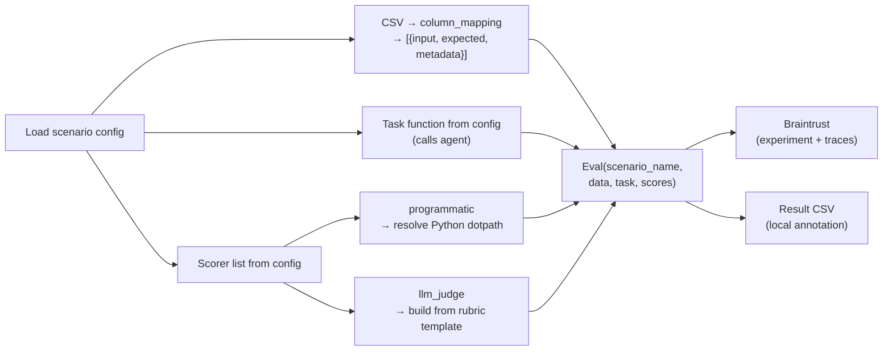

# Evaluation System — Architecture & Design Decisions

> For day-to-day usage (running evals, adding scenarios/scorers), see [README.md](./README.md).

## Component Overview

**Discovery mechanism (convention-based):** The runner scans `scenarios/`. Any subdirectory containing an `eval_spec.yaml` is treated as a scenario — no registry file needed.

## Data Flow

## Platform Integration Model

Two observability platforms coexist with distinct roles:

| Platform | Role | When Active |
|----------|------|-------------|
| **Langfuse** | Tracing & observability | Always (local + production) |
| **Braintrust** | Eval experiments: execution, scoring, experiment diff, trace drill-down | Eval runner process only |

### Coexistence mechanism

| Platform | Registration | Lifecycle | Scope |
|----------|-------------|-----------|-------|
| **Braintrust** | `set_global_handler()` — global, set once at eval runner startup | Process-wide | Eval experiment tracking + scoring |
| **Langfuse** | `config={"callbacks": [handler]}` — per-request, passed at agent invocation | Per-invocation | Trace observability |

Key rules:

- `set_global_handler()` is called **only in the eval runner entry point**, never in shared agent code or the API server.
- Production environments only have Langfuse; Braintrust is not imported.
- Coexistence uses LangChain callback paths (not OpenTelemetry) to avoid global `TracerProvider` conflicts.

### Eval runner assembly flow

All computation runs locally. The runner executes dataset iteration, task function calls, and scorer evaluation on the local machine, then **uploads** results to Braintrust for storage and visualization. Braintrust does not re-execute anything.

## Key Decisions

| Decision | Choice | Rationale |
|----------|--------|-----------|
| Task function source | `eval_spec.yaml` specifies a Python dotpath | Different scenarios may test different agents or prompts |
| LLM-judge implementation | `autoevals.LLMClassifier` with Mustache rubric | Native integration with Braintrust `Eval()`, unified scorer interface |
| Result CSV naming | `{scenario}_{timestamp}.csv` | Each run is preserved (no overwrite), convenient for annotation review |
| Braintrust toggle | `--local-only` flag | Pure local during development, upload to Braintrust for formal comparison |
| Trace destination | Eval runner sends to both Braintrust + Langfuse; production sends only to Langfuse | Both dashboards available during eval; production uses only Langfuse |
| Result CSV default path | `results/` (relative to evals dir), overridable with `--output-dir` | Sensible default, reduces required arguments |
| Task function return type | Full `OrchestratorResult` dict (not plain string) | Scorers like `tool_arg_no_cjk` need `output["tool_outputs"]` for inspection |
| Config filename | `eval_spec.yaml` (not `config.yaml`) | More descriptive, avoids confusion with other config files |

## Constraints & Tradeoffs

### Constraints

| Constraint | Impact |
|------------|--------|
| CSV must be editable in Google Sheets | Column values are flat string/number — no nested JSON |
| Braintrust `Eval()` expects `{input, expected, metadata}` | `column_mapping` must assemble CSV into these three buckets |
| Scorer signature: `(output, expected, *, input) → Score` | Aligns with autoevals convention; all scorers (including LLM-judge) follow this interface |
| Dual-platform via LangChain callbacks, not OTel | Avoids global `TracerProvider` conflicts between Langfuse and Braintrust |

### Tradeoffs

| Tradeoff | Chosen | Gave Up |
|----------|--------|---------|
| Convention over configuration | File structure = registry, zero registration | Explicit registry file |
| YAML config over Python wrappers | Adding a scenario requires no Python | Full Python flexibility per scenario (can add escape hatch later) |
| Braintrust for eval | Powerful experiment diff + trace drill-down | Maintaining a second platform account |
| Result CSV never overwritten | Full history preserved for annotation | Disk space (can periodically clean up) |

### Out of Scope

- Dataset auto-generation pipeline
- CI-triggered eval (manual execution first)
- Langfuse ↔ Braintrust bidirectional sync
- Production online evaluation (offline evaluation first)

