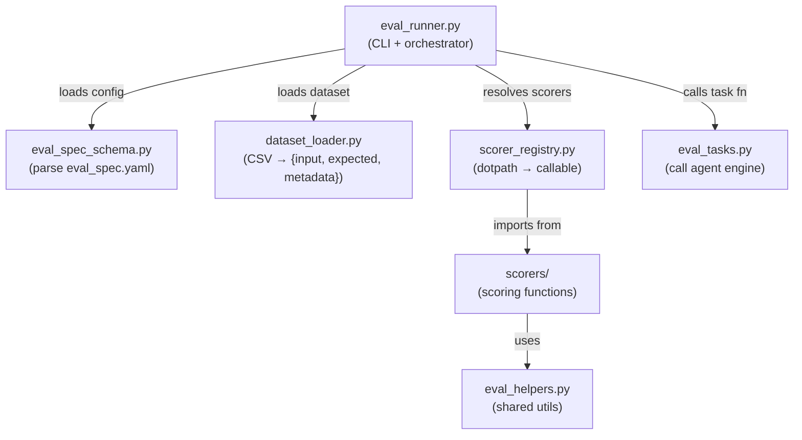
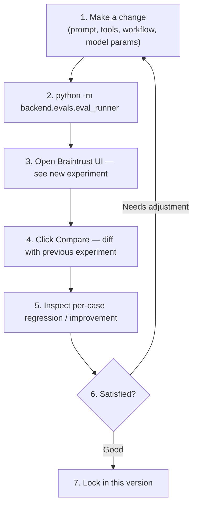

# Evaluation System

> For architecture diagrams, design decisions, and platform integration details, see [ARCHITECTURE.md](./ARCHITECTURE.md).

This folder has two different evaluation tracks. They serve different goals and should not be mixed.

## Two Evaluation Tracks

| Track                | Goal                                                 | Entry Point                                               | Typical Frequency               | Output                                      |
| -------------------- | ---------------------------------------------------- | --------------------------------------------------------- | ------------------------------- | ------------------------------------------- |
| Regression Guardrail | Catch severe regressions on critical behavior        | `pytest` (`backend/evals/test_*.py`)                      | Before merge / release gate     | pytest pass/fail                            |
| Quality Improvement  | Measure agent quality changes over scenario datasets | `eval_runner` (`python -m backend.evals.eval_runner ...`) | Prompt iteration / model tuning | Result CSV + optional Braintrust experiment |

Use this rule:

- If the question is "did we break critical behavior?" -> **Regression Guardrail** (`pytest`)
- If the question is "did quality improve across scenarios?" -> **Quality Improvement** (`eval_runner`)

## Diagnostic Human Review

`near_v1_diagnostic` 是一條獨立的人工診斷軌，不是 golden-answer scoring，也不是 LLM judge。

- Braintrust: 看 execution、experiment compare、trace drill-down
- Langfuse: 看 trace metadata、人工 annotation、scores export
- 本地工具: `annotation_export_joiner` 把 Langfuse export 回接 dataset；`compare_guard` 先檢查兩個 run 能不能比

常用指令：

```bash
# Full local diagnostic run
uv run python -m backend.evals.eval_runner near_v1_diagnostic --local-only

# Single-row subset
uv run python -m backend.evals.eval_runner near_v1_diagnostic --local-only --row-ids 1 --run-label smoke-local

# Field-filter subset
uv run python -m backend.evals.eval_runner near_v1_diagnostic --local-only --field-filter capability_band=boundary --run-label boundary-local

# Manifest-defined subset
uv run python -m backend.evals.eval_runner near_v1_diagnostic --local-only --manifest /tmp/diagnostic-row-ids.txt --run-label manifest-local

# Braintrust platform mode
uv run python -m backend.evals.eval_runner near_v1_diagnostic --run-label smoke-platform --output-dir /tmp/near-v1-diagnostic-platform

# Provision one Langfuse annotation queue with triage + diagnostic score configs
uv run python -m backend.evals.diagnostic.langfuse_annotation_setup

# Join Langfuse scores export back to dataset rows
uv run python -m backend.evals.diagnostic.annotation_export_joiner \
  --dataset backend/evals/scenarios/near_v1_diagnostic/dataset.csv \
  --scores-export /path/to/langfuse_scores.csv \
  --dataset-name near_v1_diagnostic \
  --run-label smoke-local \
  --output /tmp/near-v1-diagnostic-discussion.csv

# Check whether two diagnostic runs are comparable before reading Braintrust compare
uv run python -m backend.evals.diagnostic.compare_guard \
  --run-a-manifest /tmp/run-a-manifest.csv \
  --run-b-manifest /tmp/run-b-manifest.csv \
  --output /tmp/diagnostic-compare-guard.json
```

Braintrust Project Settings 應設定穩定的 diagnostic comparison key，例如 `row_id`。這樣 compare UI 才會對齊同一筆 dataset row，而不是只靠 trace 順序或 experiment 內部索引。

Langfuse Human Annotation 需要先建立 Score Config。Free plan 若只能使用一個 Annotation Queue，直接使用預設的 `diagnostic_triage_v1` profile：

```bash
uv run python -m backend.evals.diagnostic.langfuse_annotation_setup
```

它會建立一個 queue：`near-v1-diagnostic-review-v1`，並綁定同一組 score configs：

- `triage_outcome`: 第一輪只標 `good` / `bad`，用來篩出需要後續追蹤的 traces
- `observed_*` / `review_*`: 第二輪深入診斷使用

若只想建立 Score Config，不建立 Annotation Queue，可加 `--score-configs-only`。

## Running Evaluations

### 1) Quality Improvement (Scenario Runner)

This is the primary flow for dataset-based quality evaluation.

```bash
# Local mode (recommended for development)
uv run python -m backend.evals.eval_runner language_policy --local-only

# Platform mode (uploads to Braintrust)
uv run python -m backend.evals.eval_runner language_policy

# Run all scenarios
uv run python -m backend.evals.eval_runner --all --local-only

# Custom output folder
uv run python -m backend.evals.eval_runner language_policy --local-only --output-dir ./tmp/eval-results
```

### 2) Regression Guardrail (pytest)

Use this for a compact "no serious regression" signal.

```bash
# Run guardrail eval tests
uv run pytest backend/evals/ -m eval -v --tb=short

# Run one case
uv run pytest backend/evals/ -m eval -k "LP-01" -v

# Unit tests only (CI default)
uv run pytest
```

`pyproject.toml` sets `testpaths = ["backend/tests"]` and `addopts = "-m 'not eval'"`, so bare `uv run pytest` excludes eval-marked tests unless explicitly requested.

## Prerequisites

Both tracks call real LLM/tools. Configure environment variables in `backend/.env`.

| Variable             | Guardrail (pytest) | Quality Improvement (`--local-only`) | Quality Improvement (Braintrust mode) | Purpose           |
| -------------------- | ------------------ | ------------------------------------ | ------------------------------------- | ----------------- |
| `OPENAI_API_KEY`     | Yes                | Yes                                  | Yes                                   | LLM calls         |
| `TAVILY_API_KEY`     | Scenario-dependent | Scenario-dependent                   | Scenario-dependent                    | Search tool calls |
| `EDGAR_IDENTITY`     | Scenario-dependent | Scenario-dependent                   | Scenario-dependent                    | SEC retrieval     |
| `QDRANT_URL`         | Scenario-dependent | Scenario-dependent                   | Scenario-dependent                    | Vector store (sec_retrieval) |
| `BRAINTRUST_API_KEY` | No                 | No                                   | Yes                                   | Braintrust upload |
| `LANGFUSE_PUBLIC_KEY`| No                 | Diagnostic export review only        | Diagnostic export review only         | Langfuse read/write |
| `LANGFUSE_SECRET_KEY`| No                 | Diagnostic export review only        | Diagnostic export review only         | Langfuse read/write |
| `LANGFUSE_BASE_URL`  | No                 | Diagnostic export review only        | Diagnostic export review only         | Langfuse host      |

If `BRAINTRUST_API_KEY` is missing and `--local-only` is not set, `eval_runner` fails fast.

## File Manifest

### Core modules

| File | Role |
|------|------|
| `eval_runner.py` | CLI entry point and orchestrator. Discovers scenarios, assembles Braintrust `Eval()` calls, writes result CSV. |
| `eval_spec_schema.py` | Pydantic models for `eval_spec.yaml` and `braintrust_config.yaml`. Validates and parses scenario configs. |
| `dataset_loader.py` | Reads CSV files and applies `column_mapping` to produce `{input, expected, metadata}` dicts for each row. |
| `scorer_registry.py` | Resolves scorer dotpaths to Python callables. Builds `LLMClassifier` instances for `llm_judge` type scorers. |
| `eval_tasks.py` | Task functions that wrap the agent engine. Called by `Eval()` for each dataset row to produce agent output. |
| `eval_helpers.py` | Shared utilities (CJK detection, character ratio) used by scorers and guardrail tests. |
| `braintrust_config.yaml` | Project-level Braintrust settings (project name, API key env var, local mode flag). |

### How they connect



### Scenario directories

Each subdirectory under `scenarios/` with an `eval_spec.yaml` is auto-discovered as a scenario.

```
scenarios/
├── language_policy/
│   ├── eval_spec.yaml     # Task function, column mapping, scorer list
│   └── dataset.csv        # Test cases (one row = one eval case)
└── sec_retrieval/
    ├── eval_spec.yaml     # Retrieval scorers (recall, MRR, MAP), status: draft
    └── dataset.csv        # 10 queries across 3 query types (see scenario README)
```

### Other files

| File | Role |
|------|------|
| `conftest.py` | pytest fixtures for guardrail eval tests. |
| `test_language_policy.py` | Regression guardrail tests (pytest). |
| `results/` | Output directory for result CSVs (git-ignored). |

### Design guidelines

- Prefer programmatic scorers when checks are structurally decidable.
- Use LLM-as-judge only when semantic judgment is required.
- Keep guardrail tests (`test_*.py`) compact and stable — they are not the vehicle for broad quality analysis.

## Eval Spec YAML Schema

Each scenario is configured by an `eval_spec.yaml` file. Full schema:

```yaml
name: string                    # Scenario name, also used as Braintrust experiment name
status: string                  # (optional) "draft" prints a warning; omit for production scenarios
csv: string                     # Dataset filename (default: dataset.csv)

task:
  function: string              # Python dotpath, e.g. "backend.evals.eval_tasks.run_v1"

column_mapping:
  <csv_column>: input           # Single column → input (string)
  <csv_column>: input.<field>   # Multiple columns → input object fields
  <csv_column>: expected.<field>
  <csv_column>: metadata.<field>

scorers:
  - name: string
    function: string            # Python dotpath, e.g. "backend.evals.scorers.language_policy_scorer.response_language"

  - name: string
    type: llm_judge
    rubric: string              # Mustache template, can use {{input}}, {{expected.field}}
    model: string               # (optional) LLM model, e.g. "gpt-4o"
    use_cot: bool               # (optional) Chain-of-thought before scoring, default false
    choice_scores:              # (optional) LLM choice → score mapping, default {"Y": 1.0, "N": 0.0}
      Y: 1.0
      N: 0.0
```

## Quality Iteration Workflow

Use this loop when tuning the agent — whether changing prompts, tool configurations, workflow structure, or model parameters.



## Implementation Guidelines

### Add a new quality-improvement scenario

1. Create `backend/evals/scenarios/<scenario_name>/`.
2. Add `dataset.csv` and `eval_spec.yaml` (see [schema above](#eval-spec-yaml-schema)).
3. Add/update task functions in `backend/evals/eval_tasks.py`.
4. Add/update scorers under `backend/evals/scorers/`.
5. Run `uv run python -m backend.evals.eval_runner <scenario_name> --local-only`.

### Add a new regression guardrail

1. Add/update `backend/evals/test_*.py` with `@pytest.mark.eval`.
2. Keep assertions focused on severe regression signals.
3. Run `uv run pytest backend/evals/ -m eval -v`.

### Separation rule (important)

- Do not force broad quality-improvement evaluations into pytest.
- Do not overload guardrail tests with large exploratory datasets.
- Keep `pytest` for **regression gate** and `eval_runner` for **quality iteration**.

## Future Implementation

When adding LlamaIndex-based evaluations, Braintrust integration should use
`braintrust[otel]` plus an OpenTelemetry exporter, keeping tracing explicit and
separate from evaluation logic.
