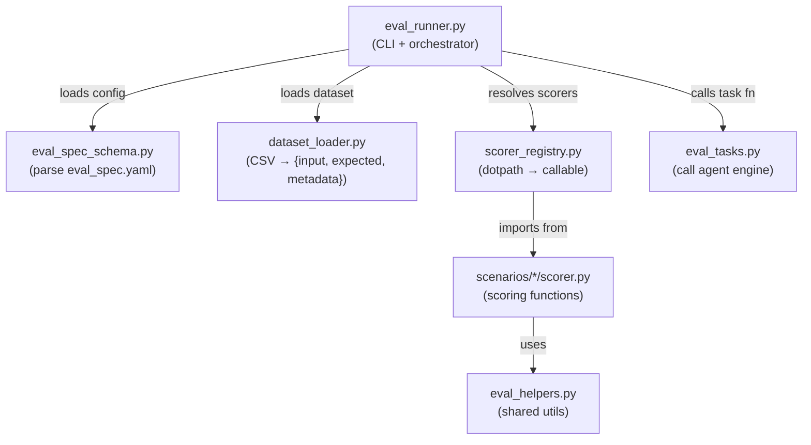
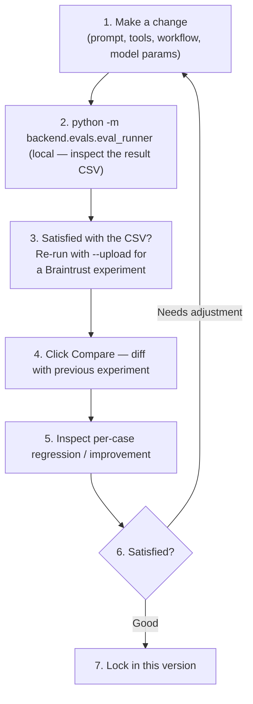

# Evaluation System

> For architecture diagrams, design decisions, and platform integration details, see [ARCHITECTURE.md](./ARCHITECTURE.md).

This folder has two different evaluation tracks. They serve different goals and should not be mixed.

## Two Evaluation Tracks

| Track                   | Goal                                                 | Entry Point                                               | Typical Frequency               | Output                                      |
| ----------------------- | ---------------------------------------------------- | --------------------------------------------------------- | ------------------------------- | ------------------------------------------- |
| Regression Suite        | Catch severe regressions on critical behavior        | `pytest` (`backend/evals/test_*.py`)                      | Before merge / release gate     | pytest pass/fail                            |
| Quality Track           | Measure agent quality changes over scenario datasets | `eval_runner` (`python -m backend.evals.eval_runner ...`) | Prompt iteration / model tuning | Result CSV + optional Braintrust experiment |

Use this rule:

- If the question is "did we break critical behavior?" -> **Regression Suite** (`pytest`)
- If the question is "did quality improve across scenarios?" -> **Quality Track** (`eval_runner`)

## Diagnostic Human Review

`baseline_behavior_diagnostic` is a standalone human-diagnostic track — not golden-answer scoring, not an LLM judge.

- Automatic half: a deterministic execution scorer, run via the normal Quality Track command
- Human half: the annotation loop is being rebuilt on Braintrust per ADR-0005 (DEV-115); the reviewer score schema and session-id join contract are documented in the scenario README

Common commands:

```bash
# Full local diagnostic run (no upload by default)
uv run python -m backend.evals.eval_runner baseline_behavior_diagnostic

# Row-id subset — smoke runs, debugging, and failed-row reruns only.
# Authoritative runs and cross-version comparisons use the full dataset. A subset
# run records `selected_row_ids` and `is_full_dataset: false` in its experiment
# metadata, so its numbers can never be read as representing the whole dataset.
uv run python -m backend.evals.eval_runner baseline_behavior_diagnostic --row-ids 1 --run-label smoke-local

# Upload to Braintrust as an experiment
uv run python -m backend.evals.eval_runner baseline_behavior_diagnostic --upload --run-label smoke-platform
```

Braintrust Project Settings should set a stable diagnostic comparison key, e.g. `row_id`, so the compare UI aligns the same dataset row instead of relying on trace order or an experiment's internal index.

## Running Evaluations

### 1) Quality Track (Scenario Runner)

This is the primary flow for dataset-based quality evaluation.

```bash
# Local mode (default — needs OPENAI_API_KEY, but no BRAINTRUST_API_KEY)
uv run python -m backend.evals.eval_runner language_policy

# Upload mode (creates a Braintrust experiment)
uv run python -m backend.evals.eval_runner language_policy --upload

# Run all scenarios
uv run python -m backend.evals.eval_runner --all

# Custom output folder
uv run python -m backend.evals.eval_runner language_policy --output-dir ./tmp/eval-results
```

### 2) Regression Suite (pytest)

Use this for a compact "no serious regression" signal.

> **Currently empty.** The one existing guardrail test was retired as part of the
> scenario-first SSOT consolidation (DEV-89); this track is being rebuilt as a
> `regression/` package in a follow-up ticket. The commands below describe the
> intended usage once that lands — running them today collects zero tests.

```bash
# Run regression-suite eval tests
uv run pytest backend/evals/ -m eval -v --tb=short

# Unit tests only (CI default)
uv run pytest
```

`pyproject.toml` sets `testpaths = ["backend/tests"]` and `addopts = "-m 'not eval'"`, so bare `uv run pytest` excludes eval-marked tests unless explicitly requested.

## Prerequisites

Both tracks call real LLM/tools. Configure environment variables in `backend/.env`.

| Variable             | Regression Suite (pytest) | Quality Track (default) | Quality Track (`--upload`) | Purpose           |
| -------------------- | ------------------ | ------------------------------ | --------------------------------- | ----------------- |
| `OPENAI_API_KEY`     | Yes                | Yes                             | Yes                                | LLM calls         |
| `TAVILY_API_KEY`     | Scenario-dependent | Scenario-dependent              | Scenario-dependent                 | Search tool calls |
| `EDGAR_IDENTITY`     | Scenario-dependent | Scenario-dependent              | Scenario-dependent                 | SEC retrieval     |
| `QDRANT_URL`         | Scenario-dependent | Scenario-dependent              | Scenario-dependent                 | Vector store (sec_retrieval) |
| `BRAINTRUST_API_KEY` | No                 | No                              | Yes                                 | Braintrust upload |

`eval_runner` never needs `BRAINTRUST_API_KEY` by default — it runs and scores
locally, no upload. Passing `--upload` without the key set fails fast
(preflight, before any scenario work runs) rather than silently falling back
to local-only.

## File Manifest

### Core modules

| File | Role |
|------|------|
| `eval_runner.py` | CLI entry point and orchestrator. Discovers scenarios, assembles Braintrust `Eval()` calls, writes result CSV. |
| `eval_spec_schema.py` | Pydantic models for `eval_spec.yaml` and `braintrust_config.yaml`. Validates and parses scenario configs. |
| `dataset_loader.py` | Reads CSV files and applies `column_mapping` to produce `{input, expected, metadata}` dicts for each row. |
| `scorer_registry.py` | Resolves scorer dotpaths to Python callables. Builds `LLMClassifier` instances for `llm_judge` type scorers. |
| `eval_tasks.py` | Task functions that wrap the agent engine. Called by `Eval()` for each dataset row to produce agent output. |
| `eval_helpers.py` | Shared utilities (CJK detection, character ratio) used by scorers and regression-suite tests. |
| `braintrust_config.yaml` | Project-level Braintrust settings (project name, API key env var). |

### How they connect


```mermaid
graph TD
    CLI["eval_runner.py<br/>(CLI + orchestrator)"]
    Config["eval_spec_schema.py<br/>(parse eval_spec.yaml)"]
    Loader["dataset_loader.py<br/>(CSV → {input, expected, metadata})"]
    Registry["scorer_registry.py<br/>(dotpath → callable)"]
    Tasks["eval_tasks.py<br/>(call agent engine)"]
    Scorers["scenarios/*/scorer.py<br/>(scoring functions)"]
    Helpers["eval_helpers.py<br/>(shared utils)"]

    CLI -->|loads config| Config
    CLI -->|loads dataset| Loader
    CLI -->|resolves scorers| Registry
    CLI -->|calls task fn| Tasks
    Registry -->|imports from| Scorers
    Scorers -->|uses| Helpers
```

### Scenario directories

Each subdirectory under `scenarios/` with an `eval_spec.yaml` is auto-discovered as a scenario.

```
scenarios/
├── language_policy/
│   ├── eval_spec.yaml     # Task function, column mapping, scorer list
│   ├── dataset.csv        # Test cases (one row = one eval case)
│   └── scorer.py          # Scoring functions (tool_arg_no_cjk, response_language)
├── on_target_company/
│   ├── eval_spec.yaml     # LLM-judge scorer for on-target company focus
│   ├── dataset.csv        # Test cases (one row = one eval case)
│   └── rubric.md          # Judge rubric (referenced via rubric_file)
└── sec_retrieval/
    ├── eval_spec.yaml     # Retrieval scorers (recall, MRR, MAP), status: draft
    ├── dataset.csv        # 10 queries across 3 query types (see scenario README)
    └── scorer.py          # Retrieval scoring functions (recall@k, MRR, MAP)
```

### Other files

| File | Role |
|------|------|
| `conftest.py` | pytest fixtures for eval-path tests. |
| `results/` | Output directory for result CSVs (git-ignored). |

### Design guidelines

- Prefer programmatic scorers when checks are structurally decidable.
- Use LLM-as-judge only when semantic judgment is required.
- Keep regression-suite tests (`test_*.py`) compact and stable — they are not the vehicle for broad quality analysis.

## Eval Spec YAML Schema

Each scenario is configured by an `eval_spec.yaml` file. Full schema:

```yaml
name: string                    # Scenario name, also used as Braintrust experiment name
status: string                  # (optional) "draft" prints a warning; omit for production scenarios
csv: string                     # Dataset filename (default: dataset.csv)

regression:
  enabled: bool                 # Required, no default — every scenario must declare
                                # its gate membership; a spec without it fails to load

task:
  function: string              # Python dotpath, e.g. "backend.evals.eval_tasks.run_v1"

column_mapping:
  <csv_column>: input           # Single column → input (string)
  <csv_column>: input.<field>   # Multiple columns → input object fields
  <csv_column>: expected.<field>
  <csv_column>: metadata.<field>

column_types:                   # (optional) pin how specific CSV columns are parsed
  <csv_column>: json            # one of: json | str | float | bool

scorers:
  - name: string
    function: string            # Python dotpath, e.g. "backend.evals.scenarios.language_policy.scorer.response_language"
    gate: bool                  # (optional) Counts toward the regression gate, default true
    metric_floor: float         # (optional) Dataset-level metric floor for the gate,
                                # default 1.0; only meaningful when gate is true

  - name: string
    type: llm_judge
    rubric_file: string         # Rubric file path, relative to the scenario dir.
                                # Required for llm_judge; inline `rubric:` in the
                                # YAML is rejected at load time. The file content
                                # is a Mustache template, can use {{input}},
                                # {{expected.field}}
    model: string               # (optional) LLM model, e.g. "gpt-4o"
    use_cot: bool               # (optional) Chain-of-thought before scoring, default false
    temperature: float          # (optional) Judge sampling temperature, default 0.0; llm_judge only
    choice_scores:              # (optional) LLM choice → score mapping, default {"Y": 1.0, "N": 0.0}
      Y: 1.0
      N: 0.0
```

### `column_types` (optional)

`column_types` maps a CSV column name to one of `json` | `str` | `float` | `bool`,
pinning how that column's cell is parsed. It is optional; a column not listed
falls back to auto-detection (`_convert_cell`: empty → `None`, `true`/`false` →
bool, float-parseable → float, otherwise str). Two real uses:

- `json` — for list/dict columns stored as JSON strings (the `sec_retrieval`
  case). Without it, a cell like `["NVDA / 2026 / Part I / Item 1A"]` stays a raw
  string and downstream scorers iterate it character-by-character, turning
  recall/MRR/MAP into noise.
- `str` — to keep an identifier column (e.g. a ticker `"TRUE"`) from being
  coerced to bool or float by auto-detection.

## Quality Iteration Workflow

Use this loop when tuning the agent — whether changing prompts, tool configurations, workflow structure, or model parameters.


```mermaid
graph TD
    A["1. Make a change<br/>(prompt, tools, workflow, model params)"]
    B["2. python -m backend.evals.eval_runner <scenario><br/>(local — inspect the result CSV)"]
    C["3. Satisfied with the CSV?<br/>Re-run with --upload for<br/>a Braintrust experiment"]
    D["4. Click Compare — diff with previous experiment"]
    E["5. Inspect per-case regression / improvement"]
    F{"6. Satisfied?"}
    G["7. Lock in this version"]

    A --> B --> C --> D --> E --> F
    F -->|Needs adjustment| A
    F -->|Good| G
```

## Implementation Guidelines

### Add a new quality-improvement scenario

1. Create `backend/evals/scenarios/<scenario_name>/`.
2. Add `dataset.csv` and `eval_spec.yaml` (see [schema above](#eval-spec-yaml-schema)).
3. Add/update task functions in `backend/evals/eval_tasks.py`.
4. Add/update scoring functions in `backend/evals/scenarios/<scenario_name>/scorer.py`.
5. Run `uv run python -m backend.evals.eval_runner <scenario_name>`.

### Add a new regression-suite case

> This track is currently being rebuilt as a `regression/` package (DEV-89
> follow-up); the steps below describe the pre-rebuild pattern for reference only.

1. Add/update `backend/evals/test_*.py` with `@pytest.mark.eval`.
2. Keep assertions focused on severe regression signals.
3. Run `uv run pytest backend/evals/ -m eval -v`.

### Separation rule (important)

- Do not force broad quality-improvement evaluations into pytest.
- Do not overload regression-suite tests with large exploratory datasets.
- Keep `pytest` for **regression gate** and `eval_runner` for **quality iteration**.

## Future Implementation

When adding LlamaIndex-based evaluations, Braintrust integration should use
`braintrust[otel]` plus an OpenTelemetry exporter, keeping tracing explicit and
separate from evaluation logic.
