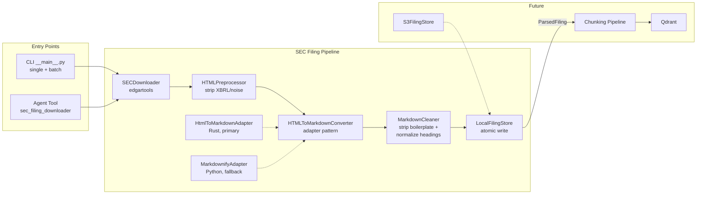

# SEC Filing Pipeline

Downloads SEC 10-K filings, converts them to RAG-friendly Markdown with YAML frontmatter, and caches locally.

## Architecture



## Pipeline Stages

| Stage | File | Responsibility |
|-------|------|----------------|
| Download | `sec_downloader.py` | Fetches filing HTML from SEC EDGAR via edgartools. Maps edgartools exceptions to domain errors. Requires `EDGAR_IDENTITY` env var. |
| Preprocess | `html_preprocessor.py` | Strips XBRL tags, removes decorative styles/hidden elements, unwraps `<font>` tags, normalizes hard-wrapped text whitespace (browser-equivalent collapsing), and promotes SEC Item patterns to semantic `<h>` headings. |
| Convert | `html_to_md_converter.py` | Converts cleaned HTML to Markdown. Primary: html-to-markdown (Rust-based). Fallback: markdownify (pure Python, for linux-aarch64). |
| Clean Markdown | `markdown_cleaner.py` | Strips converter-output boilerplate that has zero RAG value (cover pages, page separators, Part III stubs), and normalizes inconsistent Part / Item heading shapes across tickers. Conservative — preserves any section with substantive real content. See [Markdown Cleanup](#markdown-cleanup) below. |
| Store | `filing_store.py` | Persists `.md` files with YAML frontmatter at `data/sec_filings/{TICKER}/10-K/{fiscal_year}.md`. Atomic writes via temp file + `os.replace`. |
| Orchestrate | `pipeline.py` | `SECFilingPipeline` wires all stages. `process()` for single filing (JIT), `process_batch()` for multiple tickers with retry. |

## Data Model

Defined in `filing_models.py`:

- `FilingType` — StrEnum (`"10-K"`)
- `FilingMetadata` — Pydantic model with ticker, CIK, fiscal year, dates, converter name
- `ParsedFiling` — metadata + markdown content
- `RawFiling` — dataclass for downloader output (raw HTML + metadata)

## Cache Behavior

- **`fiscal_year` specified**: checks local cache first, skips download on hit
- **`fiscal_year=None`**: always contacts SEC to resolve the latest year, then checks cache for that year
- **`force=True`**: bypasses cache entirely

## Error Hierarchy

All inherit from `SECPipelineError`:

| Exception | Meaning | Retryable? |
|-----------|---------|------------|
| `TickerNotFoundError` | Invalid ticker | No |
| `FilingNotFoundError` | No filing for ticker/year | No |
| `UnsupportedFilingTypeError` | Filing type not supported | No |
| `TransientError` | Network/SEC temporary failure | Yes |
| `ConfigurationError` | Missing `EDGAR_IDENTITY` | No |

## Entry Points

### CLI

```bash
# Single filing (latest fiscal year)
uv run python -m backend.ingestion.sec_filing_pipeline AAPL 10-K

# Specific fiscal year, bypass cache
uv run python -m backend.ingestion.sec_filing_pipeline AAPL 10-K --fiscal-year 2024 --force

# Batch download
uv run python -m backend.ingestion.sec_filing_pipeline batch AAPL NVDA TSLA --filing-type 10-K

# Output control: --verbose (full metadata) or --json (machine-readable)
uv run python -m backend.ingestion.sec_filing_pipeline AAPL 10-K --json
```

Defined in `__main__.py`. Uses `argparse`, no extra dependencies.

### Agent Tool

`sec_filing_downloader` — LangChain `@tool` wrapping `SECFilingPipeline.process()`. Returns metadata + local file path for downstream RAG consumption. Registered in `backend/agent_engine/tools/sec_filing.py`.

Separate from the v1 tool `sec_official_docs_retriever` (in `tools/sec.py`), which calls edgartools directly without the pipeline.

## Key Design Decisions

| Decision | Choice | Rationale |
|----------|--------|-----------|
| Download tool | edgartools (existing dependency) | Free, AI-ready, built-in SEC rate limiting (10 req/sec) and caching, XBRL parsing for future v3 |
| edgartools role | Download + metadata only | Don't depend on its parsing — keep general HTML parsing skills transferable |
| Intermediate format | Markdown with heading hierarchy | Best LlamaIndex ecosystem support, human-readable for debugging, preserves all chunking options |
| HTML→MD converter | html-to-markdown (Rust) + markdownify fallback | ~208 MB/s compresses JIT latency; adapter pattern guarantees cross-platform compatibility |
| html-to-markdown version | `>=3.0.2,<4.0.0` | v3 API is better (structured result), v3.0.2 contains panic fix, v2 is EOL |
| LlamaParse | Not used | Portfolio project — practice chunking hands-on, reduce external dependencies and cost |
| Metadata format | YAML frontmatter in .md | Single file, no orphaned metadata, native support in Obsidian and similar tools |
| Storage key | `{ticker}/{filing_type}/{fiscal_year}.md` | Naturally unique, flat lookup, no index needed |
| Table handling | No special treatment — converted to Markdown tables inline | Numeric tables reserved for v3 DuckDB (XBRL); text/mixed tables go through RAG; eval-driven if special handling needed |
| Docker platform | `--platform linux/amd64` in Dockerfile | html-to-markdown lacks linux-aarch64 wheel; Rosetta 2 emulation perf impact is negligible |

## Known Constraints

| Constraint | Impact | Mitigation |
|------------|--------|------------|
| html-to-markdown lacks linux-aarch64 wheel | Docker on Apple Silicon needs platform flag | `--platform linux/amd64`; markdownify fallback |
| SEC HTML format inconsistency | Different companies/years have varying HTML structure | Preprocessor is rule-based and extensible — add a rule per noise pattern |
| Complex nested table conversion | colspan/rowspan may not convert perfectly | Not special-cased now; eval-driven decision if needed |
| Heading promotion limited to SEC Item patterns | Only `ITEM 1`, `ITEM 1A`, etc. are promoted to Markdown headings; other sub-section titles (e.g., segment names, accounting policy headers) remain as plain text with no heading markup | May produce large flat chunks with no structural splits below Item level, reducing RAG retrieval precision. Revisit if chunking quality is insufficient — add more promotion rules to `HTMLPreprocessor` |
| html-to-markdown is single-maintainer | Long-term maintenance risk | Adapter pattern allows switching to markdownify at any time |
| html-to-markdown major version churn | v3 lifecycle may be short | Pinned `<4.0.0`; adapter isolates library internals |

## Extension Guidelines

- **New filing type**: Add value to `FilingType` enum. Preprocessor heading patterns are 10-K specific — new types may need new patterns.
- **New preprocessor rule**: Add a method to `HTMLPreprocessor`, call it in `preprocess()`. Rules execute sequentially.
- **New converter**: Implement `HTMLToMarkdownConverter` protocol (`.name` property + `.convert()` method).
- **New cleanup rule**: Add a private `_strip_*` or `_normalize_*` method to `MarkdownCleaner`, call it from `clean()`. Run `backend/scripts/validate_sec_md_cleanup.py` against the cache before and after to confirm the new rule's impact and absence of regressions.

## Markdown Cleanup

`MarkdownCleaner` runs after `convert_with_fallback()` to strip boilerplate and normalize headings. It operates at the markdown layer because page separators (`---`) are converter artifacts invisible in HTML, and heading casing inconsistencies only manifest after conversion.

Design principle: **prefer leaving noise over risking deletion of real content.** The downstream LLM can filter noise, but deleted content is gone for good.

### Cleanup rules

| Rule | What it does | Safety |
|------|-------------|--------|
| **Cover page strip** | Removes content between frontmatter and `# Part I` (or fallback `## Item 1`). | Pass-through + warning if no anchor found. |
| **Page separator strip** | Removes bare `---` lines with optional digit-line and `[Table of Contents]` link. | Pipe-flanked table separators never match. |
| **Part III stub strip** | Removes Item 10-14 sections that are pure "incorporated by reference" stubs. Drops ref-sentences first, then checks if < 100 chars remain. | Preserves hybrid sections (e.g. AMT exec biographies, CRM Code of Conduct). `\b` boundary protects Item 1C/9A/9B/9C. |
| **Heading normalization** | Standardizes to `# Part {Roman}` / `## Item {num}. {Title}`. Title-cases ALL CAPS and sentence-case titles. Merges split-line titles. | Mixed-case left alone. Abbreviations (`MD&A`, `SEC`, `U.S.`) preserved. |

### Re-running validation

```bash
uv run python backend/scripts/validate_sec_md_cleanup.py \
  --cache-dir data/sec_filings \
  --output artifacts/current/validation_cleanup_patterns.md
```

Validated against 24 tickers / 29 filings across 8 industries. Existing cached filings are not retroactively cleaned — use `--force` to reprocess.
