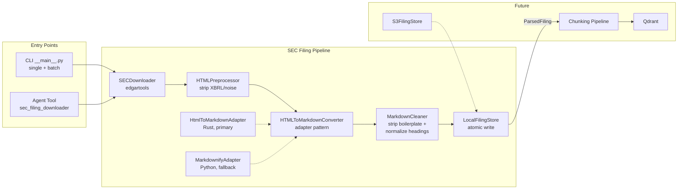

# SEC Filing Pipeline

Downloads SEC 10-K filings, converts them to RAG-friendly Markdown with YAML frontmatter, and caches locally.

## Architecture



## Pipeline Stages

| Stage | File | Responsibility |
|-------|------|----------------|
| Download | `sec_downloader.py` | Fetches filing HTML from SEC EDGAR via edgartools. Maps edgartools exceptions to domain errors. Requires `EDGAR_IDENTITY` env var. |
| Preprocess | `html_preprocessor.py` | Strips XBRL tags, removes decorative styles/hidden elements, unwraps `<font>` tags, normalizes hard-wrapped text whitespace (browser-equivalent collapsing), and promotes SEC Item patterns to semantic `<h>` headings. |
| Convert | `html_to_md_converter.py` | Converts cleaned HTML to Markdown. Primary: html-to-markdown (Rust-based). Fallback: markdownify (pure Python, for linux-aarch64). |
| Clean Markdown | `markdown_cleaner.py` | Strips converter-output boilerplate that has zero RAG value (cover pages, page separators, Part III stubs), and normalizes inconsistent Part / Item heading shapes across tickers. Conservative — preserves any section with substantive real content. See [Markdown Cleanup](#markdown-cleanup) below. |
| Store | `filing_store.py` | Persists `.md` files with YAML frontmatter at `data/sec_filings/{TICKER}/10-K/{fiscal_year}.md`. Atomic writes via temp file + `os.replace`. |
| Orchestrate | `pipeline.py` | `SECFilingPipeline` wires all stages. `process()` for single filing (JIT), `process_batch()` for multiple tickers with retry. |

## Data Model

Defined in `filing_models.py`:

- `FilingType` — StrEnum (`"10-K"`)
- `FilingMetadata` — Pydantic model with ticker, CIK, fiscal year, dates, converter name
- `ParsedFiling` — metadata + markdown content
- `RawFiling` — dataclass for downloader output (raw HTML + metadata)

## Cache Behavior

- **`fiscal_year` specified**: checks local cache first, skips download on hit
- **`fiscal_year=None`**: always contacts SEC to resolve the latest year, then checks cache for that year
- **`force=True`**: bypasses cache entirely

## Error Hierarchy

All inherit from `SECPipelineError`:

| Exception | Meaning | Retryable? |
|-----------|---------|------------|
| `TickerNotFoundError` | Invalid ticker | No |
| `FilingNotFoundError` | No filing for ticker/year | No |
| `UnsupportedFilingTypeError` | Filing type not supported | No |
| `TransientError` | Network/SEC temporary failure | Yes |
| `ConfigurationError` | Missing `EDGAR_IDENTITY` | No |

## Entry Points

### CLI

```bash
# Single filing (latest fiscal year)
uv run python -m backend.ingestion.sec_filing_pipeline AAPL 10-K

# Specific fiscal year, bypass cache
uv run python -m backend.ingestion.sec_filing_pipeline AAPL 10-K --fiscal-year 2024 --force

# Batch download
uv run python -m backend.ingestion.sec_filing_pipeline batch AAPL NVDA TSLA --filing-type 10-K

# Output control: --verbose (full metadata) or --json (machine-readable)
uv run python -m backend.ingestion.sec_filing_pipeline AAPL 10-K --json
```

Defined in `__main__.py`. Uses `argparse`, no extra dependencies.

### Agent Tool

`sec_filing_downloader` — LangChain `@tool` wrapping `SECFilingPipeline.process()`. Returns metadata + local file path for downstream RAG consumption. Registered in `backend/agent_engine/tools/sec_filing.py`.

Separate from the v1 tool `sec_official_docs_retriever` (in `tools/sec.py`), which calls edgartools directly without the pipeline.

## Key Design Decisions

| Decision | Choice | Rationale |
|----------|--------|-----------|
| Download tool | edgartools (existing dependency) | Free, AI-ready, built-in SEC rate limiting (10 req/sec) and caching, XBRL parsing for future v3 |
| edgartools role | Download + metadata only | Don't depend on its parsing — keep general HTML parsing skills transferable |
| Intermediate format | Markdown with heading hierarchy | Best LlamaIndex ecosystem support, human-readable for debugging, preserves all chunking options |
| HTML→MD converter | html-to-markdown (Rust) + markdownify fallback | ~208 MB/s compresses JIT latency; adapter pattern guarantees cross-platform compatibility |
| html-to-markdown version | `>=3.0.2,<4.0.0` | v3 API is better (structured result), v3.0.2 contains panic fix, v2 is EOL |
| LlamaParse | Not used | Portfolio project — practice chunking hands-on, reduce external dependencies and cost |
| Metadata format | YAML frontmatter in .md | Single file, no orphaned metadata, native support in Obsidian and similar tools |
| Storage key | `{ticker}/{filing_type}/{fiscal_year}.md` | Naturally unique, flat lookup, no index needed |
| Table handling | No special treatment — converted to Markdown tables inline | Numeric tables reserved for v3 DuckDB (XBRL); text/mixed tables go through RAG; eval-driven if special handling needed |
| Docker platform | `--platform linux/amd64` in Dockerfile | html-to-markdown lacks linux-aarch64 wheel; Rosetta 2 emulation perf impact is negligible |

## Known Constraints

| Constraint | Impact | Mitigation |
|------------|--------|------------|
| html-to-markdown lacks linux-aarch64 wheel | Docker on Apple Silicon needs platform flag | `--platform linux/amd64`; markdownify fallback |
| SEC HTML format inconsistency | Different companies/years have varying HTML structure | Preprocessor is rule-based and extensible — add a rule per noise pattern |
| Complex nested table conversion | colspan/rowspan may not convert perfectly | Not special-cased now; eval-driven decision if needed |
| Heading promotion limited to SEC Item patterns | Only `ITEM 1`, `ITEM 1A`, etc. are promoted to Markdown headings; other sub-section titles (e.g., segment names, accounting policy headers) remain as plain text with no heading markup | May produce large flat chunks with no structural splits below Item level, reducing RAG retrieval precision. Revisit if chunking quality is insufficient — add more promotion rules to `HTMLPreprocessor` |
| html-to-markdown is single-maintainer | Long-term maintenance risk | Adapter pattern allows switching to markdownify at any time |
| html-to-markdown major version churn | v3 lifecycle may be short | Pinned `<4.0.0`; adapter isolates library internals |

## Extension Guidelines

- **New filing type**: Add value to `FilingType` enum. Preprocessor heading patterns are 10-K specific — new types may need new patterns.
- **New preprocessor rule**: Add a method to `HTMLPreprocessor`, call it in `preprocess()`. Rules execute sequentially.
- **New converter**: Implement `HTMLToMarkdownConverter` protocol (`.name` property + `.convert()` method).
- **New cleanup rule**: Add a private `_strip_*` or `_normalize_*` method to `MarkdownCleaner`, call it from `clean()`. Run `backend/scripts/validate_sec_md_cleanup.py` against the cache before and after to confirm the new rule's impact and absence of regressions.

## Markdown Cleanup

The `MarkdownCleaner` step (added to the pipeline after `convert_with_fallback`) removes converter-output boilerplate that has zero RAG value and normalizes inconsistent Item / Part heading shapes across tickers. It is the **last** stage before the markdown is persisted, so the on-disk cache and any downstream chunking pipeline always see cleaned content.

### Why a separate stage (not in the HTML preprocessor)

| Reason | Detail |
|--------|--------|
| Page separators are a markdown converter artifact | The `---` page-break lines do not exist in the source HTML — they are emitted by `html-to-markdown` during conversion. Cannot be stripped at the HTML layer. |
| Cover-page anchor is more stable in markdown | At the HTML layer, the cover page is a tangle of `<div>` / `<table>` elements with no consistent selector. In markdown, `# Part I` (or fallback `## Item 1`) is a stable, ticker-agnostic anchor. |
| Part III stub detection is simpler in markdown | "incorporated by reference" plain-text matching is structurally simpler than walking HTML elements. |
| Heading normalization only makes sense in markdown | The casing inconsistencies (`## ITEM 1.BUSINESS`, `## Item 1A. Risk factors`) only appear after the converter has produced markdown headings. |

### Cleanup pipeline


### Cleanup rules

| Rule | What it removes | Conservative guards |
|------|-----------------|---------------------|
| **R1.1 Cover page strip** | Content between the YAML frontmatter and the first `# Part I` heading (registrant info, check marks, "DOCUMENTS INCORPORATED BY REFERENCE" narrative, the standalone Table of Contents block). | Falls back to `## Item 1` anchor when `# Part I` is missing (BAC, JNJ). If both are missing (GE 2008, INTC 2025, BRK.B), passes through with a warning — never deletes content blindly. |
| **R1.2 Page separator strip** | Bare `---` lines preceded by a blank or all-digit line, plus an optional `[Table of Contents](#anchor)` link on the line below. | Markdown table separators (`\| --- \| --- \|`, with or without spaces) are pipe-flanked and never match the regex. |
| **R1.3 Part III stub strip** | `## Item 10` through `## Item 14` sections whose body, after dropping every sentence containing "incorporated...by reference", contains < 100 non-whitespace, non-structural characters. | Strict word boundary `\b` on `1[0-4]` protects `Item 1A / 1B / 1C` (NVDA Cybersecurity is real content). The "drop ref sentences then count remaining" algorithm preserves hybrid sections like AMT Item 10 (~3000 chars of executive biographies + 1 ref sentence) and CRM Item 10 (~1200 chars of Code of Conduct policy). Markdown link / image syntax is stripped before counting so trailing image filenames don't keep stubs alive. |
| **R2 Heading normalization** | Standardizes Part headings to `# Part {Roman}` and Item headings to `## Item {num}. {Title}`. Title-cases ALL CAPS (`BUSINESS` → `Business`) and sentence-case (`Risk factors` → `Risk Factors`) titles. Preserves whitelisted abbreviations (`MD&A`, `SEC`, `U.S.`, `R&D`). | Mixed-case titles already in proper Title Case are left alone. Small connector words (`of`, `the`, `and`, ...) stay lowercase except as the first word. |
| **R2.1 Split-line title merge** | Merges next-line titles back into bare Item headings — both AMZN-style (`## Item 1.\nBusiness Description`) and AMT-style (`## ITEM 10.\n\n- DIRECTORS, EXECUTIVE OFFICERS`). | The dash-prefix branch requires the remaining text to be ALL CAPS or Title Case, so real bullet lists are not mistaken for split titles. |
| **R2.2 Truncated heading warning** | (Defensive) Logs a warning if a heading title is shorter than 5 characters after normalization. | Does not modify the heading — just emits a `logger.warning`. Currently has no trigger in the validation set; preserved against future converter regressions. |

### Conservative-cleanup principle

Every rule above is designed to **prefer leaving noise over risking deletion of real content**. The downstream LLM can filter noise during retrieval and reranking, but content that the cleanup stage drops is gone for good. If a rule cannot decide whether a chunk of content is boilerplate or real, the rule passes through and leaves the content alone — sometimes with a `logger.warning` for visibility, never with a silent delete.

This principle drove the most invasive design decision in the module: the Part III stub stripper does not use a length threshold or a "section contains keyword → delete" heuristic. Instead, it strips ref-sentences first and only deletes the section if essentially nothing real is left. The validation report at `artifacts/current/validation_cleanup_patterns.md` documents the specific filings that drove each rule.

### Validation set

The cleanup rules were derived and validated against **24 tickers / 29 10-K filings spanning 8 industries**:

| Industry | Tickers |
|----------|---------|
| Technology | NVDA (2024/2025/2026), AAPL (2010/2025), MSFT (2023/2024/2025), GOOGL, AMZN, TSLA, CRM, INTC |
| Financial | JPM, BAC, BRK.B |
| Energy | XOM |
| Consumer | KO, WMT, HD, DIS |
| Healthcare | JNJ, UNH |
| Industrial | BA, CAT, GE (2008) |
| Real Estate | AMT |
| Utility | NEE |
| Telecom | T |

The set includes deliberate edge cases: GE 2008 and INTC 2025 (no Part / Item headings at all — out of scope, pass-through path), BAC and JNJ (no `# Part I` anchor — Item 1 fallback), AMT and CRM (hybrid Item 10 — must preserve real content), AAPL 2010 (very old filing format), and CRM (duplicate Item 10-14 headings near TOC + actual Part III).

### Re-running validation

The validation script `backend/scripts/validate_sec_md_cleanup.py` walks the cache and produces a per-filing report. Re-run it whenever you change a cleanup rule or add new tickers — see [`backend/scripts/README.md`](../../scripts/README.md) for what each statistic in the report means.

```bash
uv run python backend/scripts/validate_sec_md_cleanup.py \
  --cache-dir data/sec_filings \
  --output artifacts/current/validation_cleanup_patterns.md
```

### Existing cache

The cleaner only runs during `_process_internal()`, which means cached filings produced before the cleaner was added are still in their pre-cleanup form. They will be cleaned the next time the pipeline reprocesses them — either when they expire from the cache logic, or when invoked with `--force`. The cleanup stage does not rewrite the cache retroactively.
