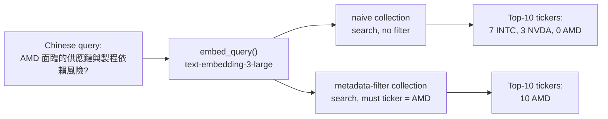

# Insights — Why This Experiment Exists

*The numbers behind these claims live in [`report.md`](report.md); this document is the narrative around them.*

## The question that started it

Ask a retrieval system "what supply-chain risk does AMD face?" and it does something that feels almost too obvious to question: it finds the passages whose *meaning* is closest to your question. That is exactly what an embedding-based vector search is built to do, and most of the time it works well enough that nobody thinks twice about it.

But "closest in meaning" and "about the right company" are not the same property, and dense retrieval has no built-in way to tell them apart. This experiment exists to put a number on how often that gap actually bites — and it turns out the answer is not a rounding error.

## Same vectors, one flag

Both arms of this experiment query the exact same 1,844 embedded chunks from six companies' 10-K filings. Nothing about the text or the embeddings differs. The only variable is whether the query carries a ticker filter:



The right-hand branch is not interesting on its own — of course a hard filter returns only AMD chunks, that is what filters do. The left-hand branch is the entire experiment. Run without a filter, on this specific question, the system returns **zero** chunks about the company being asked about. Every one of the ten passages it hands to a downstream LLM is Intel's or NVIDIA's language about *their* supply chains.

## What the model actually saw

Here is the naive arm's top five for that query, unfiltered:

| Rank | Ticker | Score | What it says |
|---|---|---:|---|
| 1 | NVDA | 0.5904 | "Dependency on third-party suppliers and their technology to manufacture, assemble, test…" |
| 2 | INTC | 0.5873 | "For certain products, components, services, materials and equipment, we rely on a single…" |
| 3 | NVDA | 0.5740 | "Long manufacturing lead times and uncertain supply and capacity…" |
| 4 | INTC | 0.5559 | "We have adopted a disaggregated design architecture…" |
| 5 | INTC | 0.5554 | "We rely upon a complex global supply chain…" |

None of these sentences are wrong, exactly — they are genuinely about supply-chain risk, genuinely well-written, and genuinely similar in meaning to the question. They are simply about the wrong company. Semiconductor 10-Ks describe supply-chain risk in strikingly similar language across issuers, because the risks themselves (fab dependency, single-source components, geopolitical exposure) are shared across the industry. The embedding model is not confused; it is doing exactly what cosine similarity does. The mismatch is a property of the *representation*, not a bug in the model.

**A detail worth pausing on:** the top NVDA/INTC scores here (0.59, 0.59, 0.57) are all *higher* than AMD's own best-matching chunk once the filter is applied (0.44, the top score in the filtered results). Nothing in the unfiltered ranking would have surfaced AMD's real answer even at rank 10 — it isn't a near miss, it's absent from the entire candidate pool the naive search considers relevant.

## Not every question breaks this way

Two of the eighteen questions score a perfect 1.0 with no filter at all:

| Query | Naive p@10 | Why it survives without a filter |
|---|:---:|---|
| 微軟雲端事業的營收成長動能來自哪裡?<br>*(Where does Microsoft's cloud revenue growth come from?)* | 1.0 | "微軟" + "雲端" + "營收成長" together concentrate almost entirely in MSFT's own filing text — no other issuer's language clusters nearby. |
| 英特爾製程技術轉型遇到哪些挑戰?<br>*(What challenges does Intel face in its process-technology transition?)* | 1.0 | Process-node transition is Intel's own unique narrative; the fabless companies in this corpus never discuss it because they don't run fabs. |

The pattern is consistent: **a question survives without a filter exactly when its entity signal is already strong enough to disambiguate in embedding space on its own.** A pre-filter adds nothing there — it's insurance you didn't need to collect on. The failure mode is specific to questions whose *topic* (supply chain, customer concentration, AI strategy) is shared across competitors, leaving only the *entity* to distinguish them — and entity is exactly the dimension embedding similarity is worst at preserving.

## The full spread

Precision@10 for all eighteen questions, grouped by target company (naive arm, no filter):

```
AAPL   0.73  ███████░░░
AMD    0.13  █░░░░░░░░░
GOOGL  0.47  █████░░░░░
INTC   0.80  ████████░░
MSFT   0.87  █████████░
NVDA   0.73  ███████░░░
```

AMD is not a mild outlier — it is the only ticker where retrieval systematically fails. Two structural facts explain why: AMD holds only 83 of the corpus's 1,844 chunks (4.5%), and its closest semantic neighbors are also its most direct competitors (Intel and NVIDIA, both fabless-adjacent, both writing about AI accelerators in comparable language). A large, distinctive vocabulary — Microsoft's cloud narrative, Intel's fab narrative — is enough to survive on embeddings alone. A small vocabulary shared with aggressive competitors is not.

Contamination sources track this exactly:

| Target | Gets confused with |
|---|---|
| AMD | Intel (direct rival), NVIDIA (fabless AI peer) |
| GOOGL | Apple (supply chain), Microsoft (cloud competition) |
| NVDA | Intel (same industry) |

The pairs that bleed into each other are, almost without exception, direct competitors — which is the worst possible failure mode for a research tool: it's most likely to hand you the wrong company's numbers precisely when that company is the one your reader is most likely to mix up with the right one.

## Why the filtered arm's 1.000 doesn't belong in this list

It would be easy to summarize this experiment as "0.622 without a filter, 1.000 with one" and call it a clean win. That framing is technically true and substantively empty. `must=[ticker=X]` is a hard constraint — Qdrant is *mathematically guaranteed* to return only points matching X, the same way `WHERE ticker = 'AMD'` in SQL is guaranteed to return only AMD rows. Measuring that constraint's effect and reporting it as retrieval quality would be measuring the filter, not the search.

The number that earns its place in this report is 0.622 — and more precisely, the shape around it: a standard deviation of 0.312 on a metric bounded between 0 and 1, ranging from a clean 0.0 to a clean 1.0 depending on which company you ask about. That variance is the real finding. It says the system's reliability on this question class is not just *lower* than expected without a filter — it is *unpredictable* per query, which is a harder problem to reason about than a uniformly mediocre score would be.

## What this validates

This corpus is small enough (1,844 chunks) that Qdrant's HNSW graph never gets stressed — the latency and recall benefits a tenant-aware index is supposed to provide at scale aren't something this experiment can measure. What it *does* establish, with real numbers instead of intuition, is the premise the production retrieval path is built on: SEC filings from competing companies are close enough in embedding space that entity scope cannot be left to similarity search alone. Metadata filtering isn't an optimization layered on top of retrieval quality — for a meaningful fraction of realistic questions, it's the difference between an answer and a hallucination wearing a citation.

The question this experiment deliberately does not answer — whether an upstream router can reliably extract *which* ticker to filter on from a natural-language question in the first place — is a separate failure mode, and a separate piece of work.
