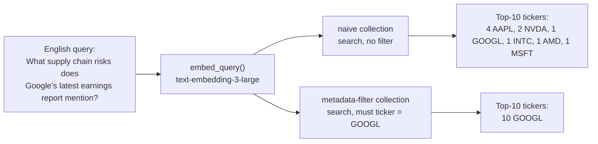

# Insights — What Changed, and What It Actually Explains

*The numbers behind these claims live in [`report.md`](report.md); this document is the
narrative around them.*

## Two bugs, one re-run

This re-run started as a simple substitution: swap the original experiment's 18 Chinese
questions for English ones, because production's retrieval tool is called with a query the
orchestrator has already reformulated into English, not whatever language the user typed.
That part was mechanical.

What wasn't mechanical: while setting the corpus back up, AMD's fiscal-2025 10-K came back
with only 83 chunks — the same count as the original experiment. That number had always been
the smallest in the corpus by a wide margin, and the original report's central finding leaned
on it: AMD supposedly gets "swallowed" by its semantic neighbors because it has the least
content to be found by. Two main-branch fixes, already merged by the time this re-run
started (`sec_core.py`'s filing-locate functions, then `SECDownloader`'s own independent copy
of the same logic), turned out to be about exactly this filing: both exclude 10-K/A
amendments from filing lookup. AMD's fiscal-2025 filing had a Part III amendment on file —
a routine annual event for many issuers — and every fetch path before those fixes was
silently returning the amendment instead of the original 10-K. An amendment covering only
Part III/IV of a 10-K is a fundamentally different, much smaller document than the filing it
amends. Cherry-picking both fixes onto this experiment's branch and re-ingesting turned
AMD's 83 chunks into 427, with Part I through IV present.

That fix invalidates the original experiment's headline number. It doesn't invalidate the
experiment's premise.

## Same mechanism, new example

Both arms of this experiment still query the same embedded chunks — now 2,187 of them across
six companies' 10-Ks. The only variable is still whether the query carries a ticker filter:



This is the new worst case in the dataset — p@10 = 0.10, one real GOOGL chunk in the naive
arm's top 10. Apple alone contributes four of the other nine. Both companies describe supply
shortages, single-source components, and manufacturing-partner dependency in structurally
similar disclosure language, because the underlying legal requirement (Item 1A risk factors)
produces structurally similar prose across issuers almost by design.

## AMD, corrected, is no longer unusual

The clean before/after: 83 chunks and 0.13 mean p@10 (three questions: 0.2, 0.2, 0.0)
becomes 427 chunks and 0.67 mean p@10 (0.8, 0.7, 0.5) — solidly mid-pack, close to AAPL and
NVDA. The original report's framing — "AMD is the smallest corpus, so it gets swallowed" —
was a real pattern in that data, but it was a pattern produced by comparing a truncated
amendment against five full annual reports, not evidence about small-cap corpora in general.
With a same-sized document for every ticker, AMD behaves like any other mid-cap comparator.

## What actually predicts the failure: the question, not the company

Re-sorting all eighteen questions by *topic* instead of by *ticker* is where the real
pattern lives:

```
Generic risk-factor questions   (supply chain, customer concentration)
  n=4    mean p@10 0.40   ████░░░░░░

Company-distinctive questions   (brand, product, named competitor)
  n=14   mean p@10 0.77   ███████░░░
```

Every single generic-topic question — regardless of which of the four companies it targets —
lands at or near the bottom of that company's own three results:

| Company | Its generic-topic question | p@10 |
|---|---|---:|
| GOOGL | supply chain risks in the latest earnings report | 0.1 |
| AAPL | supply chain concentration in hardware products | 0.5 |
| AMD | supply chain / manufacturing process dependency | 0.5 |
| NVDA | customer concentration | 0.5 |

Meanwhile the two cleanest results in the whole dataset — Intel's process-technology
transition (1.0) and Microsoft's cloud revenue growth (1.0) — are both questions whose
answer only exists in one filer's own vocabulary in this corpus: nobody else here runs a
fab, nobody else here has an "Azure" narrative. The entity signal is carried by the
*content*, not by the company name appearing in the query text.

This is a better explanation than "some tickers are more vulnerable than others," and it
survived the language switch and the AMD fix cleanly — it's visible in the original Chinese
run's per-ticker table too (Google's supply-chain question was already its worst of three,
even before this re-run), it just wasn't the framing either report led with.

## What this changes about the argument

The original report's most quotable claim — "AMD, the smallest corpus, gets swallowed" — was
a corpus-bug artifact and shouldn't be repeated. The claim this re-run actually supports is
less about *company size* and more about *disclosure-language genericness*: dense retrieval
struggles precisely where SEC's own disclosure format makes competitors sound alike, and a
metadata filter is the fix regardless of which company that happens to be, on any given day,
for any given question. That's a more defensible claim, and — per the per-query table in
[`report.md`](report.md) — a better-supported one.

The question neither this run nor the original answers: whether an upstream router can
reliably extract *which* ticker to filter on from a natural-language question in the first
place. Still a separate failure mode, still separate work.
