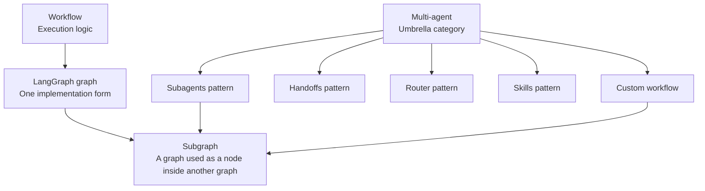
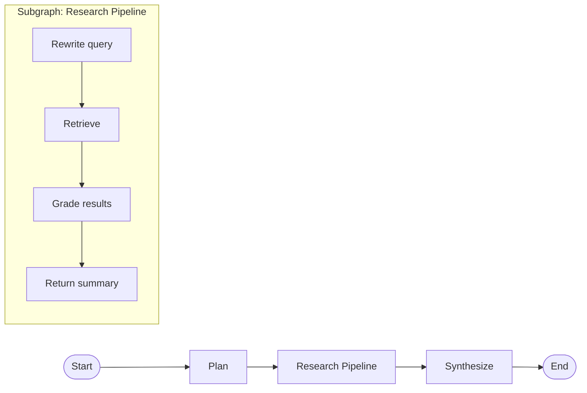
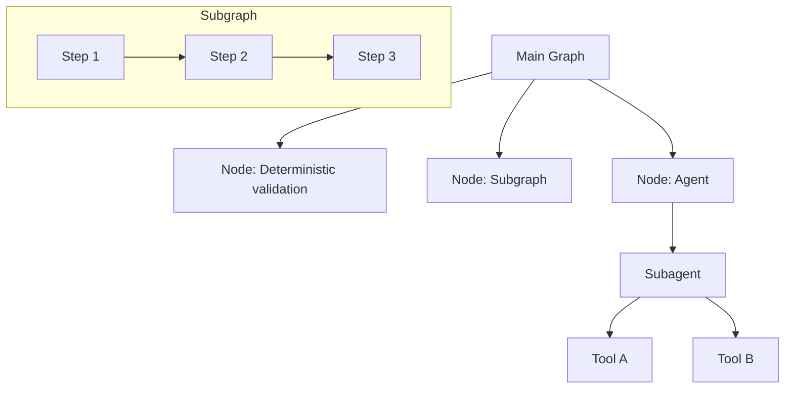
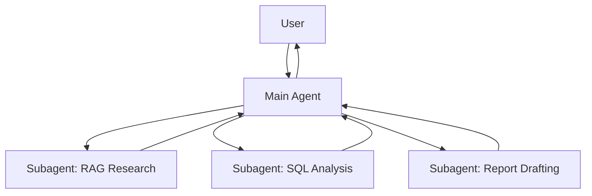
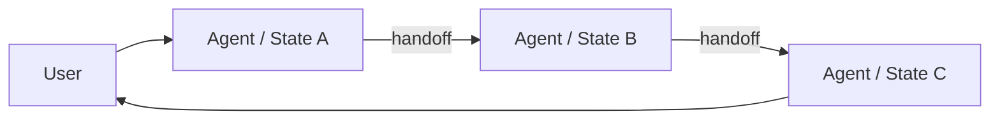
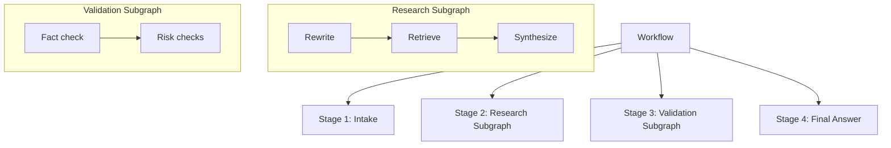

# Agent Patterns Primer

This document clarifies four commonly confused concepts in the LangGraph / Deep Agents ecosystem:

- `Workflow`
- `Subgraph`
- `Subagent`
- `Multi-agent`

It is intentionally conceptual. The goal is to separate:

- execution structure
- orchestration patterns
- agent delegation patterns

## TL;DR

- A `workflow` is the execution logic: what happens first, next, in parallel, conditionally, or in a loop.
- A `graph` is one way to represent a workflow in LangGraph.
- A `subgraph` is a graph used as a node inside another graph.
- `multi-agent` is an umbrella category for systems with multiple specialized agents.
- A `subagent` is one specific multi-agent pattern: a main agent delegates work to specialized agents as if they were tools.

## One Mental Model

## 1. What Is a Subgraph?

A `subgraph` is a graph that is embedded inside another graph as a node.

In practice, you use it when:

- you want to reuse a block of workflow logic
- you want one team to own one part of the system independently
- you want to isolate a complex internal process behind a clean input/output interface
- you want to model multi-agent behavior as composable graph pieces

Think of it as:

- **workflow meaning**: a reusable mini-process
- **software meaning**: a modular unit with a contract
- **LangGraph meaning**: a compiled graph inserted into a parent graph

The parent graph only needs to know:

- what input the subgraph expects
- what output the subgraph returns

It does not need to know the internal nodes.

## 2. Subgraph vs Subagent

These are different dimensions:

- `subgraph` is a **structural composition unit**
- `subagent` is a **delegation pattern involving an agent**

### Subgraph

- Can be fully deterministic
- Can contain no LLM at all
- Can contain one or more agents
- Exists to modularize graph logic

### Subagent

- Is itself an agent
- Usually has its own prompt, tools, and possibly model
- Is called by a main agent
- Exists to isolate context and specialization

The key point:

- **A subgraph does not need to be an agent**
- **A subagent may be implemented inside a graph**

So they can overlap, but they are not the same concept.

## 3. Multi-agent vs Agent + Subagent

`Multi-agent` is the broad category. `Agent + Subagent` is one specific architecture inside that category.

### Multi-agent

This means the system uses multiple specialized agents. That can be implemented in several patterns:

- `Subagents`: one main agent delegates to worker agents
- `Handoffs`: control moves between agents or states
- `Router`: a routing step dispatches to the right specialist
- `Custom workflow`: a LangGraph workflow coordinates several agents

### Agent + Subagent

This is specifically the **supervisor pattern**:

- one main agent owns the conversation
- subagents do focused work
- subagents usually return results to the main agent, not directly to the user
- the main agent keeps centralized control

By contrast, another multi-agent pattern such as `handoffs` looks different:

So the relationship is:

- `multi-agent` = category
- `agent + subagent` = one member of that category

## 4. Workflow vs Subgraph

These two are tightly related, but not interchangeable.

### Workflow

A `workflow` is the logic of execution:

- sequence
- branching
- loops
- retries
- parallelism

It answers:

- what should happen
- in what order
- under what conditions

### Subgraph

A `subgraph` is one modular building block inside that workflow.

It answers:

- how to package one part of the workflow as a reusable unit

A good rule:

- `workflow` is the whole movie
- `subgraph` is one scene packaged as a reusable module

## Practical Decision Rules

Use a `subgraph` when:

- you need modularity
- you want clean input/output boundaries
- you want to reuse a multi-step flow
- different teams own different parts of the system

Use a `subagent` when:

- the task needs specialized instructions
- the task needs its own tool set
- the task would bloat the main agent context
- the main agent should stay focused on coordination

Use a `custom workflow` when:

- you need explicit control over routing, loops, retries, or parallelism
- you want to mix deterministic code with agentic behavior
- you want to embed agents as nodes inside a larger execution graph

## Common Confusions

### "Is a subgraph always a smaller workflow?"

Usually yes in practice, but conceptually it is more precise to say:

- a subgraph is a graph node that contains another graph

### "Is a subagent always a subgraph?"

No.

A subagent is an agent-level delegation unit. It can be called through tools or embedded in a graph, but the concept is about delegation and context isolation, not graph nesting.

### "Can a workflow contain agents, subagents, and subgraphs together?"

Yes. That is common in real systems.

For example:

- top level: custom workflow
- inside one node: main agent
- inside that agent: subagents
- inside one branch: deterministic retrieval subgraph

## Recommended Reading

- LangGraph: Workflows and agents  
  https://docs.langchain.com/oss/python/langgraph/workflows-agents
- LangGraph: Subgraphs  
  https://docs.langchain.com/oss/python/langgraph/use-subgraphs
- LangChain: Multi-agent overview  
  https://docs.langchain.com/oss/python/langchain/multi-agent
- LangChain: Subagents  
  https://docs.langchain.com/oss/python/langchain/multi-agent/subagents
- LangChain Deep Agents: Subagents  
  https://docs.langchain.com/oss/python/deepagents/subagents
