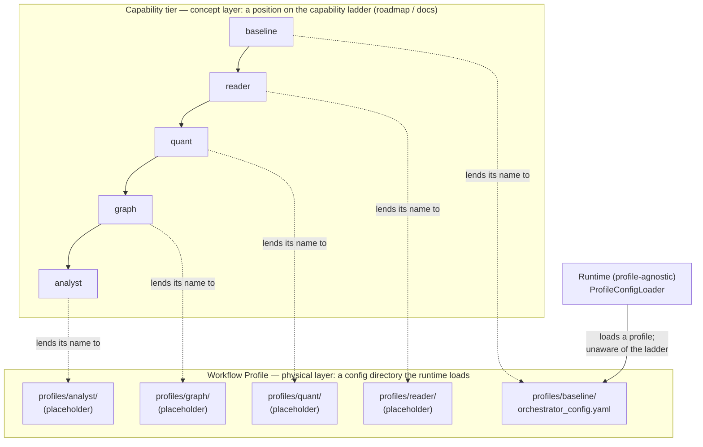
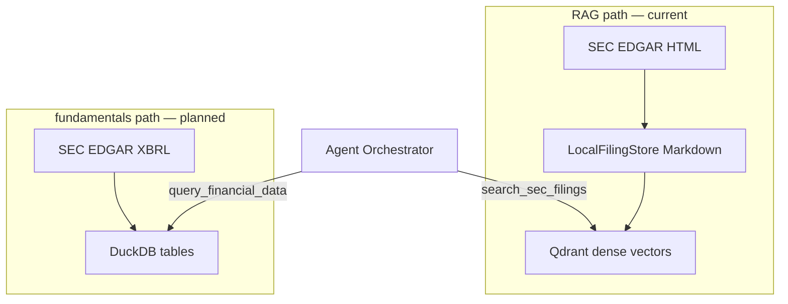
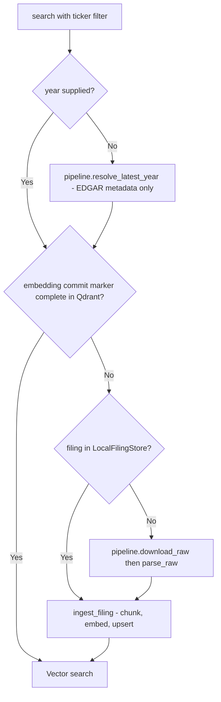

# FinLab-X Architecture Documentation

This document outlines the architectural principles, module structure, and workflow mechanisms of the FinLab-X AI Agent Engine.

## 1. Architecture Overview

FinLab-X utilizes a **Single Orchestrator** pattern. Instead of complex multi-agent routing that can lead to non-deterministic behavior and high latency, a central orchestrator manages the execution flow. This orchestrator leverages specialized components to perform tasks:

- **Orchestrator**: The central reasoning engine (typically a high-capability LLM) that manages state, plans steps, and selects tools.
- **Tools**: Atomic, stateless functions for specific data retrieval or actions.
- **Skills**: Higher-level, encapsulated capabilities that combine multiple tools or complex logic.
- **MCP (Model Context Protocol)**: Standardized interfaces for interacting with external data sources and services.
- **Subagents**: Short-lived, specialized agents spawned by the orchestrator for isolated sub-tasks (e.g., deep research or code generation).

## 2. Module Structure

The core AI runtime resides in `backend/agent_engine/`. The directory is organized as follows:

- `agents/`: Central reasoning engine (profile-agnostic Orchestrator). Contains `base.py`, `config_loader.py`, and `profiles/`.
- `tools/`: A library of atomic functions (e.g., `get_stock_price`, `search_sec_filings`).
- `skills/`: Complex, reusable capabilities (e.g., `perform_discounted_cash_flow_analysis`).
- `docs/`: Observability strategy and guardrails for Langfuse tracing; tracing wiring itself lives in `agents/base.py` (`CallbackHandler` + `propagate_attributes` + LangChain `config.metadata`).
- `mcp/`: (Planned) MCP integrations for external ecosystems.
- `subagents/`: (Planned) Short-lived specialized agents.
- `core/`: (Planned) Shared core primitives (state, memory).
- `infrastructure/`: (Planned) Integrations for persistence and external services.

## 3. Workflow Profiles

FinLab-X uses **Workflow Profiles** to manage the evolution of agent capabilities. Each profile is a self-contained configuration that defines how the agent behaves.

### Profile Mechanism

Profiles allow for rapid experimentation and safe rollbacks. By switching a profile ID, the system loads a different set of prompts, tool configurations, and model parameters.

### Capability Tiers

1.  **baseline**: Standard RAG (Retrieval-Augmented Generation) with basic financial tool access.
2.  **reader**: Optimized for long-context document analysis and multi-document synthesis.
3.  **quant**: Specialized in numerical reasoning, data visualization, and quantitative modeling.
4.  **graph**: Leverages knowledge graphs to understand complex corporate relationships and supply chains.
5.  **analyst**: The flagship profile, combining all previous capabilities into a comprehensive investment research assistant.

### Profile Directory Structure

Each profile in `backend/agent_engine/agents/profiles/` currently contains:

- `orchestrator_config.yaml`: Model selection (e.g., GPT-4o, Claude 3.5 Sonnet), temperature, and tool-specific limits.

Profiles beyond `baseline` will additionally include:

- `system_prompt.md`: The core identity and behavioral instructions for the agent.
- `README.md`: Documentation of the profile's specific use cases, strengths, and known limitations.

### Capability tier vs Workflow Profile

Two distinct concepts share the same five names, so it is worth being explicit about which layer a name refers to (see the `Capability tier` and `Workflow Profile` entries in [`CONTEXT.md`](../CONTEXT.md)):

- A **Capability tier** is a *position on the capability ladder* — a roadmap/documentation concept. It answers "how far up the ladder is this agent, and what does it add?" Nothing in the runtime resolves it; the answer lives in the roadmap.
- A **Workflow Profile** is a *config directory the runtime loads* (`orchestrator_config.yaml` + `system_prompt.md`). It answers "which bundle of prompt, model, and tools does the server start with?" `ProfileConfigLoader` reads the directory and is unaware the ladder exists.

They are 1:1 today, but not by definition. A future eval-only variant (e.g. `baseline_exp_a`) would be a Workflow Profile that is *not* a tier; conversely `graph` and `analyst` are tiers whose profiles are still placeholders. The runtime only ever loads a profile — so code, directories, and the loader all speak "profile", while "tier" stays in the roadmap and these docs.

## 4. Design Principles

- **Single Orchestrator**: Centralize decision-making to maintain control and reduce "agentic loop" overhead.
- **Progressive Disclosure**: Only expose tools and skills to the orchestrator when they are relevant to the current task to minimize prompt noise and token usage.
- **Observability First**: Every LLM call, tool execution, and state change must be traceable via LangSmith. If it isn't logged, it didn't happen.
- **Code as Interface**: Tools and skills are defined as strictly typed Python functions. This makes them the "API" that the LLM interacts with.

## 5. Dependency Rules

To maintain a clean architecture, the following dependency rules are enforced:

1.  **Orchestrator** can depend on `tools`, `skills`, `mcp`, `subagents`, and `observability`.
2.  **Subagents** can depend on `tools` and `mcp`.
3.  **Skills** can depend on `tools` and `mcp`.
4.  **Tools** and **MCP** must be independent and stateless; they cannot depend on the orchestrator or skills.
5.  **Circular Dependencies** are strictly prohibited.

## 6. Data Pipeline Architecture

The agent invokes two independent SEC data pipelines depending on the task. They share neither source format nor cache layer.

### RAG path — current

The RAG path retrieves unstructured text from 10-K filings. Two modules:

- `backend/ingestion/sec_filing_pipeline/` — downloads HTML from EDGAR, converts to Markdown, persists to `LocalFilingStore`. Single public entry: `SECFilingPipeline.process(ticker, filing_type, fiscal_year=None)` returning a `ParsedFiling`. Granular methods (`resolve_latest_year`, `download_raw`, `parse_raw`) are also public for callers that need finer-grained control or per-step tracing.
- `backend/ingestion/sec_dense_pipeline/` — chunks the Markdown, embeds with OpenAI `text-embedding-3-large`, stores in Qdrant. Idempotent via per-(ticker, year) commit markers (status `pending` / `complete`).

#### JIT cache-check flow

When `search()` receives a ticker filter, it checks two independent caches in order (embedding commit marker → local filing store) and only falls through to EDGAR on a miss at both tiers:

1. **Year resolution.** If `year` is omitted, `pipeline.resolve_latest_year` hits EDGAR's filing index for metadata only (no HTML download). Local store is never consulted as the source of truth for "what is latest".
2. **Embedding cache (dense vector layer).** Commit-marker points in Qdrant track per-(ticker, year) ingest status. A `complete` marker means chunks are already embedded and upserted — skip JIT entirely and go straight to vector search.
3. **Filing cache (markdown layer).** On embedding miss, check `LocalFilingStore` for the cached `ParsedFiling`. On hit, re-embed that markdown directly. On miss, call `pipeline.download_raw()` + `pipeline.parse_raw()` to fetch from EDGAR and persist the markdown locally.
4. **Ingest.** Always runs on embedding miss regardless of filing-cache state. Idempotent via UUID5 point IDs (same content → same IDs → safe re-run).

### Fundamentals path (foundation layer in place)

The fundamentals path supports structured numeric queries (e.g., "show me five-year revenue trend") by ingesting yfinance API responses and SEC XBRL — SEC's tagged financial data format — directly into DuckDB. **It does not share the RAG path's HTML→Markdown pipeline**: source format and downstream consumption pattern are fundamentally different. The two pipelines coexist as independent siblings.

The shared foundation lives under `backend/ingestion/fundamentals_pipeline/`:

- `duck_db/schema.sql` — single DDL source for eight tables (companies, market_valuations, quarterly/annual_financials, segment_financials, geographic_revenue, customer_concentration, ingestion_runs) with full `COMMENT ON COLUMN` coverage. Quarterly ↔ annual schemas are kept byte-for-byte mirrored (minus `fiscal_quarter`) by a test guard. `segment_financials` and `geographic_revenue` use a `period_type` discriminator plus a table-level `CHECK` to enforce `(period_type='quarterly' ⇔ fiscal_quarter ∈ 1..4)` and `(period_type='annual' ⇔ fiscal_quarter IS NULL)`.
- `duck_db/connection.py`, `duck_db/upsert.py`, `duck_db/row_models.py` — connection bootstrap, idempotent column-level merge (`updated_at` managed by the helper, not declared in DTOs), and five Pydantic row DTOs.
- `calendar_to_fiscal_period.py` — `normalize_fiscal_period(period_end, fiscal_year_end_month)` maps a calendar `period_end` date to `(fiscal_year, fiscal_quarter)`; the only supported conversion path.
- `ingestion_run_tracker.py` — `ingestion_run(...)` context manager writes one audit row per ETL invocation (success or error) to `ingestion_runs`; records `report.rows_written_total` on both paths so partial-write counts survive exceptions.
- `retry.py`, `errors.py` — `with_retry` exponential-backoff decorator scoped to `TransientError`, plus a six-class flat error taxonomy (root + five leaves) that subsystems subclass for domain-specific errors.
- `config/ticker_universe.yaml` + `ticker_universe_loader.py` — canonical ten-ticker cross-industry universe shared by batch CLI, `validate` subcommand, and agent-side boundary checks.

Subsystem fetchers (yfinance and SEC XBRL) consume this foundation and are out of scope for the foundation PR.

## 7. Observability and Tracing

All agent and pipeline operations are traced via Langfuse. Span naming uses `snake_case` with a `sec_` prefix for SEC-specific operations.

- **JIT path** through `search()` produces a full trace tree (cache check → EDGAR download → Markdown conversion → embedding → vector search).
- **Batch CLI** (`embed_sec_filings.py`) intentionally runs without tracing — pipeline modules emit no spans on their own; spans are created by the calling layer (retriever) only when needed.

For trace hierarchy, span definitions, and the rationale behind `@observe` vs. context-manager choices, see [`docs/observability.md`](./observability.md).
