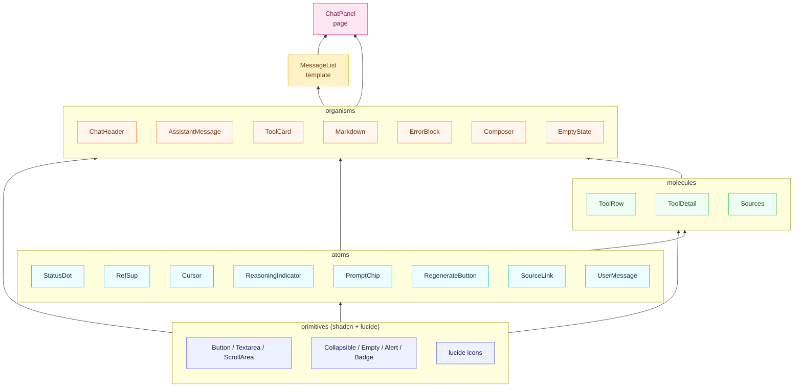
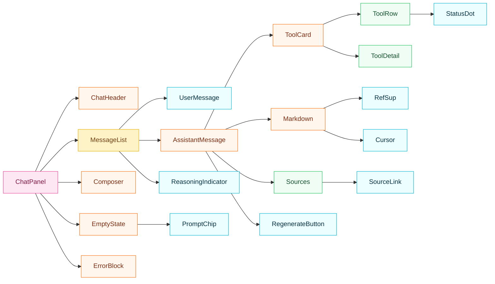
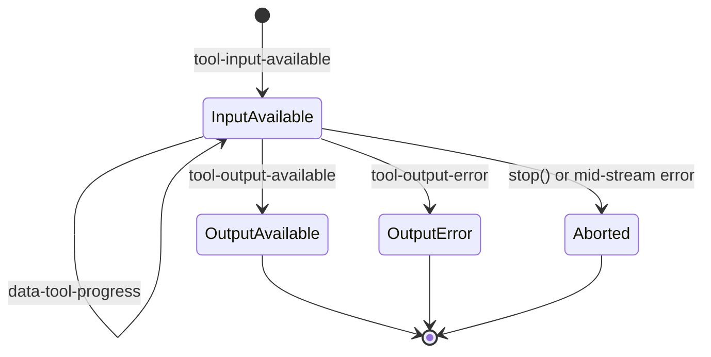
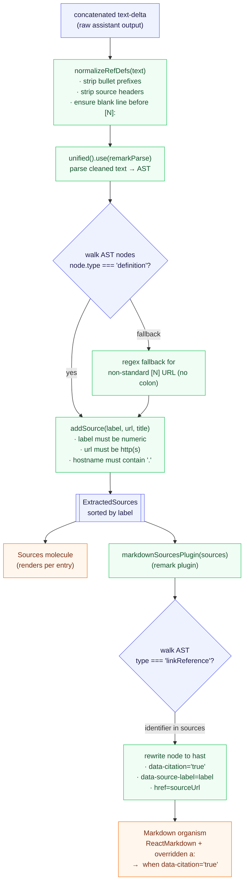

# Frontend Streaming Chat Architecture

This document records the architecture of the streaming chat UI (`frontend/src/components/pages/ChatPanel.tsx` and its dependencies). It captures decisions that are not obvious from the code: the atomic layering rule, where streaming state lives, and the AI SDK v6 behaviors the implementation relies on.

## 1. Scope

- Renders the SSE wire format emitted by `backend/api/routers/chat.py` (`start`, `text-delta`, `tool-input-available`, `tool-output-available`, `tool-output-error`, `data-tool-progress`, `error`, `finish`).
- Consumes the stream via `@ai-sdk/react` `useChat` + `DefaultChatTransport` from `ai`.
- Owns the full chat lifecycle in a single page component (`ChatPanel`); everything below is stateless or owns only local UI concerns.

## 2. Atomic 6-Layer Component Tree

### 2.1 Layer rule



| Layer | Classification rule | Examples |
|---|---|---|
| **primitives** | External/unmodified components. Two physical homes: `components/primitives/` (shadcn) and `node_modules/lucide-react`. **Do not hand-edit shadcn files** — they are overwritten by `pnpm dlx shadcn@latest add`. | `Button`, `Textarea`, `ScrollArea`, `Collapsible`, `Empty`, `Alert`, `Badge`, `AlertCircle`, `RefreshCw` |
| **atoms** | Leaf component OR trivial primitive wrapper (primitive + a fixed set of child elements, no structural composition of other project components). | `StatusDot`, `RefSup`, `Cursor`, `ReasoningIndicator`, `PromptChip`, `RegenerateButton`, `SourceLink`, `UserMessage` |
| **molecules** | Structural composition of atoms (multiple rows/columns/sections or ≥3 distinct children). Still `(props) => JSX` — no `useState`, no business logic. | `ToolRow`, `ToolDetail`, `Sources` |
| **organisms** | Uses `useState` / hooks, or is domain-aware (walks `UIMessage.parts`, reads `ToolUIPart.state`, etc.). | `ChatHeader`, `AssistantMessage`, `ToolCard`, `Markdown`, `ErrorBlock`, `Composer`, `EmptyState` |
| **templates** | Layout shell that accepts data via props; does not wire `useChat`. | `MessageList` |
| **pages** | Top-level orchestrator — the only layer that wires `useChat` and owns the chat lifecycle. | `ChatPanel` |

**Extension rule** — inline a new visual element at first use; extract to `atoms/` only on the second occurrence. Do not introduce `features/` or `hooks/` subfolders under `components/`; hooks live in `frontend/src/hooks/`.

### 2.2 Concrete composition graph

The layer diagram above shows which layer *may* depend on which. This graph shows the *actual* compositions that ship — what each component wraps in its render tree. Use it to trace which atom change affects which organism.



Design / review history that shaped this tree is captured under `artifacts/current/` (not tracked in git — see `artifacts/current/manual-verification-issues.md` and `code-review-improvement-report.md` in the local workspace).

## 3. State Ownership

Streaming lifecycle state lives in `ChatPanel` only. Atoms and molecules never import from `@ai-sdk/react`. Organisms accept `status` / `messages` as props but do not subscribe to chat state themselves.

| State | Owner | Responsibility |
|---|---|---|
| `messages`, `status`, `error`, `sendMessage`, `regenerate`, `stop`, `id` | `useChat` hook | AI SDK manages SSE lifecycle, message reconciliation, tool part state. |
| `chatId` | `ChatPanel` `useState<ChatId>` | Initialized with `crypto.randomUUID()`. `"Clear conversation"` sets a new UUID, passed as the `id` prop to `useChat`, which triggers an internal reset. |
| `toolProgress: Record<ToolCallId, string>` | `useToolProgress` hook | Subscribes to `useChat.onData`; writes transient `data-tool-progress` messages into a record. Cleared explicitly by `ChatPanel` on session reset. |
| `abortedTools: Set<ToolCallId>` | `ChatPanel` | Frontend-only marker for the 4th tool state (§5). Added on `stop()` or mid-stream `error` when tool is still `input-available`. Cleared on session reset or when the same turn is regenerated. |
| `lastTriggerRef` | `ChatPanel` `useRef` | Remembers the most recent `sendMessage` / `regenerate` metadata so `handleRetry` can dispatch correctly (§6). |
| `shouldFollowBottom` | `useFollowBottom` hook | Viewport scroll tracking with a 100px threshold; force-overrides on new user message. The hook owns both the state and the scroll side-effect. |

**Why `ChatPanel` owns `chatId` even though `useChat` has an `id` field**: `useChat.id` is read-only — there is no `setId`. To implement session reset we need to change the `id` prop from outside. Letting `useChat` auto-generate the id would forfeit reset control.

## 4. SSE Wire Format → UI Mapping

### Glossary: `UIMessage.parts`

AI SDK v6 models an assistant turn as a `UIMessage` whose content is an array of typed **parts**:

```ts
type UIMessage = {
  id: string;
  role: "user" | "assistant" | "system";
  parts: UIMessagePart[];
};
```

Each incoming SSE chunk is reduced into the corresponding part. The renderer simply does `message.parts.map(part => renderByType(part))`. The word `part` in this codebase (`part: ToolPart`, `parts.map((part) => ...)`) always refers to an element of `UIMessage.parts[]` — it is the SDK's own term, not a project invention.

Tool-specific parts are narrowed: `ToolCard` receives a `toolPart` prop after `AssistantMessage` has already filtered for `type === "tool-…"` or `type === "dynamic-tool"`.

### Chunk → part mapping

The backend emits AI SDK v6 `uiMessageChunkSchema`-compatible chunks. The frontend interprets them as follows:

| Backend SSE event | AI SDK `ToolUIPart.state` | UI render |
|---|---|---|
| `tool-input-available` | `input-available` | 🟠 StatusDot running + `toolProgress[id]` or `Calling {toolName}...` |
| `data-tool-progress` (transient sidecar) | — | `toolProgress[id] = message`; re-renders the running ToolCard. Never enters `messages`. |
| `tool-output-available` | `output-available` | 🟢 StatusDot success + generic label `Completed` + expandable INPUT/OUTPUT JSON |
| `tool-output-error` | `output-error` | 🔴 StatusDot error + friendly translated title (via `lib/error-messages.ts`) + expandable raw detail |
| `text-start` / `text-delta` / `text-end` | text part | Markdown incremental re-render + trailing `Cursor` while streaming |
| `error` | — (stream-level) | `useChat.error` set; `status → 'error'`. Does **not** append an `error` part to `messages` (see §7). |
| `finish` | — | `status → 'ready'` |
| _(no SSE — frontend-only)_ | `aborted` | ⚫ StatusDot gray + label `Aborted` + expandable INPUT |

## 5. Tool Card State Machine



`aborted` is a frontend-only 4th state — AI SDK's `ToolUIPart.state` enum has only three values (`input-available`, `output-available`, `output-error`). Entering `aborted` is triggered by `useChat.stop()` or a mid-stream `error` event while a tool is still `input-available`. Without this, a stopped tool would keep its pulsing dot and falsely imply "still running". `ChatPanel` tracks which tool call IDs are aborted via `abortedTools: Set<ToolCallId>`; `AssistantMessage` overrides the visual to `aborted` when dispatching parts.

## 6. Smart Retry Routing

`handleRetry` dispatches by the shape of `messages` at the time of retry:

| Situation | Action |
|---|---|
| Last message is `user` (pre-stream error, nothing streamed) | `sendMessage(originalUserText)` |
| Last message is `assistant` with partial parts (mid-stream error) | `regenerate({ messageId: lastAssistantMessage.id })` |
| Any pre-stream **4xx** on a regenerate attempt (race window) | Fall back to `sendMessage(originalUserText)` to avoid a 4xx loop on a stale `messageId` |

**No manual `messageId` stash is needed**. AI SDK v6 writes `start.messageId` directly into `state.message.id`, so `regenerate({ messageId: lastAssistantMessage.id })` already carries the backend-issued `lc_run--...` ID. Verified in `ai@6.0.142` (`node_modules/ai/dist/index.js`, chat store reducer) and against the live backend (see `scripts/v1-partial-regen-probe.sh`).

## 7. AI SDK v6 Contract Findings

The non-obvious behaviors of `@ai-sdk/react@3.0.144` + `ai@6.0.142` — SSE error routing, `stop()` semantics, partial-turn regenerate, wire format quirks — are documented in a dedicated reference: [`ai_sdk_v6_contract_findings.md`](./ai_sdk_v6_contract_findings.md).

## 8. Markdown & Sources: Defer-to-Ready

`react-markdown` does not expose unified's `file.data`, so a remark plugin cannot return `ExtractedSources` back to React. Two options were considered and rejected:

1. Run a standalone `extractSources(text)` on every `text-delta` — forces two full parses per delta and pushes `AssistantMessage` into stateful territory.
2. Patch `react-markdown` internals — not worth the maintenance burden.

The shipped strategy is **defer-to-ready**:

- While `status === 'streaming' && isLast`, skip `extractSources` entirely. Raw `[N]: url "title"` definition lines are briefly visible in the stream; `[N]` stays as literal text; no Sources block; no RefSup.
- When `status` leaves `streaming` (ready / error / stop), a `useMemo` in `AssistantMessage` runs `extractSources` exactly once. The derived text (with definition lines stripped) plus the sources array is handed to the stateless `Markdown` organism and the `Sources` molecule.

The UX is a "pop-in" at stream end, similar to ChatGPT / Claude.ai. Partial sources on error/stop are preserved because the `useMemo` also fires when the stream stops on error.

### 8.1 Parse flow — raw text to Sources block and RefSup



### 8.2 Citation structure

`extractSources` uses `remark-parse` (the same CommonMark parser `react-markdown` uses internally) to find `definition` nodes — this eliminates the drift that a custom regex would have against CommonMark. A separate `markdownSourcesPlugin` (registered on `<ReactMarkdown>`) runs at render time to tag `linkReference` nodes with `data-citation` and resolve `href` to the source URL. The anchor override in `Markdown.tsx` reads that attribute rather than sniffing link text, so a normal `[3](url)` whose text happens to be `3` is never mistaken for a citation.

## 9. Related Documents

- [`ai_sdk_v6_contract_findings.md`](./ai_sdk_v6_contract_findings.md) — SDK behaviors and wire-format quirks
- `frontend/src/components/README.md` — short structure map for contributors
- `frontend/src/__tests__/msw/README.md` — MSW test infrastructure and URL-gated worker
- `docs/frontend_dom_contract.md` — `data-testid` / `data-status` / `data-tool-state` principles and the `data-error-class` enum (testing surface of record)
- `backend/api/routers/chat.py` + `backend/tests/api/test_chat.py` — backend wire format
- `scripts/v1-partial-regen-probe.sh` — S1 partial-turn regenerate probe (see §7 findings)
